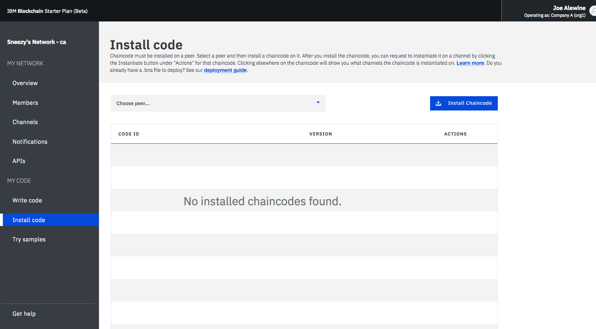
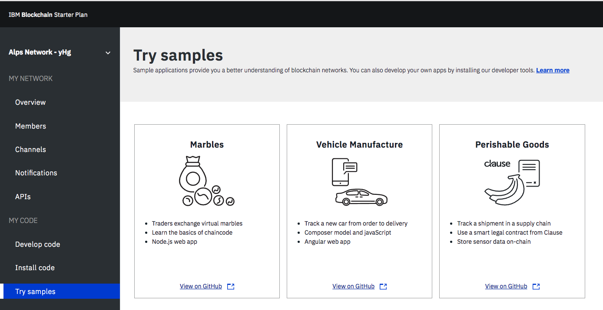
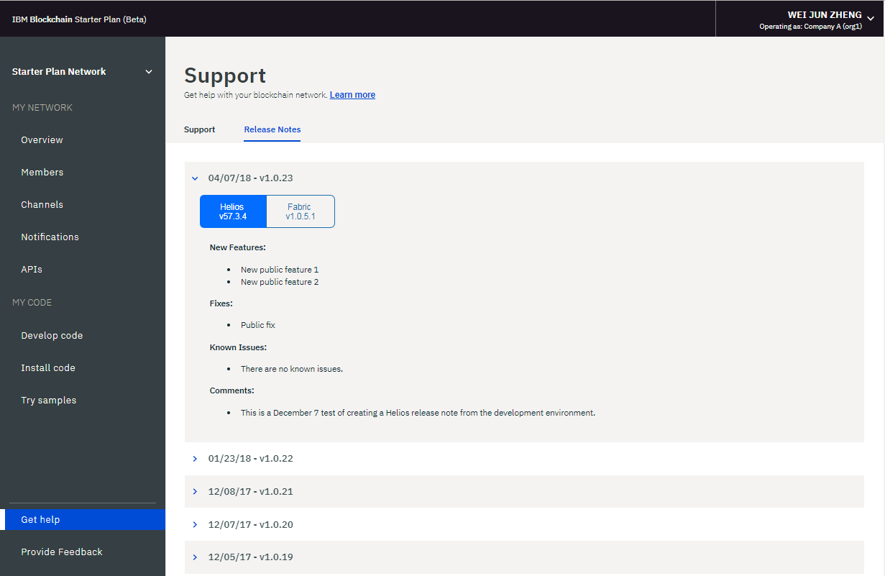
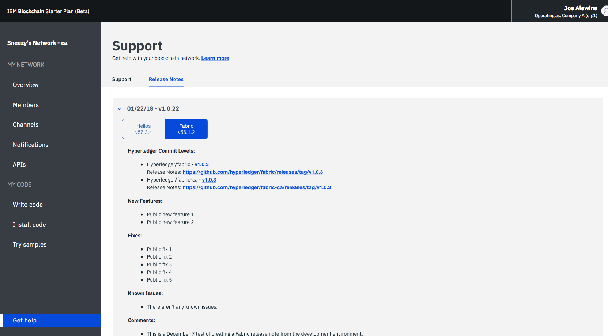
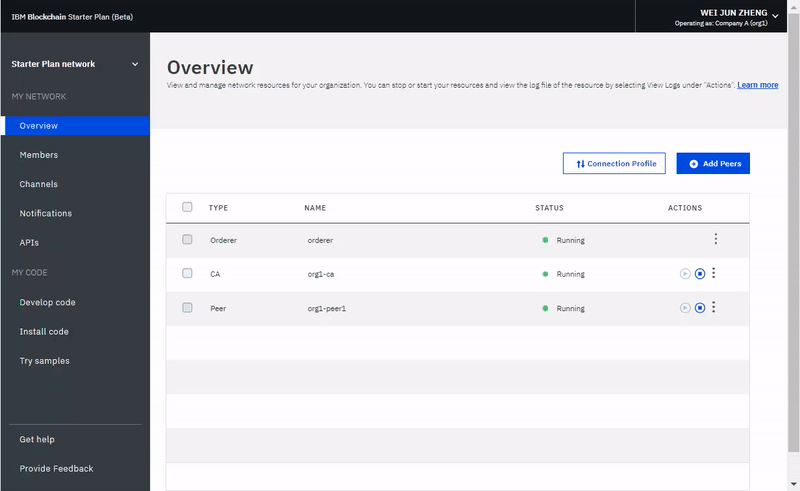

---

copyright:
  years: 2017, 2018
lastupdated: "2018-06-14"

---

{:new_window: target="_blank"}
{:shortdesc: .shortdesc}
{:codeblock: .codeblock}
{:screen: .screen}
{:pre: .pre}

# Exploitation d'un réseau de plan Starter
{: #operate-starter-plan-network}

La plateforme {{site.data.keyword.blockchainfull}} comporte un Moniteur réseau qui fournit une vue d'ensemble de votre environnement de blockchain, notamment des composants réseau, des membres, des canaux rejoints, des données de performance et du code blockchain déployé. Le Moniteur réseau constitue également un point d'entrée pour l'exécution des API Swagger, le développement d'un réseau avec la plateforme {{site.data.keyword.blockchainfull_notm}} : Develop, et le test de modèles d'application.
{:shortdesc}

Vous pouvez [changer le nom du réseau de votre plan Starter](#sp-network-name) ou [basculer entre les différents réseaux du plan Starter que vous créez](#switch-sp-network) dans le Moniteur réseau.

Le Moniteur réseau présente les écrans suivants dans trois sections. Vous pouvez accéder à chaque écran dans le navigateur de gauche du Moniteur réseau.
- La section **Mon réseau** contient les écrans "[Présentation](#overview)", "[Membres](#members)", "[Canaux](#channels)", "[Notifications](#notifications)" et "[API](#apis)".
- La section **Mon code** contient les écrans "[Ecriture de code](#write-code)", "[Installer le code](#chaincode)" et "[Essayer les modèles](#samples)".
- L'écran "[Obtenir de l'aide](#support)".

Vous pouvez [basculer entre les organisations](#switch-organizations) dont vous êtes propriétaire, [consultez les préférences réseau](#network-preferences) et [réinitialiser n votre réseau](#reset-network) à partir du menu déroulant dans l'angle supérieur droit du Moniteur réseau.

Ce tutoriel décrit chacun des écrans et fonctions ci-dessus.

## Mettre à jour le nom de réseau
{: #sp-network-name}

Lorsque vous créez un réseau du plan Starter, la plateforme {{site.data.keyword.blockchainfull_notm}} affecte un nom à votre réseau. Toutefois, vous pouvez à tout moment mettre à jour ce nom réseau dans votre Moniteur réseau.

Dans la partie supérieure gauche du Moniteur réseau, cliquez sur le nom de réseau et la zone devient éditable. Entrez le nouveau nom que vous voulez utiliser et appuyez sur **Entrée**. Le nom de votre réseau est mis à jour en quelques secondes.

La **Figure 1** illustre les étapes de mise à jour du nom de réseau du plan Starter : nom affecté remplacé par "Starter Plan Network".

*Figure 1. Mise à jour du nom réseau*

## Basculement entre les réseaux du plan Starter
{: #switch-sp-network}

Si vous créez plusieurs réseaux avec le plan Starter, vous pouvez basculer entre vos réseaux dans le Moniteur de réseau.

Dans la partie supérieure gauche du Moniteur réseau, cliquez sur l'icône en forme de flèche en regard du nom de réseau. Sélectionnez et cliquez sur le nom de réseau à partir duquel vous voulez basculer dans la liste déroulante. Votre navigateur s'actualise et ouvre le Moniteur réseau du réseau vers lequel vous basculez.

La **Figure 2** illustre les étapes de basculement vers un autre réseau du plan Starter.

*Figure 2. Basculement entre les réseaux*

## Présentation
{: #overview}

L'écran "Présentation" affiche des informations d'état en temps réel concernant vos ressources blockchain, notamment le programme de tri, l'autorité de certification et l'homologue. Chaque ressource s'affiche sous quatre en-têtes distincts : **Type**, **Nom**, **Statut** et **Actions**. Lorsque votre réseau démarre, un programme de tri, une autorité de certification et un homologue s'exécutent. L'autorité de certification est spécifique à l'organisation, alors que le programme de tri est un noeud final commun qui est partagé au sein du réseau.

La **Figure 3** illustre l'écran "Présentation" :

*Figure 3. Présentation du réseau*

### Actions de noeud
  L'en-tête **Actions** du tableau comporte des boutons qui permettent de démarrer ou d'arrêter vos composants. Vous pouvez également démarrer ou arrêter un groupe de noeuds en sélectionnant plusieurs noeuds et en cliquant sur le bouton **Démarrer les éléments sélectionnés** ou **Arrêter les éléments sélectionnés**. Le bouton **Démarrer les éléments sélectionnés** ou **Arrêter les éléments sélectionnés** apparaît au-dessus du tableau lorsque vous sélectionnez un ou plusieurs noeuds.

  Vous pouvez également consulter les journaux de composant en cliquant sur **Afficher les journaux** dans la liste déroulante sous l'en-tête **Actions**. Ces journaux présentent les appels de procédure entre les différentes ressources réseau et ils sont utiles pour le débogage et le traitement des incidents.

  **Remarque **: {{site.data.keyword.blockchainfull_notm}} Dans l'interface utilisateur du réseau de plan Starter, lorsque vous cliquez sur l'action Afficher les journaux sur les noeuds répertoriés dans le panneau Présentation, l'interface kibana d'IBM Cloud Logging est ouverte. Par défaut, kibana est préconfigurée pour afficher les journaux des 15 dernières minutes d'activité. S'il n'y a pas eu d'activité au cours des 15 dernières minutes, un message indique 'Aucun résultat trouvé'. Pour afficher tous les journaux, il vous suffit de cliquer sur l'icône temporisateur dans l'angle supérieur droit sous votre nom d'utilisateur et de définir un intervalle de temps plus large, comme 'cette semaine' ou 'ce mois'.

  Pour comprendre les effets de démarrage et d'arrêt d'un homologue, vous pouvez par exemple les tester en arrêtant un homologue et en le ciblant avec une transaction ; vous verrez alors des erreurs de connectivité dans les journaux. Lorsque vous redémarrez l'homologue et relancez la transaction, vous verrez qu'une connexion est réussie. Vous pouvez aussi arrêter un homologue pendant une longue période alors que vos canaux continuent à effectuer des transactions. l'homologue est redémarré, vous remarquez une synchronisation du registre dès qu'il reçoit les blocs qui ont été validés alors qu'il était arrêté. Une fois que le registre est complètement synchronisé, vous pouvez procéder à des appels et des requêtes normaux.

### Profil de connexion
  Vous pouvez consulter le ficher JSON pour les informations réseau de faible niveau de chaque ressource en cliquant sur le bouton **Profil de connexion**. Le profil de connexion contient toutes les informations de configuration dont vous avez besoin pour une application. Cependant, ce fichier contient uniquement les adresses de vos composants spécifiques et du programme de tri ; si vous devez cibler des homologues supplémentaires, vous devez obtenir leurs noeuds finaux. L'en-tête "url" affiche le noeud final d'API pour chaque composant. Ces noeuds finaux sont requis pour cibler les composants réseau spécifiques d'une application côté client, et leurs définitions résident généralement dans un fichier de configuration modélisé JSON qui est fourni avec l'application. Si vous personnalisez une application qui nécessite la validation d'homologues qui ne font pas partie de votre organisation, vous devrez obtenir ces adresses IP auprès des opérateurs concernés dans le cadre d'une opération externe. Les clients doivent pouvoir se connecter aux homologues dont ils attendent une réponse.

### Ajout d'homologues
{: #peers}
  Les membres du réseau doivent comporter des homologues qui stockent leurs copies de registre et exécutent du code blockchain pour interroger ou mettre à jour le registre. Si la règle de validation définit un homologue en tant qu'homologue d'adhésion, l'homologue renvoie également les résultats de la validation aux applications.

  Le plan Starter crée un homologue pour chacune des deux organisations par défaut. Vous pouvez ajouter d'autres homologues pour vos organisations en fonction de vos besoins. Vous pouvez vous trouver dans différents scénarios lorsque vous avez besoin d'homologues supplémentaires. Par exemple, vous pouvez souhaiter que plusieurs homologues rejoignent le même canal à des fins de redondance. Chaque homologue traite les transactions du canal et leurs copies respectives du registre. Dans le cas où l'un des homologues est défaillant, les autres peuvent poursuivre le traitement des transactions et des demandes d'application. Vous pouvez équilibrer de manière symétrique toutes les demandes d'applications entre homologues, ou vous pouvez cibler différents homologues pour différentes fonctions. Par exemple, vous pouvez utiliser un homologue pour interroger le registre et utiliser un autre homologue pour traiter les adhésions pour les mises à jour du registre.

  Cliquez sur le bouton **Ajouter des homologues** dans l'angle supérieur droit pour ajouter des noeuds homologue à votre réseau. Dans la fenêtre contextuelle "Ajouter des homologues", sélectionnez le nombre et la taille des noeuds homologue que vous voulez ajouter.

## Membres
{: #members}

L'écran "Membres" comporte deux onglets qui affichent des informations relatives aux membres du réseau (onglet "Membres") et des informations sur les certificats (onglet "Certificats").

### Membres
{: #members_tab}
La **Figure 4** illustre l'écran "Membres" initial qui affiche les membres de votre réseau sous l'onglet "Membres" :

*Figure 4. Membres du réseau*

Cliquez sur **Ajouter un membre** pour inviter d'autres membres à rejoindre votre réseau. Dans le plan Starter, vous avez deux options :
- **Inviter un membre**. Vous pouvez inviter d'autres organisations à devenir membres du réseau. Les organisation invitées peuvent rejoindre votre réseau et collaborer avec vous.
- **Créer un membre**. Vous pouvez également créer un membre en utilisant votre adresse e-mail. Vous avez sur ce dernier le même contrôle que sur les deux organisations que vous recevez avec le plan Starter par défaut.

**Figure 5** shows the "Add member" window.

*Figure 5. Ajouter un membre*

### Certificats
La **Figure 6** présente l'écran "Membres" initial qui affiche les certificats de membre sous l'onglet "Certificats" :

*Figure 6. Certificats*

Les opérateurs peuvent gérer les certificats des membres d'une même institution sous l'onglet "Certificats". Cliquez sur **Ajouter le certificat** pour afficher l'écran "Ajouter le certificat". Donnez un nom à votre certificat, collez vos certificats côté client au format PEM dans la zone "Clé", puis cliquez sur **Soumettre**. Vous devez redémarrer vos homologues pour que les certificats côté client puissent être pris en compte.

Pour plus d'informations sur la génération de votre clé de certificat, voir [Génération de certificats côté client](v10_application.html#generating-the-client-side-certificates).

## Canaux
{: #channels}

Les canaux, qui se composent d'un sous-ensemble de membres réseau qui souhaitent effectuer des transactions en privé, fournissent l'isolement de données et la confidentialité en autorisant les membres d'un canal à établir des règles spécifiques et un registre distinct, auxquels seuls les membres du canal peuvent accéder. Chaque réseau doit comporter au moins un canal pour que les transactions puissent s'effectuer. Chaque canal a un registre unique et les utilisateurs doivent être correctement authentifiés pour exécuter des opérations de lecture/écriture sur ce registre. Si vous n'êtes pas sur un canal, vous ne pouvez voir aucune donnée.

La **Figure 7** illustre l'écran de tableau de bord initial qui affiche une présentation de tous les canaux de votre réseau.

*Figure 7. Canaux*

La création d'un canal entraîne la génération d'un registre spécifique à un canal. Pour plus d'informations, voir [Création d'un canal](howto/create_channel.html).

Vous pouvez aussi sélectionner un canal existant afin d'afficher des détails plus précis sur ce canal, l'appartenance et le code blockchain actif. Pour plus d'informations, voir [Surveillance d'un réseau](howto/monitor_network.html).

## Notifications
{: #notifications}

Vous pouvez traiter les demandes en attente et consulter les demandes terminées dans l'écran "Notifications".

La **Figure 8** illustre l'écran "Notifications" :

*Figure 8. Notifications*

Lorsque vous créez un canal ou êtes invité à rejoindre un nouveau canal, une notification s'affiche dans le moniteur réseau.

Les demandes sont regroupées dans les sous-onglets "Toutes", "En attente" et "Terminée". Les nombres figurant à la suite de l'en-tête indiquent le nombre de demandes dans chaque sous-onglet.
   * Vous pouvez trouver toutes vos demandes sous le sous-onglet "Toutes".
   * Les demandes que vous n'avez pas acceptées ou que vous avez refusées, ou que vous n'avez pas encore consultées, figurent sous le sous-onglet "En attente". Cliquez sur le bouton **Inspecter la demande** pour consulter la demande, qui comporte la règle de canal et les membres, ainsi que le statut de vote. Si vous être un opérateur de canal, vous pouvez soit **Accepter** soit **Décliner** la demande, ou la traiter à un autre moment en cliquant sur **Plus tard**. Si la demande est acceptée par suffisamment d'opérateurs de canal, vous pouvez cliquer sur **Soumettre une demande** pour activer la mise à jour de canal.
   * Une demande soumise apparaît alors dans le sous-onglet "Terminée".  Vous pouvez cliquez sur **Inspecter la demande** pour afficher ses détails.

Si vous avez une longue liste de demandes, vous pouvez rechercher dans la zone de recherche située dans la partie supérieure de l'écran.

Les demandes en attente peuvent être supprimées en sélectionnant la case en regard et en cliquant sur **Supprimer la demande**.

## API
{: #apis}

{{site.data.keyword.blockchainfull_notm}} Platform expose dans Swagger un certain nombre d'API REST que vous pouvez utiliser pour gérer les noeuds, les homologues et les membres de votre réseau. Vos applications peuvent recourir à ces API pour gérer d'importantes ressources réseau sans utiliser le Moniteur réseau.

La **Figure 9** illustre l'écran "API" :

*Figure 9. API*

Cliquez sur le lien **Interface utilisateur swagger** pour ouvrir l'identificateur Swagger. Notez que vous devez autoriser l'interface utilisateur swagger à l'aide de vos données d'identification réseau (qui se trouvent sur la page d'API) avant d'exécuter les API. Pour plus de détails, voir [Test des API avec Swagger](howto/swagger_apis.html).

## Développement de code
{: #write-code}

Le plan Starter intègre la plateforme {{site.data.keyword.blockchainfull_notm}} : Develop et fournit un environnement de développement avec des outils et des technologies standard du secteur. Vous pouvez développer votre réseau d'entreprise dans l'environnement en ligne ou en local. Dès que vous avez développé un réseau d'entreprise, vous pouvez le redéployer dans votre réseau de plan Starter.

La **Figure 10** illustre l'écran "Développement de code" :

*Figure 10. Développement de code*

Pour plus d'informations sur le développement de réseaux d'entreprise et leur déploiement dans un réseau du plan Starter, voir [Développement de réseaux d'entreprise avec le plan Starter](develop_starter.html).

## Installer le code
{: #chaincode}

Le code blockchain, également appelé "contrat intelligent", est l'élément logiciel qui contient un ensemble de fonctions permettant d'interroger et de mettre à jour le registre. Ils sont installés sur des homologues et instanciés sur un canal.

La **Figure 11** illustre l'écran "Installer le code" :

*Figure 11. Code blockchain*

Un code blockchain est tout d'abord installé sur le système de fichiers d'un homologue, puis il est instancié sur un canal. Pour plus d'informations, voir [Installation, instanciation et mise à jour d'un code blockchain](howto/install_instantiate_chaincode.html).

## Essayer les modèles
{: #samples}

Des modèles d'application vous permettront une meilleure compréhension d'un réseau de blockchain et du développement d'application. <!--Starter Plan enables you to deploy and launch sample applications in the Network Monitor. --> Suivez les liens **Afficher sur GitHub** pour découvrir comment utiliser les modèles et les déployer sur {{site.data.keyword.blockchainfull_notm}} Platform. Pour plus d'informations sur le développement et le déploiement de vos modèles, voir [Déploiement de modèles d'application](howto/prebuilt_samples.html).

La **Figure 12** illustre l'écran "Essayer les modèles" :

*Figure 12. Essayer les modèles*

<!--
The sample deployment leverages the [DevOps Toolchain service ](https://console.bluemix.net/devops/toolchains) to automate your process of source control, delivery pipeline, and chaincode enablement. Choose a sample application, and click the **Deploy via Toolchain**. For more information, see [Deploying sample applications](howto/prebuilt_samples.html).
-->

## Obtenir de l'aide
{: #support}

L'écran "Obtenir de l'aide" comporte deux onglets qui fournissent des informations de support sous l'onglet "Support" et une description des fonctions nouvelles et modifiées de chaque édition sous l'onglet "Notes sur l'édition".

La **Figure 13** illustre l'écran "Support" initial qui comporte des informations de support sous l'onglet "Support" :

*Figure 13. Support Blockchain*

Utilisez les liens et les ressources de cet écran pour accéder à des forums de dépannage et de support.

* [Docs de service {{site.data.keyword.blockchainfull_notm}}](index.html), qui est le présent site de documentation, fournit une aide sur la mise en route de la plateforme {{site.data.keyword.blockchainfull}} sur {{site.data.keyword.Bluemix_notm}}. Vous pouvez accéder aux rubriques correspondantes depuis le navigateur de gauche ou rechercher un terme à l'aide de la fonction de recherche située en haut de l'écran.
* [IBM Developer Works ](https://developer.ibm.com/blockchain/) sous **Aide communautaire** comporte des ressources et des informations pour les développeurs.
* [IBM dWAnswers ](https://developer.ibm.com/answers/smartspace/blockchain/) sous **Ticket de demande de service** fait office de plateforme pour les questions et les réponses. Vous pouvez rechercher des réponses à des questions préalablement posées ou soumettre une nouvelle question. Assurez-vous d'inclure le mot clé **blockchain** dans votre question.
  Vous pouvez également soumettre un ticket pour l'équipe de support {{site.data.keyword.blockchainfull_notm}} à l'aide de l'option **Ouvrir un ticket de demande de service {{site.data.keyword.Bluemix_notm}}**.  Partagez les détails et les fragments de code de votre instance {{site.data.keyword.Bluemix_notm}} spécifique.
* [Modèles d'application](https://github.com/ibm-blockchain) sous **Modèles d'application blockchain** fournit une aide et des exemples de fragment de code pour vous aider dans le développement d'applications.
* [Hyperledger Fabric ](http://hyperledger-fabric.readthedocs.io/) et [Communauté Hyperledger Fabric](http://jira.hyperledger.org/secure/Dashboard.jspa) sous **Hyperledger Fabric** fournissent des données plus détaillées sur la pile Hyperledger Fabric.
  Dialoguez avec un [expert Hyperledger](https://chat.hyperledger.org/channel/general) si vous avez des questions sur le code Hyperledger Fabric.

Si vous ne parvenez pas à déboguer votre problème ou à obtenir une réponse à votre question, soumettez un cas sur le portail IBM Cloud Service Portal. Pour plus d'informations, voir [Support](ibmblockchain_support.html).

La **Figure 14** et la **Figure 15** illustrent l'écran "Support" initial qui comporte les fonctions nouvelles et modifiées de chaque édition sous l'onglet "Notes sur l'édition" :

*Figure 14. Notes sur l'édition pour Helios

*Figure 15. Notes sur l'édition pour Fabric*

## Basculement entre les organisations
{: #switch-organizations}

Si vous simulez un réseau de blockchain pour plusieurs organisations sur votre réseau, vous pouvez basculer entre les organisations dont vous êtes propriétaire, par exemple, l'organisation A. Ensuite, vous pouvez afficher et gérer les ressources réseau de l'organisation A, par exemple les homologues, les canaux et le code blockchain dans le Moniteur réseau. Cette fonction vous permet de créer un canal en appliquant les stratégies de canal et en ajoutant des homologues de plusieurs organisations au canal.

Cliquez dans l'angle supérieur droit de l'interface utilisateur, où vous devez voir votre nom. Dans le menu déroulant sous **Changer d'organisation**, choisissez le nom de l'organisation vers laquelle vous souhaitez basculer. L'organisation A est sélectionnée par défaut. Une fois que vous avez choisi une organisation vers laquelle basculer, votre Moniteur réseau est automatiquement actualisé et vous pouvez voir le réseau de cette organisation.

La **Figure 16** présente la fonction de "basculement entre les organisations" :

   
*Figure 16. Basculement entre les organisations*

## Préférences réseau
{: #network-preferences}

Cliquez dans l'angle supérieur droit et ouvrez le menu déroulant, puis les **Préférences réseau**. La fenêtre Préférences réseau s'affiche. Elle affiche les informations de base de votre réseau, comme le nom réseau, la version Fabric, l'emplacement réseau dans {{site.data.keyword.cloud_notm}}, ainsi que le type de base de données du registre. Si vous êtes l'initiateur du réseau, vous pouvez également gérer les délai d'inactivité Web dans la fenêtre des préférences réseau.

### Délai d'inactivité Web
{: #web-inactivity-timeout}

**Remarque **: Seul l'**initiateur réseau** peut modifier le paramètre de délai d'attente d'inactivité Web. Il s'agit d'un paramètre de niveau réseau et il concerne tous les membres réseau.

Le délai d'attente d'inactivité Web est défini sur **Désactivé** par défaut. Si vous définissez le délai d'attente d'inactivité Web sur **Activé**, tout membre du réseau sera déconnecté automatiquement au bout de 10 minutes d'inactivité. Lorsque le délai d'attente d'inactivité Web atteint 10 minutes, la fonction Délai d'inactivité Web met fin aux sessions Web inactives afin de garantir la sécurité du compte des membres du réseau. Si vous cliquez sur un lien ou si vous actualisez le Moniteur réseau, le délai d'inactivité Web est réinitialisé. Avant d'atteindre les 10 minutes, il est possible d'arrêter la session Web en fermant la fenêtre ou l'onglet du navigateur.

La **Figure 17** affiche la fenêtre "Préférences réseau" :

*Figure 17. Préférences réseau*

## Réinitialisation du réseau
{: #reset-network}

Le plan Starter vous offre la possibilité de modifier votre configuration réseau sans supprimer et recréer un réseau. Votre réseau est réinitialisé sur sa configuration réseau initiale, qui comprend deux organisations, un homologue par organisation, ainsi qu'un canal par défaut. Ceci est utile, par exemple, lorsque vous exécutez des tests sur le réseau de blockchain, ce qui vous permet de reprendre à partir d'un réseau relativement propre.

**Attention **: Une fois que vous avez réinitialisé le réseau, les noeuds finaux d'API de vos homologues, le programme de tri et l'autorité de certification sont modifiés. Vous devez ajuster les informations de noeud final d'API dans vos applications.

Cliquez dans l'angle supérieur droit et ouvrez le menu déroulant. Cliquez sur le bouton **Réinitialiser le réseau**. Si vous êtes prêt à réinitialiser votre réseau, cliquez sur **OK** pour continuer. Votre Moniteur réseau est actualisé pour refléter les nouveaux paramètres.

La **Figure 18** présente la fonction de "réinitialisation du réseau" :

*Figure 18. Réinitialiser le réseau*
