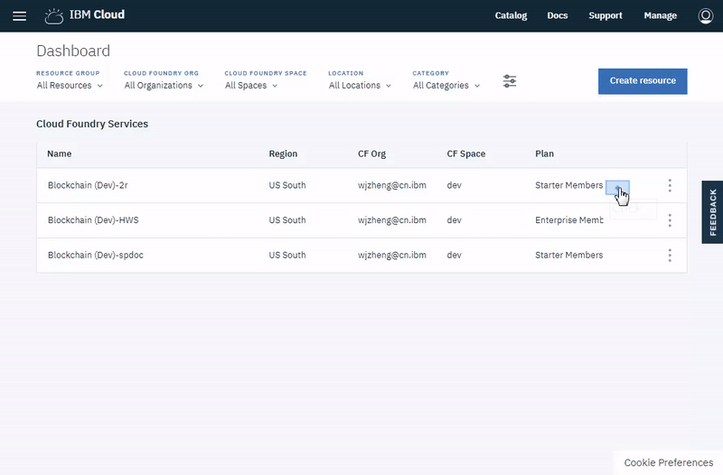

---

copyright:
  years: 2018, 2019
lastupdated: "2019-03-05"

subcollection: blockchain

---

{:new_window: target="_blank"}
{:shortdesc: .shortdesc}
{:screen: .screen}
{:codeblock: .codeblock}
{:pre: .pre}
{:tip: .tip}

# Initiation au plan Starter
{: #getting-started-with-starter-plan}

Le plan Starter d'{{site.data.keyword.blockchainfull}} Platform vous permet d'accéder d'un simple clic à un réseau de blockchain préconfiguré. Il met à disposition un réseau privé avec la configuration de deux [organisations](/docs/services/blockchain/glossary.html#glossary-organization), un [homologue](/docs/services/blockchain/glossary.html#glossary-peer) par organisation, et un [canal](/docs/services/blockchain/glossary.html#glossary-channel) par défaut. Une fois le réseau créé, vous pouvez le dimensionner et lui ajouter d'autres organisations et homologues. Ces réseaux sont destinés aux utilisateurs débutants qui découvrent {{site.data.keyword.blockchainfull_notm}} Platform. <!--Note that it might cause extra cost if you exceed the default resource limits of two organizations and two peers.-->
{:shortdesc}

Le plan Starter vous permet d'apprendre et de développer des compétences avec {{site.data.keyword.blockchainfull_notm}} Platform, d'exécuter des modèles d'application, de tester vos propres applications, et de simuler un scénario composé de plusieurs organisations. Ce tutoriel d'initiation vous explique comment utiliser un le plan Starter pour commencer à développer et effectuer des transactions sur un réseau de blockchain.

Si vous êtes un nouvel utilisateur de {{site.data.keyword.blockchainfull_notm}} Platform et de la blockchain, vous pouvez en apprendre davantage sur la blockchain en revoyant la [présentation des composants de base](/docs/services/blockchain/blockchain_component_overview.html#blockchain-component-overview) des réseaux basés sur l'open source [Hyperledger Fabric](/docs/services/blockchain/reference/v10_fabric.html#hyperledger-fabric). Vous pouvez également passer en revue la [documentation Hyperledger Fabric](http://hyperledger-fabric.readthedocs.io/en/release-1.2/blockchain.html "Introduction to Blockchain").

**Remarque **: le plan Starter d'{{site.data.keyword.blockchainfull_notm}} Platform est un environnement de tests et de développement, et il ne convient pas pour des charges de travail de production. Si vous avez besoin d'un environnement de production, consultez la section [A propos du plan Enterprise](/docs/services/blockchain/enterprise_plan.html#enterprise-plan-about).

## Présentation
{: #getting-started-with-starter-plan-overview}

**Génération de votre consortium**

La première étape dans la génération à l'aide de la technologue de blockchain consiste à former le consortium d'organisations qui souhaitent utiliser la blockchain pour effectuer des transactions, et de les inviter à rejoindre votre réseau. Les utilisateurs du plan Starter qui découvrent cette technologie peuvent simuler un consortium comprenant plusieurs organisations en créant eux-mêmes de nouvelles organisations.

- [Créer un réseau de plan Starter](/docs/services/blockchain/get_start_starter_plan.html#getting-started-with-starter-plan-creating-a-network)
- [Inviter des organisations à rejoindre votre réseau](/docs/services/blockchain/get_start_starter_plan.html#getting-started-with-starter-plan-inviting-members)
- [Rejoindre un réseau de plan Starter](/docs/services/blockchain/get_start_starter_plan.html#getting-started-with-starter-plan-joining-a-network)

Au sein du consortium d'organisations qui ont rejoint votre réseau, vous pouvez effectuer des transactions en privé avec quelques-unes de ces organisations en créant des canaux.

- [Créer des canaux](/docs/services/blockchain/get_start_starter_plan.html#getting-started-with-starter-plan-create-channels)

**Développer votre réseau et vos applications**

Une fois votre consortium formé, vous devez écrire le code blockchain, également appelé contrat intelligent, qui contiendra la logique métier de votre réseau et vous permet d'interagir avec les données du registre de blockchain. Vous devrez ensuite utiliser les logiciels SDK Fabric avec ces contrats intelligents pour soumettre des transactions sur votre réseau à partir de votre application côté client.

- [Développement de code blockchain](/docs/services/blockchain/get_start_starter_plan.html#getting-started-with-starter-plan-develop-chaincode)
- [Développement d'applications avec les logiciels SDK Fabric](/docs/services/blockchain/get_start_starter_plan.html#getting-started-with-starter-plan-develop-apps)

{{site.data.keyword.blockchainfull_notm}} Platform fournit des modèles d'application que vous pouvez déployer sur votre réseau de plan Starter en seulement quelques clics.

- [Déploiement de modèles d'application](/docs/services/blockchain/get_start_starter_plan.html#getting-started-with-starter-plan-sample-applications)

**Exploitation et gouvernance de votre réseau**

{{site.data.keyword.blockchainfull_notm}} Platform fournit des outils et des API que vous pouvez utiliser pour gérer l'appartenance, le cycle de vie et la santé de votre réseau de blockchain. Nombre de ces fonctions sont accessibles via l'interface utilisateur du Moniteur réseau.

- [Surveillance des ressources réseau](/docs/services/blockchain/get_start_starter_plan.html#getting-started-with-starter-plan-monitoring-resources)
- [Extraction des données d'identification réseau et du profil de connexion](/docs/services/blockchain/get_start_starter_plan.html#getting-started-with-starter-plan-retrieving-network-credentials)
- [Gestion de votre réseau à l'aide d'API Swagger](/docs/services/blockchain/get_start_starter_plan.html#getting-started-with-starter-plan-swagger)
- [Réinitialisation d'un réseau](/docs/services/blockchain/get_start_starter_plan.html#getting-started-with-starter-plan-resetting-network)
- [Migration d'un plan Starter vers un plan Enterprise](/docs/services/blockchain/get_start_starter_plan.html#getting-started-with-starter-plan-migrate)
- [Suppression ou sortie d'un réseau](/docs/services/blockchain/get_start_starter_plan.html#getting-started-with-starter-plan-delete-network)

## Création d'un réseau
{: #getting-started-with-starter-plan-creating-a-network}

Vous pouvez disposer d'un [réseau](/docs/services/blockchain/glossary.html#glossary-network) de plan Starter avec la configuration par défaut dès que vous avez créé une instance de service d'{{site.data.keyword.blockchainfull_notm}} Platform.

1. Localisez le [service blockchain ](https://cloud.ibm.com/catalog/services/ibm-blockchain-5-prod) dans le catalogue {{site.data.keyword.cloud_notm}}.
    **Remarque **: Vous devez vous connecter avec votre compte payant {{site.data.keyword.cloud_notm}}. Si vous n'avez pas de compte, cliquez sur le bouton **Inscrivez-vous pour créer**. Après que vous avez créé un compte d'essai gratuit, effectuez une mise à niveau vers un type **Paiement à la carte** en accédant à **Gérer** > **Facturation et utilisation** > **Facturation** dans la console {{site.data.keyword.cloud_notm}}, et en cliquant sur **Ajouter carte de crédit**.
2. Sélectionnez la région dans {{site.data.keyword.cloud_notm}} dans laquelle créer le réseau.
3. Sélectionnez votre organisation et espace Cloud Foundry pour créer le réseau.
4. Choisissez **Plan d'appartenance Starter** dans le tableau des plans de tarification.
5. Cliquez sur le bouton **Créer**. Notez que si vous êtes invité à rejoindre un réseau, vous pouvez voir une fenêtre de bienvenue. Pour créer un réseau, choisissez **Poursuivez avec votre réseau** et cliquez sur **Continuer**. Pour rejoindre un réseau, reportez-vous à l'étape 5 de la section [Rejoindre un réseau](/docs/services/blockchain/get_start_starter_plan.html#getting-started-with-starter-plan-joining-a-network).
  Vous êtes maintenant prêt à utiliser votre plan Starter avec la configuration par défaut. Le réseau se lance avec un service de tri (appelé service de tri "SOLO"), deux organisations, une AC et un homologue par organisation. Un canal par défaut est également créé.
6. Cliquez sur le bouton **Lancer**.

Vous pouvez trouver votre instance de service blockchain dans votre [Tableau de bord de service {{site.data.keyword.cloud_notm}} ](https://cloud.ibm.com/resources "Tableau de bord de service {{site.data.keyword.cloud_notm}}").

## Invitation de membres
{: #getting-started-with-starter-plan-inviting-members}

Vous pouvez inviter d'autres [organisations](/docs/services/blockchain/glossary.html#glossary-organization) à rejoindre votre réseau de plan Starter en tant que [membres](/docs/services/blockchain/glossary.html#glossary-member), de manière à pouvoir [effectuer des transactions](/docs/services/blockchain/glossary.html#glossary-transaction). En outre, si vous souhaitez utiliser le plan Starter Plan à des fins de formation et de tests, vous pouvez simuler un réseau composé de plusieurs organisations en ajoutant vous-même des membres au réseau.

1. A l'écran "Membres" de votre Moniteur réseau, cliquez sur le bouton **Inviter des membres**.
2. La fenêtre "Inviter un membre" s'affiche.
    - Si vous voulez inviter une autre organisation, choisissez "Inviter un membre".  Indiquez le nom et l'adresse e-mail opérateur de l'organisation à inviter.  Vous pouvez également entrer des informations supplémentaires à inclure dans votre invitation dans la zone "Ajouter une note".  Cliquez sur le bouton **Envoyer une invitation**.  L'organisation invitée recevra un e-mail d'invitation et elle pourra suivre les instructions qui y figurent pour rejoindre votre réseau.
    - Si vous souhaitez ajouter d'autres organisations pouvant être ajoutés à un canal, choisissez "Ajouter un membre".  Entrez un nom pour votre nouvelle organisation. Vous pouvez éventuellement ajouter des homologues à votre nouvelle organisation ou le faire ultérieurement dans le Moniteur réseau.  Cliquez sur le bouton **Créer**. Notez que si vous ajoutez des homologues pour votre nouvelle organisation, vous devez basculer vers cette nouvelle organisation pour voir vos homologues. Vous pouvez basculer vers une autre organisation en cliquant dans l'angle supérieur droit et en sélectionnant l'organisation cible dans la liste déroulante sous la section **Changer d'organisation**.

## Rejoindre un réseau
{: #getting-started-with-starter-plan-joining-a-network}

Si vous êtes invité par un initiateur du réseau, vous recevrez une notification par courrier électronique avec des instructions sur la manière de se connecter au réseau. Suivez les instructions fournies dans le courrier électronique afin de devenir l'un des membres du réseau.

Vous devez créer une [instance de service {{site.data.keyword.blockchainfull_notm}} Platform ](https://cloud.ibm.com/catalog/services/ibm-blockchain-5-prod) avec l'option d'appartenance du plan Starter dans {{site.data.keyword.cloud_notm}}.

1. Connectez-vous avec votre compte {{site.data.keyword.cloud_notm}}. Si vous n'avez pas de compte, cliquez sur le bouton **Inscrivez-vous pour créer**.
2. Sélectionnez l'organisation Cloud Foundry où vous voulez stocker votre réseau {{site.data.keyword.blockchain}}.
3. Sélectionnez **Plan d'appartenance Starter** dans le tableau des plans de tarification.
4. Cliquez sur le bouton **Créer**. La page d'instance de service affiche une page d'accueil en incrustation. Notez que vous pouvez choisir de rejoindre un réseau ou de continuer pour créer le votre. Pour créer un réseau, reportez-vous à l'étape 4 de la section [Création d'un réseau](/docs/services/blockchain/get_start_starter_plan.html#getting-started-with-starter-plan-creating-a-network).
5. Dans l'écran de bienvenue, choisissez **Rejoindre un réseau existant**, sélectionnez le réseau à rejoindre dans liste déroulante, puis cliquez sur **Continuer**.

Vous pouvez trouver votre instance de service blockchain dans le [Tableau de bord de service {{site.data.keyword.cloud_notm}} ](https://cloud.ibm.com/resources "tableau de bord de service {{site.data.keyword.cloud_notm}}").

## Créer des canaux
{: #getting-started-with-starter-plan-create-channels}

Les canaux permettent à des groupes d'organisations d'effectuer des transactions sans exposer les données à d'autres organisations. Vous pouvez ainsi créer un [canal](/docs/services/blockchain/glossary.html#glossary-channel) avec certains membres de votre réseau de plan Starter, ainsi que des règles indiquant qui peut mettre à jour le canal.

Pour plus d'informations, voir [Création d'un canal](/docs/services/blockchain/howto/create_channel.html#ibp-create-channel-creating-a-channel). Si une autre organisation vous invite à rejoindre un canal, vous trouverez aussi des instructions expliquant comment accepter l'invitation et joindre vos homologue au canal.

## Développement de code blockchain
{: #getting-started-with-starter-plan-develop-chaincode}

Le [code blockchain](/docs/services/blockchain/glossary.html#glossary-chaincode), parfois appelé contrats intelligents, est un logiciel qui vous permet de lire et de mettre à jour des données dans le registre de blockchain. Le code blockchain peut transformer la logique applicative en programme exécutable accepté et vérifié par tous les membres du réseau de blockchain.

Pour plus d'informations, voir le tutoriel relatif au [développement de code blockchain](/docs/services/blockchain/howto/develop_chaincode.html#develop-smart-contracts) pour en savoir plus sur la manière d'écrire du code blockchain, ainsi que sur les fonctions Fabric qui sont accessibles via le code blockchain.

## Installation et instanciation de votre code blockchain
{: #getting-started-with-starter-plan-install-instantiate-chaincode}
Après avoir rejoint des canaux et développé votre logique métier, vous devez installer du code blockchain sur les homologues du réseau. Vous pouvez utiliser le Moniteur réseau pour installer et instancier du code blockchain sur les homologues de votre organisation, ainsi que pour mettre à jour le code blockchain qui simplifie le développement continu.

Pour plus d'informations sur le déploiement d'exemples préalablement générés, voir [Installation, instanciation et mise à jour d'un code blockchain](/docs/services/blockchain/howto/install_instantiate_chaincode.html#install-instantiate-chaincode).

## Développement d'applications avec les logiciels SDK Fabric
{: #getting-started-with-starter-plan-develop-apps}

{{site.data.keyword.blockchainfull_notm}} Platform fournit des noeuds finaux d'API auxquels vous pouvez vous connecter à l'aide de logiciels SDK Fabric. Vous pouvez utiliser les logiciels SDK pour appeler du code blockchain depuis vos applications et soumettre des transactions à votre réseau de blockchain.

Pour plus d'informations, voir le tutoriel relatif au [développement d'applications](/docs/services/blockchain/v10_application.html#dev-app).

## Déploiement de modèles d'application
{: #getting-started-with-starter-plan-sample-applications}

Le plan Starter vous permet de déployer en quelques clics des modèles d'application sur votre réseau. Vous pouvez utiliser ces modèles pour en savoir plus sur le code blockchain, mais également les utiliser comme point de départ pour votre propre développement.

Pour plus d'informations, voir [Déploiement de modèles d'application](/docs/services/blockchain/howto/prebuilt_samples.html#deploying-sample-applications).

## Surveillance des ressources réseau
{: #getting-started-with-starter-plan-monitoring-resources}

Si votre application demande une transaction, vous pouvez afficher les informations d'état de transaction dans le Moniteur réseau. Pour plus d'informations sur la surveillance réseau, voir [Surveillance d'un réseau](/docs/services/blockchain/howto/monitor_network.html#monitor-blockchain-network).

## Extraction des données d'identification réseau et du profil de connexion
{: #getting-started-with-starter-plan-retrieving-network-credentials}

Dès que vous avez créé un réseau de plan Starter dans {{site.data.keyword.cloud_notm}}, vous pouvez obtenir les données d'identification réseau et le profil de connexion depuis la page d'instance de service ou le Moniteur réseau.

### Extraction à partir de la page d'instance de service
{: #getting-started-with-starter-plan-retrieve-service-instance}

Vous accédez à la page d'instance de service dès que vous créez une instance de service. Vous pouvez également cliquer sur votre service dans le [tableau de bord du service {{site.data.keyword.cloud_notm}} ](https://cloud.ibm.com/resources "tableau de bord du service {{site.data.keyword.cloud_notm}} ") pour ouvrir votre page d'instance de service.

Pour extraire les données d'identification de votre service, procédez comme suit :
1. Sur la page d'instance de service, cliquez sur **Données d'identification du service** dans le navigateur de gauche pour afficher l'écran "Données d'identification du service".
2. Cliquez sur **Nouvelles données d'identification** dans l'écran "Données d'identification du service".
3. Dans l'écran "Ajouter de nouvelles données d'identification", donnez un nom aux données d'identification et entrez **{"type": "service_instance_token"}** dans la zone "Ajouter des paramètres de configuration en ligne". Cliquez sur **Ajouter**. Les nouvelles données d'identification sont ajoutées dans le tableau. Vous pouvez cliquer sur **Afficher les données d'identification** sous la colonne "ACTIONS" pour afficher les détails des données d'identification. Ces données d'identification contiennent la clé d'API et la valeur confidentielle, que vous pouvez utiliser pour autoriser les API.

### Extraction dans le Moniteur réseau
{: #getting-started-with-starter-plan-network-creds}

Vous pouvez trouver les données d'identification réseau dans l'écran "API" de votre Moniteur réseau. Pour plus de détails sur l'utilisation des API, voir [Interaction avec le réseau à l'aide d'API Swagger](/docs/services/blockchain/howto/swagger_apis.html#ibp-swagger).

Vous pouvez extraire le profil de connexion dans l'écran "Présentation" de votre Moniteur réseau. Cliquez sur le bouton **Profil de connexion** dans l'écran "Présentation" et le profil de connexion s'affiche dans une nouvelle page.

## Gestion de votre réseau à l'aide d'API Swagger
{: #getting-started-with-starter-plan-swagger}

{{site.data.keyword.blockchainfull_notm}} Platform expose dans Swagger un certain nombre d'API REST que vous pouvez utiliser pour gérer les noeuds, les homologues et les membres de votre réseau. Vos applications peuvent recourir à ces API pour gérer d'importantes ressources réseau sans utiliser le Moniteur réseau.

Pour en savoir plus, voir [Interaction avec le réseau à l'aide d'API Swagger](/docs/services/blockchain/howto/swagger_apis.html#ibp-swagger)

## Réinitialisation d'un réseau
{: #getting-started-with-starter-plan-reset-nw}

Si vous souhaitez nettoyer vos configurations personnalisées, les exécutions de code blockchain ou des applications déployées, vous pouvez réinitialiser votre réseau à sa configuration initiale par défaut. Pour plus de détails, voir [Réinitialisation du réseau](/docs/services/blockchain/v10_dashboard.html#ibp-dashboard-reset-network).

## Migration d'un plan Starter vers un plan Enterprise
{: #getting-started-with-starter-plan-migrate}

Vous pouvez déployer du code blockchain, ainsi que des applications que vous testez sur un réseau de plan Starter dans un réseau de Plan Enterprise. Pour déployer un code blockchain que vous testez depuis un réseau de plan Starter dans un réseau de plan Enterprise, suivez les instructions de la section [Installation, instanciation et mise à jour d'un code blockchain](/docs/services/blockchain/howto/install_instantiate_chaincode.html#install-instantiate-chaincode-install-cc).

Seuls le code blockchain et les applications peuvent être migrés, les données ne peuvent pas être migrées entre les réseaux de plan Starter et Enterprise.

<!--
As you can see in [Deploying sample applications](/docs/services/blockchain/howto/prebuilt_samples.html#deploying-sample-applications), Starter Plan makes it easy to get a sample application integrated with your network by using Toolchain. This setup also allows for continuous integration by automatically updating your sample application whenever your forked application repo is changed. If you want to deploy this application into an Enterprise Plan network, you can copy your forked application repo into a new repo and then follow the instructions in [Deploying sample applications manually](/docs/services/blockchain/howto/prebuilt_samples.html#deploying-sample-applications#deploy_sample_applications_manually).
-->

Si vous déployez un modèle d'application dans votre réseau de plan Starter et voulez déployer cette application dans un réseau de plan Enterprise, vous pouvez copier votre référentiel d'application dévié dans un nouveau référentiel, puis suivre les instructions des modèles d'application pour les déployer dans votre réseau de plan Enterprise.

## Suppression ou sortie d'un réseau
{: #getting-started-with-starter-plan-delete-network}

Si vous voulez supprimer un réseau ou le quitter, vous pouvez supprimer l'instance de service de blockchain de votre tableau de bord {{site.data.keyword.cloud_notm}}.

Avant de quitter un réseau, vérifiez que vous n'êtes membre d'aucun des canaux du réseau. Dans le cas contraire, vous recevrez des messages lors de la sortie du réseau. Un retrait de membre de canal doit mettre fin au processus de mise à jour de canal. Pour plus d'informations sur le processus de mise à jour de canal, voir [Mise à jour d'un canal](/docs/services/blockchain/howto/create_channel.html#ibp-create-channel-updating-a-channel).{:note}
