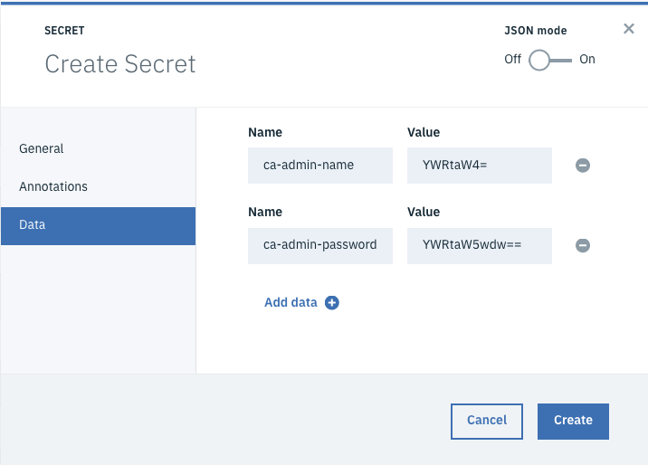

---

copyright:
  years: 2018, 2019
lastupdated: "2019-03-05"

subcollection: blockchain

---

{:new_window: target="_blank"}
{:shortdesc: .shortdesc}
{:screen: .screen}
{:codeblock: .codeblock}
{:note: .note}
{:important: .important}
{:tip: .tip}
{:pre: .pre}

# Déploiement d'une autorité de certification sur {{site.data.keyword.cloud_notm}} Private
{: #ca-deploy}

Une fois que vous avez importé la charte Helm d'{{site.data.keyword.blockchainfull}} Platform on {{site.data.keyword.cloud_notm}} Private, vous pouvez déployer les composants individuels. L'autorité de certification est la racine de confiance de votre entreprise et elle vous permet de générer des données d'identification pour les autres composants à déployer. Par conséquent, vous devez déployer une autorité de certification avant de déployer les autres composants. Chaque organisation dans un réseau de blockchain multi-cloud doit déployer sa propre autorité de certification.  Pour plus d'informations sur les autorités de certification et leur rôle dans un réseau de blockchain, voir [Autorités de certification](/docs/services/blockchain/blockchain_component_overview.html#blockchain-component-overview-ca).
{:shortdesc}

Avant de déployer une autorité de certification, passez en revue la section [Considérations et limitations](/docs/services/blockchain/ibp-for-icp-about.html#ibp-icp-about-considerations).

## Ressources obligatoires
{: #ca-deploy-resources-required}

Vérifiez que votre cluster {{site.data.keyword.cloud_notm}} Private respecte les exigences de ressources matérielles minimum :

| Composant | vCPU | RAM | Disque pour le stockage de données |
|-----------|------|-----|-----------------------|
| AC | 1 |192 Mo | 1 Go |

**Remarques :**
- Une unité vCPU est un coeur virtuel qui est affecté à une machine virtuelle ou à un coeur de processeur physique si le serveur n'est pas partitionné pour les machines virtuelles. Vous devez tenir compte des exigences vCPU lorsque vous décidez d'utiliser le coeur de processeur virtuel (VPC) pour votre déploiement dans {{site.data.keyword.cloud_notm}} Private. VPC est une unité de mesure pour déterminer les coûts de licences des produits IBM. Pour plus d'informations sur les scénarios VPC, voir [Virtual processor core (VPC) ](https://www.ibm.com/support/knowledgecenter/en/SS8JFY_9.2.0/com.ibm.lmt.doc/Inventory/overview/c_virtual_processor_core_licenses.html "Virtual Processor Core").
- Les exigences en termes de stockage de données dépendent du nombre d'identités et de certificats stockés. Le stockage des autorités de certification n'est pas aussi important que celui d'un homologue ou d'un service de tri, mais cela dépend du cas d'utilisation. Plus le nombre d'utilisateurs est utilisé, plus l'espace nécessaire est important.
- Ces niveaux de ressources minimum sont suffisants pour les tests et l'expérimentation. Pour un environnement avec un gros nombre de transactions, il est important d'allouer une quantité de mémoire suffisamment importante pour votre autorité de certification. La quantité de stockage à utiliser dépend du nombre de transactions et du nombre de signatures qui sont nécessaires depuis votre réseau. Si vous épuisez le stockage de votre autorité de certification, vous devez déployer une nouvelle autorité de certification avec un système de fichiers plus important et la laisser se synchroniser via les autres autorités de certification de sur les mêmes canaux.

## Stockage
{: #ca-deploy-storage}

Vous devez déterminer l'espace de stockage que votre autorité de certification va utiliser. Si vous utilisez les paramètres par défaut, la charte Helm crée un nouveau volume persistant de 2 Gi nommé `fabric-ca-pvc` pour votre autorité de certification.

Si vous ne voulez pas utiliser les paramètres de stockage par défaut, vérifiez qu'une *nouvelle* `storageClass` est définie lors de l'installation de {{site.data.keyword.cloud_notm}} Private ou l'administrateur système Kubernetes doit créer une storageClass avant le déploiement de l'autorité de certification.

Vous pouvez choisir de déployer l'autorité de certification sur les plateformes AMD64 ou S390X. Toutefois, vous devez savoir que la [Mise à disposition dynamique](https://kubernetes.io/docs/concepts/storage/dynamic-provisioning/) est uniquement disponible pour les noeuds AMD64 uniquement dans {{site.data.keyword.cloud_notm}} Private. Si votre cluster combine à la fois des noeuds worker S390X et AMD64, la mise à disposition dynamique ne peut pas être utilisée.

Si vous n'utilisez pas la mise à disposition dynamique, des[Volumes permanents ](https://kubernetes.io/docs/concepts/storage/persistent-volumes/) doivent être créés et configurés avec des libellés qui peuvent être utilisés pour affiner le processus de définition des accès Kubernetes PVC.

## Prérequis pour le déploiement d'une autorité de certification
{: #ca-deploy-prerequisites}

1. Avant d'installer un homologue sur {{site.data.keyword.cloud_notm}} Private, vous devez [installer {{site.data.keyword.cloud_notm}} Private](/docs/services/blockchain/ICP_setup.html#icp-setup) et [installer la Charte Helm de {{site.data.keyword.blockchainfull_notm}} Platform](/docs/services/blockchain/howto/helm_install_icp.html#helm-install).

2. Si vous utilisez Community Edition et souhaitez exécuter cette charte Helm sur un cluster {{site.data.keyword.cloud_notm}} Private sans connectivité Internet, vous devez créer des archives sur une machine connectée à Internet avant d'installer les archives sur votre cluster {{site.data.keyword.cloud_notm}} Private. Pour plus d'informations, voir [Adding featured applications to clusters without Internet connectivity ](https://www.ibm.com/support/knowledgecenter/SSBS6K_3.1.0/app_center/add_package_offline.html "Adding featured applications to clusters without Internet connectivity"){:new_window}. Remarque : Vous pouvez trouver le fichier de spécification manifest.yaml sous ibm-blockchain-platform-dev/ibm_cloud_pak dans la charte Helm.

3. Procédez à l'extraction de la valeur de l'adresse IP proxy du cluster depuis la console {{site.data.keyword.cloud_notm}} Private. **Remarque :** Vous devrez être [administrateur de cluster](https://www.ibm.com/support/knowledgecenter/en/SSBS6K_3.1.0/user_management/assign_role.html "Cluster administrator roles and actions") pour accéder à votre IP de proxy. Connectez-vous au cluster {{site.data.keyword.cloud_notm}} Private. Dans le panneau de navigation gauche, cliquez sur **Plateforme** puis sur **Noeuds** pour afficher les noeuds qui sont définis dans le cluster. Cliquez sur le noeud avec le rôle `proxy`, puis copiez la valeur de l'`IP hôte` de la table.

  Conservez cette valeur car vous allez l'utiliser lors de la configuration de la zone `Adresse IP du proxy` de la charte Helm.
  {:important}

4. Créez le nom d'utilisateur et le mot de passe admin de l'autorité de certification et stockez-les dans un objet secret dans {{site.data.keyword.cloud_notm}} Private. Vous trouverez les étapes de création de ce secret dans la [section suivante](/docs/services/blockchain/howto/CA_deploy_icp.html#ca-deploy-admin-secret).

## Création du secret admin de l'autorité de certification
{: #ca-deploy-admin-secret}

Lors du premier démarrage de votre autorité de certification, celle-ci contient une identité admin que vous créez pour utiliser votre autorité de certification. Vous devez créer un nom d'utilisateur et un mot de passe pour cette identité admin avant de déployer l'autorité de certification. Il est important de noter ces valeurs. Elles seront utilisées ultérieurement lors de l'utilisation de votre autorité de certification et du déploiement d'autres composants réseau. Créez un [secret Kubernetes](https://kubernetes.io/docs/concepts/configuration/secret/ "Secrets") pour stocker le `username` et le `password` admin de déploiement de votre autorité de certification. Un secret Kubernetes vous permet de protéger et de partager des informations sans avoir à les transmettre directement au déploiement.

1. Créez un nom d'utilisateur et mot de passe admin et encodez les valeurs au format base64. Exécutez les commandes suivantes dans une fenêtre de terminal et remplacez la valeur `admin` et `adminpw` par les valeurs que vous souhaitez utiliser.
  ```
  echo -n 'admin' | base64
  echo -n 'adminpw' | base64
  ```
  {:code_block}

  **Important :** Notez les valeurs de `admin` et `adminpw` qui sont créées plus haut. Notez également les valeurs codées de ces zones, qui sont obligatoires lorsque vous créez l'objet secret Kubernetes.

2. Connectez-vous à la console {{site.data.keyword.cloud_notm}} Private. Dans le panneau de navigation gauche, cliquez sur **Configuration** puis sur **Secrets**. Cliquez sur le bouton **Créer Secret** pour ouvrir un panneau en incrustation qui vous permet de générer un nouvel objet secret.

3. Sous l'onglet **Général**, remplissez les zones suivantes :
  - **Nom :** Donnez un nom unique à votre secret au sein de votre cluster. Vous utiliserez ce nom lors de la configuration de votre autorité de certification. Il doit être entièrement en minuscules.
  - **Espace de nom :** espace de nom pour l'ajout de votre secret. Sélectionnez l'`espace de nom` dans lequel vous voulez déployer votre autorité de certification.
  - **Type :** entrez la valeur `Opaque`.

4. Laissez l'onglet **Annotations** à blanc.

5. Sous l'onglet **Données**, ajoutez le nom d'utilisateur et le mot de passe en tant que paires clé-valeur.
  1. Dans la première zone **Nom**, entrez `ca-admin-name`.
  2. Dans la première zone **Valeur**, entrez le résultat de `echo -n admin | base64` de l'étape 1 plus haut.
  3. Cliquez sur le bouton **Ajouter des données** pour ajouter une seconde paire clé-valeur.
  4. Dans la seconde zone **Nom**, entrez `ca-admin-password`.
  5. Dans la seconde zone **Value**, entrez le résultat de `echo -n adminpw | base64` de l'étape 1 plus haut.  
    La **Figure 1** illustre ce que le secret de console {{site.data.keyword.cloud_notm}} Private peut contenir selon les valeurs que vous avez indiquées pour les clés `ca-admin-name` et `ca-admin-password`.

      
    *Figure 1. Secret de console {{site.data.keyword.cloud_notm}} Private*
  6. Cliquez sur **Créer** pour former un nouvel objet Secret.

La charte Helm de l'autorité de certification exige que vous utilisiez les noms `ca-admin-name` et `ca-admin-password` comme valeurs clés pour déployer le secret dans l'édition Helm.

**Remarque :** Le secret admin de l'autorité de certification n'est pas retiré de votre cluster {{site.data.keyword.cloud_notm}} Private lors de la suppression de votre édition Helm. Vous êtes responsable de la gestion de vos secrets dans votre cluster {{site.data.keyword.cloud_notm}} Private. Si vous prévoyez de déployer une autre autorité de certification dans le futur, vous pouvez réutiliser le secret admin de cette autorité de certification. Sinon, vous êtes responsable de sa suppression dans votre cluster {{site.data.keyword.cloud_notm}} Private.

## Configuration
{: #ca-deploy-configuration}

Une fois que vous avez créé le secret admin de votre autorité de certification, vous pouvez utiliser les étapes suivantes pour configurer et installer votre autorité de certification. Vous pouvez installer uniquement une autorité de certification à la fois.

1. Connectez-vous à la console {{site.data.keyword.cloud_notm}} Private et cliquez sur le lien **Catalogue** dans l'angle supérieur droit.
2. Cliquez sur `Blockchain` dans le panneau de navigation gauche afin de localiser la vignette libellée `ibm-blockchain-platform-prod` ou `ibm-blockchain-platform-dev` si vous avez téléchargé l'édition Community. Cliquez sur la vignette afin de l'ouvrir et consulter un fichier Readme qui contient des informations sur l'installation et la configuration de la charte Helm.
3. Cliquez sur l'onglet **Configuration** dans la partie supérieure du panneau ou cliquez sur le bouton **Configurer** dans l'angle inférieur droit.
4. Indiquez les valeurs relatives aux [paramètres de configuration généraux](/docs/services/blockchain/howto/CA_deploy_icp.html#ca-deploy-global-parameters) et acceptez le contrat de licence.
5. Ouvrez le bouton de développement `Tous les paramètres` et indiquez la valeur des [paramètres de configuration généraux](/docs/services/blockchain/howto/CA_deploy_icp.html#ca-deploy-global-parameters).
6. Faites défiler vers le bas jusqu'à la section **CA configuration**. Sélectionnez la case à cocher relative à l'`installation de l'autorité de certification` et remplissez les [paramètres de configuration](/docs/services/blockchain/howto/CA_deploy_icp.html#ca-deploy-parameters) de l'homologue.  
7. Cliquez sur **Installer**.

### Paramètres de configuration
{: #ca-deploy-configuration-parms}

Le tableau suivant répertorie les paramètres configurables de {{site.data.keyword.blockchainfull_notm}} Platform, **spécifiques au composant de l'autorité de certification**, ainsi que leurs valeurs par défaut.  

**Même si l'interface utilisateur de la charte Helm indique qu'aucune configuration supplémentaire n'est nécessaire, vous devez entrer certains paramètres pour déployer unE autorité de certification.**

#### Paramètres de configuration généraux et globaux
{: #ca-deploy-global-parameters}

|  Paramètre     | Description    | Val. déf  | Requis |
| --------------|-----------------|-------|------- |
| `Helm release name`| Nom de votre édition Helm. Doit commencer par une lettre minuscule et se terminer par une caractère alphanumérique, doit contenir uniquement des traits d'union et des caractère alphanumérique minuscules. Vous devez utiliser un nom d'édition Helm unique chaque fois que vous essayez d'installer un composant. | aucune | oui |
| `Target namespace`| Choisissez l'espace de nom Kubernetes pour installer la charte Helm. | aucune | oui |
|**Global configuration**| Paramètres qui s'appliquent à tous les composants de la charte Helm|||
| `Service account name`| Entrez le nom du compte de service [ ](https://kubernetes.io/docs/tasks/configure-pod-container/configure-service-account/ "Configure Service Accounts for Pods") que vous allez utiliser pour lancer le pod. | default | non |

#### Paramètres de configuration de l'autorité de certification
{: #ca-deploy-parameters}

|  Paramètre     | Description    | Val. déf  | Requis |
| --------------|-----------------|-------|------- |
| `Install CA`| Sélectionner pour installer une autorité de certification | non sélectionné | Oui, si vous souhaitez déployer une autorité de certification |
| `CA name`| Indiquez un nom à utiliser pour l'autorité de certification. **Important :** Notez cette valeur. Elle est obligatoire lorsque vous configurez un service de tri ou un homologue. | SampleOrgCA | oui |
| `CA worker node architecture`| Sélectionnez l'architecture de votre noeud worker {{site.data.keyword.cloud_notm}} Private (ADM64 ou S390X). | AMD64 | oui|
| `CA database type`| Type de base de données pour le stockage des données de l'autorité de certification. Seul SQLite est pris en charge. | SQLite | oui |
| `CA data persistence enabled` | Si sélectionné, les données seront disponibles au redémarrage du conteneur. Sinon, toutes les données seront perdues en cas de reprise en ligne ou de redémarrage du pod. | sélectionné | non |
| `CA use dynamic provisioning` | Sélectionnez pour activer la mise à disposition dynamique pour les volumes de stockage. | sélectionné | non |
| `CA storage class name`| Indiquez un nom de classe de stockage unique. Sinon, la classe de stockage par défaut dans le cluster est utilisée. | aucune | Dépend de la façon dont le cluster {{site.data.keyword.cloud_notm}} Private est configuré. Vérifiez auprès de votre administrateur de cluster |
| `CA existing volume claim`| Indiquez le nom d'une Réservation de volume persistant existante et laissez toutes les autres zones vides. | aucune | non |
| `CA selector label`| [Libellé de sélecteur ](https://kubernetes.io/docs/concepts/overview/working-with-objects/labels/ "Libellés et sélecteurs ") pour votre Réservation de volume persistant. | aucune | non |
| `CA selector value`| [Valeur de sélecteur ](https://kubernetes.io/docs/concepts/overview/working-with-objects/labels/ "Libellés et sélecteurs") pour votre Réservation de volume persistant. | aucune | non |
| `CA storage access mode`| Indication du [mode d'accès](https://kubernetes.io/docs/concepts/storage/persistent-volumes/#access-modes "Modes d'accès") au stockage pour la Réservation de volume persistant. | ReadWriteMany | oui |
| `CA volume claim size`| Choisissez la taille de disque à utiliser. | 2 Gi | oui |
| `CA image repository`| Emplacement de la charte Helm de votre autorité de certification. | ibmcom/ibp-fabric-ca | oui |
| `CA Docker image tag`| Valeur de la balise associée à l'image de l'autorité de certification. Cette zone est remplie automatiquement par la version de l'image. Ne la modifiez pas.| 1.2.1 | oui |
| `CA service type` | Utilisé pour indiquer si des [ports externes doivent être exposés ](https://kubernetes.io/docs/concepts/services-networking/service/#publishing-services-service-types) sur l'homologue. Sélectionnez NodePort pour exposer les ports en externe (recommandé), et ClusterIP pour ne pas exposer les ports. LoadBalancer et ExternalName ne sont pas pris en charge dans cette édition. | NodePort | oui |
| `CA secret (Required)`| Entrez le nom de l'objet secret Kubernetes que vous avez créé pour `ca-admin-name` et `ca-admin-password`. | aucune | oui |
| `CA CPU request`| Indiquez le nombre minimum d'UC à allouer à l'autorité de certification. | 1 | oui |
| `CA CPU limit`| Indiquez le nombre maximum d'UC à allouer à l'autorité de certification. | 2 | oui |
| `CA memory request`| Indiquez la quantité minimum de mémoire à allouer à l'autorité de certification. | 1 Gi | oui |
| `CA memory limit`| Indiquez la quantité maximum de mémoire à allouer à l'autorité de certification. | 4 Gi | oui |
| `CA TLS instance name`| Indiquez un nom pour l'instance TLS de l'autorité de certification qui sera utilisé pour enregistrer un service de tri ou un homologue. | tlsca | oui |
| `CSR common name`| Indiquez le nom usuel (CN) que le certificat racine généré par l'autorité de certification va présenter lorsqu'il sera contacté. | tlsca-common | oui |
| `Proxy IP`| Entrez l'[IP de noeud proxy pour le cluster](https://www.ibm.com/support/knowledgecenter/en/SSBS6K_3.1.0/installing/install_proxy.html "IBM Cloud Private installation behind an HTTP proxy") ou l'autorité de certification est déployée. | 127.0.0.1 | oui |


### Utilisation de la ligne de commande Helm pour installer l'édition Helm
{: #ca-deploy-helm-cli}

Vous pouvez aussi utiliser l'interface de ligne de commande Helm pour installer l'édition Helm. Avant d'exécuter la commande `helm install`, assurez-vous [d'ajouter le référentiel Helm de votre cluster à l'environnement de l'interface de ligne de commande Helm](https://www.ibm.com/support/knowledgecenter/SSBS6K_3.1.0/app_center/add_int_helm_repo_to_cli.html "Adding the internal Helm repository to Helm CLI").

Vous pouvez définir les paramètres requis pour l'installation en créant un fichier `yaml` et en le transmettant à la commande `helm install` suivante.

```
helm install --name <helm_release_name>  <helm_chart> \
--version <helm_chart_version> \
--values <customvalues.yaml> \
--tls
```
{:codeblock}

Où :

- `<helm_release name>` représente le nom que vous voulez affecter à votre édition Helm.
- `<helm_chart>` représente le nom de la charte Helm importée dans le catalogue.
- `<helm_chart_version>` représente la version de la charte Helm importée dans le catalogue.
- `<customvalues.yaml>` est le nom du fichier yaml qui contient les paramètres de configuration.

Par exemple :

```
helm install --name jnchart2 mycluster/ibm-blockchain-platform \
--version 1.1.0 \
--values ca-s390x-values.yaml \
--tls
```

Vous pouvez créer un nouveau fichier `yaml` en éditant `values.yaml` qui est inclus dans le fichier archive téléchargé. Le fichier `values.yaml` inclut tous les paramètres nécessaires avec leurs valeurs par défaut.

## Vérification de l'installation de l'autorité de certification
{: #verifiying-ca-installation}

Une fois que vous avez entré les paramètres de configuration et cliqué sur le bouton **Installer**, cliquez sur le bouton **Afficher l'édition Helm** pour afficher votre déploiement. Si l'opération aboutit, vous devez voir la valeur 1 dans les zones `DESIRED`, `CURRENT`, `UP TO DATE` et `AVAILABLE` dans le tableau Déploiement. Vous devrez peut-être cliquer sur Actualiser et attendre que le tableau soit mis à jour. Vous pouvez aussi afficher le tableau Déploiement en cliquant sur l'icône **Menu** dans l'angle supérieur gauche sur la console {{site.data.keyword.cloud_notm}} Private. Dans la liste de menus, cliquez sur **Charges de travail**, puis sur **Editions Helm**.

Si vous faites défiler jusqu'à la section `Remarques`, vous verrez des informations importantes relatives à l'[exploitation de votre autorité de certification](/docs/services/blockchain/howto/CA_operate.html#ca-operate).

Une fois que vous avez installé une autorité de certification {{site.data.keyword.blockchainfull_notm}} Platform dans {{site.data.keyword.cloud_notm}} Private, un configmap est créé avec les paramètres de variables d'environnement par défaut. Vous pouvez ensuite changer ou ajouter des variables d'environnement pour l'autorité de certification afin de configurer son comportement. Pour plus d'informations sur les paramètres de configuration du serveur de l'autorité de certification, voir [la documentation du serveur d'autorité de certification Fabric](https://hyperledger-fabric-ca.readthedocs.io/en/latest/users-guide.html#fabric-ca-server "Fabric CA Server").

Après avoir configuré configmap, vous devez redémarrer le serveur de l'autorité de certification pour que les modifications prennent effet. Pour redémarrer le serveur d'autorité de certification, vous pouvez supprimer le pod du serveur d'autorité de certification Fabric. {{site.data.keyword.cloud_notm}} Private créera un nouveau pod reflétant les modifications.

## Affichage des journaux de l'autorité de certification
{: #ca-deploy-view-logs}

Les journaux de composant peuvent être affichés à partir de la ligne de commande à l'aide de [`commandes de l'interface CLI kubectl`](/docs/services/blockchain/howto/CA_operate.html#ca-operate-kubectl-configure) ou via [Kibana ](https://www.elastic.co/products/kibana "Votre fenêtre dans Elastic Search"), qui est inclus dans votre cluster {{site.data.keyword.cloud_notm}} Private. Pour plus d'informations, consultez les [instructions relatives à l'accès aux journaux](/docs/services/blockchain/howto/CA_operate.html#ca-operate-view-logs).

## Utilisation de votre autorité de certification
{: #ca-deploy-operate}

Votre autorité de certification sera la racine de confiance pour votre organisation. Vous devez utiliser votre autorité de certification pour générer les certificats de vos autres composants.  Par conséquent, avant de déployer un service de tri ou un homologue, vous devez [configurer votre autorité de certification et effectuer plusieurs étapes opérationnelles](/docs/services/blockchain/howto/CA_operate.html#ca-operate)
