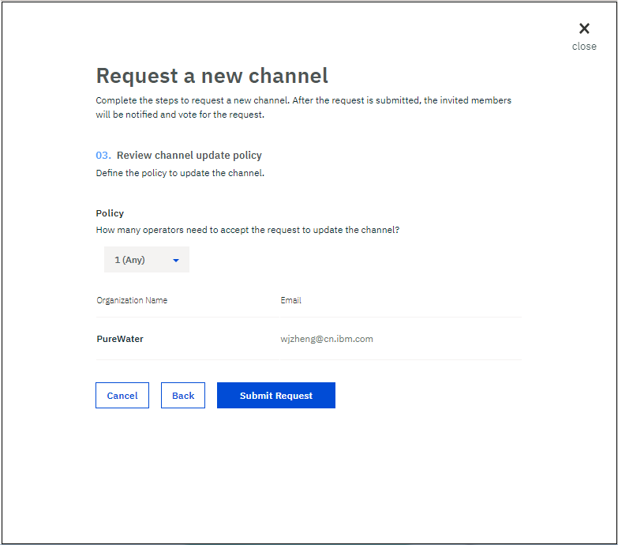

---

copyright:
  years: 2017, 2019
lastupdated: "2019-03-05"

subcollection: blockchain

---

{:new_window: target="_blank"}
{:shortdesc: .shortdesc}
{:screen: .screen}
{:codeblock: .codeblock}
{:pre: .pre}

# Création ou mise à jour d'un canal
{: #ibp-create-channel}

Les canaux offrent un mécanisme incroyablement puissant pour le partitionnement et l'isolement des données, et ils constituent la base essentielle pour la confidentialité des données. Seuls les membres du même canal peuvent accéder aux données de ce canal.
{:shortdesc}

Pour garantir la sécurité du canal, les règles de mise à jour du canal sont configurées pour définir le nombre d'opérateurs de canal qui doivent s'accorder sur une demande de création ou de mise à jour des canaux afin que l'opération ne soit effectuée.

## Création d'un canal
{: #ibp-create-channel-creating-a-channel}

Cliquez sur le bouton **Nouveau canal** dans l'écran "Canaux" de votre moniteur réseau, puis procédez comme suit pour soumettre une demande de création de canal :
1. Choisissez un nom qui reflète l'objectif métier du canal, ajoutez une description si vous le souhaitez, puis cliquez sur **Suivant**. Le nom de canal doit être unique dans un réseau de blockchain. Il doit commencer par une lettre et peut contenir uniquement des caractères en minuscule, des nombres ou des tirets.
  

2. Invitez des membres de votre réseau en les sélectionnant et en cliquant sur le bouton **Ajouter un membre**. Personnalisez les droits en affectant des rôles pour chacun des membres invités, puis cliquez sur **Suivant**.
  

    * Un opérateur de canal peut interroger ou mettre à jour le registre de canal. Un opérateur de canal a le droit d'**accepter** ou de **décliner** une demande de création de canal, et de soumettre une demande de mise à jour de canal. Il doit y avoir au moins un **Opérateur** dans chaque canal.
    * Un rédacteur de canal peut mettre à jour le registre de canal, en appelant une fonction de code blockchain par exemple. Un rédacteur de canal peut aussi instancier un code blockchain sur un canal.
    * Un lecteur de canal peut uniquement interroger le registre de canal, en appelant une fonction de code blockchain en lecture seule par exemple.

3. Configurez les règles de mise à jour de canal en sélectionnant le nombre d'opérateurs de canal pour l'approbation d'une demande de mise à jour de canal, puis cliquez sur **Soumettre une demande**.
  

Les membres invités recevront un courrier électronique d'invitation. Ils peuvent aussi trouver la demande dans les sous-onglets "Tout" ou "En attente" de l'écran **Notifications** du moniteur réseau.
* Les membres qui sont invités en tant qu'opérateurs de canal peuvent cliquer sur le bouton **Inspecter la demande** pour passer en revue la configuration de canal, puis **Accepter** ou **Décliner** la demande. La colonne "Mon statut" affiche le statut de vote de l'opérateur dans la demande :
    * _Vote en attente_ : L'opérateur n'a pas traité la demande.
    * _Vote accepté_ : L'opérateur a accepté la demande.
    * _Vote décliné_ : L'opérateur a décliné la demande.
    * _Vote en cours de fermeture_ : La demande a obtenu suffisamment de votes **Accepter** et l'opérateur n'a plus besoin d'accepter ou de décliner.
* Les membres qui sont invités en tant que rédacteurs ou lecteurs de canal peuvent voir *Non requis* sous la colonne "Mon statut". Avant que la demande n'obtienne suffisamment de votes **Accepter** des opérateurs de canal, les rédacteurs ou les lecteurs peuvent cliquer sur le bouton **Inspecter la demande** pour vérifier la configuration de canal.

Lorsque suffisamment d'opérateurs de canal s'accordent sur la demande, tout membre de canal peut cliquer sur le bouton **Soumettre une Demande** et le nouveau canal est créé. Tous les membres du canal peuvent voir le canal dans l'écran "Canaux" de leur moniteur réseau.

### Création de canaux gérés

Dans les scénarios de marchés des changes extrêmement régulés, par exemple, il peut être nécessaire de faire appel à un tiers pour la prise en charge des rôles d'administration des canaux. Cette fonction est habituellement confiée à différents opérateurs ou membres.

Dans ce cas, le tiers de confiance devient lui-même le seul “Opérateur” d'un canal et affecte d'autres membres en tant que “Auteurs”. Il devient ainsi la seule autorité qui peut éditer le canal tout en laissant aux deux banques la possibilité d'appeler des transactions. Un canal "en lecture seule" géré peut aussi être créé en définissant d'autres membres en tant que "Lecteurs".

## Mise à jour d'un canal
{: #ibp-create-channel-updating-a-channel}

Si vous voulez modifier la configuration d'un canal, par exemple, ajouter ou retirer des membres de canal, ou encore modifier les règles de mise à jour de canal, vous pouvez soumettre une demande de mise à jour de canal. Dans l'écran "Canaux" de votre moniteur réseau, localisez le canal que vous voulez modifier et sélectionnez **Editer le canal** dans la liste déroulante sous l'en-tête **Action**. Parcourez les écrans afin d'apporter les modifications aux entités souhaitées, puis cliquez sur **Soumettre une Demande** pour initier une demande de mise à jour de canal.

Tous les membres du canal recevront des notifications par courrier électronique lors de la demande de mise à jour de canal :
* Les nouveaux membres invités reçoivent des notifications par courrier électronique pour les inviter à rejoindre le canal. Ils peuvent aussi trouver la demande avec le statut "Vote en attente" dans l'écran **Notifications** du moniteur réseau.
    * Les membres qui sont invités en tant qu'opérateurs de canal peuvent cliquer sur le bouton **Inspecter la demande** pour passer en revue la configuration de canal, puis **Accepter** ou **Décliner** la demande de mise à jour de canal.  La colonne "Mon statut" affiche le statut de vote de l'opérateur dans la demande :
        * _Vote en attente_ : L'opérateur n'a pas traité la demande.
        * _Vote accepté_ : L'opérateur a accepté la demande.
        * _Vote décliné_ : L'opérateur a décliné la demande.
        * _Vote en cours de fermeture_ : La demande a obtenu suffisamment de votes **Accepter** et l'opérateur n'a plus besoin d'accepter ou de décliner.
    * Les membres qui sont invités en tant que rédacteurs ou lecteurs de canal peuvent voir *Non requis* sous la colonne "Mon statut". Avant que la demande n'obtienne suffisamment de votes **Accepter** des opérateurs de canal, les rédacteurs ou les lecteurs peuvent cliquer sur le bouton **Inspecter la demande** pour vérifier la configuration de canal.
* Les membres retirés reçoivent des notifications par courrier électronique sur la modification de canal
* Les opérateurs de canal existants reçoivent des notifications par courrier électronique lors de la mise à jour de canal. Ils peuvent aussi trouver la demande avec le statut _Vote en attente_ dans l'écran **Notifications** de leur moniteur réseau afin de pouvoir **Accepter** ou **Décliner**.
* Les rédacteurs ou lecteurs de canal existants reçoivent des notifications par courrier électronique lors de la mise à jour de canal. Ils peuvent aussi trouver la demande avec le statut _Non requis_ dans l'écran **Notifications** du moniteur réseau.

Lorsque suffisamment d'opérateurs de canal s'accordent sur la demande, tout membre de canal peut cliquer sur le bouton **Soumettre une Demande** et le canal est mis à jour. Tous les membres du canal peuvent voir le canal mis à jour dans l'écran "Canaux" du moniteur réseau.

Les règles de validation ne sont mises à jour automatiquement lorsque de nouvelles organisations rejoignent le canal et installent le code blockchain. Par exemple, si la règle requiert deux organisations sur cinq pour valider une transaction, elle ne sera pas mise à jour pour exiger deux organisations sur six lorsqu'une nouvelle organisation rejoint le canal. Au lieu de cela, la nouvelle organisation ne sera pas répertoriée dans la règle, et elle ne pourra pas valider les transactions. Vous pouvez ajouter une nouvelle organisation à une règle de validation en [mettant à jour le code blockchain pertinent](/docs/services/blockchain/howto/install_instantiate_chaincode.html#install-instantiate-chaincode-update-cc). Pour plus d'informations, voir [Spécification de règles de validation pour le code blockchain](/docs/services/blockchain/howto/install_instantiate_chaincode.html#install-instantiate-chaincode-endorsement-policy).
{:important}
