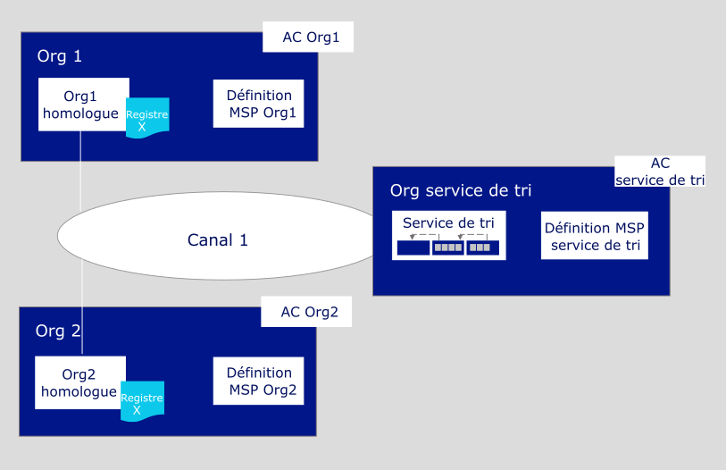
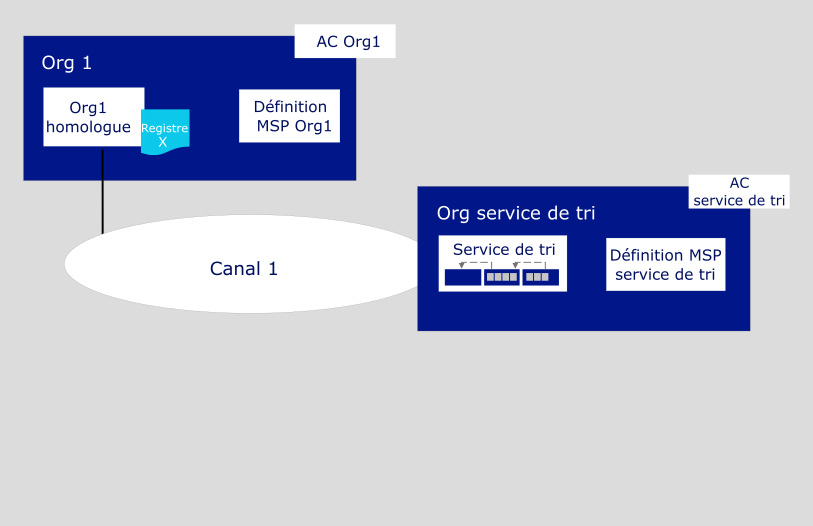

---

copyright:
  years: 2019

lastupdated: "2019-04-23"

subcollection: blockchain

---

{:new_window: target="_blank"}
{:shortdesc: .shortdesc}
{:screen: .screen}
{:codeblock: .codeblock}
{:note: .note}
{:important: .important}
{:tip: .tip}
{:pre: .pre}

# Tutoriel Générer un réseau
{: #ibp-console-build-network}

{{site.data.keyword.blockchainfull}} Platform est une offre de blockchain en tant que service qui vous permet de développer, déployer et exploiter des applications et des réseaux de blockchain. Vous pouvez en apprendre davantage sur les composants de blockchain et leur fonctionnement en consultant la section [Présentation du composant Blockchain](/docs/services/blockchain/blockchain_component_overview.html#blockchain-component-overview). Ce tutoriel est la première partie de la [série d'exemples de tutoriel réseau](/docs/services/blockchain/howto/ibp-console-build-network.html#ibp-console-build-network-sample-tutorial) ; il explique comment utiliser la console {{site.data.keyword.blockchainfull_notm}} Platform pour générer un réseau pleinement opérationnel sur un service {{site.data.keyword.cloud_notm}} Kubernetes unique.
{:shortdesc}

**Public cible :** Cette rubrique s'adresse aux opérateurs réseau qui sont responsables de la création, de la surveillance et de la gestion du réseau de blockchain.   

Si vous n'avez pas déjà déployé la console dans un cluster Kubernetes à l'aide de {{site.data.keyword.cloud_notm}} Kubernetes Service, voir [Initiation à {{site.data.keyword.blockchainfull_notm}} Platform 2.0](/docs/services/blockchain/howto/ibp-v2-deploy-iks.html#ibp-v2-deploy-iks). Vous pouvez créer un nouveau cluster Kubernetes pour le déploiement de la console ou utiliser un cluster existant dans votre compte {{site.data.keyword.cloud_notm}}.  Après avoir déployé {{site.data.keyword.blockchainfull}} Platform dans votre cluster Kubernetes, vous pouvez lancer la console afin de créer et de gérer vos composants de blockchain.

Que vous déployiez un cluster Kubernetes payant ou non, utilisez le tableau de bord Kubernetes pour porter une attention particulière aux ressources à votre disposition lorsque vous choisissez de déployer des noeuds et de créer des canaux. Il est de votre responsabilité de gérer votre cluster Kubernetes et de déployer des ressources supplémentaires si nécessaire. Même si des composants peuvent être déployés dans un cluster gratuit, plus vous ajoutez de composants, plus lente sera leur exécution.
{: note}

## Série d'exemples de tutoriel réseau
{: #ibp-console-build-network-sample-tutorial}

Cette série de tutoriels en trois parties vous guide tout au long du processus de création et d'interconnexion d'un réseau Hyperledger Fabric à plusieurs noeuds relativement simple à l'aide de la console {{site.data.keyword.blockchainfull_notm}} Platform 2.0 pour le déploiement d'un réseau dans votre cluster Kubernetes, ainsi que l'installation et l'instanciation d'un contrat intelligent.

* **Générer un réseau ** : Ce tutoriel vous guide tout au long du processus d'hébergement d'un réseau par la création d'un service de tri et d'un homologue.
* [Rejoindre un réseau](/docs/services/blockchain/howto/ibp-console-join-network.html#ibp-console-join-network) : Ce tutoriel vous guide tout au long du processus permettant de rejoindre un réseau existant en créant un homologue et en le joignant à un canal.
* [Déployer un contrat intelligent sur le réseau ](/docs/services/blockchain/howto/ibp-console-smart-contracts.html#ibp-console-smart-contracts): Ce tutoriel fournit des informations sur l'écriture d'un contrat intelligent et son déploiement sur votre réseau.

Vous pouvez utiliser les étapes de ces tutoriels pour générer un réseau comportant plusieurs organisations dans un cluster à des fins de développement et de test. Utilisez le tutoriel **Générer un réseau** si vous voulez former un consortium de blockchain en créant un noeud de service de tri et en ajoutant des organisations. Utilisez le tutoriel **Rejoindre un réseau** pour connecter un homologue au réseau. L'utilisation des tutoriels par différents membres de consortium vous permet de créer un réseau de blockchain réellement **distribué**.  

### Structure de ce réseau
{: #ibp-console-build-network-structure}

Si vous effectuez toutes les étapes des tutoriels **Générer un réseau** et **Rejoindre un réseau**, votre réseau ressemblera à celui de l'illustration ci-dessous :
  
*Figure 1. Exemple de structure de réseau de base*  

Cette configuration est suffisante pour les tests d'applications et de contrats intelligents. Le réseau comporte les composants suivants :

* **Deux organisations homologues** : `Org1` et `Org2`  
  La série de tutoriels décrit comment créer deux organisations homologues et deux homologues associés. Imaginez ces organisations sur un réseau de blockchain comme étant deux banques différentes qui doivent effectuer des transactions entre elles. Nous créons la définition MSP (Membership Services Provider) Org1 et Org2 (MSP) qui définit les organisations `Org1` et `Org2`.
* **Une organisation de service de tri** : `Org service de tri`  
  Comme nous générons un registre distribué, les homologues et les services de tri doivent faire partie d'organisations distinctes. Par conséquent, une organisation distincte est créée pour le service de tri.  Entre autres choses, un noeud de service de tri trie les blocs de transactions qui sont envoyés aux homologues afin qu'ils puissent être écrits dans leurs registres et devenir la blockchain. Nous créons la définition MSP (Membership Services Provider) Service de tri qui définit l'organisation `Org service de tri`.
* **Trois autorités de certification** : `AC Org1, AC Org2, AC service de tri`   
  Une AC (autorité de certification) est le noeud qui émet des certificats pour tous les membres d'une organisation. Comme une meilleure pratique consiste à déployer une AC par organisation, nous déploierons trois AC au total : une pour chaque organisation homologue et une pour l'organisation de service de tri. Nous utiliserons aussi les AC pour créer l'ensemble des définitions de noeuds, d'identités et d'organisations pour chaque organisation.
* **Un service de tri :** `Service de tri`  
  Actuellement, seul un service de tri SOLO peut être déployé à l'aide de la console. Vous pouvez déployer plusieurs de ces noeuds, en supposant que vous ayez de l'espace dans votre cluster, mais chaque service de tri aura son propre "consortium", qui est la liste des organisations homologues qui peuvent créer et rejoindre des canaux. Vous ne pouvez pas connecter plusieurs services de tri au même canal. En tant qu'admin de ce service de tri, vous ajouterez l'organisation homologue que vous utilisez pour créer le consortium, ce qui permet à votre organisation homologue de créer un canal. Si vous voulez créer un canal dont les organisations sont déployées dans différents clusters, la plupart des réseaux de production étant structurés ainsi, vous devez également importer sur votre console une organisation homologue qui a été déployée sur une autre console. Cela permet à l'organisation homologue de rejoindre la canal qui est hébergé par le service de tri.
* **Deux homologues :** `Homologue Org1` et `Homologue Org2`  
  Le registre de blockchain, `Registre x` dans l'illustration ci-dessus, est géré par des homologues distribués. Ces homologues sont déployés avec [Couch DB ](https://hyperledger-fabric.readthedocs.io/en/release-1.4/couchdb_as_state_database.html) comme base de données.
* **Un canal **: `canal1`  
  Les canaux garantissent la confidentialité des données. Ils permettent à des groupes d'organisations d'effectuer des transactions sans exposer leurs données à des organisations qui ne sont pas membres du canal. Chaque canal a son propre registre de blockchain, partagé entre les homologues qui ont rejoint ce canal. Le tutoriel crée un canal rejoint par les deux organisations, et il instancie des contrats intelligents sur le canal que les organisations peuvent utiliser pour effectuer des transactions.

Cette configuration n'est pas obligatoire. {{site.data.keyword.blockchainfull_notm}} Platform 2.0 est hautement personnalisable. Si des ressources sont disponibles dans votre cluster Kubernetes, vous pouvez utiliser la console pour déployer un noeud de service de tri et lui ajouter des organisations, ce que l'on appelle également former un consortium. Vous pouvez également créer une organisation homologue qui se connecte à plusieurs services de tri. Ce tutoriel présente les étapes nécessaires à la génération de votre propre réseau, avec des références à des rubriques qui fournissent davantage d'informations sur {{site.data.keyword.blockchainfull_notm}} Platform et la console.

Dans ce tutoriel **Générer un réseau**, nous générons uniquement une partie du réseau ci-dessus, réseau simple qui peut être utilisé pour héberger un service de tri et une organisation homologue unique ainsi qu'un homologue sur un seul canal. L'illustration ci-après représente la partie du réseau ci-dessus que nous allons générer :
  
*Figure 2. Structure de réseau simple*  

Cette configuration est utile pour une mise en route rapide et le test d'un contrat intelligent mais elle n'est pas très significative tant que vous n'avez pas ajouté d'autres organisations avec lesquelles effectuer des transactions, pour créer un registre réellement distribué.  Par conséquent, dans le tutoriel suivant intitulé [Rejoindre un réseau](/docs/services/blockchain/howto/ibp-console-join-network.html#ibp-console-join-network), nous vous montrons comment créer d'autres organisations homologues et d'autres homologues, et comment ajouter un nouvelle organisation au canal.  

Tout au long de ce tutoriel, nous indiquons les **valeurs recommandées** pour certaines zones de la console. Les noms et les identités sont ainsi plus faciles à reconnaître dans les onglets et les listes déroulantes. Ces valeurs ne sont pas obligatoires, mais elles peuvent vous être utiles. Nous fournissons un tableau de valeurs recommandées après chaque tâche.
{:tip}

## Etape 1 : Créer votre organisation et votre point d'entrée pour la blockchain
{: #ibp-console-build-network-create-peer-org1}

Pour chacune des organisations que vous voulez créer avec la console, vous devez déployer au moins une AC. Une AC est le noeud qui émet des certificats pour tous les participants du réseau (homologues, services de tri, clients, et ainsi de suite). Ces certificats, qui incluent une paire de clés publiques et une paire de clés privées, permettent aux participants d'un réseau de communiquer, de s'authentifier et enfin d'effectuer des transactions. Ces AC vont créer l'ensemble des identités et des certificats qui appartiennent à votre organisation, en plus de définir l'organisation elle-même. Vous pouvez ensuite utiliser ces identités pour déployer des noeuds, exploiter votre réseau et soumettre des transactions à la blockchain. Pour plus d'informations sur votre AC et les identités que vous allez devoir créer, voir [Gestion des identités](/docs/services/blockchain/howto/ibp-console-identities.html#ibp-console-identities).

Dans ce tutoriel, nous créons deux organisations, dont l'une détient un homologue et l'autre détient un service de tri. Chaque organisation a besoin d'une AC pour émettre ses certificats ; nous devons donc créer **deux AC**. Dans le cadre de ce tutoriel, **nous allons créer une seule AC à la fois**.

Regardez la vidéo ci-après pour en savoir plus sur le processus de création de l'homologue et sur l'homologue.

<iframe class="embed-responsive-item" id="youtubeplayer" title="Vidéo IBM Blockchain Platform version 2.0 bêta - Tutoriel de déploiement" type="text/html" width="640" height="390" src="https://www.youtube.com/embed/JZj43n_JKIY" frameborder="0" webkitallowfullscreen mozallowfullscreen allowfullscreen> </iframe>  
*Vidéo 1. Création de l'organisation de l'homologue et de l'homologue*

### Création de l'autorité de certification (AC) de votre organisation
{: #ibp-console-build-network-create-CA-org1CA}

Dans le cadre de ce tutoriel, votre AC émet les clés publiques et privées pour les utilisateurs et les noeuds. Ces identités ne sont pas gérées par {{site.data.keyword.IBM_notm}} et les clés ne sont pas stockées dans votre cluster Kubernetes ou sur la console. Elles sont uniquement stockées dans l'espace de stockage local de votre navigateur. Par conséquent, assurez-vous d'exporter la définition MSP de vos identités et de votre organisation. Si vous essayez d'accéder à la console à partir d'une autre machine ou d'un navigateur différent, vous devez importer ces identités et définitions d'organisation.  
{:important}

Procédez comme suit depuis votre console :

1. Accédez à l'onglet **Noeuds** sur la gauche et cliquez sur **Ajouter une autorité de certification**. Les panneaux latéraux vous permettent de personnaliser l'autorité de certification que vous voulez créer et l'organisation pour laquelle cette autorité de certification va émettre des clés.
2. Cliquez sur **{{site.data.keyword.cloud_notm}}** sous **Créer une autorité de certification** et sur **Suivant**.
3. Utilisez le second panneau latéral pour affecter un **nom d'affichage** à votre autorité de certification. Notre valeur recommandée pour cette autorité de certification est `AC Org1`.
4. Sur le panneau suivant, affectez des données d'identification à l'admin de votre autorité de certification en indiquant **admin** comme `ID admin`, ainsi que le secret de votre choix. Nous recommandons `adminpw` pour la suite de ce tutoriel.
5. Si vous utilisez un cluster payant, vous avez la possibilité de configurer l'allocation de ressource pour le noeud. Pour les besoins de ce tutoriel, vous pouvez accepter toutes les valeurs par défaut et cliquer sur **Suivant**. Si vous souhaitez en savoir davantage sur l'allocation de ressources à votre noeud, consultez la rubrique relative à l'[allocation de ressources](/docs/services/blockchain?topic=blockchain-ibp-console-govern#ibp-console-govern-allocate-resources). Si vous utilisez un cluster gratuit, vous voyez déjà la page **Récapitulatif**.
6. Passez en revue la page Récapitulatif, puis cliquez sur **Ajouter une autorité de certification**.

**Tâche : Créer l'autorité de certification de l'organisation homologue**

  | **Zone** | **Nom d'affichage** | **ID d'inscription** | **Secret** |
  | ------------------------- |-----------|-----------|-----------|
  | **Créer une autorité de certification** | AC Org1  | admin | adminpw |

  *Figure 3. Création de l'autorité de certification de l'organisation homologue*

Une fois l'autorité de certification déployée, vous allez l'utiliser lors de la création de la définition MSP de votre organisation, de l'enregistrement des utilisateurs, ainsi que pour créer votre point d'entrée sur un réseau, l'**homologue**.  

Les utilisateurs expérimentés ont peut-être déjà leur propre autorité de certification et ils ne souhaitent pas en créer une nouvelle sur la console. Si votre autorité de certification existant peut émettre des certificats au format `X.509`, vous pouvez utiliser votre propre autorité de certification externe au lieu d'en créer une nouvelle ici. Pour plus d'informations, consultez la rubrique relative à l'[utilisation de certificats d'une autorité de certification externe auprès de votre homologue ou service de tri](/docs/services/blockchain/howto/ibp-console-build-network.html#ibp-console-build-network-third-party-ca).

### Utilisation de votre autorité de certification pour enregistrer des identités
{: #ibp-console-build-network-use-CA-org1}

Chaque noeud ou application que vous souhaitez créer a besoin de clés publiques et privées pour participer au réseau de blockchain. Vous devez également créer des clés admin pour ces noeuds et applications afin de pouvoir les gérer à partir de la console. Nous allons exécuter cette procédure deux fois, une fois pour chaque autorité de certification qui nous créons. Et pour chaque autorité de certification, vous allez créer deux identités :

* **Un admin d'organisation** Cette identité vous permet d'exploiter des noeuds à l'aide de la console de plateforme.
* **Une identité homologue** Cette identité vous permet de déployer un homologue.

Selon le type de votre cluster, le déploiement de l'autorité de certification peut prendre jusqu'à dix minutes. Le carré vert situé sur la vignette de l'autorité de certification indique qu'elle est "En cours d'exécution" et qu'elle peut être utilisée pour enregistrer des identités. Avant de passer aux étapes ci-dessous pour enregistrer des identités, vous devez attendre que l'autorité de certification passe à l'état "En cours d'exécution".
{:important}

Pour générer ces certificats, nous devrons effectuer les étapes suivantes :

1. Sur la console, cliquez sur l'onglet **Noeuds**. Lorsque le voyant d'état dans l'angle supérieur gauche de l'`AC Org1` devient vert et affiche l'état `En cours d'exécution`, cliquez sur la vignette afin de l'ouvrir.
2. Après avoir sélectionné votre autorité de certification, vérifiez que l'identité `admin` que vous avez créée pour l'autorité de certification est visible dans la table avant de poursuivre. Vous devez enregistrer une autre identité admin pour notre première organisation, `org1`, en plus d'une identité pour l'homologue lui-même.  Pour enregistrer nos nouveaux utilisateurs, cliquez sur le bouton **Enregistrement d'utilisateur**.
3. Affectez l'ID d'inscription `org1admin` à l'admin de l'organisation. Vous pouvez utiliser n'importe quel secret, mais nous suggérons `org1adminpw` pour plus de commodité. Cliquez sur **Suivant**.
4. A l'étape suivante, définissez le Type de cette identité sur `client` et sélectionnez l'une des organisations affiliées dans la liste déroulante. La zone d'affiliation est destinée aux utilisateurs expérimentés et elle n'est pas utilisée dans le cadre de ce tutoriel, mais il s'agit d'une zone obligatoire. Les éléments de la liste sont les affiliations par défaut de l'autorité de certification Fabric. Si vous souhaitez en savoir davantage sur l'utilisation des affiliations par l'autorité de certification Fabric, consultez la rubrique relative à l'[enregistrement d'une nouvelle identité ](https://hyperledger-fabric-ca.readthedocs.io/en/release-1.4/users-guide.html#registering-a-new-identity). Pour l'instant, sélectionnez une affiliation de la liste, par exemple `org1` et cliquez sur **Suivant**.
5. Vous n'êtes pas tenu de compléter les zones **Nombre maximal d'inscriptions** et **Ajouter des attributs**. Elles ne sont pas utilisées dans le cadre de ce tutoriel, mais vous pouvez en apprendre plus sur leurs fonctions dans la rubrique relative à l'[enregistrement des identités](/docs/services/blockchain/howto/ibp-console-identities.html#ibp-console-identities-register).
6. Une fois l'admin de l'organisation enregistré, recommencez ce même processus, à l'aide de la même autorité de certification `AC Org1`, pour l'identité de l'homologue, en attribuant l'ID d'inscription `peer1` et le secret de votre choix. Comme précédemment, nous recommandons le secret `peer1pw`. Il s'agit d'une identité de noeud, vous devez donc sélectionner `homologue` comme **Type** à l'étape suivante. Sélectionnez une **affiliation**. Ensuite, ignorez les zones **Nombre maximal d'inscriptions** et **Attributs**.

**Tâche : Enregistrer des utilisateurs**

  |  **Zone** | **Description** | **ID d'inscription** | **Secret** |
  | ------------------------- |-----------|-----------|-----------|-----------|
  | **Enregistrer des utilisateurs** |  Admin Org1 | org1admin | org1adminpw |
  | | Identité de l'homologue |  peer1 | peer1pw |

  *Figure 4. Utilisation de votre autorité de certification pour enregistrer des utilisateurs*

### Création de la définition MSP d'une organisation homologue
{: #ibp-console-build-network-create-peers-org1}

A présent que nous avons créé l'autorité de certification de l'homologue et que nous l'avons utilisée pour **enregistrer** les identités de notre organisation, nous devons créer une définition formelle de l'organisation de l'homologue, laquelle est appelée MSP (Membership Services Provider). De nombreux homologues peuvent appartenir à une organisation. **Vous n'êtes pas tenu de créer une nouvelle organisation chaque fois que vous créez un homologue.** Comme il s'agit de la première fois que nous déroulons ce tutoriel, nous allons créer l'ID MSP pour cette organisation. Pendant le processus de création du MSP, nous allons générer les certificats pour l'identité `org1admin` et les ajouter à notre portefeuille de console.

1. Accédez à l'onglet **Organisations** dans la navigation de gauche et cliquez sur **Créer une définition de MSP**.
2. Affectez à votre MSP le nom d'affichage `Org1 MSP` et l'ID MSP `org1msp`. Si vous voulez indiquer votre propre ID MSP dans cette zone, assurez-vous de respecter les spécifications relatives aux limitations pour ce nom dans l'infobulle.
3. Sous **Détails d'autorité de certification racine**, indiquez l'autorité de certification homologue que nous avons créée comme adaptateur de canal racine de votre organisation. Si c'est la première fois que vous suivez ce tutoriel, vous ne devez voir qu'un seul : `AC Org1`.
4. Les zones **ID d'inscription** et **Secret d'inscription** ci-dessous sont remplies automatiquement avec l'ID d'inscription et le secret pour le premier utilisateur que vous avez créé avec votre autorité de certification. Vous pouvez utiliser ces valeurs, mais nous vous déconseillons d'utiliser l'identité de vitre admin d'autorité de certification comme admin de votre d'organisation.  Au lieu de cela, nous vous conseillons d'indiquer l'ID inscription et le secret que vous avez créés pour l'admin de votre organisation, `org1admin` et `org1adminpw`. Ensuite, affectez à cette identité un nom d'affichage, `Org1 Admin`.
5. Cliquez sur le bouton **Générer** afin d'inscrire cette identité en tant qu'admin de votre organisation et exportez l'identité dans le portefeuille, où elle sera utilisée lors de la création de l'homologue et de la création d'un canal.
6. Cliquez sur **Exporter** pour exporter les certificats admin sur votre système de fichiers afin de pouvoir gérer le fichier. Comme nous l'avons dit plus haut, cette identité n'est pas stockée dans votre cluster ou gérée par {{site.data.keyword.IBM_notm}}. Elle est stockée uniquement dans votre navigateur. Si vous changez de navigateur, vous devez importer cette identité dans votre portefeuille de console afin de pouvoir administrer l'homologue.
7. Cliquez sur **Créer une définition de MSP**.

**Tâche : Créer la définition MSP de l'organisation homologue**

  |  | **Nom d'affichage** | **ID MSP** | **ID d'inscription**  | **Secret** |
  | ------------------------- |-----------|-----------|-----------|-----------|
  | **Créer une organisation** | MSP Org1 | org1msp |||
  | **Autorité de certification racine** | AC Org1 ||||
  | **Cert admin org** | |  | org1admin | org1adminpw |
  | **Identité** | Admin Org1 |||||

  *Figure 5. Création de la définition MSP d'une organisation homologue*

Une fois la définition MSP créée, vous devez voir l'admin de l'organisation homologue dans votre portefeuille de console.

**Tâche : Consulter le portefeuille de console**

  | **Zone** |  **Nom d'affichage** | **Description** |
  | ------------------------- |-----------|----------|
  | **Identité** | Admin Org1 | Identité admin Org1 |

  *Figure 6. Consultation de votre portefeuille de console*

Pour plus d'informations sur les définitions MSP, voir la rubrique relative à la [gestion des organisations](/docs/services/blockchain/howto/ibp-console-organizations.html#ibp-console-organizations).

L'exportation de l'identité de l'admin de votre organisation est importante car vous êtes responsable de la gestion et de la sécurisation de ces certificats.
{:important}

<!--
You are free to repeat this process as many times as times as you want. To create a network that is similar to [Starter Plan](/docs/services/blockchain/starter_plan.html#starter-plan-about), for example, you will create two organizations and one peer per organization, and this tutorial will take you through those steps. This process involves repeating the steps above, to create the CA and the relevant identities, and below, to create another peer. Remember that the best practice is to have **one CA for each organization**. This CA can, however, be used to register and enroll multiple organization admins as well as multiple peer identities **for that organization**. Make sure to keep track of the resources you are using in your Kubernetes cluster, especially if using the free cluster.
{: note}
-->

### Création d'un homologue
{: #ibp-console-build-network-peer-create}

Une fois que vous avez [créé une autorité de certification](/docs/services/blockchain/howto/ibp-console-build-network.html#ibp-console-build-network-create-CA-org1CA), que vous l'avez utilisée pour enregistrer des identités, et que vous avez créé la définition [MSP de l'organisation homologue](/docs/services/blockchain/howto/ibp-console-build-network.html#ibp-console-build-network-create-peers-org1), vous êtes prêt(e) pour la création d'un homologue.

#### Quel rôle jouent les homologues ?
{: #ibp-console-build-network-peer-role}

Il est important de garder à l'esprit que les organisations elles-mêmes ne gèrent pas les registres. Ce sont les homologues qui s'en chargent. Les organisations utilisent également des homologues pour signer des propositions de transaction et approuver des mises à jour de configuration de canal. Etant donné qu'avoir au moins deux homologues sur un canal les rend hautement disponibles, une meilleure pratique consiste à avoir au moins deux homologues qui ont rejoint un canal pour les implémentations de niveau production. Dans le cadre de ce tutoriel, nous allons voir uniquement le processus de création d'un seul homologue.

Du point de vue de l'allocation de ressource, il est possible de joindre les mêmes homologues à plusieurs canaux. De par sa conception, l'homologue garantit que les données d'un canal ne peuvent pas passer dans un autre via l'homologue. Toutefois, étant donné que l'homologue va stocker un registre distinct pour chaque canal, il est nécessaire de s'assurer que l'homologue dispose de suffisamment de puissance de traitement et d'espace de stockage pour traiter la charge de transactions et de données.

#### Déploiement de votre homologue
{: #ibp-console-build-network-deploy-peer-role}

Utilisez votre console pour effectuer les étapes suivantes :

1. Sur la page **Noeuds**, cliquez sur **Ajouter un homologue**.
2. Cliquez sur {{site.data.keyword.cloud_notm}} sous **Créer un nouvel homologue**, puis cliquez sur **Suivant**.
3. Affectez à votre homologue le **nom d'affichage** `Org1 homologue`.
4. A l'écran suivant, sélectionnez `AC Org1` comme autorité de certification. Ensuite, indiquez l'ID d'inscription et le secret de l'identité homologue que vous avez créée pour votre homologue, `peer1` et `peer1pw`. Ensuite, sélectionnez votre MSP, `MSP Org1`, dans la liste déroulante et cliquez sur **Suivant**.
5. Le panneau latéral suivant vous invite à entrer des informations sur l'autorité de certification TLS. Bien qu'il soit possible de créer des admins distincts pour l'autorité de certification TLS qui est déployée avec votre autorité de certification, cela n'est pas obligatoire.
  - Affectez l'**ID d'inscription TLS**, l'`admin` et le secret `adminpw`, identiques aux valeurs indiquées pour l'ID d'inscription et le secret d'inscription lors de la création de l'autorité de certification.
  - Le **nom d'hôte CSR TLS** est réservé aux utilisateurs expérimentés pour indiquer un nom de domaine personnalisé qui peut être utilisé pour adresser le noeud final d'homologue. N'indiquez rien pour l'instant dans la zone **Nom d'hôte CSR TLS**, elle n'est pas utilisée dans le cadre de ce tutoriel.
6. Le panneau latéral suivant vous invite à **Associer une identité** et à la définir en tant qu'admin de votre homologue. Sélectionnez votre identité admin homologue `Admin Org1`.
7. Si vous utilisez un cluster payant, sur le panneau suivant vous avez la possibilité de configurer l'allocation de ressource pour le noeud. Pour les besoins de ce tutoriel, vous pouvez accepter toutes les valeurs par défaut et cliquer sur **Suivant**. Si vous souhaitez en savoir davantage sur l'allocation de ressources à votre noeud, consultez la rubrique relative à l'[allocation de ressources](/docs/services/blockchain?topic=blockchain-ibp-console-govern#ibp-console-govern-allocate-resources). Si vous utilisez un cluster gratuit, vous voyez la page **Récapitulatif**.
8. Passez en revue le récapitulatif et cliquez sur **Ajouter un homologue**.

**Tâche : Déployer un homologue**

  |  | **Nom d'affichage** | **ID MSP** | **ID d'inscription** | **Secret** |
  | ------------------------- |-----------|-----------|-----------|-----------|
  | **Créer un homologue** | Org1 homologue | org1msp |||
  | **AC** | AC Org1 ||||
  | **Identité de l'homologue** | |  | peer1 | peer1pw |
  | **Certificat d'administrateur** | org1msp ||||
  | **Autorité de certification TLS** | AC Org1 ||||
  | **ID autorité de certification TLS** | || admin | adminpw |
  | **Associer une identité** | Admin Org1 |||||

  *Figure 7. Déploiement d'un homologue*

## Etape 2 : Créer le noeud qui trie les transactions
{: #ibp-console-build-network-create-orderer}

Dans d'autres blockchains distribuées, comme Ethereum et Bitcoin, il n'y a pas d'autorité centrale qui trie les transactions et les envoie aux homologues. Hyperledger Fabric, blockchain sur laquelle {{site.data.keyword.blockchainfull_notm}} Platform est basé, fonctionne différemment. Elle dispose d'un noeud appelé **service de tri**.

Les services de tri sont des composants essentiels dans un réseau car ils effectuent quelques fonctions essentielles :

- Ils **trient** littéralement les blocs de transactions qui sont envoyés aux homologues afin qu'ils puissent être écrits dans leurs registres. Ce processus est appelé "tri", c'est pourquoi le service de tri est appelé ainsi.
- Ils gèrent le **canal du système de tri**, où résident le **consortium** et la liste des organisations autorisées à créer des canaux. Un consortium est essentiellement un véhicule multilocation et, de par sa conception, un seul service de tri peut héberger plusieurs consortia.
- Ils **appliquent les règles** décidées par le consortium ou les administrateurs de canal. Ces règles dictent toutes les opérations, de la lecture ou l'écriture dans un canal, à qui peut créer ou modifier un canal. Par exemple, lorsqu'un participant du réseau demande à modifier un canal ou une règle de consortium, le service de tri traite la demande afin de déterminer si le participant a les droits d'administration appropriés pour la mise à jour de cette configuration, la valide par rapport à la configuration actuelle, génère une nouvelle configuration, puis la relaie aux homologues.

Tout comme avec l'homologue, avant de créer un service de tri, nous devons créer une autorité de certification pour fournir les identités et les MSP de l'organisation de notre service de tri.

Regardez la vidéo ci-après pour en savoir plus sur le processus de création du service de tri et sur le service de tri.

<iframe class="embed-responsive-item" id="youtubeplayer" title="Vidéo IBM Blockchain Platform version 2.0 bêta - Tutoriel de déploiement" type="text/html" width="640" height="390" src="https://www.youtube.com/embed/Gomkn-JtNe8" frameborder="0" webkitallowfullscreen mozallowfullscreen allowfullscreen> </iframe>  
*Vidéo 2. Création de l'organisation du service de tri et du service de tri*

### Tri sur la console
{: #ibp-console-build-network-ordering-console}

Même s'il existe différentes implémentations de service de tri, le seul service de tri actuellement pris en charge est SOLO, qui comporte un seul noeud de service de tri. Etant donné que le fait d'avoir un seul noeud implique un point de défaillance unique, il n'est pas recommandé d'utiliser SOLO pour les réseaux de production.

Vous pouvez créer autant de services de tri que vous le souhaitez à l'aide de la console. Toutefois, chacun de ces services de tri a nécessairement son propre canal de système de tri, et par conséquent ses propres consortia. Un seul service de tri SOLO peut être connecté à un canal.

Dans le cadre de ce tutoriel, nous allons créer un seul service de tri.

### Création de l'autorité de certification (AC) de l'organisation de votre service de tri
{: #ibp-console-build-network-create-orderer-ca}

Le processus de création d'une autorité de certification pour un service de tri est identique à la création pour un homologue.
1. Accédez à l'onglet **Noeuds** et cliquez sur **Ajouter une autorité de certification**.
2. Cliquez sur **{{site.data.keyword.cloud_notm}}** sous **Créer une nouvelle autorité de certification** et sur **Suivant**.
3. Attribuez un nom d'affichage unique à cette autorité de certification, `AC service de tri`.
4. Vous êtes libre de réutiliser l'**ID d'inscription** que vous avez affecté à l'autre autorité de certification, `admin`, puis vous pouvez spécifier le secret de votre choix, mais nous vous recommandons `mdpadmin`.
5. Si vous utilisez un cluster payant, sur le panneau suivant vous avez la possibilité de configurer l'allocation de ressource pour le noeud. Pour les besoins de ce tutoriel, vous pouvez accepter toutes les valeurs par défaut et cliquer sur **Suivant**. Si vous souhaitez en savoir davantage sur l'allocation de ressources à votre noeud, consultez la rubrique relative à l'[allocation de ressources](/docs/services/blockchain?topic=blockchain-ibp-console-govern#ibp-console-govern-allocate-resources). Si vous utilisez un cluster gratuit, vous voyez déjà la page **Récapitulatif**.
6. Passez en revue la page Récapitulatif, puis cliquez sur **Ajouter une autorité de certification**.

Encore une fois, les utilisateurs expérimentés ont peut-être déjà leur propre autorité de certification et ils ne souhaitent pas en créer une nouvelle sur la console. Si votre autorité de certification existant peut émettre des certificats au format `X.509`, vous pouvez utiliser votre propre autorité de certification externe au lieu d'en créer une nouvelle ici. Pour plus d'informations, consultez la rubrique relative à l'[utilisation de certificats d'une autorité de certification externe auprès de votre homologue ou service de tri](/docs/services/blockchain/howto/ibp-console-build-network.html#ibp-console-build-network-third-party-ca).

### Utilisation de votre autorité de certification pour enregistrer un service de tri et des identités admin de service de tri
{: #ibp-console-build-network-use-CA-orderer}

Comme nous l'avons fait avec l'homologue, nous devons enregistrer deux identités auprès de l'autorité de certification de notre service de tri.  Une fois l'autorité de certification sélectionnée, vous devrez enregistrer un admin pour l'organisation de notre service de tri, ainsi qu'une identité pour l'homologue lui-même. Comme précédemment, vous devez voir une identité sous l'onglet `CA service de tri` ; il s'agit de l'administrateur que vous avez créé pour l'autorité de certification.

Selon le type de votre cluster, le déploiement de l'autorité de certification peut prendre jusqu'à dix minutes. Le carré vert situé sur la vignette de l'autorité de certification indique qu'elle est "En cours d'exécution" et qu'elle peut être utilisée pour enregistrer des identités. Avant de passer aux étapes ci-dessous pour enregistrer des identités, vous devez attendre que l'autorité de certification passe à l'état "En cours d'exécution".
{:important}

1. Sur la console, cliquez sur l'onglet **Noeuds**. Lorsque le voyant d'état dans l'angle supérieur gauche de l'`AC Service de tri` devient vert et affiche l'état `En cours d'exécution`, cliquez sur la vignette afin de l'ouvrir.
2. Patientez jusqu'à ce que l'identité `admin` que vous venez de créer soit visible dans la table, puis cliquez sur le bouton **Enregistrement d'utilisateur** pour enregistrer vos nouveaux utilisateurs.
3. Affectez l'ID d'inscription `ordereradmin` à l'admin de l'organisation. Nous recommandons le secret `ordereradminpw`.
4. A l'étape suivante, définissez le Type de cette identité sur `client` et sélectionnez l'une des organisations affiliées dans la liste déroulante. La zone d'affiliation est destinée aux utilisateurs expérimentés et elle n'est pas utilisée dans le cadre de ce tutoriel, mais il s'agit d'une zone obligatoire. Les éléments de la liste sont les affiliations par défaut de l'autorité de certification Fabric. Si vous souhaitez en savoir davantage sur l'utilisation des affiliations par l'autorité de certification Fabric, consultez la rubrique relative à l'[enregistrement d'une nouvelle identité ](https://hyperledger-fabric-ca.readthedocs.io/en/release-1.4/users-guide.html#registering-a-new-identity). Pour l'instant, sélectionnez une affiliation de la liste et cliquez sur **Suivant**.
5. Vous n'êtes pas tenu de compléter les zones **Nombre maximal d'inscriptions** et **Ajouter des attributs**. Elles ne sont pas utilisées dans le cadre de ce tutoriel, mais vous pouvez en apprendre plus sur leurs fonctions dans la rubrique relative à l'[enregistrement des identités](/docs/services/blockchain/howto/ibp-console-identities.html#ibp-console-identities-register) sur la console.
6. Une fois l'admin de l'organisation enregistré, recommencez ce même processus, à l'aide de la même autorité de certification `AC service de tri`, pour l'identité du service de tri, en attribuant l'ID d'inscription `orderer1`. Vous pouvez entrer le secret de votre choix, mais nous vous recommandons `orderer1pw` pour plus de commodité dans ce tutoriel. Il s'agit d'une identité de noeud, vous devez donc sélectionner `homologue` comme **Type** à l'étape suivante. Ensuite, ignorez les zones **Nombre maximal d'inscriptions** et **Attributs**, comme précédemment.

**Tâche : Créer une autorité de certification et enregistrer des utilisateurs**

  | **Zone** | **Description** | **ID d'inscription** | **Secret** |
  | ------------------------- |-----------|-----------|-----------|-----------|
  | **Créer une autorité de certification** | AC service de tri | admin | adminpw |
  | **Enregistrer des utilisateurs** | Admin service de tri | ordereradmin | ordereradminpw |
  |  | Identité service de tri |  orderer1 | orderer1pw |

*Figure 8. Création d'une autorité de certification et enregistrement des utilisateurs*

### Création de la définition MSP d'une organisation du service de tri
{: #ibp-console-build-network-create-orderer-org-msp}

Créez la définition MSP de votre organisation de service de tri et indiquez l'identité admin pour l'organisation. Une fois que nous avons enregistré l'admin du service de tri et les utilisateurs du service de tri, nous devons créer l'ID MSP et enregistrer l'utilisateur `ordereradmin` que nous avons enregistré en tant qu'admin de votre organisation.

1. Accédez à l'onglet **Organisations** dans la navigation de gauche et cliquez sur **Créer une définition de MSP**.
2. Affectez à votre définition de MSP un nom d'affichage tel que `MSP service de tri` et un ID tel que `orderermsp`, en vous assurant de respecter les spécifications relatives aux limitations pour ce nom dans l'infobulle..
3. Sous **Détails d'autorité de certification racine**, sélectionnez l'autorité de certification `AC service de tri` que nous avons créée.
4. Les zones **ID d'inscription** et **Secret d'inscription** ci-dessous sont remplies automatiquement avec l'ID d'inscription et le secret pour le premier utilisateur que vous avez créé avec votre autorité de certification. Vous pouvez utiliser ces valeurs, mais nous vous déconseillons d'utiliser l'identité de vitre admin d'autorité de certification comme admin de votre d'organisation.  Au lieu de cela, pour des raisons de sécurité, nous vous conseillons d'indiquer l'ID inscription et le secret que vous avez créés pour l'admin de votre organisation, `ordereradmin` et `ordereradminpw`. Ensuite, affectez à cette identité un nom d'affichage, par exemple `Admin service de tri`.
5. Cliquez sur le bouton **Générer** afin d'inscrire cette identité en tant qu'admin de votre organisation et ajoutez l'identité au portefeuille de console, où elle sera utilisée lors de la création du service de tri.
6. Cliquez sur **Exporter** pour exporter l'identité admin de l'organisation du service de tri sur votre système de fichiers. Comme nous l'avons dit plus haut, cette identité n'est pas stockée dans votre cluster ou gérée par {{site.data.keyword.IBM_notm}}. Elle est stockée uniquement dans l'espace de stockage de votre navigateur.  Si vous changez de navigateur, vous devez importer cette identité dans votre portefeuille de console afin de pouvoir administrer le service de tri.
7. Cliquez sur **Créer une définition de MSP**.

**Tâche : Créer la définition MSP de l'organisation du service de tri**

  |  | **Nom d'affichage** | **ID MSP** | **ID d'inscription**  | **Secret** |
  | ------------------------- |-----------|-----------|-----------|-----------|
  | **Créer une organisation** | MSP service de tri | orderermsp |||
  | **Autorité de certification racine** | AC service de tri ||||
  | **Cert admin org** | |  | ordereradmin | ordereradminpw |
  | **Identité** | Admin service de tri |||||

  *Figure 9. Création de la définition MSP de l'organisation du service de tri*

Une fois la définition MSP créée, vous devez voir l'admin de l'organisation du service de tri dans votre portefeuille de console.

**Tâche : Consulter le portefeuille de console**

  | **Zone** |  **Nom d'affichage** | **Description** |
  | ------------------------- |-----------|----------|
  | **Identité** | Admin Org1 | Identité admin Org1 |
  | **Identité** | Admin service de tri | Identité admin service de tri |

  *Figure 10. Création de la définition MSP de l'organisation du service de tri*

L'exportation de l'identité de l'admin de votre organisation est importante car vous êtes responsable de la gestion et de la sécurisation de ces certificats. Si vous exportez le noeud de service de tri et la définition de MSP du service de tri, ceux-ci peuvent être importés sur une autre console où un autre opérateur peut créer de nouveaux canaux sur le service de tri ou joindre des homologues au canal.
{:tip}

### Création d'un service de tri
{: #ibp-console-build-network-create-an-orderer}

Procédez comme suit depuis votre console :

1. Sur la page **Noeuds**, cliquez sur **Ajouter un service de tri**.
2. Cliquez sur le bouton {{site.data.keyword.cloud_notm}} sous **Créer un nouveau service de tri**, puis cliquez sur **Suivant**.
3. Affectez à votre service de tri le **nom d'affichage** `Service de tri`.
4. A l'étape suivante, sélectionnez `AC service de tri` comme autorité de certification. Ensuite, indiquez l'ID d'inscription et le secret de l'identité du service de tri que vous avez créée pour votre service de tri, `orderer1` et `orderer1pw`. Ensuite, sélectionnez votre MSP, `Service de tri MSP`, dans la liste déroulante et cliquez sur **Suivant**.
5. Le panneau latéral suivant vous invite à entrer des informations sur l'autorité de certification TLS. Bien qu'il soit possible de créer des utilisateurs distincts pour l'autorité de certification TLS qui est déployée avec votre autorité de certification, cela n'est pas obligatoire.
   - Affectez l'**ID d'inscription TLS** `admin` et le secret `adminpw`. Ces valeurs représentent l'ID d'inscription et le secret d'inscription que vous avez affectés lors de la création de l'autorité de certification.
   - Le **nom d'hôte CSR TLS** est réservé aux utilisateurs expérimentés pour indiquer un nom de domaine personnalisé qui peut être utilisé pour adresser le noeud final du service de tri. N'indiquez rien pour l'instant dans la zone **Nom d'hôte CSR TLS**, elle n'est pas utilisée dans le cadre de ce tutoriel.
6. L'étape **Associer une identité** vous permet de choisir un admin pour votre service de tri. Sélectionnez `Admin service de tri` comme précédemment et cliquez sur **Suivant**.
7. Si vous utilisez un cluster payant, sur le panneau suivant vous avez la possibilité de configurer l'allocation de ressource pour le noeud. Pour les besoins de ce tutoriel, vous pouvez accepter toutes les valeurs par défaut et cliquer sur **Suivant**. Si vous souhaitez en savoir davantage sur l'allocation de ressources à votre noeud, consultez la rubrique relative à l'[allocation de ressources](/docs/services/blockchain?topic=blockchain-ibp-console-govern#ibp-console-govern-allocate-resources). Si vous utilisez un cluster gratuit, vous voyez déjà la page **Récapitulatif**.
7. Passez en revue la page Récapitulatif et cliquez sur **Ajouter un service de tri**.

**Tâche : Créer un service de tri**

  |  | **Nom d'affichage** | **ID MSP** | **ID d'inscription** | **Secret** |
  | ------------------------- |-----------|-----------|-----------|-----------|
  | **Créer un service de tri** | Service de tri | orderermsp |||
  | **AC** | AC service de tri ||||
  | **Identité du service de tri** | |  | orderer1 | orderer1pw |
  | **Certificat d'administrateur** | MSP service de tri ||||
  | **Autorité de certification TLS** | AC service de tri ||||
  | **ID autorité de certification TLS** | || admin | adminpw |
  | **Associer une identité** | Admin service de tri |||||

  *Figure 11. Création d'un service de tri*

Une fois le service de tri créé, vous pouvez le voir dans le panneau **Noeuds**.

## Etape 3 : Ajouter votre organisation à la liste des organisations pouvant effectuer des transactions
{: #ibp-console-build-network-add-org}

Comme nous l'avons mentionné précédemment, une organisation homologue doit être un membre du consortium d'un service de tri pour pouvoir créer ou rejoindre un canal. Ceci est dû au fait que les canaux sont, a un niveau technique, des **chemins de messagerie** entre homologues via le service de tri. De la même manière qu'un homologue peut être joint à plusieurs canaux sans la transmission d'informations d'un canal à un autre, un service de tri peut également avoir plusieurs canaux qui s'exécutent en son sein sans que les données soient exposées à des organisations sur d'autres canaux.

Etant donné que seuls les admin de service de tri peuvent ajouter des organisations homologues au consortium, vous devrez **être** l'admin du service de tri ou vous devez **envoyer** les informations MSP à l'admin du service de tri.

Regardez la vidéo ci-après pour en savoir plus sur le processus d'ajout de l'organisation au consortium, de création du canal et sur le processus permettant de joindre votre homologue au canal.

<iframe class="embed-responsive-item" id="youtubeplayer" title="Vidéo IBM Blockchain Platform version 2.0 bêta - Tutoriel de déploiement" type="text/html" width="640" height="390" src="https://www.youtube.com/embed/jO3V4K9DYpY" frameborder="0" webkitallowfullscreen mozallowfullscreen allowfullscreen> </iframe>  
*Vidéo 3. Ajouter l'organisation au consortium, créer le canal et joindre votre homologue au canal*               

Comme vous êtes admin du service de tri, ce processus est relativement simple :
1. Accédez à l'onglet **Noeuds**.
2. Faites défiler jusqu'au service de tri que vous avez créé et cliquez sur ce dernier pour l'ouvrir.
3. Sous **Membres du consortium**, cliquez sur **Ajouter une organisation**.
4. Dans la liste déroulante, sélectionnez `MSP Org1`, car il s'agit du MSP qui représente l'organisation de l'homologue `org1`.
5. Cliquez sur **Ajouter une organisation**.

Une fois ce processus terminé, il est possible pour `org1` de créer ou de rejoindre un canal hébergé sur votre `Service de tri`.

Dans ce tutoriel, nous pouvons facilement accéder à `MSP Org1` car l'organisation homologue et l'organisation du service de tri ont été créés sur la même console. Dans un scénario de la vie réelle, les définitions MSP d'autres organisations seraient créées par différents opérateurs réseau dans leur propre cluster à l'aide de leur propre console {{site.data.keyword.blockchainfull_notm}}. Plus tard, lorsque l'organisation, une organisation homologue par exemple, souhaite rejoindre votre consortium, l'opérateur réseau doit vous envoyer les définitions MSP de son organisation dans un opération hors bande. De plus, vous devrez exporter votre noeud homologue afin qu'ils puissent l'importer sur leur console et ainsi joindre un homologue à un canal ou créer un nouveau canal. Ce processus est décrit dans le tutoriel Joindre un réseau, sous [Exportation des informations de votre organisation](/docs/services/blockchain/howto/ibp-console-join-network.html#ibp-console-join-network-add-org2-remote).

## Etape 4 : Créer un canal
{: #ibp-console-build-network-create-channel}

Bien que les membres d'un réseau soient généralement des entités métier connexes qui souhaitent effectuer des transactions entre elles, il peut arriver que des sous-ensembles de membres souhaitent effectuer des transactions sans avoir connaissance des autres. Cela est possible en créant un **canal** sur lequel auront lieu ces transactions. Les canaux répliquent la structure d'un réseau de blockchain en ce sens qu'ils contiennent des membres, des homologues, un service de tri, un registre, des règles et des contrats intelligents. Mais en limitant l'appartenance, et même la connaissance du canal, à des sous-ensembles particuliers de l'appartenance réseau, les canaux offrent aux membres du réseau la garantie d'optimiser la structure globale du réseau tout en maintenant la confidentialité, lorsque nécessaire.

Comme indiqué précédemment, pour joindre un homologue de `org1` à un canal, `org1` doit d'abord être ajouté au consortium. Si l'organisation n'est pas membre du consortium au moment de la création du canal, il est possible de créer le canal et d'ajouter l'organisation ultérieurement en cliquant sur le bouton **Paramètres** sur la page du canal concerné et en passant par le flux **Mettre à jour un canal**.

Pour plus d'informations sur les canaux et leur utilisation, voir la [documentation Hyperledger Fabric](https://hyperledger-fabric.readthedocs.io/en/release-1.4/channels.html).

Regardez la vidéo 3 ci-dessus pour en savoir plus sur le processus permettant de créer un canal et d'ajouter votre homologue au canal.

<!--
Note that even though the {{site.data.keyword.blockchainfull_notm}} Platform 2.0 uses Hyperledger Fabric v1.4 binaries, because the [gossip protocol ](https://hyperledger-fabric.readthedocs.io/en/release-1.4/gossip.html) is not being used with the console, Fabric functionalities that leverage gossip, such as [Private Data ](https://hyperledger-fabric.readthedocs.io/en/release-1.4/private-data/private-data.html)] and [Service Discovery ](https://hyperledger-fabric.readthedocs.io/en/release-1.4/discovery-overview.html)], are not available.
-->

### Création d'un canal : `canal1`
{: #ibp-console-build-network-create-channel1}

Comme la console utilise des homologues pour collecter des informations sur les canaux auxquels appartiennent les homologues, **à moins qu'une organisation n'ait joint un homologue à un canal, elle ne peut pas voir ou interagir avec le canal à l'aide de la console**.

Comme vous allez travailler dans la portée des seuls noeuds qui sont créés à l'aide de la console, vous devez patienter jusqu'à la création de l'autorité de certification, du noeud de service de tri et de l'homologue avant de créer un canal. Vous devez également ajouter votre organisation homologue au consortium.

Lorsque vous êtes prêt, accédez à l'onglet **Canaux** dans le panneau de navigation de gauche. C'est à cet endroit que peuvent être effectuées les opérations de création et de gestion de canal.

La première fois que vous accédez à cet onglet, il doit être vide sauf pour les boutons **Créer un canal** et **Joindre canal**. Ceci est dû au fait que vous n'avez pas créé un canal et encore joint un homologue à celui-ci.

#### Création du canal
{: #ibp-console-build-network-channels-create}

Procédez comme suit depuis votre console :

1. Cliquez sur **Créer un canal**. Un panneau latéral s'ouvre.
2. Attribuez au canal un **nom**, `canal1`. Notez cette valeur, car elle n'est pas stockée sur la console et vous devez la partager avec quiconque souhaite rejoindre ce canal.
3. Sélectionnez le **service de tri** que vous avez créé, `Service de tri` dans la liste déroulante des services de tri.
4. Sélectionnez le **MSP** qui identifie l'organisation du créateur de canal dans la liste déroulante. Il doit s'agir de `MSP Org1 (org1msp)`.
5. Indiquez l'identité du créateur du canal. Alors que l'étape MSP ci-dessus note l'organisation qui a créé le canal, cette étape note l'identité de **votre** admin, `Admin Org1`.
6. Sélectionnez les organisations auxquelles vous souhaitez joindre le canal et les droits qu'elles doivent avoir. Même si vous avez entré `MSP Org1 (org1msp)` comme créateur de canal, vous devez également le sélectionner ici. Cliquez sur **Ajouter**, puis attribuez un niveau de droits à votre organisation. Dans des scénarios du monde réel, en tant que créateur de canal, vous voudrez choisir les droits avec précaution, afin qu'ils répondent aux besoins de l'organisation qui rejoint un canal. Comme vous créez un canal avec un seul membre, et que chaque canal doit comporter au moins un opérateur, définissez votre organisation en tant que **Opérateur**.

Lorsque vous êtes prêt(e), cliquez sur **Créer un canal**. Vous devez retourner à l'onglet Canaux et vous pouvez voir une vignette en attente du canal que vous venez de créer.

**Tâche : Créer un canal**

  |  **Zone** | **Nom** |
  | ------------------------- |-----------|
  | **Nom de canal** | canal1 |
  | **Service de tri** | Service de tri |
  | **MSP du créateur de canal** | MSP Org1 |
  | **Associer une identité disponible** | Admin Org1|
  | **Membre du canal** | MSP Org1|

*Figure 12. Création d'un canal*

L'étape suivante consiste à joindre un homologue à ce canal.

## Etape 5 : Joindre votre homologue au canal
{: #ibp-console-build-network-join-peer}

Nous avons presque terminé. Joindre l'homologue au canal est la dernière étape de configuration de l'infrastructure de base pour votre réseau. Si ce n'est déjà fait, accédez à l'onglet **Canaux** dans la navigation de gauche.

Procédez comme suit depuis votre console :

1. Cliquez sur la vignette en attente pour `canal1` afin de lancer les panneaux latéraux.
2. Sélectionnez les homologues qui doivent rejoindre le canal. Pour les besoins de ce tutoriel, cliquez sur `Org1 homologue`.
3. Cliquez sur **Joindre un canal**.

## Etapes suivantes
{: #ibp-console-build-network-next-steps}

Une fois que vous avez créé et joint votre homologue à un canal, vous disposez d'un réseau de blockchain de base pleinement opérationnel que vous pouvez utiliser à des fins de développement et de tests. Utilisez les étapes suivantes pour déployer un contrat intelligent et commencer à soumettre des transactions à la blockchain :

- [Déployer un contra t intelligent sur votre réseau](/docs/services/blockchain/howto/ibp-console-smart-contracts.html#ibp-console-smart-contracts) à l'aide de la console.
- Une fois que vous avez installé et instancié votre contrat intelligent, vous pouvez [soumettre des transactions à l'aide de votre application client](/docs/services/blockchain/howto/ibp-console-smart-contracts.html#ibp-console-smart-contracts-connect-to-SDK).
- Utilisez [l'exemple de document commercial](/docs/services/blockchain/howto/ibp-console-create-app.html#ibp-console-app-commercial-paper) pour déployer un exemple de contrat intelligent et soumettre des transactions à l'aide d'un exemple de code d'application.

Vous pouvez également créer une autre organisation homologue à l'aide du [tutoriel Rejoindre un réseau](/docs/services/blockchain/howto/ibp-console-join-network.html#ibp-console-join-network-structure). Vous pouvez ajouter la deuxième organisation à votre canal pour simuler un réseau distribué, avec deux homologues qui partagent un seul registre de canal.

## Utilisation de certificats d'une autorité de certification externe avec votre homologue ou service de tri
{: #ibp-console-build-network-third-party-ca}

Au lieu d'utiliser une autorité de certification {{site.data.keyword.blockchainfull_notm}} Platform comme autorité de certification de votre homologue ou service de tri, vous pouvez utiliser les certificats d'une autorité de certification externe, qui n'est pas hébergée par {{site.data.keyword.IBM_notm}}, dès lors que cette autorité de certification émet des certificats au format [X.509 ](https://hyperledger-fabric.readthedocs.io/en/release-1.4/identity/identity.html#digital-certificates "Certificats numériques").

### Avant de commencer
{: #ibp-console-build-network-third-party-ca-prereq}

1. Vous devez collecter les informations de certificat suivantes et les sauvegarder dans des fichiers individuels qui peuvent être envoyés par téléchargement sur la console.   
**Remarque :** Les certificats figurant dans les fichiers peuvent être au format `PEM` ou `base64 encoded`.
 * **Certificat d'identité d'homologue ou de service de tri** Il s'agit du certificat signataire public de votre autorité de certification externe qui sera utilisé par l'homologue ou le service de tri.
 * **Clé privée d'identité d'homologue ou de service de tri** Il s'agit de votre clé privée qui correspond au certificat signé de votre autorité de certification tierce qui sera utilisé par l'homologue ou le service de tri.
 * **Définition MSP d'organisation de l'homologue ou du service de tri** Vous devez générer manuellement ce fichier à l'aide des instructions fournies dans la section [Génération manuelle d'un fichier JSON MSP](/docs/services/blockchain/howto/ibp-console-organizations.html#console-organizations-build-msp).
 * **Certificat de l'autorité de certification** Il s'agit du certificat signataire public créé par votre autorité de certification TLS externe qui sera utilisé par cet homologue ou service de tri. 
  * **Clé privée de l'autorité de certification TLS** Il s'agir de la clé privée correspondant au certificat signé de votre autorité de certification TLS qui sera utilisé par cet homologue ou service de tri pour des communications sécurisées avec d'autres membres sur le réseau.
 * **Certificat racine de l'autorité de certification TLS** (facultatif) Il s'agit du certificat racine de votre autorité de certification TLS externe. Vous devez fournir un certificat racine d'autorité de certification TLS ou un certificat de l'autorité de certification TLS intermédiaire ; vous pouvez aussi fournir les deux.
 * **Certificat TLS intermédiaire**: (facultatif) Il s'agit du certificat TLS si celui-ci est émis par une autorité de certification TLS intermédiaire. Vous devez télécharger le certificat de l'autorité de certification TLS intermédiaire. Vous devez fournir un certificat racine d'autorité de certification TLS ou un certificat de l'autorité de certification TLS intermédiaire ; vous pouvez aussi fournir les deux.
 * **Certificat d'identité admin d'homologue ou de service de tri** Il s'agit du certificat signataire public de votre autorité de certification externe qui sera utilisé par l'identité admin de cet homologue ou service de tri. Ce certificat est également appelé clé publique d'identité admin de votre homologue ou service de tri.
 * **Clé privée d'identité admin d'homologue ou de service de tri** Il s'agit de la clé privée correspondant au certificat signé de votre autorité de certification externe qui sera utilisé par l'identité admin de cet homologue ou service de tri. 

2. Importez la définition MSP d'organisation de l'homologue généré sur la console, en cliquant sur l'onglet **Organisations** suivi de **Importer une définition de MSP**.

### Création d'un nouvel homologue ou service de tri à l'aide de certificats d'une autorité de certification externe
{: #ibp-console-build-network-create-peer-orderer-third-party-ca-}

A présent que vous avez collecté l'ensemble des certificats nécessaires, vous êtes prêt pour la création d'un homologue ou service de tri qui utilise ces certificats. Suivez les instructions ci-après pour créer le noeud d'homologue ou de service de tri : 

1. Sous l'onglet **Noeuds**, cliquez sur **Ajouter un homologue** ou **Ajouter un service de tri**.
2. Après avoir entré un nom d'affichage pour le noeud, sélectionnez l'option relative à l'utilisation d'une autorité de certification externe.
3. Faites défiler les panneaux et téléchargez les fichiers correspondant aux informations de certificat que vous avez collectées.
4. Assurez-vous de sélectionner dans la liste déroulante la définition MSP d'organisation de l'homologue ou du service de tri que vous avez importée sur la console.
5. A la dernière étape suivante, lorsque vous êtes invité à associer une identité à votre homologue ou service de tri, vous devez cliquer sur **Nouvelle identité**.
6. Indiquez une valeur comme **Nom d'affichaqe** pour cette identité. Ce nom d'affichage sera visible dans le portefeuille de la console après la création du noeud.
7. Dans la zone **Certificat**, téléchargez le fichier contenant le **certificat d'identité admin de l'homologue ou service de tri**.
8. Dans la zone **Clé privée**, téléchargez le fichier contenant le **clé privée d'identité admin de l'homologue ou service de tri**.
9. Passez en revue les informations de la page Récapitulatif et cliquez sur **Ajouter un homologue** ou **Ajouter un service de tri**.

### Etapes suivantes
{: #ibp-console-build-network-third-party-ca-next}

Vous avez collecté l'ensemble des certificats de votre homologue ou service de tri auprès de votre autorité de certification tierce, créé la définition MSP de l'organisation correspondante et créé le noeud. Si vous suivez les tutoriels, vous pouvez revenir à l'étape suivante.
- Si vous avez créé le noeud homologue, l'étape suivante consiste à [Créer le noeud qui trie les transactions](/docs/services/blockchain/howto/ibp-console-build-network.html#ibp-console-build-network-create-orderer).
- Si vous avez créé le noeud pour rejoindre un réseau existant, l'étape suivante consiste à [Ajouter votre organisation à la liste des organisations qui peuvent effectuer des transactions](/docs/services/blockchain/howto/ibp-console-join-network.html#ibp-console-join-network-add-org2).
- Si vous avez créé un noeud de service de tri, l'étape suivante consiste à [Créer un canal](/docs/services/blockchain/howto/ibp-console-build-network.html#ibp-console-build-network-create-channel).
