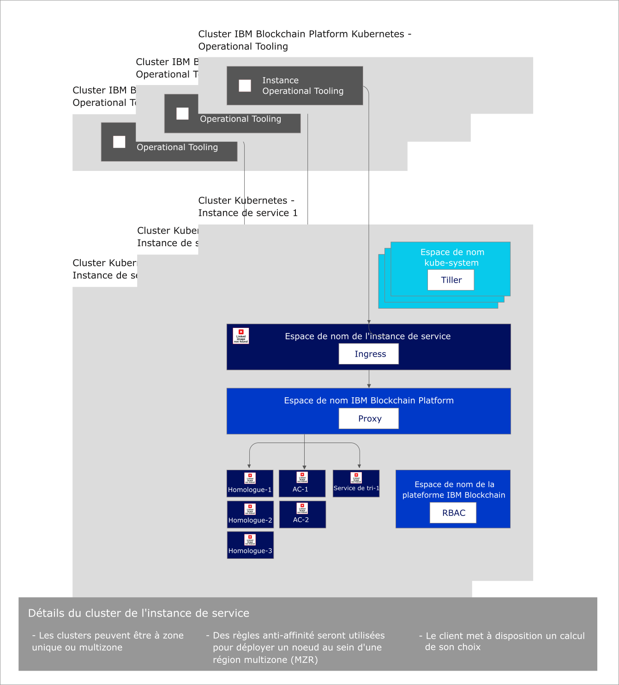

---

copyright:
  years: 2019
lastupdated: "2019-04-18"

subcollection: blockchain

---

{:new_window: target="_blank"}
{:shortdesc: .shortdesc}
{:screen: .screen}
{:codeblock: .codeblock}
{:note: .note}
{:important: .important}
{:tip: .tip}
{:pre: .pre}

# A propos de la version bêta gratuite 2.0 d'{{site.data.keyword.blockchainfull_notm}} Platform
{: #ibp-console-overview}

La version bêta gratuite 2.0 d'{{site.data.keyword.blockchainfull}} Platform est la génération suivante des offres {{site.data.keyword.blockchainfull_notm}} Platform, qui vous donne un contrôle total sur vos déploiements et vos clés publiques et privées. Cette version bêta gratuite inclut la nouvelle console {{site.data.keyword.blockchainfull_notm}} Platform, une interface utilisateur qui peut simplifier et accélérer le processus de déploiement de composants dans un service {{site.data.keyword.cloud_notm}} Kubernetes géré et contrôlé par vous. Pour plus d'informations sur Kubernetes et {{site.data.keyword.cloud_notm}} Kubernetes Service, voir [Kubernetes](/docs/services/blockchain/reference/k8s.html "Kubernetes").
{:shortdesc}

La version 2.0 bêta gratuite d'{{site.data.keyword.blockchainfull_notm}} Platform est désormais mise à niveau vers le codebase Hyperledger Fabric 1.4.0. Pour plus d'informations sur les nouvelles fonctionnalités d'Hyperledger Fabric 1.4.0, voir [Nouveautés de la version 1.4 ](https://hyperledger-fabric.readthedocs.io/en/release-1.4/whatsnew.html "Nouveautés de Fabric 1.4"){:new_window}.

## Contenu de l'offre bêta
{: #ibp-console-overview-capabilities}

Cette dernière édition est destinée aux utilisateurs {{site.data.keyword.blockchainfull_notm}} et Hyperledger Fabric expérimentés et elle leur permet d'héberger des réseaux ou de créer de nouvelles organisations qui peuvent rejoindre d'autres réseaux {{site.data.keyword.blockchainfull_notm}} 2.0. Si vous êtes un client de plan Starter ou Enterprise existant, au lieu de la gestion de votre réseau par {{site.data.keyword.IBM_notm}}, vous avez le contrôle total avec la possibilité de mettre à disposition, de surveiller et de gérer vos composants au sein de votre propre cluster Kubernetes.

La version bêta gratuite 2.0 de {{site.data.keyword.blockchainfull_notm}} Platform présente les caractéristiques suivantes :

**Expérience de développement intégrée**
- **Codez facilement** vos contrats intelligents en Node.js, Golang ou Java, écrivez des applications client à l'aide de la nouvelle extension {{site.data.keyword.blockchainfull_notm}} VSCode, optimisez l'**intégration SDK** avec la console, et apprenez avec nos tutoriels et exemples enrichis.
- **Simplified DevOps** vous permet de passer du développement au test en production dans un environnement unique avec l'extension de vos ressources Kubernetes pour l'ajout de composants supplémentaires.
- **A jour des fonctions principales de Fabric.** Bénéficiez des fonctionnalités les plus récentes d'Hyperledger Fabric version 1.4 :
  - [**Collectes de données** privées](/docs/services/blockchain/howto/ibp-console-smart-contracts.html#ibp-console-smart-contracts-private-data) qui permettent une meilleure confidentialité des données avec la garantie que les données de registre sont partagées sur des homologues autorisés uniquement via le protocole gossip.
  - [Reconnaissance de service](https://hyperledger-fabric.readthedocs.io/en/release-1.4/discovery-overview.html "Reconnaissance de service"), qui vous permet de découvrir et de mettre à jour de manière dynamique la façon dont votre application interagit avec votre réseau.
  - [Listes de contrôle d'accès de canal](https://hyperledger-fabric.readthedocs.io/en/release-1.4/access_control.html "Listes de contrôle d'accès") qui vous donne un contrôle supplémentaire sur la gouvernance de vos canaux et contrats intelligents.
- **Intégration de service {{site.data.keyword.cloud_notm}}.** Optimisez les services {{site.data.keyword.cloud_notm}} intégrés, tels que {{site.data.keyword.cloud_notm}} Kubernetes Service Dashboard, {{site.data.keyword.IBM_notm}} Log Analysis with LogDNA et {{site.data.keyword.cloud_notm}} Identity and Access Management (IAM).

**Contrôle total de vos déploiements**
- **Déployez uniquement les composants dont vous avez besoin**. Connectez un homologue à plusieurs canaux et réseaux, ou hébergez un service de tri auquel les partenaires commerciaux peuvent se connecter.
- **Conservez le contrôle intégral de vos identités**. Stockez et gérez les clés qui sont utilisées pour administrer vos noeuds sans stocker vos clés privées sur {{site.data.keyword.cloud_notm}}.
- **Opération centralisée**. La console {{site.data.keyword.blockchainfull_notm}} Platform vous permet de déployer et de gérer l'ensemble de vos organisations et noeuds sur **une console centrale** sans avoir à compter sur {{site.data.keyword.IBM_notm}} ou d'autres fournisseurs pour gérer vos services de tri ou votre autorité de certification. Vous pouvez aussi ajouter ou retirer des membres d'un consortium de blockchain, créer et rejoindre des canaux, puis installer et instancier des contrats intelligents depuis votre console.
- **Hébergez ou rejoignez un réseau**. Déployez des homologues hébergés dans votre cluster sur plusieurs canaux dans différents clouds, ou invitez d'autres organisations à rejoindre votre consortium ou vos canaux, pendant que les organisations gèrent leurs noeuds de manière indépendante au sein d'infrastructures.
- **Gérez l'accès** des utilisateurs qui peuvent administrer ou surveiller vos noeuds.
- **Accédez directement aux journaux** de vos noeuds depuis le service {{site.data.keyword.IBM_notm}} Kubernetes. Utilisez le service {{site.data.keyword.cloud_notm}} Log Analysis ou un service tiers pour extraire et analyser vos journaux.
- **Interagissez directement avec pods de noeud** à l'aide de Kubernetes Dashboard. Lancez vos pods et conteneurs pour exécuter des commandes et mettre à jour des certificats depuis la ligne de commande.

**Evolutivité et flexibilité**
- **Choisissez votre calcul.** Vous avez la flexibilité de décider de la quantité d'UC, de mémoire et de stockage que vous voulez mettre à disposition dans votre cluster Kubernetes.
- **Augmentez** et réduisez le nombre de ressources dans votre cluster Kubernetes, en ne payant que ce que ce dont vous avez besoin.
- **Reprise après incident et disponibilité multi-zone.** Cette option duplique votre déploiement Kubernetes entre les zones, ce qui permet la haute disponibilité (HA) de vos composants et la reprise après incident (DR).  

Consultez ce [blog ](https://www.ibm.com/blogs/blockchain/2019/02/taking-the-next-step-towards-deploying-blockchain-anywhere "Taking the next step towards deploying blockchain for business anywhere") pour plus de détails sur l'étape suivante relative au déploiement de blockchain pour une entreprise à un autre emplacement.  

Cette offre est destinée aux utilisateurs Fabric expérimentés qui souhaitent générer et gérer leurs propres réseaux. La possibilité de déployer un réseau entier d'un simple clic sera bientôt offerte. En attendant, pour déployer un réseau en un clic et qui utilise une configuration standard, consultez plutôt notre documentation sur le [Plan Starter](/docs/services/blockchain/get_start_starter_plan.html#getting-started-with-starter-plan).

## Remarques
{: #ibp-console-overview-considerations}

Avant de déployer la console, tenez compte des remarques suivantes :

- La version 2.0 bêta gratuite d'{{site.data.keyword.blockchainfull_notm}} Platform est générée avec Hyperledger Fabric version 1.4.0
- Tous les homologues déployés avec la version 2.0 bêta gratuite utilisent CouchDB comme base de données d'état.
- Vous avez la possibilité d'utiliser un cluster Kubernetes gratuit à des fins d'évaluation de l'offre bêta. Toutefois, la capacité et les performances sont limitées, aucune de vos données ne peut être migrée et le cluster est supprimé au bout de 30 jours.
- Vous êtes chargé de gérer la surveillance de l'intégrité, de la sécurité et de la journalisation de votre cluster Kubernetes. Consultez ces [informations ](https://cloud.ibm.com/docs/containers/cs_responsibilities.html#your-responsibilities-by-using-ibm-cloud-kubernetes-service "Responsabilités de gestion de cluster") pour plus de détails sur les éléments gérés par {{site.data.keyword.cloud_notm}} et sur ceux dont vous êtes responsable.
- Vous êtes également responsable de la surveillance de l'utilisation des ressources de votre cluster Kubernetes à l'aide du tableau de bord Kubernetes. Si vous devez accroître la capacité de stockage ou les performances de votre cluster, consultez les informations relatives à la [modification de votre volume existant](https://cloud.ibm.com/docs/containers/cs_storage_file.html#change_storage_configuration "Modification de la taille et des IOPS de votre périphérique de stockage existant").
- Vous êtes responsable de la gestion et de la sécurisation de vos certificats, et de vos clés publiques et privées. {{site.data.keyword.IBM_notm}} ne stocke pas vos certificats dans le cluster Kubernetes ou sur la console. Ceux-ci sont conservés uniquement dans le stockage local de votre navigateur. Si vous changez de navigateur, vous devrez importer vos identités créées dans ce navigateur.
- L'offre de la version 2.0 bêta gratuite est disponible uniquement dans la région de **Dallas** du service {{site.data.keyword.cloud_notm}} Kubernetes. Cette région regroupe les centres de données de Dallas, San Jose, Houston et du Brésil. Par conséquent, tous les composants de blockchain peuvent résider dans l'un des ces quatre centres de données. Ils ne sont pas déployés ailleurs.
- Comme l'offre de {{site.data.keyword.blockchainfull_notm}} Platform version 2.0 bêta est gratuite, si vous choisissez un cluster Kubernetes payant au lieu du cluster gratuit limité, des frais seront appliqués à votre compte {{site.data.keyword.cloud_notm}}.
- Kubernetes doit être en version 1.11 ou suivante dans votre cluster {{site.data.keyword.cloud_notm}} Kubernetes. Utilisez ces instructions pour [mettre à niveau vos clusters nouveaux et existants](/docs/services/blockchain/howto/ibp-v2-deploy-iks.html#ibp-v2-deploy-iks-updating-kubernetes) vers cette version.

## Migration
{: #ibp-console-overview-migration}

Vous ne pouvez pas migrer d'une offre {{site.data.keyword.blockchainfull_notm}} Platform vers la version **beta** gratuite 2.0 d'{{site.data.keyword.blockchainfull_notm}} Platform.  

Certaines instance de service de la version bêta gratuite 2.0 d'{{site.data.keyword.blockchainfull_notm}} Platform ne pourront pas être migrées vers la version en disponibilité générale. De même, les instances de plan Starter ne pourront pas être migrées vers la version 2.0 en disponibilité générale.

## Licence et tarification
{: #ibp-console-overview-license-and-pricing}

{{site.data.keyword.blockchainfull_notm}} Platform 2.0 bêta est une version gratuite. Une instance de la console est fournie avec chaque déploiement de la plateforme dans un cluster {{site.data.keyword.cloud_notm}} Kubernetes Service. Vous devez payer pour le cluster Kubernetes si vous choisissez de déployer la console dans un cluster standard de {{site.data.keyword.cloud_notm}} Kubernetes Service.

## Mise en route
{: #ibp-console-overview-deploy}

Une instance de la console est déployée dans un cluster {{site.data.keyword.IBM_notm}} Kubernetes Service dans le cadre du déploiement de chaque instance de {{site.data.keyword.blockchainfull_notm}} Platform version 2.0 bêta gratuite.

Pour plus d'informations sur le déploiement de la console et de la plateforme, consultez le manuel [Getting started with {{site.data.keyword.blockchainfull_notm}} Platform free 2.0 beta](/docs/services/blockchain/howto/ibp-v2-deploy-iks.html#ibp-v2-deploy-iks).

Pour plus d'informations sur l'utilisation de la console pour démarrer le déploiement de noeuds et la génération de consortium, consultez le tutoriel [Génération de votre réseau](/docs/services/blockchain/howto/ibp-console-build-network.html#ibp-console-build-network). Ce tutoriel vous guidera tout au long du processus d'utilisation de la console pour créer un exemple de réseau composé de trois organisations, une organisation de tri, deux organisations d'homologue, ainsi qu'un canal auquel sont joints deux homologues. Vous pouvez utiliser l'exemple de réseau pour déployer des démos de validation de concept ou encore ajouter et développer les étapes du tutoriel pour créer votre propre configuration.

## Référence d'architecture
{: #ibp-console-overview-architecture}

L'illustration suivante présente les composants de votre réseau de blockchain et comment ils interagissent.

*Figure 1. Référence d'architecture*

Notez qu'une seule instance de la console, également appelée Operational Tooling, est créée pour chaque instance de service {{site.data.keyword.blockchainfull_notm}} Platform. Lorsqu'un noeud d'homologue, de service de tri ou d'autorité de certification est déployé à l'aide de la console, il est déployé dans l'**Instance de service de cluster Kubernetes**.

| **Cluster Kubernetes IBM Blockchain Platform** | **Description** |
| ------------------------- |-----------|
| Operational Tooling | Egalement appelée `console`, il s'agit de votre interface utilisateur centrale pour l'exploitation de tous vos composants de blockchain. A partir de cette console, vous pouvez désormais créer des noeuds d'autorité de certification, d'homologue et de service de tri, créer des canaux, installer et instancier des contrats intelligents développés avec l'extension VSCode d'Hyperledger Fabric version 1.4. La console est déployée dans un cluster appartenant à {{site.data.keyword.IBM_notm}}.|


| **Instance de service de cluster Kubernetes** | **Description** |
| ------------------------- |-----------|-----------|-----------|
| **Tiller** | Elément de [Helm tooling ](https://docs.helm.sh/glossary/#tiller "Tiller"), Tiller s'exécute dans le cluster Kubernetes pour gérer les installations de votre homologue, de votre autorité de certification et des chartes Helm de votre service de tri. |
| **Ingress** | [Objet Kubernetes](https://kubernetes.io/docs/concepts/services-networking/ingress/ "Ingress") qui permet d'accéder aux ressources de cluster depuis l'extérieur du cluster. |
| **Proxy** | Le proxy {{site.data.keyword.blockchainfull_notm}} Platform est responsable du routage du trafic vers les noeuds d'homologue, d'autorité de certification et de service de tri corrects à l'aide du routage d'en-tête d'hôte. |
| **Homologues, autorités de certification, services de tri** | Il s'agit des noeuds qui sont créés par le déploiement de chartes Helm sous-jacentes. Remarque : Ces noeuds peuvent également être importés depuis d'autres instance de service de cluster Kubernetes. Comme les clés ne sont jamais stockées par {{site.data.keyword.IBM_notm}}, chaque noeud d'homologue et de service de tri inclut un proxy Web gRPC qui permet à la console de communiquer avec chaque noeud à l'aide des clés du portefeuille de consoles. |
| **RBAC** | Contrôle d'accès à base de rôles.  {{site.data.keyword.blockchainfull_notm}} Platform configure [Kubernetes RBAC ](https://kubernetes.io/docs/reference/access-authn-authz/rbac/ "Using RBAC Authorization") dans le cluster qui est nécessaire pour gérer des composants de blockchain dans le cluster.  |

## Haute disponibilité (HA) et reprise après incident (DR)
{: #ibp-console-overview-hadr}

Le stockage multi-zone doit être désactivé dans votre cluster IBM Cloud Kubernetes payant si vous avez besoin de la haute disponibilité (HA) et de la reprise après incident (DR). Différentes [options de stockage Kubernetes](https://cloud.ibm.com/docs/containers/cs_storage_planning.html#persistent_storage_overview) sont disponibles. Très prochainement, IBM Cloud prendra en charge la solution de stockage Portworx qui est la solution recommandée. En attendant, si vous avez besoin de la haute disponibilité (HA) et de la reprise après incident (DR) pour votre implémentation, vous devrez fournir votre propre solution de stockage.  

Pour ajouter votre solution de stockage, vous devrez créer une classe de stockage personnalisée. Consultez la section relative à l'[ajout d'une classe de stockage](https://cloud.ibm.com/docs/containers/cs_storage_basics.html#storageclasses) pour votre solution. {{site.data.keyword.blockchainfull_notm}} Platform utilise la [mise à disposition de volume dynamique](https://cloud.ibm.com/docs/containers/cs_storage_basics.html#dynamic_provisioning) avec la classe de stockage `default`. Par conséquent, pour modifier la classe de stockage default, exécutez la commande suivante :
```
kubectl patch storageclass <storageclass> -p '{"metadata": {"annotations":{"storageclass.kubernetes.io/is-default-class":"true"}}}'
```
{:codeblock}

Remplacez ``<storageclass>`` par le nom de votre classe de stockage.   

Enfin, assurez-vous d'activer les régions multi-zone lors de la création de votre cluster payant.

## Support
{: #ibp-console-overview-support}

Pour plus d'informations sur l'obtention d'un support sur {{site.data.keyword.blockchainfull_notm}} Platform 2.0, et pour accéder à des ressources de développeur de blockchain gratuites et à des forums de support pour la résolution de problèmes, voir [Support](/docs/services/blockchain/ibmblockchain_support.html#blockchain-support).

Le support de {{site.data.keyword.blockchainfull_notm}} Platform 2.0 sera limité pendant la période bêta.
{: important}
