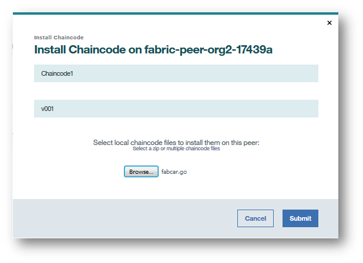

---

copyright:
  years: 2017, 2018
lastupdated: "2018-05-15"
---

{:new_window: target="_blank"}
{:shortdesc: .shortdesc}
{:codeblock: .codeblock}
{:screen: .screen}
{:pre: .pre}

# Installation, instanciation et mise à jour d'un code blockchain

Le code blockchain est un logiciel, écrit en Go, Java ou Node.js, qui encapsule la logique métier et les instructions transactionnelles
pour la création et la modification des actifs.  Il s'exécute dans un conteneur Docker associé à un homologue qui doit interagir avec lui.  Pour plus d'informations sur le développement du code blockchain, voir [Chaincode Tutorials ](http://hyperledger-fabric.readthedocs.io/en/latest/chaincode.html).
{:shortdesc}

Le code blockchain est installé sur le système de fichiers d'un homologue, puis il est instancié sur un canal. **Tous les membres de canal doivent installer le code blockchain sur chaque homologue qui va exécuter le code blockchain.** Pour utiliser le même code blockchain, les membres du canal doivent lui donner le même nom et la même version lors de l'installation de ce code blockchain. Ensuite, l'étape d'instanciation implique
l'initialisation des paires clé-valeur et le déploiement du conteneur de code blockchain. Tout homologue, via lequel les applications vont interagir avec un code blockchain, doit comporter le code blockchain installé sur son système de fichiers et disposer d'un conteneur de code blockchain opérationnel. **Toutefois, si un homologue utilise le même code blockchain sur plusieurs canaux, il n'a besoin que d'une seule instance du conteneur**.

La **combinaison installation/instanciation** est une fonction puissante car elle permet à un homologue d'interagir avec le même conteneur de code blockchain sur plusieurs canaux. Le seul prérequis est que les fichiers source de code blockchain réel soient installés sur le système de fichiers de l'homologue. De cette façon, si un élément de code blockchain est utilisé sur des douzaines de canaux, un homologue n'aura besoin que d'un seul conteneur de code blockchain pour exécuter des opérations de lecture/écriture sur tous les registres de canal. Cette approche souple se révèle bénéfique pour les performances et le débit de calcul dès lors que l'échelle des réseaux et les applications de code blockchain deviennent plus élaborés.

**Remarque** : Si vous développez votre code blockchain de manière interactive et devez mettre à jour un code blockchain, vous devez répéter les étapes d'installation et d'instanciation pour le code blockchain.

## Installation d'un code blockchain
{: #installchaincode}

Vous devez installer le code blockchain sur chaque homologue qui va exécuter le code blockchain. Pour installer un code blockchain, procédez comme suit :
1. Dans l'écran "Installer le code" de votre moniteur réseau, sélectionnez dans la liste déroulante un homologue sur lequel installer le code blockchain.  Cliquez sur le bouton **Installer le code blockchain**.
<!--
  
-->

2. Dans la fenêtre contextuelle **Installer le code blockchain**, entrez le nom et la version de votre code blockchain. **Notez** que les chaînes de nom et de version seront utilisées dans les applications pour interagir avec le code blockchain installé. Cliquez sur le bouton **Parcourir** et parcourez votre code système de fichiers local jusqu'à l'emplacement de stockage de la source de votre code blockchain. Sélectionnez un ou plusieurs fichiers source de code blockchain à installer sur votre homologue. Sélectionnez ensuite votre langage de code blockchain dans le menu déroulant **Type de code blockchain**.

  

## Instanciation d'un code blockchain
Une fois le code blockchain installé sur le système de fichiers de chaque homologue qui rejoint un canal, il est nécessaire de l'instancier sur le canal de sorte que les homologues puissent interagir avec le registre via le conteneur de code blockchain. L'instanciation exécute l'initialisation nécessaire du code blockchain. Cela implique souvent la définition de paires clé-valeur qui comprennent la base de données "world state" initiale d'un code blockchain.

Vous devez posséder les droits **Opérateur** ou **Rédacteur** sur le canal pour pouvoir instancier le code blockchain. Le code blockchain dont le nom et la version sont identiques sur différents homologues doit être instancié une seule fois pour le déploiement du conteneur de code blockchain. Pour instancier un code blockchain, procédez comme suit :
1. Dans l'écran "Installer le code" de votre moniteur réseau, sélectionnez l'homologue sur lequel vous avez installé le code blockchain et localisez le code blockchain que vous voulez instancier dans le tableau de code blockchain.  Ensuite, cliquez sur le bouton **Instancier** sous l'en-tête **Action**.
<!--
  
-->

2. Dans la fenêtre contextuelle **Instancier un code blockchain**, définissez les paires clé/valeur en tant qu'arguments pour l'initialisation du code blockchain, puis sélectionnez le canal dans lequel effectuer l'instanciation.  Cliquez sur **Soumettre**.
<!--
  
-->

## Mise à jour d'un code blockchain
Vous pouvez mettre à jour un code blockchain afin de modifier la programmation du code blockchain tout en conservant sa relation aux actifs dans le registre. En raison de la combinaison installation et instanciation, vous devez mettre à jour le code blockchain sur tous les homologues qui se trouvent sur le canal avec ce code blockchain. Pour mettre à jour un code blockchain, procédez comme suit.

1. Installez un code blockchain portant le même nom que votre ancien code blockchain, mais avec une version différente. Vous pouvez suivre les mêmes étapes que celles de la section [Installation d'un code blockchain](install_instatiate_chaincode.html#Installing a chaincode). Vérifiez que vous sélectionnez le même canal que votre code blockchain d'origine.

  

2. Localisez votre nouveau code blockchain dans le tableau et cliquez sur le bouton **Mettre à jour** sous l'en-tête **Action**. Cette action instancie de nouveau votre code blockchain et remplace le conteneur de code blockchain sous un nouveau nom. Notez que vous n'avez pas besoin d'entrer de nouveaux arguments dans le cadre de la fonction de mise à jour.

  
