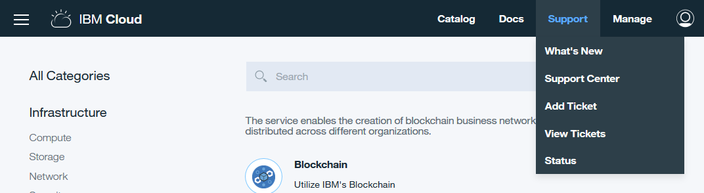

---

copyright:
  years: 2017
lastupdated: "2017-11-17"
---

{:new_window: target="_blank"}
{:shortdesc: .shortdesc}
{:codeblock: .codeblock}
{:screen: .screen}
{:pre: .pre}

# Support
{: #ibmblockchain_support}

Plusieurs mécanismes sont disponibles pour obtenir un support et traiter les incidents associés à votre instance de blockchain sur {{site.data.keyword.Bluemix}}.
{:shortdesc}

## Problèmes non liés à un incident

Accédez à l'écran "Support" de votre **moniteur réseau**, comme illustré dans la **Figure 1**.  Vous y trouverez des liens vers des ressources qui fournissent des informations techniques et une assistance.  Pour une description détaillée de l'écran "Support", voir la section *Support* dans [Moniteur réseau](v10_dashboard.html).

*Figure 1. Ecran Support*

## Problèmes liés aux incidents de logiciel

Pour les problèmes logiciels, ou si votre problème ne peut pas être résolu par l'une des méthodes précédentes, vous pouvez rechercher des réponses auprès du support {{site.data.keyword.Bluemix_notm}}. Cliquez sur le lien **Support** dans l'angle supérieur gauche de votre console {{site.data.keyword.Bluemix_notm}}, comme illustré dans la **Figure 2**.  Pour plus d'informations, voir [Traitement des incidents](../../troubleshoot/troubleshoot.html){:new_window}.

*Figure 2. Lien Support*

Si votre problème ne peut toujours pas être résolu, suivez les étapes de soumission d'une demande de service :

1. Cliquez sur le lien **Support** dans l'angle supérieur droit de votre console {{site.data.keyword.Bluemix_notm}}, comme illustré dans la Figure 2.
2. Cliquez sur le lien **Ajouter des tickets** dans la liste déroulante, comme illustré dans la Figure 3.  
    
  *Figure 3. Ajouter des tickets*  
3. Choisissez votre catégorie de support dans l'écran "Support".
4. Entrez l'objet ainsi qu'une courte description de votre problème.  Vous pouvez aussi envoyer par téléchargement des pièces jointes et ajouter d'autres adresses électroniques de notification.  Assurez-vous d'inclure le mot clé **blockchain** dans votre question.
5. Cliquez sur le bouton **Soumettre**.  Au bout de quelques minutes, vous recevez une notification par courrier électronique concernant le ticket de service ouvert pour votre demande.  Suivez les instructions du courrier électronique pour plus d'informations sur le problème.
