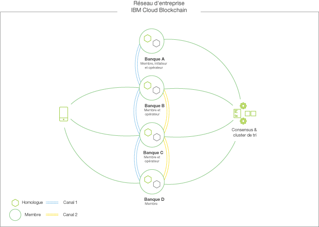

---

copyright:
  years: 2017
lastupdated: "2017-08-24"

---

{:new_window: target="_blank"}
{:shortdesc: .shortdesc}
{:screen: .screen}
{:codeblock: .codeblock}
{:pre: .pre}

# Plateforme {{site.data.keyword.blockchainfull_notm}}

**ATTENTION :** Avant d'utiliser une offre {{site.data.keyword.blockchainfull}}, lisez les informations relatives aux données techniques et à l'aide dans la section [Clause de protection](needtoknow.html).  
{:shortdesc}

La plateforme {{site.data.keyword.blockchainfull_notm}} est la seule plateforme d'entreprise intégrée capable de gérer le cycle de vie complet (**développement**, **gouvernance** et **exploitation**) d'un réseau de blockchain à plusieurs organisations. Elle est conçue pour accélérer, grâce à une collaboration à chaque stade, la création de réseaux de blockchain globaux "conçus pour l'entreprise" à la fois performants et sécurisés même dans les environnements les plus exigeants et les secteurs réglementés. Les offres de solution {{site.data.keyword.blockchainfull_notm}} reposent sur une base de code Hyperledger Fabric V1.0 qui optimise une architecture modulaire pour parvenir aux niveaux de sécurité, d'intégrité des données, d'évolutivité et de performance nécessaires pour répondre aux besoins de votre entreprise.  

Examinons les activités et rôles principaux au sein du réseau {{site.data.keyword.blockchainfull_notm}} et voyons comment ils s'intègreent au cycle de vie d'un réseau.

**Remarque **: Le tableau ci-dessous n'est pas censé représenter une progression linéaire. Des tâches telles que le développement et la gestion de réseau se reproduisent de manière répétée au fur et à mesure de l'évolution des applications et de l'appartenance des membres.

|  Fonction     | Activités        | Rôles  |
| ------------------------- |--------------------------|-----|
| [Développement ](https://developer.ibm.com/blockchain/sandbox/) | Développer des applications, Développer du code blockchain | Développeurs d'applications |
| [Gouvernance](get_start.html)| Inviter des membres, Générer des données d'identification, Proposer des modèles de gouvernance, Accepter de nouveaux membres, Disséminer des certificats & des infos de noeud final | Opérateurs réseau, Membres du réseau |
| [Exploitation](v10_dashboard.html)| Surveiller la santé et l'activité, Gérer de nouveaux déploiements, Gérer les membres (ajout/retrait), Gérer le cycle de vie du code blockchain, Gérer les canaux, Support | Opérateurs réseau, Participants du réseau |
  
Maintenant, regardons de plus près ces rôles et activités...

## **Développement** du réseau
Vous pouvez explorer et accélérer le développement blockchain en optimisant les meilleures pratiques affinées dans plus de 400 engagements clients pour :
* Garantir une concordance étroite entre les entreprises dotées d'une technologie qui réduit considérablement le temps de développement des applications blockchain (des applications dont le développement était autrefois de six semaines peuvent désormais être crées en moins de deux jours).
* Promouvoir des compétences en matière de blockchain au sein de votre équipe de programmateurs en optimisant les outils de développeur {{site.data.keyword.blockchainfull_notm}}.
* Offrir aux développeurs la souplesse nécessaire pour leur permettre un apprentissage et un développement dans leur environnement préféré avec un jeu d'outils ouvert et moderne.  
  
En tant que propriétaire de l'activité, vous pouvez développer votre scénario d'utilisation avec l'aide d'une équipe chevronnée d'experts IBM du secteur et en matière de blockchain, qui se sont engagés sur la voie {{site.data.keyword.blockchainfull_notm}} pour exploiter toutes les capacités de la plateforme IBM Blockchain. 

En tant que développeur, vous pouvez mettre rapidement et facilement en concordance les besoins métier et accélérer le développement gratuit d'applications à partir d'un bac à sable dans le cloud et d'un terrain de jeu interactif capable de muer n'importe quel programmeur en un développeur blockchain. Les outils suivants sont conçus pour vous permettre de transformer des règles métier en code dans votre environnement préféré :
* **Exploration en ligne**  
  Avec [Hyperledger Composer ](https://hyperledger.github.io/composer/introduction/introduction.html), outil de développement en code source ouvert, découvrez les principaux concepts de blockchain, afin de créer des définitions réseau et d'optimiser des modèles de secteur réutilisables et des bibliothèques de contrats intelligents. 
* **Installation locale**  
  Grâce aux images certifiées IBM d'Hyperledger Fabric and Composer, architecture en code source ouvert pour la création d'un réseau d'entreprise, vous pouvez développer et tester directement sur votre ordinateur portable.
* **Collaboration dans un environnement cloud**  
  Options gratuites et payantes pour le développement et le partage de votre code avec d'autres utilisateurs.
  
Une fois que vous avez développé votre réseau d'entreprise, vous pouvez le développer dans un réseau opérationnel qui exécute la plateforme IBM Blockchain Platform grâce à cette [méthode](https://ibm-blockchain.github.io/platform-deployment/).

## **Gouvernance** du réseau
Vous disposez de deux options pour créer l'environnement de back end de votre réseau. Tout d'abord, vous pouvez utiliser les images Hyperledger Docker publiées, ce qui vous permet d'implémenter la bibliothèque Composer pour générer vos applications et interagir avec votre réseau. Ou bien, vous pouvez écrire du code blockchain en mode natif et développer du code côté serveur pour gérer les transactions. Une exécution en local est l'occasion parfaite pour adapter des configurations réseau, explorer de possibles scénarios d'utilisation, et démarrer la mise en place de démonstrations de faisabilité. Dès que votre démonstration de faisabilité commence à prendre forme, vous pouvez commencer à élargir sa mise en oeuvre en hébergeant votre réseau dans le cloud.

Avec un déploiement dans le cloud, vous disposez d'un ensemble simple de recettes et de scripts qui facilitent le déploiement d'un réseau Hyperledger Fabric sous Kubernetes. A ce stade, vous pouvez étudier le comportement et la stabilité de votre démonstration de faisabilité dans un environnement hébergé. Le service de conteneur [{{site.data.keyword.blockchainfull_notm}} ](https://ibm-blockchain.github.io/) peut au mieux être considéré comme une méthode de test du fonctionnement et de la résilience de votre application et comme un précurseur naturel du plan d'entreprise.

Dès lors que vous disposez d'un réseau, {{site.data.keyword.blockchainfull_notm}} a été conçu pour vous offrir une expérience de gestion du réseau dans laquelle les membres disposent d'un certain contrôle, et où le contrôle complet n'est pas confié à un seul membre. La plateforme {{site.data.keyword.blockchainfull_notm}} dispose du premier ensemble d'outils intégrés qui permet aux équipes de gérer les changements du réseau à l'aide de règles personnalisables. 

Voici la liste des principales fonctions de ce modèle de gouvernance :

* Outils de gestion démocratique permettant une gestion collective.
* Editeur de règles pour la définition de règles souples et démocratiques qui régissent les modifications apportées au réseau.
* Outils et règles préconfigurés permettant une intégration, une personnalisation et une activation plus rapides.
* Outil de gestion des flux de travaux multiples comprenant des notifications intégrées, un écran des activités de membre, ainsi qu'une collection de signatures sécurisées.

## **Exploitation** du réseau
Vous pouvez déployer et exploiter des réseaux décentralisés à l'aide d'un service sécurisé prêt pour la production. Commencez avec un petit réseau que vous ferez évoluer de manière élastique au fur et à mesure de l'ajout de membres et de l'accroissement du volume des transactions en utilisant les fonctions suivantes :

* Environnement hautement sécurisé doté de nombreuses fonctions de sécurité matérielles, logicielles et de microprogramme.
* Architecture renforcée pour l'évolutivité, la résilience et la disponibilité.
* Réseau optimisé pour les performances et s'exécutant dans un environnement de calcul Linux le plus rapide au monde.
  
L'exploitation de votre réseau sur la plateforme {{site.data.keyword.blockchainfull_notm}} inclut des outils et des fonctions qui simplifient les tâches d'administration :

* Tableaux de bord pour la surveillance et la gestion des ressources sur le réseau. 
* Gestion du cycle de vie pour les mises à niveau transparentes de la pile de code complète.
* Support technique 24h sur 24 et 7 jours sur 7 intégré au portail.
* Pile de sécurité renforcée sans aucun accès privilégié, résistance aux logiciels malveillants et aux tentatives de sabotage, chiffrement à 100 % et bien d'autres fonctions pour les réseaux comportant des données sensibles dans les secteurs réglementés.

## Participation à un réseau de blockchain 

Nous utilisons le terme **participant** comme classification la plus large pour désigner les organisations, personnes, applications ou appareils qui interagissent avec le réseau de blockchain. Sous l'appellation “participant”, on distingue deux groupes : les **membres** et les **utilisateurs**.   
 
En termes simples, un membre possède un certificat numérique valide qui lui permet d'émettre et/ou de valider des transactions au sein d'un réseau de blockchain. Un utilisateur ne possède pas de certificat mais il peut quand même interagir avec le réseau de blockchain par l'intermédiaire d'un membre de réseau existant. Le certificat d'un membre est similaire à une “carte de membre” d'un club de gym, par exemple. Etant donné qu'un utilisateur ne possède pas cette carte de membre, il peut accéder au club de gym en tant qu'“invité” d'un membre existant. Voyons à présent de plus près ces rôles.

### Membres 

La plateforme {{site.data.keyword.blockchainfull_notm}} repose sur l'architecture Hyperledger Fabric, qui elle-même utilise la technologie du “blockchain privé”. Par conséquent, tous les membres sont inscrits au sein du réseau au moyen d'un certificat qui leur accorde le droit d'utiliser le réseau en tant que **fournisseur** de services (pour émettre des certificats, valider/trier des transactions) ou en tant que **consommateur** de services (pour émettre des transactions).   

- **Fournisseurs - Accordent leur confiance aux membres** - Un réseau de blockchain est dirigé par ses membres. Pour qu'un réseau de blockchain soit opérationnel, un ensemble minimum de membres doit *fournir* les services de blockchain de base : services de validation des transactions, de tri des transactions et de gestion de certificats. Dès lors qu'ils exécutent ces services, les membres deviennent responsables de l'intégrité du registre partagé à l'épicentre du réseau de blockchain. Peut-être vous interrogez-vous sur le nombre de membres nécessaire pour qu'un réseau de blockchain soit opérationnel ? En fait, cela dépend du niveau de confiance exigé pour votre réseau. Certains réseaux tolèrent un modèle de confiance plus centralisé qui requiert moins de membres faisant office de fournisseurs. D'autres exigent un ensemble de membres plus diversifié (c'est-à-dire, des entités juridiquement distinctes) et la gestion d'un modèle de confiance plus décentralisé. Un exemple de modèle plus centralisé serait un réseau de visibilité de la chaîne d'approvisionnement dont les membres seraient un détaillant global, une compagnie de transport internationale et IBM. Dans ce cas, ces trois membres constitueraient la “base de confiance” du réseau, et fourniraient les services de base du réseau de blockchain. Ces membres pourraient émettre des importateurs et des exportateurs de certificats, des agents personnalisés, des détaillants, de manière à pouvoir participer (émettre des transactions) au réseau. Ce réseau permet de décentraliser la confiance en permettant à davantage de membres de participer à la fourniture de services de base, garantissant ainsi un contrôle de l'ensemble des membres, en ne laissant pas le contrôle exclusif à un seul membre. Un réseau typique comporterait une dizaine de membres fournissant les services de base du réseau de blockchain.

- **Consommateurs - Confiance établie, appels extérieurs possibles** – Une fois la base de confiance établie, le réseau peut prendre de l'expansion. Il n'est pas rare que la plupart des membres de votre réseau utilisent simplement celui-ci pour l'appel de transactions dans le registre partagé. Ces membres sont de simples *consommateurs* et ils ne participent pas aux services de base du réseau. Un réseau typique peut comporter d'une dizaine à une centaine de membres qui accordent le droit d'émettre des transactions au sein d'un réseau de blockchain donné.

#### Types de membre
 
Il est parfois utile de considérer les membres comme des personnes qui définissent le rôle de membre au sein du réseau d'entreprise. Voici quelques-uns des rôles les plus fréquemment constatés :
 
- **Initiateur** – Membre qui a été choisi par les autres membres pour amorcer le réseau de blockchain. Un seul membre est nécessaire pour la connexion à la plateforme IBM Blockchain et l'exécution des tâches de démarrage du réseau. Ces tâches consistent à nommer le réseau, à inviter les membres de l'ensemble initial et à définir le jeu de règles de fonctionnement par défaut du réseau. Il s'agit d'un rôle transitoire. Une fois le réseau amorcé, l'initiateur ne conserve pas de privilèges spéciaux et reprend simplement son rôle de membre.  

- **Responsable** – Membre qui exécute un ou plusieurs homologues réseau et autorités de certification. Ce type de membre est responsable de l'intégrité du registre partagé car il participe au processus de consensus, qui définit le mode de validation des transactions sur un réseau de blockchain. Le responsable, propriétaire d'une autorité de certification, a aussi la capacité d'émettre des certificats pour les participants et d'accorder à ces derniers l'accès au réseau. 
 
- **Opérateur** – Membre qui exécute des services pour le compte d'autres membres du réseau, comme le service de tri des transactions, les autorités de certification, les passerelles de transaction et d'autres services de base du réseau. Par défaut, IBM est l'opérateur réseau des réseaux déployés sur la plateforme IBM Blockchain.
 
- **Auditeur** – Membre auquel le réseau a accordé des droits pour l'exécution de fonctions d'audit sur le réseau. Ces fonctions d'audit peuvent inclure la facturation, le suivi ou l'analyse de conformité. Le rôle d'auditeur consiste généralement à devenir un membre qui a accès à une vue plus globale des transactions dans le registre, et/ou une inscription plus étendue dans les canaux de transaction.

### Utilisateurs

Alors qu'un réseau de blockchain peut comporter des centaines de membres, ses utilisateurs peuvent se compter par milliers. Un utilisateur a le rôle d'un participant au sein d'un réseau de blockchain et qui a un accès indirect au registre via une “relation d'accréditation” avec un membre existant. Ainsi, il est courant que certaines applications mobiles utilisent leur propre mode d'authentification et d'autoriation utilisateur (OAuth, OpenID) et mappent ces données d'identification à un ou plusieurs membres accrédités au sein d'un réseau de blockchain. Un service proxy ou passerelle est généralement créé pour l'exécution de cette fonction de mappage, ce qui permet de mapper le monde extérieur au monde blockchain.

## Services de base du réseau 

Pour rendre un réseau opérationnel, ses membres doivent établir une base de confiance en fournissant l'un ou plusieurs des services de base suivants du réseau : 

- **Service de tri** – Tri et synchronisation des transactions  
  D'une manière globale, le service de tri définit le réseau. Il contient les données d'identité de chaque membre, des informations sur les canaux et un ensemble de règles qui déterminent les membres qui sont autorisés à exécuter certaines tâches (inviter d'autres membres, créer des canaux, etc.). Chaque opération de transaction et de configuration transitant par le service de tri, ce dernier est un élément plus qu'essentiel dans l'ensemble du processus. Etant donné l'importance fondamentale du service de tri, on devine déjà aisément les risques de dérive d'un tel système dans lequel un seul membre pourrait peut-être tirer toutes les ficelles. Pour contrer cela, le service de tri est généralement géré par des membres du réseau et des règles de gouvernance sont mises en oeuvre conjointement. Autrement dit, les décisions sont prises de manière collective, et NON de manière unilatérale. Tous les membres ont un rôle au sein du réseau et, par extension, un droit de vote concernant toutes les opérations qui configurent et personnalisent leur position sur ce réseau. Ces notions de “démocratie” et de décisions prises conjointement constituent les éléments structurants inhérents à un réseau décentralisé et digne de confiance. IBM fait office d'"opérateur" du service de tri pour les réseaux déployés sur la plateforme IBM Blockchain.
 
- **Autorité de certification** – Emission de certificats pour les participants  
  En termes clairs, l'autorité de certification définit l'appartenance de membre. Toutes les entités du réseau (homologues, programmes de tri, clients, etc.) doivent posséder une identité pour communiquer, authentifier et enfin effectuer des transactions. Ces “identités” existent sous la forme de certificats x509 (c'est-à-dire, des certificats d'enregistrement), nécessaires à toute participation directe au réseau de blockchain. Il existe également d'autres modes de participation indirecte que nous verrons plus tard. L'autorité de certification doit plutôt être considérée comme le tampon qui officialise les attestations d'identité et la crédibilité.  Chaque membre possède sa propre autorité de certification, grâce à laquelle il peut signer des certificats non seulement pour les composants dont il a la propriété exclusive (homologues), mais également pour les clients et les applications de tiers. Vous pouvez ainsi comparer l'autorité de certification d'un membre à un stylet spécial ou un tampon de notaire. Un certificat signé par cette autorité de certification est prérequis pour l'accès au réseau.
 
- **Homologue** – Validation des transactions  
  L'homologue remplit deux fonctions principales : exécution/validation des transactions et gestion des registres. Il exécute des contrats intelligents et il détient l'historique de transactions ainsi que l'état en cours des actifs sur les canaux du réseau. En fin de compte, il est nécessaire d'accéder à l'homologue (directement ou indirectement) et d'effectuer des opérations de lecture et d'écritures dans le registre. Lorsqu'un membre accorde à un utilisateur final un accès au réseau, il lui accorde en fait l'accès aux fonctionnalités de l'homologue.

Lorsqu'un membre rejoint un réseau via la plateforme {{site.data.keyword.blockchainfull_notm}}, l'émission standard est un homologue et une autorité de certification. Dans un réseau de production, les membres peuvent s'ils le souhaitent exécuter plusieurs instances de ces services afin de garantir la disponibilité. Par défaut, IBM exécute le service de tri pour les réseaux crées par la plateforme {{site.data.keyword.blockchainfull_notm}}.  

## Plateforme {{site.data.keyword.blockchainfull_notm}}

La plateforme {{site.data.keyword.blockchainfull_notm}} fournit un réseau de blockchain hautement sécurisé et privé sur lequel des membres authentifiés peuvent aisément définir des actifs et créer les solutions métier permettant de les modifier et de les échanger. Il n'est plus question désormais d'un processus complexe et fastidieux pour amorcer un réseau de blockchain en production. Grâce à la plateforme {{site.data.keyword.blockchainfull_notm}}, vous pouvez tirer parti d'une infrastructure d'orchestration qui vous permet d'**organiser votre consortium en un réseau de blockchain actif en un temps record**. Nous mettons ainsi à disposition des consortium des outils conviviaux pour encourager plusieurs institutions à s'associer et créer un réseau régi de manière démocratique. Les tâches de création, de gouvernance et de gestion du réseau deviennent intuitives et transparentes grâce au moniteur de tableau de bord intégré et aux utilitaires mis à disposition. En évitant le processus laborieux de création d'un réseau et d'implémentation d'une gouvernance, les membres du consortium peuvent ainsi **se concentrer sur le déploiement de contrats intelligents et le transfert d'actifs et d'informations**.      
{:shortdesc}

La **haute disponibilité** pour les composants intégraux du réseau (homologue, service de commande, autorité de certification, code blockchain) élimine les effets désastreux qui pourraient naître de points de défaillance uniques. Un moniteur de tableau de bord intégré permet de gérer facilement ces composants et constitue un puissant mécanisme pour la visualisation des actifs et des contrats intelligents.

La **modularité** de l'architecture Hyperledger Fabric V1.0 et la nette séparation des rôles réseau fournit une infrastructure qui permet l'évolutivité et l'adaptabilité à un large éventail de scénarios d'utilisation.  

Les freins et contrepoids qui opèrent tout au long du cycle de vie d'une transaction garantissent des résultats homogènes et approfondis ; les registres demeurent constamment synchronisés grâce à la mise en oeuvre du protocole gossip bien connu. Le contrôle d'identité et d'accès sont aisément appliqués via les opérations de **signature/vérification** qui se produisent perpétuellement via le réseau.  

Des **outils de gouvernance** sont fournis pour permettre aux membres d'administrer et de gérer les règles métier essentielles au réseau. Vous pouvez, par exemple, implémenter des règles qui définissent le nombre de membres d'un réseau qui doivent accepter l'adhésion d'un nouveau membre. Ou peut-être un actif nécessite-t-il l'adhésion de chaque participant pour qu'une modification puisse être effectuée. Les règles de gouvernance sont une absolue nécessité pour tous les types de réseau métier et elles peuvent souvent être extrêmement élaborées. Les outils de gouvernance (éditeurs de règle, par exemple) simplifient énormément ce processus.

Le service s'exécute dans un environnement **hautement sécurisé et isolé** sans accès externe (y compris un accès utilisateur root) aux composants réseau. Les données sont chiffrées durant leur transfert et leur stockage, et le support disponible pour les modules de sécurité matériels permet de protéger les clés numériques conformément à la réglementation du secteur. La virtualisation matérielle permet d'exécuter chaque noeud dans un environnement isolé, ce qui protège ainsi les autres noeuds du réseau des homologues susceptibles de contenir du code malintentionné ou malveillant. Le hachage, les opérations de signature/vérification, ainsi que les communications entre composants sont accélérés par l'implémentation de systèmes de chiffrement évolués.

Avant de poursuivre, examinons une configuration simple au sein de la plateforme {{site.data.keyword.blockchainfull_notm}}. La **Figure 1** illustre un exemple de réseau de blockchain déployé composé de quatre membres (chacun propriétaire de deux homologues), une autorité de certification responsable de la distribution du matériel cryptographique de vérification d'identité et d'un service de commande définissant les règles et les participants du réseau.  Le canal bleu comporte l'ensemble des quatre membres du réseau, tandis que le canal jaune est limité à trois membres seulement : Les banques B, C et D. On peut voir également que la banque A a joué le rôle d'initiateur réseau et que la banque D existe seulement en tant que membre dans le contexte du canal jaune. Enfin, un utilisateur final ou une application en possession d'un certificat x509 correctement signé est en mesure d'effectuer des appels vers les homologues du réseau. Comme mentionné plus haut, il est tout a fait probable qu'un utilisateur final ne connaisse même pas l'existence du réseau de blockchain.

*Figure 2. Exemple de réseau de blockchain composé de quatre membres utilisant des canaux pour isoler des données*

## Offres d'appartenance de membre {{site.data.keyword.IBM_notm}}

La tableau ci-après récapitule les options d'appartenance actuelles et futures. Le [Plan d'enterprise](enterprise_plan.html) est l'option d'appartenance actuellement disponible.

|       | Entrée     | [Entreprise](enterprise_plan.html)  | Entreprise Plus | Autonome
| ------------------------- |--------------------------|-----|-----|------|
| **Inclus         ** | Services de base     | **Services avancés, prêts pour prod entreprise** | Calcul dédié aux performances et à l'isolement  | Pile de logiciels à installer dans votre infrastructure + connexion à un réseau hébergé sur ce service cloud |
| **Règle facturat** | Fact horaire  | **Abonnement mensuel  ** | Abonnement mensuel   | Abonnement mensuel   |
| **Disponibil  ** | Prochaine   | **Immédiate    ** | Prochaine   | Prévue pour 2018 |

Inscrivez-vous dès maintenant en tant que {{site.data.keyword.IBM_notm}} [{{site.data.keyword.blockchainfull_notm}} membre ](https://console.bluemix.net/catalog/services/blockchain?env_id=ibm:yp:us-south&taxonomyNavigation=apps)!

## {{site.data.keyword.IBM_notm}} Support 

{{site.data.keyword.IBM_notm}} propose un support sur les solutions {{site.data.keyword.blockchain}} mises en oeuvre par {{site.data.keyword.IBM_notm}}. Pour plus d'informations sur le support {{site.data.keyword.blockchainfull_notm}}, voir [Support](ibmblockchain_support.html).

Pour une présentation complète des fonctions et fonctionnalités de Hyperledger Fabric v1.0,
voir [Documentation Hyperledger Fabric](http://hyperledger-fabric.readthedocs.io/en/latest/).
