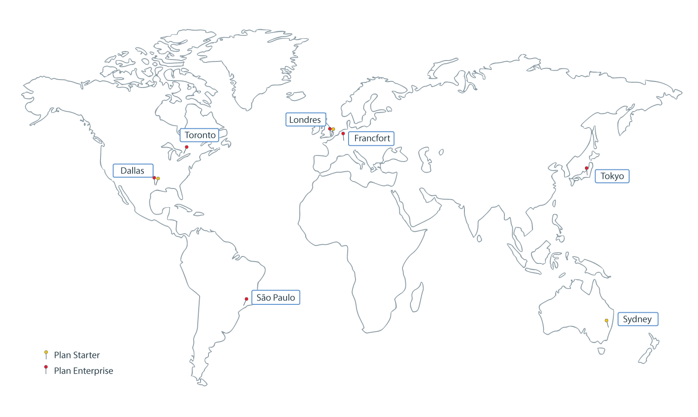

---

copyright:
  years: 2017, 2018
lastupdated: "2018-06-14"

---

{:new_window: target="_blank"}
{:shortdesc: .shortdesc}
{:screen: .screen}
{:pre: .pre}
{:table: .aria-labeledby="caption"}
{:codeblock: .codeblock}
{:tip: .tip}
{:download: .download}

# Régions et emplacements {{site.data.keyword.blockchainfull_notm}} Platform
{: #ibp-regions-locations}

{{site.data.keyword.cloud}} est hébergé dans le monde entier. Une région est une zone géographique accessible via un noeud final et les emplacements sont des centres de données au sein de la région. {{site.data.keyword.blockchainfull_notm}} Platform offre des plans d'appartenance globale dans {{site.data.keyword.cloud_notm}} dans des régions différentes. Lorsque vous créez une instance de service {{site.data.keyword.blockchainfull_notm}} Platform dans {{site.data.keyword.cloud_notm}}, votre réseau Blockchain et les ressources réseau sont créées et stockées dans la région {{site.data.keyword.cloud_notm}} où vous avez créé l'instance de service.
{:shortdesc}

Différentes offres {{site.data.keyword.blockchainfull_notm}} Platform sont disponibles dans les différentes régions {{site.data.keyword.cloud_notm}}. Vous ne pouvez créer des réseaux de blockchain que dans les régions {{site.data.keyword.cloud_notm}} où les plans {{site.data.keyword.blockchainfull_notm}} Platform sont disponibles.

{{site.data.keyword.blockchainfull_notm}} Platform prend en charge les régions {{site.data.keyword.cloud_notm}} suivantes :

| Région/emplacement | Plan Starter | Plan Enterprise | Noeud final d'API de la région |
|--------|----------|----------|-------------|
| Sud des Etats-Unis| O | O | api.ng.bluemix.net |
| Royaume-Uni | O | O | api.eu-gb.bluemix.net |
| Sydney | O | O | api.au-syd.bluemix.net |
| Asie-Pacifique nord |  | O | api.au-syd.bluemix.net |
| Allemagne |  | O | api.eu-de.bluemix.net |

La Figure 1 présente les régions {{site.data.keyword.cloud_notm}} et les emplacements pris en charge par {{site.data.keyword.blockchainfull_notm}} Platform.

  
_Figure 1. Régions et emplacements {{site.data.keyword.blockchainfull_notm}} Platform_
