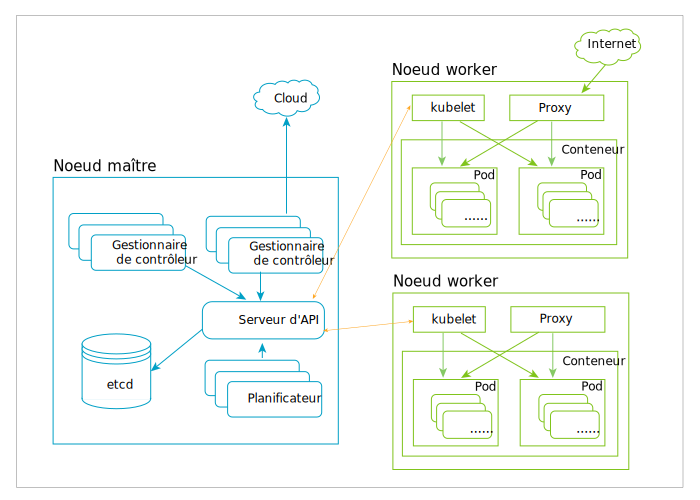

---

copyright:
  years: 2019
lastupdated: "2019-03-20"

subcollection: blockchain

---

{:new_window: target="_blank"}
{:shortdesc: .shortdesc}
{:screen: .screen}
{:codeblock: .codeblock}
{:note: .note}
{:important: .important}
{:tip: .tip}
{:pre: .pre}

# Kubernetes
{: #k8s-overview}

La console de la version 2.0 bêta gratuite d'{{site.data.keyword.blockchainfull_notm}} Platform est déployée sur un cluster Kubernetes via {{site.data.keyword.cloud_notm}} Kubernetes Service. Kubernetes est un système open source pour l'automatisation du déploiement, la mise à l'échelle et la gestion des applications conteneurisées.
{:shortdesc}

Kubernetes fournit un environnement de gestion axé sur un conteneur. Il orchestre le calcul, la mise en réseau et l'infrastructure de stockage au nom des charges de travail utilisateur. Vous bénéficiez ainsi aussi bien de la simplicité d'une plateforme sous forme de services (PaaS) que de la flexibilité d'une infrastructure sous forme de services (IaaS), avec une portabilité possible au sein des fournisseurs d'infrastructure.

Le diagramme ci-après décrit l'architecture de Kubernetes. Pour plus de détails sur les noeuds, les conteneurs et les pods, consultez la section [Principaux objets Kubernetes](#k8s-overview-key-obj) ci-dessous.

*Figure 1. Diagramme d'architecture Kubernetes*

## {{site.data.keyword.cloud_notm}} Kubernetes Service
{: #k8s-overview-iks}

{{site.data.keyword.cloud_notm}} Kubernetes Service offre de puissants outils en associant des conteneurs Docker, la technologie Kubernetes, une expérience utilisateur intuitive, ainsi qu'une sécurité et une isolation intégrées pour automatiser le déploiement, l'exploitation, la mise à l'échelle et la surveillance des applications conteneurisées dans un cluster d'hôtes de calcul.

Pour plus d'informations sur {{site.data.keyword.cloud_notm}} Kubernetes Service, consultez les rubriques suivantes dans la documentation de {{site.data.keyword.cloud_notm}} Kubernetes Service :
- [{{site.data.keyword.cloud_notm}} Kubernetes Service Technology ](https://cloud.ibm.com/docs/containers/cs_tech.html#ibm-cloud-kubernetes-service-technology "Documentation de {{site.data.keyword.cloud_notm}} Kubernetes Service")
- [Why {{site.data.keyword.cloud_notm}} Kubernetes Service ](https://cloud.ibm.com/docs/containers?topic=containers-cs_ov#cs_ov "Why {{site.data.keyword.cloud_notm}} Kubernetes Service documentation")

## Principaux objets Kubernetes
{: #k8s-overview-key-obj}

- **Cluster**

  Ensemble de machines, appelées noeuds, qui exécutent des applications conteneurisées gérées par Kubernetes. Un cluster comporte plusieurs noeuds worker et au moins un noeud maître.

- **Noeud**

  Un noeud est une machine worker dans Kubernetes. Il peut s'agir d'une machine virtuelle ou d'une machine physique, selon le cluster. Chaque noeud contient les services nécessaires à l'exécution des pods et il est géré par les composants maître. Les services sur un noeud incluent l'environnement d'exécution du conteneur, le `kubelet` et le `kube-proxy`. Pour plus d'informations, voir la [Section relative au noeud Kubernetes ](https://kubernetes.io/docs/concepts/architecture/nodes/ "Section relative au noeud Kubernetes") dans la documentation Kubernetes.

- **Conteneur**

  Image exécutable légère et portable qui contient le logiciel et toutes ses dépendances. Les conteneurs dissocient les applications de l'infrastructure hôte sous-jacente afin de simplifier le déploiement dans différents environnements de cloud ou SE, et pour une mise à l'échelle plus facile.

- **Pod**

  Objet Kubernetes le plus petit et le plus simple. Un pod représente un ensemble de conteneurs s'exécutant sur votre cluster. Un pod est généralement configuré pour exécuter un seul conteneur principal. Il peut également exécuter des conteneurs en option qui ajoutent des fonctions supplémentaires, comme la journalisation. Les pods sont couramment gérés par un déploiement. Pour plus d'informations, voir la [Section relative aux pods Kubernetes](https://kubernetes.io/docs/concepts/workloads/pods/pod/) dans la documentation Kubernetes.
