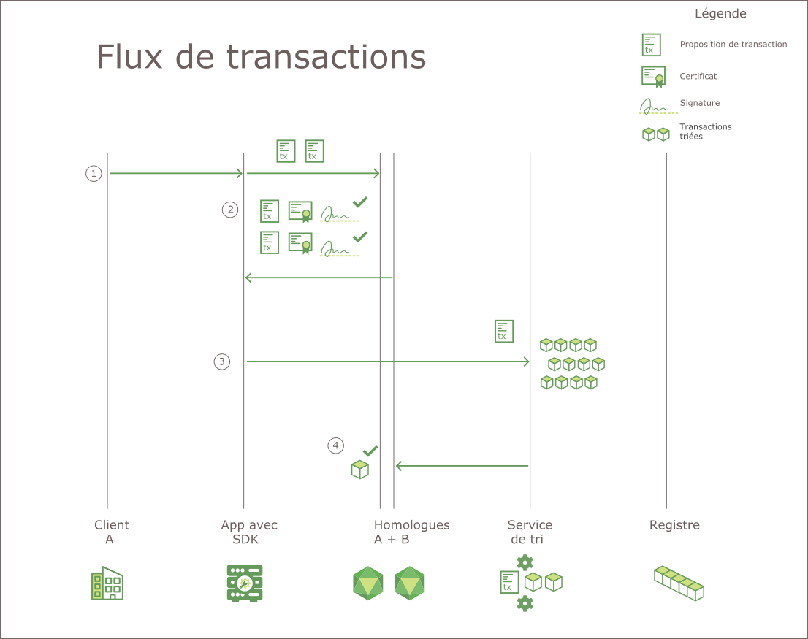

---

copyright:
  years: 2017
lastupdated: "2017-07-21"
---

{:new_window: target="_blank"}
{:shortdesc: .shortdesc}
{:codeblock: .codeblock}
{:screen: .screen}
{:pre: .pre}

# Hyperledger Fabric
Le réseau IBM Blockchain repose sur la pile Hyperledger Fabric V1.0, projet de blockchain au sein du projet Hyperledger de Linux Foundation. Il s'agit d'un réseau "privé" dans lequel l'ensemble des utilisateurs et des composants ont des identités connues. Une logique de signature/vérification est mise en oeuvre à chaque point de contact de communication, et les transactions sont accordées par le biais d'une série de contrôles d'adhésion et de validation. En ce sens, il diffère grandement des implémentations de blockchain traditionnelles qui encouragent l'anonymat et sont forcées de s'appuyer sur des crypto-monnaies et de lourdes contraintes de calcul pour valider les transactions.  
{:shortdesc}

Hyperledger Fabric V1.0 propose une architecture modulaire qui permet d'étendre l'évolutivité et les performances. Cette rubrique présente certains des principaux composants dans Hyperldger Fabric V1.0. Pour une présentation complète de Hyperledger Fabric V1.0, consultez la [documentation Hyperledger Fabric ](http://hyperledger-fabric.readthedocs.io/en/latest/){:new_window}.  

## Autorité de certification  
En tant que plateforme pour les réseaux de blockchain **privés**, Hyperledger Fabric inclut un composant **Autorité de certification (CA)** modulaire pour la gestion des identités réseau de l'ensemble des organisations membres et leurs utilisateurs. L'exigence d'une identité privée pour chaque utilisateur permet un contrôle ACL sur l'activité réseau et garantit que chaque transaction est finalement traçable jusqu'à un utilisateur inscrit.  
* L'autorité de certification (autorité de certification de Fabric par défaut) émet un certificat racine (**rootCert**) pour chaque **membre** (organisation ou personne) autorisé à rejoindre le réseau. 
* L'autorité de certification émet un certificat d'enregistrement (**eCert**) pour chaque composant de membre, des applications côté serveur et parfois des utilisateurs finaux. 
* Une allocation de certificats de transaction (**tCerts**) est également accordée à chaque utilisateur inscrit. Chaque **tCert** autorise une transaction réseau. 

Ce contrôle basé sur des certificats au niveau de l'appartenance réseau et des actions permet aux membres de restreindre l'accès des canaux privés et confidentiels, des applications et des données, à des des identités utilisateurs spécifiques.

Pour plus d'informations sur le composant Autorité de certification d'Hyperledger Fabric, consultez le document [Fabric CA User’s Guide ](http://hyperledger-fabric-ca.readthedocs.io/en/latest/){:new_window}.

## Membership Service Provider (Fournisseur de services aux membres)  
Hyperledger Fabric inclut un composant **Membership Service Provider (MSP)** qui offre une abstraction de tous les mécanismes cryptographiques et protocoles sous-jacents à l'émission et la validation de certificats, et à l'authentification utilisateur. MSP est installé sur chaque homologue de canal, afin de garantir que les demandes de transaction émises vers l'homologue sont issues d'une identité utilisateur authentifiée et autorisée.

Pour plus d'informations sur le composant Hyperledger Fabric Membership Services, consultez la rubrique [Membership Service Providers (MSP) ](http://hyperledger-fabric.readthedocs.io/en/latest/msp.html){:new_window} dans la [documentation Hyperledger Fabric](http://hyperledger-fabric.readthedocs.io/en/latest/){:new_window}.

## Flux de transactions  
Pour garantir la cohérence et l'intégrité des données, Hyperledger Fabric V1.0 met en oeuvre plusieurs points de contrôle via le flux de transactions, notamment l'authentification de client, l'adhésion, le tri et l'engagement dans le registre.

La **Figure 1** illustre le flux de transactions sur un réseau de blockchain Hyperledger Fabric V1.0 :

*Figure 1. Flux de transactions sur un réseau Hyperledger Fabric V1.0*

Sur un réseau Hyperledger Fabric V1.0, le flux de données pour les requêtes et les transactions est initié par une application côté client qui soumet une demande de transaction à un homologue sur un canal. Le flux de données initial au sein du réseau est commun aux requêtes et aux transactions:

1. Grâce à l'API `channel.SendTransactionProposal` disponible dans le kit de développement de logiciels, une application client signe et soumet une proposition de transaction aux homologues de validation appropriés sur le canal spécifié. Cette proposition de transaction initiale est une **demande** pour la validation.  
2. Chaque homologue du canal vérifie l'identité et l'autorité du client qui soumet, et (si elle est valide) exécute le code blockchain sur les entrées fournies (clés/valeurs). En fonction des résultats de transaction et de la règle de validation pour le code blockchain appelé, chaque homologue retourne une réponse OUI ou NON signée à l'application. Chaque réponse signée OUI est une **validation** de la transaction. 
	
	A ce stade du flux de transactions, le processus diverge pour les requêtes et les transactions. Si la proposition a appelé une fonction de requête dans le code blockchain, l'application retourne les données au client. Si la proposition a appelé une fonction dans le code blockchain pour mettre à jour le registre, l'application continue avec les étapes suivantes :  
3. L'application réachemine la transaction (jeu de lecture/écriture & validations) vers le **service de tri** du réseau.   
4. La ou les transactions sont ensuite relayées jusqu'à la rubrique de partition du canal dans le cluster Kafka pour le tri. Tous les homologues du canal valident chaque transaction dans le bloc en appliquant la règle de validation spécifique au code blockchain et en exécutant une vérification de version de contrôle des accès concurrents.  
	* Les transactions qui échouent au processus de validation sont marquées comme étant non valides dans le bloc, et ce dernier est ajouté à la chaîne de hachage du canal.  
	* Les transactions valides mettent à jour la base de données d'état en fonction des paires clé/valeur modifiées.  
	
Le **protocole de dissémination des données gossip** diffuse en continu les données du registre sur le canal afin de garantir des registres synchronisés entre les homologues. Pour plus d'informations, consultez la rubrique *[Protocole de dissémination des données gossip](http://hyperledger-fabric.readthedocs.io/en/latest/gossip.html){:new_window}* dans la [documentation Hyperledger Fabric](http://hyperledger-fabric.readthedocs.io/en/latest/){:new_window}.

Pour une présentation étape par étape du flux de transactions, voir *[Flux de transactions](http://hyperledger-fabric.readthedocs.io/en/latest/txflow.html){:new_window}* in [Hyperledger Fabric documentation ](http://hyperledger-fabric.readthedocs.io/en/latest/){:new_window}.  

## Service de tri
Hyperledger Fabric inclut un service basé sur Kafka pour le tri et la diffusion des transactions réseau. Kafka fournit également une tolérance aux pannes pour votre réseau, ce qui signifie que si un nombre accepté de noeuds de service de tri sont indisponibles, le service continue de trier et de distribuer des blocs de transactions aux homologues de canal.

Les applications côté client appellent l'API 'channel.sendTransaction' pour l'acheminement des transactions validées jusqu'au service de tri. Les noeuds du service de tri exploitent ensuite le service Kafka, ainsi que son serveur ZooKeeper associé, pour trier les transactions dans un bloc. Le bloc de transactions trié est enfin "livré" aux homologues du canal, à des fins de validation et d'engagement dans le registre.

Les noeuds du service de tri fournissent également les services suivants :
1. Authentification des clients
2. Maintenance d'une chaîne système qui définit les configurations de service de tri, les certificats racine et les ID MSP pour les organisations authentifiées et un regroupement de profils contenant les différents consortiums au sein du réseau.
3. Filtrage et validation pour les transactions de configuration qui reconfigurent ou créent un canal.  

Pour plus d'informations sur le service de tri Hyperleder Fabric, consultez la rubrique *[Mise en oeuvre d'un service de tri basé sur Kafka ](http://hyperledger-fabric.readthedocs.io/en/latest/kafka.html){:new_window}* dans la [documentation Hyperledger Fabric](http://hyperledger-fabric.readthedocs.io/en/latest/){:new_window}.

## Kits de développement de logiciels HFC
Les kits de développement de logiciels Hyperledger Fabric Client (HFC) permettent aux développeurs d'applications de générer des applications qui interagissent avec un réseau de blockchain. Le kit de développement HFC SDK aide les applications à gérer le cycle de vie des canaux et des codes blockchain.

Hyperledger Fabric V1.0 offre les kits Node.js et Java, ainsi que les fonctions suivantes pour l'interaction avec le réseau de blockchain :
* Enregistrer et inscrire des utilisateurs
* Créer des canaux
* Joindre des homologues à un canal
* Mettre à jour la configuration du canal système ou du canal application
* Installer du code blockchain sur les homologues
* Instancier du code blockchain sur un canal
* Mettre à jour le code blockchain sur un canal
* Appeler des fonctions de code blockchain pour la mise à jour du registre
* Interroger le registre au sujet de transactions, blocs ou clés spécifiques
* Surveiller les événements sur un canal (validation d'une transaction, par exemple)

Pour plus d'informations sur les kits de développement de logiciels HFC, consultez la rubrique *[Kits de développement de logiciels Hyperledger Fabric ](http://hyperledger-fabric.readthedocs.io/en/latest/fabric-sdks.html){:new_window}* dans la [documentation Hyperledger Fabric](http://hyperledger-fabric.readthedocs.io/en/latest/){:new_window}.
