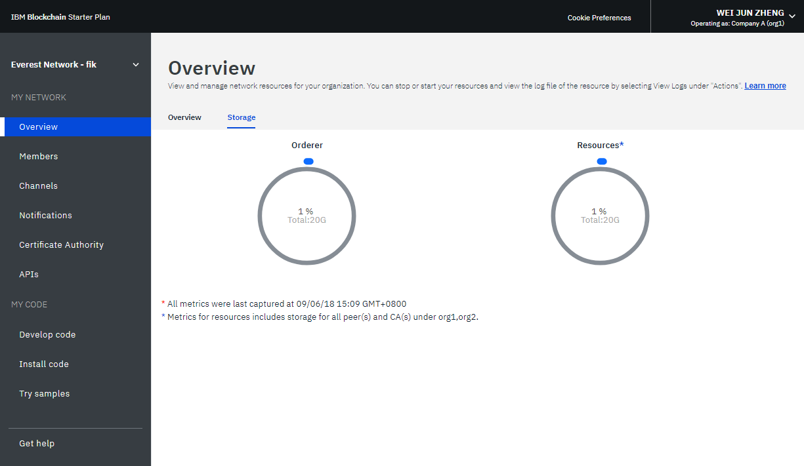
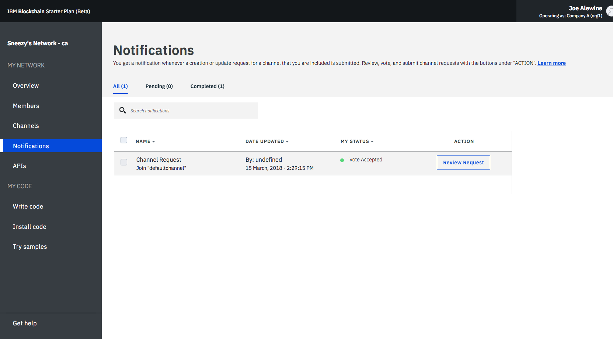
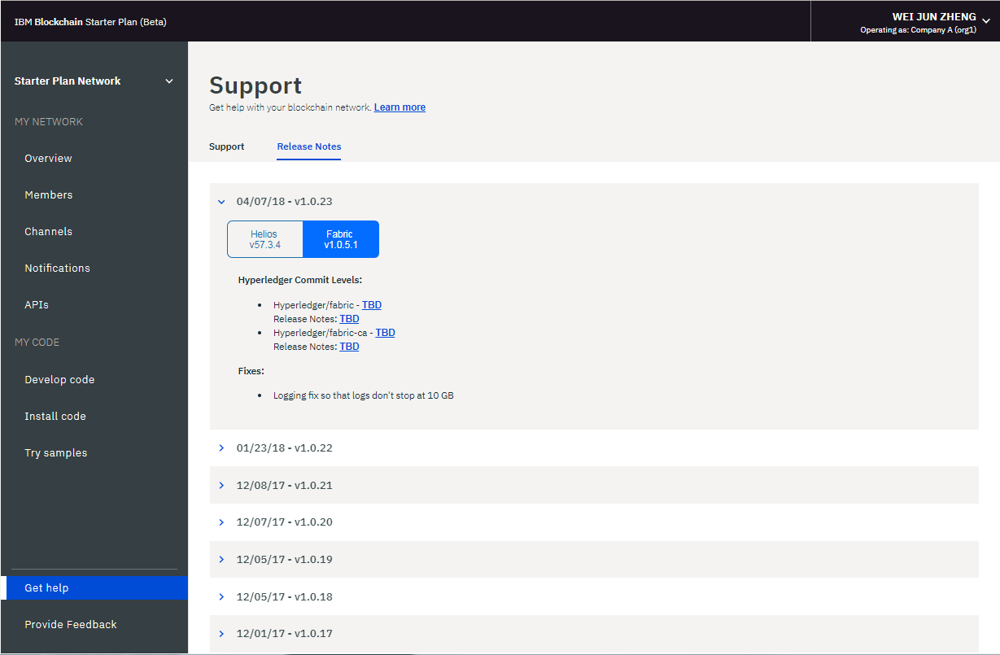
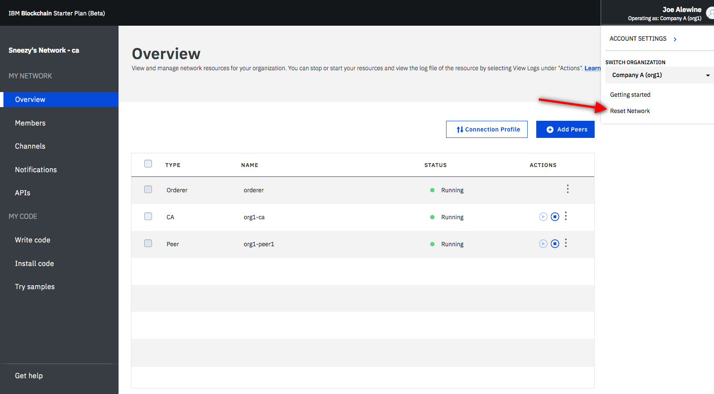

---

copyright:
  years: 2017, 2018
lastupdated: "2018-08-31"

---

{:new_window: target="_blank"}
{:shortdesc: .shortdesc}
{:codeblock: .codeblock}
{:screen: .screen}
{:pre: .pre}

# Gestione della rete piano Starter
{: #operate-starter-plan-network}

***[Questa pagina è utile? Faccelo sapere.](https://www.surveygizmo.com/s3/4501493/IBM-Blockchain-Documentation)***

{{site.data.keyword.blockchainfull}} Platform offre un Monitoraggio della rete, che è una GUI per fornire una panoramica del tuo ambiente blockchain, compresi risorse di rete, membri, canali oggetto di adesione, dati delle prestazioni delle transazioni e il chaincode distribuito. Il Monitoraggio della rete ti offre anche l'entry point per eseguire le API Swagger, sviluppare una rete con {{site.data.keyword.blockchainfull_notm}} Platform: Develop e provare le applicazioni di esempio.
{:shortdesc}

Puoi [modificare il nome della tua rete piano Starter](#sp-network-name) o [eseguire lo switch tra le reti piano Starter che crei](#switch-sp-network) nel Monitoraggio della rete.

Il Monitoraggio della rete presenta le seguenti schermate in tre sezioni. Puoi passare a ciascuna schermata dal navigator a sinistra nel Monitoraggio della rete.
- La sezione **La mia rete** contiene le schermate "[Panoramica](#overview)", "[Membri](#members)", "[Canali](#channels)", "[Notifiche](#notifications)", "[CA (Certificate Authority)](#ca)" e "[API](#apis)".
- La sezione **Il mio codice** contiene le schermate "[Sviluppa il codice](#write-code)", "[Installa il codice](#chaincode)" e "[Prova gli esempi](#samples)".
- La schermata "[Richiedi assistenza](#support)".

Puoi [controllare le preferenze di rete](#network-preferences), [spostarti tra le organizzazioni](#switch-organizations) che possiedi e [reimpostare la tua rete](#reset-network) dal menu a discesa nell'angolo superiore destro del Monitoraggio della rete.

Questa esercitazione descrive ciascuna delle schermate e delle funzioni di cui sopra.

## Aggiorna il nome della rete
{: #sp-network-name}

Quando crei un rete piano Starter, {{site.data.keyword.blockchainfull_notm}} Platform assegna un nome alla tua rete. Tuttavia, puoi aggiornare questo nome di rete in qualsiasi momento nel tuo Monitoraggio della rete.

Nella parte superiore del navigatore di sinistra in Monitoraggio della rete, fai clic sul nome della rete e il campo diventa modificabile. Immetti il nuovo nome della rete che vuoi utilizzare e premi **Enter**. Il tuo nome della rete sarà aggiornato in pochi secondi.

**Figura 1** mostra i passi per aggiornare il nome della rete piano Starter e il nome assegnato a "piano Starter Network".

*Figura 1. Aggiorna il nome della rete*

## Esegui lo switch tra le reti piano Starter
{: #switch-sp-network}

Se crei più di una rete con piano Starter, puoi eseguire lo switch tra le tue reti nel Monitoraggio della rete.

Nella parte superiore del navigatore di sinistra in Monitoraggio della rete, fai clic sull'icona a forma di freccia accanto al tuo nome di rete. Seleziona e fai clic sul nome della rete a cui vuoi passare dall'elenco a discesa. Il tuo browser web si aggiornerà e aprirà il Monitoraggio della rete della rete a cui sei passato.

**Figura 2** mostra i passi per seguire lo switch a un'altra rete piano Starter.

*Figura 2. Switch della rete*

## Panoramica
{: #overview}

La schermata "Panoramica" contiene due schede. La scheda "Panoramica" visualizza le informazioni sullo stato in tempo reale relative alle risorse blockchain, compresi l'ordinante, la CA e il peer. Ogni risorsa viene visualizzata in quattro intestazioni distinte: **Tipo**, **Nome**, **Stato** e **Azioni**. Quando la tua rete viene avviata, un ordinante, una CA e un peer sono in esecuzione. La CA è specifica per l'organizzazione, mentre l'ordinante è un endpoint comune condiviso nella rete. La scheda "Archiviazione" visualizza lo stato di utilizzo dell'archiviazione dell'ordinante e di altre risorse di rete.

La **Figura 3** mostra la scheda "Panoramica" della schermata "Panoramica":

*Figura 3. Panoramica*

### Azioni dei nodi
L'intestazione **Azioni** della tabella fornisce i pulsanti per avviare o arrestare i tuoi componenti. Puoi anche avviare o arrestare un gruppo di nodi selezionando più nodi e facendo quindi clic sul pulsante **Avvia selezionato** o **Arresta selezionato**. Il pulsante **Avvia selezionato** o quello **Arresta selezionato** sono visualizzati sopra la tabella quando selezioni uno o più nodi.

Puoi anche controllare i log componenti facendo clic su **Visualizza log** dall'elenco a discesa sotto l'intestazione **Azioni**. I log presentano le chiamate tra le diverse risorse di rete e sono utili per il debug e la risoluzione dei problemi.

**Nota**: nel Monitoraggio della rete Starter, quando fai clic sull'azione **Visualizza log** nei nodi elencati nella schermata "Panoramica", viene aperta l'interfaccia kibana di registrazione {{site.data.keyword.cloud_notm}}. Per impostazione predefinita, kibana è preconfigurato per mostrare i log degli ultimi 15 minuti di attività. Se non c'è stata attività negli ultimi 15 minuti, visualizzerai un messaggio 'Nessun risultato trovato'. Per visualizzare tutti i log, puoi semplicemente fare clic sull'icona timer nell'angolo in alto a destra sotto il tuo nome utente e impostare un intervallo di tempo ampio, come ‘Questa settimana’ o Questo mese’.

Per comprendere gli effetti dell'avvio e dell'arresto di un peer, fai una prova arrestando un peer e provando a sceglierlo come obiettivo di una transazione; vedrai degli errori di connettività nei log. Quando riavvii il peer e tenti nuovamente la transazione, vedrai una connessione stabilita correttamente. Puoi anche
lasciare inattivo il peer per un periodo di tempo prolungato mentre i tuoi canali continuano a interagire con il libro mastro. Quando il peer viene riattivato, noterai una sincronizzazione del libro mastro poiché riceve i blocchi di cui era stato eseguito il commit mentre era inattivo. Dopo che il libro mastro sarà stato completamente sincronizzato, puoi eseguire su di esso richiami e query normali.

### Configurazione del peer remoto  

Se distribuisci un peer remoto al di fuori di {{site.data.keyword.cloud_notm}}, devi fornire le informazioni sull'endpoint API della tua rete al peer remoto durante la configurazione. Fai clic sul pulsante **Configurazione peer remoto** per richiamare le informazioni sull'endpoint API della rete per configurare il tuo peer remoto. La finestra a comparsa fornisce le informazioni sull'endpoint API di ID rete, MSP organizzazione, nome CA, URL CA e certificato TLS CA. Puoi fare clic sull'icona di copia alla fine di ogni campo per copiare il valore di tale campo o fare clic sul link **Scarica** per salvare i valori di tutti i campi in un file JSON. Per ulteriori informazioni sui peer remoti, vedi [Informazioni sui peer remoti](howto/remote_peer.html).

### Profilo connessione

Puoi visualizzare il file JSON relativo alle informazioni di rete di basso livello di ciascuna risorsa facendo clic sul pulsante **Profilo connessione**. Il profilo di connessione contiene tutte le informazioni di configurazione di cui hai bisogno per un'applicazione. Tuttavia, poiché questo file contiene solo gli indirizzi per i tuoi specifici componenti e l'ordinante, se hai bisogno di avere come obiettivo ulteriori peer devi ottenere i loro endpoint. L'intestazione che contiene "url" visualizza l'endpoint API di ciascun componente. Questi endpoint sono necessari per
avere come obiettivo specifici componenti di rete da un'applicazione lato client e le loro definizioni si trovano solitamente
in un file di configurazione di tipo JSON che accompagna l'applicazione. Se stai personalizzando un'applicazione che richiede l'approvazione da peer che non fanno parte della tua organizzazione, dovrai recuperare gli indirizzi IP di questi peer dagli operatori pertinenti in un'operazione fuori banda. I client devono riuscire a connettersi a
un qualsiasi peer da cui necessitano di una risposta.

### Aggiungi peer
{: #peers}

I membri della rete devono avere dei peer per memorizzare le loro copie del libro mastro di rete e per eseguire il chaincode per eseguire query del libro mastro o per aggiornarlo. Se la politica di approvazione definisce un peer come peer di approvazione, il peer restituisce anche i risultati dell'approvazione alle applicazioni.

Piano Starter crea un peer per ciascuna delle due organizzazioni per impostazione predefinita. Puoi aggiungere altri peer per le tue organizzazioni in base ai tuoi requisiti. Potresti trovarti in scenari differenti in cui hai bisogno di più peer. Ad esempio, potresti volere più peer che si uniscono allo stesso canale per la ridondanza. Ogni peer elabora le transazioni del canale e scrive nelle loro rispettive copie nel libro mastro. In caso di malfunzionamento di uno dei peer, l'altro peer (o molteplici altri peer) possono continuare ad elaborare transazioni e richieste dell'applicazione. Puoi anche bilanciare simmetricamente il carico di tutte le richieste di applicazione tra i peer o potresti indicare come obiettivo peer differenti per funzioni differenti. Puoi ad esempio usare un peer per eseguire query del libro mastro e utilizzare un altro peer per elaborare le approvazioni per gli aggiornamenti del libro mastro.

Fai clic sul pulsante **Aggiungi peer** nella parte superiore destra per aggiungere dei nodi peer alla tua rete. Nel pannello "Aggiungi peer" a comparsa, seleziona il numero e la dimensione dei nodi peer che vuoi aggiungere.

### Archiviazione

La **Figura 4** mostra la scheda "Archiviazione" che visualizza lo stato di utilizzo dell'archiviazione.

*Figura 4. Archiviazione*

## Membri
{: #members}

La schermata "Membri" contiene due schede per visualizzare le informazioni sui membri della rete nella scheda "Membri" e le informazioni sui certificati nella scheda "Certificati".

### Membri
{: #members_tab}
La **Figura 5** mostra la schermata "Membri" iniziale che visualizza i membri della tua rete nella scheda "Membri":

*Figura 5. Membri della rete*

Fai clic su **Aggiungi membro** per invitare più membri alla rete. In piano Starter, hai due opzioni:
- **Invita un membro**. Puoi invitare altre organizzazioni a diventare membri della tua rete. Le organizzazioni invitate possono quindi aderire e collaborare con te nella rete.
- **Crea membro**. Puoi anche creare un membro utilizzando il tuo indirizzo email. Ne avresti il controllo proprio come lo hai delle due organizzazioni che ricevi per impostazione predefinita con piano Starter.

La **Figura 6** mostra la finestra "Aggiungi membro".

*Figura 6. Aggiungi membro*

### Certificati
La **Figura 7** mostra la schermata "Membri" iniziale che visualizza i certificati dei membri nella scheda "Certificati":

*Figura 7. Certificati*

Gli operatori possono gestire i certificati per i membri nella stessa istituzione nella scheda "Certificati". Fai clic su **Aggiungi certificato** per aprire il pannello "Aggiungi certificato". Dai un nome al tuo certificato, incolla i certificati lato client in formato PEM nel campo "Chiave" e fai clic su **Invia**. Devi riavviare i peer prima che i certificati lato client possano diventare effettivi.

Per ulteriori informazioni sulla generazione della tua chiave di certificato, vedi [Generazione dei certificati lato client](v10_application.html#enroll-app).

## Canali
{: #channels}

Formati da un sottoinsieme di membri della rete che vogliono eseguire transazioni in privato, i canali forniscono l'isolamento e la confidenzialità dei dati consentendo ai membri di un canale di stabilire delle specifiche regole e un libro mastro separato a cui possono accedere solo i membri del canale. Ogni rete deve avere almeno un canale perché le transazioni possano avere luogo. Ogni canale ha un libro mastro univoco e gli utenti devono essere correttamente autenticati per effettuare operazioni di lettura/scrittura su questo libro mastro. Se non ti trovi su un canale, non puoi vedere alcun dato.

La **Figura 8** mostra la schermata dashboard iniziale che visualizza una panoramica di tutti i canali nella tua rete:

*Figura 8. Canali*

La creazione di un canale comporta la generazione di un libro mastro specifico per il canale. Per ulteriori informazioni, vedi [Creazione di un canale](howto/create_channel.html).

Puoi anche selezionare un canale esistente per visualizzare dei dettagli più precisi sul canale, l'adesione e il chaincode attivo. Per ulteriori informazioni, vedi [Monitoraggio di una rete](howto/monitor_network.html).

## Notifiche
{: #notifications}

Puoi gestire le richieste in sospeso e visualizzare le richieste completate nella schermata "Notifiche".

La **Figura 9** mostra la schermata "Notifiche":

*Figure 9. Notifiche*

Quando crei un canale o viene invitato a un nuovo canale, nel Monitoraggio della rete compare una notifica.

Le richieste sono raggruppate nelle sottoschede "Tutti", "In sospeso" e "Completato". I numeri dopo l'intestazione indicano il numero di richieste in ciascuna sottoscheda.
   * Puoi trovare tutte le tue richieste nella sottoscheda "Tutti".
   * Le richieste che non hai accettato o rifiutato, o che non hai visualizzato, sono nella sottoscheda "In sospeso". Fai clic sul pulsante **Esamina richiesta** per visualizzare la richiesta, che include la politica e i membri del canale e lo stato di voto. Se sei un operatore del canale, puoi accettare **Accetta** o declinare **Rifiuta** la richiesta o gestirla in un altro momento facendo clic su **Più tardi**. Se la richiesta viene accettata da un numero sufficiente di operatori del canale, puoi fare clic su **Invia richiesta** per attivare l'aggiornamento del canale.
   * Una richiesta inoltrata sarà visualizzata nella sottoscheda "Completato".  Puoi fare clic su **Esamina richiesta** per visualizzarne i dettagli.

Se hai un lungo elenco di richieste, puoi cercare una richiesta nel campo di ricerca in alto.

Le richieste in sospeso possono essere eliminate selezionando le caselle davanti a esse e facendo clic su **Elimina richiesta**.

## CA (Certificate Authority - Autorità di certificazione)
{: #ca}

La tabella nella schermata "CA (Certificate Authority)" visualizza tutte le identità che sono state registrate con la tua organizzazione, tra cui l'amministratore, i peer e le applicazioni client. Puoi utilizzare questa schermata anche per registrare una nuova identità.

La **Figura 10** mostra la schermata "CA (Certificate Authority)":

")
*Figura 10. CA (Certificate Authority)*

Fai clic sul pulsante **Genera certificato** per ottenere un nuovo certificato pubblico e una nuova chiave privata dalla tua CA. Questo pannello può essere utilizzato come metodo alternativo per [generare una coppia di chiavi pubblica e privata](v10_application.html#register-app) per un'applicazione client che utilizza l'SDK Fabric. Il campo **Certificato** contiene il tuo certificato pubblico, indicato anche signCert o certificato di registrazione, appena sopra la tua **Chiave privata**. Puoi fare clic sull'icona di copia alla fine di ogni campo per copiare il valore. **Nota** che {{site.data.keyword.blockchainfull_notm}} Platform non memorizza questi certificati. Devi salvarli e memorizzarli in modo sicuro. Per ulteriori dettagli, fai riferimento a queste [informazioni MSP](certificates.html#msp).

Fai clic sul pulsante **Aggiungi utente** per registrare una nuova identità nella tua organizzazione. Nella finestra a comparsa **Aggiungi utente**, compila i seguenti campi e fai quindi clic su **Invia**.
  - **ID:** questo sarà il nome della tua nuova identità, a volte indicato come `enroll ID`. **Salva questo valore** per quando configuri un peer remoto o registri una nuova applicazione.
  - **Segreto:** questa sarà la password per la tua identità, a volte indicata come `enroll Secret`.  **Salva questo valore** per quando configuri un peer remoto o registri una nuova applicazione.  
  - **Tipo:** seleziona il tipo di identità che vuoi registrare, peer o applicazione client. 
  - **Affiliazione:** questa sarà l'affiliazione all'interno della tua organizzazione, ad esempio `org1`, a cui appartiene l'identità.
  - **Registrazioni massime:** utilizza questo campo per limitare il numero di volte in cui puoi registrare o generare certificati utilizzando questa identità. Se lasci il campo vuoto, il valore predefinito è un numero illimitato di registrazioni.

Per ulteriori informazioni sulla tua CA, consulta l'esercitazione [Gestione dei certificati su {{site.data.keyword.blockchainfull_notm}} Platform](certificates.html).

## API
{: #apis}

{{site.data.keyword.blockchainfull_notm}} Platform presenta diverse API REST in Swagger che puoi utilizzare per gestire i nodi, i canali, i peer e i membri della tua rete. Le tue applicazioni possono utilizzare queste API per controllare importanti risorse di rete senza usare il Monitoraggio della rete.

La **Figura 11** mostra la schermata "API":

*Figura 11. API*

Fai clic sul link **IU Swagger** per aprire l'IU Swagger. Nota: prima di eseguire le API, devi autorizzare l'IU Swagger con le tue credenziali di rete (che sono disponibili in questa pagina delle API). Per ulteriori informazioni, vedi [Utilizzo delle API Swagger](howto/swagger_apis.html).

## Sviluppa il codice
{: #write-code}

piano Starter integra {{site.data.keyword.blockchainfull_notm}} Platform: Develop e fornisce un ambiente di sviluppo con strumenti e tecnologie standard del settore. Puoi sviluppare la tua rete di business in un ambiente online oppure in locale. Dopo che hai sviluppato una rete di business, puoi distribuirla nuovamente alla tua rete piano Starter.

La **Figura 12** mostra la schermata "Sviluppa il codice":

*Figura 12. Sviluppa il codice*

Per ulteriori informazioni sullo sviluppo delle reti di business e la loro distribuzione alla rete piano Starter, consulta [Sviluppo di reti di business con piano Starter](develop_starter.html).

## Installa il codice
{: #chaincode}

Il chaincode, noto anche come "smart contract", è una parte di software che contiene una serie di funzioni per eseguire query e aggiornamenti del libro mastro. Vengono installati sui peer e istanziati su un canale.

La **Figura 13** mostra la schermata "Installa il codice":

*Figura 13. Chaincode*

Un chaincode viene prima installato sul file system di un peer e viene quindi istanziato su un canale. Per ulteriori informazioni, vedi [Installazione, istanziazione e aggiornamento di un chaincode](howto/install_instantiate_chaincode.html).

## Prova gli esempi
{: #samples}

Le applicazioni di esempio ti aiutano ad ottenere una migliore comprensione della rete blockchain e dello sviluppo di applicazioni.
<!--Starter Plan enables you to deploy and launch sample applications in the Network Monitor. --> Segui i link **Visualizza in GitHub** per apprendere in che modo usare gli esempi e distribuirli a {{site.data.keyword.blockchainfull_notm}} Platform. Per ulteriori informazioni su come sviluppare e distribuire i tuoi esempi, consulta [Distribuzione di applicazioni di esempio](howto/prebuilt_samples.html).

La **Figura 14** mostra la schermata "Prova gli esempi":

*Figura 14. Esempi*

<!--
The sample deployment leverages the [DevOps Toolchain service ](https://console.bluemix.net/devops/toolchains) to automate your process of source control, delivery pipeline, and chaincode enablement. Choose a sample application, and click the **Deploy via Toolchain**. For more information, see [Deploying sample applications](howto/prebuilt_samples.html).
-->

## Richiedi assistenza
{: #support}

La schermata "Richiedi assistenza" contiene due schede per fornire le informazioni di supporto nella scheda "Supporto" e per descrivere le funzioni nuove e modificate di ciascuna release nella scheda "Note sulla release".

La **Figura 15** mostra la schermata "Supporto" iniziale che visualizza le informazioni di supporto nella scheda "Supporto":

*Figura 15. Supporto Blockchain*

### Risorse blockchain e forum di supporto
{: #support-forums}

Utilizza i link e le risorse in questa schermata per accedere ai forum di supporto e risoluzione dei problemi.

* [{{site.data.keyword.blockchainfull_notm}} Service docs](index.html) in **Introduzione**, che è il sito della documentazione, fornisce istruzioni introduttive a {{site.data.keyword.blockchainfull_notm}} Platform su {{site.data.keyword.Bluemix_notm}}. Puoi trovare gli argomenti corrispondenti dal navigator a sinistra oppure cercare qualsiasi termine con la funzione di ricerca in alto.
* [IBM Code ](https://developer.ibm.com/code/technologies/blockchain/) contiene modelli di codice e informazioni per gli sviluppatori.
* [IBM dWAnswers ](https://developer.ibm.com/answers/smartspace/blockchain/) in **Ticket di supporto** funge da piattaforma per domande e risposte. Puoi cercare risposte dalle domande fatte in precedenza o inoltrare una nuova domanda. Assicurati di includere **blockchain** nella domanda.
  Puoi anche inoltrare un ticket al team di supporto {{site.data.keyword.blockchainfull_notm}} con l'opzione **Open an {{site.data.keyword.Bluemix_notm}} support ticket**.  Condividi dettagli e frammenti di codice dalla tua istanza specifica {{site.data.keyword.Bluemix_notm}}.
* [Le applicazioni di esempio ](https://github.com/ibm-blockchain) in **Blockchain sample applications** forniscono assistenza e frammenti di codice di esempio per agevolare lo sviluppo di applicazioni.
* [Hyperledger Fabric ](https://hyperledger-fabric.readthedocs.io/en/release-1.1/) e la [community Hyperledger Fabric ](http://jira.hyperledger.org/secure/Dashboard.jspa) in **Hyperledger Fabric** forniscono ulteriori dettagli sullo stack Hyperledger Fabric. Parla a un [esperto di Hyperledger ](https://chat.hyperledger.org/channel/general) se hai delle domande sul codice Hyperledger Fabric.
* [{{site.data.keyword.blockchainfull_notm}} Platform: Develop ](https://ibm-blockchain.github.io/develop/) in **Hyperledger Composer** fornisce ulteriori dettagli su Hyperledger Composer, ossia {{site.data.keyword.blockchainfull_notm}} Platform: Develop. Puoi anche trovare risposte o fare domande nella [community di Hyperledger Composer ](https://chat.hyperledger.org/channel/general) e in [StackOverflow ](https://stackoverflow.com/questions/tagged/hyperledger-composer).

Se non riesci a eseguire il debug del tuo problema o a trovare una risposta alla tua domanda, inoltra un caso di supporto nel portale del servizio {{site.data.keyword.cloud_notm}}. Per ulteriori informazioni, vedi [Richiesta di assistenza tecnica](ibmblockchain_support.html).

La **Figura 16** e la **Figura 17** mostrano la schermata "Supporto" iniziale che visualizza le funzioni nuove e modificate di ciascuna release nella scheda "Note sulla release":

*Figura 16. Note sulla release di Helios

*Figura 17. Note di release di Fabric*

## Preferenze della rete
{: #network-preferences}

Fai clic sull'angolo superiore destro e apri il menu a discesa e poi il pulsante **Preferenze della rete** nel menu. Viene aperta la finestra Preferenze della rete. La finestra Preferenze della rete mostra le informazioni di base della tua rete, come il nome della rete, la versione Fabric, l'ubicazione della rete in {{site.data.keyword.cloud_notm}} e il tipo di database dello stato. Se sei l'iniziatore della rete, puoi gestire anche il timeout di inattività web nella finestra Preferenze della rete.

### Timeout di inattività web
{: #web-inactivity-timeout}

**Nota**: solo l'**iniziatore della rete** può modificare l'impostazione del timeout di inattività web. Questa è un'impostazione al livello della rete e interesserà tutti i membri della rete.

Il timeout di inattività web è impostato su **Off** per impostazione predefinita. Se modifichi il timeout di inattività della rete con **On** tutti i membri della rete saranno disconnessi dopo 10 minuti di inattività. Quando il timer di inattività web raggiunge i 10 minuti, la funzione di timeout di inattività web termina le sessioni web inattive per garantire la sicurezza dell'account del membro della rete. Facendo clic su un link o aggiornando il Monitoraggio della rete si reimposta il timer di inattività web. Prima del raggiungimento dei 10 minuti, il chiudere la finestra o la scheda del browser termina la sessione web.

La **Figura 18** mostra la finestra "Preferenze della rete":

*Figura 18. Preferenze della rete*

## Passaggio da un'organizzazione all'altra
{: #switch-organizations}

Se simuli tu stesso una rete blockchain con più organizzazioni, puoi passare a qualsiasi organizzazione di tua proprietà, ad esempio Organizzazione A. Puoi quindi visualizzare e gestire le risorse di rete dell'Organizzazione A, quali i peer, i canali e il chaincode nel Monitoraggio della rete. Questa funzione ti consente di creare un canale seguendo le politiche del canale e di aggiungere dei peer da più organizzazioni al canale.

Fai clic sull'angolo in alto a destra dell'IU, dove dovresti vedere il tuo nome. Dal menu a discesa sotto **CAMBIA ORGANIZZAZIONE**, scegli il nome dell'organizzazione a cui vuoi passare. L'Organizzazione A è selezionata per impostazione predefinita. Dopo che hai scelto un'organizzazione a cui passare, il tuo Monitoraggio della rete viene aggiornato automaticamente e puoi visualizzare la rete come tale organizzazione.

La **Figura 19** mostra la funzione "Cambia organizzazione":

   
*Figura 19. Cambia organizzazione*

## Reimposta rete
{: #reset-network}

Piano Starter ti consente di modificare la tua configurazione di rete senza eliminare e creare nuovamente una rete. La tua rete viene reimpostata nuovamente sulla configurazione di rete iniziale, che include due organizzazioni, un peer per ciascuna organizzazione e un canale predefinito. Ciò è utile, ad esempio, quando esegui dei cicli di test sulla rete blockchain, poiché ti consente di ricominciare daccapo da una rete relativamente pulita.

**Attenzione**: dopo che reimposti la rete, gli endpoint API dei tuoi peer, del tuo ordinante e della tua CA sono modificati. Devi regolare le informazioni sugli endpoint API nelle tue applicazioni.

Fai clic sull'angolo superiore destro e apri il menu a discesa. Fai clic sul pulsante **Reimposta rete** nel menu. Se sei pronto a reimpostare la tua rete, fai clic su **OK** per continuare. Il tuo Monitoraggio della rete verrà aggiornato per riflettere le tue nuove impostazioni.

La **Figura 20** mostra la funzione "Reimposta rete":

*Figura 20. Reimposta rete*
