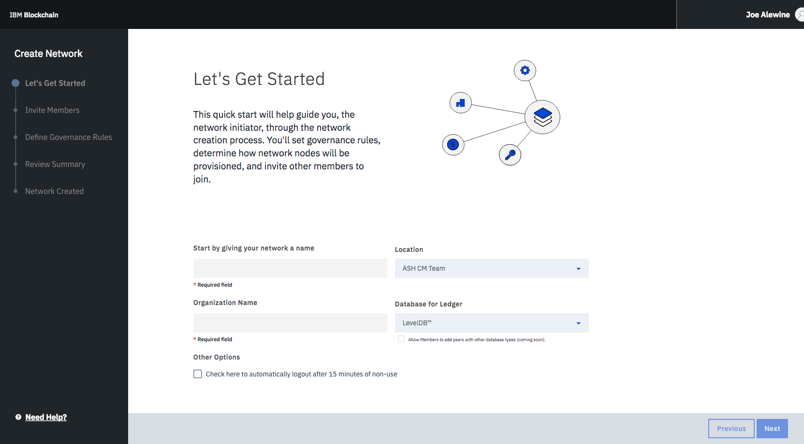
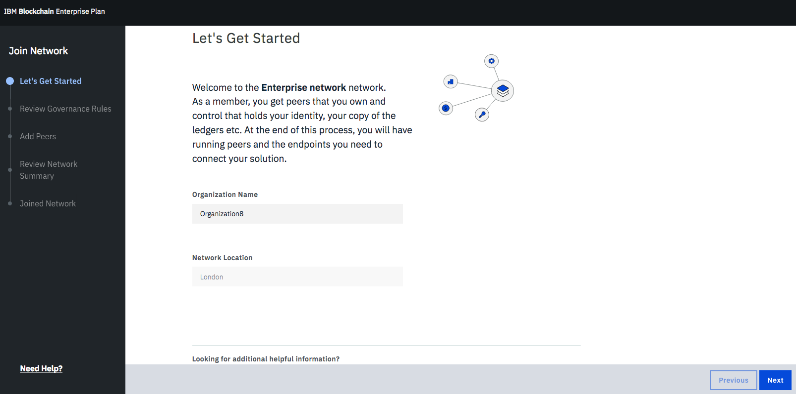

---

copyright:
  years: 2017, 2018
lastupdated: "2018-08-31"

---

{:new_window: target="_blank"}
{:shortdesc: .shortdesc}
{:screen: .screen}
{:codeblock: .codeblock}
{:pre: .pre}
{:tip: .tip}

# Governance della rete piano Enterprise
{: #getting-started-with-blockchain}

***[Questa pagina è utile? Faccelo sapere.](https://www.surveygizmo.com/s3/4501493/IBM-Blockchain-Documentation)***

{{site.data.keyword.blockchainfull}} Platform piano Enterprise fornisce una rete blockchain con sicurezza, integrità, scalabilità e prestazioni elevate. Puoi eseguire rapidamente il provisioning di una rete pienamente funzionante e utilizzare il Monitoraggio della rete, che è un dashboard GUI, per eseguire immediatamente [chaincode](/docs/services/blockchain/glossary.html#chaincode) e applicazioni senza dover progettare e configurare una rete da zero.
{:shortdesc}

**Nota**: {{site.data.keyword.blockchainfull_notm}} Platform piano Enterprise fornisce un ambiente di produzione. Se hai bisogno di un ambiente di sviluppo e test, vedi [Informazioni su piano Starter](/docs/services/blockchain/starter_plan.html).

Questa esercitazione introduce i prerequisiti e i passi a cui dovrai attenerti per ottenere una rete piano Enterprise ospitata in un ambiente altamente disponibile e sicuro di IBM.  

La seguente procedura indica il flusso di base per avviare una rete piano Enterprise con più [membri](/docs/services/blockchain/glossary.html#member) di rete:
1. Un **iniziatore di rete**, in quanto tipo speciale di membro di rete, crea la rete e definisce le politiche di governance. L'iniziatore di rete può quindi invitare altre [organizzazioni](/docs/services/blockchain/glossary.html#organization) ad aderire a questa rete come membri della rete.  Per ulteriori informazioni, vedi [Creazione di una rete](#creating-a-network).
2. I **membri della rete** invitati ricevono una notifica email che fornisce le istruzioni per consentire loro di aderire a una rete {{site.data.keyword.blockchain}}. Oltre alle istruzioni nella notifica email, puoi anche attenerti alla procedura indicata in [Adesione a una rete](#joining-a-network).
3. Tutti i **membri della rete**, dopo aver creato, o aver aderito a, una rete, possono accedere al Monitoraggio della rete per configurare e gestire le loro risorse di rete. Puoi configurare i [canali](/docs/services/blockchain/glossary.html#channel) con un gruppo di membri della rete per eseguire transazioni private su un libro mastro specifico per il canale, a cui possono accedere solo i membri del canale. Nel Monitoraggio della rete, puoi anche indicare l'adesione dei tuoi peer al canale e quindi installare e istanziare il chaincode su di essi. Per ulteriori informazioni, vedi [Configurazione delle risorse di rete e dell'ambiente](#configuring-network-resources-and-environment).
4. Gli **sviluppatori di applicazioni**, dopo lo sviluppo delle applicazioni, abilitano l'interazione tra le loro applicazioni e la rete. Per ulteriori informazioni, vedi [Abilitazione delle applicazioni a interagire con la rete](#enabling-applications-to-interact-with-the-network).
5. Gli **operatori di rete** monitorano le transazioni sui loro canali nel Monitoraggio della rete. Per ulteriori informazioni, vedi [Monitoraggio delle risorse di rete](#monitoring-network-resources).

## Creazione di una rete
Prima di iniziare, devi creare un'istanza del servizio di [{{site.data.keyword.blockchain}} Platform ](https://console.bluemix.net/catalog/services/blockchain) su {{site.data.keyword.Bluemix_notm}}. Devi eseguire l'accesso con il tuo ID {{site.data.keyword.Bluemix_notm}}. Se non hai un ID, fai clic sul pulsante **Registrati per creare**.  Rinomina i nomi di servizio e credenziali per la tua istanza in modo che tu possa riconoscerli facilmente in futuro. Seleziona la regione, l'organizzazione e lo spazio {{site.data.keyword.Bluemix_notm}} dove puoi distribuire la tua rete {{site.data.keyword.blockchain}}. Seleziona quindi **Piano di adesione Enterprise** dalla tabella dei piani di determinazione del prezzo e fai clic sul pulsante **Crea**.  

Puoi trovare la tua istanza del servizio {{site.data.keyword.blockchain}} Platform nel tuo [Dashboard servizio {{site.data.keyword.Bluemix_notm}} ](https://console.bluemix.net/dashboard/services "{{site.data.keyword.Bluemix_notm}} dashboard servizio").  

Se sei un iniziatore di rete, fai clic sul pulsante **Crea rete** per iniziare una rete {{site.data.keyword.blockchain}}.  Attieniti alla procedura guidata per completare la configurazione di base della tua rete e delle risorse.  
  

1. Nella schermata "Introduzione", dai un nome alla tua rete, scegli l'ubicazione dell'organizzazione {{site.data.keyword.Bluemix_notm}} e aggiungi il nome della tua istituzione. Quando inviti altri membri della rete, cercheranno questo nome di rete per aderire. Fai clic su **Avanti**.
2. (Facoltativo) Nella schermata "Invita membri", immetti il nome dell'istituzione e l'indirizzo email del membro che vuoi invitare alla tua rete. Il nome dell'istituzione da te designato non è un titolo ufficiale. Consente semplicemente all'istituzione di essere facilmente riconosciuta e può essere modificato quando aderisce alla rete. Nota: una rete può avere fino a 15 membri, incluso te. Questo passo è facoltativo e puoi invitare i membri alla tua rete in un secondo momento nel Monitoraggio della rete.  Fai clic su **Avanti**.
	I membri che inviti riceveranno una notifica email relativa al loro invito dopo che hai completato tutti i passi per creare la rete.
3. Nella schermata "Definisci regole di governance", stabilisci le politiche per l'adesione, la creazione del canale e il chaincode. Per impostazione predefinita, tutti i membri della rete possono invitare altri membri ad aderire alla rete, creare canali e istanziare chaincode. Attualmente, la tua rete utilizza le politiche di governance predefinite.  Fai clic su **Avanti**.
4. Nella schermata "Rivedi riepilogo", verifica la tua configurazione di rete. Se vuoi apportare modifiche, fai clic su **Modifica** accanto all'intestazione della sezione oppure fai clic sul pulsante **Precedente** per tornare alle schermate precedenti. Una volta che hai completato la configurazione della rete, fai clic su **Fatto**.  
5. Nella schermata "Rete creata", verrai informato che la tua rete è stata creata correttamente. Puoi fare clic su **Aggiungi [Peer](/docs/services/blockchain/glossary.html#peer)** per configurare le tue risorse di rete oppure puoi fare clic su **Entra nel monitoraggio** direttamente per aprire il Monitoraggio della rete. Puoi anche aggiungere i peer in un secondo momento nel Monitoraggio della rete.  Per ulteriori informazioni sui peer, vedi [Aggiungi peer](/docs/services/blockchain/v10_dashboard.html#peers).

Ora hai correttamente distribuito una rete {{site.data.keyword.blockchain}} che può supportare le seguenti risorse di rete:  
* Un'Autorità di certificazione (CA, Certificate Authority) specifica per il membro
* Delle politiche di governance predefinite
* Fino a 15 membri della rete  
* Tre ordinanti e due nodi CA intermedi
* Fino a tre piccoli peer per ogni membro  
* Un servizio ordini con tolleranza di errori anomali
* Fino a 150 canali
* Fino a 10 istanziazioni di chaincode per membro in Monitoraggio della rete

## Adesione a una rete
Analogamente alla creazione di una rete, devi creare un'istanza del servizio di [{{site.data.keyword.blockchain}} Platform ](https://console.bluemix.net/catalog/services/blockchain) su {{site.data.keyword.Bluemix_notm}}. Devi eseguire l'accesso con il tuo ID {{site.data.keyword.Bluemix_notm}}. Se non hai un ID, fai clic sul pulsante **Registrati per creare**.  Rinomina i nomi di servizio e credenziali per la tua istanza in modo che tu possa riconoscerli facilmente in futuro. Seleziona la regione, l'organizzazione e lo spazio {{site.data.keyword.Bluemix_notm}} dove puoi distribuire la tua rete {{site.data.keyword.blockchain}}. Seleziona quindi **Piano di adesione Enterprise** dalla tabella dei piani di determinazione del prezzo e fai clic sul pulsante **Crea**.

Puoi trovare la tua istanza del servizio {{site.data.keyword.blockchain}} Platform nel [Dashboard del servizio {{site.data.keyword.Bluemix_notm}} ](https://console.bluemix.net/dashboard/services "{{site.data.keyword.Bluemix_notm}} - dashboard del servizio").

Se sei un membro della rete invitato, fai clic sul pulsante **Invito in attesa ->**, seleziona la rete a cui vuoi aderire dall'elenco a discesa e fai clic sul pulsante **Unisciti alla rete!**. Attieniti alla procedura guidata per visualizzare la configurazione di base della tua rete e configurare le tue risorse di rete.  
  

1. Nella schermata "Introduzione", immetti il nome della tua organizzazione e fai clic su **Avanti**.
2. Nella schermata "Rivedi le regole di governance", visualizza le politiche di governance di adesione, creazione del canale e chaincode. Fai clic su **Avanti**.
3. (Facoltativo) Nella schermata "Aggiungi peer", scegli la quantità di peer che vuoi aggiungere. Fai clic su **Avanti**. Ogni membro in una rete può aggiungere fino a tre peer. Questo passo è facoltativo e puoi aggiungere i tuoi peer in un secondo momento nel Monitoraggio della rete. Per ulteriori informazioni sui peer, vedi [Aggiungi peer](/docs/services/blockchain/v10_dashboard.html#peers).
4. Nella schermata "Rivedi riepilogo di rete", verifica la configurazione di rete. Se vuoi apportare modifiche, fare clic su **Precedente** per tornare alle schermate precedenti. Dopo che hai completato la configurazione delle risorse, fai clic su **Fatto**. Sarai informato che la tua adesione alla rete è riuscita. Puoi quindi fare clic su **Entra nel monitoraggio** per aprire il Monitoraggio della rete.

<!-- or click **Create a Channel** to initiate a channel creation request. You can create channels later in the Network Monitor. For more information, see [Channels](/docs/services/blockchain/v10_dashboard.html#channels).  -->

## Configurazione delle risorse di rete e dell'ambiente

1. Accedi al tuo Monitoraggio della rete dopo che hai creato, o hai aderito a, una rete {{site.data.keyword.blockchain}}. Il Monitoraggio della rete è un dashboard GUI dove puoi gestire e tracciare le informazioni sullo stato della rete. Per ulteriori informazioni, consulta [monitoraggio della rete](/docs/services/blockchain/v10_dashboard.html).
2. Aggiungi i tuoi peer alla rete. Se già hai aggiunto abbastanza peer, tralascia questo passo. I peer eseguono il chaincode e sono l'endpoint per interagire con le tue applicazioni. Gai clic su **Aggiungi peer** nella schermata "Panoramica" e seleziona la quantità e la dimensione dei tuoi peer. Per ulteriori informazioni, vedi [Panoramica](/docs/services/blockchain/v10_dashboard.html#overview).
3. Configura un canale. A tutti i membri nello stesso canale viene fornito un libro mastro specifico per il canale, che offre isolamento e confidenzialità dei dati. Per ulteriori informazioni su come creare un canale, vedi [Creazione di un canale](/docs/services/blockchain/howto/create_channel.html#creating-a-channel).  
    Se sei un membro del canale che è stato invitato ad aderire a un canale, riceverai una notifica email con un link alla procedura guidata che ti consente di aderire al canale.
4. Unisci i peer al canale.  Solo i peer associati al canale possono accedere al suo libro mastro. Per ulteriori informazioni, vedi [Canali](/docs/services/blockchain/v10_dashboard.html#channels).
5. Installa e istanzia il chaincode. Tutti i membri del canale devono installare lo stesso chaincode con lo stesso nome e la stessa versione su ogni peer che eseguirà il chaincode. Dopo aver installato il chaincode, devi istanziarlo sul canale prima di poterlo utilizzare. Per ulteriori informazioni, vedi [Installazione, istanziazione e aggiornamento di un chaincode](/docs/services/blockchain/howto/install_instantiate_chaincode.html).  

**Nota**: per ottenere un'elevata disponibilità, ciascuna organizzazione deve acquistare almeno due peer e, in un canale, ogni membro partecipante deve unire almeno due peer.

## Richiamo delle credenziali di rete e profilo di connessione
Dopo che hai creato una rete piano Enterprise in {{site.data.keyword.cloud_notm}}, puoi richiamare le credenziali di rete e il profilo di connessione dalla pagina dell'istanza del servizio oppure nel Monitoraggio della rete.

### Richiamo dalla pagina dell'istanza del servizio
Sei nella pagina dell'istanza del servizio subito dopo aver creato un'istanza del servizio. Puoi anche fare clic sul tuo servizio nel [dashboard del servizio {{site.data.keyword.cloud_notm}} ](https://console.bluemix.net/dashboard/services "{{site.data.keyword.cloud_notm}} - dashboard del servizio") per aprire la tua pagina dell'istanza del servizio.

Richiama le tue credenziali del servizio attenendoti alla seguente procedura:
1. Nella pagina dell'istanza del servizio, fai clic su **Credenziali del servizio** nel navigatore a sinistra per visualizzare la schermata "Credenziali del servizio".
2. Fai clic su **Nuova credenziale** nella schermata "Credenziali del servizio".
3. Nella schermata "Aggiungi nuova credenziale", dai un nome alla credenziale e immetti **{"type": "service_instance_token"}** nel campo "Aggiungi parametro di configurazione inline". Fai clic su **Aggiungi**; la nuova credenziale viene aggiunta nella tabella. Puoi fare clic su **Visualizza credenziali** nella colonna "AZIONI" per visualizzare i dettagli della credenziale. Questa credenziale contiene la chiave API e il segreto, che puoi utilizzare per autorizzare le API.

### Richiamo nel Monitoraggio della rete
Puoi trovare le credenziali di rete sulla schermata "API" nel tuo Monitoraggio della rete. Per ulteriori informazioni sull'utilizzo delle API, vedi [Prova delle API con Swagger](/docs/services/blockchain/howto/swagger_apis.html).

Puoi richiamare il profilo di connessione nella schermata "Panoramica" nel tuo Monitoraggio della rete. Fai clic sul pulsante **Profilo connessione** nella schermata "Panoramica"; il profilo di connessione viene visualizzato in una nuova pagina.

## Sviluppo e distribuzione di reti di business personalizzate
Puoi sviluppare reti di business in base alle tue esigenze aziendali con l'ambiente per sviluppatori {{site.data.keyword.blockchainfull_notm}} Platform: Develop e il set di strumenti per gli sviluppatori Hyperledger Composer. Dopo che hai sviluppato una rete per il tuo business, puoi distribuire la tua rete di business nella rete piano Enterprise.

Per ulteriori informazioni, vedi [Sviluppare la rete](/docs/services/blockchain/develop.html) e [Distribuzione di una rete di business su piano Enterprise](/docs/services/blockchain/develop_enterprise.html).

## Abilitazione delle applicazioni a interagire con la rete
Le applicazioni si avvalgono delle API SDK per interagire con le tue risorse di rete {{site.data.keyword.blockchain}}. Devi aggiungere le informazioni sull'endpoint API delle tue risorse di rete nella tua applicazione in modo che l'applicazione possa alla fine avere come obiettivo i tuoi peer le richieste di transazione. Puoi quindi aggiungere le informazioni sull'endpoint API dal Monitoraggio della rete. Le applicazioni possono essere ospitate sul tuo file system locale o su {{site.data.keyword.Bluemix_notm}}. Per ulteriori informazioni, vedi [Sviluppo di applicazioni](/docs/services/blockchain/v10_application.html).

## Monitoraggio delle risorse di rete  
Dopo che una transazione è stata attivata dalla tua applicazione, puoi visualizzare le informazioni sullo stato della transazione nel Monitoraggio della rete. Per ulteriori informazioni sul monitoraggio di rete, vedi [Monitoraggio di una rete](/docs/services/blockchain/howto/monitor_network.html).

## Uscire da una rete
Se desideri uscire da una rete, elimina l'istanza del servizio blockchain dal tuo dashboard {{site.data.keyword.Bluemix_notm}}.  

**Nota**: prima di uscire da una rete, assicurati di non essere un membro dei canali sulla rete. Altrimenti, riscontrerai degli errori quando esci dalla rete. Una rimozione di un membro del canale deve completare il processo di aggiornamento del canale. Per ulteriori informazioni sul processo di aggiornamento del canale, consulta [Aggiornamento di un canale](/docs/services/blockchain/howto/create_channel.html#updating-a-channel).

<!--
## References
* For more information about {{site.data.keyword.blockchainfull_notm}} offerings, see [Blockchain offerings](/docs/services/blockchain/index.html).
* For more information about Hyperledger Fabric, see [Hyperledger Fabric documentation ](http://hyperledger-fabric.readthedocs.io/en/release-1.1/){:new_window}.
-->
