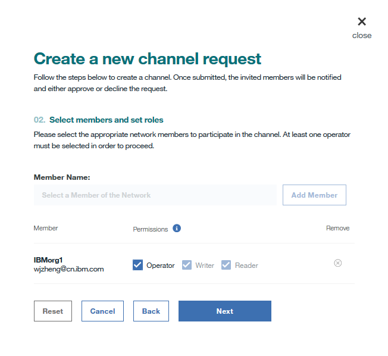

---

copyright:
  years: 2017, 2018
lastupdated: "2018-09-27"

---

{:new_window: target="_blank"}
{:shortdesc: .shortdesc}
{:screen: .screen}
{:codeblock: .codeblock}
{:pre: .pre}

# Creazione o aggiornamento di un canale

***[Questa pagina è utile? Faccelo sapere.](https://www.surveygizmo.com/s3/4501493/IBM-Blockchain-Documentation)***

I canali rappresentano un meccanismo incredibilmente potente per il partizionamento e l'isolamento dei dati e forniscono il fondamento primario per
la privacy dei dati. Solo i membri dello stesso canale possono accedere ai dati di questo canale.
{:shortdesc}

Per garantire la sicurezza del canale, la politica di aggiornamento del canale è configurata per definire il numero di operatori del canale che devono concordare sulla richiesta di creazione o di aggiornamento del canale prima che un canale venga creato o aggiornato.

## Creazione di un canale
Fai clic sul pulsante **Nuovo canale** nella schermata "Canali" del tuo Monitoraggio della rete e completa la seguente procedura per inoltrare una richiesta di creazione di un canale.
1. Scegli un nome che rifletta l'obiettivo di business del canale, aggiungi una descrizione facoltativa e fai clic su **Avanti**. Il nome del canale deve essere univoco in una rete Blockchain. Deve iniziare con una lettera e può contenere solo caratteri minuscoli, numeri, o trattini.

2. Invita qualsiasi combinazione di membri della tua rete selezionandoli e facendo clic sul pulsante **Add Member**. Personalizza le autorizzazioni assegnando i ruoli per ciascuno dei membri invitati e fai clic su **Avanti**.

    * Un operatore del canale può interrogare mediante query o aggiornare il libro mastro del canale. Un operatore del canale dispone dell'autorizzazione ad accettare (**Accetta**) o rifiutare (**Rifiuta**) una richiesta di creazione di un canale e di inoltrare una richiesta di aggiornamento del canale. Ci deve essere almeno un **Operatore** in ciascun canale.
    * Uno scrittore del canale può aggiornare il libro mastro del canale, ad esempio richiamando una funzione chaincode. Uno scrittore del canale può anche istanziare un chaincode su un canale.
    * Un lettore del canale può solo interrogare mediante query il libro mastro del canale, ad esempio richiamando una funzione chaincode in sola lettura.

3. Configura la politica di aggiornamento del canale selezionando il numero di operatori del canale per l'approvazione di una richiesta di aggiornamento del canale e fai clic su **Invia richiesta**.
  

I membri invitati riceveranno una email di invito. Possono anche trovare la richiesta nelle schede secondarie "Tutti" o "In sospeso" nella schermata **Notifiche** di Monitoraggio della rete.
* I membri invitati come operatori del canale possono fare clic sul pulsante **Esamina richiesta** per riesaminare la configurazione del canale e quindi accettare (**Accetta**) o rifiutare (**Rifiuta**) la richiesta. La colonna "Stato personale" visualizza lo stato di voto dell'operatore per la richiesta:
    * _Voto in attesa_: l'operatore non ha gestito la richiesta.
    * _Voto accettato_: l'operatore ha accettato la richiesta.
    * _Voto non accettato_: l'operatore ha rifiutato la richiesta.
    * _Voto chiuso_: la richiesta ha ottenuto abbastanza voti **Accetta** e l'operatore non ha più bisogno di accettarla o rifiutarla.
* I membri invitati come scrittori o lettori del canale possono visualizzare *Non richiesto* nella colonna "Stato personale". Prima che la richiesta ottenga abbastanza voti **Accetta** dagli operatori del canale, gli scrittori o i lettori possono fare clic sul pulsante **Esamina richiesta** per controllare la configurazione del canale.

Quando un numero sufficiente di operatori del canale concorda sulla richiesta, uno qualsiasi dei membri del canale può fare clic sul pulsante **Invia richiesta** e il nuovo canale viene creato. Tutti i membri del canale possono trovare il canale nella schermata "Canali" del loro Monitoraggio della rete.

### Creazione di canali gestiti

In mercati di cambio di valute estere altamente regolamentati, per usare un esempio, potrebbe essere necessario affidare a una terza parte attendibile i ruoli amministrativi sui canali che normalmente sarebbero gestiti da diversi operatori o membri.

In questo caso, la terza parte attendibile renderebbe se stessa il solo "Operatore" per un canale e assegnerebbe gli altri membri come "Scrittori". Ciò darebbe alla terza parte l'autorizzazione esclusiva a modificare il canale concedendo al tempo stesso alle due banche la possibilità di richiamare delle transazioni. Potrebbe essere creato anche un canale di "sola lettura" impostando gli altri membri come "Lettori".

## Aggiornamento di un canale
Se vuoi modificare la configurazione di un canale, ad esempio aggiungere o rimuovere dei membri del canale o modificare la politica di aggiornamento del canale, puoi inoltrare una richiesta di aggiornamento del canale. Nella schermata "Canali" del tuo Monitoraggio della rete, individua il canale che vuoi modificare e seleziona **Modifica canale** dall'elenco a discesa sotto l'intestazione **Azione**. Spostati tra i vari pannelli per apportare le modifiche alle entità desiderate e fai clic su **Invia richiesta** per avviare una richiesta di aggiornamento del canale.

Tutti i membri del canale riceveranno notifiche email relative alla richiesta di aggiornamento del canale:
* I membri appena invitati riceveranno delle notifiche email per invitarli ad aderire al canale. Possono anche trovare la richiesta con lo stato "Voto in attesa" nella schermata **Notifiche** del Monitoraggio della rete.
    * I membri invitati come operatori del canale possono fare clic sul pulsante **Esamina richiesta** per riesaminare la configurazione del canale e quindi accettare (**Accetta**) o rifiutare (**Rifiuta**) la richiesta di aggiornamento del canale.  La colonna "Stato personale" visualizza lo stato di voto dell'operatore per la richiesta:
        * _Voto in attesa_: l'operatore non ha gestito la richiesta.
        * _Voto accettato_: l'operatore ha accettato la richiesta.
        * _Voto non accettato_: l'operatore ha rifiutato la richiesta.
        * _Voto chiuso_: la richiesta ha ottenuto abbastanza voti **Accetta** e l'operatore non ha più bisogno di accettarla o rifiutarla.
    * I membri invitati come scrittori o lettori del canale possono visualizzare *Non richiesto* nella colonna "Stato personale". Prima che la richiesta ottenga abbastanza voti **Accetta** dagli operatori del canale, gli scrittori o i lettori possono fare clic sul pulsante **Esamina richiesta** per controllare la configurazione del canale.
* I membri rimossi ricevono delle notifiche email sulla modifica del canale.
* Gli operatori del canale esistenti ricevono notifiche email sull'aggiornamento del canale. Possono trovare la richiesta con lo stato _Voto in attesa_ nella schermata **Notifiche** di Monitoraggio della rete per poterla accettare (**Accetta**) o rifiutare (**Rifiuta**).
* Anche gli scrittori o i lettori del canale esistenti ricevono notifiche email sull'aggiornamento del canale. Possono trovare la richiesta con lo stato _Non richiesto_ nella schermata **Notifiche** del Monitoraggio della rete.

Quando un numero sufficiente di operatori del canale concorda sulla richiesta, uno qualsiasi dei membri del canale può fare clic sul pulsante **Invia richiesta** e il canale viene aggiornato. Tutti i membri del canale possono trovare il canale aggiornato nella schermata "Canali" del Monitoraggio della rete.

**Importante:**
Le politiche di approvazione non vengono aggiornate automaticamente quando delle nuove organizzazioni si uniscono al canale e installano il chaincode. Ad esempio, se la politica richiede due delle cinque organizzazioni per approvare una transazione, la politica non sarà aggiornata per richiedere due delle sei organizzazioni quando una nuova organizzazione si unisce al canale. Invece, la nuova organizzazione non sarà elencata sulla politica e non potrà approvare le transazioni. Puoi aggiungere una nuova organizzazione a una politica di approvazione [aggiornando il chaincode pertinente](/docs/services/blockchain/howto/install_instantiate_chaincode.html#updating-a-chaincode). Per ulteriori informazioni, vedi [Specifica delle politiche di approvazione del chaincode](/docs/services/blockchain/howto/install_instantiate_chaincode.html#endorsement-policy).
