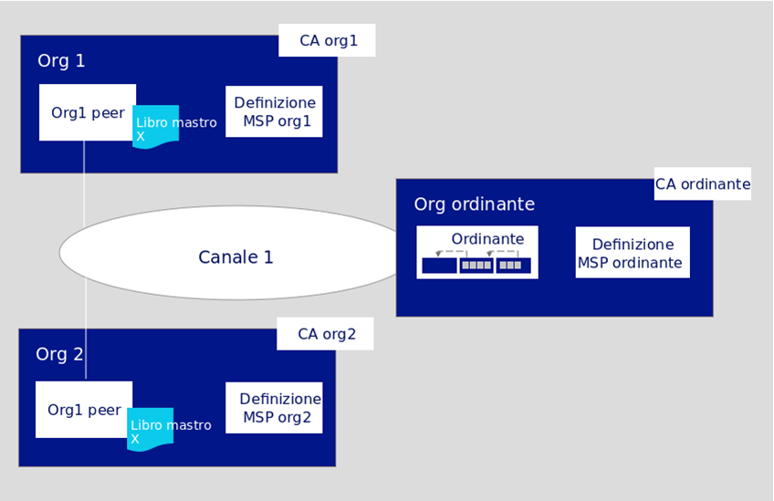
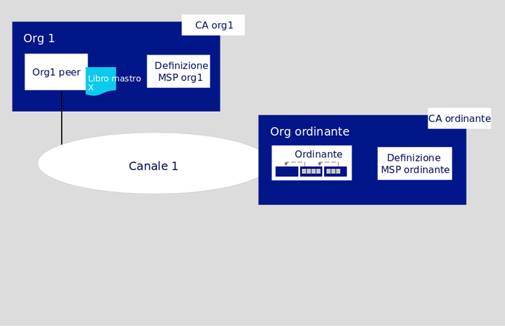

---

copyright:
  years: 2019
lastupdated: "2019-02-08"

---

{:new_window: target="_blank"}
{:shortdesc: .shortdesc}
{:screen: .screen}
{:codeblock: .codeblock}
{:note: .note}
{:important: .important}
{:tip: .tip}
{:pre: .pre}

# Esercitazione: crea una rete
{: #ibp-console-build-network}

***[Questa pagina è utile? Faccelo sapere.](https://www.surveygizmo.com/s3/4501493/IBM-Blockchain-Documentation)***

{{site.data.keyword.blockchainfull}} Platform è un'offerta BaaS (blockchain-as-a-service) che ti consente di sviluppare, distribuire e gestire le applicazioni e le reti blockchain. Puoi scoprire di più sui componenti blockchain e su come lavorano insieme visitando la [Panoramica dei componenti blockchain](/docs/services/blockchain/blockchain_component_overview.html#blockchain-component-overview). Questa esercitazione è la prima parte della [serie di esercitazioni sulla rete di esempio](/docs/services/blockchain/howto/ibp-console-build-network.html#ibp-console-build-network-sample-tutorial) e descrive come utilizzare la console {{site.data.keyword.blockchainfull_notm}} Platform distribuita su {{site.data.keyword.cloud_notm}} per creare una rete completamente funzionale su un singolo servizio {{site.data.keyword.cloud_notm}} Kubernetes.
{:shortdesc}

Se non hai già distribuito la console in un cluster Kubernetes utilizzando {{site.data.keyword.cloud_notm}} Kubernetes Service, vedi [Introduzione a {{site.data.keyword.blockchainfull_notm}} Platform 2.0](/docs/services/blockchain/howto/ibp-v2-deploy-iks.html#ibp-v2-deploy-iks). Puoi creare un nuovo cluster Kubernetes per la distribuzione della console o utilizzarne uno esistente nel tuo account {{site.data.keyword.cloud_notm}}.  Dopo aver distribuito {{site.data.keyword.blockchainfull}} Platform al tuo cluster Kubernetes, puoi avviare la console per creare e gestire i tuoi componenti blockchain.

Sia che tu esegua la distribuzione su un cluster Kubernetes a pagamento o gratuito, utilizza il dashboard Kubernetes per prestare particolare attenzione alle risorse a tua disposizione quando scegli di distribuire nodi e creare canali. È tua responsabilità gestire il tuo cluster Kubernetes e distribuire risorse aggiuntive, laddove necessario. Sebbene i componenti verranno distribuiti correttamente su un cluster gratuito, più componenti aggiungi, più lenta sarà la loro esecuzione.
{: note}

## Serie di esercitazioni sulla rete di esempio
{: #ibp-console-build-network-sample-tutorial}

Questa serie di esercitazioni in tre parti ti guida attraverso il processo di creazione e interconnessione di una rete {{site.data.keyword.blockchainfull_notm}} Platform 2.0 relativamente semplice e a più nodi utilizzando la console e sfruttando la distribuzione di Kubernetes.

* L'[Esercitazione: crea una rete](/docs/services/blockchain/howto/ibp-console-build-network.html#ibp-console-build-network) ti guida attraverso il processo di hosting di una rete creando un ordinante e un peer.
* L'[Esercitazione: unisciti a una rete](/docs/services/blockchain/howto/ibp-console-join-network.html#ibp-console-join-network) ti guida attraverso il processo di unione a una rete esistente creando un peer e unendolo a un canale.
* L'[Esercitazione: distribuisci uno smart contract sulla rete](/docs/services/blockchain/howto/ibp-console-smart-contracts.html#ibp-console-smart-contracts) fornisce informazioni su come scrivere uno smart contract e distribuirlo sulla tua rete.

Puoi utilizzare i passi descritti in queste esercitazioni per creare una rete con più organizzazioni in un cluster per scopi di sviluppo e di test. Utilizza l'esercitazione **Crea una rete** se vuoi fondare un consorzio blockchain e fare in modo che altri membri utilizzino l'esercitazione **Unisciti a una rete** per connettersi da un cluster diverso. Seguendo le esercitazioni con diversi membri del consorzio puoi creare una rete blockchain realmente **distribuita**.

### La struttura di questa rete
{: #ibp-console-build-network-structure}

Se completi tutti i passi nelle esercitazioni **Crea una rete** e **Unisciti a una rete**, la tua rete sarà simile a quella della seguente illustrazione:
  
*Figura 1. Struttura della rete di base di esempio*  
Questa configurazione è sufficiente per testare applicazioni e smart contract. La rete contiene i seguenti componenti:

* **Due organizzazioni peer**: `Org1` e `Org2`  
  Le serie di esercitazioni descrivono come creare due organizzazioni peer e due peer associati. Pensa che le organizzazioni su una rete blockchain siano come due banche diverse che devono effettuare transazioni tra loro. Creiamo la definizione MSP (Membership Services Provider) di Org1 e Org2 che definisce le organizzazioni `Org1` e `Org2`.
* **Una organizzazione ordinante**: `Orderer Org`  
  Poiché stiamo creando un libro mastro distribuito, i peer e gli ordinanti devono far parte di un'organizzazione separata. Pertanto, viene creata un'organizzazione separata per l'ordinante.  Tra le altre cose, un nodo ordinante ordina i blocchi di transazioni che vengono inviati ai peer per essere scritti nei loro libri mastro e diventare la blockchain. Creiamo la definizione MSP (Membership Services Provider) di Ordinante che definisce l'organizzazione `Orderer Org`.
* **Tre Autorità di certificazione (CA)**: `Org1 CA, Org2 CA, Orderer CA`   
  Una CA è il nodo che rilascia i certificati a tutti i membri dell'organizzazione. Poiché è una prassi ottimale distribuire una CA per organizzazione, distribuiremo tre CA in totale: una per ogni organizzazione peer e una per l'organizzazione ordinante. Inoltre, useremo le CA per creare tutti i nodi, le identità e la definizione di organizzazione per ciascuna organizzazione.
* **Un ordinante:** `Orderer`  
  Attualmente, soltanto un servizio ordini SOLO può essere distribuito utilizzando la console. Puoi distribuire più di uno di questi nodi, supponendo che tu abbia spazio nel tuo cluster, ma ciascun ordinante avrà il suo proprio "consorzio", che è l'elenco delle organizzazioni peer che possono creare e unirsi ai canali. Non puoi connettere più ordinanti allo stesso canale. Come amministratore di questo ordinante, aggiungerai l'organizzazione peer che utilizzi per creare il consorzio, che consente alla tua organizzazione peer di creare un canale. Se vuoi creare un canale con organizzazioni distribuite in cluster diversi, che è il modo in cui verranno strutturate la maggior parte delle reti di produzione, devi inoltre importare nella tua console un'organizzazione peer che è stata distribuita in un'altra console. Ciò consente all'organizzazione peer di unirsi al canale ospitato dal servizio ordini.
* **Due peer:** `Peer Org1` e `Peer Org2`  
  Il libro mastro blockchain, `Ledger x` nell'illustrazione precedente, è gestito dai peer distribuiti. Questi peer vengono distribuiti con [Couch DB ](https://hyperledger-fabric.readthedocs.io/en/release-1.4/couchdb_as_state_database.html) come database.
* **Un canale**: `channel1`  
  I canali forniscono la privacy dei dati. Consentono a insiemi di organizzazioni di effettuare transazioni senza esporre i propri dati a organizzazioni che non sono membri del canale. Ogni canale ha il proprio libro mastro blockchain, condiviso tra i peer uniti a quel canale. L'esercitazione crea un canale unito da entrambe le organizzazioni e istanzia uno smart contract sul canale che le organizzazioni possono utilizzare per effettuare transazioni.

Questa configurazione non è obbligatoria. {{site.data.keyword.blockchainfull_notm}} Platform 2.0 è altamente personalizzabile. Se nel tuo cluster Kubernetes sono disponibili risorse, puoi utilizzare la console per fondare un consorzio con molte organizzazioni peer. Puoi anche creare un'organizzazione peer che si connette a più servizi di ordini. In questa esercitazione vengono descritti i passi necessari per creare la tua propria rete, con riferimenti ad argomenti che forniscono informazioni più approfondite su {{site.data.keyword.blockchainfull_notm}} Platform e sulla console.

In questa esercitazione **Crea una rete**, creiamo solo una parte della rete illustrata in precedenza, una rete semplice che può essere utilizzata per ospitare un ordinante e una singola organizzazione peer e un peer su un singolo canale. La seguente illustrazione mostra la parte della rete precedente che creeremo:
  
*Figura 2. Struttura della rete semplice*  
Questa configurazione è utile per iniziare a utilizzare e testare rapidamente uno smart contract, ma non è molto significativa finché non aggiungi altre organizzazioni con cui effettuare transazioni, creando un libro mastro realmente distribuito. Pertanto, nella successiva esercitazione [Unisciti a una rete](/docs/services/blockchain/howto/ibp-console-join-network.html#ibp-console-join-network), ti mostriamo come creare ulteriori organizzazioni peer e peer e come aggiungere una nuova organizzazione al canale.  

In tutta questa esercitazione forniamo **valori consigliati** per alcuni dei campi nella console. Ciò consente di riconoscere più facilmente i nomi e le identità nelle schede e negli elenchi a discesa. Questi valori non sono obbligatori, ma li troverai utili. Forniamo una tabella dei valori consigliati dopo ogni attività.
{:tip}

## Passo uno: crea la tua organizzazione e il tuo punto di ingresso alla blockchain
{: #ibp-console-build-network-create-peer-org1}

Per ogni organizzazione che vuoi creare con la console, devi distribuire almeno una CA. Una CA è il nodo che rilascia i certificati a tutti i partecipanti alla rete (peer, ordinanti, client e così via). Questi certificati, che includono una coppia di chiavi pubblica e privata, consentono ai partecipanti alla rete di comunicare, autenticarsi e infine effettuare transazioni. Queste CA creeranno tutte le identità e i certificati che appartengono alla tua organizzazione, oltre a definire l'organizzazione stessa. Puoi quindi usare tali identità per distribuire nodi, utilizzare la tua rete e inviare transazioni alla blockchain. Per ulteriori informazioni sulla tua CA e sulle identità che dovrai creare, vedi [Gestione delle identità](/docs/services/blockchain/howto/ibp-console-identities.html#ibp-console-identities).

In questa esercitazione creiamo due organizzazioni, una che possiederà un peer e un'altra che possiederà un ordinante. Ogni organizzazione ha bisogno di una CA per emettere i propri certificati, quindi dobbiamo creare **due CA**. Ai fini di questa esercitazione, **creeremo solo una CA alla volta**.

### Creazione della CA della tua organizzazione peer
{: #ibp-console-build-network-create-CA-org1CA}

Come parte di questa esercitazione, la CA emette le chiavi pubbliche e private per i tuoi utenti e nodi. Queste identità non sono gestite da {{site.data.keyword.IBM_notm}} e le chiavi non vengono memorizzate nel tuo cluster Kubernetes o nella console. Vengono memorizzate solo nell'archiviazione locale del tuo browser. Pertanto, assicurati di esportare le identità e l'MSP dell'organizzazione. Se tenti di accedere alla console da una macchina diversa o da un browser diverso, devi importare tali identità e definizioni dell'organizzazione.  
{:important}

Completa la seguente procedura dalla tua console:

1. Vai alla scheda **Nodi** sulla sinistra e fai clic su **Aggiungi autorità di certificazione**. I pannelli laterali a quattro fasi ti consentiranno di personalizzare la CA che vuoi creare e l'organizzazione per cui questa CA emetterà le chiavi.
2. Fai clic su **{{site.data.keyword.cloud_notm}}** in **Crea autorità di certificazione** e quindi su **Avanti**.
3. Utilizza il secondo pannello laterale per fornire alla tua CA un **nome di visualizzazione**. Il nostro valore consigliato per questa CA è `Org1 CA`.
4. Nel pannello successivo, fornisci le tue credenziali di amministratore CA specificando come **ID amministratore** il valore `admin` e fornendo qualsiasi segreto che preferisci. Ti consigliamo `adminpw` per aiutarti a seguire questa esercitazione.
5. Fai clic su **Invia**.

**Attività: creazione della CA dell'organizzazione peer**

  | **Campo** | **Nome di visualizzazione** | **ID di registrazione** | **Segreto** |
  | ------------------------- |-----------|-----------|-----------|
  | **Crea CA** | Org1 CA  | admin | adminpw |

*Figura 3. Creazione della CA dell'organizzazione peer*

Dopo aver distribuito la CA, la utilizzerai per creare l'MSP dell'organizzazione, registrare gli utenti e creare il tuo punto di ingresso a una rete, ossia il **peer**.

### Utilizzo della tua CA per registrare le identità
{: #ibp-console-build-network-use-CA-org1}

Ogni nodo o applicazione che vuoi creare necessita di chiavi pubbliche e private per partecipare alla rete blockchain. Devi inoltre creare delle chiavi di amministrazione per questi nodi e applicazioni in modo che tu possa gestirli dalla console. Ripeteremo questo processo due volte, una volta per ogni CA che creiamo. Inoltre, per ogni CA, creerai due identità:

* **Un amministratore dell'organizzazione**: questa identità ti consente di utilizzare i nodi servendoti della console della piattaforma.
* **Un'identità peer**: questa identità ti consente di distribuire un peer.

Per generare questi certificati, dovremo completare la seguente procedura:

1. Nella console, utilizza la scheda **Nodi** per passare alla `Org1 CA` che hai creato.
2. Dopo aver selezionato la tua CA, dovrai registrare un amministratore per la nostra prima organizzazione, `org1`, oltre a un'identità per il peer stesso. Dovresti già vedere un'identità su questa pagina; è l'amministratore che hai creato per la CA. Per registrare i nostri nuovi utenti, fai clic sul pulsante **Registra utente**.
3. Per l'amministratore dell'organizzazione, fornisci l'ID di registrazione `org1admin`. Puoi usare qualsiasi segreto, ma ti suggeriamo `org1adminpw` per aiutarti a proseguire. Fai clic su **Avanti**.
4. Nel passo successivo, imposta il tipo per questa identità su `client` e seleziona una delle organizzazioni affiliate dall'elenco a discesa. Il campo di affiliazione è per utenti esperti e non è utilizzato nell'esercitazione. Gli elementi nell'elenco sono le affiliazioni predefinite dalla CA Fabric. Se vuoi saperne di più su come vengono utilizzate le affiliazioni dalla CA Fabric, consulta questo argomento su [Registering a new identity ](https://hyperledger-fabric-ca.readthedocs.io/en/release-1.4/users-guide.html#registering-a-new-identity). Per ora, seleziona una qualsiasi affiliazione dall'elenco, ad esempio `org1`, e fai clic su **Avanti**.
5. Sentiti libero di lasciare vuoti i campi **Numero massimo di iscrizioni** e **Aggiungi attributi**. Non vengono utilizzati in questa esercitazione, ma puoi trovare una descrizione del loro utilizzo nell'argomento [Registrazione delle identità](/docs/services/blockchain/howto/ibp-console-identities.html#ibp-console-identities-register).
6. Dopo che l'amministratore dell'organizzazione è stato registrato, ripeti lo stesso processo, utilizzando la stessa `Org1 CA`, per l'identità del peer, fornendo l'ID di registrazione `peer1` e il segreto che preferisci. Come prima, ti consigliamo di utilizzare il segreto `peer1pw`. Questa è un'identità del nodo, quindi seleziona `peer` per il **Tipo** nel passo successivo. Seleziona una qualsiasi **Affiliazione**. Quindi, ignora i campi **Numero massimo di iscrizioni** e **Attributi**.

**Attività: registra gli utenti**

  |  **Campo** | **Descrizione** | **ID di registrazione** | **Segreto** |
  | ------------------------- |-----------|-----------|-----------|-----------|
  | **Registra utenti** |  Org1 Admin | org1admin | org1adminpw |
  | | Identità peer |  peer1 | peer1pw |

*Figura 4. Utilizzo della tua CA per registrare gli utenti*

### Creazione della definizione MSP dell'organizzazione peer
{: #ibp-console-build-network-create-peers-org1}

Ora che abbiamo creato la CA del peer e l'abbiamo utilizzata per **registrare** le identità della nostra organizzazione, dobbiamo creare una definizione formale dell'organizzazione del peer, che è nota come MSP (Membership Services Provider). Diversi peer possono appartenere a un'organizzazione. **Non hai bisogno di creare una nuova organizzazione ogni volta che crei un peer.** Poiché questa è la prima volta che eseguiamo l'esercitazione, creeremo l'ID MSP per questa organizzazione. Durante il processo di creazione dell'MSP, andremo a generare i certificati per l'identità `org1admin` e li aggiungeremo al nostro portafoglio della console.

1. Vai alla scheda **Organizzazioni** nel pannello di navigazione a sinistra e fai clic su **Crea definizione MSP**.
2. Fornisci all'MSP il nome di visualizzazione `Org1 MSP` e l'ID MSP `org1msp`. Se in questo campo vuoi specificare il tuo proprio ID MSP, assicurati di seguire le specifiche sulle limitazioni per questo nome indicate nel suggerimento.
3. In **Dettagli autorità di certificazione (CA) root**, specifica la CA peer che abbiamo creato come CA root per la tua organizzazione. Se è la prima volta che esegui questa esercitazione, dovresti vederne solo una: `Org1 CA`.
4. I campi **ID di registrazione** e **Segreto di registrazione** qui sotto verranno compilati automaticamente con l'ID e il segreto di registrazione per il primo utente che hai creato con la tua CA. Non utilizzare questi valori. Fornisci invece l'ID e il segreto di registrazione per l'amministratore della tua organizzazione, `org1admin` e `org1adminpw`. Quindi, fornisci a questa identità un nome di visualizzazione, `Org1 Admin`.
5. Fai clic sul pulsante **Genera** per registrare questa identità come amministratore della tua organizzazione ed esportare l'identità nel portafoglio, dove verrà utilizzata durante la creazione del peer e di un canale.
6. Fai clic su **Esporta** per esportare i certificati dell'amministratore nel tuo file system. Come detto sopra, questa identità non viene memorizzata nel tuo cluster o gestita da {{site.data.keyword.IBM_notm}}. Viene memorizzata solo nel tuo browser.
7. Fai clic su **Crea definizione MSP**.

**Attività: crea l'MSP dell'organizzazione peer**

  |  | **Nome di visualizzazione** | **ID MSP** | **ID di registrazione** | **Segreto** |
  | ------------------------- |-----------|-----------|-----------|-----------|
  | **Crea organizzazione** | Org1 MSP | org1msp |||
  | **CA root** | Org1 CA ||||
  | **Certificato amministratore dell'organizzazione** | |  | org1admin | org1adminpw |
  | **Identità** | Org1 Admin |||||

  *Figura 5. Crea la definizione MSP dell'organizzazione peer*

Dopo aver creato l'MSP, dovresti essere in grado di vedere l'amministratore dell'organizzazione peer nel tuo portafoglio della console.

**Attività: controlla il portafoglio della console**

  | **Campo** | **Nome di visualizzazione** | **Descrizione** |
  | ------------------------- |-----------|----------|
  | **Identità** |Org1 Admin | Identità amministratore org1 |

  *Figura 6. Controlla il portafoglio della console*

Per ulteriori informazioni sulle MSP, vedi [Gestione delle organizzazioni](/docs/services/blockchain/howto/ibp-console-organizations.html#ibp-console-organizations).

Esportare l'identità di amministratore dell'organizzazione è importante perché sei responsabile della gestione e della protezione di questi certificati.
{:important}

<!--
You are free to repeat this process as many times as times as you want. To create a network that is similar to [Starter Plan](/docs/services/blockchain/starter_plan.html#starter-plan-about), for example, you will create two organizations and one peer per organization, and this tutorial will take you through those steps. This process involves repeating the steps above, to create the CA and the relevant identities, and below, to create another peer. Remember that the best practice is to have **one CA for each organization**. This CA can, however, be used to register and enroll multiple organization admins as well as multiple peer identities **for that organization**. Make sure to keep track of the resources you are using in your Kubernetes cluster, especially if using the free cluster.
{: note}
-->

### Creazione di un peer
{: #ibp-console-build-network-peer-create}

Dopo aver [creato una CA](/docs/services/blockchain/howto/ibp-console-build-network.html#ibp-console-build-network-create-CA-org1CA), averla utilizza per registrare le identità e aver creato la [MSP dell'organizzazione peer](/docs/services/blockchain/howto/ibp-console-build-network.html#ibp-console-build-network-create-peers-org1), sei pronto per creare un peer.

#### Che ruolo svolgono i peer?
{: #ibp-console-build-network-peer-role}

È importante ricordare che le organizzazioni stesse non gestiscono i libri mastro. Sono i peer a farlo. Le organizzazioni utilizzano anche i peer per firmare le proposte di transazione e approvare gli aggiornamenti della configurazione del canale. Poiché avere almeno due peer su un canale li rende altamente disponibili, avere almeno due peer uniti a un canale è considerato una prassi ottimale per le implementazioni a livello di produzione. In questa esercitazione, mostreremo solo il processo per la creazione di un singolo peer.

Da una prospettiva di allocazione delle risorse, è possibile unire gli stessi peer a più canali. La progettazione del peer garantisce che i dati di un canale non possano passare a un altro canale attraverso il peer. Tuttavia, poiché il peer memorizzerà un libro mastro separato per ogni canale, è necessario assicurarsi che il peer disponga di potenza di elaborazione e archiviazione sufficienti per gestire il caricamento di dati e transazioni.

#### Distribuzione del tuo peer
{: #ibp-console-build-network-deploy-peer-role}

Utilizza la tua console per completare la seguente procedura:

1. Nella pagina **Nodi**, fai clic su **Aggiungi peer**.
2. Fai clic su {{site.data.keyword.cloud_notm}} in **Crea un nuovo peer** e quindi su **Avanti**.
3. Fornisci al tuo peer un **Nome di visualizzazione** come `Peer Org1`.
4. Nella schermata successiva, seleziona `Org1 CA` come tua CA. Quindi, fornisci l'ID e il segreto di registrazione per l'identità peer che hai creato per il tuo peer, `peer1` e `peer1pw`. Seleziona quindi la tua MSP, `Org1 MSP`, dall'elenco a discesa e fai clic su **Avanti**.
5. Il pannello laterale successivo richiede informazioni sulla CA TLS. Sebbene sia possibile creare amministratori separati per la CA TLS distribuita con la tua CA, non è necessario farlo.
  - Fornisci l'**ID di registrazione TLS**, `admin`, e il segreto `adminpw`, gli stessi valori sono l'ID registrazione e il segreto di registrazione che hai fornito durante la creazione della CA.
  - L'opzione **Nome host CSR TLS** è riservata ad utenti esperti per specificare un nome di dominio personalizzato che può essere utilizzato per indirizzare l'endpoint del peer. Per adesso, lascia vuoto il campo **Nome host CSR TLS** in quanto non è utilizzato in questa esercitazione.
6. L'ultimo pannello laterale ti chiederà di **Associare un'identità** e renderla l'amministratore del tuo peer. Seleziona l'identità amministratore del tuo peer `Org1 Admin`.
7. Riesamina il riepilogo e fai clic su **Invia**.

**Attività: distribuzione di un peer**

  |  | **Nome di visualizzazione** | **ID MSP** | **ID di registrazione** | **Segreto** |
  | ------------------------- |-----------|-----------|-----------|-----------|
  | **Crea peer** | Peer Org1 | org1msp |||
  | **CA** |Org1 CA ||||
  | **Identità peer** | |  | peer1 | peer1pw |
  | **Certificato dell'amministratore** | org1msp ||||
  | **CA TLS** |Org1 CA ||||
  | **ID CA TLS** | || admin | adminpw |
  | **Associa identità** |Org1 Admin |||||

  *Figura 7. Distribuzione di un peer*

## Passo due: crea il nodo che ordina le transazioni
{: #ibp-console-build-network-create-orderer}

In altre blockchain distribuite, come Ethereum e Bitcoin, non esiste un'autorità centrale che ordini le transazioni e le invii ai peer. Hyperledger Fabric, la blockchain su cui si basa {{site.data.keyword.blockchainfull_notm}} Platform, funziona in modo diverso. Dispone di un nodo chiamato **ordinante**.

Gli ordinanti sono componenti chiave di una rete perché svolgono alcune funzioni essenziali:

- **Ordinano** letteralmente i blocchi di transazioni che vengono inviati ai peer per essere scritti nei loro libri mastro. Questo processo è chiamato "ordine", motivo per cui l'ordinante è noto anche come "servizio ordini".
- Gestiscono il **canale di sistema ordinante**, il luogo in cui risiede il **consorzio**, ossia l'elenco delle organizzazioni peer autorizzate a creare canali. Un consorzio è essenzialmente un veicolo multi-tenancy e un singolo servizio ordini, per progettazione, può ospitare più consorzi.
- **Applicano le politiche** stabilite dal consorzio o dagli amministratori del canale. Queste politiche dettano tutto, da chi può leggere o scrivere su un canale a chi può creare o modificare un canale. Ad esempio, quando un partecipante alla rete chiede di modificare una politica del canale o del consorzio, il servizio ordini elabora la richiesta per verificare se il partecipante dispone dei diritti amministrativi appropriati per tale aggiornamento di configurazione, la convalida rispetto alla configurazione esistente, genera una nuova configurazione e la trasmette ai peer.

Proprio come con il peer, prima di poter creare un ordinante, dobbiamo creare una CA per fornire le identità e l'MSP della nostra organizzazione ordinante.

### Ordine nella console
{: #ibp-console-build-network-ordering-console}

Sebbene esistano diverse implementazioni di ordinanti, attualmente l'unico servizio ordini supportato è SOLO, che dispone di un singolo nodo ordinante. Poiché avere un singolo nodo rappresenta un singolo punto di guasto, SOLO non è consigliato per le reti di produzione.

Puoi utilizzare tutti gli ordinanti che desideri utilizzando la console. Tuttavia, ognuno di questi ordinanti ha necessariamente un proprio canale di sistema ordinante distinto, e quindi i propri consorzi. Soltanto un unico ordinante SOLO può essere connesso a un canale.

In questa esercitazione, creeremo solo un singolo ordinante.

### Creazione della CA della tua organizzazione ordinante
{: #ibp-console-build-network-create-orderer-ca}

Il processo di creazione di una CA per un ordinante è identico a quello utilizzato per un peer.
1. Vai alla scheda **Nodi** e fai clic su **Aggiungi autorità di certificazione**.
2. Fai clic su **{{site.data.keyword.cloud_notm}}** in **Crea autorità di certificazione** e quindi su **Avanti**
3. Fornisci a questa CA un nome di visualizzazione univoco, `Orderer CA`.
4. Sei libero di riutilizzare l'**ID di registrazione** che avevi fornito per l'altra CA, `admin`, e quindi di specificare il segreto che preferisci, ma noi ti consigliamo `adminpw`.

### Utilizzo della tua CA per registrare le identità di ordinante e amministratore dell'ordinante
{: #ibp-console-build-network-use-CA-orderer}

Come abbiamo fatto con il peer, dobbiamo registrare due identità con la nostra CA ordinante.  Dopo aver selezionato la tua CA, dovrai registrare un amministratore per la nostra organizzazione ordinante, oltre a un'identità per l'ordinante stesso. Come prima, dovresti vedere un'identità sulla scheda `Orderer CA`; è l'amministratore che hai creato per la CA.

1. Nella console, fai clic sulla scheda **Nodi** e quindi sulla `Orderer CA` che hai creato.
2. Quando l'identità di amministratore che hai appena creato è visibile nella tabella, fai clic sul pulsante **Registra utente** per registrare i nostri nuovi utenti.
3. Per l'amministratore dell'organizzazione, fornisci l'ID di registrazione `ordereradmin`. Consigliamo il segreto `ordereradminpw`.
4. Nel passo successivo, imposta il tipo per questa identità su `client` e seleziona una delle organizzazioni affiliate dall'elenco a discesa. Il campo di affiliazione è per utenti esperti e non è utilizzato nell'esercitazione. Gli elementi nell'elenco sono le affiliazioni predefinite dalla CA Fabric. Se vuoi saperne di più su come vengono utilizzate le affiliazioni dalla CA Fabric, consulta questo argomento su [Registering a new identity ](https://hyperledger-fabric-ca.readthedocs.io/en/release-1.4/users-guide.html#registering-a-new-identity). Per ora, seleziona una qualsiasi affiliazione dall'elenco e fai clic su **Avanti**.
5. Sentiti libero di lasciare vuoti i campi **Numero massimo di iscrizioni** e **Aggiungi attributi**. Non vengono utilizzati in questa esercitazione, ma puoi trovare una descrizione del loro utilizzo nell'argomento [Registrazione delle identità](/docs/services/blockchain/howto/ibp-console-identities.html#ibp-console-identities-register) nella console.
6. Dopo che l'amministratore dell'organizzazione è stato registrato, ripeti lo stesso processo, utilizzando la stessa `Orderer CA`, per l'identità dell'ordinante, e fornendo l'ID di registrazione `orderer1`. Puoi immettere il segreto che preferisci, ma consigliamo di immettere `orderer1pw` per aiutarti a seguire l'esercitazione. Questa è un'identità del nodo, quindi seleziona `peer` per il **Tipo** nel passo successivo. Quindi, ignora i campi **Numero massimo di iscrizioni** e **Attributi** come hai fatto prima.

**Attività: crea una CA e registra gli utenti**

  | **Campo** | **Descrizione** | **ID di registrazione** | **Segreto** |
  | ------------------------- |-----------|-----------|-----------|-----------|
  | **Crea CA** | Orderer CA | admin | adminpw |
  | **Registra utenti** | Orderer admin | ordereradmin | ordereradminpw |
  |  | Identità ordinante |  orderer1 | orderer1pw |

  *Figura 8. Crea una CA e registra gli utenti*

### Creazione della definizione MSP dell'organizzazione ordinante
{: #ibp-console-build-network-create-orderer-org-msp}

Crea la definizione MSP dell'organizzazione ordinante e specifica l'identità di amministratore per l'organizzazione. Dopo aver registrato l'amministratore e gli utenti dell'ordinante, dobbiamo creare l'ID MSP e iscrivere l'utente `ordereradmin` che abbiamo registrato come amministratore della nostra organizzazione.

1. Vai alla scheda **Organizzazioni** nel pannello di navigazione a sinistra e fai clic su **Crea definizione MSP**.
2. Fornisci alla tua definizione MSP un nome di visualizzazione come `Orderer MSP` e un ID come `orderermsp`, assicurandoti di seguire le specifiche sulle limitazioni per questo nome indicate nel suggerimento.
3. In **Dettagli autorità di certificazione (CA) root**, seleziona la `Orderer CA` che abbiamo creato.
4. L'**ID di registrazione** e il **Segreto di registrazione** qui sotto verranno compilati automaticamente con l'ID e il segreto di registrazione per il primo utente che hai creato con la tua CA. Non utilizzare questi valori. Fornisci invece l'ID di registrazione per l'amministratore della tua organizzazione, `ordereradmin`, e qualsiasi segreto, ma noi consigliamo `ordereradminpw` per aiutarti a seguire l'esercitazione. Quindi, fornisci a questa identità un nome di visualizzazione, ad esempio `Orderer Admin`.
5. Fai clic sul pulsante **Genera** per registrare questa identità come amministratore della tua organizzazione e aggiungere l'identità al portafoglio della console, dove verrà utilizzata quando crei l'ordinante. 
6. Fai clic su **Esporta** per esportare l'identità di amministratore dell'organizzazione ordinante nel tuo file system. Come detto sopra, questa identità non viene memorizzata nel tuo cluster o gestita da {{site.data.keyword.IBM_notm}}. Viene memorizzata solo nell'archiviazione locale del tuo browser.
7. Fai clic su **Crea definizione MSP**.

**Attività: crea la definizione MSP dell'organizzazione ordinante**

  |  | **Nome di visualizzazione** | **ID MSP** | **ID di registrazione** | **Segreto** |
  | ------------------------- |-----------|-----------|-----------|-----------|
  | **Crea organizzazione** | Orderer MSP | orderermsp |||
  | **CA root** | Orderer CA ||||
  | **Certificato amministratore dell'organizzazione** | |  | ordereradmin | ordereradminpw |
  | **Identità** | Orderer Admin |||||

  *Figura 9. Crea la definizione MSP dell'organizzazione ordinante*

Dopo aver creato l'MSP, dovresti essere in grado di vedere l'amministratore dell'organizzazione ordinante nel tuo portafoglio della console.

**Attività: controlla il portafoglio della console**

  | **Campo** | **Nome di visualizzazione** | **Descrizione** |
  | ------------------------- |-----------|----------|
  | **Identità** |Org1 Admin | Identità amministratore org1 |
  | **Identità** | Orderer Admin | Identità amministratore ordinante |

  *Figura 10. Crea la definizione MSP dell'organizzazione ordinante*

Esportare l'identità di amministratore dell'organizzazione è importante perché sei responsabile della gestione e della protezione di questi certificati. Se esporti il nodo ordinante e la definizione MSP dell'ordinante, puoi importarli in un'altra console in cui un altro operatore può creare nuovi canali sull'ordinante o unire i peer al canale.
{:tip}

### Creazione di un ordinante
{: #ibp-console-build-network-create-orderer}

Completa la seguente procedura dalla tua console:

1. Nella pagina **Nodi**, fai clic su **Aggiungi ordinante**.
2. Fai clic sul pulsante {{site.data.keyword.cloud_notm}} in **Crea un nuovo ordinante** e quindi su **Avanti**.
3. Fornisci al tuo ordinante un **Nome di visualizzazione** come `Orderer`.
4. Nel passo successivo, seleziona `Orderer CA` come tua CA. Quindi, fornisci l'ID e il segreto di registrazione per l'identità ordinante che hai creato per il tuo ordinante, `orderer1` e `orderer1pw`. Seleziona quindi la tua MSP, `Orderer MSP`, dall'elenco a discesa e fai clic su **Avanti**.
5. Il pannello laterale successivo richiede informazioni sulla CA TLS. Sebbene sia possibile creare utenti separati per la CA TLS distribuita con la tua CA, non è necessario farlo.
   - Fornisci l'**ID di registrazione TLS**, `admin`, e il segreto `adminpw`. Questi valori sono l'ID e il segreto di registrazione che hai fornito durante la creazione della CA.
   - L'opzione **Nome host CSR TLS** è riservata ad utenti esperti per specificare un nome di dominio personalizzato che può essere utilizzato per indirizzare l'endpoint dell'ordinante. Per adesso, lascia vuoto il campo **Nome host CSR TLS** in quanto non è utilizzato in questa esercitazione.
6. Il passo **Associa identità** ti consente di scegliere un amministratore per il tuo ordinante. Seleziona `Orderer Admin` come prima e fai clic su **Avanti**.
7. Riesamina il riepilogo e fai clic su **Invia**.

**Attività: crea un ordinante**

  |  | **Nome di visualizzazione** | **ID MSP** | **ID di registrazione** | **Segreto** |
  | ------------------------- |-----------|-----------|-----------|-----------|
  | **Crea ordinante** | Ordinante | orderermsp |||
  | **CA** | Orderer CA ||||
  | **Identità ordinante** | |  | ordereradmin | ordereradminpw |
  | **Certificato dell'amministratore** | Orderer MSP ||||
  | **CA TLS** | Orderer CA ||||
  | **ID CA TLS** | || admin | adminpw |
  | **Associa identità** | Orderer Admin |||||

  *Figura 11. Crea un ordinante*

Una volta che l'ordinante è stato creato, puoi vederlo nel pannello **Nodi**.

## Passo tre: aggiungi la tua organizzazione all'elenco di organizzazioni che possono effettuare transazioni
{: #ibp-console-build-network-add-org}

Come notato in precedenza, un'organizzazione peer deve essere un membro del consorzio di un ordinante prima di poter creare o unirsi a un canale. Questo perché, a un livello tecnico, i canali sono dei **percorsi di messaggistica** tra i peer attraverso l'ordinante. Proprio come un peer può essere unito a più canali senza che le informazioni passino da un canale a un altro, così un ordinante può disporre di più canali in esecuzione al suo interno senza esporre i dati alle organizzazioni su altri canali.

Poiché solo gli amministratori dell'ordinante possono aggiungere organizzazioni peer al consorzio, dovrai **essere** l'amministratore dell'ordinante o dovrai **inviare** le informazioni MSP all'amministratore dell'ordinante.
<!-- More on the latter at the LINK. -->
Poiché sei l'amministratore dell'ordinante, questo processo è relativamente semplice:
1. Vai alla scheda **Nodi**.
2. Scorri verso il basso fino all'ordinante che hai creato e fai clic su di esso per aprirlo.
3. In **Membri del consorzio**, fai clic su **Aggiungi organizzazione**.
4. Dall'elenco a discesa, seleziona `Org1 MSP`, in quanto questa è l'MSP che rappresenta l'organizzazione del peer `org1`.
5. Fai clic su **Invia**.

Una volta completato questo processo, `org1` può creare o unirsi a un canale ospitato sul tuo `Orderer`.

In questa esercitazione, possiamo accedere facilmente a `Org1 MSP` perché sia l'organizzazione peer che l'organizzazione ordinante sono state create nella stessa console. Quando un'organizzazione peer viene creata in una console o in un cluster differente e vuole unirsi al tuo consorzio, deve inviarti la propria definizione MSP in un'operazione fuori banda. Dovrai inoltre esportare il nodo ordinante nella console di tale organizzazione affinché possa creare o unirsi a un canale. Questo processo viene descritto nell'Esercitazione: unisciti a una rete, in [Esportazione delle informazioni della tua organizzazione](/docs/services/blockchain/howto/ibp-console-join-network.html#ibp-console-join-network-add-org2-remote).

## Passo quattro: crea un canale
{: #ibp-console-build-network-create-channel}

Sebbene i membri di una rete siano in genere entità di business correlate che desiderano effettuare transazioni tra loro, potrebbero esserci casi in cui sottoinsiemi di membri desiderano effettuare transazioni senza la conoscenza degli altri. Ciò è possibile creando un **canale** sul quale si svolgeranno queste transazioni. I canali replicano la struttura di una rete blockchain in quanto contengono membri, peer, un servizio ordini, un libro mastro, politiche e smart contract. Tuttavia, limitando l'adesione, e persino la conoscenza del canale, a particolari sottoinsiemi dell'adesione alla rete, i canali garantiscono che i membri della rete possano sfruttare la struttura complessiva della rete mantenendo al contempo la privacy, laddove necessario.

Come notato in precedenza, per unire un peer da `org1` a un canale, è necessario prima aggiungere `org1` al consorzio. Se l'organizzazione non è un membro del consorzio al momento della creazione del canale, è possibile creare il canale e aggiungere l'organizzazione in un secondo momento facendo clic sul pulsante **Impostazioni** nella pagina del canale pertinente e passando attraverso il flusso di **aggiornamento del canale**.

Per ulteriori informazioni sui canali e su come utilizzarli, consulta la [documentazione di Hyperledger Fabric ](https://hyperledger-fabric.readthedocs.io/en/release-1.4/channels.html).

<!--
Note that even though the {{site.data.keyword.blockchainfull_notm}} Platform 2.0 uses Hyperledger Fabric v1.4 binaries, because the [gossip protocol ](https://hyperledger-fabric.readthedocs.io/en/release-1.4/gossip.html) is not being used with the console, Fabric functionalities that leverage gossip, such as [Private Data ](https://hyperledger-fabric.readthedocs.io/en/release-1.4/private-data/private-data.html)] and [Service Discovery ](https://hyperledger-fabric.readthedocs.io/en/release-1.4/discovery-overview.html)], are not available.
-->

### Creazione di un canale: `channel1`
{: #ibp-console-build-network-create-channel1}

Poiché la console utilizza i peer per raccogliere informazioni sui canali a cui appartengono i peer, **a meno che un'organizzazione non abbia unito un peer a un canale, non può vedere o interagire con il canale utilizzando la console**.

Poiché opererai nell'ambito dei soli nodi creati utilizzando la console, dovrai attendere di creare la CA, il nodo ordinante e il peer prima di creare un canale. Devi inoltre aggiungere la tua organizzazione peer al consorzio.

Quando sei pronto, vai alla scheda **Canali** nel pannello di navigazione a sinistra. Qui è dove vengono effettuate la creazione e la gestione dei canali.

Quando accedi a questa scheda per la prima volta, sarà vuota ad eccezione dei pulsanti **Crea canale** e **Unisci a canale**. Questo perché non hai ancora creato un canale e unito un peer ad esso.

#### Creazione del canale
{: #ibp-console-build-network-channels-create}

Completa la seguente procedura dalla tua console:

1. Fai clic su **Crea canale**. Si aprirà un pannello laterale.
2. Fornisci un **nome** per il canale, ad esempio `channel1`. Prendi nota di questo valore in quanto non viene memorizzato nella console e dovrai condividerlo con chiunque voglia unirsi a questo canale.
3. Seleziona l'**ordinante** che hai creato, `Orderer`, dall'elenco a discesa degli ordinanti.
4. Seleziona la **MSP** che identifica l'organizzazione del creatore del canale dall'elenco a discesa. Questa dovrebbe essere `Org1 MSP (org1msp)`.
5. Specifica l'identità del creatore del canale. Laddove il passo MSP sopra riportato nota l'organizzazione che ha creato il canale, questo passo nota la **tua** identità di amministratore, `Org1 Admin`.
6. Seleziona le organizzazioni che vuoi unire al canale e le autorizzazioni che vuoi che abbiano. Anche se hai immesso `Org1 MSP (org1msp)` come creatore del canale, devi selezionarlo anche qui. Fai clic su **Aggiungi** e fornisci alla tua organizzazione un livello di autorizzazioni. Negli scenari del mondo reale, come creatore di canali, dovrai scegliere attentamente le autorizzazioni, allo scopo di soddisfare le esigenze delle organizzazioni che si uniscono a un canale. Poiché stai creando un canale con un singolo membro e ogni canale deve avere almeno un operatore, rendi la tua organizzazione un **Operatore**.

Quando sei pronto, fai clic su **Crea**. Dovresti ritornare alla scheda Canali.

**Attività: crea un canale**

  |  **Campo** | **Nome** |
  | ------------------------- |-----------|
  | **Nome canale** | channel1 |
  | **Ordinante** | Ordinante |
  | **MSP creatore canale** |Org1 MSP |
  | **Associa identità disponibile** |Org1 Admin|
  | **Membri del canale** |Org1 MSP|

*Figura 12. Crea un canale*

Poiché la creazione di un canale e l'unione di un peer a un canale sono due passi separati, gestiti dai flussi dietro i due pulsanti, non vedrai il tuo canale creato su questa schermata finché non avrai unito un peer al canale.
{:note}

Il prossimo passo è quello di unire un peer a questo canale.

## Passo cinque: unisci il tuo peer al canale
{: #ibp-console-build-network-join-peer}

Abbiamo quasi finito. L'unione del peer al canale è l'ultimo passo per la configurazione dell'infrastruttura di base per la tua rete. Se non ci sei già, vai alla scheda **Canali** nel pannello di navigazione a sinistra.

Completa la seguente procedura dalla tua console:

1. Fai clic su **Unisci a canale** per avviare i pannelli laterali.
2. Seleziona il tuo `Orderer` e fai clic su **Avanti**.
3. Immetti il nome del canale che hai appena creato `channel1` e fai clic su **Avanti**.
4. Seleziona i peer che vuoi unire al canale. Ai fini di questa esercitazione, fai clic su `Peer Org1`.
5. Fai clic su **Invia**.

## Passi successivi
{: #ibp-console-build-network-next-steps}

Dopo aver creato e unito il tuo peer a un canale, hai una rete blockchain di base completamente funzionale che puoi utilizzare per lo sviluppo e il test. Utilizza le seguenti procedure per distribuire uno smart contract e iniziare a inviare transazioni alla blockchain:

- [Distribuisci uno smart contract sulla tua rete](/docs/services/blockchain/howto/ibp-console-smart-contracts.html#ibp-console-smart-contracts) utilizzando la console.
- Dopo aver installato e istanziato il tuo smart contract, puoi [inviare le transazioni utilizzando la tua applicazione client](docs/services/blockchain/howto/ibp-console-smart-contracts.html#ibp-console-smart-contracts-connect-to-SDK).
- Utilizza [l'esempio di commercial paper](/docs/services/blockchain/howto/ibp-console-create-app.html#ibp-console-app-commercial-paper) per distribuire uno smart contract di esempio e inviare le transazioni utilizzando il codice dell'applicazione di esempio.

Puoi anche creare un'altra organizzazione peer utilizzando l'[Esercitazione: unisciti a una rete](/docs/services/blockchain/howto/ibp-console-join-network.html#ibp-console-join-network-structure). Puoi aggiungere la seconda organizzazione al tuo canale per simulare una rete distribuita, con due peer che condividono un singolo libro mastro del canale.

## Risoluzione dei problemi
{: #ibp-console-build-network-troubleshooting}

**Problema:** si verificano errori quando provo a utilizzare un nodo.  

**Soluzione:** se ricevi errori mentre utilizzi un nodo nella console, [controlla i log del tuo nodo](/docs/services/blockchain/howto/ibp-console-manage.html#ibp-console-manage-console-node-logs) per verificare gli errori.  

**Problema:** il dashboard Kubernetes mostra che il peer non si avvia e i log del peer includono l'errore `2019-02-06 19:43:24.159 UTC [main] InitCmd -> ERRO 001 Cannot run peer because cannot init crypto, folder “/certs/msp” does not exist`

**Soluzione:** assicurati che, quando hai creato la definizione MSP dell'organizzazione del peer, l'ID e il segreto di registrazione che hai specificato corrispondano a un'identità di tipo `client` e non `peer`.
