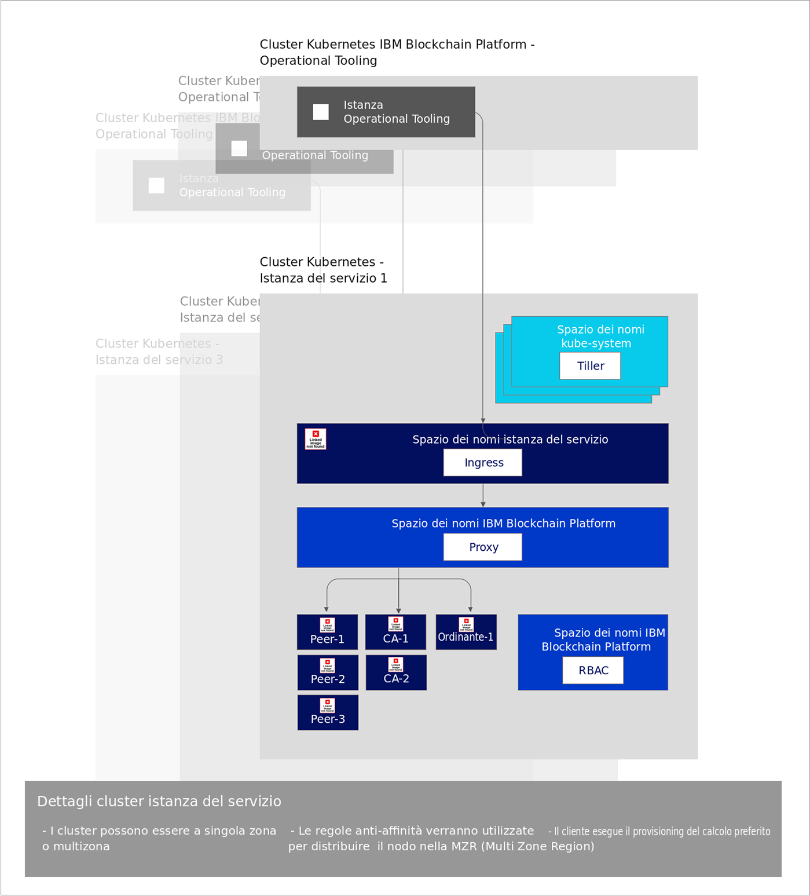

---

copyright:
  years: 2019
lastupdated: "2019-03-05"

subcollection: blockchain

---

{:new_window: target="_blank"}
{:shortdesc: .shortdesc}
{:screen: .screen}
{:codeblock: .codeblock}
{:note: .note}
{:important: .important}
{:tip: .tip}
{:pre: .pre}

# Informazioni su {{site.data.keyword.blockchainfull_notm}} Platform free 2.0 beta
{: #ibp-console-overview}

{{site.data.keyword.blockchainfull_notm}} Platform free 2.0 beta è la prossima generazione delle offerte {{site.data.keyword.blockchainfull_notm}} che ti offre il totale controllo sulle tue distribuzioni e sui tuoi certificati. Questa versione beta gratuita include la nuova console {{site.data.keyword.blockchainfull_notm}}, un'interfaccia utente che può semplificare e accelerare il processo di distribuzione dei componenti in un servizio {{site.data.keyword.cloud_notm}} Kubernetes controllato e gestito da te.
{:shortdesc}

## Cosa offre la nuova versione beta
{: #ibp-console-overview-capabilities}

Questa release più recente è personalizzata per gli utenti di {{site.data.keyword.blockchainfull_notm}} e Hyperledger Fabric esperti e consente loro di ospitare reti o creare nuove organizzazioni che possono unirsi ad altre reti {{site.data.keyword.blockchainfull_notm}} 2.0. Se sei un cliente del piano Starter o del piano Enterprise esistente, invece di lasciare che {{site.data.keyword.IBM_notm}} gestisca la tua rete, hai ora il totale controllo, con la capacità di eseguire il provisioning, il monitoraggio e la gestione dei tuoi componenti all'interno del tuo cluster Kubernetes.

La release {{site.data.keyword.blockchainfull_notm}} Platform free 2.0 beta include le seguenti funzioni chiave:

**Esperienza di sviluppatore integrata**
- **Codifica facilmente** i tuoi smart contract in Node.js, Golang o Java, scrivi le applicazioni client utilizzando la nuova estensione {{site.data.keyword.blockchainfull_notm}} VSCode, avvaliti dell'**integrazione SDK** con la console e impara dalle nostre esercitazioni e dai nostri esempi molto esaurienti.
- **DevOps semplificato** ti consente di passare dallo sviluppo alla verifica e alla produzione aumentando le tue risorse Kubernetes per aggiungere ulteriori componenti.
- **Funzioni chiave di Fabric aggiornate: ** Avvaliti delle funzioni più recenti di Hyperledger Fabric v1.4:
  - [Raccolte di **dati privati**](/docs/services/blockchain/howto/ibp-console-smart-contracts.html#ibp-console-smart-contracts-private-data) che forniscono una maggiore riservatezza dei dati garantendo che i dati del libro mastro siano condivisi solo con i peer autorizzati tramite il protocollo gossip.
  - [Rilevamento dei servizi ](https://hyperledger-fabric.readthedocs.io/en/release-1.4/discovery-overview.html "Rilevamento dei servizi"), che ti consente di rilevare e aggiornare dinamicamente il modo in cui la tua applicazione interagisce con la tua rete.
  - [Elenchi di controllo accessi dei canali ](https://hyperledger-fabric.readthedocs.io/en/release-1.4/access_control.html "Elenchi di controllo accessi") che ti offrono un controllo aggiuntivo sulla governance dei tuoi canali e degli smart contract.
- **Integrazione del servizio {{site.data.keyword.cloud_notm}}.** Avvaliti dei servizi {{site.data.keyword.cloud_notm}} integrati, quali il dashboard del servizio {{site.data.keyword.cloud_notm}} Kubernetes, il servizio di registrazione e metriche {{site.data.keyword.cloud_notm}} e il servizio di identità {{site.data.keyword.cloud_notm}}.

**Controllo totale delle tue distribuzioni**
- **Distribuisci solo i componenti di cui hai bisogno**. Connetti un peer a più canali e reti oppure ospita un servizio ordini a cui possono connettersi i business partner.
- **Mantieni un controllo completo delle tue identità**. Memorizza e gestisci le chiavi utilizzate per amministrare i tuoi nodi senza memorizzare le tue chiavi private in {{site.data.keyword.cloud_notm}}.
- **Gestione centralizzata** La console {{site.data.keyword.blockchainfull_notm}} Platform ti consente di distribuire e gestire tutte le tue organizzazioni e tutti i tuoi nodi in **una singola console centrale** senza dover fare affidamento su {{site.data.keyword.IBM_notm}} o altri fornitori per gestire i tuoi ordinanti o la tua Certificate Authority. Puoi anche aggiungere o rimuovere membri da un consorzio blockchain, creare e unirti a canali e installare e istanziare smart contract dalla tua console.
- **Ospita o unisciti a una rete** distribuisci i peer ospitati nel tuo cluster a più canali o più cloud oppure invita altre organizzazioni a unirsi al tuo consorzio o ai tuoi canali; tali organizzazioni continuano a gestire i loro nodi in modo indipendente nelle infrastrutture.
- **Gestisci l'accesso** degli utenti che possono amministrare o monitorare i tuoi nodi.
- **Accesso diretto ai log** dei tuoi nodi dal servizio {{site.data.keyword.IBM_notm}} Kubernetes. Utilizza il servizio di analisi log {{site.data.keyword.cloud_notm}} oppure un servizio di terze parti per estrarre e analizzare i tuoi log.
- **Interagisci direttamente con i tuoi pod di nodi** utilizzando il dashboard Kubernetes. Esegui il comando exec nei tuoi pod e nei tuoi contenitori per immettere comandi e aggiornare certificati dalla riga di comando.

**Scalabilità e flessibilità**
- **Scegli la tua capacità di calcolo.** Hai la flessibilità di decidere la quantità di CPU, memoria e archiviazione di cui desideri eseguire il provisioning nel tuo cluster Kubernetes.
- **Ridimensiona** ampliando e riducendo le risorse nel tuo cluster Kubernetes, pagando solo per quello di cui hai bisogno.
- **Ripristino di emergenza e alta disponibilità multizona.** Questa opzione duplica la tua distribuzione Kubernetes tra le zone, abilitando l'alta disponibilità (HA, High Availability) dei tuoi componenti e il ripristino di emergenza (DR, Disaster Recovery).  

Consulta questo blog [blog ](https://www.ibm.com/blogs/blockchain/2019/02/taking-the-next-step-towards-deploying-blockchain-anywhere "Taking the next step towards deploying blockchain for business anywhere") per compiere il passo successivo verso la distribuzione di blockchain per scopi di business ovunque.  

Questa offerta è per gli utenti Fabric esperti che vogliono creare e gestire le loro reti. La capacità di distribuire un'intera rete con un singolo clic sarà disponibile a breve. Nel frattempo, per distribuire una rete che utilizza una configurazione standard con un singolo clic, vedi invece la nostra documentazione relativa al [piano Starter](/docs/services/blockchain/get_start_starter_plan.html#getting-started-with-starter-plan).

## Considerazioni
{: #ibp-console-overview-considerations}

Prima di distribuire la console, assicurati di aver compreso le seguenti considerazioni:

- {{site.data.keyword.blockchainfull_notm}} platform free 2.0 beta è sviluppato con Hyperledger Fabric v1.4.
- Tutti i peer distribuiti con la versione beta 2.0 gratuita utilizzano CouchDB come loro database dello stato.
- Hai l'opzione di utilizzare un cluster Kubernetes gratuito per la valutazione dell'offerta beta; tuttavia, capacità e prestazioni sono limitate, nessuno dei tuoi dati può essere migrato e il cluster viene eliminato dopo 30 giorni.
- Sei responsabile della gestione del monitoraggio dell'integrità, della sicurezza e della registrazione del tuo cluster Kubernetes. Consulta queste informazioni sulla [ ](https://cloud.ibm.com/docs/containers/cs_responsibilities.html#your-responsibilities-by-using-ibm-cloud-kubernetes-service "Responsabilità di gestione del cluster") per i dettagli su quanto gestito da {{site.data.keyword.cloud_notm}} e su quanto è una tua responsabilità.
- Sei anche responsabile del monitoraggio dell'utilizzo delle risorse del tuo cluster Kubernetes utilizzando il dashboard Kubernetes. Se devi aumentare la capacità di archiviazione o le prestazioni del tuo cluster, consulta queste informazioni relative alla modalità di [modifica del tuo volume esistente ](https://cloud.ibm.com/docs/containers/cs_storage_file.html#change_storage_configuration "Modifica della dimensione e dell'IOPS del tuo dispositivo di archiviazione esistente").
- Sei responsabile della gestione e della protezione dei tuoi certificati e delle tue chiavi pubbliche e private. {{site.data.keyword.IBM_notm}} non archivia i tuoi certificati nel cluster Kubernetes o nella console. Sono conservati solo nell'archiviazione locale del tuo browser. Se passi a un altro browser, dovrai importare le tue identità create in tale browser.
- L'offerta beta 2.0 gratuita è disponibile solo nella regione **Dallas** del servizio {{site.data.keyword.cloud_notm}} Kubernetes. Questa regione include i data center in Dallas, San Jose, Houston e Brasile. Pertanto, tutti i componenti blockchain possono risiedere in uno qualsiasi di questi quattro data center. Non vengono distribuiti altrove.
- Mentre l'offerta {{site.data.keyword.blockchainfull_notm}} Platform 2.0 beta è gratuita, se scegli un cluster Kubernetes a pagamento invece di un cluster gratuito limitato, ci saranno degli addebiti sul tuo account {{site.data.keyword.cloud_notm}}.
- Kubernetes deve essere alla versione 1.11 o successiva nel tuo cluster Kubernetes {{site.data.keyword.cloud_notm}}. Utilizza queste istruzioni per [eseguire un upgrade dei tuoi cluster nuovi ed esistenti](/docs/services/blockchain/howto/ibp-v2-deploy-iks.html#ibp-v2-deploy-iks-updating-kubernetes) a questa versione.

## Migrazione
{: #ibp-console-overview-migration}

Non puoi eseguire la migrazione da una qualsiasi offerta di {{site.data.keyword.blockchainfull_notm}} Platform alla {{site.data.keyword.blockchainfull_notm}} Platform free 2.0 **beta**.  

In futuro, potrai eseguire la migrazione da una release del piano Enterprise alla {{site.data.keyword.blockchainfull_notm}} Platform 2.0 quando diventa generalmente disponibile (GA).   

Tutte le istanze del servizio di {{site.data.keyword.blockchainfull_notm}} Platform free 2.0 beta non saranno migrate alla versione GA e non è possibile migrare le istanze del piano Starter alla versione 2.0 GA.

## Licenza e determinazione dei prezzi
{: #ibp-console-overview-license-and-pricing}

{{site.data.keyword.blockchainfull_notm}} Platform free 2.0 beta è gratuito. Un'istanza della console è inclusa con ciascuna distribuzione della piattaforma in un cluster del servizio {{site.data.keyword.cloud_notm}} Kubernetes. Devi pagare per il cluster Kubernetes se scegli di distribuire la console in un cluster standard del servizio {{site.data.keyword.cloud_notm}} Kubernetes.

## Introduzione
{: #ibp-console-overview-deploy}

Un'istanza della console viene distribuita in un cluster del servizio {{site.data.keyword.IBM_notm}} Kubernetes come parte della distribuzione di ciascuna istanza di {{site.data.keyword.blockchainfull_notm}} Platform free 2.0 beta.

Per ulteriori informazioni sulla distribuzione della console e della piattaforma, vedi [Introduzione a {{site.data.keyword.blockchainfull_notm}} Platform free 2.0 beta](/docs/services/blockchain/howto/ibp-v2-deploy-iks.html#ibp-v2-deploy-iks).

Per ulteriori informazioni su come utilizzare la console per iniziare a distribuire nodi e creare un consorzio, vedi l'esercitazione relativa alla [creazione della tua rete](/docs/services/blockchain/howto/ibp-console-build-network.html#ibp-console-build-network). Questa esercitazione ti guiderà nel processo di utilizzo della console per creare una rete di esempio con tre organizzazioni, un'organizzazione di ordinazione, due organizzazioni peer e un canale con due peer uniti a esso. Puoi utilizzare la rete di esempio per distribuire demo o modelli di verifica (Proof of Concept) o regolare ed espandere i passi nell'esercitazione per creare una tua configurazione.

## Riferimento per l'architettura
{: #ibp-console-overview-architecture}

La seguente illustrazione mostra i componenti della rete blockchain e come interagiscono.

*Figura 1. Riferimento per l'architettura*

Nota in che modo viene creata una singola istanza della console, conosciuta anche come Operational Tooling, per ciascuna istanza del servizio {{site.data.keyword.blockchainfull_notm}} Platform. Quando un nodo CA, ordinante o peer viene distribuito utilizzando la console, ne viene eseguita la distribuzione nell'**Istanza del servizio cluster Kubernetes**.

| **Cluster Kubernetes di IBM Blockchain Platform** | **Descrizione** |
| ------------------------- |-----------|
| Operational Tooling | Noto anche come `console`, si tratta della tua interfaccia utente centrale per gestire tutti i componenti della tua blockchain. Con questa console, poi ora creare nodi di ordinazione, peer e CA, creare canali e installare e istanziare smart contract sviluppati con l'estensione VSCode di Hyperledger Fabric v1.4. La console viene distribuita in un cluster appartenente a {{site.data.keyword.IBM_notm}}.|


| **Istanza del servizio cluster Kubernetes ** | **Descrizione** |
| ------------------------- |-----------|-----------|-----------|
| **Tiller** | Parte della [strumentazione Helm ](https://docs.helm.sh/glossary/#tiller "Tiller"), il Tiller viene eseguito all'interno del cluster Kubernetes per gestire le installazioni dei tuoi grafici Helm di ordinanti, CA e peer. |
| **Ingress** | Un [oggetto Kubernetes ](https://kubernetes.io/docs/concepts/services-networking/ingress/ "Ingress") che consente l'accesso alle risorse cluster dall'esterno del cluster. |
| **Proxy** | Il proxy {{site.data.keyword.blockchainfull_notm}} Platform è responsabile per l'instradamento del traffico ai nodi peer, CA e ordinante corretti utilizzando l'instradamento di intestazione host. |
| **Peer, CA e ordinanti** | Sono i nodi creati dalla distribuzione dei grafici Helm sottostanti. Nota: questi nodi possono anche essere importati da altre istanze del servizio cluster Kubernetes. Poiché le chiavi non vengono mai memorizzate da {{site.data.keyword.IBM_notm}}, ogni nodo peer e ordinante include un proxy web gRPC che consente alla console di comunicare con ciascun nodo utilizzando le chiavi nel portafoglio della console. |
| **RBAC** | Acronimo di Role based access control, ossia del controllo dell'accesso basato sui ruoli.  {{site.data.keyword.blockchainfull_notm}} Platform configura l'[RBAC Kubernetes ](https://kubernetes.io/docs/reference/access-authn-authz/rbac/ "Using RBAC Authorization") nel cluster necessario per gestire i componenti blockchain nel cluster.  |

## Elevata disponibilità (HA, High Availability) e Ripristino di emergenza (DR, Disaster Recovery)
{: #ibp-console-overview-hadr}

Se hai bisogno di elevata disponibilità e ripristino di emergenza, l'archiviazione multizona deve essere abilitata nel tuo cluster IBM Cloud Kubernetes a pagamento. Sono disponibili diverse [opzioni di archiviazione Kubernetes](https://cloud.ibm.com/docs/containers/cs_storage_planning.html#persistent_storage_overview). A breve, IBM Cloud supporterà la soluzione di archiviazione Portworx, che è la soluzione consigliata. Fino ad allora, se per la tua implementazione sono necessari l'elevata disponibilità e il ripristino di emergenza, dovrai portare una tua soluzione di archiviazione.  

Per aggiungere una tua soluzione di archiviazione, dovrai creare una classe di archiviazione personalizzata. Leggi le informazioni relative a come
[aggiungere una classe di archiviazione](https://cloud.ibm.com/docs/containers/cs_storage_basics.html#storageclasses) per la tua soluzione. IBP utilizza il [provisioning del volume dinamico](https://cloud.ibm.com/docs/containers/cs_storage_basics.html#dynamic_provisioning) con la classe di archiviazione predefinita (`default`). Pertanto, per modificare la classe di archiviazione predefinita, esegui questo comando:
```
kubectl patch storageclass <storageclass> -p '{"metadata": {"annotations":{"storageclass.kubernetes.io/is-default-class":"true"}}}'
```
{:codeblock}

Sostituisci ``<storageclass>`` con il nome della tua classe di archiviazione.  

Infine, assicurati di abilitare le regioni multizona quando crei il tuo cluster a pagamento.

## Richiesta di assistenza tecnica
{: #ibp-console-overview-support}

Per ulteriori informazioni su come ottenere supporto su {{site.data.keyword.blockchainfull_notm}} Platform 2.0, e per risorse per sviluppatori di blockchain gratuite e forum di supporto che puoi utilizzare per risolvere i problemi, vedi [Richiesta di assistenza tecnica](/docs/services/blockchain/ibmblockchain_support.html#blockchain-support).

Il supporto per {{site.data.keyword.blockchainfull_notm}} Platform 2.0 sarà limitato durante il periodo beta.
{: important}
