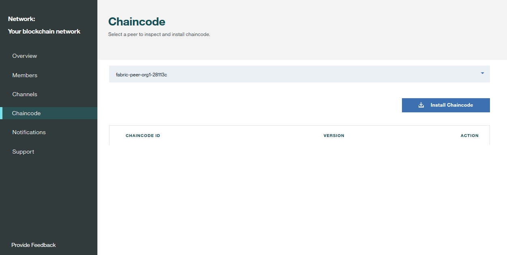
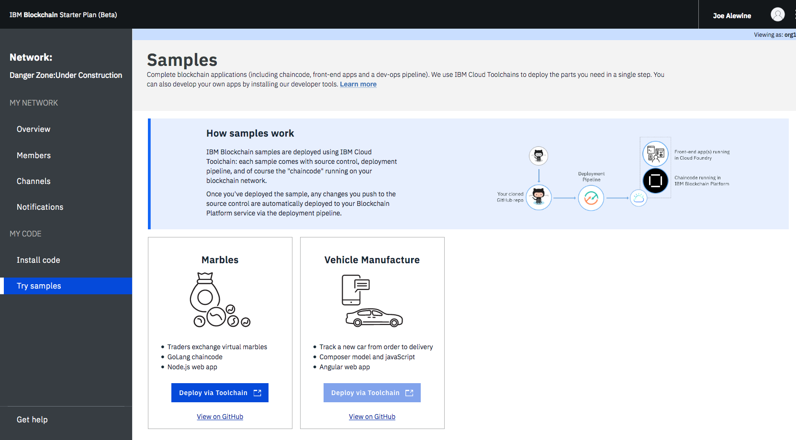

---

copyright:
  years: 2017, 2018
lastupdated: "2018-05-15"

---

{:new_window: target="_blank"}
{:shortdesc: .shortdesc}
{:screen: .screen}
{:codeblock: .codeblock}
{:pre: .pre}

# Monitoraggio di una rete blockchain

Questa esercitazione ti mostra come visualizzare e monitorare le informazioni sullo stato della tua rete {{site.data.keyword.blockchain}} su {{site.data.keyword.Bluemix_short}}.
{:shortdesc}

## Monitoraggio dei canali

Accedi a monitoraggio della rete e individua il canale che vuoi visualizzare e monitorare nella schermata "Canale".  Nella schermata per lo specifico canale, puoi visualizzare le informazioni sullo stato dei dati, i membri e il chaincode istanziato di questo canale in tre schede:

* **Panoramica canale**  
  La scheda "Panoramica canale" mostra le informazioni sui blocchi su questo canale:
    * Viene creata una serie di punti di dati che includono il numero totale di blocchi creati, l'intervallo di tempo dall'ultima transazione, il numero di istanziazioni del chaincode e il numero di richiami del chaincode.
    * Una tabella che elenca tutti i blocchi su questo canale.  Espandi un blocco e potrai vedere le informazioni dettagliate ad esso relativo.  

    

* **Membri**  
  La scheda "Membri" mostra le informazioni dei membri di questo canale, compresi gli indirizzi email per gli operatori organizzativi.
    

* **Chaincode**  
La scheda "Chaincode" elenca tutto il chaincode istanziato su questo canale con ID chaincode, versione e numero di peer che stanno eseguendo il chaincode.    

  Espandi una riga di chaincode per ottenere informazioni dettagliate sul chaincode:  
    * Puoi fare clic su **JSON** per visualizzare il file JSON del chaincode.
    * Puoi fare clic su **Log** per visualizzare i log del chaincode.
    * Puoi fare clic su **Elimina** per rimuovere il contenitore chaincode in esecuzione.
    **Nota**: al momento l'eliminazione del contenitore chaincode in esecuzione non elimina il chaincode. Un chaincode istanziato sulla rete blockchain non può essere eliminato.

  

## Monitoraggio del chaincode

Accedi al monitoraggio della rete e apri la schermata "Installa il codice". Se hai del chaincode in esecuzione, scegli un peer dall'elenco a discesa; potrai vedere tutto il chaincode per questo peer nella tabella con versioni e ID del chaincode. Puoi eseguire l'installazione e l'istanziazione per il tuo chaincode in questa schermata.  Per ulteriori informazioni, vedi [Installazione, istanziazione e aggiornamento di un chaincode](install_instantiate_chaincode.html).

  

## Monitoraggio di applicazioni di esempio

In una rete piano Starter, puoi visualizzare e accedere alle applicazioni di esempio nella schermata "Prova gli esempi" del monitoraggio della rete.  Dopo che hai distribuito un'applicazione di esempio, puoi fare clic sul pulsante **Avvia** per accedere alla tua interfaccia applicativa oppure sul link **Visualizza in GitHub** per visualizzare il repository del codice.  Per ulteriori informazioni, vedi [Distribuzione di applicazioni di esempio](prebuilt_samples.html).

  
