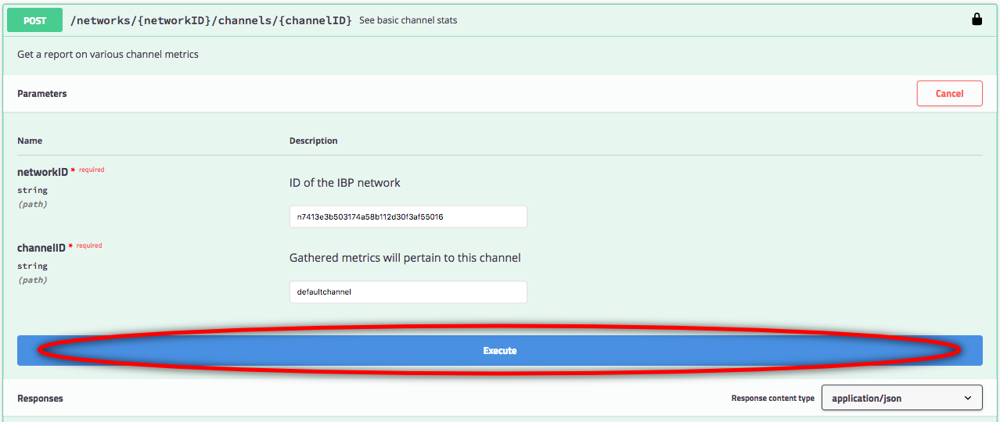

---

copyright:
  years: 2017, 2018
lastupdated: "2018-06-14"

---

{:new_window: target="_blank"}
{:shortdesc: .shortdesc}
{:screen: .screen}
{:codeblock: .codeblock}
{:pre: .pre}

# Interazione con la rete utilizzando le API Swagger

{{site.data.keyword.blockchainfull_notm}} Platform presenta diverse API REST in Swagger che puoi utilizzare per gestire i nodi, i canali, i peer e i membri della tua rete. Le tue applicazioni possono utilizzare queste API per controllare importanti risorse di rete senza usare il monitoraggio della rete.

{:shortdesc}

Prima di iniziare, devi creare un'istanza del servizio [{{site.data.keyword.blockchain}} Platform ](https://console.bluemix.net/catalog/services/blockchain) su {{site.data.keyword.Bluemix_notm}} e creare, o aderire a, una rete blockchain piano Starter <!--or Enterprise Plan -->.

## Richiamo delle credenziali di rete

{: #retrieving-network-credentials}

Accedi al monitoraggio della rete della tua rete Blockchain e apri la schermata "API" dal navigatore a sinistra. Puoi visualizzare le tue credenziali di rete per le API REST. Autorizzerai successivamente le API utilizzando i valori di "key" e "secret" qui visualizzati ed eseguirai le API con il "network_id" come parametro. Fai clic su **Show secret** per visualizzare il valore del campo segreto. Copia i valori dei campi key, secret e network_id, che puoi utilizzare successivamente nell'IU Swagger.

La **Figura 1** mostra la schermata "API":

*Figura 1. API*

Se stai utilizzando piano Starter, è possibile passare da un'organizzazione all'altra nel monitoraggio della rete. Con piano Starter, le due organizzazioni sono configurate per impostazione predefinita. Passare da un'organizzazione all'altra può essere utile per provare le API REST dalla prospettiva di ciascuna organizzazione. Per ottenere le credenziali per un'altra organizzazione nella tua rete, fai clic sul tuo nome utente nell'angolo superiore destro della console monitoraggio della rete. Nel menu che si apre, fai clic sulla freccia a discesa accanto all'organizzazione per visualizzare tutte le organizzazioni. Seleziona l'organizzazione a cui desideri passare e visualizza le credenziali di rete associate.

La **Figura 2** mostra come passare da un'organizzazione all'altra:

  
*Figura 2. Passaggio da un'organizzazione all'altra*

## Autorizzazione delle API Swagger

Fai clic sul link **IU Swagger** nella schermata "API" per aprire l'IU Swagger.  
<!-- remove this line because the link is different depending on if you are starter or enterprise plan
You can also open the Swagger UI with the URL in the connection profiles. For example, `http://blockchain-swagger-dev.stage1.mybluemix.net`.
-->

Nell'IU Swagger, fai clic sul pulsante **Autorizza**; viene visualizzata la finestra di autorizzazione. Immetti il valore di chiave (key) e segreto (secret) nelle tue credenziali di rete come nome utente e password e fai clic su **Autorizza** e quindi su **Fatto**. Ore sei pronto ad eseguire le API. Nota: se aggiorni il tuo browser, devi eseguire nuovamente l'autorizzazione con le tue credenziali.

Utilizzando l'autenticazione di tipo Autenticazione di base, qualsiasi credenziale da te specificata nella finestra Autorizza viene memorizzata dopo che fai clic sui pulsanti **Autorizza** e quindi **Fatto** e viene passata in ciascuna chiamata API REST.

La **Figura 3** mostra il processo per autorizzare le API Swagger: 

  
*Figura 3. Autorizza API*

## Prova delle API

Fai clic sulla API REST che vuoi eseguire e fai clic sul pulsante **Provalo adesso**.

La **Figura 4** mostra il pulsante "Try it out" nella "IU Swagger":

  
*Figura 4. Pulsante "Try it out" nella "IU Swagger"*

Dopo che hai fatto clic sul pulsante **Try it out**, puoi immettere i parametri obbligatori per utilizzare la API. Puoi trovare `networkID` nelle tue credenziali di rete e trovare gli altri parametri nel tuo monitoraggio della rete. Dopo che hai immesso i parametri, fai clic su **Esegui** per eseguire la chiamata API REST sulla tua rete.

La **Figura 5** mostra i parametri nella "IU Swagger":

  
*Figura 5. Immissione dei parametri*  

Dopo che hai fatto clic su **Esegui**, puoi vedere la risposta della chiamata API sulla tua rete. Puoi anche vedere un comando CURL che può richiamare la API direttamente dalla tua riga di comando.

La **Figura 6** mostra il comando CURL, l'URL e il corpo della risposta della API:

  
*Figura 6. Risposta della API*    

## Suggerimenti per la soluzione dei problemi

### 401 Non autorizzato  
  Assicurati di disporre delle autorizzazioni necessarie per la API REST fornendo le tue credenziali di rete. Per ulteriori informazioni, vedi [Autorizzazione delle API Swagger](#authorizing-swagger-apis).

### Errore 400: Richiesta non valida
  Alcune API potrebbero prendere un argomento nel corpo della richiesta che funge da filtro per visualizzare i risultati solo per uno specifico peer. Nel corpo viene fornito un frammento di esempio che, se utilizzato, deve essere modificato per specificare il peer o l'elenco di peer su cui desiderare applicare il filtro. Per evitare questo errore, modificare il frammento per specificare un peer nella tua rete oppure rimuovere del tutto il frammento.
