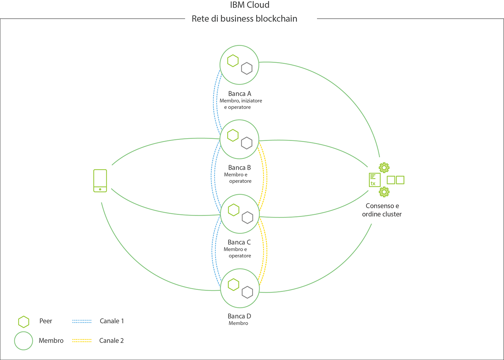

---

copyright:
  years: 2017
lastupdated: "2017-08-24"

---

{:new_window: target="_blank"}
{:shortdesc: .shortdesc}
{:screen: .screen}
{:codeblock: .codeblock}
{:pre: .pre}

# {{site.data.keyword.blockchainfull_notm}} Platform

**ATTENTION:** Before using a {{site.data.keyword.blockchainfull}} offering, read the technical and support information in the [Disclaimer](needtoknow.html) section.  
{:shortdesc}

The {{site.data.keyword.blockchainfull_notm}} Platform is the only integrated business ready platform that addresses the full life cycle (**develop**, **govern**, and **operate**) of a multi-organization blockchain network. It is designed to accelerate, through collaboration in each phase, the creation of "built for business" global blockchain networks with the performance and security for even the most demanding use cases and regulated industries. {{site.data.keyword.blockchainfull_notm}} offerings are built on the Hyperledger Fabric V1.0 code base leveraging a modular architecture to achieve enterprise levels of security, data integrity, scalability, and performance to meet your business needs.  

Let's take a look at the primary activites and roles in an {{site.data.keyword.blockchainfull_notm}} network, and see how they fit into a network's lifecycle.

**Note**: The table below is not meant to represent a linear progression. Tasks such as development and network management will occur repeatedly as applications and membership evolve.

|  Function     | Activities       | Roles  |
| ------------------------- |--------------------------|-----|
| [Develop ](https://developer.ibm.com/blockchain/sandbox/) | Develop Applications, Develop Chaincode | Application Developers |
| [Govern](get_start.html)| Invite Members, Generate Credentials, Propose Governance Models, New members join, Disseminate certs & endpoint info | Network Operators, Network Members |
| [Operate](v10_dashboard.html)| Monitor health & activity, Manage new deployments, Manage members (addition/removal), Manage chaincode lifecycle,  Manage channels, Support | Network Operators, Network Participants |
  
Now let's take a closer look at these roles and activities...

## **Develop** the network
Explore and accelerate blockchain development by leveraging best practices honed across 400+ client engagements to:
* Ensure close alignment across businesses with technology that significantly reduces blockchain application development time (applications that would otherwise take six weeks to develop can be created in less than two days).
* Quickly build blockchain skills within your existing roster of programmers by leveraging {{site.data.keyword.blockchainfull_notm}} developer tools.
* Give developers the flexibility to learn and develop in their preferred environment with an open and modern toolset.  
  
As a business owner, you can develop your use case with help from IBM's deep bench of industry and blockchain experts who come together in the {{site.data.keyword.blockchainfull_notm}} Garage to harness the full power of the IBM Blockchain Platform. 

As a developer, you can quickly and easily align business requirements and accelerate blockchain application development for free with a cloud sandbox and interactive playground that turns any programmer into a blockchain developer. These tools are designed to turn business rules into code in your preferred environment:
* **Explore online**  
  Leverage [Hyperledger Composer ](https://hyperledger.github.io/composer/introduction/introduction.html), which is an open source development tool to learn key blockchain concepts, to create network definitions, and to leverage reusable industry models and smart contract libraries. 
* **Install locally**  
  Leverage IBM certified images of Hyperledger Fabric and Composer, which is an open source framework for building a business network, to develop and test directly on your laptop.
* **Collaborate in a cloud environment**  
  Free and fee options to develop and share your code with others.
  
One you have developed your business network, you can deploy it to a live network running on the IBM Blockchain Platform with this [recipe ](https://ibm-blockchain.github.io/platform-deployment/).

## **Govern** the network
There are two options for creating the backend environment of your network. First, you can use the published Hyperledger Docker images, giving you the option of implementing the Composer library to build your applications and interact with your network. Or, you can write chaincode natively and develop the server side code to drive transactions. Running locally is the perfect opportunity to tinker with network configurations, explore potential use cases, and start building out proofs of concept. As your PoC begins to take shape, you'll be able to broaden the implementation by hosting your network in the cloud.

With a cloud deployment you're provided with a collection of easy-to-use recipes and scripts to facilitate the deployment of a Hyperledger Fabric network running on Kubernetes. Use this phase to examine the behavior and stability of your PoC in a hosted environment. The [{{site.data.keyword.blockchainfull_notm}} Container Service ](https://ibm-blockchain.github.io/) can be best thought of as a testing mechanism for the functionality and resiliency of your application and as a natural precursor to the Enterprise Plan.

After you have a network, {{site.data.keyword.blockchainfull_notm}} has been designed to create a network management experience that offers members some control, while no single member is in complete control. The {{site.data.keyword.blockchainfull_notm}} Platform has the first set of integrated tools to allow teams to enforce change management of the network via customizable policies. 

The following list shows key features of this governance model:

* Democratic management tools allowing for collective management.
* Policy Editor to define flexible, democratic policies to govern changes to the network.
* Pre-built tools and policies enable faster onboarding, customization, and activation.
* A multi-party workflow tool with integrated notifications, a member activities panel, and secure signature collection.

## **Operate** the network
Deploy and operate decentralized networks with a production ready secure service. Start small and scale your network elastically as your membership and transaction volumes increase by taking advantage of the following features:

* An ultra high security environment with many hardware, firmware, and software security features.
* Hardened architecture for scalability, resiliency, and availability.
* Optimized for performance and running on the world's fastest Linux compute.
  
Operating your network on the {{site.data.keyword.blockchainfull_notm}} Platform includes tools and capabilities to simplify administrative tasks:

* Dashboards for monitoring and managing the resources on the network. 
* Lifecycle management for seamless upgrades of the full code stack.
* 24/7 technical support integrated into the portal.
* Hardened security stack with no privileged access, malware and tamper resistance, 100% encryption, and many more features for networks with sensitive data in regulated industries.

## Participating in a blockchain network 

We use the term **participant** as the broadest classification for any organization, individual, application or device interacting with the blockchain network.  Under the “participant” umbrella there are two distinct groupings – **members** and **users**.   
 
Simply put, a member possesses a valid digital certificate, which permits the member to issue and/or validate transactions within a blockchain network.  A user, does not have a certificate, but they can still interact with the blockchain network through one of the existing network members.   You can think of a member’s certificate as their “membership card”, say to a fitness club.    And while a user may not have such a membership card, they can enter the fitness club as the “guest” of an existing member.  Let’s look at these roles a little closer.

### Members 

{{site.data.keyword.blockchainfull_notm}} Platform is underpinned by the Hyperledger Fabric which is a “permissioned blockchain” technology.  Hence, all members are enrolled into the network with a certificate that grants them permissions to use the network as a service **provider** (i.e issue certificates, validate/order transactions) or **consumer** (i.e. issue transactions).   

- **Providers - In members, we trust** - A blockchain network is powered by its members.   To make a blockchain network operational, there needs to be a minimum set of members *providing* foundational blockchain services; including transaction validation, transaction ordering, and certificate management services.  By running such services these members become maintainers of integrity of the shared ledger at the epicenter of the blockchain network.  So you ask, how many members do you need to make a blockchain operational? The answer is it depends on the network's trust requirement.   Some networks tolerate a more centralized trust model requiring fewer members serving as providers.  Other networks require a more diverse members set (i.e.,  legally separate entities) and maintain a more decentralized trust model.  An example of a more centralized trust model would be a supply chain visibility network whose providing members  are a global retailer, a global shipping company and IBM.  In this case, these three members would act as the “foundation of trust” for the network, providing the foundational services of the blockchain network.   These members can issue certificates importers, exporters, customs agents, retailers, such that they can participate (issue transactions) in the network.   This network can decentralize trust by enabling more members to participate in providing foundational services, thereby ensuring all members have control but no single member has exclusive control.    A typical network will have on the order of 10s of members providing foundation blockchain services.

- **Consumers - Trust established, now invoke away** – With a foundation of trust established, the network is ready to grow.  It is quite common that the majority of the members in your network are simply using the network to invoke transactions against the distributed ledger.  These members are simply *consumers* and are not participating in providing foundational services to the network.  A typical network will have the order of 10s to 100s of members providing with the permission to issue transactions within a given blockchain network.

#### Member personas
 
It is sometimes useful to think about members via a persona that outlines the role of the member in the business network.  Here are a few that we often see used.
 
- **Initiator** – A member that has been selected by other members to bootstrap the Blockchain network.    The IBM Blockchain Platform requires a single member to sign in to the IBM Blockchain Platform and perform tasks to initiate the network.  These include naming the network, inviting the initial set of members, and setting the default set of network operation policies.  This is a transient role.  Once the network is bootstrapped, the initiator does not retain special privileges and simply resumes the role of member.  

- **Maintainer** – A member that is running one or more network Peers & CAs.   These members are maintaining the integrity of the distributed ledger by participating in the consensus process, which is how transactions are validated on a blockchain network.   The maintainer, through ownership of a CA, also has the ability to issue certificates to participants and grant them access to the network. 
 
- **Operator** – A member that is running services on behalf of other network members, including the transaction ordering service, certificate authorities, transaction gateways and other foundational network services.  By default, IBM is the network operator of networks deployed on the IBM Blockchain Platform.
 
- **Auditor** – A member that has been granted permissions by the network to perform audit functions on the network.  Examples of audit functions include billing, compliance tracking or analytics.  The auditor role typically translates to the member having access to a broader view of transactions on the ledger, and/or a broader enrollment in transaction channels.

### Users

While there may be hundreds of members in a blockchain network, there may be thousands of users.   A user is a participant in a blockchain network that has indirect access to the ledger through a “trust relationship” to an existing member.  For example, it is common for some mobile applications to employ their own user authentication and authorization scheme (OAuth, OpenID) and map those credential to one or more credentialed members in a blockchain network.    A proxy or gateway service is typically created to perform this mapping function, thereby mapping the outside world to the blockchain world.

## Foundational network services 

To make a blockchain operational, members form a foundation of trust by running one or more foundational network services: 

- **Ordering Service** – Ordering and synchronizing transactions  
  In essence, the ordering service is the definition of the network.  It contains identity information for each member, information on channels and a set of policies dictating which members are permitted to perform certain tasks (e.g. invite other members, create channels, etc.). Every transaction and configuration operation will flow through the ordering service, so it’s a beyond critical piece in the overall scheme of things.  Given the fundamental importance of the ordering service, it’s easy to see the pitfalls of an authoritarian orchestration where perhaps only one member pulled the strings.  To counter this, the ordering service is communally managed by members of the network and governance implementations are acted upon jointly.  Put another way, decisions are made collectively, NOT unilaterally. All members have a stake in the network, and by extension, have a vote in any operations that configure and customize their stance in the network.  These notions of “democracy” and jointly-made decisions are the inherent building blocks for a trusted and decentralized network.  IBM serves as the "operator" of the ordering service for any networks deployed on the IBM Blockchain Platform.
 
- **Certificate Authority** – Issuing certificates to participants  
  To put it simply, the Certificate Authority (CA) provides membership.  All entities in the network (peers, orderers, clients, etc.) must have an identity to communicate, authenticate and ultimately transact. These “identities” exist in the form of x509 certificates (i.e. enrollment certificates), which are required for any direct participation in the blockchain network.  There are also ways of indirect participation, but we’ll get to that later.  The CA can best be thought of as the rubber stamp that gives identities attestation and credibility.  Each member possesses their own CA, and through this CA they can sign certificates for not only their wholly-owned components (peers), but also third party clients and applications.  You can liken a member’s CA to a special pen or a notary stamp.  A certificate signed by this CA is prerequisite for accessing the network.
 
- **Peer** – Validating/endorsing transactions  
  The peer exists to perform two main functions: execute/validate transactions & maintain ledgers.  The peer runs smart contracts, and is the holder of transaction history and the current state of assets on the network’s channels.  At the end of the day it’s all about accessing the peer (directly or indirectly) and performing reads and writes against the ledger. When a member provides an end user access to the network, they’re really providing access to the functionality of the peer.

When a member joins a network via the {{site.data.keyword.blockchainfull_notm}} Platform, the standard issuance is a Peer and a CA.  For a production network, members will want to run multiple instances of these services to ensure availability. By default, IBM runs the Ordering Service for networks created by the {{site.data.keyword.blockchainfull_notm}} Platform.  

## The {{site.data.keyword.blockchainfull_notm}} Platform

The {{site.data.keyword.blockchainfull_notm}} Platform provides a highly secure and permissioned blockchain network upon which authenticated members can easily define assets and create the business solutions for modifying and exchanging them.  No longer is it a tedious and complicated process to bootstrap a production-grade blockchain network. With the The {{site.data.keyword.blockchainfull_notm}} Platform you can take advantage of an orchestration framework that allows you to **organize your consortium into an active blockchain network in record time**. We provide consortium friendly tooling designed to make it simple for multiple institutions to join together and create a democratically governed network. The creation, governance and management tasks of the network become intuitive and transparent through a built-in dashboard monitor and provisioned utilities. By foregoing the otherwise cumbersome process of creating a network and implementing governance, consortium members can instead **focus on the deployment of smart contracts and transfer of assets and information**.      
{:shortdesc}

**High availability** for the integral components of the network (peers, ordering service, Certificate Authority, chaincode) eliminates the crippling effects that can arise from single points of failure. A built-in dashboard monitor allows for easy management of these components and provides a powerful mechanism to visualize assets and smart contracts.

The **modularity** of the Hyperledger Fabric V1.0 architecture and the distinct separation of network roles provides an infrastructure enabling scalability and adaptability to a wide variety of use cases. 

The checks and balances that occur throughout the lifecycle of a transaction ensure consistent and fully vetted results; and ledgers constantly stay synchronized through an implementation of the well-known gossip protocol. Identity and access control are easily enforced through **sign/verify** operations that occur perpetually throughout the network.  

**Governance tooling** is provided to allow members to administer and manage the critical business rules for their network. For example, you may wish to implement a policy defining how many members of a network must agree in order for a new member to join. Or perhaps there is an asset that requires endorsement from every participant in order for a modification to take place. Rules of governance are fundamental for any type of business network and are often extremely elaborate. Governance tooling (e.g. policy editors) greatly simplifies this process.

The service runs in a **highly-secure and isolated** environment with no external access (including root access) to network components. Data is encrypted in flight and at rest, and hardware security support modules allow digital keys to be protected in accordance with industry regulations. Hardware virtualisation is used to run each node in an isolated environment, thereby protecting other nodes in the network from peers with potentially misbehaving or malicious chaincode. Hashing, sign/verify operations, and component-to-component communications are accelerated thanks to advanced cryptography implementations.

Before continuing, let's take a look at a simple configuration within the The {{site.data.keyword.blockchainfull_notm}} Platform.  **Figure 1** depicts an example of a deployed blockchain network consisting of four members (each owning two peers), a Certificate Authority responsible for distributing cryptographic identity material, and an ordering service defining policies and network participants. The blue channel contains all four network members, whereas the yellow channel is restricted to only three members: Banks B, C and D. We also see that Bank A played the role of network initiator and that Bank D exists only as a member in the context of the yellow channel. Lastly, an end user or application in possession of a properly signed x509 certificate is able to send calls to peers on the network. As mentioned earlier, it's quite conceivable that an end user won't even know about the existence of the blockchain network.

*Figure 2. An example blockchain network consisting of four members leveraging channels to isolate data*

## {{site.data.keyword.IBM_notm}} Membership Offerings

The following table summarizes the current and future membership options.  [Enterprise Plan](enterprise_plan.html) is the membership option that is currently available.

|       | Entry      | [Enterprise](enterprise_plan.html)  | Enterprise Plus | Self Managed
| ------------------------- |--------------------------|-----|-----|------|
| **What's Included** | Basic service levels | **Advanced service levels, enterprise production ready** | Dedicated compute for performance and isolation | Software stack to install on your own infrastructure + connect to a network hosted on this cloud service |
| **Billing Policy** | Hourly charge | **Monthly subscription** | Monthly subscription | Monthly subscription |
| **Availability** | Coming soon | **Available now** | Coming soon | Planned for 2018 |

Sign up now for your [{{site.data.keyword.blockchainfull_notm}} membership ](https://console.bluemix.net/catalog/services/blockchain?env_id=ibm:yp:us-south&taxonomyNavigation=apps)!

## {{site.data.keyword.IBM_notm}} Support 

{{site.data.keyword.IBM_notm}} offers support on {{site.data.keyword.IBM_notm}} implemented {{site.data.keyword.blockchain}} solutions. For more information about {{site.data.keyword.blockchainfull_notm}} Support, see [Getting support](ibmblockchain_support.html).

For complete details on all Hyperledger Fabric v1.0 features and functionality,
see [Hyperledger Fabric documentation ](http://hyperledger-fabric.readthedocs.io/en/latest/).
