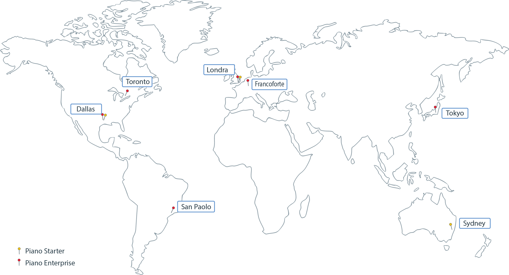

---

copyright:
  years: 2017, 2018
lastupdated: "2018-08-31"

---

{:new_window: target="_blank"}
{:shortdesc: .shortdesc}
{:screen: .screen}
{:pre: .pre}
{:table: .aria-labeledby="caption"}
{:codeblock: .codeblock}
{:tip: .tip}
{:download: .download}

# Regioni e ubicazioni {{site.data.keyword.blockchainfull_notm}} Platform
{: #ibp-regions-locations}

***[Questa pagina è utile? Faccelo sapere.](https://www.surveygizmo.com/s3/4501493/IBM-Blockchain-Documentation)***

{{site.data.keyword.cloud}} è ospitato in tutto il mondo. Una regione è un'area geografica a cui si accede da un endpoint e le ubicazioni sono i data center all'interno della regione. {{site.data.keyword.blockchainfull_notm}} Platform offre piani di adesione in {{site.data.keyword.cloud_notm}} globalmente in regioni diverse. Quando crei l'istanza del servizio {{site.data.keyword.blockchainfull_notm}} Platform in {{site.data.keyword.cloud_notm}}, la tua rete blockchain e le tue risorse di rete vengono create e archiviate nella regione {{site.data.keyword.cloud_notm}} in cui crei l'istanza del servizio.
{:shortdesc}

Sono disponibili offerte {{site.data.keyword.blockchainfull_notm}} Platform diverse nelle diverse regioni {{site.data.keyword.cloud_notm}}. Puoi creare le reti blockchain solo nelle regioni {{site.data.keyword.cloud_notm}} dove sono disponibili i piani {{site.data.keyword.blockchainfull_notm}} Platform.

La tabella 1 e la figura 1 mostrano le regioni e le ubicazioni di {{site.data.keyword.cloud_notm}} supportate da {{site.data.keyword.blockchainfull_notm}} Platform.

| Regione/ubicazione | Piano Starter | Piano Enterprise |
|--------|----------|----------|
| Stati Uniti Sud/Dallas | S | S |
| Regno Unito/Londra | S | S |
| AP Nord/Tokyo |  | S |
| Germania/Francoforte |  | S |
| Sydney | S |  |
| São Paulo |  | S |
| Toronto |  | S |

_Tabella 1. Regioni e ubicazioni di {{site.data.keyword.blockchainfull_notm}} Platform_

  
_Figura 1. {{site.data.keyword.blockchainfull_notm}} Platform - regioni e ubicazioni_
