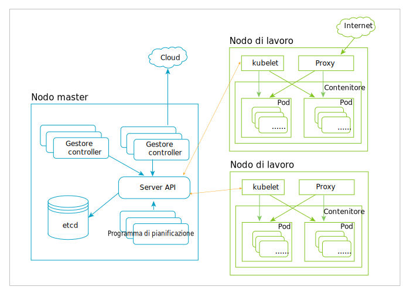

---

copyright:
  years: 2019
lastupdated: "2019-03-20"

subcollection: blockchain

---

{:new_window: target="_blank"}
{:shortdesc: .shortdesc}
{:screen: .screen}
{:codeblock: .codeblock}
{:note: .note}
{:important: .important}
{:tip: .tip}
{:pre: .pre}

# Kubernetes
{: #k8s-overview}

La console {{site.data.keyword.blockchainfull_notm}} Platform free 2.0 beta viene distribuita su un cluster Kubernetes tramite {{site.data.keyword.cloud_notm}} Kubernetes Service. Kubernetes è un sistema open source per l'automazione di distribuzione, ridimensionamento e gestione delle applicazioni contenute in contenitori.
{:shortdesc}

Kubernetes fornisce un ambiente di gestione incentrato sul contenitore. Orchestra l'infrastruttura di calcolo, rete e archiviazione al posto dei carichi di lavoro dell'utente. Fornisce molta della semplicità di PaaS (Platform as a Service) con la flessibilità di IaaS (Infrastructure as a Service) e consente la portabilità tra i provider dell'infrastruttura.

Il seguente diagramma illustra l'architettura di Kubernetes. Per ulteriori spiegazioni su nodi, contenitori e pod, vedi la seguente sezione [Oggetti Kubernetes chiave](#k8s-overview-key-obj).

*Figura 1. Diagramma architettura Kubernetes*

## {{site.data.keyword.cloud_notm}} Kubernetes Service
{: #k8s-overview-iks}

{{site.data.keyword.cloud_notm}} Kubernetes Service fornisce potenti strumenti combinando i contenitori Docker, la tecnologia Kubernetes, un'esperienza utente intuitiva e la sicurezza e l'isolamento integrati per automatizzare la distribuzione, il funzionamento, il ridimensionamento e il monitoraggio di applicazioni caricate nei contenitori in un cluster di host di calcolo.

Per ulteriori informazioni su {{site.data.keyword.cloud_notm}} Kubernetes Service, vedi i seguenti argomenti nella documentazione di {{site.data.keyword.cloud_notm}} Kubernetes Service:
- [Tecnologia {{site.data.keyword.cloud_notm}} Kubernetes Service ](https://cloud.ibm.com/docs/containers/cs_tech.html#ibm-cloud-kubernetes-service-technology "{{site.data.keyword.cloud_notm}} - Documentazione della tecnologia di Kubernetes Service ")
- [Perché {{site.data.keyword.cloud_notm}} Kubernetes Service ](https://cloud.ibm.com/docs/containers?topic=containers-cs_ov#cs_ov "Documentazione Perché {{site.data.keyword.cloud_notm}} Kubernetes Service")

## Oggetti Kubernetes chiave
{: #k8s-overview-key-obj}

- **Cluster**

  Una serie di macchine, denominate nodi, che eseguono le applicazioni contenute nei contenitori gestite da Kubernetes. Un cluster ha diversi nodi di lavoro e almeno un nodo master.

- **Nodo**

  Un nodo è una macchina di lavoro in Kubernetes. Un nodo può essere una VM o una macchina fisica, a seconda del cluster. Ogni nodo contiene i servizi necessari all'esecuzione dei pod e viene gestito dai componenti master. I servizi su un nodo includono il runtime del contenitore, `kubelet` e `kube-proxy`. Per ulteriori informazioni, vedi la sezione [Kubernetes Node ](https://kubernetes.io/docs/concepts/architecture/nodes/ "Kubernetes Node") nella documentazione di Kubernetes.

- **Contenitore**

  Un'immagine portatile e leggera che contiene il software e tutte le relative dipendenze. I contenitori disaccoppiano le applicazioni dall'infrastruttura host sottostante per rendere la distribuzione più facile in ambienti cloud o SO differenti e per un ridimensionamento più semplice.

- **Pod**

  L'oggetto Kubernetes più piccolo e semplice. Un pod rappresenta una serie di contenitori in esecuzione sul tuo cluster. Un pod normalmente viene configurato per eseguire un solo contenitore primario. Può anche eseguire contenitori sidecar che aggiungono funzioni supplementari come la registrazione. I pod normalmente sono gestiti da una distribuzione. Per ulteriori informazioni, vedi la sezione [Kubernetes Pod ](https://kubernetes.io/docs/concepts/workloads/pods/pod/) nella documentazione di Kubernetes.
