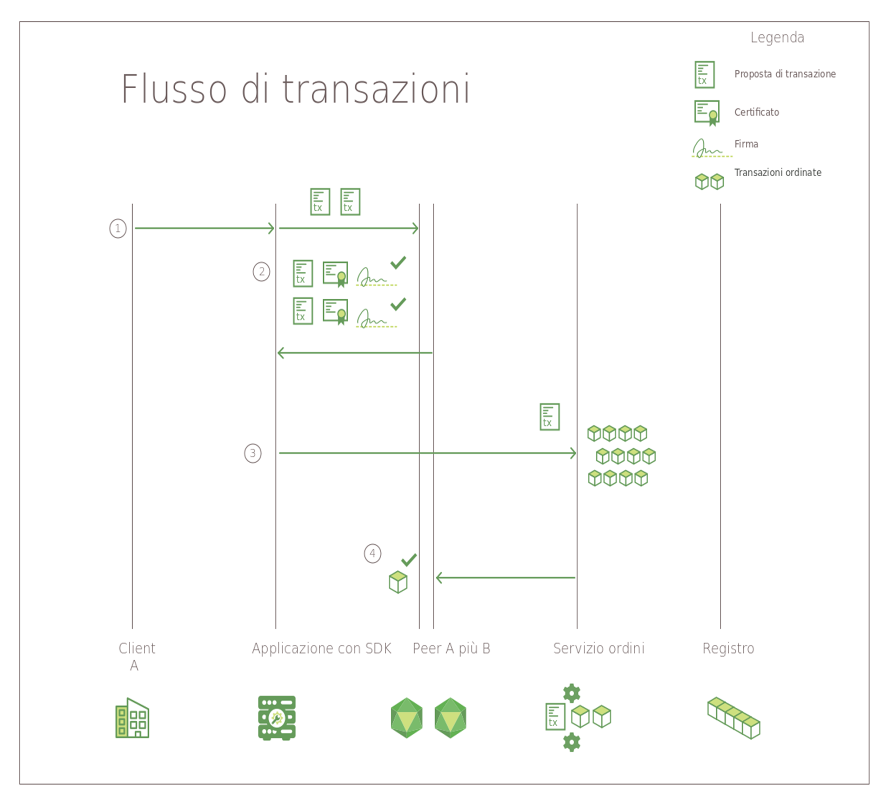

---

copyright:
  years: 2017, 2018
lastupdated: "2018-08-31"
---

{:new_window: target="_blank"}
{:shortdesc: .shortdesc}
{:codeblock: .codeblock}
{:screen: .screen}
{:pre: .pre}

# Hyperledger Fabric

***[Questa pagina è utile? Faccelo sapere.](https://www.surveygizmo.com/s3/4501493/IBM-Blockchain-Documentation)***

La rete {{site.data.keyword.blockchainfull}} è sviluppata sullo stack Hyperledger Fabric, uno dei progetti blockchain nell'ambito del progetto Hyperledger della Linux Foundation.  Si tratta di una rete "con autorizzazioni" in cui tutti gli utenti e i componenti hanno delle identità note.  Una logica di firma/verifica è implementata a ogni punto di contatto delle comunicazioni e le transazioni sono consentite tramite una serie di controlli di approvazione e di convalida.  In tale senso, è molto diversa dalle implementazioni blockchain tradizionali che promuovono l'anonimato e sono costrette a fare affidamento sulle criptovalute e su pesanti obblighi di elaborazione per convalidare le transazioni.  
{:shortdesc}

Hyperledger Fabric offre un'architettura modulare per estendere la scalabilità e le prestazioni.  Questo argomento introduce alcuni componenti chiave in Hyperledger Fabric.  Per un'introduzione completa a Hyperledger Fabric, consulta la [documentazione di Hyperledger Fabric ](http://hyperledger-fabric.readthedocs.io/en/release-1.1/){:new_window}.  

## CA (Certificate Authority - Autorità di certificazione)  
Come piattaforma per le reti blockchain **con autorizzazioni**, Hyperledger Fabric include un componente Autorità di certificazione (CA, **Certificate Authority)** per gestire le identità di rete di tutte le organizzazioni membro e dei loro utenti. Il requisito di un'identità con autorizzazioni per ogni utente consente un controllo basato su ACL sull'attività di rete e garantisce che ogni transazione sia alla fine tracciabile a un utente registrato.  
* La CA (Fabric CA per impostazione predefinita) emette un certificato root (**rootCert**) per ciascun **membro** (organizzazione o individuo) che è autorizzato ad aderire alla rete.
* La CA emette anche un certificato di registrazione (**eCert**) per ciascun componente membro, per le applicazioni lato server e, di tanto in tanto, per gli utenti.
* A ogni utente registrato viene anche concessa un'allocazione di certificati di transazione (**tCerts**).  Ogni **tCert** autorizza una singola transazione di rete.

Questo controllo basato sul certificato sull'adesione alla rete e sulle azioni consente ai membri di limitare l'accesso a canali, applicazioni e dati privati e confidenziali, in base a specifiche identità utente.

Per ulteriori informazioni sul componente Certificate Authority di Hyperledger Fabric, vedi il manuale [Fabric CA User’s Guide ](https://hyperledger-fabric-ca.readthedocs.io/en/release-1.1/){:new_window}.

## Membership Service Provider  
Hyperledger Fabric include un componente **MSP (Membership Service Provider)** per offrire un'astrazione di tutti i protocolli e i meccanismi crittografici dietro all'emissione e alla convalida di certificati e autenticazione utente.  L'MSP è installato su ciascun peer del canale per garantire che le richieste di transazione emesse al peer abbiano origine da un'identità utente autenticata e autorizzata.

Per ulteriori informazioni sul componente MSP (Membership Services Provider) di Hyperledger Fabric, vedi *[Membership Service Providers (MSP) ](http://hyperledger-fabric.readthedocs.io/en/release-1.1/msp.html){:new_window}* nella [documentazione di Hyperledger Fabric](http://hyperledger-fabric.readthedocs.io/en/release-1.1/){:new_window}.

## Flusso di transazioni  
Per garantire la congruenza e l'integrità dei dati, Hyperledger Fabric implementa molteplici punti di controllo lungo il flusso delle transazioni, compresi l'autenticazione client, l'approvazione, gli ordini e l'esecuzione del commit nel libro mastro.

La **Figura 1** illustra il flusso delle transazioni su una rete blockchain Hyperledger Fabric:

*Figura 1. Flusso di transazioni su una rete Hyperledger Fabric*

Su una rete Hyperledger Fabric, il flusso di dati per le query e le transazioni è iniziato da un'applicazione lato client inoltrando una richiesta di transazione a un peer su un canale. Il flusso di dati iniziale attraverso la rete è comune sia alle query che alle transazioni:

1. Utilizzando la API `channel.SendTransactionProposal` disponibile nell'SDK, un'applicazione client firma e inoltra una proposta di transazione agli appropriati peer di approvazione sul canale specificato.  Questa proposta di transazione iniziale è una **richiesta** di approvazione.  
2. Ciascun peer sul canale verifica l'identità e l'autorizzazione del client che ha eseguito l'inoltro e (se valide) esegue il chaincode specificato sugli input forniti (chiave/valori).  In base ai risultati della transazione e alla politica di approvazione per il chaincode richiamato, ciascun peer restituisce una risposta affermativa (YES) o negativa (NO firmata all'applicazione.  Ogni risposta affermativa (YES) firmata è un'**approvazione** della transazione.

	A questo punto, nel flusso delle transazioni, il processo diverge per le query e le transazioni.  Se la proposta ha richiamato una funzione query nel chaincode, l'applicazione restituisce i dati al client.  Se la proposta ha richiamato una funzione nel chaincode per aggiornare il libro mastro, l'applicazione continua con i seguenti passi:  
3. L'applicazione inoltra la transazione (insieme di lettura/scrittura e approvazioni) al **servizio ordini** della rete.  
4. La transazione viene quindi ritrasmessa all'argomento di partizione del canale nel cluster Kafka per gli ordini.  Tutti i peer del canale convalidano ciascuna transazione nel blocco applicando la politica di convalida specifica del chaincode ed eseguendo un Concurrency Control Version Check.  
	* Le transazioni che non superano il processo di convalida sono contrassegnate come non valide nel blocco e il blocco viene accodato all'hashchain del canale.  
	* Tutte le transazioni valide aggiornano il database dello stato in base alle coppie di chiave/valore modificate.  

Il **protocollo di diffusione dei dati gossip** trasmette in modo continuo dati del libro mastro sul canale per garantire dei libri mastri sincronizzati tra i peer.  Per ulteriori informazioni, vedi *[Gossip data dissemination protocol ](http://hyperledger-fabric.readthedocs.io/en/release-1.1/gossip.html){:new_window}* nella
[documentazione di Hyperledger Fabric ](http://hyperledger-fabric.readthedocs.io/en/release-1.1/){:new_window}.

Per un'introduzione dettagliata relativa al flusso delle transazioni, vedi *[Transaction Flow ](http://hyperledger-fabric.readthedocs.io/en/release-1.1/txflow.html){:new_window}* nella [documentazione di Hyperledger Fabric ](http://hyperledger-fabric.readthedocs.io/en/release-1.1/){:new_window}.  

## Servizio ordini
Hyperledger Fabric include un servizio basato su Kafka per ordinare e trasmettere le transazioni di rete. Kafka fornisce anche una tolleranza di errori anomali alla tua rete, il che significa che, se un numero accettato di nodi di servizio ordini non è disponibile, il servizio continua a ordinare e distribuire blocchi di transazioni ai peer del canale.

Le applicazioni lato client richiamano la API 'channel.sendTransaction' per inoltrare le transazioni approvate al servizio ordini. I nodi del servizio ordini usano quindi il servizio Kafka, e il suo server ZooKeeper associato, per ordinare le transazioni in un blocco. Il blocco di transazioni ordinato viene infine "consegnato" ai peer del canale, per la convalida e l'esecuzione del commit nel libro mastro.

I nodi del servizio ordini forniscono anche i seguenti servizi:
1. Autenticazione dei client
2. Manutenzione di una catena di sistemi che definisce le configurazioni del servizio ordini, i certificati root e gli ID MSP per le organizzazioni autenticate e un raggruppamento di profili che contiene i diversi consorzi all'interno della rete.
3. Filtraggio e convalida per le transazioni di configurazione che riconfigurano o creano un canale.  

Per ulteriori informazioni sul servizio ordini Hyperledger Fabric, vedi *[Bringing up a Kafka-based Ordering Service ](http://hyperledger-fabric.readthedocs.io/en/release-1.1/kafka.html){:new_window}* nella  [documentazione di Hyperledger Fabric ](http://hyperledger-fabric.readthedocs.io/en/release-1.1/){:new_window}.

## SDK HFC
Gli SDK HFC (Hyperledger Fabric Client) consentono agli sviluppatori di applicazioni di mettere a punto delle applicazioni che interagiscono con una rete blockchain. Gli SDK HFC facilitano la gestione del ciclo di canali e chaincode alle applicazioni.

Hyperledger Fabric offre l'SDK Node.js SDK e l'SDK Java e fornisce le seguenti funzioni per interagire con la rete blockchain:
* Registrare e iscrivere utenti
* Creare canali
* Unire i peer a un canale
* Aggiornare la configurazione del canale sistemi o del canale applicazioni
* Installare il chaincode sui peer
* Istanziare il chaincode su un canale
* Eseguire l'upgrade del chaincode su un canale
* Richiamare le funzioni chaincode per aggiornare il libro mastro
* Eseguire query del libro mastro per transazioni, blocchi o chiavi specifici
* Monitorare gli eventi su un canale (ad esempio, la corretta esecuzione del commit di una transazione)

Per ulteriori informazioni sugli SDK HFC, vedi *[Hyperledger Fabric SDKs ](http://hyperledger-fabric.readthedocs.io/en/release-1.1/fabric-sdks.html){:new_window}* nella [documentazione di Hyperledger Fabric ](http://hyperledger-fabric.readthedocs.io/en/release-1.1/){:new_window}.
