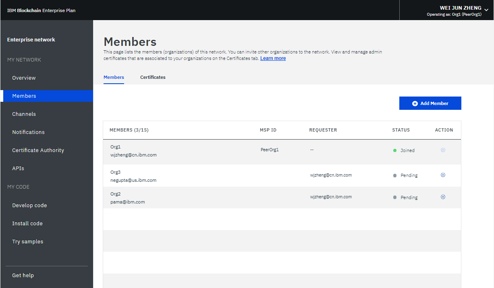
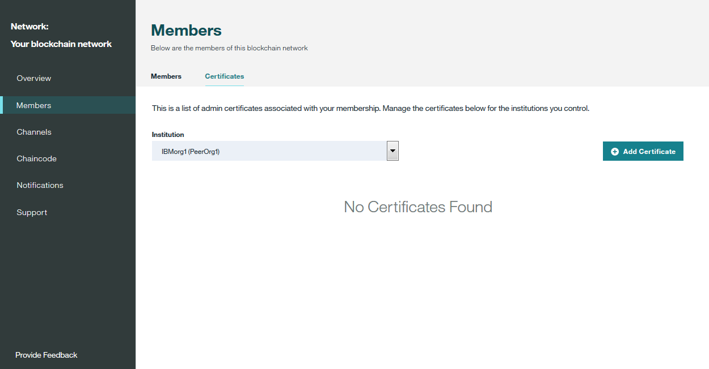
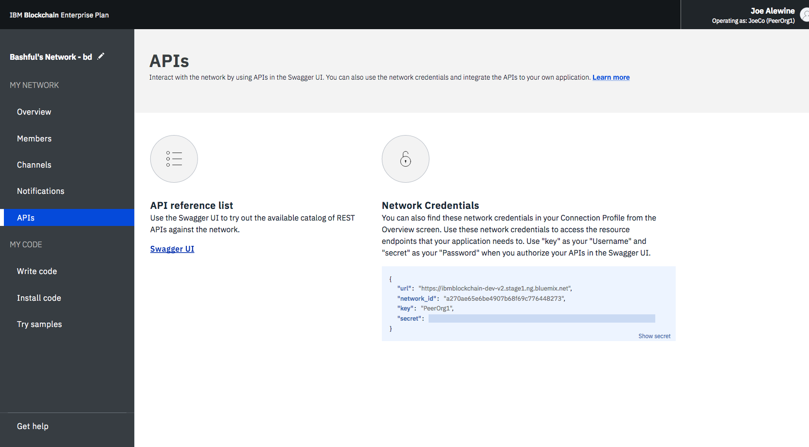

---

copyright:
  years: 2017, 2018
lastupdated: "2018-08-31"

---

{:new_window: target="_blank"}
{:shortdesc: .shortdesc}
{:codeblock: .codeblock}
{:screen: .screen}
{:pre: .pre}

# Gestione della rete piano Enterprise
{: #v10_dashboard}

***[Questa pagina è utile? Faccelo sapere.](https://www.surveygizmo.com/s3/4501493/IBM-Blockchain-Documentation)***

{{site.data.keyword.blockchainfull}} Platform offre un Monitoraggio della rete per fornire una panoramica del tuo ambiente blockchain, compresi risorse di rete, membri, canali oggetto di adesione, dati delle prestazioni delle transazioni e il chaincode distribuito. Il Monitoraggio della rete ti offre anche l'entry point per eseguire le API Swagger, sviluppare una rete con {{site.data.keyword.blockchainfull_notm}} Platform: Develop e provare le applicazioni di esempio.
{:shortdesc}

Puoi [modificare il nome della tua rete piano Enterprise](#ep-network-name) nel Monitoraggio della rete.

Il Monitoraggio della rete presenta le seguenti schermate in tre sezioni. Puoi passare a ciascuna schermata dal navigator a sinistra nel Monitoraggio della rete.
- La sezione **La mia rete** contiene le schermate "[Panoramica](#overview)", "[Membri](#members)", "[Canali](#channels)", "[Notifiche](#notifications)", "[CA (Certificate Authority)](#ca)" e "[API](#apis)".
- La sezione **Il mio codice** contiene le schermate "[Sviluppa il codice](#write_code)", "[Installa il codice](#chaincode)" e "[Prova gli esempi](#samples)".
- La schermata "[Richiedi assistenza](#support)" mostra le informazioni di supporto e le note di rilascio per Helios e Hyperledger Fabric (la base di codice su cui è basato {{site.data.keyword.blockchainfull_notm}} Platform).

Puoi [controllare e configurare le preferenze di rete](#network-preferences) dal menu a discesa in alto a destra di Monitoraggio della rete.

Questa esercitazione descrive ciascuna delle schermate e delle funzioni di cui sopra.

## Aggiorna il nome della rete
{: #ep-network-name}

Quando crei un rete piano Enterprise, {{site.data.keyword.blockchainfull_notm}} Platform assegna un nome alla tua rete. Tuttavia, puoi aggiornare questo nome di rete in qualsiasi momento nel tuo Monitoraggio della rete.

Nella parte superiore del navigatore di sinistra in Monitoraggio della rete, fai clic sul nome della rete e il campo diventa modificabile. Immetti il nuovo nome della rete che vuoi utilizzare e premi il tasto **Enter**. Il tuo nome della rete sarà aggiornato in pochi secondi.

**Figura 1** mostra i passi per aggiornare il nome della rete piano Starter e il nome assegnato a "piano Starter Network".

*Figura 1. Aggiorna il nome della rete*

## Panoramica
{: #overview}

Lo schermo "Panoramica" visualizza le informazioni sullo stato in tempo reale relative alle risorse blockchain, compresi l'ordinante, la CA e i nodi peer. Ogni risorsa viene visualizzata in quattro intestazioni distinte: **Tipo**, **Nome**, **Stato** e **Azioni**. Durante la creazione della tua rete blockchain, vengono automaticamente creati tre nodi ordinante e due nodi CA. Le CA sono specifiche per i membri, mentre i nodi di ordine sono endpoint comuni condivisi nella rete.

**Figura 2** mostra la schermata "Panoramica":

*Figura 2. Panoramica della rete*

### Azioni dei nodi
L'intestazione **Azioni** della tabella fornisce i pulsanti per avviare o arrestare le tue risorse. Puoi anche avviare o arrestare un gruppo di nodi selezionando più nodi e facendo quindi clic sul pulsante **Avvia selezionato** o **Arresta selezionato**. Il pulsante **Avvia selezionato** o quello **Arresta selezionato** sono visualizzati sopra la tabella quando selezioni uno o più nodi.

Nota che le azioni Stop e Start non sono disponibili per un nodo Orderer. In generale, non è necessario arrestare e avviare i nodi Peer o CA su una rete. Le azioni Stop e Start sono fornite nel caso in cui tu abbia bisogno di riavviare un peer, ad esempio per attivarlo in uno stato pulito.

Puoi anche controllare i log componenti facendo clic su **Visualizza log** dall'elenco a discesa sotto l'intestazione **Azioni**. I log presentano le chiamate tra le diverse risorse di rete e sono utili per il debug e la risoluzione dei problemi. Fai una prova, ad esempio, arrestando un peer e provando a sceglierlo come obiettivo di una transazione; vedrai degli errori di connettività. Quando riavvii il peer e tenti nuovamente la transazione, vedrai una connessione stabilita correttamente. Puoi anche
lasciare inattivo il peer per un periodo di tempo prolungato mentre i tuoi canali continuano a interagire con il libro mastro. Quando il peer viene riattivato, noterai una sincronizzazione del libro mastro poiché riceve i blocchi di cui era stato eseguito il commit mentre era inattivo. Dopo che il libro mastro sarà stato completamente sincronizzato, puoi eseguire su di esso richiami e query normali.

### Configurazione del peer remoto  

Se distribuisci un peer remoto al di fuori di {{site.data.keyword.cloud_notm}}, devi fornire le informazioni sull'endpoint API della tua rete al peer remoto durante la configurazione. Fai clic sul pulsante **Configurazione peer remoto** per richiamare le informazioni sull'endpoint API della rete per configurare il tuo peer remoto. La finestra a comparsa fornisce le informazioni sull'endpoint API di ID rete, MSP organizzazione, nome CA, URL CA e certificato TLS CA. Puoi fare clic sull'icona di copia alla fine di ogni campo per copiare il valore di tale campo o fare clic sul pulsante **Scarica** per salvare i valori di tutti i campi in un file JSON. Per ulteriori informazioni sui peer remoti, vedi [Informazioni sui peer remoti](howto/remote_peer.html).

### Profilo connessione
{: #enterprise-connection-profile}
Puoi visualizzare il file JSON relativo alle informazioni di rete di basso livello di ciascuna risorsa facendo clic sul pulsante **Profilo connessione**. Il profilo di connessione contiene tutte le informazioni di configurazione di cui hai bisogno per un'applicazione. Tuttavia, poiché questo file contiene solo gli indirizzi per i tuoi specifici componenti e l'ordinante, se hai bisogno di avere come obiettivo ulteriori peer devi ottenere i loro endpoint. L'intestazione che contiene "url" visualizza l'endpoint API di ciascun componente. Questi endpoint sono necessari per
avere come obiettivo specifici componenti di rete da un'applicazione lato client e le loro definizioni si trovano solitamente
in un file di configurazione di tipo JSON che accompagna l'applicazione. Se stai personalizzando un'applicazione che richiede l'approvazione da peer che non fanno parte della tua organizzazione, dovrai recuperare gli indirizzi IP di questi peer dagli operatori pertinenti in un'operazione fuori banda. I client devono riuscire a connettersi a
un qualsiasi peer da cui necessitano di una risposta.

### Aggiungi peer
{: #peers}
Fai clic sul pulsante **Aggiungi peer** per aggiungere dei nodi peer alla tua rete. In piano Starter, due peer verranno aggiunti automaticamente per te quando viene creata la rete. In piano Enterprise, puoi aggiungere nodi peer per la prima volta quando crei una rete o aderisci a essa oppure in un secondo momento nel Monitoraggio della rete. Potresti trovarti in scenari differenti in cui hai bisogno di più peer.  Ad esempio, potresti volere più peer che si uniscono allo stesso canale per la ridondanza. Ogni peer elabora le transazioni del canale e scrive nelle loro rispettive copie nel libro mastro. In caso di malfunzionamento di uno dei peer, gli altri peer possono continuare ad elaborare transazioni e richieste dell'applicazione.  Potresti bilanciare simmetricamente il carico di tutte le richieste di applicazione tra i peer o potresti indicare come obiettivo peer differenti per funzioni differenti. Puoi ad esempio usare un peer per eseguire query del libro mastro e utilizzare un altro peer per elaborare le approvazioni per gli aggiornamenti del libro mastro.

  Nel pannello "Aggiungi peer" a comparsa, seleziona il numero di nodi peer che vuoi aggiungere.<!--Currently only "small" peers are available for purchase, however there will eventually be "medium" and "large" to help accommodate larger workloads and higher transaction throughput.-->

## Membri
{: #members}
La schermata "Membri" contiene due schede per visualizzare le informazioni sui membri della rete nella scheda "Membri" e le informazioni sui certificati nella scheda "Certificati".

### Membri
{: #members_tab}
La **Figura 3** mostra la schermata "Membri" iniziale che visualizza i membri della tua rete nella scheda "Membri":

*Figura 3. Membri della rete*

Oltre ai membri che inviti quando crei la rete, puoi invitare altri membri nella scheda "Membri". Per invitare un membro alla tua rete, immettere il nome dell'istituzione e l'indirizzo email dell'operatore e fai clic su **Aggiungi membro**. Una rete può avere un totale di 15 membri (compreso l'iniziatore della rete). Per rimuovere un membro dalla tua rete, fai clic sul simbolo di "rimozione" alla fine della riga del membro.

### Certificati
La **Figura 4** mostra la schermata "Membri" iniziale che visualizza i certificati dei membri nella scheda "Certificati":

*Figura 4. Certificati*

Gli operatori possono gestire i certificati per i membri nella stessa istituzione nella scheda "Certificati". Fai clic su **Aggiungi certificato** per aprire il pannello "Aggiungi certificato". Dai un nome al tuo certificato, incolla i certificati lato client in formato PEM nel campo "Chiave" e fai clic su **Invia**. Devi riavviare i peer prima che i certificati lato client possano diventare effettivi.
<!--
For more information about generating your certificate key, see [Generating the client-side certificates](v10_application.html#generating-the-client-side-certificates).-->

## Canali
{: #channels}

Puoi suddividere la tua rete in canali, dove ogni canale rappresenta un sottoinsieme di membri autorizzati a visualizzare i dati per il chaincode istanziato su tale canale. Ogni rete deve avere almeno un canale perché le transazioni possano avere luogo. Ogni canale ha un libro mastro univoco e gli utenti devono essere correttamente autenticati per effettuare operazioni di lettura/scrittura su questo libro mastro. Se non ti trovi su un canale, non puoi vedere alcun dato.

La **Figura 5** mostra la schermata dashboard iniziale che visualizza una panoramica di tutti i canali nella tua rete:

*Figura 5. Canali*

La creazione di un canale comporta la generazione di un libro mastro specifico per il canale. Per ulteriori informazioni, vedi [Creazione di un canale](howto/create_channel.html).

Puoi anche selezionare un canale esistente per visualizzare dei dettagli più precisi sul canale, l'adesione e il chaincode attivo. Per ulteriori informazioni, vedi [Monitoraggio di una rete](howto/monitor_network.html).

## Notifiche
{: #notifications}

Puoi gestire le richieste in sospeso e visualizzare le richieste completate nella schermata "Notifiche".

La **Figura 6** mostra la schermata "Notifiche":

*Figura 6. Notifiche*

Quando crei un canale o viene invitato a un nuovo canale, nel Monitoraggio della rete comparirà una notifica.

Le richieste sono raggruppate nelle sottoschede "Tutti", "In sospeso" e "Completato". I numeri dopo l'intestazione della sottoscheda indicano il numero di richieste in ciascuna sottoscheda.
   * Puoi trovare tutte le tue richieste nella sottoscheda "Tutti".
   * Le richieste che non hai accettato o rifiutato, o che non hai visualizzato, sono nella sottoscheda "In sospeso". Fai clic sul pulsante **Esamina richiesta** per visualizzare la richiesta, che include la politica e i membri del canale e lo stato di voto. Se sei un operatore del canale, puoi accettare **Accetta** o declinare **Rifiuta** la richiesta o gestirla in un altro momento facendo clic su **Più tardi**. Se la richiesta viene accettata da un numero sufficiente di operatori del canale, puoi fare clic su **Invia richiesta** per attivare l'aggiornamento del canale.
   * Una richiesta inoltrata sarà visualizzata nella sottoscheda "Completato".  Puoi fare clic su **Esamina richiesta** per visualizzarne i dettagli.

Quando hai un lungo elenco di richieste, puoi cercare una richiesta nel campo di ricerca in alto.

Le richieste in sospeso possono essere eliminate selezionando le caselle davanti a esse e facendo clic su **Elimina richiesta**. Nota: una richiesta completata non può essere eliminata.

## CA (Certificate Authority - Autorità di certificazione)
{: #ca}

La tabella nella schermata "CA (Certificate Authority)" visualizza tutte le identità che sono state registrate con la tua organizzazione, tra cui l'amministratore, i peer e le applicazioni client. Puoi utilizzare questa schermata anche per registrare una nuova identità.

La **Figura 7** mostra la schermata "CA (Certificate Authority)":

")
*Figura 7. CA (Certificate Authority)*

Fai clic sul pulsante **Genera certificato** per ottenere un nuovo certificato pubblico e una nuova chiave privata dalla tua CA. Questo pannello può essere utilizzato come metodo alternativo per [generare una coppia di chiavi pubblica e privata](v10_application.html#register-app) per un'applicazione client che utilizza l'SDK Fabric. Il campo **Certificato** contiene il tuo certificato pubblico, indicato anche signCert o certificato di registrazione, appena sopra la tua **Chiave privata**. Puoi fare clic sull'icona di copia alla fine di ogni campo per copiare il valore. **Nota** che {{site.data.keyword.blockchainfull_notm}} Platform non memorizza questi certificati. Devi salvarli e memorizzarli in modo sicuro. Per ulteriori dettagli, fai riferimento a queste [informazioni MSP](certificates.html#msp).

Fai clic sul pulsante **Aggiungi utente** per registrare una nuova identità nella tua organizzazione. Nella finestra a comparsa **Aggiungi utente**, compila i seguenti campi e fai quindi clic su **Invia**.
  - **ID:** questo sarà il nome della tua nuova identità, a volte indicato come `enroll ID`. **Salva questo valore** per quando configuri un peer remoto o registri una nuova applicazione.
  - **Segreto:** questa sarà la password per la tua identità, a volte indicata come `enroll Secret`.  **Salva questo valore** per quando configuri un peer remoto o registri una nuova applicazione.  
  - **Tipo:** seleziona il tipo di identità che vuoi registrare, peer o applicazione client. 
  - **Affiliazione:** questa sarà l'affiliazione all'interno della tua organizzazione, ad esempio `org1`, a cui appartiene l'identità.
  - **Registrazioni massime:** utilizza questo campo per limitare il numero di volte in cui puoi registrare o generare certificati utilizzando questa identità. Se lasci il campo vuoto, il valore predefinito è un numero illimitato di registrazioni.

Per ulteriori informazioni sulla tua CA, consulta l'esercitazione [Gestione dei certificati su {{site.data.keyword.blockchainfull_notm}} Platform](certificates.html).

## API
{: #apis}

{{site.data.keyword.blockchainfull_notm}} Platform presenta diverse API REST in Swagger che puoi utilizzare per gestire i nodi, i canali, i peer e i membri della tua rete. Le tue applicazioni possono utilizzare queste API per controllare importanti risorse di rete senza usare il Monitoraggio della rete.

La **Figura 8** mostra la schermata "API":

*Figura 8. API*

Fai clic sul link **IU Swagger** per aprire l'IU Swagger. Nota: prima di eseguire le API, devi autorizzare l'IU Swagger con le tue credenziali di rete (che sono disponibili in questa pagina delle API). Per ulteriori informazioni, vedi [Interazione con la rete utilizzando le API Swagger](howto/swagger_apis.html).

## Sviluppa il codice
{: #write-code}

Piano Enterprise integra {{site.data.keyword.blockchainfull_notm}} Platform: Develop e fornisce un ambiente di sviluppo con strumenti e tecnologie standard del settore. Puoi sviluppare la tua rete in un ambiente online oppure in locale. Dopo che hai sviluppato una rete, puoi distribuirla nuovamente alla tua rete piano Enterprise.

La **Figura 9** mostra la schermata "Sviluppa il codice":

*Figura 9. Sviluppa il codice*

Per ulteriori informazioni sullo sviluppo e sulla distribuzione del tuo codice con piano Enterprise, vedi [Sviluppo di reti di business in piano Enterprise](develop_enterprise.html).

## Installa il codice
{: #chaincode}

Il chaincode, noto anche come "smart contract", è una parte di software che contiene una serie di funzioni per eseguire query e aggiornamenti del libro mastro. Vengono installati sui peer e istanziati su un canale.

La **Figura 10** mostra la schermata "Installa il codice":

*Figura 10. Installa il codice*

Un chaincode viene prima installato sul file system di un peer e viene quindi istanziato su un canale. Per ulteriori informazioni, vedi [Installazione, istanziazione e aggiornamento di un chaincode](howto/install_instantiate_chaincode.html).

## Prova gli esempi
{: #samples}

Le applicazioni di esempio ti aiutano ad ottenere una migliore comprensione della rete blockchain e dello sviluppo di applicazioni. Segui i link **Visualizza in GitHub** per apprendere in che modo usare gli esempi e distribuirli a {{site.data.keyword.blockchainfull_notm}} Platform. Per ulteriori informazioni su come sviluppare e distribuire i tuoi esempi, consulta [Distribuzione di applicazioni di esempio](howto/prebuilt_samples.html).

La **Figura 11** mostra la schermata "Prova gli esempi":

*Figura 11. Esempi*

## Richiedi assistenza
{: #support}

La schermata "Richiedi assistenza" contiene due schede per fornire le informazioni di supporto nella scheda "Supporto" e per descrivere le funzioni nuove e modificate di ciascuna release nella scheda "Note sulla release".

La **Figura 12** mostra la schermata "Supporto" iniziale che visualizza le informazioni di supporto nella scheda "Supporto":

*Figura 12. Supporto Blockchain*

### Risorse blockchain e forum di supporto
{: #support-forums}

Utilizza i link e le risorse in questa pagina per accedere ai forum di supporto e risoluzione dei problemi.

* [{{site.data.keyword.blockchainfull_notm}} Service docs](index.html) in **Introduzione**, che è il sito della documentazione, fornisce istruzioni introduttive a {{site.data.keyword.blockchainfull}} Platform su {{site.data.keyword.Bluemix_notm}}. Puoi trovare gli argomenti corrispondenti dal navigator a sinistra oppure cercare qualsiasi termine con la funzione di ricerca in alto.
* [IBM Code ](https://developer.ibm.com/code/technologies/blockchain/) contiene modelli di codice e informazioni per gli sviluppatori.
* [IBM dWAnswers ](https://developer.ibm.com/answers/smartspace/blockchain/) in **Ticket di supporto** funge da piattaforma per domande e risposte. Puoi cercare risposte dalle domande fatte in precedenza o inoltrare una nuova domanda. Assicurati di includere **blockchain** nella domanda.
  Puoi anche inoltrare un ticket al team di supporto {{site.data.keyword.blockchainfull_notm}} con l'opzione **Open an {{site.data.keyword.Bluemix_notm}} support ticket**.  Condividi dettagli e frammenti di codice dalla tua istanza specifica {{site.data.keyword.Bluemix_notm}}.
* [Le applicazioni di esempio ](https://github.com/ibm-blockchain) in **Blockchain sample applications** forniscono assistenza e frammenti di codice di esempio per agevolare lo sviluppo di applicazioni.
* [Hyperledger Fabric ](https://hyperledger-fabric.readthedocs.io/en/release-1.1/) e la [community Hyperledger Fabric ](http://jira.hyperledger.org/secure/Dashboard.jspa) in **Hyperledger Fabric** forniscono ulteriori dettagli sullo stack Hyperledger Fabric. Parla a un [esperto di Hyperledger ](https://chat.hyperledger.org/channel/general) se hai delle domande sul codice Hyperledger Fabric.
* [{{site.data.keyword.blockchainfull_notm}} Platform: Develop ](https://ibm-blockchain.github.io/develop/) in **Hyperledger Composer** fornisce ulteriori dettagli su Hyperledger Composer, ossia {{site.data.keyword.blockchainfull_notm}} Platform: Develop. Puoi anche trovare risposte o fare domande nella [community di Hyperledger Composer ](https://chat.hyperledger.org/channel/general) e in [StackOverflow ](https://stackoverflow.com/questions/tagged/hyperledger-composer).

Se non riesci a eseguire il debug del tuo problema o a trovare una risposta alla tua domanda, inoltra un caso di supporto nel portale del servizio {{site.data.keyword.cloud_notm}}. Per ulteriori informazioni, vedi [Richiesta di assistenza tecnica](ibmblockchain_support.html).

La **Figura 13** e la **Figura 14** mostrano la schermata "Richiedi assistenza" iniziale che visualizza le funzioni nuove e modificate di ciascuna release nella scheda "Note sulla release":

*Figura 13. Note sulla release per l'IU di monitoraggio della rete*

*Figura 14. Note di release per Fabric*

## Preferenze della rete
{: #network-preferences}

Fai clic sull'angolo superiore destro e apri il menu a discesa e poi **Preferenze della rete**. Viene aperta la finestra Preferenze della rete. La finestra Preferenze della rete mostra le informazioni di base della tua rete, come il nome della rete, la versione Fabric, l'ubicazione della rete in {{site.data.keyword.cloud_notm}} e il tipo di database dello stato.

Le reti piano Enterprise create dopo il 15 maggio 2018 verranno eseguite su Hyperledger Fabric v1.1. Se crei le reti dopo l'upgrade, puoi inoltre gestire il timeout di inattività web e il TLS reciproco per la tua rete nella finestra delle preferenze di rete. Queste impostazioni possono essere modificate solo dall'iniziatore della rete.

### Timeout di inattività web
{: #web-inactivity-timeout}

**Nota**: solo l'**iniziatore della rete** può modificare l'impostazione del timeout di inattività web. Questa è un'impostazione al livello della rete e interesserà tutti i membri della rete.

Il timeout di inattività web è impostato su **Off** per impostazione predefinita. Se modifichi il timeout di inattività della rete con **On** tutti i membri della rete saranno disconnessi dopo 10 minuti di inattività. Quando il timer di inattività web raggiunge i 10 minuti, la funzione di timeout di inattività web termina le sessioni web inattive per garantire la sicurezza dell'account del membro della rete. Facendo clic su un link o aggiornando il Monitoraggio della rete si reimposta il timer di inattività web. Prima del raggiungimento dei 10 minuti, il chiudere la finestra o la scheda del browser termina la sessione web.

### TLS reciproco
{: #mutual-tls}

Il TLS reciproco protegge le comunicazioni tra la tua applicazione e la tua rete.

**Nota**: solo un **iniziatore della rete** può abilitare o disabilitare il TLS reciproco. Questa è un'impostazione al livello della rete e interesserà tutti i membri della rete.

Il pulsante TLS reciproco è impostato su **Off** per impostazione predefinita. Se abiliti il TLS reciproco, devi aggiornare le tue applicazioni per supportare questa funzione. Altrimenti, le tue applicazioni non saranno in grado di comunicare con la tua rete.

Per una rete del piano Fabric 1.1 Enterprise, ogni organizzazione ha la propria autorità di certificazione (CA) del TLS reciproco. Le informazioni necessarie per il collegamento alla CA del TLS reciproco sono disponibili nel [profilo di connessione ](##enterprise-connection-profile) accessibile dalla tua schermata **Panoramica** nel Monitoraggio della rete facendo clic sul pulsante **Profilo connessione**.  Il profilo di connessione contiene le informazioni necessarie per il collegamento al CA e sull'ottenimento dei certificati di cui hai bisogno per collegarti alla tua rete.

Nel profilo di connessione, individua la sezione `certificateAuthorities` dove troverai i seguenti attributi necessari per registrare ed ottenere i certificati per comunicare con la tua rete utilizzando il TLS reciproco.

- `url`: l'URL per il collegamento alla CA che può fornire i certificati del TLS reciproco
- `enrollId`: l'ID di registrazione da utilizzare per ottenere un certificato
- `enrollSecret`: il segreto di registrazione da utilizzare per ottenere un certificato
- `x-tlsCAName`: il nome CA da utilizzare per ottenere il certificato che consentirà all'applicazione di comunicare con il TLS reciproco.

Per ulteriori informazioni sull'aggiornamento delle tue applicazioni in modo che supportino il TLS reciproco, vedi [How to configure mutual TLS ](https://fabric-sdk-node.github.io/tutorial-mutual-tls.html)

<!--

### CouchDB state database
{: #couchdb}

**Note**: Only the **network initiator** can switch the state database from LevelDB to CouchDB. This is a network level setting and will affect all network members. Switching to CouchDB is permanent. You cannot revert back to LevelDB.

Before Enterprise Plan upgrades to Fabric v1.1, all network peers store data in the pure key-value LevelDB. With Fabric v1.1, you can choose to use CouchDB as your state database. CouchDB is a document datastore that permits indexing the contents of your data and allows you to issue rich queries against the data on your peer. Note that Hyperledger Fabric does not support peers running different databases. If CouchDB is used, it must be used by all of the peers.

To use CouchDB, your data must be stored in a data format that can be modeled in chaincode, such as JSON. If the decision is made to migrate from LevelDB to CouchDB, the {{site.data.keyword.blockchainfull_notm}} Platform will migrate your data from key-value format to the CouchDB format automatically.

If you switch to CouchDB, you need to update your chaincode to take advantage of indexes and rich queries. For more information about CouchDB and how to set up index, see [CouchDB as the State Database ](https://hyperledger-fabric.readthedocs.io/en/latest/couchdb_as_state_database.html) in the Hyperledger Fabric documentation. You can also find an example that uses an index with chaincode in this [Fabric tutorial](https://hyperledger-fabric.readthedocs.io/en/release-1.2/couchdb_tutorial.html){:new_window}. For more information about updating chaincode in {{site.data.keyword.blockchainfull_notm}} Platform, see [Updating a chaincode](howto/install_instantiate_chaincode.html#updating-a-chaincode).

-->

La **Figura 15** mostra la finestra "Preferenze della rete":

*Figura 15. Preferenze della rete*
