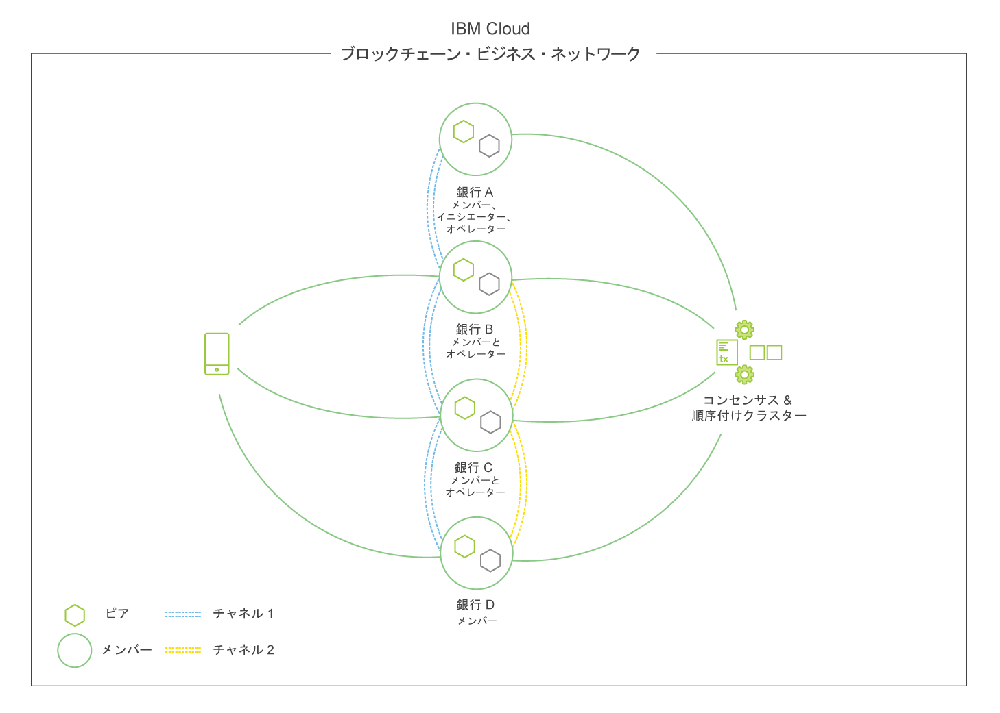

---

copyright:
  years: 2018, 2019
lastupdated: "2019-02-11"

---

{:new_window: target="_blank"}
{:shortdesc: .shortdesc}
{:screen: .screen}
{:codeblock: .codeblock}
{:note: .note}
{:important: .important}
{:tip: .tip}
{:pre: .pre}

# ブロックチェーン・コンポーネントの概要
{: #blockchain-component-overview}

{{site.data.keyword.blockchainfull}} Platform のコンポーネントと構造は、{{site.data.keyword.IBM_notm}} が大きく貢献しているオープン・ソースの許可制ブロックチェーン・ソリューションである [Hyperledger Fabric ](https://hyperledger-fabric.readthedocs.io/en/release-1.2/) の基礎となるインフラストラクチャーおよびツールに基づいています。 Fabric に基づくネットワークには、いくつかの標準コンポーネントが含まれており、それらはさまざまなユース・ケースをサポートする多数の構成にデプロイできます。

Fabric ネットワークのより包括的な説明、およびその構成コンポーネントの相互関係については、Fabric コミュニティー資料の[ブロックチェーン・ネットワークの構造についてのこの資料](https://hyperledger-fabric.readthedocs.io/en/release-1.2/network/network.html)を確認してください。ここでは、ネットワークをどのように開始して拡張できるかが説明されています。

Fabric に基づくネットワークのコンポーネントの概要については、以下のビデオを確認してください。

<iframe class="embed-responsive-item" id="youtubeplayer" title="スターター・プランのビデオ" type="text/html" width="640" height="390" src="https://www.youtube.com/embed/sJaT2L99BUo" frameborder="0" webkitallowfullscreen mozallowfullscreen allowfullscreen> </iframe>

*このビデオでは、スターター・ネットワークおよびエンタープライズ・ネットワークの観点からコンポーネントに焦点を当てていますが、情報は {{site.data.keyword.cloud_notm}} Private 上の {{site.data.keyword.blockchainfull_notm}} Platform のカスタマー管理ソリューションに大いに関連しています。*

この概要では、認証局 (CA)、順序付けプログラム、ピア、スマート・コントラクト、およびアプリケーションにのみ焦点を当てます。 [{{site.data.keyword.blockchainfull_notm}} Platform 2.0 ネットワーク構築ガイド](/docs/services/blockchain/howto/ibp-console-build-network.html#ibp-console-build-network)および [{{site.data.keyword.blockchainfull_notm}} Platform for {{site.data.keyword.cloud_notm}} Private デプロイメント・ガイド](/docs/services/blockchain/ibp_for_icp_deployment_guide.html#get-started-icp)のトピックからわかるように、この順序は無意味な順序ではなく、Fabric ベースのネットワークのコンポーネントをデプロイする順序を表しています。

## 認証局
{: #blockchain-component-overview-ca}

Fabric に基づくブロックチェーン・ネットワークの基礎となるのは、ID と許可です。 ID は、CA が発行する x.509 証明書の形式を取り、誰かを*識別する* という点でクレジット・カードと類似しています。ID には属性を含めることができます。 これらの証明書は、コンポーネント・レベルまたはチャネル・レベルで MSP フォルダーに含められることによって、許可にリンクされます。 したがって、例えば、ピア MSP に **admins** という MSP サブフォルダーがあるとします。 その管理フォルダー内に証明書があるユーザーは、ピアの管理者である、つまり、そのピアの管理者が実行を許可されているアクションを実行できることを意味します。 ピア内部の検証システムでは、署名証明書によって識別されるユーザーが管理アクションを実行しようとするたびに検査が実行されます。 証明書が「admin」フォルダー内の証明書と一致するかどうか検査されます。 一致する場合は、アクションを実行できます。 そうでない場合は、アクションの実行要求は拒否されます。

{{site.data.keyword.blockchainfull_notm}} Platform CA は、[Hyperledger Fabric-CA ](https://hyperledger-fabric-ca.readthedocs.io/en/release-1.2/ "Hyperledger Fabric CA") をベースとしています。ただし、x.509 証明書に基づく PKI を使用している限り、他の CA も使用可能です。複数レベルの CA が存在する場合があり、通常は、そうあるべきです。 ネットワークの「ルート CA」は通常、「中間 CA」に証明書を提供する場合以外は公開されません。中間 CA は、証明書をユーザーおよびコンポーネントに直接発行したり、さらに多くの中間 CA 層に発行したりします。 認証局を使用して ID およびメンバーシップを確立する方法について詳しくは、[ID についての Hyperledger Fabric の資料 ](https://hyperledger-fabric.readthedocs.io/en/release-1.2/identity/identity.html) および[メンバーシップについての資料 ](https://hyperledger-fabric.readthedocs.io/en/release-1.2/membership/membership.html) を参照してください。

## 順序付けプログラム
{: #blockchain-component-overview-orderer}

順序付けサービスはよくネットワークの「心臓」と呼ばれますが、その機能は実際には非常に単純です。ピアによって検証されたトランザクションを順序付けしてブロックに入れ、台帳に書き込むためにピアに戻すだけです。前のバージョンの Fabric では、この機能はピア内部に組み込まれていましたが、Fabric v1.0 からは、ピアのパフォーマンスを向上させ、フォーク状態を引き起こす異常を回避するために、別個のコンポーネントとして切り離されました。

物理レベルでは、通常、この順序付け機能には一連の順序付けプログラム (まとめて「順序付けサービス」と呼ばれる) が必要ですが、テスト環境または POC 環境では単一ノード (SOLO 順序付けプログラムと呼ばれる) を使用できます。

## ピア
{: #blockchain-component-overview-peer}

物理レベルでは、ブロックチェーン・ネットワークは主にピア・ノード (または単にピア) で構成されます。 ピアは、台帳およびスマート・コントラクト ([「チェーンコード」](https://hyperledger-fabric.readthedocs.io/en/release-1.4/developapps/chaincodenamespace.html "Chaincode namespace") に含まれています) をホストするので、ネットワークの基本的な要素です。より正確に表現すると、ピアは台帳の**インスタンス**およびスマート・コントラクトの**インスタンス**をホストします。 スマート・コントラクトおよび台帳は、ネットワーク内でそれぞれ、共有プロセスおよび共有情報をカプセル化するために使用されるので、ピアのこのような側面は、Fabric ネットワークが実際にどのように機能しているかを理解する良い開始点となります。

ピアについて詳しくは、Fabric コミュニティー資料の[ピアにのみ焦点を当てたこの資料 ](https://hyperledger-fabric.readthedocs.io/en/release-1.2/peers/peers.html) を確認してください。

## チャネル
{: #blockchain-component-overview-channels}

チャネルとは、ネットワークのメンバー間にオープンな通信レイヤーを提供するメカニズムです。一部のメンバー間をつなぐチャネルを複数作成できるので、[プライバシーを実装するための多くのメカニズム ](https://developer.ibm.com/tutorials/cl-blockchain-private-confidential-transactions-hyperledger-fabric-zero-knowledge-proof/ "Private and confidential transactions with Hyperledger Fabric") のいずれかをサポートできます。ブロックチェーン・ネットワーク上のデータは、チャネル台帳に保管されます。チャネル台帳は、チャネルに参加している組織のピアでホストされます。チャネルおよびその使用方法について詳しくは、[Hyperledger Fabric の資料 ](https://hyperledger-fabric.readthedocs.io/en/release-1.2/channels.html) を参照してください。

## スマート・コントラクト
{: #blockchain-component-overview-smart-contracts}

企業が相互に取引を行う前には、ルールやプロセスについての共通理解に到達して、何らかの契約で規定される必要があります。 つまり、これらの契約によって、ビジネス・パートナー間のすべての相互作用を管理する「ビジネス・モデル」が示されます。

同様のニーズがブロックチェーン・ネットワークに存在します。これらのビジネス・モデルは業界用語で「スマート・コントラクト」と呼ばれ、Fabric および {{site.data.keyword.blockchainfull_notm}} Platform では、「チェーンコード」と呼ばれるより大規模な構造にこれらの契約が含まれます。これには、ビジネス・ロジックだけでなく、スマート・コントラクトの呼び出しを試行しているユーザーの ID を検証する基礎的なインフラストラクチャーも含まれています。

ビジネスの世界では、契約は署名されて法律事務所で保管されますが、スマート・コントラクトはピアにインストールされて、チャネルに「インスタンス化」されます。

## アプリケーション
{: #blockchain-component-overview-applications}

{{site.data.keyword.blockchainfull_notm}} Platform などの Fabric ベースのネットワーク内のクライアント・アプリケーションは、API、SDK、およびスマート・コントラクトなどの基礎となるインフラストラクチャーを活用して、高レベルの抽象化でクライアントの対話 (呼び出しおよび照会) を可能にします。

アプリケーションと Fabric ベースのネットワークの対話方法については、[初めてのアプリケーション作成のための資料 ](https://hyperledger-fabric.readthedocs.io/en/release-1.2/write_first_app.html "Writing Your First Application") を参照してください。また、この領域には Fabric v1.4 で大幅な改善が行われていますが、それらの改善機能を {{site.data.keyword.blockchainfull_notm}} Platform 2.0 で利用できる点にも注意してください。詳しくは、Hyperledger Fabric の[アプリケーションの開発 ](https://hyperledger-fabric.readthedocs.io/en/release-1.4/developapps/developing_applications.html "Developing Applications") に関するトピックを参照してください。Contract クラスなどの直接的な機能には、Fabric v1.2 (スターター・プランおよび {{site.data.keyword.blockchainfull_notm}} Platform for {{site.data.keyword.cloud_notm}} Private の現行バージョン) との互換性はありませんが、アプリケーション設計で考慮する価値がある概念的な情報や有用なヒントが含まれており、将来のための準備に役立ちます。

アプリケーションと Fabric ベースのネットワークの対話方法については、[アプリケーションの作成方法](/docs/services/blockchain/howto/ibp-console-create-app.html#ibp-console-app)に関する資料を参照してください。

## ネットワークの例
{: #blockchain-component-overview-example-network}

**図 1** は、デプロイ済みのブロックチェーン・ネットワークの例です。このネットワークは、4 つのメンバー (それぞれが 2 つのピアを所有)、暗号 ID マテリアルの配布を担当する認証局、ポリシーやネットワーク参加者を定義する順序付けサービスで構成されます。 青のチャネルには 4 つのネットワーク・メンバーがすべて含まれており、黄色のチャネルは 3 つのメンバー (B 銀行、C 銀行、D 銀行) のみに制限されています。また、A 銀行がネットワーク・イニシエーターの役割を果たしていること、黄色のチャネルのコンテキストでは D 銀行はメンバーとしてのみ存在していることが分かります。 正しい署名のある x509 証明書を保有しているエンド・ユーザーやアプリケーションは、ネットワーク上のピアに呼び出しを送信できます。

*図 1. データを分離するためにチャネルを利用する 4 つのメンバーが含まれるブロックチェーン・ネットワークの例*
