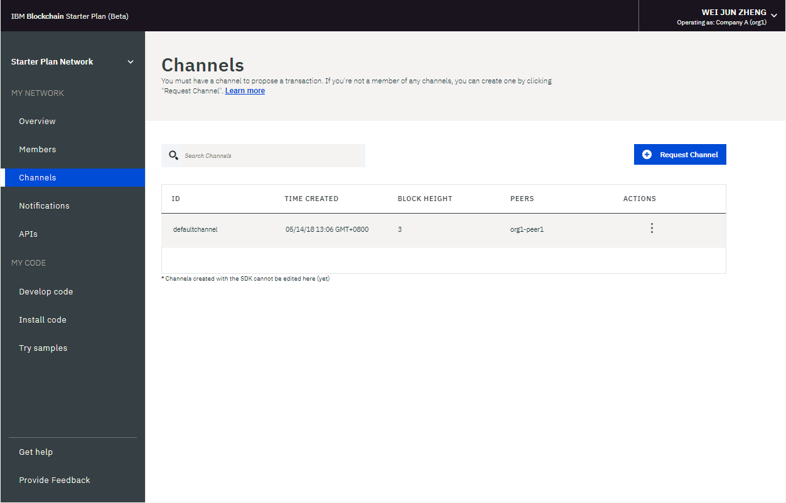

---

copyright:
  years: 2017, 2018
lastupdated: "2018-05-15"

---

{:new_window: target="_blank"}
{:shortdesc: .shortdesc}
{:codeblock: .codeblock}
{:screen: .screen}
{:pre: .pre}

# スターター・プラン・ネットワークの運用
{: #operate-starter-plan-network}

{{site.data.keyword.blockchainfull}} Platform に用意されたネットワーク・モニターにはブロックチェーン環境の概要が示されるので、ネットワーク・リソース、メンバー、結合されたチャネル、トランザクション・パフォーマンス・データ、デプロイされたチェーンコードなどを把握できます。 また、ネットワーク・モニターにはエントリー・ポイントとしての役割もあり、そこから Swagger API を実行したり、{{site.data.keyword.blockchainfull_notm}} Platform: Develop を使用してネットワークを開発したり、サンプル・アプリケーションを試したりできます。
{:shortdesc}

ネットワーク・モニターで、[スターター・プラン・ネットワークの名前を変更](#sp-network-name)したり、[作成したスターター・プラン・ネットワークを切り替え](#switch-sp-network)たりすることができます。

ネットワーク・モニターの 3 つのセクションには、以下の画面が表示されます。 ネットワーク・モニターの左側のナビゲーターから各画面にナビゲートできます。
- **「マイ・ネットワーク」**セクションには、[「概説」](#overview)、[「メンバー」](#members)、[「チャネル」](#channels)、[「通知」](#notifications)、および[「API」](#apis)の各画面が表示されます。
- **「マイ・コード (My code)」**セクションには、「[コードの開発 (Develop code)](#write-code)」、「[コードのインストール (Install code)](#chaincode)」、「[サンプルの試行 (Try samples)](#samples)」の各画面が表示されます。
- [「ヘルプの利用」](#support)画面。

ネットワーク・モニターの右上にあるドロップダウン・メニューから、所有する[組織の切り替え](#switch-organizations)、[ネットワーク設定の確認](#network-preferences)、[ネットワークのリセット](#reset-network)を行えます。

このチュートリアルでは、上記の各画面および機能について説明します。

## ネットワーク名の更新
{: #sp-network-name}

スターター・プラン・ネットワークを作成すると、{{site.data.keyword.blockchainfull_notm}} Platform がそのネットワークに名前を割り当てます。ただし、このネットワーク名はネットワーク・モニターでいつでも更新できます。

ネットワーク・モニターの左側にあるナビゲーターの上部でネットワーク名をクリックすると、フィールドが編集可能になります。
使用する新規ネットワーク名を入力し、**Enter** キーを押します。ネットワーク名は数秒で更新されます。

**図 1** に、スターター・プランのネットワーク名を、割り当てられた名前から「Starter Plan Network」に更新する手順を示します。

*図 1. ネットワーク名の更新*

## スターター・プランのネットワークの切り替え
{: #switch-sp-network}

スターター・プランで複数のネットワークを作成した場合、ネットワーク・モニターでネットワークを切り替えることができます。

ネットワーク・モニターの左側にあるナビゲーターの上部で、ネットワーク名の横にある矢印アイコンをクリックします。ドロップダウン・リストから、切り替え先のネットワークの名前を選択してクリックします。Web ブラウザーが更新され、切り替え先のネットワークのネットワーク・モニターが開きます。

**図 2** に、別のスターター・プラン・ネットワークに切り替える手順を示します。

*図 2. ネットワークの切り替え*

## 概要
{: #overview}

「概要」画面には、順序付けサービス、CA、ピアなどのブロックチェーン・リソースについてのリアルタイムの状況情報が表示されます。 **「タイプ」**、**「名前」**、**「状況」**、**「アクション」** という 4 つの別々のヘッダーの下に各リソースが表示されます。 ネットワークが開始すると、1 つの順序付けプログラム、1 つの CA、1 つのピアが実行されます。 CA は組織に固有ですが、順序付けプログラムはネットワーク全体で共有される共通のエンドポイントです。

**図 3** に「概要」画面を示します。

*図 3. ネットワークの概要*

### ノード・アクション
  表の**「アクション」**ヘッダーには、コンポーネントを開始または停止するためのボタンがあります。 複数のノードを選択し、**「選択済みを開始 (Start Selected)」**ボタンまたは**「選択済みを停止 (Stop Selected)」**ボタンをクリックして、ノードのグループを開始または停止することもできます。 **「選択済みを開始 (Start Selected)」**ボタンまたは**「選択済みを停止 (Stop Selected)」**ボタンは、1 つまたは複数のノードを選択すると、表の上部に表示されます。

  **「アクション」**ヘッダーの下のドロップダウン・リストから**「ログの表示 (View Logs)」**をクリックして、コンポーネントのログを確認することもできます。 ログでは、さまざまなネットワーク・リソース間で出された呼び出しを調べることができるため、デバッグやトラブルシューティングに役立ちます。

  **注**: {{site.data.keyword.blockchainfull_notm}} スターター・ネットワーク UI の「概要」パネルにリストされているノードに対して「ログの表示 (View Logs)」アクションをクリックすると、「IBM Cloud Logging」kibana インターフェースが開きます。デフォルトでは、kibana は直近 15 分間のアクティビティーのログを表示するように事前構成されています。直近 15 分間のアクティビティーがない場合は、「No results found」というメッセージが表示されます。すべてのログを表示するには、ユーザー名の下の右上隅にあるタイマー・アイコンをクリックし、「今週」や「今月」などの広い時間範囲を設定します。

  ピアの開始と停止の影響を調べるために、ピアを停止し、そのピアをトランザクションのターゲットにしてみることができます。接続エラーがログに表示されるはずです。ピアを再始動してトランザクションを再試行すると、接続が成功します。 チャネルがトランザクション処理を続行しているときに、長期間にわたってピアをダウン状態のままにすることもできます。 ピアが再び稼働すると、台帳が同期されていることが分かります。これは、ピアがダウン状態の間にコミットされたブロックを受信するためです。 台帳が完全に同期されたら、通常の呼び出しとそれに対する照会を実行できます。

### 接続プロファイル
  **「接続プロファイル」 **ボタンをクリックすると、各リソースの低レベル・ネットワーク情報についての JSONファイルが表示されます。 接続プロファイルには、アプリケーションに必要なすべての構成情報が含まれています。 ただし、このファイルには特定のコンポーネントと順序付けプログラムのアドレスのみが含まれているため、追加のピアをターゲットにする必要がある場合は、それらのエンドポイントを取得する必要があります。 「url」を含むヘッダーに、各コンポーネントの API エンドポイントが表示されます。 クライアント・サイド・アプリケーションから特定のネットワーク・コンポーネントをターゲットにするためには、これらのエンドポイントが必要です。また、エンドポイントの定義は一般にはアプリに付随する JSON モデルの構成ファイルに存在します。 組織外のピアからの承認を必要とするアプリケーションをカスタマイズする場合は、担当のオペレーターからアウト・オブ・バンド操作でそのピアの IP アドレスを取得する必要があります。 クライアントは、応答を返してもらう必要のあるすべてのピアに接続できなければなりません。

### ピアの追加
{: #peers}
  ネットワーク・メンバーにはピアが必要です。ピアでは、ネットワーク台帳のコピーを保管し、チェーンコードを実行して台帳を照会または更新する必要があります。 エンドースメント・ポリシーがピアをエンドース・ピアとして定義している場合、ピアはエンドースメント結果もアプリケーションに返します。

  スターター・プランは、デフォルトでは 2 つの組織のそれぞれにピアを 1 つずつ作成します。 独自の要件に基づいて、組織にさらにピアを追加できます。 追加のピアが必要なさまざまなシナリオが考えられます。 例えば、冗長性のために複数のピアが同じチャネルに参加するようにすることができます。 各ピアが、チャネルのトランザクションを処理して、それぞれの台帳のコピーに書き込みます。 ピアの 1 つが失敗した場合、もう一方のピア (または複数の他のピア) は、トランザクションとアプリケーション要求の処理を続行できます。 さらに、すべてのアプリケーション要求を複数のピアに均等にロード・バランシングすることも、機能ごとに異なるピアをターゲットにすることもできます。 例えば、あるピアを台帳の照会用に使用し、別のピアを台帳更新のエンドースメント処理用に使用することができます。

  右上の**「ピアの追加」**ボタンをクリックして、ネットワークにピア・ノードを追加できます。 ポップアップの「ピアの追加」パネルで、追加するピア・ノードの数とサイズを選択します。

## メンバー
{: #members}

「メンバー」画面には、ネットワーク・メンバー情報を表示する「メンバー」タブと、証明書情報を表示する「証明書」タブという 2 つのタブがあります。

### メンバー
{: #members_tab}
**図 4** に、ネットワーク・メンバーが「メンバー」タブに表示されている「メンバー」画面の初期画面を示します。

*図 4. ネットワーク・メンバー*

**「メンバーの追加」**をクリックして、ネットワークにさらにメンバーを招待します。 スターター・プランには、次の 2 つのオプションがあります。
- **「メンバーの招待 (Invite a member)」**。 ネットワークのメンバーになるように他の組織を招待できます。 招待された組織は、ネットワークに参加して共同作業を行えるようになります。
- **「メンバーの作成 (Create member)」**。 ユーザー自身の E メール・アドレスを使用してメンバーを作成することもできます。 スターター・プランにデフォルトで用意されている 2 つの組織を制御できるのと同じように、ユーザーは自分で作成したメンバーも制御できます。

**図 5** に「メンバーの追加」ウィンドウを示します。

*図 5. メンバーの追加*

### 証明書
**図 6** に、メンバーの証明書が「証明書」タブに表示されている「メンバー」画面の初期画面を示します。

*図 6. 証明書*

オペレーターは、同じ機関に属するメンバーの証明書を「証明書」タブで管理できます。 **「証明書の追加」**をクリックして、「証明書の追加」パネルを開きます。 証明書に名前を指定し、「鍵」フィールドにクライアント・サイドの PEM 形式の証明書を貼り付け、**「実行依頼 (Submit)」**をクリックします。 このクライアント・サイドの証明書を有効にするためにピアを再始動する必要があります。

証明書の鍵の生成について詳しくは、[クライアント・サイドの証明書の生成](v10_application.html#generating-the-client-side-certificates)を参照してください。

## チャネル
{: #channels}

チャネルは、プライベート・トランザクションを実行する必要があるネットワーク・メンバーのサブセットで構成されます。チャネルに属するメンバーは、チャネル固有のルールを確立し、メンバーのみがアクセスできる独自の台帳を使用できるので、データの分離と機密性を確保できます。 トランザクションを実行するためには、すべてのネットワークに 1 つ以上のチャネルが必要です。 チャネルごとに固有の台帳があり、その台帳に対して読み取り/書き込み操作を実行するには、ユーザーは正しく認証される必要があります。 チャネルに参加していないユーザーは、データを表示できません。

**図 7** に、ネットワークのすべてのチャネルの概要を表示するダッシュボードの初期画面を示します。

*図 7. チャネル*

チャネルを作成すると、チャネル固有の台帳が生成されます。 詳しくは、[チャネルの作成](howto/create_channel.html)を参照してください。

また、既存のチャネルを選択して、チャネル、メンバーシップ、アクティブ・チェーンコードに関する詳細を表示することもできます。 詳しくは、[ネットワークのモニター](howto/monitor_network.html)を参照してください。

## 通知
{: #notifications}

「通知」画面では、保留中の要求を処理したり、完了した要求を表示したりできます。

**図 8** に「通知」画面を示します。

*図 8. 通知*

チャネルを作成した場合、または新規チャネルに招待された場合、ネットワーク・モニターに通知が表示されます。

要求は「すべて」、「保留中」、「完了」の各サブタブにグループ分けされています。 各サブタブに含まれている要求の数が、ヘッダーの後ろに表示されています。
   * 「すべて」サブタブには、すべての要求が含まれています。
   * 承認も拒否もしていない要求、まだ参照していない要求は、「処理待ち (Pending)」サブタブに含まれています。 **「要求の確認 (Review Request)」**ボタンをクリックし、チャネル・ポリシーやメンバーなども含めて要求と投票状況を確認します。 チャネル・オペレーターは、要求の**受諾**または**拒否**を行なったり、**「後で」**をクリックしてそれを別の時に処理したりできます。 要求が十分な数のチャネル・オペレーターから承認された場合は、**「要求の実行依頼 (Submit Request)」**をクリックしてチャネルの更新をアクティブ化します。
   * 実行依頼した要求は「完了」サブタブに表示されます。  **「要求の確認 (Review Request)」**をクリックして、その詳細を確認できます。

要求のリストが長い場合は、上部の検索フィールドで要求を検索できます。

保留中の要求は、要求の前のチェック・ボックスを選択し、**「要求の削除 (Delete Request)」**をクリックして削除できます。

## API
{: #apis}

アプリケーション開発を容易にするために、{{site.data.keyword.blockchainfull_notm}} Platform は、Swagger UI でネットワークに対してテストできる API を公開しています。

**図 9** に「API」画面を示します。

*図 9. API*

**「Swagger UI」**リンクをクリックして Swagger UI を開きます。 API を実行するには、その前にネットワーク資格情報 (この API ページにあります) を使用して Swagger UI に権限を与える必要があることに注意してください。 詳しくは、[Swagger API の使用](howto/swagger_apis.html)を参照してください。

## コードの開発 (Develop code)
{: #write-code}

スターター・プランは、{{site.data.keyword.blockchainfull_notm}} Platform: Develop を統合し、業界標準のツールとテクノロジーを備えた開発環境を提供します。 オンラインまたはローカルのいずれの環境でもビジネス・ネットワークを開発できます。 ビジネス・ネットワークを開発した後、そのビジネス・ネットワークをスターター・プラン・ネットワークにデプロイすることができます。

**図 10** は、「コードの開発 (Develop code)」画面を示しています。

")
*図 10. コードの開発 (Develop code)*

ビジネス・ネットワークを開発してスターター・プラン・ネットワークにデプロイする方法について詳しくは、[スターター・プランでのビジネス・ネットワークのデプロイ](develop_starter.html)を参照してください。

## コードのインストール
{: #chaincode}

チェーンコードは、「スマート・コントラクト」とも呼ばれるソフトウェアの一部分で、そこには台帳を照会および更新するための機能一式が含まれています。 これらはピアにインストールされ、チャネル上でインスタンス化されます。

**図 11** に「コードのインストール」画面を示します。

*図 11. チェーンコード*

チェーンコードは、まずピアのファイル・システムにインストールされてから、チャネルでインスタンス化されます。 詳しくは、[チェーンコードのインストール、インスタンス化、および更新](howto/install_instantiate_chaincode.html)を参照してください。

## サンプルの試行
{: #samples}

サンプル・アプリケーションは、ブロックチェーン・ネットワークとアプリケーション開発についての理解を深めるのに役立ちます。 スターター・プランを使用すると、ネットワーク・モニターでサンプル・アプリケーションをデプロイして起動することができます。

**図 12** に「サンプルの試行」画面を示します。

*図 12. 「サンプル」*

このサンプル・デプロイメントでは、[DevOps ツールチェーン・サービス ](https://console.bluemix.net/devops/toolchains) を利用して、ソース管理、デリバリー・パイプライン、チェーンコード有効化のプロセスを自動化します。サンプル・アプリケーションを選択し、**「Deploy via Toolchain」**をクリックします。 詳しくは、[サンプル・アプリケーションの開発](howto/prebuilt_samples.html)を参照してください。

## ヘルプの利用
{: #support}

「ヘルプの利用」画面には 2 つのタブがあります。「サポート」タブではサポート情報を提供し、「リリース・ノート」タブでは各リリースの新機能や変更された機能を記載しています。

**図 13** に、サポート情報が「サポート」タブに表示されている「サポート」画面の初期画面を示します。

*図 13. ブロックチェーン・サポート*

この画面のリンクおよびリソースを使用して、トラブルシューティング・フォーラムおよびサポート・フォーラムにアクセスします。

* [{{site.data.keyword.blockchainfull_notm}} サービス資料](index.html)の**概説** (この資料サイト) には、{{site.data.keyword.Bluemix_notm}} で {{site.data.keyword.blockchainfull}} Platform を初めて使用する場合のガイドが用意されています。 左側のナビゲーターから対応するトピックを見つけるか、上部の検索機能を使用して用語を検索できます。
* [IBM Developer Works ](https://developer.ibm.com/blockchain/) の**コミュニティーのヘルプ**には、開発者向けのリソースや情報があります。
* **サポート・チケット**の下の [IBM dWAnswers ](https://developer.ibm.com/answers/smartspace/blockchain/) は、質問と回答のやり取りを行うプラットフォームの役割を果たします。 過去に投稿された質問から回答を探したり、新しい質問を送信したりできます。 質問にはキーワード **blockchain** を含めてください。
  また、**「{{site.data.keyword.Bluemix_notm}} サポート・チケットのオープン」** オプションを使用して、チケットを {{site.data.keyword.blockchainfull_notm}} サポート・チームに送信することもできます。  該当する特定の {{site.data.keyword.Bluemix_notm}} インスタンスの詳細およびコード・スニペットを提供してください。
* [サンプル・アプリケーション ](https://github.com/ibm-blockchain) の**ブロックチェーン・サンプル・アプリケーション**には、アプリケーションの開発を支援するガイドやサンプル・コード・スニペットが用意されています。
* [Hyperledger Fabric ](http://hyperledger-fabric.readthedocs.io/) と [Hyperledger Fabric コミュニティー ](http://jira.hyperledger.org/secure/Dashboard.jspa) の **Hyperledger Fabric** には、Hyperledger Fabric スタックに関する詳細を調べることができます。
  [Hyperledger Expert ](https://chat.hyperledger.org/channel/general) では、Hyperledger Fabric コードについて質問することができます。

問題をデバッグできない場合、または質問に対する回答が見つからない場合は、IBM クラウド・サービス・ポータルでサポート・ケースを送信してください。 詳しくは、[サポートのページ](ibmblockchain_support.html)を参照してください。

**図 14** および **図 15** に示す最初の「サポート」画面の「リリース・ノート」タブには、各リリースの新機能と変更された機能が表示されています。

*図 14. Helios のリリース・ノート

*図 15. Fabric のリリース・ノート*

## 組織の切り替え
{: #switch-organizations}

複数組織のブロックチェーン・ネットワークを自分でシミュレートする場合、所有する任意の組織 (組織 A など) に切り替えることができます。その後、ネットワーク・モニターで組織 A のネットワーク・リソース (ピア、チャネル、チェーンコードなど) を表示して管理することができます。 このフィーチャーにより、チャネル・ポリシーに従ってチャネルを作成し、複数の組織のピアをチャネルに追加できます。

UI の右上隅をクリックすると、自分の名前が表示されます。 **「組織の切り替え (SWITCH ORGANIZATION)」**の下のドロップダウン・メニューから、切り替え先の組織名を選択します。 組織 A はデフォルトで選択されています。 切り替え先の組織を選択すると、ネットワーク・モニターが自動的に最新表示され、その組織のネットワークを表示できます。

**図 16** に「組織の切り替え」機能を示します。

   
*図 16. 「組織の切り替え」*

## ネットワーク設定 (Network preferences)
{: #network-preferences}

右上隅をクリックしてドロップダウン・メニューを開き、メニューの**「ネットワーク設定 (Network preferences)」**ボタンをクリックします。「ネットワーク設定 (Network preferences)」ウィンドウが開きます。「ネットワーク設定 (Network preferences)」ウィンドウには、ネットワーク名、Fabric のバージョン、{{site.data.keyword.cloud_notm}} 内のネットワーク・ロケーション、台帳データベース・タイプなど、ネットワークの基本情報が表示されます。ネットワーク・イニシエーターであれば、「ネットワーク設定 (Network preferences)」ウィンドウで Web 非アクティブ・タイムアウトを管理することもできます。

### Web 非アクティブ・タイムアウト (Web inactivity timeout)
{: #web-inactivity-timeout}

**注**: Web 非アクティブ・タイムアウト設定を変更できるのは、**ネットワーク・イニシエーター**のみです。これはネットワーク・レベルの設定であり、すべてのネットワーク・メンバーに影響します。

デフォルトでは、Web 非アクティブ・タイムアウトは**「オフ」**に設定されます。Web 非アクティブ・タイムアウトを**オン**にした場合、非アクティブ状態が 10 分続いたネットワーク・メンバーはすべて自動的にログアウトされます。Web 非アクティブ・タイマーが 10 分に達すると、ネットワーク・メンバーのアカウントのセキュリティーを確保するために、Web 非アクティブ・タイムアウト機能によって非アクティブな Web セッションが終了させられます。リンクをクリックするか、ネットワーク・モニターを更新すると、Web 非アクティブ・タイマーはリセットされます。10 分に達する前にブラウザーのウィンドウまたはタブを閉じた場合も、Web セッションは終了します。

**図 17** に「ネットワーク設定 (Network preferences)」ウィンドウを示します。

")
*図 17. ネットワーク設定 (Network preferences)*

## ネットワークのリセット
{: #reset-network}

スターター・プランは、ネットワークを削除して再作成することなく、ネットワーク構成を編集する機能を提供します。 ネットワークは初期ネットワーク構成にリセットできます。つまり、 2 つの組織、組織ごとに 1 つのピア、1 つのデフォルト・チャネルという構成になります。 これはとても便利な機能で、例えばブロックチェーン・ネットワークのテストを繰り返し実行するときに、比較的クリーンなネットワークからやり直すことができます。

**注意**: ネットワークをリセットすると、ピア、順序付けプログラム、CA の API エンドポイントが変更されます。 アプリケーションで API エンドポイント情報を調整する必要があります。

右上隅をクリックして、ドロップダウン・メニューを開きます。 メニューの**「ネットワークのリセット」**ボタンをクリックします。 ネットワークをリセットする準備ができたら、**「OK」**をクリックして続行します。 ネットワーク・モニターが最新表示され、新しい設定が反映されます。

**図 18** に「ネットワークのリセット」機能を示します。

*図 18. 「ネットワークのリセット」*
