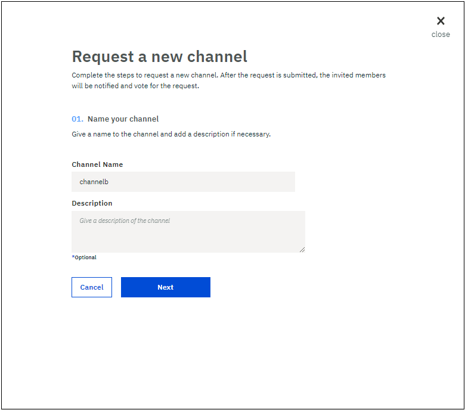

---

copyright:
  years: 2017
lastupdated: "2017-08-14"

---

{:new_window: target="_blank"}
{:shortdesc: .shortdesc}
{:screen: .screen}
{:codeblock: .codeblock}
{:pre: .pre}

# チャネルの作成または更新

チャネルは、データのパーティショニングおよび分離のための非常に強力なメカニズムであり、データのプライバシーのための主要な基盤を提供します。同じチャネルのメンバーだけが、このチャネルのデータにアクセスできます。
{:shortdesc}

チャネルのセキュリティーを確保するために、チャネル更新のポリシーが構成されて、
チャネルを作成または更新する前にチャネルの作成または更新の要求に同意する必要のあるチャネル・オペレーターの数が定義されています。
 

## チャネルの作成
ネットワーク・モニターの「チャネル (Channels)」画面で**「新規チャネル (New Channel)」**ボタンをクリックし、以下のステップを実行してチャネル作成要求を送信します。  
1. チャネルのビジネス目標を反映する名前を選択し、必要に応じて説明を追加し、**「次へ」**をクリックします。チャネル名はブロックチェーン・ネットワーク内で固有のものでなければなりません。この先頭は文字でなければならず、小文字、数字、ダッシュだけを含めることができます。  
    
    
2. ネットワーク・メンバーを選択してから**「メンバーの追加 (Add Member)」**ボタンをクリックすることによって、任意の組み合わせのネットワーク・メンバーを招待します。招待した各メンバーに役割を割り当てることによって許可をカスタマイズしてから、**「次へ」**をクリックします。  
    
  
    * チャネル・オペレーターは、チャネル台帳を照会または更新することができます。チャネル・オペレーターには、チャネル作成要求を**受諾**または**拒否**する権限とチャネル更新要求を送信する権限があります。各チャネルには、最低でも 1 名の**オペレーター**が必要です。  
    * チャネル・ライターは、チャネル台帳を更新できます。
    * チャネル・リーダーは、チャネル台帳の照会だけを行うことができます。
  
3. チャネル更新要求の承認に必要なチャネル・オペレーターの数を選択してチャネル更新ポリシーを構成してから、**「要求の実行依頼 (Submit Request)」**をクリックします。   
    

招待されたメンバーは、招待メールを受け取ります。さらに、ネットワーク・モニターの**「通知」**画面に「投票の処理待ち (Vote Pending)」状況の要求が表示されます。  
* チャネル・オペレーターとして招待されたメンバーは**「要求の確認 (Review Request)」**ボタンをクリックしてチャネル構成を確認してから、チャネル更新要求を**受諾**または**拒否**することができます。チャネル更新要求に対して、チャネル・オペレーターからの十分な数の**受諾**投票があった場合、その状況は「投票結果は受諾 (Vote Accepted)」に変更されます。その後、任意のチャネル・オペレーターが**「要求の送信 (Submit Request)」**ボタンをクリックして、チャネルの更新を完了させることができます。  
* チャネル・ライターまたはリーダーとして招待されたメンバーは**「要求の確認 (Review Request)」**ボタンをクリックしてチャネル構成を確認できます。

特殊な種類のチャネル更新要求として、十分な数のチャネル・オペレーターがチャネル作成要求を承認し、チャネル・オペレーターがその要求を送信すると、新しいチャネルが作成されます。すべてのチャネル・メンバーは、ネットワーク・モニターの「チャネル(Channels)」画面でそのチャネルを確認できます。

## チャネルの更新
チャネル・メンバーの追加や削除またはチャネル更新ポリシーの変更など、チャネルの構成を変更する場合は、チャネル更新要求を送信できます。ネットワーク・モニターの「チャネル (Channels)」画面で、変更するチャネルを見つけた後に、**「アクション」**ヘッダーの下にあるドロップダウン・リストから**「チャネルの編集 (Edit Channel)」**を選択します。チャネル作成要求を送信する場合と同じ手順を実行することにより、チャネル更新要求を送信します。

すべてのチャネル・メンバーは、チャネル更新要求に関する電子メール通知を受け取ります。
* 新しく招待されたメンバーは、チャネルに参加するように招待する電子メール通知を受け取ります。さらに、ネットワーク・モニターの**「通知」**画面に「投票の処理待ち (Vote Pending)」状況の要求が表示されます。  
    * チャネル・オペレーターとして招待されたメンバーは**「要求の確認 (Review Request)」**ボタンをクリックしてチャネル構成を確認してから、チャネル更新要求を**受諾**または**拒否**することができます。チャネル更新要求に対して、チャネル・オペレーターからの十分な数の**受諾**投票があった場合、その状況は「投票結果は受諾 (Vote Accepted)」に変更されます。その後、任意のチャネル・オペレーターが**「要求の送信 (Submit Request)」**ボタンをクリックして、チャネルの更新を完了させることができます。  
    * チャネル・ライターまたはリーダーとして招待されたメンバーは**「要求の確認 (Review Request)」**ボタンをクリックしてチャネル構成を確認できます。
* 削除されたメンバーは、チャネルの変更に関する電子メール通知を受け取ります。
* 既存のチャネル・オペレーターも、チャネルの更新に関する電子メール通知を受け取ります。さらに、ネットワーク・モニターの**「通知」**画面に「投票の処理待ち (Vote Pending)」状況の要求が表示され、その**受諾**または**拒否**を行うことができます。

十分な数のチャネル・オペレーターがチャネル更新要求を承認し、任意のチャネル・オペレーターが要求を送信すると、チャネルが更新されます。すべてのチャネル・メンバーは、ネットワーク・モニターの「チャネル(Channels)」画面で更新されたチャネルを確認できます。
