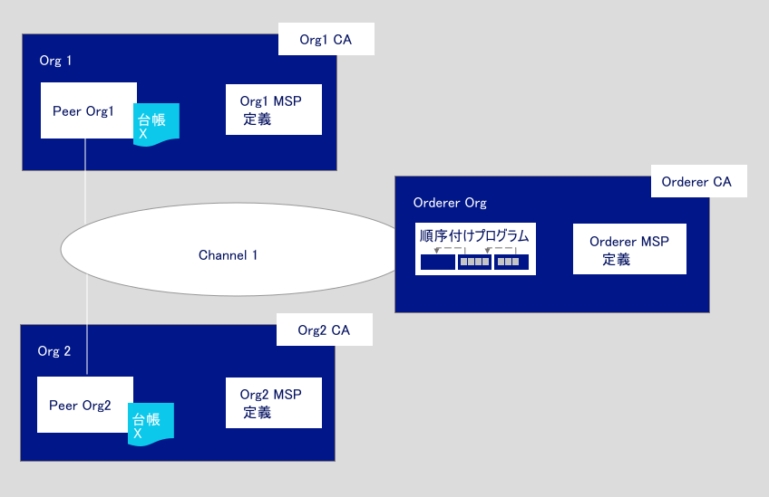
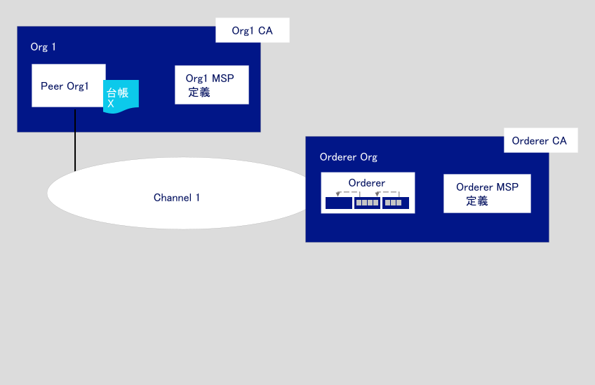

---

copyright:
  years: 2019

lastupdated: "2019-04-23"

subcollection: blockchain

---

{:new_window: target="_blank"}
{:shortdesc: .shortdesc}
{:screen: .screen}
{:codeblock: .codeblock}
{:note: .note}
{:important: .important}
{:tip: .tip}
{:pre: .pre}

# ネットワーク構築チュートリアル
{: #ibp-console-build-network}

{{site.data.keyword.blockchainfull}} Platform は、ブロックチェーンのアプリケーションとネットワークを開発、デプロイ、運用できるようにする Blockchain as a Service オファリングです。 ブロックチェーンの各コンポーネントの概要およびコンポーネント同士の連携について詳しくは、[ブロックチェーン・コンポーネントの概要](/docs/services/blockchain/blockchain_component_overview.html#blockchain-component-overview)を参照してください。 このチュートリアルは、[サンプル・ネットワークのチュートリアル・シリーズ](/docs/services/blockchain/howto/ibp-console-build-network.html#ibp-console-build-network-sample-tutorial)の第 1 部であり、{{site.data.keyword.blockchainfull_notm}} Platform コンソールを使用して、正常に機能するネットワークを単一の {{site.data.keyword.cloud_notm}} Kubernetes Service 上に構築する方法を説明します。
{:shortdesc}

**対象者:** このトピックは、ブロックチェーン・ネットワークの作成、モニター、管理を担当するネットワーク・オペレーターを対象に設計されています。   

{{site.data.keyword.cloud_notm}} Kubernetes Service を使用してコンソールを Kubernetes クラスターにまだデプロイしていない場合は、[{{site.data.keyword.blockchainfull_notm}} Platform 2.0 の概説](/docs/services/blockchain/howto/ibp-v2-deploy-iks.html#ibp-v2-deploy-iks)を参照してください。 コンソール・デプロイメント用に新しい Kubernetes クラスターを作成することも、{{site.data.keyword.cloud_notm}} アカウント内の既存の Kubernetes クラスターを使用することもできます。  {{site.data.keyword.blockchainfull}} Platform を Kubernetes クラスターにデプロイしたら、コンソールを起動して、ブロックチェーン・コンポーネントを作成および管理できます。

有料版または無料版のどちらの Kubernetes クラスターにデプロイしたかにかかわらず、ノードをデプロイしてチャネルを作成するときには、Kubernetes ダッシュボードで、使用可能なリソースを慎重に確認してください。 Kubernetes クラスターを管理し、必要に応じて追加のリソースをデプロイする責任はユーザーにあります。 無料版のクラスターにもコンポーネントは正常にデプロイできますが、追加するコンポーネントが多くなるほど、コンポーネントの実行速度は遅くなります。
{: note}

## サンプル・ネットワークのチュートリアル・シリーズ
{: #ibp-console-build-network-sample-tutorial}

この 3 部構成のチュートリアル・シリーズでは、{{site.data.keyword.blockchainfull_notm}} Platform 2.0 コンソールを使用し Kubernetes クラスターへのネットワークのデプロイやスマート・コントラクトのインストールとインスタンス化を行うことで、比較的にシンプルなマルチノードの Hyperledger Fabric ネットワークを作成して相互接続するプロセスを体験していきます。

* **ネットワーク構築チュートリアル** (このチュートリアル) では、順序付けプログラムとピアを作成することで、ネットワークをホストするプロセスを学習します。
* [ネットワーク参加チュートリアル](/docs/services/blockchain/howto/ibp-console-join-network.html#ibp-console-join-network)では、ピアを作成してチャネルに参加させることで、既存のネットワークに参加するプロセスを学習します。
* [ネットワークにスマート・コントラクトをデプロイする](/docs/services/blockchain/howto/ibp-console-smart-contracts.html#ibp-console-smart-contracts)では、スマート・コントラクトを作成してネットワークにデプロイする方法を学習します。

これらのチュートリアルの手順を使用すれば、複数の組織が参加する開発テスト用のネットワークを 1 つのクラスター内に構築できます。 順序付けサービス・ノードを作成して組織を追加することで、
ブロックチェーン・コンソーシアムを形成する場合は、**ネットワーク構築**のチュートリアルを使用してください。 ピアをネットワークに接続するには、**ネットワーク参加**のチュートリアルを使用してください。 さまざまなコンソーシアム・メンバーと一緒にこれらのチュートリアルを進めると、実際に**分散した**ブロックチェーン・ネットワークを作成できます。  

### このネットワークの構造
{: #ibp-console-build-network-structure}

**ネットワーク構築**チュートリアルと**ネットワーク参加**チュートリアルのすべての手順が完了すると、以下の図のようなネットワークになります。  
*図 1. サンプルの基本のネットワーク構造*  

これは、アプリケーションとスマート・コントラクトを十分にテストできる構成です。 このネットワークには以下のコンポーネントが含まれています。

* **ピア組織 2 つ**: `Org1` および `Org2`  
  このチュートリアルのシリーズでは、ピア組織 2 つおよび関連するピア 2 つを作成する方法について説明します。 ブロックチェーン・ネットワーク上の組織は、互いに取り引きする必要がある 2 つの別々の銀行のようなものと考えてください。 組織 `Org1` および `Org2` を定義する Org1 および Org2 のメンバーシップ・サービス・プロバイダー (MSP) 定義を作成します。
* **順序付けプログラム組織 1 つ**: `Orderer Org`  
  分散台帳を作成するので、ピアと順序付けプログラムは別々の組織に所属していなければなりません。 そのため、順序付けプログラムのために別の組織を作成します。  特に、順序付けプログラム・ノードは、トランザクションのブロックに順序を付け、台帳に書き込んでブロックチェーンにするためにピアに送るノードです。 組織 `Orderer Org` を定義する順序付けプログラムのメンバーシップ・サービス・プロバイダー (MSP) 定義を作成します。
* **認証局 (CA) 3 つ**: `Org1 CA、Org2 CA、Orderer CA`   
  CA とは、組織のすべてのメンバーに証明書を発行するノードです。 CA は組織ごとに 1 つデプロイするのがベスト・プラクティスです。そのため、各ピア組織用に 1 つと、順序付けプログラム組織用に 1 つ、合計 3 つの CA をデプロイします。 また、CA は、各組織のすべてのノード、ID、および組織定義を作成するためにも使用します。
* **順序付けプログラム 1 つ:** `Orderer`  
  現在、コンソールを使用してデプロイできるのは SOLO 順序付けサービスだけです。 クラスター内にスペースがあれば、この種類のノードは複数個デプロイできます。ただし、「コンソーシアム」、つまり、チャネルの作成およびチャネルへの参加が可能なピア組織のリストは、順序付けプログラムごとに別々に存在します。 同じチャネルに複数の順序付けプログラムを接続することはできません。 この順序付けプログラムの管理者が、コンソーシアムの作成に使用するピア組織を追加することで、ピア組織はチャネルを作成できるようになります。 別々のクラスターにデプロイされている複数の組織が参加するチャネルを作成する (ほとんどの実動ネットワークはこのような構造になっています) 場合は、別のコンソールでデプロイされたピア組織を、自分のコンソールにインポートする必要もあります。 これにより、そのピア組織を、順序付けサービスでホストするチャネルに参加させることができます。
* **ピア 2 つ:** `Peer Org1` および `Peer Org2`  
  上の図のブロックチェーン台帳 `Ledger x` は分散ピアによって保守されています。 これらのピアには、データベースとして [Couch DB ](https://hyperledger-fabric.readthedocs.io/en/release-1.4/couchdb_as_state_database.html) がデプロイされます。
* **チャネル 1 つ**: `channel1`  
  チャネルにより、データ・プライバシーが実現されます。 チャネルにより、一連の組織は、チャネルのメンバーでない組織にデータを公開することなく取引を実行できます。 チャネルごとに独自のブロックチェーン台帳があり、そのチャネルに参加しているピアの間で共有されます。 このチュートリアルでは、両方の組織が参加するチャネルを 1 つ作成し、そのチャネルで、両組織が取引のために使用できるスマート・コントラクトをインスタンス化します。

この構成は必須ではありません。 {{site.data.keyword.blockchainfull_notm}} Platform 2.0 はカスタマイズ性に優れています。 Kubernetes クラスター上に使用可能なリソースがある場合は、コンソールを使用して順序付けサービス・ノードをデプロイし、このノードに組織を追加することができます。これは、コンソーシアムを形成するともいいます。 また、複数の順序付けサービスに接続する 1 つのピア組織を作成することもできます。 このチュートリアルでは、独自のネットワークを構築するために必要な手順について説明し、{{site.data.keyword.blockchainfull_notm}} Platform およびコンソールについてさらに詳しく学習できるトピックを紹介します。

この**ネットワーク構築**チュートリアルでは、上図のネットワークの一部だけを構築します。1 つのチャネルで 1 つの順序付けプログラムと、ピア組織およびピアを 1 つホストするために使用できるシンプルなネットワークです。 以下の図は、上図のネットワークのうちここで構築する部分を示しています。
  
*図 2. シンプルなネットワーク構造*  

この構成は、すぐにスマート・コントラクトを開始してテストしたい場合には便利ですが、取引相手になる他の組織を追加して実際に分散した台帳を作成しないと、あまり意味はありません。  そのため、次の[ネットワーク参加](/docs/services/blockchain/howto/ibp-console-join-network.html#ibp-console-join-network)チュートリアルで、追加のピア組織とピアを作成する方法、および新しい組織をチャネルに追加する方法を説明します。  

このチュートリアルでは、全体を通して、コンソールのフィールドの**推奨値**をいくつか記載しています。 推奨値を使用すれば、タブやドロップダウン・リストで名前や ID を見つけやすくなります。 これらの値は必須ではありませんが、使用すると便利です。 各タスクの後に推奨値の表を示します。
{:tip}

## 手順 1: 組織およびブロックチェーンへのエントリー・ポイントを作成する
{: #ibp-console-build-network-create-peer-org1}

コンソールを使用して作成する組織ごとに、CA を 1 つ以上デプロイする必要があります。 CA とは、すべてのネットワーク参加者 (ピア、順序付けプログラム、クライアント、その他) に証明書を発行するノードです。 ネットワーク参加者は、公開鍵と秘密鍵のペアが含まれたこれらの証明書を使用して通信および認証することができ、最終的にトランザクションを実行できます。 これらの CA により、組織に属するすべての ID および証明書を作成し、さらに組織そのものを定義します。 その後、それらの ID を使用して、ノードのデプロイ、ネットワークの運用、ブロックチェーンへのトランザクションの送信を行えます。 CA および作成する必要がある ID について詳しくは、[ID の管理](/docs/services/blockchain/howto/ibp-console-identities.html#ibp-console-identities)を参照してください。

このチュートリアルでは、組織を 2 つ作成します。ピアを所有する組織と、順序付けプログラムを所有する組織です。 どちらの組織にも、その組織の証明書を発行する CA が必要です。そのため、**2 つの CA** を作成する必要があります。 このチュートリアルの目的に合わせて、**ここでは、CA を 1 つだけ作成します**。

以下のビデオを見て、ピアの組織とピアを作成するプロセスを確認してください。

<iframe class="embed-responsive-item" id="youtubeplayer" title="IBM Blockchain Platform free 2.0 beta video - deployment tutorial" type="text/html" width="640" height="390" src="https://www.youtube.com/embed/JZj43n_JKIY" frameborder="0" webkitallowfullscreen mozallowfullscreen allowfullscreen> </iframe>  
*ビデオ 1. ピアの組織とピアを作成する*

### ピア組織の CA を作成する
{: #ibp-console-build-network-create-CA-org1CA}

このチュートリアルでは、ユーザーおよびノードの公開鍵と秘密鍵が CA によって発行されます。 それらの ID を、{{site.data.keyword.IBM_notm}} は管理しません。それらの鍵は Kubernetes クラスターにもコンソールにも保管されません。 これらはブラウザーのローカル・ストレージのみに保管されます。 そのため、ID および組織 MSP を必ずエクスポートしてください。 別のマシンや別のブラウザーからコンソールにアクセスする場合は、それらの ID および組織の定義をインポートする必要があります。  
{:important}

コンソールから以下の手順を実行します。

1. 左側の**「ノード」**タブにナビゲートし、**「認証局の追加 (Add Certificate Authority)」**をクリックします。 サイド・パネルを使用して、作成する CA をカスタマイズできるとともに、この CA によって鍵が発行される対象となる組織をカスタマイズできます。
2. **「認証局の作成 (Create Certificate Authority)」**の下の**「{{site.data.keyword.cloud_notm}}」**をクリックし、**「次へ」**をクリックします。
3. 2 つ目のサイド・パネルを使用して、CA に**表示名**を付けます。 この CA にお勧めする値は、`Org1 CA` です。
4. 次のパネルで、**「管理者 ID (Admin ID)」**に `admin` を指定し、任意のシークレットを設定して、CA 管理者の資格情報を与えます。 このチュートリアルを進めやすくするために、`adminpw` にすることをお勧めします。
5. 有料クラスターを使用している場合は、ノードのリソース割り振りを構成できます。このチュートリアルでは、すべてのデフォルトを受け入れ、**「次へ」**をクリックしてかまいません。リソースをノードに割り振る方法について詳しくは、[リソースの割り振り](/docs/services/blockchain?topic=blockchain-ibp-console-govern#ibp-console-govern-allocate-resources)のトピックを参照してください。無料クラスターを使用している場合は、既に**「サマリー」**ページが表示されています。
6. 「サマリー」ページを確認し、**「認証局の追加 (Add Certificate Authority)」**をクリックします。

**タスク: ピア組織の CA の作成**

  | **フィールド** | **表示名** | **登録 ID** | **機密事項** |
  | ------------------------- |-----------|-----------|-----------|
  | **認証局の作成 (Create CA)** | Org1 CA  | admin | adminpw |

  *図 3. ピア組織の CA の作成*

CA をデプロイした後に、組織 MSP の作成時やユーザーの登録時にその CA を使用するとともに、ネットワークへのエントリー・ポイント (**ピア**) を作成するためにその CA を使用します。  

既に独自の CA を所有している上級ユーザーは、コンソールで CA を新規作成する必要はない可能性があります。既存の CA が `X.509` 形式の証明書を発行できる場合は、ここで新規 CA を作成せずに、その独自の外部 CA を使用できます。詳しくは、[外部 CA からの証明書をピアまたは順序付けプログラムに使用する](/docs/services/blockchain/howto/ibp-console-build-network.html#ibp-console-build-network-third-party-ca)のトピックを参照してください。

### CA を使用して ID を登録する
{: #ibp-console-build-network-use-CA-org1}

作成するノードまたはアプリケーションごとに、ブロックチェーン・ネットワークに参加するための公開鍵と秘密鍵が必要です。 これらのノードとアプリケーションをコンソールから管理可能にするために、これらのための管理鍵も作成する必要があります。 このプロセスは、作成した CA ごとに 1 回、合計 2 回行います。 そして CA ごとに、以下の 2 つの ID を作成します。

* **組織管理者** この ID により、プラットフォーム・コンソールを使用してノードを操作できます。
* **ピア ID** この ID により、ピアをデプロイできます。

クラスターのタイプによっては、CA のデプロイメントに最大 10 分かかることがあります。CA タイルの緑色の正方形は、CA が「実行中」であり、ID の登録に使用できることを意味します。ID を登録する下記の手順を始める前に、CA の状況が「実行中」になるまで待つ必要があります。
{:important}

これらの証明書を生成するには、以下の手順を実行する必要があります。

1. コンソールで、**「ノード」**タブをクリックします。`Org1 CA` の右上隅にある状況標識が緑色で`「実行中」`になっていれば、タイルをクリックして開きます。
2. CA を選択したら、次に進む前に、この CA 用に作成した `admin` ID が表示されていることを確認します。ピア自体のための ID に加えて、最初の組織 `org1` のために別の管理者 ID も登録する必要があります。新規ユーザーを登録するには、**「ユーザーの登録」**ボタンをクリックします。
3. 組織管理者の登録 ID `org1admin` を指定します。 任意のシークレットを使用できますが、このサンプルに合わせて `org1adminpw` を使用することをお勧めします。 **「次へ」**をクリックします。
4. 次のステップで、この ID の「タイプ」を`クライアント`に設定し、ドロップダウン・リストから任意の所属団体組織を選択する必要があります。 「アフィリエーション」フィールドは上級ユーザー向けであり、このチュートリアルでは使用しませんが、このパネルの必須フィールドです。 リストの項目は Fabric CA 内のデフォルトのアフィリエーションです。 Fabric CA によるアフィリエーションの使用方法について詳しくは、[Registering a new identity ](https://hyperledger-fabric-ca.readthedocs.io/en/release-1.4/users-guide.html#registering-a-new-identity) のトピックを参照してください。 ここでは、リストから任意の所属団体 (`org1` など) を選択し、**「次へ」**をクリックします。
5. **「最大エンロール回数 (Maximum Enrollments)」**フィールドと**「属性の追加 (Add Attributes)」**フィールドはブランクのままでかまいません。 このチュートリアルでは使用しません。ただし、これらの使用方法については、[ID の登録](/docs/services/blockchain/howto/ibp-console-identities.html#ibp-console-identities-register)のトピックで詳しく説明しています。
6. 組織管理者を登録したら、ピア ID 用に、同じ `Org1 CA` を使用して同じプロセスを繰り返し、登録 ID `peer1` および任意のシークレットを指定します。 前と同じく、シークレットには `peer1pw` をお勧めします。 これはノード ID なので、次のステップでは**「タイプ」**に`ピア`を選択します。 任意の**「所属団体 (Affiliation)」**を選択します。 そして、**「最大エンロール回数 (Maximum Enrollments)」**および**「属性 (Attributes)」**は無視します。

**タスク: ユーザーの登録**

  |  **フィールド** | **説明** | **登録 ID** | **機密事項** |
  | ------------------------- |-----------|-----------|-----------|-----------|
  | **ユーザーの登録** |  Org1 管理者 | org1admin | org1adminpw |
  | | ピア ID |  peer1 | peer1pw |

  *図 4. CA を使用したユーザーの登録*

### ピア組織の MSP 定義を作成する
{: #ibp-console-build-network-create-peers-org1}

ピアの CA を作成し、それを使用して組織 ID を**登録**したので、ピア組織の正式な定義を作成する必要があります。このような定義を、メンバーシップ・サービス・プロバイダー (MSP) と呼びます。 複数のピアが単一の組織に属することができます。 **ピアを作成するたびに新しい組織を作成する必要はありません。** このチュートリアルを実行するのは今回が初めてであるため、この組織の MSP ID を作成します。 MSP を作成するプロセスの中で、`org1admin` ID のための証明書を生成し、コンソール・ウォレットに追加します。

1. 左側ナビゲーションの**「組織」**タブにナビゲートし、**「MSP 定義の作成 (Create MSP definition)」**をクリックします。
2. MSP の表示名に `Org1 MSP` および MSP ID に `org1msp` を指定します。 このフィールドで独自の MSP ID を指定する場合は、ツールチップに表示されるこの名前の制限事項に関する指定内容に従ってください。
3. **「ルート認証局の詳細 (Root Certificate Authority details)」**の下で、作成したピア CA を組織のルート CA として指定します。 このチュートリアルを初めて実行する場合には、`Org1 CA` だけが表示されます。
4. これの下の**「登録 ID」**フィールドと**「機密事項の登録」**フィールドには、CA を使用して作成した最初のユーザーの登録 ID と機密事項が自動的に入力されます。 それらの値を使用することもできますが、CA 管理者 ID を組織管理者として使用することは推奨されていません。  セキュリティー上の理由で、代わりに組織管理者の作成済みの登録 ID と機密事項、`org1admin` と `org1adminpw` を入力することをお勧めします。 そして、この ID に表示名 `Org1 Admin` を指定します。
5. **「生成」**ボタンをクリックして、この ID を組織の管理者としてエンロールし、ID をウォレットにエクスポートします。ピアを作成したりチャネルを作成したりするときには、このウォレットの ID が使用されます。
6. **「エクスポート」**をクリックして、管理者の証明書をファイル・システムにエクスポートし、ファイルを管理できるようにします。 前述のように、この ID はクラスターに保管されることも {{site.data.keyword.IBM_notm}} によって管理されることもありません。 これはブラウザー内にのみ保管されます。 ブラウザーを変更する場合は、ピアを管理できるようにするために、この ID をコンソール・ウォレットにインポートする必要があります。
7. **「MSP 定義の作成 (Create MSP definition)」**をクリックします。

**タスク: ピア組織の MSP の作成**

  |  | **表示名** | **MSP ID** | **登録 ID**  | **機密事項** |
  | ------------------------- |-----------|-----------|-----------|-----------|
  | **組織の作成** | Org1 MSP | org1msp |||
  | **ルート CA** | Org1 CA ||||
  | **組織管理者の証明書** | |  | org1admin | org1adminpw |
  | **ID** | Org1 Admin |||||

  *図 5. ピア組織の MSP 定義の作成*

MSP を作成すると、コンソール・ウォレットにピア組織の管理者が表示されます。

**タスク: コンソール・ウォレットの確認**

  | **フィールド** |  **表示名** | **説明** |
  | ------------------------- |-----------|----------|
  | **ID** | Org1 Admin | Org1 の管理者 ID |

  *図 6. コンソール・ウォレットの確認*

MSP について詳しくは、[組織の管理](/docs/services/blockchain/howto/ibp-console-organizations.html#ibp-console-organizations)を参照してください。

これらの証明書の管理および保護はお客様が行う作業ですので、組織管理者 ID をエクスポートすることは大切です。
{:important}

<!--
You are free to repeat this process as many times as times as you want. To create a network that is similar to [Starter Plan](/docs/services/blockchain/starter_plan.html#starter-plan-about), for example, you will create two organizations and one peer per organization, and this tutorial will take you through those steps. This process involves repeating the steps above, to create the CA and the relevant identities, and below, to create another peer. Remember that the best practice is to have **one CA for each organization**. This CA can, however, be used to register and enroll multiple organization admins as well as multiple peer identities **for that organization**. Make sure to keep track of the resources you are using in your Kubernetes cluster, especially if using the free cluster.
{: note}
-->

### ピアを作成する
{: #ibp-console-build-network-peer-create}

[CA を作成し](/docs/services/blockchain/howto/ibp-console-build-network.html#ibp-console-build-network-create-CA-org1CA)、それを使用して ID を登録し、[ピア組織の MSP](/docs/services/blockchain/howto/ibp-console-build-network.html#ibp-console-build-network-create-peers-org1) を作成したら、ピアを作成する準備は完了です。

#### ピアの役割
{: #ibp-console-build-network-peer-role}

重要な留意事項として、組織自体が台帳を保守することはありません。 ピアが保守します。 また組織はピアを使用して、トランザクション提案に署名して、チャネル構成の更新を承認します。 チャネル上にピアが 2 つ以上存在すると、組織の可用性が高まります。チャネルにピアを 2 つ以上参加させることが、実動レベルの実装のベスト・プラクティスです。 このチュートリアルでは、単一のピアを作成するプロセスだけを説明します。

リソース割り振りの観点からは、同じピアを複数のチャネルに参加させることが可能です。 ピアの設計上、いずれかのチャネルのデータを、ピアを介して別のチャネルに渡すことができないようになっています。 ただし、ピアにはチャネルごとに別個の台帳が保管されるため、トランザクションとデータの負荷を処理するための十分な処理能力とストレージをピアが備えていることを確認する必要があります。

#### ピアをデプロイする
{: #ibp-console-build-network-deploy-peer-role}

コンソールを使用して以下の手順を実行します。

1. **「ノード」**ページで、**「ピアの追加」**をクリックします。
2. **「ピアの新規作成 (Create a new peer)」**の下の「{{site.data.keyword.cloud_notm}}」をクリックし、**「次へ」**をクリックします。
3. ピアの**「表示名」**に `Peer Org1` を指定します。
4. 次の画面で、`Org1 CA` を CA として選択します。 そして、ピアのために作成したピア ID の登録 ID とシークレット、`peer1` および `peer1pw` を指定します。 そして、ドロップダウン・リストから MSP の `Org1 MSP` を選択し、**「次へ」**をクリックします。
5. 次のサイド・パネルでは、TLS CA 情報が求められます。 CA と一緒にデプロイされた TLS CA のために別の管理者を作成することもできますが、そうする必要はありません。
  - **「TLS 登録 ID (TLS Enroll ID)」**として `admin` を指定して、機密事項として `adminpw` を指定します。これらは、CA の作成時に指定した登録 ID および登録機密事項と同じ値です。
  - **「TLS CSR ホスト名 (TLS CSR hostname)」**は、上級者がピアのエンドポイントのアドレス指定に使用できるカスタム・ドメイン・ネームを指定するためのものです。 ここでは**「TLS CSR ホスト名 (TLS CSR hostname)」**はブランクのままにします。これはこのチュートリアルでは使用しません。
6. 次のサイド・パネルでは、**ID を関連付けて**、ピアの管理者にすることを要求されます。ピア管理者 ID の `Org1 Admin` を選択します。
7. 有料クラスターを使用している場合は、次のパネルで、ノードのリソース割り振りを構成できます。このチュートリアルでは、すべてのデフォルトを受け入れ、**「次へ」**をクリックしてかまいません。リソースをノードに割り振る方法について詳しくは、[リソースの割り振り](/docs/services/blockchain?topic=blockchain-ibp-console-govern#ibp-console-govern-allocate-resources)のトピックを参照してください。無料クラスターを使用している場合は、**「サマリー」**ページが表示されます。
8. 要約を確認し、**「ピアの追加」**をクリックします。

**タスク: ピアのデプロイ**

  |  | **表示名** | **MSP ID** | **登録 ID** | **機密事項** |
  | ------------------------- |-----------|-----------|-----------|-----------|
  | **ピアの作成** | Peer Org1 | org1msp |||
  | **CA** | Org1 CA ||||
  | **ピア ID** | |  | peer1 | peer1pw |
  | **管理者証明書** | org1msp ||||
  | **TLS CA** | Org1 CA ||||
  | **TLS CA ID** | || admin | adminpw |
  | **ID の関連付け (Associate identity)** | Org1 Admin |||||

  *図 7. ピアのデプロイ*

## 手順 2: トランザクションを順序付けするノードを作成する
{: #ibp-console-build-network-create-orderer}

Ethereum や Bitcoin などの他の分散ブロックチェーンでは、トランザクションを順序付けしてピアに送り出す中央の機関は存在しません。 {{site.data.keyword.blockchainfull_notm}} Platform がベースとするブロックチェーン、Hyperledger Fabric は、他とは異なる動作をします。 その特徴的なものが、**順序付けプログラム**と呼ばれるノードです。

順序付けプログラムは、次のように必要不可欠な機能をいくつか実行するので、ネットワークの重要なコンポーネントです。

- 台帳に書き込むためにピアに送られるトランザクションのブロックを、文字どおり**順序付け**します。 このプロセスを「順序付け」と呼びます。そのため、順序付けプログラムは「順序付けサービス」とも呼ばれます。
- 順序付けプログラムは、**順序付けシステム・チャネル**を保守します。これは、チャネルの作成を許可されたピア組織のリスト、つまり、**コンソーシアム**が存在する場所です。 コンソーシアムは、実質的にはマルチテナンシーの通信手段です。単一の順序付けサービスで複数のコンソーシアムをホストできる設計になっています。
- コンソーシアムまたはチャネル管理者によって決定された**ポリシーを実施**します。 それらのポリシーにより、チャネルの読み書きが可能なユーザーから、チャネルの作成や変更が可能なユーザーまで、あらゆることを指定できます。 例えば、ネットワーク参加者がチャネルまたはコンソーシアム・ポリシーの変更を要求すると、順序付けサービスはその要求を処理して、参加者に構成を更新するための適切な管理権限があるかどうかを確認し、更新内容を既存の構成と比較して検証し、新しい構成を生成してピアに中継します。

ピアの場合と同様に、順序付けプログラムを作成するには、その前に順序付けプログラムの組織の ID と MSP を提供する CA を作成する必要があります。

以下のビデオを見て、順序付けプログラムの組織と順序付けプログラムを作成するプロセスを確認してください。

<iframe class="embed-responsive-item" id="youtubeplayer" title="IBM Blockchain Platform free 2.0 beta video - deployment tutorial" type="text/html" width="640" height="390" src="https://www.youtube.com/embed/Gomkn-JtNe8" frameborder="0" webkitallowfullscreen mozallowfullscreen allowfullscreen> </iframe>  
*ビデオ 2. 順序付けプログラムの組織と順序付けプログラムを作成する*

### コンソールでの順序付け
{: #ibp-console-build-network-ordering-console}

さまざまな順序付けプログラムの実装方法がありますが、現在サポートされている順序付けサービスは、SOLO だけです。SOLO は、単一の順序付けプログラム・ノードを特徴としています。 単一ノードは単一障害点になるので、実動ネットワークには SOLO はお勧めしません。

コンソールを使用して任意の数の順序付けプログラムを作成できます。 ただし、それらの順序付けプログラムはすべて、独自の順序付けシステム・チャネル、つまり、独自のコンソーシアムを持つ必要があります。 1 つのチャネルに接続できる SOLO 順序付けプログラムは 1 つだけです。

このチュートリアルでは、単一の順序付けプログラムだけを作成します。

### 順序付けプログラム組織の CA を作成する
{: #ibp-console-build-network-create-orderer-ca}

順序付けプログラムのために CA を作成するプロセスは、ピアのために作成する場合と同じです。
1. **「ノード」**タブにナビゲートし、**「認証局の追加 (Add Certificate Authority)」**をクリックします。
2. **「新規認証局の作成 (Create a new Certificate Authority)」**の下の**「{{site.data.keyword.cloud_notm}}」**をクリックし、**「次へ」**をクリックします。
3. この CA に固有の表示名 `Orderer CA` を指定します。
4. もう一方の CA に指定した**登録 ID** `admin` を自由に再利用できます。シークレットは任意のものを指定できますが、`adminpw` をお勧めします。
5. 有料クラスターを使用している場合は、次のパネルで、ノードのリソース割り振りを構成できます。このチュートリアルでは、すべてのデフォルトを受け入れ、**「次へ」**をクリックしてかまいません。リソースをノードに割り振る方法について詳しくは、[リソースの割り振り](/docs/services/blockchain?topic=blockchain-ibp-console-govern#ibp-console-govern-allocate-resources)のトピックを参照してください。無料クラスターを使用している場合は、既に**「サマリー」**ページが表示されています。
6. 「サマリー」ページを確認し、**「認証局の追加 (Add Certificate Authority)」**をクリックします。

この場合も、既に独自の CA を所有している上級ユーザーは、コンソールで CA を新規作成する必要はない可能性があります。既存の CA が `X.509` 形式の証明書を発行できる場合は、ここで新規 CA を作成せずに、その独自の外部 CA を使用できます。詳しくは、[外部 CA からの証明書をピアまたは順序付けプログラムに使用する](/docs/services/blockchain/howto/ibp-console-build-network.html#ibp-console-build-network-third-party-ca)のトピックを参照してください。

### CA を使用して順序付けプログラムと順序付けプログラム管理者 ID を登録する
{: #ibp-console-build-network-use-CA-orderer}

ピアの場合と同様に、順序付けプログラムの CA にも 2 つの ID を登録する必要があります。  CA を選択したら、順序付けプログラムの組織の管理者を登録し、さらに順序付けプログラム自体の ID を登録する必要があります。 前と同じく、`「Orderer CA」`タブに ID が表示されています。これは、CA のために作成した管理者です。

クラスターのタイプによっては、CA のデプロイメントに最大 10 分かかることがあります。CA タイルの緑色の正方形は、CA が「実行中」であり、ID の登録に使用できることを意味します。ID を登録する下記の手順を始める前に、CA の状況が「実行中」になるまで待つ必要があります。
{:important}

1. コンソールで、**「ノード」**タブをクリックします。`Orderer CA` の右上隅にある状況標識が緑色で`「実行中」`になっていれば、タイルをクリックして開きます。
2. 作成したばかりの `admin` ID が表に表示されるまで待ってから、**「ユーザーの登録」**ボタンをクリックして新規ユーザーを登録します。
3. 組織管理者の登録 ID `ordereradmin` を指定します。 シークレットには `ordereradminpw` をお勧めします。
4. 次のステップで、この ID の「タイプ」を`クライアント`に設定し、ドロップダウン・リストから任意の所属団体組織を選択する必要があります。 「アフィリエーション」フィールドは上級ユーザー向けであり、このチュートリアルでは使用しませんが、このパネルの必須フィールドです。 リストの項目は Fabric CA 内のデフォルトのアフィリエーションです。 Fabric CA によるアフィリエーションの使用方法について詳しくは、[Registering a new identity ](https://hyperledger-fabric-ca.readthedocs.io/en/release-1.4/users-guide.html#registering-a-new-identity) のトピックを参照してください。 ここでは、リストから任意の所属団体を選択し、**「次へ」**をクリックします。
5. **「最大エンロール回数 (Maximum Enrollments)」**フィールドと**「属性の追加 (Add Attributes)」**フィールドはブランクのままでかまいません。 このチュートリアルでは使用しません。ただし、これらの使用方法については、コンソールでの [ID の登録](/docs/services/blockchain/howto/ibp-console-identities.html#ibp-console-identities-register)のトピックで詳しく説明しています。
6. 組織管理者を登録したら、順序付けプログラム ID 用に、同じ `Orderer CA` を使用して同じプロセスを繰り返し、登録 ID `orderer1` を指定します。 任意のシークレットを入力できますが、このチュートリアルを進めやすくするために `orderer1pw` にすることをお勧めします。 これはノード ID なので、次のステップでは**「タイプ」**に`ピア`を選択します。 そして、前と同じく、**「最大エンロール回数 (Maximum Enrollments)」**および**「属性 (Attributes)」**は無視します。

**タスク: CA の作成およびユーザーの登録**

  | **フィールド** | **説明** | **登録 ID** | **機密事項** |
  | ------------------------- |-----------|-----------|-----------|-----------|
  | **認証局の作成 (Create CA)** | 順序付けプログラムの CA | admin | adminpw |
  | **ユーザーの登録** | 順序付けプログラムの管理者 | ordereradmin | ordereradminpw |
  |  | 順序付けプログラム ID |  orderer1 | orderer1pw |

*図 8. CA の作成およびユーザーの登録*

### 順序付けプログラム組織の MSP 定義を作成する
{: #ibp-console-build-network-create-orderer-org-msp}

順序付けプログラム組織の MSP 定義を作成し、組織の管理者 ID を指定します。 順序付けプログラムの管理者とユーザーを登録したら、MSP ID を作成し、組織の管理者として登録した `ordereradmin` ユーザーをエンロールする必要があります。

1. 左側ナビゲーションの**「組織」**タブにナビゲートし、**「MSP 定義の作成 (Create MSP definition)」**をクリックします。
2. MSP 定義に表示名 (`Orderer MSP` など) と ID (`orderermsp` など) を指定します。ツールチップにこの名前の制限が表示されるのでその仕様に従ってください。
3. **「ルート認証局の詳細 (Root Certificate Authority details)」**の下で、作成した `Orderer CA` を選択します。
4. その下の**「登録 ID」**と**「登録シークレット (Enroll secret)」**に、その CA を使用して最初に作成したユーザーの登録 ID とシークレットが自動的に取り込まれます。 それらの値を使用することもできますが、CA 管理者 ID を組織管理者として使用することは推奨されていません。  セキュリティー上の理由で、代わりに組織管理者用に作成した登録 ID とシークレット (`ordereradmin` と `ordereradminpw`) を入力することをお勧めします。 そして、その ID に `Orderer Admin` などの表示名を指定します。
5. **「生成」**ボタンをクリックしてこの ID を組織の管理者としてエンロールし、ID をコンソール・ウォレットに追加します。順序付けプログラムを作成するときには、このウォレットの ID が使用されます。
6. **「エクスポート」**をクリックして、順序付けプログラム組織の管理者 ID をファイル・システムにエクスポートします。 前述のように、この ID はクラスターに保管されることも {{site.data.keyword.IBM_notm}} によって管理されることもありません。 これはブラウザーのローカル・ストレージにしか保管されません。  ブラウザーを変更する場合は、順序付けプログラムを管理できるようにするために、この ID をコンソール・ウォレットにインポートする必要があります。
7. **「MSP 定義の作成 (Create MSP definition)」**をクリックします。

**タスク: 順序付けプログラム組織の MSP 定義の作成**

  |  | **表示名** | **MSP ID** | **登録 ID**  | **機密事項** |
  | ------------------------- |-----------|-----------|-----------|-----------|
  | **組織の作成** | Orderer MSP | orderermsp |||
  | **ルート CA** | 順序付けプログラムの CA ||||
  | **組織管理者の証明書** | |  | ordereradmin | ordereradminpw |
  | **ID** | Orderer Admin |||||

  *図 9. 順序付けプログラム組織の MSP 定義の作成*

MSP を作成すると、コンソール・ウォレットに順序付けプログラム組織の管理者が表示されます。

**タスク: コンソール・ウォレットの確認**

  | **フィールド** |  **表示名** | **説明** |
  | ------------------------- |-----------|----------|
  | **ID** | Org1 Admin | Org1 の管理者 ID |
  | **ID** | Orderer Admin | 順序付けプログラムの管理者 ID |

  *図 10. 順序付けプログラム組織の MSP 定義の作成*

これらの証明書の管理および保護はお客様が行う作業ですので、組織管理者 ID をエクスポートすることは大切です。 順序付けプログラムのノードおよび MSP 定義をエクスポートすれば、それらを別のコンソールにインポートできます。そうすれば、そのコンソールで別のオペレーターが順序付けプログラムに新しいチャネルを作成したり、チャネルにピアを参加させたりできるようになります。
{:tip}

### 順序付けプログラムを作成する
{: #ibp-console-build-network-create-an-orderer}

コンソールから以下の手順を実行します。

1. **「ノード」**ページで、**「順序付けプログラムの追加 (Add orderer)」**をクリックします。
2. **「順序付けプログラムの新規作成 (Create a new orderer)」**の下の「{{site.data.keyword.cloud_notm}}」ボタンをクリックし、**「次へ」**をクリックします。
3. 順序付けプログラムの**「表示名」**に `Orderer` を指定します。
4. 次のステップで、`Orderer CA` を CA として選択します。 そして、順序付けプログラムのために作成した順序付けプログラム ID の登録 ID とシークレット、`orderer1` および `orderer1pw` を指定します。 そして、ドロップダウン・リストから MSP の `Orderer MSP` を選択し、**「次へ」**をクリックします。
5. 次のサイド・パネルでは、TLS CA 情報が求められます。 CA と一緒にデプロイされた TLS CA のために別のユーザーを作成することもできますが、そうする必要はありません。
   - **「TLS 登録 ID (TLS Enroll ID)」**に `admin` を指定し、シークレットに `adminpw` を指定します。 これらの値は、CA を作成するときに指定した登録 ID と登録シークレットです。
   - **「TLS CSR ホスト名 (TLS CSR hostname)」**は、上級者が順序付けプログラムのエンドポイントのアドレス指定に使用できるカスタム・ドメイン・ネームを指定するためのものです。 ここでは**「TLS CSR ホスト名 (TLS CSR hostname)」**はブランクのままにします。これはこのチュートリアルでは使用しません。
6. 「**ID の関連付け (Associate identity)**」のステップでは、順序付けプログラムの管理者を選択できます。 前と同じく `Orderer Admin` を選択し、**「次へ」**をクリックします。
7. 有料クラスターを使用している場合は、次のパネルで、ノードのリソース割り振りを構成できます。このチュートリアルでは、すべてのデフォルトを受け入れ、**「次へ」**をクリックしてかまいません。リソースをノードに割り振る方法について詳しくは、[リソースの割り振り](/docs/services/blockchain?topic=blockchain-ibp-console-govern#ibp-console-govern-allocate-resources)のトピックを参照してください。無料クラスターを使用している場合は、既に**「サマリー」**ページが表示されています。
7. 「サマリー」ページを確認し、**「順序付けプログラムの追加 (Add orderer)」**をクリックします。

**タスク: 順序付けプログラムの作成**

  |  | **表示名** | **MSP ID** | **登録 ID** | **機密事項** |
  | ------------------------- |-----------|-----------|-----------|-----------|
  | **順序付けプログラムの作成** | Orderer | orderermsp |||
  | **CA** | 順序付けプログラムの CA ||||
  | **順序付けプログラム ID** | |  | orderer1 | orderer1pw |
  | **管理者証明書** | Orderer MSP ||||
  | **TLS CA** | 順序付けプログラムの CA ||||
  | **TLS CA ID** | || admin | adminpw |
  | **ID の関連付け (Associate identity)** | Orderer Admin |||||

  *図 11. 順序付けプログラムの作成*

順序付けプログラムが作成されると、**「ノード」**パネルに表示されます。

## 手順 3: 取引できる組織のリストに組織を追加する
{: #ibp-console-build-network-add-org}

前述のとおり、ピア組織がチャネルを作成したりチャネルに参加したりするには、順序付けプログラムのコンソーシアムのメンバーにならなければなりません。 技術的なレベルで言うと、チャネルは、順序付けプログラムを介してピア間をつなぐ**メッセージング・パス**であるからです。 チャネル間で情報を受け渡しすることなく、単一のピアを複数のチャネルに参加させることができるのと同様に、単一の順序付けプログラムは他のチャネル上の組織にデータを公開することなく、その順序付けプログラムを通過する複数のチャネルを持つことができます。

順序付けプログラム管理者のみがピア組織をコンソーシアムに追加できるため、順序付けプログラム管理者に**なる**か、MSP 情報を順序付けプログラム管理者に**送信**することが必要になります。

以下のビデオを見て、組織をコンソーシアムに追加し、チャネルを作成し、そのチャネルにピアを参加させるプロセスを確認してください。

<iframe class="embed-responsive-item" id="youtubeplayer" title="IBM Blockchain Platform free 2.0 beta video - deployment tutorial" type="text/html" width="640" height="390" src="https://www.youtube.com/embed/jO3V4K9DYpY" frameborder="0" webkitallowfullscreen mozallowfullscreen allowfullscreen> </iframe>  
*ビデオ 3. 組織をコンソーシアムに追加し、チャネルを作成し、そのチャネルにピアを参加させる*               

順序付けプログラムの管理者が行う場合、このプロセスは比較的単純です。
1. **「ノード」**タブにナビゲートします。
2. 作成した順序付けプログラムにスクロールダウンし、クリックして開きます。
3. **「コンソーシアム・メンバー (Consortium Members)」**の下の**「組織の追加 (Add Organization)」**をクリックします。
4. ドロップダウン・リストから、`Org1 MSP` を選択します。これがピア組織 `org1` を表す MSP であるからです。
5. **「組織の追加」**をクリックします。

このプロセスが完了したら、`org1` は `Orderer` 上でホストされるチャネルを作成または参加できます。

このチュートリアルでは、ピア組織と順序付けプログラム組織の両方を同じコンソールで作成したので、`Org1 MSP` に簡単にアクセスできます。 実際のシナリオでは、それぞれのネットワーク・オペレーターが、各自のクラスター内で、各自の {{site.data.keyword.blockchainfull_notm}} コンソールを使用して、その他の組織の MSP 定義を作成することになります。 後に、ピア組織などの組織をコンソーシアムに参加させるには、ネットワーク・オペレーターがその組織の MSP 定義を帯域外操作で送信する必要があります。 また、順序付けプログラム・ノードをエクスポートし、組織が自分のコンソールにインポートできるようにすることで、ピアをチャネルに参加させたり新しいチャネルを作成したりできるようにする必要もあります。 このプロセスについては、ネットワーク参加チュートリアルの[組織情報のエクスポート](/docs/services/blockchain/howto/ibp-console-join-network.html#ibp-console-join-network-add-org2-remote)の下で説明しています。

## 手順 4: チャネルを作成する
{: #ibp-console-build-network-create-channel}

通常、ネットワークのメンバーは、互いに取引することを求めている関連ビジネス組織ですが、他のメンバーに知られずに取引したいというメンバーが存在する場合もあります。 これは、そのようなトランザクションを行うための**チャネル**を作成することで実現できます。 チャネルは、メンバー、ピア、順序付けサービス、台帳、ポリシー、およびスマート・コントラクトを含むという点で、ブロックチェーン・ネットワークの構造と同じです。 しかし、メンバーシップを制限し、時によってはチャネルの認識さえも一部のネットワーク・メンバーシップに制限すれば、必要に応じてプライバシーを維持しながら、ネットワーク・メンバーがネットワークの構造全体を利用できる状態を確保できます。

前述のように、`org1` のピアをチャネルに参加させるには、まず `org1` をコンソーシアムに追加する必要があります。 組織がチャネル作成時のコンソーシアム・メンバーでない場合は、チャネルを作成し、該当するチャネルのページの**「設定」**ボタンをクリックし、**「チャネルの更新 (Update Channel)」**フローを実行することで、後から組織を追加できます。

チャネルとその使用方法について詳しくは、[Hyperledger Fabric の資料 ](https://hyperledger-fabric.readthedocs.io/en/release-1.4/channels.html) を参照してください。

上のビデオ 3 を見て、チャネルを作成してそのチャネルにピアを参加させるプロセスを確認してください。

<!--
Note that even though the {{site.data.keyword.blockchainfull_notm}} Platform 2.0 uses Hyperledger Fabric v1.4 binaries, because the [gossip protocol ](https://hyperledger-fabric.readthedocs.io/en/release-1.4/gossip.html) is not being used with the console, Fabric functionalities that leverage gossip, such as [Private Data ](https://hyperledger-fabric.readthedocs.io/en/release-1.4/private-data/private-data.html)] and [Service Discovery ](https://hyperledger-fabric.readthedocs.io/en/release-1.4/discovery-overview.html)], are not available.
-->

### チャネル `channel1` を作成する
{: #ibp-console-build-network-create-channel1}

コンソールは、ピアを使用して、ピアが属するチャネルについての情報を収集するので、**組織がピアをチャネルに参加させていなければ、コンソールを使用してチャネルを表示したりチャネルと対話したりできません。**

ユーザーは、コンソールを使用して作成したノードの範囲でのみ操作を行うので、CA、順序付けプログラム・ノード、およびピアを作成するまで、チャネルは作成できません。 また、ピア組織をコンソーシアムに追加する必要もあります。

準備ができたら、左側のナビゲーションにある**「チャネル」**タブにナビゲートします。 ここでチャネルの作成と管理を行います。

このタブは初めてナビゲートしたときには空の状態です。**「チャネルの作成」**ボタンと**「チャネルに参加 (Join channel)」**ボタンがあるだけです。 なぜなら、まだチャネルを作成してもいなければ、チャネルにピアを参加させてもいないからです。

#### チャネルを作成する
{: #ibp-console-build-network-channels-create}

コンソールから以下の手順を実行します。

1. **「チャネルの作成」**をクリックします。 サイド・パネルが開きます。
2. チャネルの**名前**に `channel1` を指定します。 この値はコンソールに保管されないのでメモしておいてください。このチャネルに参加したい人には、この値を伝える必要があります。
3. 作成した**順序付けプログラム** `Orderer` を、順序付けプログラムのドロップダウン・リストから選択します。
4. チャネル作成者の組織を示す **MSP** をドロップダウン・リストから選択します。 これは `Org1 MSP (org1msp)` にします。
5. チャネル作成者の ID を指定します。 上記の MSP の手順で、チャネルを作成した組織を指定したので、この手順では、**管理者の** ID である `Org1 Admin` を指定します。
6. チャネルに参加させる組織、および各組織に与える許可を選択します。 チャネル作成者として `Org1 MSP (org1msp)` を入力しましたが、ここでもそれを選択する必要があります。 **「追加」**をクリックし、自分の組織に一定のレベルの許可を付与します。 現実のシナリオでは、チャネル作成者は、チャネルに参加する各組織の要件に合うように、慎重に許可を選択する必要があります。 ここで作成するチャネルのメンバーは 1 つだけであり、どのチャネルにもオペレーターが 1 つ以上必要なため、自分の組織を**オペレーター**にします。

準備ができたら、**「チャネルの作成」**をクリックします。 「チャネル」タブに戻り、作成したチャネルの処理中のタイルが表示されます。

**タスク: チャネルの作成**

  |  **フィールド** | **名前** |
  | ------------------------- |-----------|
  | **チャネル名 (Channel name)** | channel1 |
  | **順序付けプログラム (Orderer)** | Orderer |
  | **チャネル作成者の MSP (Channel creator MSP)** | Org1 MSP |
  | **ID の関連付け (Associate available identity)** | Org1 Admin|
  | **チャネル・メンバー (Channel member)** | Org1 MSP|

*図 12. チャネルの作成*

次の手順では、ピアをこのチャネルに参加させます。

## 手順 5: チャネルにピアを参加させる
{: #ibp-console-build-network-join-peer}

チュートリアルの完了までもう少しです。 チャネルにピアを参加させるのが、ネットワークの基本的なインフラストラクチャーをセットアップするための最後の手順です。 まだこの場所にアクセスしていない場合は、左側のナビゲーションで**「チャネル」**タブにナビゲートします。

コンソールから以下の手順を実行します。

1. `channel1` の処理中のタイルをクリックして、サイド・パネルを立ち上げます。
2. チャネルに参加させるピアを選択します。 このチュートリアルの目的に合わせて、`Peer Org1` をクリックします。
3. **「チャネルへの参加 (Join channel)」**をクリックします。

## 次のステップ
{: #ibp-console-build-network-next-steps}

チャネルを作成し、チャネルにピアを参加させたので、開発とテストに使用できる正常に機能する基本的なブロックチェーン・ネットワークが完成しました。 以下の手順を使用して、スマート・コントラクトをデプロイし、ブロックチェーンへのトランザクションの送信を開始できます。

- コンソールを使用して[ネットワークにスマート・コントラクトをデプロイします](/docs/services/blockchain/howto/ibp-console-smart-contracts.html#ibp-console-smart-contracts)。
- スマート・コントラクトをインストールしてインスタンス化すると、[クライアント・アプリケーションを使用してトランザクションを送信](/docs/services/blockchain/howto/ibp-console-smart-contracts.html#ibp-console-smart-contracts-connect-to-SDK)できます。
- [コマーシャル・ペーパーのサンプル](/docs/services/blockchain/howto/ibp-console-create-app.html#ibp-console-app-commercial-paper)を使用してスマート・コントラクトのサンプルをデプロイし、サンプル・アプリケーション・コードを使用してトランザクションを送信します。

[ネットワーク参加チュートリアル](/docs/services/blockchain/howto/ibp-console-join-network.html#ibp-console-join-network-structure)を使用して、別のピア組織を作成することもできます。 チャネルに 2 つ目の組織を追加して、2 つのピアが単一のチャネル台帳を共有する分散ネットワークをシミュレートすることもできます。

## 外部 CA からの証明書をピアまたは順序付けプログラムに使用する
{: #ibp-console-build-network-third-party-ca}

ピアまたは順序付けプログラムの CA として、{{site.data.keyword.blockchainfull_notm}} Platform の認証局を使用する代わりに、外部の CA ({{site.data.keyword.IBM_notm}} がホストする CA ではないもの) の証明書を使用できます。ただし、[X.509 ](https://hyperledger-fabric.readthedocs.io/en/release-1.4/identity/identity.html#digital-certificates "デジタル証明書") 形式の証明書を発行する CA でなければなりません。

### 始めに
{: #ibp-console-build-network-third-party-ca-prereq}

1. 以下の証明書情報を集め、コンソールにアップロードできるファイルとして個々に保存する必要があります。   
**注:** ファイル内の証明書は、`PEM` 形式でも `base64 エンコード`形式でもかまいません。
 * **ピアまたは順序付けプログラムの ID の証明書** これは、このピアまたは順序付けプログラム用に外部 CA で作成された公開署名証明書です。
 * **ピアまたは順序付けプログラムの ID の秘密鍵**  これは、このピアまたは順序付けプログラム用にサード・パーティー CA で作成された署名付き証明書に対応する秘密鍵です。
 * **ピア組織または順序付けプログラム組織の MSP 定義** [MSP の JSON ファイルの手動作成](/docs/services/blockchain/howto/ibp-console-organizations.html#console-organizations-build-msp)に記載している手順を使用して、このファイルを手動で生成する必要があります。
 * **TLS CA 証明書** これは、このピアまたは順序付けプログラム用に外部 TLS CA で作成された公開署名証明書です。
  * **TLS CA 秘密鍵** これは、ネットワークの他のメンバーとセキュアな通信を行うために、このピアまたは順序付けプログラム用に TLS CA で作成された署名付き証明書に対応する秘密鍵です。
 * **TLS CA ルート証明書** (オプション) これは、外部 TLS CA のルート証明書です。TLS CA ルート証明書または中間 TLS CA 証明書のいずれかを指定する必要があります。その両方を指定することもできます。
 * **中間 TLS 証明書**: (オプション) これは、TLS 証明書が中間 TLS CA から発行されたものである場合に必要な中間 TLS 証明書です。中間 TLS CA 証明書をアップロードします。TLS CA ルート証明書または中間 TLS CA 証明書のいずれかを指定する必要があります。その両方を指定することもできます。
 * **ピアまたは順序付けプログラムの管理者 ID の証明書** これは、このピアまたは順序付けプログラムの管理者 ID 用に外部 CA で作成された公開署名証明書です。この証明書は、ピアまたは順序付けプログラムの管理者 ID の公開鍵とも呼ばれます。
 * **ピアまたは順序付けプログラムの管理者 ID の秘密鍵** これは、このピアまたは順序付けプログラムの管理者 ID 用に外部 CA で作成された署名付き証明書に対応する秘密鍵です。

2. **「組織」**タブ、**「MSP 定義のインポート (Import MSP definition)」**の順にクリックして、生成したピア組織用の MSP 定義ファイルをコンソールにインポートします。

### 外部 CA からの証明書を使用してピアまたは順序付けプログラムを新規作成する
{: #ibp-console-build-network-create-peer-orderer-third-party-ca-}

必要な証明書をすべて集めたら、それらの証明書を使用するピアまたは順序付けプログラムを作成できます。以下の手順に従って、ピアまたは順序付けプログラムのノードを作成します。

1. **「ノード」**タブで、**「ピアの追加」**または**「順序付けプログラムの追加 (Add orderer)」**をクリックします。
2. ノードの表示名を入力した後に、外部 CA を使用するためのオプションを選択します。
3. パネルに沿って、集めた証明書情報に対応するファイルをアップロードしていきます。
4. コンソールにインポートしたピア組織または順序付けプログラム組織の MSP 定義を、ドロップダウン・リストから選択します。
5. 最後の段階で、ピアまたは順序付けプログラムに ID を関連付けることを求められたら、**「新規アイデンティティー (New identity)」**をクリックする必要があります。
6. この ID の**「表示名」**として任意の値を指定します。この表示名が、ノードを作成した後にコンソール・ウォレットに表示されます。
7. **「証明書」**フィールドで、**ピアまたは順序付けプログラムの管理者 ID の証明書**を含むファイルをアップロードします。
8. **「秘密鍵」**フィールドで、**ピアまたは順序付けプログラムの管理者 ID の秘密鍵**を含むファイルをアップロードします。
9. 「サマリー」ページの情報を確認し、**「ピアの追加」**または**「順序付けプログラムの追加 (Add orderer)」**をクリックします。

### 次の作業
{: #ibp-console-build-network-third-party-ca-next}

サード・パーティー CA で作成されたピアまたは順序付けプログラムの証明書をすべて集め、対応する組織 MSP 定義を作成し、ノードを作成しました。チュートリアルに沿って進めている場合は、次の手順に戻ることができます。
- ピア・ノードを作成した場合、次の手順は[トランザクションを順序付けするノードを作成する](/docs/services/blockchain/howto/ibp-console-build-network.html#ibp-console-build-network-create-orderer)です。
- 既存のネットワークに参加するためのノードを作成した場合、次の手順は[取引できる組織のリストに組織を追加する](/docs/services/blockchain/howto/ibp-console-join-network.html#ibp-console-join-network-add-org2)です。
- 順序付けプログラム・ノードを作成した場合、次の手順は[チャネルを作成する](/docs/services/blockchain/howto/ibp-console-build-network.html#ibp-console-build-network-create-channel)です。
