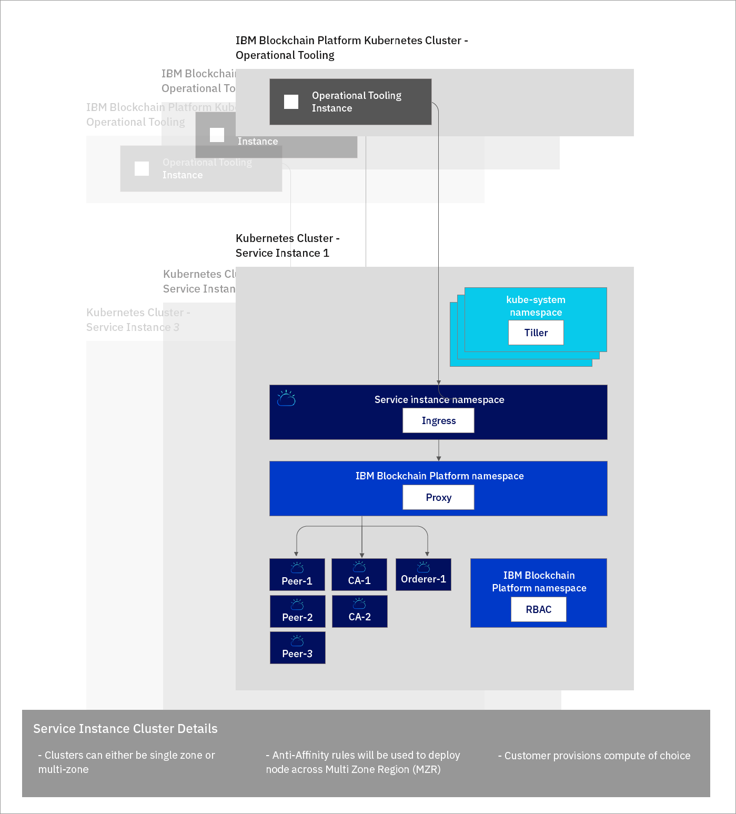

---

copyright:
  years: 2019
lastupdated: "2019-05-16"

keywords: key features, build, operate, grow, architecture, multi-zone clusters

subcollection: blockchain

---

{:new_window: target="_blank"}
{:shortdesc: .shortdesc}
{:screen: .screen}
{:codeblock: .codeblock}
{:note: .note}
{:important: .important}
{:tip: .tip}
{:pre: .pre}

# {{site.data.keyword.blockchainfull_notm}} Platform on {{site.data.keyword.cloud_notm}} について
{: #ibp-console-overview}

{{site.data.keyword.blockchainfull}} Platform on {{site.data.keyword.cloud_notm}} は、デプロイメント、証明書、および秘密鍵を完全に制御できる次世代の {{site.data.keyword.blockchainfull_notm}} Platform オファリングです。これには、新しい {{site.data.keyword.blockchainfull_notm}} Platform コンソールが含まれています。このコンソールは、管理も制御もユーザーが行う {{site.data.keyword.cloud_notm}} Kubernetes Service に、コンポーネントを素早く簡単にデプロイできるユーザー・インターフェースです。Kubernetes と {{site.data.keyword.cloud_notm}} Kubernetes Service について詳しくは、[Kubernetes](/docs/services/blockchain/reference/k8s.html "Kubernetes") を参照してください。
{:shortdesc}

{{site.data.keyword.blockchainfull_notm}} Platform on {{site.data.keyword.cloud_notm}} は、Hyperledger Fabric 1.4.1 に基づいています。Hyperledger Fabric 1.4.1 の新機能について詳しくは、[1.4 の新機能 ](https://hyperledger-fabric.readthedocs.io/en/release-1.4/whatsnew.html "Fabric 1.4 の新機能"){:new_window} を参照してください。

## 新規リリースが提供する機能
{: #ibp-console-overview-capabilities}

この最新リリースは、{{site.data.keyword.blockchainfull_notm}} および Hyperledger Fabric の上級者ユーザー向けに設計されており、ネットワークをホストしたり、他の {{site.data.keyword.blockchainfull_notm}} 2.0 ネットワークに参加できる組織を新規作成したりできます。 スターター・プランまたはエンタープライズ・プランの既存のお客様は、{{site.data.keyword.IBM_notm}} にネットワークを管理してもらうのではなく、お客様自身がお客様の Kubernetes クラスターにコンポーネントをプロビジョンし、モニター、管理して、ネットワークを完全にコントロールできるようになりました。

この {{site.data.keyword.blockchainfull_notm}} Platform リリースには、以下の主要機能が含まれています。

**構築 ---- 一体化された開発者の操作**
- Node.js、Golang、または Java でスマート・コントラクトを**簡単にコーディングし**、新しい {{site.data.keyword.blockchainfull_notm}} VS Code 拡張機能を使用してクライアント・アプリケーションを作成し、コンソールと **SDK の統合**を活用し、豊富なチュートリアルおよびサンプルを参考にすることができます。
- **シンプルになった DevOps** により、Kubernetes リソースをスケールアップしてコンポーネントを追加することで、単一の環境で開発からテスト、本番環境へと移行できます。
- **Fabric の最新の主要な機能**。 以下の Hyperledger Fabric v1.4.1 の最新機能を利用できます。
  -  [Raft の順序付けサービス](https://hyperledger-fabric.readthedocs.io/en/release-1.4/orderer/ordering_service.html#raft "Raft の順序付けサービス")]
  - **{{site.data.keyword.cloud_notm}} サービス統合。** {{site.data.keyword.cloud_notm}} Kubernetes Service ダッシュボード、{{site.data.keyword.IBM_notm}} Log Analysis with LogDNA、{{site.data.keyword.cloud_notm}} IAM (ID およびアクセス管理) など、{{site.data.keyword.cloud_notm}} の標準サービスを活用できます。
  - [**プライベート・データ**・コレクション](/docs/services/blockchain/howto/ibp-console-smart-contracts.html#ibp-console-smart-contracts-private-data): ゴシップ・プロトコルにより、許可されたピアでのみ台帳データを共有することでデータ・プライバシーを向上させます。
  - [サービス・ディスカバリー ](https://hyperledger-fabric.readthedocs.io/en/release-1.4/discovery-overview.html "Service discovery"): アプリケーションとネットワークがどのように対話しているかを動的に検出し、更新できます。
  - [チャネル・アクセス制御リスト ](https://hyperledger-fabric.readthedocs.io/en/release-1.4/access_control.html "Access Control Lists"): チャネルおよびスマート・コントラクトのガバナンス・コントロールを強化します。

**操作 --- デプロイメントの完全な制御**
- **必要なコンポーネントのみデプロイする**。 ピアを複数のチャネルおよびネットワークに接続したり、ビジネス・パートナーが接続できる順序付けサービスをホストしたりできます。
- **ID の完全な制御を維持する**。 ノードの管理に使用する鍵を保管および管理できます。{{site.data.keyword.cloud_notm}} に秘密鍵を保管することはありません。
- **操作を一元化できる**。 {{site.data.keyword.blockchainfull_notm}} Platform コンソールにより、すべての組織とノードのデプロイおよび管理を、**中央の 1 つのコンソール**で行えるので、順序付けプログラムや認証局の管理を {{site.data.keyword.IBM_notm}} や他のベンダーに委ねる必要がありません。 また、ブロックチェーン・コンソーシアムのメンバーの追加/削除、チャネルの作成およびチャネルへの参加、スマート・コントラクトのインストールおよびインスタンス化もコンソールから行えます。
- **ネットワークをホストする、またはネットワークに参加する**。 クラスターでホストされるピアを、複数のクラウド上の複数のチャネルにデプロイできます。また、コンソーシアムやチャネルに参加するように他の組織を招待できます。それらの組織は、インフラストラクチャーをまたいで自ノードを独立して管理することができます。
- **アクセスを管理できる**。ノードを管理またはモニターできるユーザーのアクセスを管理できます。
- **ログに直接アクセスできる**。{{site.data.keyword.IBM_notm}} Kubernetes サービスのノードのログに直接アクセスできます。 {{site.data.keyword.cloud_notm}} Log Analysis サービスまたはサード・パーティーのサービスを使用して、ログを抽出し、分析できます。
- Kubernetes ダッシュボードを使用して、**ポッドと直接対話できる**。コマンド・ラインからポッドおよびコンテナーの中にアクセスし、コマンドを実行したり、証明書を更新したりできます。
- **動的な署名の収集**。これにより、チャネルの構成に対する共同のガバナンスの制御を改善できます。

**拡張 --- スケーラビリティーと柔軟性**
- **コンピュート能力を選択できる**。Kubernetes クラスターにプロビジョンする CPU、メモリー、およびストレージの容量を柔軟に選択できます。 詳しくは、[{{site.data.keyword.cloud_notm}} Kubernetes Service とコンソールの対話](/docs/services/blockchain/howto/ibp-console-govern.html#ibp-console-govern-iks-console-interaction)を参照してください。
- Kubernetes クラスターのリソースを**拡張/縮小**して、必要な分のみ支払うことができます。 詳しくは、[料金](/docs/services/blockchain/howto/pricing.html#ibp-pricing)を参照してください。
- **災害復旧および複数地域による高可用性。**このオプションにより、Kubernetes のデプロイメントを地域間で複製し、コンポーネントの高可用性 (HA) と災害復旧 (DR) を実現できます。
- **どこでも実行可能** (手順は近日公開)。{{site.data.keyword.blockchainfull_notm}} Platform コンソールの**統合コードベース**により、{{site.data.keyword.cloud_notm}}、{{site.data.keyword.cloud_notm}} Private、およびサード・パーティーのパブリック・クラウドでコンポーネントを実行できます。

ブロックチェーンをあらゆるビジネス・シーンに導入するための次の段階に踏み出すことについては、この [ ブログ ](https://www.ibm.com/blogs/blockchain/2019/02/taking-the-next-step-towards-deploying-blockchain-anywhere "Taking the next step towards deploying blockchain for business anywhere") をご覧ください。

このオファリングは、独自のネットワークの構築および管理を希望する Fabric 上級者ユーザー向けの製品です。

## 考慮事項
{: #ibp-console-overview-considerations}

コンソールをデプロイする前に、以下の考慮事項を理解しておいてください。

- {{site.data.keyword.blockchainfull_notm}} Platform のベータ・トライアルと一般出荷可能 (GA) リリースが使用可能な期間が重複しているため、どのバージョンの {{site.data.keyword.blockchainfull_notm}} Platform を使用しているのかを把握しておくことが重要です。新機能および修正はベータにはプッシュされませんが、{{site.data.keyword.blockchainfull_notm}} Platform の GA バージョンでは使用可能になります。そのため、ベータ・バージョンの {{site.data.keyword.blockchainfull_notm}} Platform を使用している場合は、コンソールの一部のパネルが、一般出荷可能サービス・インスタンスに合わせて最新の情報が記載されている現在の文書とは異なる可能性があります。最新機能をすべて活用するには、新しい GA サービス・インスタンスをプロビジョンすることをお勧めします。プロビジョン方法については、[{{site.data.keyword.blockchainfull_notm}} Platform on {{site.data.keyword.cloud_notm}} の概説](/docs/services/blockchain/howto/ibp-v2-deploy-iks.html#ibp-v2-deploy-iks)を参照してください。

- このリリースでデプロイされるすべてのピアでは、状態データベースとして CouchDB が使用されます。
- Kubernetes クラスターの正常性モニター、セキュリティー、およびロギングの管理は、お客様が行う作業です。 {{site.data.keyword.cloud_notm}} が管理する範囲と、お客様が行う作業範囲について詳しくは、こちらの[情報 ](https://cloud.ibm.com/docs/containers/cs_responsibilities.html#your-responsibilities-by-using-ibm-cloud-kubernetes-service "クラスター管理の責任") を参照してください。
- Kubernetes クラスターのリソース使用量をモニターすることもお客様の作業です。 Kubernetes リソースをモニターするには、{{site.data.keyword.cloud_notm}} Kubernetes ダッシュボードと [{{site.data.keyword.cloud_notm}} SysDig ](https://www.ibm.com/cloud/sysdig "IBM Cloud Monitoring with Sysdig") ツールを組み合わせて使用することをお勧めします。 クラスターのストレージ容量またはパフォーマンスを向上させる必要がある場合は、[既存のボリュームの変更方法に関するこちらの情報 ](https://cloud.ibm.com/docs/containers/cs_storage_file.html#change_storage_configuration "既存のストレージ・デバイスのサイズと IOPS の変更") を参照してください。
- 証明書および秘密鍵の管理および保護は、お客様が行う作業です。 {{site.data.keyword.IBM_notm}} は、お客様の証明書を Kubernetes クラスターにもコンソールにも保管しません。 これらはブラウザーのローカル・ストレージにしか保管されません。 ブラウザーを変更する場合は、作成した ID をそのブラウザーにインポートする必要があります。
- {{site.data.keyword.blockchainfull_notm}} Platform は、特定の地域でのみ使用可能です。最新のリストは、[{{site.data.keyword.blockchainfull_notm}} Platform のロケーション](/docs/services/blockchain/howto?topic=blockchain-ibp-regions-locations)に関するトピックを参照してください。
- {{site.data.keyword.cloud_notm}} Kubernetes クラスターの Kubernetes のバージョンは 1.11 以上でなければなりません。 [アップグレード手順](/docs/services/blockchain/howto/ibp-v2-deploy-iks.html#ibp-v2-deploy-iks-updating-kubernetes)に従って、新規および既存のクラスターをこのバージョンにアップグレードしてください。
- Kubernetes クラスター用のストレージをプロビジョンして、それをクラスターのデフォルトのストレージ・クラスにする必要があります。このストレージは、ピア、順序付けサービス、および認証局のノードによって使用されます。プロビジョンするストレージのタイプを決定するには、[Kubernetes ストレージ ](/docs/containers?topic=containers-kube_concepts "Kubernetes ストレージの基本について") に関するトピックを参照してください。
- ご使用の {{site.data.keyword.blockchainfull_notm}} Platform サービス・インスタンスを {{site.data.keyword.cloud_notm}} Kubernetes 無料クラスターにリンクすれば、{{site.data.keyword.blockchainfull_notm}} Platform を 30 日間無料でプレビューできます。スループット、ストレージ、および機能性の面でパフォーマンスが制限されます。無料クラスターは 30 日後に {{site.data.keyword.cloud_notm}} によって削除され、無料クラスターから有料クラスターにノードやデータをマイグレーションすることはできません。また、{{site.data.keyword.blockchainfull_notm}} Platform のベータ・トライアルは無料ですが、制限付きの無料クラスターではなく、有料の Kubernetes クラスターを選択した場合は、ご使用の {{site.data.keyword.cloud_notm}} アカウントに対して Kubernetes サービスの料金が請求されます。

## マイグレーション
{: #ibp-console-overview-migration}

現時点では、いずれの {{site.data.keyword.blockchainfull_notm}} Platform オファリングからも、{{site.data.keyword.blockchainfull_notm}} Platform on {{site.data.keyword.cloud_notm}} にマイグレーションすることはできません。

いずれの {{site.data.keyword.blockchainfull_notm}} Platform ベータ・トライアル・サービス・インスタンスも、一般出荷可能 (GA) リリースにマイグレーションすることはできません。

## ライセンスおよび料金
{: #ibp-console-overview-license-and-pricing}

{{site.data.keyword.blockchainfull_notm}} Platform on {{site.data.keyword.cloud_notm}} では、仮想プロセッサー・コア (VPC) の使用量に基づく、新しい時間課金制モデルが導入されています。この簡略化されたモデルは、{{site.data.keyword.blockchainfull_notm}} Platform ノードで使用された CPU (または VPC) の量 (時間単位) に基づきます。料金は **$0.29 USD/VPC 時間**の固定料金で、**1 VPC = 1 CPU** です。詳しくは、[料金](/docs/services/blockchain?topic=blockchain-ibp-console-overview)に関するトピックを参照してください。

## 開始
{: #ibp-console-overview-deploy}

{{site.data.keyword.blockchainfull_notm}} Platform on {{site.data.keyword.cloud_notm}} のデプロイ方法について詳しくは、[{{site.data.keyword.blockchainfull_notm}} Platform on {{site.data.keyword.cloud_notm}} の概説](/docs/services/blockchain/howto/ibp-v2-deploy-iks.html#ibp-v2-deploy-iks)を参照してください。

コンソールでノードをデプロイしてコンソーシアムを構築する方法について詳しくは、[ネットワーク構築](/docs/services/blockchain/howto/ibp-console-build-network.html#ibp-console-build-network)チュートリアルを参照してください。 このチュートリアルでは、コンソールを使用して、3 つの組織、1 つの順序付け組織、2 つのピア組織、および 2 つのピアが参加する 1 つのチャネルで構成されるサンプル・ネットワークを作成する方法を順を追って説明します。 このサンプル・ネットワークを使用して、デモや PoC (概念検証) を行ったり、チュートリアルの手順を調整および拡張して独自のカスタム・ブロックチェーン構成を作成したりできます。

## アーキテクチャー・リファレンス
{: #ibp-console-overview-architecture}

次の図は、ブロックチェーン・ネットワークの各コンポーネントと、それらのコンポーネントがどのように対話するかを示しています。

*図 1. アーキテクチャー・リファレンス*

{{site.data.keyword.blockchainfull_notm}} Platform サービス・インスタンスごとに、コンソール (操作ツールとも呼ばれます) の単一インスタンスがどのように作成されるか確認してください。 コンソールを使用してデプロイしたピア、順序付けプログラム、または CA ノードは、**Kubernetes クラスター・サービス・インスタンス**にデプロイされます。

| **{{site.data.keyword.blockchainfull_notm}} Platform の Kubernetes クラスター** | **説明** |
| ------------------------- |-----------|
| 操作ツール | `コンソール`とも呼ばれます。すべてのブロックチェーン・コンポーネントを操作するための中央のユーザー・インターフェースです。 このコンソールを使用して、CA、ピア、および順序付けプログラムのノードの作成、チャネルの作成、また、Hyperledger Fabric v1.4 VS Code 拡張機能を使用して開発したスマート・コントラクトのインストールおよびインスタンス化を行えるようになりました。このコンソールは、{{site.data.keyword.IBM_notm}} 所有のクラスターにデプロイされます。 このツールおよびツールが実行される Kubernetes クラスターに対しては課金されません。|


| **Kubernetes クラスター・サービス・インスタンス** | **説明** |
| ------------------------- |-----------|-----------|-----------|
| **Tiller** | Tiller は、[Helm ツール ](https://docs.helm.sh/glossary/#tiller "Tiller") の一部であり、Kubernetes クラスター内で実行され、ピア、CA、および順序付けプログラムの Helm チャートを管理します。 |
| **Ingress** | クラスターの外部からクラスター・リソースにアクセスできるようにする [Kubernetes オブジェクト ](https://kubernetes.io/docs/concepts/services-networking/ingress/ "Ingress")。 |
| **プロキシー** | {{site.data.keyword.blockchainfull_notm}} Platform プロキシーは、ホスト・ヘッダー・ルーティングを使用して、トラフィックを正しいピア、CA、および順序付けプログラム・ノードに転送します。 |
| **ピア、CA、順序付けプログラム** | これらは、基礎の Helm チャートをデプロイすることで作成されるノードです。 注: これらのノードは、他の Kubernetes クラスター・サービス・インスタンスからインポートすることもできます。 {{site.data.keyword.IBM_notm}} は鍵を保管しないので、すべてのピア・ノードと順序付けプログラム・ノードに gRPC Web プロキシーが含まれています。このプロキシーにより、コンソールはコンソール・ウォレット内の鍵を使用して各ノードと通信できます。 |
| **RBAC** | 役割ベースのアクセス制御。  {{site.data.keyword.blockchainfull_notm}} Platform は、クラスター内のブロックチェーン・コンポーネントを管理するために必要な [Kubernetes RBAC ](https://kubernetes.io/docs/reference/access-authn-authz/rbac/ "Using RBAC Authorization") をクラスター内に構成します。  |

## {{site.data.keyword.blockchainfull_notm}} Platform での複数ゾーン (MZR) クラスターの使用
{: #ibp-console-mzr}

{{site.data.keyword.cloud_notm}} Kubernetes クラスターをプロビジョンする場合のデフォルト構成オプションは、単一の地域内に複数のゾーンを設定することです。これは必須ではありませんが、この機能を使用することで、複数の異なるゾーンにわたってブロックチェーン・コンポーネントをデプロイできます。

有料 Kubernetes クラスターで複数ゾーンの地域を使用することに決めた場合は、複数ゾーン・ストレージを有効にする必要があります。
{: important}

さまざまな [Kubernetes ストレージ・オプション](https://cloud.ibm.com/docs/containers/cs_storage_planning.html#persistent_storage_overview)が用意されています。 近日、IBM Cloud は、推奨ソリューションである Portworx ストレージ・ソリューションをサポートする予定です。 それまでは、クラスターに複数ゾーン・サポートを含めるには、独自のストレージ・ソリューションを用意する必要があります。  

独自のストレージ・ソリューションを追加するには、カスタマイズ型のストレージ・クラスを作成する必要があります。 ソリューションに[ストレージ・クラスを追加](https://cloud.ibm.com/docs/containers/cs_storage_basics.html#storageclasses)する方法を参照してください。 {{site.data.keyword.blockchainfull_notm}} Platform では、`デフォルト`のストレージ・クラスで[動的ボリューム・プロビジョニング](https://cloud.ibm.com/docs/containers/cs_storage_basics.html#dynamic_provisioning)を使用します。 そのため、デフォルトのストレージ・クラスを変更するために、次のコマンドを実行してください。

```
kubectl patch storageclass <storageclass> -p '{"metadata": {"annotations":{"storageclass.kubernetes.io/is-default-class":"true"}}}'
```
{:codeblock}

``<storageclass>`` は、使用するストレージ・クラスの名前に置き換えてください。

最後に、有料のクラスターを作成するときに忘れずに複数ゾーン地域を有効にしてください。

## サポートについて
{: #ibp-console-overview-support}

{{site.data.keyword.blockchainfull_notm}} Platform on {{site.data.keyword.cloud_notm}} に関するサポートを受ける方法、および問題のトラブルシューティングに利用できるブロックチェーン開発者向けの無料リソースとサポート・フォーラムについて詳しくは、[サポートについて](/docs/services/blockchain/ibmblockchain_support.html#blockchain-support)を参照してください。

{{site.data.keyword.blockchainfull_notm}} Platform ベータ・トライアルのサポートは、2019 年 8 月 3 日に終了するベータ期間内にのみ利用できます。
