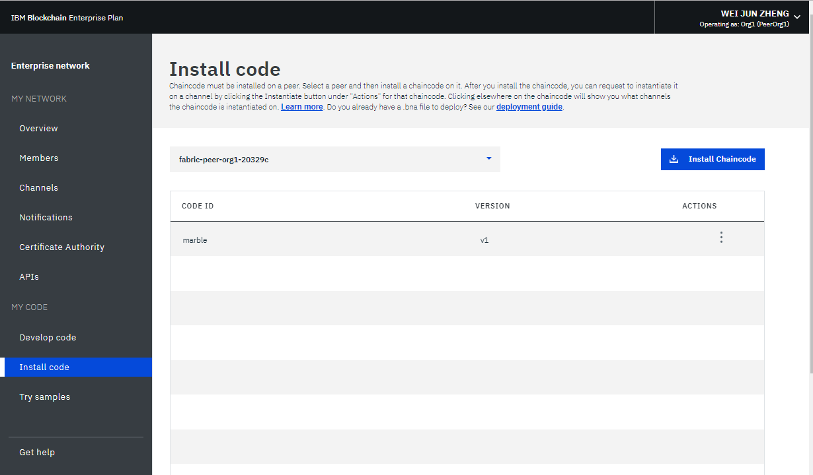
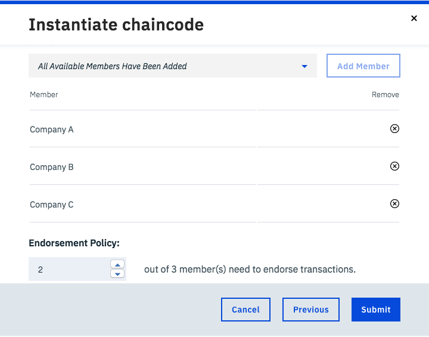
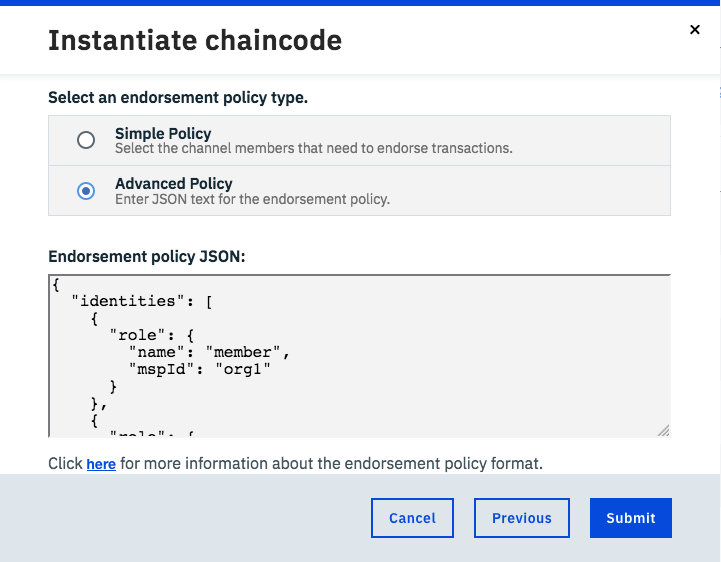

---

copyright:
  years: 2018,2019
lastupdated: "2019-04-23"

subcollection: blockchain

---

{:new_window: target="_blank"}
{:shortdesc: .shortdesc}
{:codeblock: .codeblock}
{:screen: .screen}
{:pre: .pre}

# チェーンコードのインストール、インスタンス化、および更新
{: #install-instantiate-chaincode}

チェーンコードとは、台帳内の資産を作成および変更するためのビジネス・ロジックとトランザクション命令をカプセル化したソフトウェアです。 チェーンコードはさまざまな言語で作成でき、{{site.data.keyword.blockchainfull}} Platform は Go および Node.js チェーンコードをサポートしています。 チェーンコードは、これと対話する必要のある任意のピアに関連付けられた Docker コンテナーで実行されます。 チェーンコードの開発方法について詳しくは、[Chaincode Tutorials ](http://hyperledger-fabric.readthedocs.io/en/release-1.2/chaincode.html) を参照してください。
{:shortdesc}

チェーンコードは、ピアにインストールされた後、チャネルに対してインスタンス化されます。 **チェーンコードを使用してトランザクションを送信したりデータを読み取ったりするメンバーはすべて、そのチェーンコードをピアにインストールする必要があります。** チェーンコードは、名前とバージョンによって定義されます。 インストールされているチェーンコードの名前とバージョンの両方が、同一チャネル上のすべてのピアで一致していなければなりません。

チェーンコードが各ピアにインストールされた後、単一のネットワーク・メンバーがそのチェーンコードをチャネルに対してインスタンス化します。 この操作を実行するには、そのネットワーク・メンバーがチャネルに参加していなければなりません。 インスタンス化すると、チェーンコードで使用される初期データが入力されます。そして、チェーンコードがインストールされていて、チャネルに参加しているピア上でチェーンコード・コンテナーが開始されます。 これにより、ピアは、実行中のコンテナーを使用してトランザクションを実行できるようになります。 **チェーンコードをインスタンス化する必要があるネットワーク・メンバーは 1 つのみであることに注意してください。** チェーンコードをインストールされたピアが、既にインスタンス化されたチャネルに参加すると、チェーンコード・コンテナーが自動的に開始されます。

**インストールとインスタンス化**の組み合わせは強力な機能です。これにより、ピアは単一のチェーンコードを多くのチャネルで使用できるからです。 使用するチェーンコードは同じでも、データにアクセスできるネットワーク・メンバーが異なる複数のチャネルにピアが参加する必要がある場合があります。 ピアは、チェーンコードを 1 回インストールすれば、同じチェーンコードがインスタンス化されているすべてのチャネルで、そのチェーンコード・コンテナーを使用できます。 この軽量なアプローチは、コンピュートおよびストレージ・スペースを節約できるので、ネットワーク拡張の役に立ちます。

## チェーンコードのインストール
{: #install-instantiate-chaincode-install-cc}

このチェーンコードを実行するすべてのピアにチェーンコードをインストールする必要があります。 以下の手順を実行して、チェーンコードをインストールします。
1. ネットワーク・モニターの「コードのインストール (Install Code) 」画面で、チェーンコードのインストール先のピアをドロップダウン・リストから選択します。 **「チェーンコードのインストール (Install Chaincode)」**ボタンをクリックします。
<!--
  
-->

2. **「チェーンコードのインストール (Install Chaincode)」**ポップアップ・パネルで、チェーンコードの名前とバージョンを入力します。 この名前とバージョンのストリングは、インストールされたチェーンコードと対話するためにアプリケーションで使用されることに**注意**してください。 **「参照」**ボタンをクリックし、ローカル・ファイル・システム内でチェーンコード・ソース・ファイルが格納されている場所にナビゲートします。 ピアにインストールするチェーンコードのソース・ファイルを 1 つ以上選択します。 次に、**「チェーンコード・タイプ (Chaincode Type)」**ドロップダウンからチェーンコード言語を選択します。

1 つまたは複数の GO あるいは NODE ファイルをアップロードすることによってチェーンコードをインストールするか、.zip ファイルに含めてチェーンコードをアップロードすることができます。 .zip ファイルを使用すると、チェーンコードが完全なディレクトリー構造で保持されます。 このことは、従属関係のパッケージを含めたり、CouchDB で索引を使用したりする場合に役立ちます。 CouchDB について、および索引のセットアップ方法について詳しくは、アプリケーションの開発チュートリアルの [CouchDB を使用する場合のベスト・プラクティス](/docs/services/blockchain/best_practices.html#best-practices-app-couchdb-indices)を参照してください。 Hyperledger Fabric の資料で、[GO で作成されたチェーンコードの外部依存関係の管理 ](https://hyperledger-fabric.readthedocs.io/en/release-1.2/chaincode4ade.html#managing-external-dependencies-for-chaincode-written-in-go){:new_window} に関する情報を参照することもできます。

  

## チェーンコードのインスタンス化
{: #install-instantiate-chaincode-instantiate-cc}

チャネルに参加するすべてのピアのファイル・システムにチェーンコードがインストールされた後、チャネル上でチェーンコードをインスタンス化して、ピアがチェーンコード・コンテナーを介して台帳と対話できるようにする必要があります。 このインスタンス化により、必要なチェーンコードの初期化が実行されます。 多くの場合、これにはチェーンコードの初期ワールド・ステートを構成するキーと値のペアの設定が含まれます。

チェーンコードをインスタンス化するには、チャネルに対する**オペレーター**または**ライター**の権限が必要です。 複数の異なるピア上にある同じ名前とバージョンのチェーンコードは、チェーンコード・コンテナーをデプロイするために 1 回だけインスタンス化する必要があります。 以下の手順を実行して、チェーンコードをインスタンス化します。
1. ネットワーク・モニターの「コードのインストール (Install Code)」画面で、チェーンコードをインストールしたピアを選択し、インスタンス化するチェーンコードをチェーンコード表から見つけます。 その後、**「アクション」**ヘッダーの下にある**「インスタンス化」**ボタンをクリックします。
<!--
  
-->

2. **「チェーンコードのインスタンス化 (Instantiate Chaincode)」**ポップアップ・パネルで、チェーンコードの初期化の引数としてキーと値のペアを設定し、インスタンス化するチャネルを選択します。  **「次へ」**をクリックします。
<!--
  
-->

3. チェーンコードの[エンドースメント・ポリシー](/docs/services/blockchain/glossary.html#glossary-endorsement-policy)を指定します。 エンドースメント・ポリシーを設定する方法について詳しくは、[次のセクション](#install-instantiate-chaincode-endorsement-policy)を参照してください。

## チェーンコードのエンドースメント・ポリシーの指定
{: #install-instantiate-chaincode-endorsement-policy}

エンドースメント・ポリシーを使用して、新規トランザクションを検証する必要のあるピアのセットを指定できます。 例えば、エンドースメント・ポリシーで、チャネルのメンバーの大多数がトランザクションを承認する場合にのみそのトランザクションが台帳に追加されることを指定できます。

エンドースメント・ポリシーは、チャネルでチェーンコードがインスタンス化されるときに設定されます。 チェーンコードをインスタンス化する組織は、チェーンコードをインストールしたチャネル・メンバーの中からどのメンバーがバリデーターになるのかを選択でき、すべてのチャネル・メンバーのエンドースメント・ポリシーを設定します。 [チェーンコードの更新](/docs/services/blockchain/howto/install_instantiate_chaincode.html#install-instantiate-chaincode-update-cc)のステップに従い、2 つ目のステップでチェーンコードを再インスタンス化する際に新規ポリシーを指定することによって、エンドースメント・ポリシーを更新することができます。

ネットワーク・モニターを使用してエンドースメント・ポリシーを設定する場合、UI を使用して**単純ポリシー**を指定するか、または JSON を使用して**拡張ポリシー**を指定することができます。

* **UI を使用した単純ポリシーの指定:** まず、**「メンバーの追加」**ボタンをクリックしてトランザクションを検証できるメンバーのセットを選択します。 次に、**「エンドースメント・ポリシー (Endorsement Policy)」**セクションで、トランザクションが承認済みになる前にリスト内のいくつのメンバーによってこのトランザクションが検証される必要があるかを決定します。 この方法を使用して、すべてのチャネル・メンバー、大多数のチャネル・メンバー、1 つのメンバー、または単純ポリシーに自己署名できない 1 つのメンバーを加えた場合 (5 つのメンバーのうちの 2 つなど) のエンドースメント・ポリシーを指定することができます。 何も変更しない場合、デフォルト・ポリシーによってチャネルのすべてのメンバーがトランザクションを承認することができます。

  

* **JSON を使用した拡張ポリシーの指定:** 拡張ポリシーを指定し、重要なメンバーまたは管理者によるエンドースメントを必須とするか、特定のメンバーのエンドースメントに付与する重みづけを大きくします。

  拡張ポリシーを指定する最も簡単な方法は、UI 画面を使用して単純ポリシーの構築から開始することです。 次に、**「拡張ポリシー (Advanced Policy)」**ボタンをクリックすると、単純ポリシーで設定したものと同じメンバーとルールが、JSON バージョンのポリシーに自動入力されます。 これで、JSON を編集してより拡張されたバージョンを記述できるようになります。 JSON でのエンドースメント・ポリシーの記述について詳しくは、[Hyperledger Fabric ノード SDK の資料](https://fabric-sdk-node.github.io/global.html#ChaincodeInstantiateUpgradeRequest) を参照してください。<!--You can also find examples of advanced endorsement policies in the main [Hyperledger Fabric documentation](https://hyperledger-fabric.readthedocs.io/en/release-1.2/arch-deep-dive.html#example-endorsement-policies)-->

  

エンドースメント・ポリシーは、新規組織がチャネルに参加してチェーンコードをインストールしたときに、自動的には更新されません。 例えば、トランザクションを承認するために 5 つの組織のうち 2 つを必要とするポリシーは、新しい組織がチャネルに参加したときに、6 つの組織のうち 2 つを必要とするようには更新されません。 代わりに、新規組織はポリシーにリストされず、トランザクションを承認することはできません。 新規組織をエンドースメント・ポリシーに追加するには、関連するチェーンコードを更新します。

## チェーンコードの更新
{: #install-instantiate-chaincode-update-cc}

チェーンコードを更新して、台帳上の資産との関係を維持しながら、チェーンコードのプログラミングを変更することができます。 インストールとインスタンス化は結びついているため、このチェーンコードを使用してチャネル上のすべてのピアでチェーンコードを更新する必要があります。 チェーンコードを更新するには、以下の手順を実行します。

1. 古いチェーンコードと同じ名前で別のバージョンのチェーンコードをインストールします。 [チェーンコードのインストール](/docs/services/blockchain/howto/install_instantiate_chaincode.html#install-instantiate-chaincode-install-cc)と同じ手順に従うことができます。 元のチェーンコードと同じチャネルを選択してください。

  

2. 表で新しいチェーンコードを見つけて、**「アクション」**ヘッダーの下の**「更新」**ボタンをクリックします。 このアクションは、チェーンコードを再インスタンス化し、チェーンコード・コンテナーを新しいコンテナーに置き換えます。 **「更新」**ボタンをクリックしたときに、チェーンコードのエンドースメント・ポリシーを更新できます。
組織が最近チャネルに追加された場合は、これを実行することが重要です。 更新関数の一部として新しい引数を入力する必要はないことに注意してください。 このアップグレード・アクションはチャネルに対して実行されます。このアクションを実行する必要がある組織は 1 つのみです。

  
