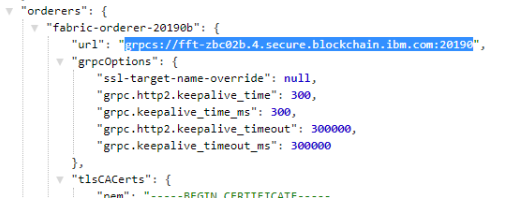
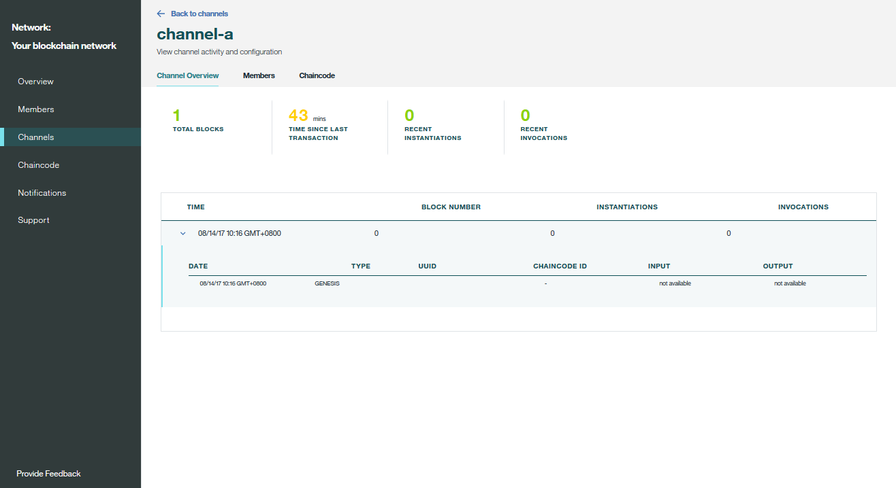

---

copyright:
  years: 2017, 2018
lastupdated: "2018-10-04"

---

{:new_window: target="_blank"}
{:shortdesc: .shortdesc}
{:screen: .screen}
{:codeblock: .codeblock}
{:pre: .pre}

# ブロックチェーン・ネットワークのモニタリング


***[このページは参考になりましたか。 ご意見をお聞かせください。](https://www.surveygizmo.com/s3/4501493/IBM-Blockchain-Documentation)***


このチュートリアルでは、{{site.data.keyword.cloud_notm}} で{{site.data.keyword.blockchain}}・ネットワークの状況情報を表示し、モニターする方法を示します。
{:shortdesc}


## ピア、順序付けプログラム、および CA のモニタリング
{: #monitor-nodes}

ネットワーク・ノードのいずれかに対して HTTP **HEAD** 要求を発行し、ノード状況を確認できます。 ネットワーク・ノードとしては、ブロックチェーン・ネットワーク内のピア、順序付けプログラム、または CA があります。 **HEAD** 要求は GET 要求に似ており、本文のないヘッダーのみを送信します。 ノードが正常に機能している場合は、200 応答を取得します。

1. ネットワーク・モニターの「概要」画面で、**「接続プロファイル」**をクリックします。 次に、**「未加工の JSON」**をクリックして、Web ブラウザーで接続プロファイルを表示するか、**「ダウンロード」**をクリックして接続プロファイルをローカルに保存することができます。
2. 接続プロファイルで、確認するネットワーク・ノードの URL 情報を見つけます。 例えば、`fabric-orderer-20190b` 順序付けプログラムの URL は `grpcs://fft-zbc02b.4.secure.blockchain.ibm.com:20190` です。
    
3. URL 内の **grpcs** を **https** に置き換えます。 上記の例では、URL は `https://fft-zbc02b.4.secure.blockchain.ibm.com:20190` になります。
4. curl または Chrome Postman アプリなどのツールを使用して、URL に対して **HEAD** 要求を発行します。
    - 200 状況応答を受け取った場合、ネットワーク・ノードは正常に機能しています。
    - **HEAD** 要求が接続エラーで失敗する場合は、ネットワーク・ノードが稼働していない可能性があるか、ノードの URL が間違っているか、ファイアウォールによってノードへのアクセスがブロックされています。  このエラーを解決する必要があります。解決しないと、アプリケーションがノードに接続できません。

以下の例に、curl での **HEAD** 要求と 200 応答を示します。 HTTP **HEAD** 要求によりノードがアクセス可能かどうかが確認されるため、grpc エラーは無視することができます。 アクセス可能な場合、アプリケーションではノードに対する grpc 要求も機能します。

```
C:\>curl -i --head https://fft-zbc02b.4.secure.blockchain.ibm.com:20190
HTTP/2 200
contnent-type: application/grpc
grpc-status: 8
grpc-message: malformed method name: "/"
```
{:codeblock}

以下の例は、curl での **HEAD** 要求と接続エラーを示しています。

```
C:\>curl -i --head https://fft-zbc02b.4.secure.blockchain.ibm.com:20190
curl: (7) Failed to connect to fft-zbc02b.4.secure.blockchain.ibm.com:20190: Connection refused
```
{:codeblock}

以下の図は、Chrome Postman アプリでの **HEAD** 要求と 200 応答を示しています。

  

## ネットワーク・ログの使用
ネットワーク・モニターの「概要」画面には、順序付けサービス、認証局、ピアの状況が表示されます。 特定のネットワーク・コンポーネントのログを表示するには、**「アクション」**ヘッダーの下のドロップダウン・リストから**「ログの表示」**をクリックします。 エンタープライズ・プラン・ネットワークを使用している場合は、テキスト・ファイル・フォーマットでコンポーネント・ログを表示できます。 スターター・プラン・ネットワークを使用している場合は、コンポーネント・ログは [{{site.data.keyword.cloud_notm}} Log Analysis サービス ](https://console.bluemix.net/catalog/services/log-analysis) によって収集され、[Kibana](#viewing-logs-in-kibana-in-starter-plan) でそのログを表示できます。

コンポーネントごとに、さまざまなアクティビティーのログが生成されます。 これは、各コンポーネントが Hyperledger Fabric の[ネットワーク・アーキテクチャー ](https://hyperledger-fabric.readthedocs.io/en/release-1.2/network/network.html) と[トランザクション・フロー ](https://hyperledger-fabric.readthedocs.io/en/release-1.1/txflow.html) 内で異なる役割を担っているためです。

- **順序付けサービスのログ**
  順序付けサービスは、ブロックチェーン・ネットワークの共通バインディング・コンポーネントです。 ピア、チャネル更新、ネットワーク・メンバーシップ更新による、すべての承認済みトランザクション・プロポーザルは、検証のために順序付けサービスに送信されます。 したがって、順序付けサービスには、ネットワークが開始された時点からのログが含まれています。 また、正しい組織によって適切に承認されなかったために拒否されたトランザクションについてのログも含まれます。 チャネルが作成または更新された、またはチャネルの更新が失敗した時点からのログも表示できます。

- **認証局のログ**
  認証局によってネットワーク内の参加者の ID が管理されます。 認証局のログでは、参加者がネットワークで通信するために公開鍵と秘密鍵を生成 (登録) した時点、または認証局を使用して新規にメンバー、ピア、アプリケーションが登録された時点からのログを表示できます。 認証の検査で問題が発生した場合に、CA ログを使用してデバッグすることもできます。

- **ピアのログ**  
  ピアのログには、チェーンコードのインストール、インスタンス化、および呼び出しの結果が含まれます。 チェーンコードの名前とバージョンを検索すると、特定のチェーンコードのログを表示できます。 また、[チャネル・モニターのチェーンコードのセクション](#monitor-channel-cc)でも、特定のチェーンコードのログを表示できます。 メッセージ (トランザクション・プロポーザルによって生成されたもの) や、プロポーザル要求でのタイムアウト問題についても、ピアのログに表示されます。 ピア・ログには、[チェーンコードのエンドースメント・ポリシー](install_instantiate_chaincode.html#endorsement-policy)を満たしていないために拒否されたトランザクションからのエラーも含まれています。チャネル結合の要求結果も表示されます。

Hyperledger Fabric では、メッセージの重大度に基づくさまざまな[ロギング・レベル ](https://hyperledger-fabric.readthedocs.io/en/release-1.1/logging-control.html "logging control") が提供されます。 {{site.data.keyword.blockchainfull_notm}} Platform でのデフォルト・ロギング・レベルは、`INFO` です。 追加のログを表示するには、[サポート・チケット](../ibmblockchain_support.html#submitting-support-cases)を開いて、より詳細な `DEBUG` にロギング・レベルを設定します。 `DEBUG` レベルのログでは、大量のゴシップ・メッセージが表示されるので、フィルタリングが必要かもしれません。 Hyperledger Fabric コンポーネントの問題を検出するには、メッセージ内の `warning` または `error` を検索してください。 コンポーネント・コンテナーが失敗または強制終了したかどうかを検出するには、{{site.data.keyword.cloud_notm}} が送信した `panic` または `killed` のメッセージを検索してください。

## スターター・プランの Kibana でのログ表示
スターター・プラン・ネットワークのログは、[{{site.data.keyword.cloud_notm}} Log Analysis サービス ](https://console.bluemix.net/catalog/services/log-analysis "Log Analysis サービス") によって収集されます。 デフォルトでは、ログは Log Analysis サービスのライト・プランで収集されます。 このプランは無料であり、**ログは 3 日間保管**されてから廃棄されます。 また、**1 日当たりログの最初の 500 MB のみ検索可能**です。 ネットワーク・ログが 500 MB を超えると、Kibana で新規ログを表示することはできません。 ネットワークで 500 MB より大きいログが生成される場合や、3 日を超えてログを保持する場合は、有料版の Log Analysis サービスにアップグレードすることができます。

Kibana インターフェースで各ネットワーク・コンポーネントのログを開くには、ネットワーク・モニターの「概要」画面で、**「アクション」**ヘッダーの下のドロップダウン・リストから**「ログの表示」**をクリックします。 Kibana が開いて、上部の検索バーによってフィルタリングされたログが表示されます。 例えば、ピアのログをクリックして表示すると、検索はネットワーク ID とピア ID の `NETWORK_ID_str:"nf8389d520c243004bb21ff5d70fc8939" && NODE_NAME_str:"org1-peer1"` によってフィルタリングされています。 さらに具体的なログを表示する場合は、検索バーに追加のフィールドを入力できます。 例えば、`"marbles"` チェーンコードのログを表示するには、`&& "marbles"` を追加します。 特定のコンポーネント条件を削除して、ネットワーク ID でのみ検索すると (例えば、`NETWORK_ID_str:"nf8389d520c243004bb21ff5d70fc8939"`)、すべてのネットワーク・コンポーネントのログが表示されます。

右上隅にある時刻範囲のボタンを使用すると、ログの表示される期間を変更できます。 画面の左側にあるタブを使用すると、検索のフィールドを追加したり削除したりすることができます。 最も重要な表示フィールドは、メッセージ・フィールドです。 タイム・スタンプなしでメッセージを検索すると、メッセージ・ログのすべてのインスタンスが検索されて便利です。 **「保存」**ボタンをクリックすると、現行の検索が保存されて、特定のビューに戻ります。 Kibana でのデータ表示について詳しくは、[Kibana User Guide ](https://www.elastic.co/guide/en/kibana/6.2/index.html "Kibana User Guide") を参照してください。 Log Analysis CLI を使用して、ローカル・ファイル・システムに[ログをダウンロード](https://console.bluemix.net/docs/services/CloudLogAnalysis/how-to/manage-logs/downloading_logs_cloud.html#downloading_logs)することもできます。

**注:** デフォルトでは、Kibana は30 日間のアクティビティーのログを表示するように事前構成されています。 直近 30 日間にアクティビティーがない場合は、「*No results found*」というメッセージが表示されます。 他のログを表示するには、ユーザー名の下の右上隅にあるタイマー・アイコンをクリックし、*過去 1 年間* などの広い時刻範囲を設定します。

## チャネルのモニター
{: #monitor-channnels}

ネットワーク・モニターを開始し、「チャネル」画面で表示してモニターするチャネルを見つけます。 特定のチャネル画面にある 3 つのタブで、このチャネルのデータ状況情報、メンバー、インスタンス化されたチェーンコードを表示できます。

### チャネルの概要 (Channel Overview)
{: #monitor-channel-overview}

「チャネルの概要 (Channel Overview)」タブには、このチャネルに関する以下のブロック情報が示されます。
  * 作成されたブロックの総数、最後のトランザクション以降の時間、チェーンコードのインスタンス化の数、チェーンコードの呼び出しの数を含む、一連のデータ・ポイント。
  * このチャネルにあるすべてのブロックをリストした表。 ブロックを展開して、そのブロックの詳細情報を表示できます。

  

### メンバー
{: #monitor-channel-members}

「メンバー」タブには、組織のオペレーターの E メール・アドレスなど、このチャネルのメンバーに関する情報が示されます。

  

### チェーンコード
{: #monitor-channel-cc}

「チェーンコード」タブには、このチャネルでインスタンス化されたすべてのチェーンコードがリストされ、チェーンコード ID、バージョン、チェーンコードを実行しているピアの数が示されます。

チェーンコードの行を展開すると、そのチェーンコードの詳細情報が得られます。
  * **「JSON」**をクリックすると、チェーンコードの JSON ファイルを表示できます。
  * **「ログ」**をクリックすると、チェーンコードのログを表示できます。 この表示では、チェーンコードのインストール元のピアとフィルタリングされたチェーンコードの名前とバージョンのログが示されます。

    チェーンコードをモニターしたりデバッグしたりしやすくするため、各チェーンコード関数の後に固有の正常終了メッセージまたはエラー・メッセージを追加することをお勧めします。 多くの異なるファイルを使用する複雑なチェーンコードの場合は、固有のキーワードをチェーンコード・ログに追加すると、さまざまなトランザクションの段階のメッセージが見つけやすくなります。
   * **「削除」**をクリックすると、実行中のチェーンコード・コンテナーを削除できます。 実行中のチェーンコード・コンテナーを削除しても、実際にチェーンコードが削除されるわけではないことに注意してください。 ブロックチェーン・ネットワーク上でインスタンス化されたチェーンコードは削除できません。

  


## ブロックチェーンのモニタリング
{: #monitor-chaincode}

ネットワーク・モニターを入力して、「コードのインストール (Install Code)」画面を開きます。 実行中のチェーンコードがある場合、チェーンコード ID とバージョンとともにそのチェーンコードが表に表示されます。 ドロップダウン・リストからピアを選択すると、このピアのすべてのチェーンコードが表に表示されます。 特定の「チャネル」画面の[「チェーンコード」タブ](#monitor-channel-cc)で、チェーンコードのログを表示できます。

  

<!----
## Monitoring sample applications
{: #monitor-apps}

In a Starter Plan network, you can view and access sample applications in the "Try Samples" screen of the Network Monitor.  After you deploy a sample application, you can click the **Launch** button to enter your application interface, or the **View on GitHub** link to visit the code repository.  For more information, see [Deploying sample applications](/docs/services/blockchain/prebuilt_samples.html).

  
--->
