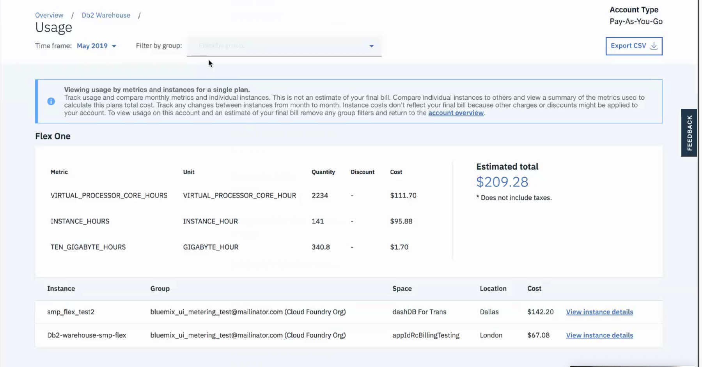

---

copyright:
  years: 2019
lastupdated: "2019-05-16"

keywords: pricing model, hourly, per hour, VPC, CPU, vCPU, virtual core, cost, scalability, estimation, optimize your cost

subcollection: blockchain

---

{:new_window: target="_blank"}
{:shortdesc: .shortdesc}
{:screen: .screen}
{:codeblock: .codeblock}
{:note: .note}
{:important: .important}
{:tip: .tip}
{:pre: .pre}

# 料金
{: #ibp-saas-pricing}

このガイドにより、{{site.data.keyword.blockchainfull}} Platform on {{site.data.keyword.cloud_notm}} の料金モデル、および Hyperledger Fabric v1.4.1 に基づくピア、順序付けプログラム、および認証局のコンポーネントのブロックチェーン・ネットワークを開発して拡大するときに生じる支払い金額を理解することができます。
{:shortdesc}

_この料金モデルの対象は、{{site.data.keyword.blockchainfull_notm}} Platform on {{site.data.keyword.cloud_notm}} のみです。スターター・プランまたはエンタープライズ・プランを使用しており、料金について質問がある場合は、スターター・プランおよびエンタープライズ・プランの[料金](/docs/services/blockchain?topic=blockchain-ibp-pricing)を参照してください。_

{{site.data.keyword.blockchainfull_notm}} Platform では、仮想プロセッサー・コア (VPC) の使用量に基づく新しい時間単位の料金モデルが導入されています。このシンプルになったモデルは、**$0.29 USD/1 時間の VPC** の定額で、{{site.data.keyword.blockchainfull_notm}} Platform ノードが消費した 1 時間当たりの CPU (VPC) の量に基づきます。

VPC は {{site.data.keyword.IBM_notm}} 製品のライセンス交付コストを決定するために使用される単位です。これは、製品で使用可能な仮想コア (vCPU) の数に基づいています。vCPU は、仮想マシンに割り当てられる仮想コア、または物理プロセッサー・コアです。{{site.data.keyword.blockchainfull_notm}} Platform のコスト見積もりの目的では、**1 VPC = 1 CPU = 1 vCPU = 1 コア**です。
{:note}

コスト見積もりの合計について、ブロックチェーン・ネットワークは、{{site.data.keyword.blockchainfull_notm}} Platform コンポーネントを含む {{site.data.keyword.cloud_notm}} Kubernetes クラスターで構成され、選択したストレージを使用することに注意してください。{{site.data.keyword.cloud_notm}} Kubernetes クラスターと選択したストレージには、別個の料金が発生します。操作ツールのインスタンス (コンソールとも呼ばれる) が実行されているクラスターについては、課金されません。図については、[アーキテクチャー・リファレンス](/docs/services/blockchain/howto/ibp-console.html#ibp-console-overview-architecture)のトピックを参照してください。料金の計算方法の詳細は、以下で説明します。

開発者は、無料の [VS Code の拡張機能 ](https://marketplace.visualstudio.com/items?itemName=IBMBlockchain.ibm-blockchain-platform "{{site.data.keyword.blockchainfull_notm}} Platform の VS Code の拡張機能") を開始できます。この統合された開発者環境を使用して、ローカルおよび {{site.data.keyword.blockchainfull_notm}} Platform デプロイメントに対してスマート・コントラクトを作成、テスト、デバッグ、およびパッケージ化したり、クライアント・アプリケーションを作成したりすることができます。最初から開始するか、チュートリアルおよびサンプルにアクセスして、ブロックチェーンの基礎について学習します。

## 新しい料金モデルの利点
{: #ibp-saas-pricing-benefits}

- **メンバーシップ料金なし**: メンバーシップ料金がかからないことは、ブロックチェーン・コンポーネントに直接投資できることを意味します。
- **見積もりの明瞭性**: シンプルな時間単位の料金モデルで、{{site.data.keyword.cloud_notm}} ダッシュボードで使用可能なコスト見積もりツールを使用することにより、コスト見積もりが明確かつ簡単になります。
- **最低限必要な料金なし**: 使用量のみに基づき課金され、最低限必要な VPC の時間単位のパッケージはないため、非常に安価に開始できます。
- **コンピュートのスケーラビリティー**: ピーク使用時にはコンピュートを拡張し、コンピュートが不要な場合は非常に小さい容量まで縮小し、経費を最小限にすることができます。  

つまり、これらの機能により、メンバーシップの制限のアカウンティングまたはニーズを先取りしたコンピュートの購入の複雑さが解消されます。

## コストの主要要素
{: #ibp-saas-pricing-elements}

ブロックチェーン・ネットワークは、{{site.data.keyword.blockchainfull_notm}} Platform コンポーネントを含む {{site.data.keyword.cloud_notm}} Kubernetes クラスターで構成され、選択したストレージを使用するため、以下の各要素が、合計コストを形成します。

- **{{site.data.keyword.blockchainfull_notm}} Platform** の $0.29 USD/1 時間の VPC の定額。
- **{{site.data.keyword.cloud_notm}} Kubernetes Service** クラスターの段階制料金 (有料クラスターのプロビジョン時に {{site.data.keyword.cloud_notm}} に表示されます)。これには、コンピュート、つまり CPU とメモリーの料金が含まれます。{{site.data.keyword.cloud_notm}} Kubernetes Service は、1 カ月当たりの使用時間数に基づく段階制のモデルに従って料金が設定されます。そのため、価格プランを検討するときは、24 時間 365 日の使用は、1 カ月当たり 720 時間に相当することを考慮してください。クラスターの料金の詳細は、[Kubernetes Service のカタログ・ページ ](https://cloud.ibm.com/kubernetes/catalog/cluster "Kubernetes Service") の表を参照してください。
- ニーズに応じた**ストレージ**・プランを選択します。ストレージ・クラスのオプションとその[コスト ](https://www.ibm.com/cloud/file-storage/pricing) の詳細は、[Kubernetes ストレージの基本について](/docs/containers?topic=containers-kube_concepts#kube_concepts)のトピックを参照してください。{{site.data.keyword.blockchainfull_notm}} Platform ノードでは、クラスターのデフォルトのストレージ・クラスが使用されます。{{site.data.keyword.cloud_notm}} で Kubernetes クラスターをプロビジョンするときに、永続ストレージのプラグインとして、[ブロンズ・レベルのファイル・ストレージ](/docs/containers?topic=containers-file_storage#file_predefined_storageclass)で事前構成されます。

## 料金設定の例
{: #ibp-saas-pricing-scenarios}

以下の表は、特に指定のない場合の[デフォルトのリソース割り振り]( #ibp-saas-pricing-default)による料金設定の 2 つの例を示しています。
- **「ネットワークのテスト」**のシナリオは、スマート・コントラクトの開始とテストに最適です。
- **「実動ネットワークへの参加」**のシナリオには、高可用性のために推奨される 2 つのピアと、組織メンバーシップに必要な認証局 (CA) が含まれます。
   - これらのピアは、他の場所でホストされる {{site.data.keyword.blockchainfull_notm}} Platform の実動ネットワークに参加できます。
   - ノードが使用されていない場合は、[コストを抑える](/docs/services/blockchain?topic=blockchain-ibp-console-govern#ibp-console-govern-reallocate-resources)ために、いつでも最小の使用状態 (0.001 CPU) に抑えることができます。
   - このシナリオは、**実稼働**環境を想定しているため、次のようになります。
     - 容量を拡大するために、デフォルトのコンピュート・リソースが 2 倍になっています。
     - パフォーマンスを高速化するために、[シルバー ](/docs/containers?topic=containers-file_storage#file_silver) のストレージ・クラスが選択されます。

| 料金オプション** (1 VPC = 1 CPU)| **ネットワークのテスト** | **実動ネットワークへの参加** |
|-|------------|-----------------------------|
| **CPU 割り振り** |  1.85 CPU   内容:   - 1 つのピア   - 2 つの CA   - 1 つの順序付けプログラム| 4.9 CPU   内容:   - 2 つのピア (HA を確保)   **(デフォルトのコンピュートの 2 倍)**  - 1 つの CA    |
| **1 時間当たりのコスト: {{site.data.keyword.blockchainfull_notm}} Platform** | $0.54 USD   (1.85 CPU x $0.29 USD/1 時間の VPC) | $1.42 USD   (4.9 CPU x $0.29 USD/1 時間の VPC ) |
| **1 時間当たりのコスト: {{site.data.keyword.cloud_notm}} Kubernetes クラスター**    | $0.12 USD   (コンピュート: 2 x 4 層)   (IP 割り当て: $16 USD/月) | $0.46 USD   (コンピュート: 8 x 32 層)   (IP 割り当て: $16 USD/月) |
| **1 時間当たりのコスト: ストレージ** | $0.07 USD   340 GB    [ブロンズ ](https://www.ibm.com/cloud/file-storage/pricing)    2 IOPS/GB | $0.13 USD   420 GB   [シルバー ](https://www.ibm.com/cloud/file-storage/pricing)   4 IOPS/GB  |
| **1 時間当たりのコストの合計** | **$0.73 USD** | **$2.01 USD**| |
** {{site.data.keyword.blockchainfull_notm}} Platform サービス・インスタンスを無料の {{site.data.keyword.cloud_notm}} Kubernetes クラスターにリンクすると、30 日間料金なしで {{site.data.keyword.blockchainfull_notm}} Platform をプレビューできます。スループット、ストレージ、および機能性の面でパフォーマンスが制限されます。{{site.data.keyword.cloud_notm}} では、30 日後に Kubernetes クラスターが削除され、無料のクラスターから有料のクラスターにノードまたはデータを移行することはできません。  

実際のコストは、トランザクション率、必要なチャネル数、トランザクションのペイロード・サイズ、並行トランザクションの最大数などの追加の要素に応じて異なります。
{:note}

プロビジョンして単一の Kubernetes クラスターに関連付けることができるサービス・インスタンスの数に制限はありませんが、サービスが中断されるのを避けるために、CPU、メモリー、およびストレージの使用量をモニターして、十分なリソースを使用できるようにする必要があります。{{site.data.keyword.blockchainfull_notm}} Platform ノードは、その独自のクラスターに属する必要はありません。ブロックチェーン・コンポーネントが実行されているクラスターで、他の {{site.data.keyword.cloud_notm}} サービスを実行することができますが、同様に、すべてのサービス・インスタンスのすべての要件に対応するために、十分なコンピュートとストレージを確保する必要があります。

## デフォルトのリソース割り振り
{: #ibp-saas-pricing-default}

次の表の値は、CPU、コンピュート、およびストレージに基づくカスタム・ネットワークの 1 時間当たりのコストを見積もる場合に便利です。

| **コンポーネント** (すべてのコンテナー) | CPU  | メモリー (GB) | ストレージ (GB) |
|--------------------------------|---------------|-----------------------|------------------------|
| **ピア**                       |  1.2          | 2.4                   | 200 (ピア用に 100 GB と CouchDB 用に 100 GB を含む)|
| **CA**                         | 0.1            | 0.2                    | 20                     |
| **順序付けプログラム**                    | 0.45           | 0.9                    | 100                    |

## 課金
{: #ibp-saas-pricing-billing}

**従量課金**アカウントの請求および使用量の情報は、{{site.data.keyword.cloud_notm}} ダッシュボードの[使用量](https://cloud.ibm.com/billing/usage)のタイルで確認できます。計量サービスによって、{{site.data.keyword.blockchainfull_notm}} Platform の VPC の合計使用量のスナップショットが 1 時間ごとに作成されるため、**「使用量」**タイルには 1 カ月の累積の使用量が反映されます。

新しいノードを作成する場合、{{site.data.keyword.cloud_notm}} ダッシュボードの**「使用量」**タイルで VPC の使用量が更新されるまで、最大で 1 時間かかることがあります。
{:note}

{{site.data.keyword.cloud_notm}} ダッシュボードの上部にある**「管理」**にナビゲートして、**「請求および使用量」**をクリックして、左側のメニューの**「使用量」**をクリックします。**「サービス」**サブセクションの下の円グラフには、その月に使用および消費したサービス・オファリングのタイプ別で、合計コストの明細が示されます。このグラフを使用すると、{{site.data.keyword.blockchainfull_notm}} Platform、Kubernetes サービス、およびストレージがどのように合計コストに寄与しているかを理解できます。

<!--
  
*Figure 1. View your Usage on the dashboard*-->

スクロールダウンすると、リスト表示で、**タイプ**および**コスト**ごとの同様の明細を表示できます。主に、「Kubernetes Service」、「VPC 用のブロック・ストレージ」、「VPC 用のファイル・ストレージ」、および「{{site.data.keyword.blockchainfull_notm}} Platform」があります。これらの各項目の横にある**「プランの表示」**をクリックすると、メトリック別のコストの明細について理解できます。例えば、`VIRTUAL_PROCESSOR_CORE_HOURS` で、VPC の合計使用時間数とそのコストが判別されます。これを使用すると、さまざまな料金設定のメトリックに基づく、課金される予定の金額を理解できます。

<!--
  
*Figure 2. Find out how much cost you're incurring on Blockchain Service, Storage and more*

  
*Figure 3. Track how many VPC hours you're utilizing, and more*
-->

## ノードのコストの最適化
{: #ibp-saas-pricing-shutdown}

{{site.data.keyword.blockchainfull_notm}} Platform の料金モデルの主な利点の 1 つは、不要なリソースを縮小したり、削除したりすることができることです。

- **ノードの最小の使用状態への切り替え**  
  料金を完全に最小化するために、個々のノードの CPU を 0.001 CPU に縮小できます。これらのアクションを実行すると、ノードが機能しない状態になります。後でコンピュートが必要になった場合は、{{site.data.keyword.blockchainfull_notm}} Platform コンソールの再割り振りオプションを使用して、必要な内容になるまで拡大できます。リソースの再割り振り方法の詳細については、[リソースの再割り振り](/docs/services/blockchain?topic=blockchain-ibp-console-govern#ibp-console-govern-reallocate-resources)を参照してください。

- **使用されていないピアの削除と必要になったときの新しいピアのデプロイ**  
  台帳は順序付けプログラムに保管されるため、新しいピアをデプロイしてチャネルに参加させると、そのピアは、分散台帳のコピーを受け取ります。この方法の欠点は、新しい証明書を生成して、再度ピアをチャネルに参加させる必要があることです。

  CA ノードのデータは復旧できないため、どのような場合でも CA ノードの削除は推奨されません。同様に、順序付けプログラムのノードが 1 つのみの場合は、削除しないでください。  
  {:important}

- **ニーズに基づくリソース割り振りのモニターおよび調整**  
  リソース使用量を経時的にモニターすると、ノードに割り振られるリソースを縮小しながら、引き続き十分なパフォーマンスを確保できるかを判断できます。コンソールでの[リソースの再割り振り](/docs/services/blockchain?topic=blockchain-ibp-console-govern#ibp-console-govern-reallocate-resources)についての説明に従うと、ノードの合計 VPC に対する影響が更新されて、これを使用して、改訂された 1 カ月当たりのコストを見積もることができます。
