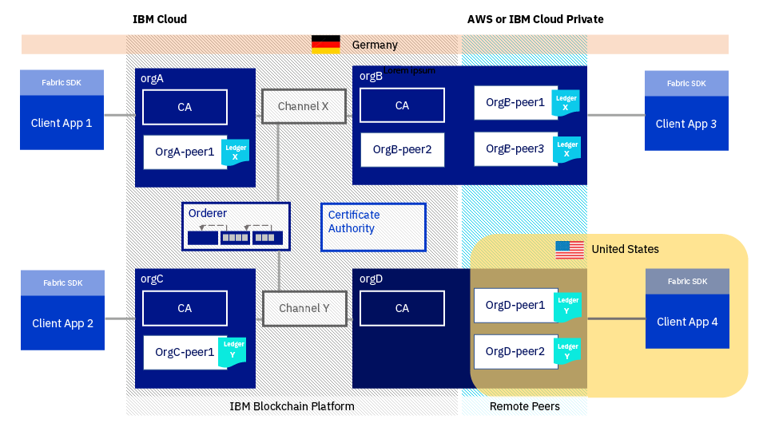

---

copyright:
  years: 2017, 2019
lastupdated: "2019-03-20"

subcollection: blockchain

---

{:new_window: target="_blank"}
{:shortdesc: .shortdesc}
{:screen: .screen}
{:codeblock: .codeblock}
{:note: .note}
{:important: .important}
{:tip: .tip}
{:pre: .pre}

# {{site.data.keyword.blockchainfull_notm}} Platform for Amazon Web Services について
{: #remote-peer-aws-about}

**注:** {{site.data.keyword.blockchainfull}} Platform Remote Peer on {{site.data.keyword.cloud_notm}} Private (ベータ) プログラムは終了しました。 引き続き {{site.data.keyword.cloud_notm}} Private 環境でピアを実行することを希望する場合は、代わりに **{{site.data.keyword.blockchainfull_notm}} Platform for {{site.data.keyword.cloud_notm}} Private** オファリングをご使用ください。 詳しくは、[{{site.data.keyword.cloud_notm}} Private のピアについて](/docs/services/blockchain/ibp-for-icp-about.html#ibp-icp-about-peer)を参照してください。

AWS クラウド内の {{site.data.keyword.blockchainfull_notm}} Platform ピアを {{site.data.keyword.cloud_notm}} 内の既存のブロックチェーン・ネットワークに接続した後に、このピアを実行できます。 {{site.data.keyword.cloud_notm}} の外部でリモート・ピアを実行すれば、{{site.data.keyword.cloud_notm}} 内部の既存のネットワークを利用しながら、より柔軟にブロックチェーン・ネットワークの拡張や参加を行えます。 AWS クラウド内のリモート・ピアは、プラットフォーム上の認証局 (CA) と順序付けサービスを利用します。しかし、{{site.data.keyword.cloud_notm}} の外部にある他のアプリケーションと同じ場所にピアを配置することができます。
{:shortdesc}

## 考慮事項
{: #remote-peer-aws-about-limitations}

{{site.data.keyword.blockchainfull_notm}} Platform for AWS は、{{site.data.keyword.blockchainfull_notm}} Platform 上でホストされているピアの全機能やサポートにはアクセスできません。 {{site.data.keyword.blockchainfull_notm}} Platform for AWS を実行する前に、以下の制限事項および制約を理解していることを確認します。
- 他のクラウド環境で実行されているピアは、{{site.data.keyword.cloud_notm}} 上のブロックチェーン・ネットワークのネットワーク・モニターに表示されません。
- ネットワーク・モニター UI で Swagger UI を使用して、{{site.data.keyword.blockchainfull_notm}} Platform for AWS 上で実行されているピアのアドレスを指定することはできません。
- {{site.data.keyword.blockchainfull_notm}} Platform for AWS ピア・ノードの正常性モニター、セキュリティー、ロギング、およびリソース使用量を管理するのはお客様の責任です。
- {{site.data.keyword.blockchainfull_notm}} Platform for AWS ピアは Fabric レベル v1.1 または v1.2.1 のブロックチェーン・ネットワークにのみ接続できます。 Fabric のバージョンは、ネットワーク・モニターで[「ネットワーク設定 (Network preferences)」ウィンドウ](/docs/services/blockchain/v10_dashboard.html#ibp-dashboard-network-preferences)を開くことで確認できます。
- {{site.data.keyword.blockchainfull_notm}} Platform for AWS ピアのデータベース・タイプは、ブロックチェーン・ネットワークのデータベース・タイプと一致する必要があります (LevelDB または CouchDB)。
- CouchDB Fauxton インターフェースは、AWS ピアでは使用できません。
- AWS ピアの[ゴシップ](/docs/services/blockchain/glossary.html#glossary-gossip)は現在サポートされていません。 これは、[プライベート・データ ](https://hyperledger-fabric.readthedocs.io/en/release-1.2/private-data-arch.html "プライベート・データ") や [サービス・ディスカバリー ](https://hyperledger-fabric.readthedocs.io/en/release-1.2/discovery-overview.html "サービス・ディスカバリー") などのゴシップに依存する Fabric 機能もサポートされていないことを意味します。

## 前提条件
{: #remote-peer-aws-about-prereq}

{{site.data.keyword.blockchainfull_notm}} Platform for AWS ピアを使用するには、{{site.data.keyword.blockchainfull_notm}} Platform 上のスターター・プラン・ネットワークまたはエンタープライズ・プラン・ネットワークのメンバーである組織が必要です。 {{site.data.keyword.blockchainfull_notm}} Platform for AWS ピアは、{{site.data.keyword.blockchainfull_notm}} Platform ネットワークの API エンドポイント、Hyperledger Fabric CA、および順序付けサービスを利用して作動します。 ブロックチェーン・ネットワークのメンバーではない場合は、ネットワークを作成するか、ネットワークに参加する必要があります。 詳しくは、[ネットワークの作成](/docs/services/blockchain/get_start.html#getting-started-with-enterprise-plan-create-network)または[ネットワークへの参加](/docs/services/blockchain/get_start.html#getting-started-with-enterprise-plan-join-nw)を参照してください。

## ライセンスおよび料金
{: #remote-peer-aws-about-license-pricing}

{{site.data.keyword.blockchainfull_notm}} Platform for AWS は現在は Community Edition として無償で提供されていますが、将来的には、{{site.data.keyword.blockchainfull_notm}} Platform for AWS は Bring-Your-Own-License (BYOL) モデルに変更される可能性があり、その場合は IBM からライセンスを購入することが必要になります。

**注:** AWS ピアを操作するには、{{site.data.keyword.blockchainfull_notm}} Platform のスターター・プランまたはエンタープライズ・プラン・ネットワークに属する組織が必要です。 つまり、ユーザーまたはネットワークの別のメンバーが組織の {{site.data.keyword.blockchainfull_notm}} [メンバーシップ料金](/docs/services/blockchain/howto/pricing.html#ibp-pricing-key-elements)を支払う必要があります。 料金の支払方法について詳しくは、[支払いモード](/docs/services/blockchain/howto/paying_mode.html#paying-mode)を参照してください。

## AWS ピアのデプロイ
{: #remote-peer-aws-about-deploy}

AWS [クイック・スタート・テンプレート ](https://aws.amazon.com/quickstart/architecture/ibm-blockchain-platform/ "クイック・スタート・テンプレート") を使用して、{{site.data.keyword.blockchainfull_notm}} Platform for AWS を簡単にデプロイできます。 詳しくは、[{{site.data.keyword.blockchainfull_notm}} Platform for AWS Quick Start Deployment Guide ](https://s3.amazonaws.com/aws-quickstart/quickstart-ibm-fabric/doc/ibm-blockchain-platform-for-aws.pdf "IBM Blockchain Platform for Platform for AWS Quick Start Reference Deployment") を参照してください。

{{site.data.keyword.blockchainfull_notm}} Platform for AWS のデプロイ方法については、[Amazon Web Services でのピアのデプロイ](/docs/services/blockchain/howto/remote_peer_aws.html#remote-peer-aws)を参照してください。

以下の図は、{{site.data.keyword.blockchainfull_notm}} Platform for AWS ピアをデプロイするプロセスを説明しています。クリック操作が可能です。 各ステップをクリックすると、詳しい説明を読むことができます。

<map name="home_map1" id="home_map1">
<area href="/docs/services/blockchain/howto/remote_peer_aws.html#remote-peer-aws-account" alt="AWS の構成または AWS へのアクセス" title="構成またはアクセス" shape="rect" coords="157.05, 52.53, 283.62, 127.11" />
<area href="/docs/services/blockchain/howto/remote_peer_aws.html#remote-peer-aws-account" alt="鍵ペアの作成" title="鍵ペアの作成" shape="rect" coords="300.97, 52.53, 427.54, 127.11" />
<area href="/docs/services/blockchain/howto/remote_peer_aws.html#remote-peer-aws-prerequisites" alt="ネットワークの作成またはネットワークへの参加" title="ネットワークの作成またはネットワークへの参加" shape="rect" coords="157.05, 131.8, 283.62, 206.37" />
<area href="/docs/services/blockchain/howto/remote_peer_operate_aws.html#remote-peer-aws-operate-sdk" alt="チャネルへの参加" title="チャネルへの参加" shape="rect" coords="300.97, 131.8, 427.54, 206.37" />
<area href="/docs/services/blockchain/howto/remote_peer_aws.html#remote-peer-aws-register-peer" alt="ピア ID の登録" title="ピア ID の登録" shape="rect" coords="443.95, 131.8, 570.53, 206.37" />
<area href="/docs/services/blockchain/howto/remote_peer_aws.html#remote-peer-aws-network-endpoints" alt="ピア構成情報の取得" title="ピア構成情報の取得" shape="rect" coords="585.53, 131.8, 712.1, 206.37" />
<area href="/docs/services/blockchain/howto/remote_peer_aws.html#remote-peer-aws-launchqs" alt="リンクのクリック" title="リンクのクリック" shape="rect" coords="157.05, 258.43, 283.62, 333.48" />
<area href="/docs/services/blockchain/howto/remote_peer_aws.html#remote-peer-aws-launchqs" alt="ピア・インスタンスの構成" title="ピア・インスタンスの構成" shape="rect" coords="300.97, 258.43, 427.54, 333.48" />
<area href="/docs/services/blockchain/howto/remote_peer_aws.html#remote-peer-aws-test" alt="デプロイメントの確認" title="デプロイメントの確認" shape="rect" coords="443.95, 258.43, 570.53, 333.48" />
<area href="/docs/services/blockchain/howto/remote_peer_operate_aws.html#remote-peer-aws-operate-sdk" alt="Fabric SDK の使用" title="Fabric SDK の使用" shape="rect" coords="157.05, 338.64, 283.62, 413" />
<area href="/docs/services/blockchain/howto/remote_peer_operate_aws.html#remote-peer-aws-operate-cli-operate" alt="Fabric ツール CLI の使用" title="Fabric ツール CLI の使用" shape="rect" coords="443.95, 338.64, 570.53, 413" />
</map>

*図 1. AWS 上の {{site.data.keyword.blockchainfull_notm}} Platform for AWS デプロイメントの流れ*

## AWS ピアの操作
{: #remote-peer-aws-about-operate-remote-peer}

AWS ピアをデプロイした後に、ピアがネットワークにトランザクションを送信できるようにするには、いくつかの操作ステップを実行する必要があります。 この操作ステップでは、チャネルへの組織の追加、チャネルへのピアの参加、ピアでのチェーンコードのインストール、チャネルでのチェーンコードのインスタンス化、およびピアへのアプリケーションの接続を行います。 詳しくは、[Amazon Web Service でのピアの操作](/docs/services/blockchain/howto/remote_peer_operate_aws.html#remote-peer-aws-operate)を参照してください。

## データの常駐
{: #remote-peer-aws-about-data-residency}

ブロックチェーン・ネットワークでは、処理されるデータのタイプが認識されないため、特定の種類のデータを保護するために追加のステップが必要になる場合があります。 データの常駐に関する最も一般的な要件は、IT システムで処理および保管されるすべてのデータを特定の国の中にとどめることを義務付ける、特定の国の法律に関連付けられています。 同様に、政府、医療、金融サービスなど、規制の厳しい業界の企業は、データを完全にファイアウォールの内側に保管することが求められます。 したがって、データの常駐を実現するには、ブロックチェーン・ネットワークのすべてのコンポーネントが同じ[チャネル](/docs/services/blockchain/glossary.html#glossary-channel)の一部であり、1 つの国に常駐する必要があります。

データの常駐要件に対応するには、{{site.data.keyword.blockchainfull_notm}} Platform の基礎となっている Hyperledger Fabric アーキテクチャーを理解することが重要です。 このアーキテクチャーは、認証局 (CA)、順序付けプログラム、およびピアという 3 つの主要コンポーネントを中核として構築されています。 ピアは順序付けサービスから順序付け状態の更新をブロックの形式で受け取り、状態および台帳を維持します。 したがって、ピアと順序付けプログラムの間には直接的な関係があります。 台帳には、トランザクション・ログに含まれるすべてのキーおよびデータの最新の値が含まれます。

さらに、クライアント・アプリケーションは、[Fabric SDK](/docs/services/blockchain/v10_application.html#dev-app-fabric-sdks) を使用してトランザクションをピアおよび順序付けサービスに送信します。 これらのトランザクションには、台帳のキーと値のペアを含む[読み取り/書き込みセット ](https://hyperledger-fabric.readthedocs.io/en/release-1.2/readwrite.html "読み取り/書き込みセットのセマンティクス") のデータが含まれます。

国内のデータの常駐が自社業務にとっての要件である場合は、順序付けプログラム、ピア、およびクライアント・アプリケーションは同じ国に常駐している必要があります。 {{site.data.keyword.blockchainfull_notm}} Platform ネットワークが {{site.data.keyword.cloud_notm}} で作成されている場合、ネットワークのロケーションを選択することができます。 <!--For a Starter Plan network, you can select from US South, United Kingdom, and Sydney. For an Enterprise Plan network, you can select from currently available locations, which include Dallas, Frankfurt, London, Sao Paulo, Tokyo, and Toronto. -->地域とロケーションについて詳しくは、[{{site.data.keyword.blockchainfull_notm}} Platform の地域とロケーション](/docs/services/blockchain/reference/ibp_regions.html#ibp-regions-locations)を参照してください。 これらのいずれかの国でデータの常駐を実現するには、ピアが {{site.data.keyword.blockchainfull_notm}} Platform ネットワークのロケーションと同じ国に常駐する必要があります。

### データの常駐のユース・ケース
{: #remote-peer-aws-about-data-res-use-case}

4 つの組織からなる共同事業体とともに、順序付けプログラムと認証局が含まれた {{site.data.keyword.blockchainfull_notm}} Platform ネットワークについて考えてみましょう。 これらの組織は 1 つ以上のピア・ノードを有しています。 4 つの組織はすべて同一チャネルに属しており、このネットワークのすべてのコンポーネントは、{{site.data.keyword.blockchainfull_notm}} Platform ネットワークがデプロイされた地域 (フランクフルトなど) にあります。 最後に、ピアと相互動作するクライアント・アプリケーションもドイツ内にあります。 データの常駐は維持されます。  

  
*図 3. すべてのコンポーネントが同じ国にある場合のデータの常駐*

次に、**ピア**がいずれかの組織に参加した場合の影響を考えてみましょう。  ピアは、ネットワークの残り部分と同じ領域に配置することも、{{site.data.keyword.blockchainfull_notm}} Platform ネットワーク領域外の任意の場所に配置することもできます。

-	このピアがネットワークの残り部分と同じ国にある場合は、データの常駐は維持されます。 すべての台帳データは、上記の**図 3** で示しているようにドイツ内にとどまります。
-	このピアが別の国 (米国など) に存在する場合は、ピア台帳上のデータは国境にまたがって共有されるため、データの常駐は維持されなくなります。

この問題を解決するために、**チャネル**を使用してネットワーク上のピアのサブセットに対してデータを分離できます。 {{site.data.keyword.blockchainfull_notm}} Platform ネットワークに、国境にまたがる複数のピアと順序付けプログラムが含まれている場合は、チャネルによって、国境外のピアを有している組織から台帳データが分離されます。  

**注:** 順序付けプログラムは常に、ネットワークをホストするために選択したデータ・センター領域に配置されます。 国境にまたがる複数の順序付けプログラムを保持することはできません。 ただし、ピアは、データ・センターと {{site.data.keyword.cloud_notm}} の外側のリモート・ロケーションのいずれにも配置できます。

  
*図 4. IBM Blockchain Platform 領域の国の外にピアが存在する場合のデータの常駐*

**図 4** では、`OrgC` と `OrgD` に対してはデータの常駐は不要です。 実際には、`OrgD` には現在は `OrgD-peer1` と `OrgD-peer2` という 2 つのピアが含まれており、これらのピアは*米国* にあります。 したがって、`OrgA` と `OrgB`、およびこれらの組織のそれぞれのクライアント・アプリケーションとピア (ドイツに存在しているもの) によって、チャネル `X` 上の台帳データが分離されるために、新しいチャネル `Y` が `OrgC` および `OrgD` 用に作成されます。

{{site.data.keyword.blockchainfull_notm}} Platform ネットワーク上のデータの流れについて詳しくは、[Fabric documentation on transaction flow](https://hyperledger-fabric.readthedocs.io/en/release-1.2/txflow.html "トランザクション・フロー") を参照してください。

今後、Hyperledger Fabric の新しいテクノロジーによって、[プライベート・データ・コレクション ](https://hyperledger-fabric.readthedocs.io/en/release-1.2/private-data/private-data.html "プライベート・データ・コレクション") およびゼロ知識証明を使用して、さらなるデータの常駐を実現する機能が改善されます。

- プライベート・データ・コレクションによって、プライベート・データが、国内のピアなど、表示を許可されたピアにのみピアツーピアで共有されます (ゴシップ・プロトコルによって)。 データはピアのプライベート・データベースに保管されます。  順序付けサービスは、ここでは関与しません。またプライベート・データを認識することもありません。 チャネルのすべてのピアの台帳にこのデータのハッシュが書き込まれます。 状態検証で使用されるハッシュは、トランザクションの証拠として機能し、監査目的で使用することができます。 プライベート・データは、Fabric バージョン 1.2.1 上で稼働している {{site.data.keyword.blockchainfull_notm}} Platform 上のネットワークで使用できます。 ただし、プライベート・データ機能をリモート・ピアで使用することはできません。

- ゼロ知識証明 (ZKP) により、「証明者」は「検証者」に、機密事項自体を示すことなく、機密事項に関する知識があることを保証できます。 何を知っているかを示すことなく、何かを知っていることを示してステートメントを満たす方法です。

これらのテクノロジーについて詳しくは、[Hyperledger Fabric を使用したプライベートおよび機密トランザクション ](https://developer.ibm.com/tutorials/cl-blockchain-private-confidential-transactions-hyperledger-fabric-zero-knowledge-proof/ "Hyperledger Fabric を使用したプライベートおよび機密トランザクション") に関するホワイト・ペーパーを参照してください。

## サポートについて
{: #remote-peer-aws-about-support}

IBM Blockchain Platform では、このオファリングのサポートは提供されていません。 ピアに関する問題が発生した場合は、ブロックチェーン開発者向けの無料のリソースとサポート・フォーラムを利用して、{{site.data.keyword.IBM_notm}} および Fabric コミュニティーから支援を得ることができます。 詳しくは、[ブロックチェーンのリソースおよびサポート・フォーラム](/docs/services/blockchain/ibmblockchain_support.html#blockchain-support-resources)を参照してください。 ネットワーク・モニターの**「ヘルプの利用」**画面でもサポート・リソースを確認できます。

- AWS に関連する問題の場合は、[コミュニティーのサポート・フォーラム ](https://forums.aws.amazon.com/index.jspa "AWS コミュニティーのサポート・フォーラム") と [AWS プレミアム・サポート ](https://aws.amazon.com/premiumsupport/ "AWS プレミアム・サポート") の両方をご利用できます。

{{site.data.keyword.blockchainfull_notm}} は、{{site.data.keyword.cloud_notm}} で開かれた、{{site.data.keyword.blockchainfull_notm}} Platform for AWS に関連するケースをサポートしていません。 Community Edition は、検証、開発、およびテストを目的としたものであるため、実動用には使用しないでください。
