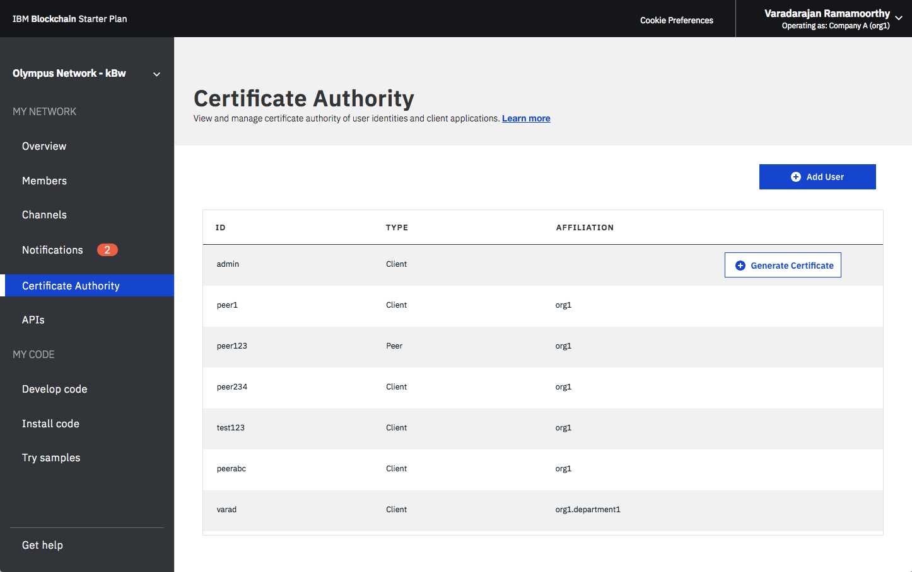
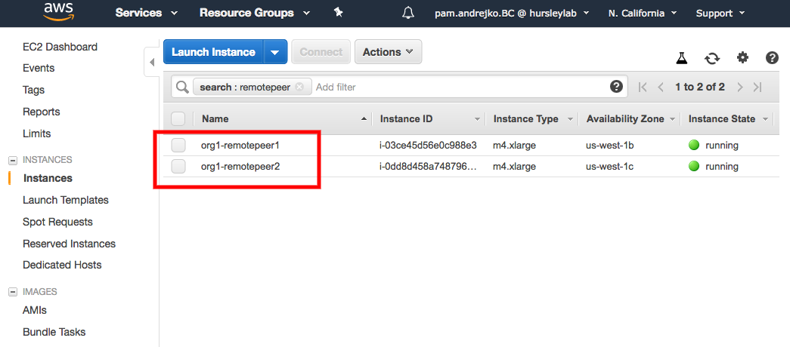

---

copyright:
  years: 2017, 2019
lastupdated: "2019-03-20"

subcollection: blockchain

---

{:new_window: target="_blank"}
{:shortdesc: .shortdesc}
{:screen: .screen}
{:codeblock: .codeblock}
{:note: .note}
{:important: .important}
{:tip: .tip}
{:pre: .pre}

# {{site.data.keyword.blockchainfull_notm}} Platform for AWS の概説
{: #remote-peer-aws}

以下の手順では、Amazon Web Services (AWS) のクイック・スタート・テンプレートを使用して、{{site.data.keyword.blockchainfull}} Platform for AWS ピアを作成してから、このピアを {{site.data.keyword.blockchainfull_notm}} Platform 上のネットワークに接続する方法を説明します。
{:shortdesc}

AWS について詳しくは、[AWS の概要ドキュメント ](https://d1.awsstatic.com/whitepapers/aws-overview.pdf "AWS の概要ドキュメント") を参照してください。

{{site.data.keyword.blockchainfull_notm}} Platform for AWS を使用すると、ピアは {{site.data.keyword.cloud_notm}} 上の既存のスターターまたはエンタープライズ・プラン・ネットワークの接続プロファイル、Hyperledger Fabric 認証局 (CA)、および順序付けサービスを利用して、AWS クイック・スタート・テンプレートを介してトランザクションを処理できます。 クイック・スタートでは、AWS CloudFormation テンプレートを使用してピアをデプロイできます。 このテンプレートは、スターターまたはエンタープライズ・プラン・ネットワークに接続されている、AWS がホストする {{site.data.keyword.blockchainfull_notm}} Platform ピアを迅速に構成、デプロイ、および実行する必要がある IT インフラストラクチャーの意思決定者とシステム管理者を対象としています。 このテンプレートを使用して、AWS で新しい仮想プライベート・クラウド (VPC) を作成したり、既存の VPC にピアをデプロイしたりできます。

クイック・スタートは、以下の構成を実行します。
 * 2 つの可用性ゾーンにまたがる高可用性アーキテクチャー。
 * AWS のベスト・プラクティスに従った、パブリック・サブネットで構成された VPC。 これにより、AWS 上に独自の仮想ネットワークが提供されます。
 * インターネットへのアクセスを可能にするインターネット・ゲートウェイ。
 * パブリック・サブネットでは、2 つの可用性ゾーンにまたがる 2 つのピア (サブネットごとに 1 つのピア)。
 * 各パブリック・サブネットにおいて、組み込み LevelDB データベースまたは 2 次 CouchDB コンテナーを持つピア・コンテナー。

{{site.data.keyword.blockchainfull_notm}} Platform for AWS ピアをデプロイする前に、[ピアに関する考慮事項](/docs/services/blockchain/howto/remote_peer.html#remote-peer-aws-about-limitations)を参照してください。

## 前提条件
{: #remote-peer-aws-prerequisites}

{{site.data.keyword.blockchainfull_notm}} Platform for AWS ピア (リモート・ピア) を使用するには、IBM Blockchain Platform 上でホストされているブロックチェーン・ネットワークのメンバーである組織が必要です。 IBM Cloud 上のネットワーク・モニターを使用して、ネットワーク資格情報およびネットワークの API エンドポイントにアクセスする必要があります。 ブロックチェーン・ネットワークのメンバーではない場合は、ネットワークを作成するか、ネットワークに参加する必要があります。 詳しくは、[ネットワークの作成](/docs/services/blockchain/get_start.html#getting-started-with-enterprise-plan-create-network)または[ネットワークへの参加](/docs/services/blockchain/get_start.html#getting-started-with-enterprise-plan-join-nw)を参照してください。

ピアのデフォルト VPC インスタンス・タイプは `m4.xlarge` です。  CPU、メモリー、およびストレージの要件に基づいて、選択するインスタンス・タイプを最適化する必要があります。 ピアには、少なくとも以下が必要です。  
-	2 基の CPU
-	2 GB RAM
-	チェーンコード用の 4 GB のスペース
-	台帳の拡張に合わせて拡大できる台帳用の 10 GB のスペース

テストおよび試験目的には、これらの最小リソース・レベルで十分です。 実稼働環境用には、十分な量のストレージを割り振ることが重要です (100 GB など)。 使用されるストレージの量は、ご使用のネットワークから要求される署名の数とトランザクションの数によって異なります。 ピア上のストレージを使い果たした場合は、<!-- either expand the storage or -->より大きいファイル・システムを持つ新規ピアをデプロイして、同じチャネル上の他のピアを通じてその新規ピアを同期する必要があります。


## デプロイメント・オプション
{: #remote-peer-aws-deploy-options}

クイック・スタートでは、次の 2 つのデプロイメント・オプションが提供されます。

* {{site.data.keyword.blockchainfull_notm}} Platform for AWS を新規 VPC にデプロイします (エンドツーエンドのデプロイメント)。 このオプションでは、VPC、サブネット、NAT ゲートウェイ、セキュリティー・グループ、要塞ホスト、およびその他のインフラストラクチャー・コンポーネントで構成される新しい AWS 環境を構築してから、ピアをこの新規 VPC にデプロイします。

* {{site.data.keyword.blockchainfull_notm}} Platform for AWS を既存の VPC にデプロイします。 このオプションでは、{{site.data.keyword.blockchainfull_notm}} Platform for AWS ピアを既存の AWS インフラストラクチャーにプロビジョンします。 このガイドで後述するように、これらのオプションには、CIDR ブロック、インスタンス・タイプ、およびピア設定を構成できる別々のテンプレートがあります。

## ステップ 1: AWS アカウントの準備
{: #remote-peer-aws-account}

1. AWS アカウントがまだない場合は、[こちら ](https://aws.amazon.com "https//aws/amazon.com") から画面の指示に従って AWS アカウントを作成してください。

2. ナビゲーション・バーの地域セレクターを使用して、AWS にピアをデプロイする場所となる AWS 地域を選択します。

3. 希望の地域内で鍵ペアを作成します。

4. 必要に応じて、Amazon EC2 <type>インスタンス・タイプのサービス制限の増加を要求します。 この作業が必要になる可能性があるのは、このインスタンス・タイプを使用する既存のデプロイメントが既に存在しており、このデプロイメントでデフォルトの制限を超える可能性があると思われる場合です。

## ステップ 2: リモート・ピア構成情報の取得
{: #remote-peer-aws-network-endpoints}

構成時に、ネットワークの API エンドポイントをピアに提供する必要があります。 ピアはこれらのエンドポイントを使用し、{{site.data.keyword.blockchainfull_notm}} Platform のネットワークを検索して接続できます。 ネットワーク・モニターの**「概要」**画面で、**「リモート・ピアの構成 (Remote Peer Configuration)」**ボタンをクリックします。

")
*図 1. 「リモート・ピアの構成」パネル*

ポップアップ・ウィンドウが開き、以下のフィールドの値が表示されます。 以下のフィールドの値を保存してください。これらの値は、AWS クイック・スタート・テンプレートを使用してピアを構成する際に必要になります。

- **組織 MSP (Organization MSP)**
- **認証局 (CA) 名 (Certificate Authority (CA) Name)**
- **認証局 (CA) URL (Certificate Authority (CA) URL)**
- **認証局 (CA) TLS 証明書 (Certificate Authority (CA) TLS Certificate)**

各フィールドの値をクイック・スタート・テンプレートに直接コピー・アンド・ペーストすることも、**「ダウンロード」**リンクをクリックしてこれらの値を JSON ファイルに保存することもできます。

クイック・スタート・テンプレートには、`&#xa5;r&#xa5;n` 改行形式の TLS 証明書が必要です。 `*NIX` OS でブラウザーを使用してネットワーク・モニターを表示している場合は、UI からコピーした証明書の形式を設定し直す必要があります。 `&#xa5;n` をすべて `&#xa5;r&#xa5;n` に置換し、結果のストリングを`「認証局 (CA) TLS 証明書チェーン (Certificate Authority (CA) TLS Certificate Chain)」`というフィールドに貼り付けます。
{:important}

**注:** 上記の情報を JSON 形式でダウンロードする場合は、TLS 証明書を PEM 形式に変換してから、この証明書をリモート・ピアに提供する必要があります。 以下のコマンドを実行して、ダウンロードした JSON ファイル内の**認証局 (CA) TLS 証明書**を PEM 形式に変換します。
```
echo -e "<CERT>" > admin.pem
```
{:codeblock}

`<CERT>` を**「認証局 (CA) TLS 証明書」**の値に置き換えます。 次に、クイック・スタート・テンプレートで**「認証局 (CA) TLS 証明書」**を求めるプロンプトが出されたら、`cat` コマンドを使用して admin.pem ファイルを取得して、このファイルの内容をコピーしてこのフィールドに貼り付けます。  

## ステップ 3: {{site.data.keyword.blockchainfull_notm}} Platform for AWS ピアの登録
{: #remote-peer-aws-register-peer}

{{site.data.keyword.blockchainfull_notm}} Platform for AWS ピアをネットワークに参加させるには、その前に {{site.data.keyword.blockchainfull_notm}} Platform 上のネットワークに新しいピア ID を追加する必要があります。 以下のステップを実行して、ピアを登録します。

**注:** 高可用性を実現するために、クイック・スタート・テンプレートでは 2 つのアベイラビリティー・ゾーンにまたがって 2 つのピア・ノードが作成されます。 したがって、2 つの登録 ID と登録機密事項が必要です。 **このプロセスを 2 回繰り返して、2 つの登録 ID と登録機密事項を生成します。**

1. {{site.data.keyword.blockchainfull_notm}} Platform で、ネットワークのネットワーク・モニターにログインします。 ネットワーク・モニターの「認証局」画面では、ネットワークに登録されたすべての ID を表示できます (管理者やクライアント・アプリケーションなど)。
  
  *図 2. CA 画面*

2. パネルの**「ユーザーの追加」**ボタンをクリックします。 ポップアップ画面が開き、下のフィールドに入力した後に、ピアをネットワークに登録できます。 **「ID」と「機密事項」の値は、後でクイック・スタート・テンプレートでピアを構成するときのために保存してください。**
  - **登録 ID:** ピア用に使用することを希望する名前であり、ピアの構成時には`登録 ID` と呼ばれます。 今後使用するため、**この値を保存します**。
  - **機密事項の登録:** ピア用に使用することを希望するパスワードであり、ピアの構成時には`登録機密事項`と呼ばれます。 今後使用するため、**この値を保存します**。
  - **タイプ:** このフィールドには `peer` を選択します。
  - **所属 (Affiliation):** これは `org1` など、ピアが属する組織での所属です。 新しい所属を指定することも、既存の所属を使用することもできます。
  - **最大エンロール回数 (Maximum Enrollments):** このフィールドを使用すると、この ID を使用してエンロールする回数、つまり、証明書を生成する回数を制限できます。 指定しない場合、値はデフォルトで無制限の登録に設定されます。

  フィールドに入力した後に、**「送信」**をクリックしてピアを登録します。 登録されたピアは、ネットワーク上の ID としてテーブルに表示されます。 セキュリティー対策として、各 ID および付随する登録 ID と機密事項を使用してデプロイするピアは 1 つのみにします。 ピア ID とパスワードは再使用しないでください。

## ステップ 4: クイック・スタートの起動
{: #remote-peer-aws-launchqs}

このクイック・スタート・リファレンス・デプロイメントを実行する際に使用する AWS サービスのコストはユーザー側で負担します。 このクイック・スタートを使用するための追加コストは発生しません。 詳細については、このクイック・スタートで使用する必要がある各 AWS サービスの価格設定ページを参照してください。 価格は変更される場合があります。

1. 次のいずれかのオプションを選択して、AWS CloudFormation テンプレートを自身の AWS アカウント内に起動します。 オプションを選択するための参考情報については、このガイドで既出のデプロイメント・オプションを参照してください。 各デプロイメントの完了には約 10 分かかります。  

  * [{{site.data.keyword.blockchainfull_notm}} Platform for AWS を AWS 上の新規 VPC にデプロイします ](https://fwd.aws/v43nk "{{site.data.keyword.blockchainfull_notm}} Platform for AWS を AWS 上の新規 VPC にデプロイします")。  

  * [{{site.data.keyword.blockchainfull_notm}} Platform for AWS を AWS 上の既存 VPC にデプロイします ](https://fwd.aws/zrP4g "{{site.data.keyword.blockchainfull_notm}} Platform for AWS を AWS 上の既存 VPC にデプロイします")。

  **重要:**     
  {{site.data.keyword.blockchainfull_notm}} Platform for AWS を既存の VPC にデプロイする場合は、ご使用の VPC が、データベース・インスタンス用の異なるアベイラビリティー・ゾーン内の 2 つのパブリック・サブネットを有していることを確認してください。 これらのサブネットの経路テーブル内には、NAT ゲートウェイまたは NAT インスタンスが含まれている必要があります。その結果として、インスタンスをインターネットに公開することなく、インスタンスがパッケージとソフトウェアをダウンロードすることが可能になります。 Amazon VPC の資料の説明に従って、DHCP オプションでドメイン名オプションを構成する必要もあります。  

  また、既存の VPC に関連付けられたセキュリティー・グループを作成し、ポート 22 および 7051 のインバウンド・ルールをこのセキュリティー・グループに追加してください。 ポート 22 上の TCP 接続は、生成されたインスタンスへの SSH アクセスを可能にする一方で、ポート 7051 上の TCP 接続は、ピア・インスタンスへの外部 gRPC アクセスを可能にします (Fabric ツール CLI および Fabric SDK を使用してピアを操作するために必要)。 クイック・スタートを起動するときに、これらの VPC 設定の入力を求めるプロンプトが出されます。

2. ナビゲーション・バーの右上隅に表示されている地域を確認し、必要に応じてこの地域を変更します。 この地域に、ピアのネットワーク・インフラストラクチャーが構築されます。 テンプレートは、デフォルトで米国東部 (オハイオ) 地域で起動されます。

3. 「テンプレートの選択 (Select Template)」ページで、テンプレート URL をデフォルト設定のままにして、`「次へ」`を選択します。

4. 「詳細の指定 (Specify Details)」ページで、必要に応じてスタック名を変更します。 テンプレートのパラメーターを確認します。 入力が必要なパラメーターの値を指定します。 他のすべてのパラメーターについては、デフォルト設定を確認し、必要に応じてカスタマイズします。 パラメーターの確認とカスタマイズが終了したら、`「次へ」`を選択します。

以下の表では、パラメーターはカテゴリー別にリストされており、2 つのデプロイメント・オプションについて別々に説明されています。

  * [{{site.data.keyword.blockchainfull_notm}} Platform for AWS を新規 VPC にデプロイするためのパラメーター](/docs/services/blockchain/howto/remote_peer_aws.html#remote-peer-aws-parameters-newvpc)

  * [{{site.data.keyword.blockchainfull_notm}} Platform for AWS を既存 VPC にデプロイするためのパラメーター](/docs/services/blockchain/howto/remote_peer_aws.html#remote-peer-aws-parameters-existvpc).

### {{site.data.keyword.blockchainfull_notm}} Platform for AWS を新規 VPC にデプロイするためのパラメーター
{: #remote-peer-aws-parameters-newvpc}

以下の表は、AWS のチャートの構成可能パラメーターとそのデフォルト値を示しています。 すべての値が必須です。

|  パラメーター    | 説明 | デフォルト |
| --------------|-------------|---------|
| `スタック名 (Stack name)` |スタック名は、スタックのリストから特定のスタックを見つけるのに役立つ ID です。 スタック名には、英数字 (大/小文字の区別あり) とハイフンのみを使用できます。 先頭は英字でなければならず、128 文字を超えることはできません。| |
| | | |
| **ネットワーク構成** | |
| `アベイラビリティー・ゾーン (Availability Zones)` |VPC 内のサブネット用に使用する 2 つのアベイラビリティー・ゾーン。 注: 論理順序は保持されます。 | |
| `SSH アクセス CIDR の許可 (Allowed SSH access CIDR)` | IBM Blockchain ピア・インスタンスへの外部 SSH アクセスのための [CIDR ブロック ](https://docs.aws.amazon.com/vpc/latest/userguide/VPC_Subnets.html#vpc-resize "VPC とサブネット") が許可されます。 0.0.0.0/0 に設定することで、任意の場所からのアクセスを許可できます (非推奨)。 | |
| `PeerEndpointAccessCIDR` | IBM Blockchain ピア・インスタンスへの外部 gRPC アクセスのための [CIDR ](https://docs.aws.amazon.com/vpc/latest/userguide/VPC_Subnets.html#vpc-resize "VPC とサブネット") ブロックが許可されます。 通常は 0.0.0.0/0 に設定して、任意の場所からのアクセスを許可します (非推奨)。 | |
| | | |
| **Amazon EC2 の構成** | | |
| `InstanceType` | ピア・インスタンス用の EC2 インスタンスのタイプ。 | m4.xlarge |
| `KeyPairName` | AWS 地域内の既存の EC2 鍵ペアの名前。 ユーザー側でこれを生成する必要があります。 | |
| | | |
|** IBM Blockchian の構成** | |
| `IBMBlockchainVersion` | デプロイする IBM Blockchain のバージョン。 | 1.2.1 |
| `StateDatabase` | ブロックチェーン状態の保管に使用するデータベースのタイプ。 ここで選択する値は、ネットワークの残り部分で使用される状態データベース・タイプと一致する必要があります。 | CouchDB|
| `PeerVolumeSize` | ピアの永続データ (台帳、状態データベース、MSP) を保管するために使用される EBS ボリューム (GB 単位)。 | 100 |
| `ピア 1 登録 ID (Peer 1 enroll ID)`| 1 つ目のピアの IBM Blockchain Platform UI の「認証局」パネルに入力した登録 ID。 |  |
| `ピア 1 登録機密事項 (Peer 1 enroll secret)` | 1 つ目のピアの IBM Blockchain Platform UI の「認証局」パネルに入力した登録機密事項。 | |
| `ピア 2 登録 ID (Peer 2 enroll ID)` | 2 つ目のピアの IBM Blockchain Platform UI の「認証局」パネルに入力した登録 ID。 | |
| `ピア 2 登録機密事項 (Peer 2 enroll secret)` | 2 つ目のピアの IBM Blockchain Platform UI の「認証局」パネルに入力した登録機密事項。 | |
| | | |
|**IBM Blockchain サービス資格情報 (IBM Blockchain Service Credentials)**| | |
| `組織 MSP (Organization MSP)` | この値は、IBM Blockchain Platform UI で確認できます。 「概要」パネルの「リモート・ピアの構成」ボタンをクリックして、この情報をコピーしてここに貼り付けます。 | |
| `認証局 (CA) 名 (Certificate Authority (CA) Name)` | この値は、IBM Blockchain Platform UI で確認できます。 「概要」パネルの「リモート・ピアの構成」ボタンをクリックして、この情報をコピーしてここに貼り付けます。| |
| `認証局 (CA) URL (Certificate Authority (CA) URL)` | この値は、IBM Blockchain Platform UI で確認できます。 「概要」パネルの「リモート・ピアの構成」ボタンをクリックして、この情報 (ポートを含む) をコピーしてここに貼り付けます。 指定していない場合、デフォルトのポートは 443 です。 | |
| `認証局 (CA) TLS 証明書 (Certificate Authority (CA) TLS Certificate)`| この値は、IBM Blockchain Platform UI で確認できます。 「概要」パネルの「リモート・ピアの構成」ボタンをクリックして、この情報をコピーしてここに貼り付けます。| |
| | | |
|**他のパラメーター**| | |
| `QSS3BucketName` | クイック・スタート・アセット用の S3 バケット名。 クイック・スタート・バケット名には、数字、小文字、大文字、およびハイフン (-) を使用できます。 先頭や末尾にハイフン (-) を使用することはできません。 | `aws-quickstart` |
| `QSS3KeyPrefix` | クイック・スタート・アセット用の S3 鍵接頭部。 クイック・スタート鍵接頭部には、数字、小文字、大文字、ハイフン (-)、およびスラッシュ (/) を使用できます。 | `quickstart-ibm-fabric/` |

1. 「オプション」ページで、スタック内のリソースのタグ (キーと値のペア) を指定し、拡張オプションを設定できます。 終了したら、「次へ」を選択します。

2. 「確認」ページで、テンプレート設定を確認して確定します。 「機能 (Capabilities)」で、テンプレートによって IAM リソースが作成されることを確認するチェック・ボックスを選択します。

3. 「作成」を選択してスタックをデプロイします。

4. スタックの状況をモニターします。 すべてのスタックの状況が `CREATE_COMPLETE` になったら、ピア・クラスターの準備はできています。 正常に完了した後に、4 つのネストされたスタック (couchDB が選択された場合) または 2 つのネストされたスタック (levelDB が選択された場合) を持つルート・スタックが得られます。

5. スタックの「出力」タブに表示される情報を使用して、作成されたリソースを表示します。


### {{site.data.keyword.blockchainfull_notm}} Platform ピアを既存の VPC にデプロイするためのパラメーター
{: #remote-peer-aws-parameters-existvpc}

{{site.data.keyword.blockchainfull_notm}} Platform for AWS ピアを既存の VPC にデプロイする場合は、以下のことを考慮してください。

 - ご使用の VPC が、データベース・インスタンス用の異なるアベイラビリティー・ゾーン内の 2 つのプライベート・サブネットを有していることを確認します。 これらのサブネットの経路テーブル内には、NAT ゲートウェイまたは NAT インスタンスが含まれている必要があります。その結果として、インスタンスをインターネットに公開することなく、インスタンスがパッケージとソフトウェアをダウンロードすることが可能になります。

 - [Amazon VPC の資料 ](https://docs.aws.amazon.com/AmazonVPC/latest/UserGuide/VPC_DHCP_Options.html "DHCP オプション・セット") の説明に従って、DHCP オプションでドメイン名オプションを構成してください。  

- 既存の VPC に関連付けられたセキュリティー・グループを作成し、ポート 22 および 7051 のインバウンド・ルールをこのセキュリティー・グループに追加してください。 ポート 22 上の TCP 接続は、生成されたインスタンスへの SSH アクセスを可能にする一方で、ポート 7051 上の TCP 接続は、ピア・インスタンスへの外部 gRPC アクセスを可能にします (Fabric ツール CLI および Fabric SDK を使用してピアを操作するために必要)。 クイック・スタートを起動するときに、これらの VPC 設定の入力を求めるプロンプトが出されます。

 {{site.data.keyword.blockchainfull_notm}} Platform for AWS ピアを既存の VPC にデプロイする場合は、[上記の](/docs/services/blockchain/howto/remote_peer_aws.html#remote-peer-aws-parameters-newvpc)対応するセクションで説明したパラメーターの代わりに、以下のパラメーターを使用してください。

|  パラメーター    | 説明 | デフォルト |
| --------------|-------------|---------|
| **ネットワーク構成** | | |
| `VPCID` |	デプロイメント用の既存 VPC の ID。| |
| `AvailabilityZone1` | 1 つ目のピア・ノードをデプロイするアベイラビリティー・ゾーン。 | |
| `SubnetID1` |	1 つ目のピア・ノードに使用するサブネットの ID。 このサブネットは、選択した VPC に属している必要があります。 この VPC に属するサブネットを見つけるには、AWS VPC ダッシュボードを確認し、「サブネット」メニューを選択してください。| |
| `AvailabilityZone2` | 2 つ目のピア・ノードをデプロイするアベイラビリティー・ゾーン。 | |
| `SubnetID2` |	2 つ目のピア・ノードに使用するサブネットの ID。 このサブネットは、選択した VPC に属している必要があります。 この VPC に属するサブネットを見つけるには、AWS VPC ダッシュボードを確認し、「サブネット」メニューを選択してください。 | |
| | | |
| **Amazon EC2 の構成**| | |
| `InstanceType` 	| ピア・インスタンス用の EC2 インスタンスのタイプ。 	| m4.xlarge |
| `KeyPairName` |	AWS 地域内の既存の EC2 鍵ペアの名前。 ユーザー側でこれを生成する必要があります。 | |
| `SecurityGroup` | AWS 地域内の既存の EC2 セキュリティー・グループの ID。 ポート 22 および 7051 上でインバウンド TCP 接続を許可する必要があります。 |	| |

## ステップ 5: デプロイメントのテスト
{: #remote-peer-aws-test}

AWS CloudFormation テンプレートによってスタックが正常に作成されると、2 つの {{site.data.keyword.blockchainfull_notm}} Platform for AWS ピア・インスタンスがユーザーの AWS アカウント内で実行されます。 これらのインスタンスの名前は、クイック・スタート・テンプレートで指定された`「組織 MSP (Organization MSP)」`と`「ピアの登録 ID (Peer enroll id)」`の組み合わせに基づいて付与されます。 例えば、`org1-remotepeer1` などです。  

  
*図 3. AWS EC2 インスタンス上のピア*

ピアが実行されていることを確認するには、以下のようにします。

  * AWS コンソールでインスタンスを選択して (**「サービス」>「EC2」>「インスタンス」**の順にクリック)、**「接続」**ボタンをクリックすることで、新規作成した VPC に SSH で接続します。 AWS の指示に従って `ssh` コマンドを実行します。  
  * コマンド・ラインから `docker ps` を実行して、実行中のコンテナーを表示します。 各仮想マシンには、ピア・コンテナーと ecs-agent が含まれています。 台帳データベースとして CouchDB を選択した場合は、CouchDB コンテナーも存在します。

  ```
  CONTAINER ID        IMAGE                                STATUS              PORTS                          NAMES
  fb3c49fe52fe        amazon/amazon-ecs-agent:latest       Created                                            ecs-agent
  667780cf3cd3        ibmblockchain/fabric-peer:1.2.1      Up                  0.0.0.0:7051->7051/tcp         peer
  2aa143c81027        ibmblockchain/fabric-couchdb:0.4.6   Up                  4369/tcp, 5984/tcp, 9100/tcp   couchdb
  ```

  * `docker exec -it peer sh` を実行して、ピア・コンテナー内でシェル・セッションを作成できます。

オプションで、ピア接続が {{site.data.keyword.blockchainfull_notm}} Platform ネットワークに対して機能していることを確認したい場合は、ピア・コンテナー内部から `peer channel fetch` CLI コマンドを実行できます。 そうでない場合は、[ピアの操作](/docs/services/blockchain/howto/remote_peer_operate_aws.html#remote-peer-aws-operate)の説明にスキップできます。  

`peer channel fetch` CLI コマンドを実行して、チャネルからジェネシス・ブロックをフェッチします。

1. ネットワーク・モニターの「概要」パネルでアクセスできる`「接続プロファイル」`から構成情報を取得します。 **「接続プロファイル」**、**「ダウンロード」**の順にクリックします。

   - `orderers > url` の下に配置されている **orderers** を検索して、順序付けプログラムの URL を見つけます。 ネットワーク名で始まる URL をメモしておきます。 URL は以下の例のようになります。

   ```
   ash-zbc07b.4.secure.blockchain.ibm.com:21239
   ```

   - **organizations** を検索して、組織の名前を見つけます。 この組織はピアの登録に使用した組織と同じである必要があります。 組織の名前をその関連 `mspid` とともに見つけることができます。 この値は、ネットワーク・モニターの「概要」パネルにも表示されます。 **「リモート・ピアの構成」**ボタンをクリックします。 この値は、`「組織 MSP」`に表示されます。 `mspid` の値をメモしておきます。

   - まだの場合は、`docker exec -it peer sh` を実行して、ピア・コンテナー内でシェル・セッションを作成します。

   ```
   docker exec -it peer sh
   ```
   {:codeblock}

   - 順序付けプログラムの TLS 証明書を接続プロファイルからピアにコピーします。 **「順序付けプログラム」**セクションにナビゲートします。 「pem:」の後ろの証明書をコピーします。コピー範囲は、-----BEGIN CERTIFICATE----- から -----END CERTIFICATE----- までです。 引用符は含めないでください。 コマンド・ラインから次のコマンドを実行します。`<orderer cert>` の代わりに、creds.json ファイルからコピーした内容を入力します。

   ```
   echo -e "<orderer cert>" > /etc/hyperledger/<PEER_ENROLL_ID>/orderer_tlscacert.pem
   ```
   {:codeblock}

   `<PEER_ENROLL_ID>` の代わりに、クイック・スタート・テンプレートで指定した登録 ID (このピア・インスタンスに関連付けられた ID) を入力します。

2. ジェネシス・ブロックをフェッチするには、まず、組織をネットワーク内のチャネルに追加する必要があります。

  - ピアに対して新しいチャネルを開始できます。 チャネル・イニシエーターは、[チャネル作成](/docs/services/blockchain/howto/create_channel.html#ibp-create-channel-creating-a-channel)時に組織を自動的に含めることができます。

  - ブロックチェーン・ネットワークの別のメンバーが、[チャネル更新](/docs/services/blockchain/howto/create_channel.html#ibp-create-channel-updating-a-channel)を使用して、組織を既存のチャネルに追加することもできます。

  - 組織がチャネルに追加されたら、ピアの署名証明書をチャネルに追加する必要があります。 証明書とチャネルを同期するだけで良いように、ピアはインストール時にその署名証明書をアップロードします。 ネットワーク・モニターの「チャネル」画面で、組織が参加したチャネルを見つけ、**「アクション」**ヘッダーの下にあるドロップダウン・リストから**「証明書の同期」**を選択します。 このアクションによって、チャネルのすべてのピアで証明書が同期されます。

3. 以下のコマンドを実行して、ピア・コンテナーの環境変数を設定します。

   ```
   export ORDERER_1=<ORDERER_URL>
   export CHANNEL=<CHANNEL_NAME>
   export ORGID=<ORGANIZATION_MSP_ID>
   export PEERADDR=<PEER_ADDR>
   ```
   {:codeblock}

   フィールドを独自の情報に置き換えます。
     - `<ORDERER_URL>` を、`creds.json` ファイルからの順序付けプログラムのホスト名およびポートに置き換えます。
     - `<CHANNEL_NAME>` を、ピアが参加するチャネルの名前に置き換えます。
     - `<ORGANIZATION_MSP_ID>` を、`creds.json` ファイルからの組織の名前に置き換えます。
     - `<PEER_ADDR>` を `localhost:7051` で置き換えます。

   例えば、次のようにします。

   ```
   export ORDERER_1=ash-zbc07b.4.secure.blockchain.ibm.com:21239
   export CHANNEL=defaultchannel
   export ORGID=PeerOrg1
   export PEERADDR=localhost:7051
   ```

4. 以下のピア CLI コマンドを実行して、チャネルのジェネシス・ブロックをフェッチします。

   **重要:** 以下のコマンドでは、それぞれの `<PEER_ENROLL_ID>` の代わりに、クイック・スタート・テンプレートで指定した登録 ID (このピア・インスタンスに関連付けられた ID) を入力してください。 この値を確認するには、`ls /etc/hyperledger/` コマンドを実行します。 2 つのフォルダーが表示され、1 つ目は `fabric` であり、2 つ目が `<PEER_ENROLL_ID>` です。

   ```
   CORE_PEER_TLS_ROOTCERT_FILE=/etc/hyperledger/<PEER_ENROLL_ID>/tls/ca.crt CORE_PEER_TLS_ENABLED=true CORE_PEER_ADDRESS=${PEERADDR} CORE_PEER_LOCALMSPID=${ORGID} CORE_PEER_MSPCONFIGPATH=/etc/hyperledger/<PEER_ENROLL_ID>/msp/ GOPATH=/ peer channel fetch 0 -o ${ORDERER_1} -c ${CHANNEL} --cafile /etc/hyperledger/<PEER_ENROLL_ID>/orderer_tlscacert.pem --tls
   ```
   {:codeblock}


   **注:** これらのいずれかの CLI コマンドを実行すると、以下の警告が表示される場合がありますが、無視しても安全です。

   ```
   [msp] getPemMaterialFromDir -> WARN 001 Failed reading file
   /etc/hyperledger/<PEER_ENROLL_ID>/msp/intermediatecerts/<intermediate cert name>.pem: no pem content for file  /etc/hyperledger/<PEER_ENROLL_ID>/msp/intermediatecerts/<intermediate cert name>.pem
   ```

   以下のコマンドを実行して、コマンドが正常に機能し、ジェネシス・ブロックがピア・コンテナーに追加されたことを確認します。

   ```
   ls *.block
   ```
   {:codeblock}

   以下の例のように表示された場合、ジェネシス・ブロックは正常に追加されています。

   ```
   defaultchannel_0.block
   ```

   これで作業は完了しました。 {{site.data.keyword.blockchainfull_notm}} Platform for AWS ピアは {{site.data.keyword.blockchainfull_notm}} Platform ネットワークに正常に接続されました。

## FAQ
{: #remote-peer-aws-faq}

* **Q**. クイック・スタートの起動時に CREATE_FAILED エラーが発生しました。
* **A**. AWS CloudFormation によるスタックの作成に失敗した場合は、「失敗時にロールバック (Rollback on failure)」を`「いいえ」`に設定してテンプレートを再起動することをお勧めします (この設定は AWS CloudFormation コンソールの「オプション」ページの「詳細 (Advanced)」
の下にあります)。 この設定では、スタックの状態が保持され、インスタンスは実行されたままになるため、問題をトラブルシューティングできます (`%ProgramFiles%\Amazon\EC2ConfigService` 内と `C:\cfn\log` 内のログ・ファイルを参照してください)。

  - 「失敗時にロールバック (Rollback on failure)」を`「いいえ」`に設定すると、このスタックの
  AWS 料金が引き続き発生します。 トラブルシューティングが終了したら、必ずこのスタックを削除してください。 詳しくは、AWS の Web サイトで [Troubleshooting AWS CloudFormation ](https://docs.aws.amazon.com/AWSCloudFormation/latest/UserGuide/troubleshooting.html "Troubleshooting AWS CloudFormation") を参照してください。

* **Q**. AWS CloudFormation テンプレートをデプロイしたときに、サイズ制限のエラーが発生しました。
* **A**. IBM 側で提供されている場所からまたは別の S3 バケットからクイック・スタート・テンプレートを起動することをお勧めします。 ご使用のコンピューター上のローカル・コピーからまたは S3 以外の場所からテンプレートをデプロイする場合、スタックの作成時にテンプレート・サイズの制限が適用される可能性があります。 AWS CloudFormation の制限について詳しくは、[AWS の資料 ](http://docs.aws.amazon.com/AWSCloudFormation/latest/UserGuide/cloudformation-limits.html "AWS CloudFormation の制限") を参照してください。

## 次の作業
{: #remote-peer-aws-whats-next}

AWS でピアをセットアップした後に、いくつかの操作ステップを完了してからトランザクションを実行し、ブロックチェーン・ネットワークからの分散台帳を読み取ることができます。 詳しくは、[AWS でのピアの操作](/docs/services/blockchain/howto/remote_peer_operate_aws.html#remote-peer-aws-operate)を参照してください。

## 高可用性 (HA)
{: #remote-peer-aws-high-availability}

デフォルトでは、高可用性をサポートするために、クイック・スタート・テンプレートによってピアの 2 つのインスタンスが 2 つの異なるアベイラビリティー・ゾーンにデプロイされます。
この高可用性サポートを利用するために、[クライアント・アプリケーションを高可用性向けに](/docs/services/blockchain/best_practices.html#best-practices-app-ha-app)構成する必要もあります。

## セキュリティーに関する考慮事項
{: #remote-peer-aws-security}

AWS クラウドは、アプリケーションとデータを迅速かつ安全にデプロイすることを支援するスケーラブルで信頼性の高いプラットフォームを提供します。 AWS インフラストラクチャー上でシステムを構築した場合、セキュリティーに関する責任はユーザーと AWS の間で共有されます。 この共有モデルによってユーザー側の運用負荷を軽減できます。ホスト・オペレーティング・システムや仮想化層から、サービスの運用場所となる設備の物理的セキュリティーにいたるまで、AWS によって各種のコンポーネントが操作、管理、および制御されるからです。 その一方でユーザー側では、ゲスト・オペレーティング・システムの責任と管理 (更新およびセキュリティー・パッチを含む)、他の関連アプリケーション、および AWS で提供されるセキュリティー・グループ・ファイアウォールの構成を担当します。 AWS 上のセキュリティーについて詳しくは、[AWS クラウド・セキュリティー ](https://aws.amazon.com/security/ "AWS クラウド・セキュリティー") を参照してください。

### AWS の ID とアクセスの管理 (IAM)
{: #remote-peer-aws-iam}

このソリューションでは、最低限の特権アクセス権限を持つ IAM 役割を利用します。 プロビジョンされたインスタンスに SSH 鍵、秘密鍵、およびアクセス・キーを保管することは不要であり、推奨もされません。

### OS のセキュリティー
{: #remote-peer-aws-ossecurity}

クラスター・ノードの root ユーザーには、デプロイメント・プロセス中に指定された SSH 鍵を使用してのみアクセスできます。 AWS 側ではこれらの SSH 鍵は保管されないため、SSH 鍵を失った場合は、これらのインスタンスにアクセスできなくなる可能性があります。 オペレーティング・システムのパッチ適用はユーザー側の責任であり、定期的に実行される必要があります。

### セキュリティー・グループ
{: #remote-peer-aws-securitygroups}

セキュリティー・グループは、1 つ以上のインスタンスのトラフィックを制御するファイアウォールとして機能します。 インスタンスを起動するときに、1 つ以上のセキュリティー・グループをそのインスタンスに関連付けます。 各セキュリティー・グループに関連付けられたインスタンスとの間のトラフィックを許可するルールを、各セキュリティー・グループに追加します。 セキュリティー・グループのルールはいつでも変更できます。 新たに追加したルールは、そのセキュリティー・グループに関連付けられたすべてのインスタンスに自動的に適用されます。 このソリューションの一部として作成されて、個別のインスタンスに割り当てられたセキュリティー・グループは、ピアが必要とするさまざまな機能へのアクセスを許可する一方で、できるだけ制限されます。 クラスターが稼働状態になった後に、セキュリティー・グループを検証して、必要に応じてアクセスをさらに制限することをお勧めします。

### ピアのセキュリティー
{: #remote-peer-aws-peer-security}

ピアは {{site.data.keyword.blockchainfull_notm}} Platform の外部にデプロイされるため、ユーザー側でピアのセキュリティーを管理する必要があります。 これには、エンタープライズ・プラン・ネットワークによって提供されるセキュリティーの重要な領域 (鍵管理やデータ暗号化など) が含まれます。 ピアのセキュリティーを考慮する場合は、以下のトピックを確認してください。

#### データ・セキュリティー
{: #remote-peer-aws-security-data}

{{site.data.keyword.blockchainfull_notm}} Platform エンタープライズ・プランでは、[対称鍵暗号 ](https://www.ibm.com/support/knowledgecenter/en/SSB23S_1.1.0.14/gtps7/s7symm.html "対称暗号方式") に基づくディスク全体の暗号化を使用して、ネットワークで使用されるすべてのデータを保護します。 ご使用の環境でも同様のステップを実行して、ピア・データを保護する必要があります。

levelDB または couchDB のどちらを使用している場合でも、状態データベース内のデータは暗号化されません。 アプリケーション・レベルの暗号化によって、状態データベースに保管されているデータを保護できます。

#### データの常駐
{: #remote-peer-aws-data-residency}

データの常駐では、すべてのブロックチェーン台帳データの処理およびストレージが 1 つの国にとどまることが求められます。
これを実現する方法について詳しくは、[データの所在場所](/docs/services/blockchain/howto/remote_peer.html#remote-peer-aws-about-data-residency)を参照してください。

#### 鍵管理
{: #remote-peer-aws-security-key-management}

鍵管理はピア・セキュリティーの重要な側面です。 秘密鍵が漏えいしたり、失われたりすると、悪意を持つアクターがピアのデータおよび機能にアクセスできる可能性があります。 {{site.data.keyword.blockchainfull_notm}} Platform エンタープライズ・プランでは、[ハードウェア・セキュリティー・モジュール](/docs/services/blockchain/glossary.html#glossary-hsm) (HSM) を使用して、ネットワークの秘密鍵を保管します。 HSM は、他者による秘密鍵へのアクセスを防ぐ物理アプライアンスです。

AWS でピアをデプロイする場合は、秘密鍵を管理する必要があります。 {{site.data.keyword.blockchainfull_notm}} Platform によって秘密鍵が生成されますが、鍵は Platform には保管されません。 鍵が漏えいしないように、安全な場所に保管することが重要です。 ピアの秘密鍵は、ピア MSP の keystore フォルダーにあります (ピア・コンテナー内の `/etc/hyperledger/<PEER_ENROLL_ID>/msp/keystore/` ディレクトリー)。 ピア内部の証明書について詳しくは、[{{site.data.keyword.blockchainfull_notm}} Platform の証明書の管理](/docs/services/blockchain/certificates.html#managing-certificates)のトピックの[メンバーシップ・サービス・プロバイダー](/docs/services/blockchain/certificates.html#managing-certificates-msp)のセクションを参照してください。

鍵エスクローを使用して、失われた秘密鍵を復旧することができます。 これは、鍵が失われる前に実行する必要があります。 秘密鍵を復旧できない場合は、認証局から新しい署名付き証明書を取得することで、新しい秘密鍵を取得する必要があります。 また、自身が参加しているすべてのチャネルから管理者証明書を削除して置き換える必要もあります。

<!---
In {{site.data.keyword.blockchainfull_notm}} Platform when a private key is created, two sets of independent key material is generated, in custody of two different entities. Those two sets of key materials are then combined to create the private key.
--->

#### TLS
{: #remote-peer-aws-security-tls}

[Transport Layer Security](https://www.ibm.com/support/knowledgecenter/en/SSFKSJ_7.1.0/com.ibm.mq.doc/sy10660_.htm "SSL または TLS ハンドシェークの概要") (TLS) は、Hyperledger Fabric の信頼モデルに組み込まれています。 {{site.data.keyword.blockchainfull_notm}} Platform のすべてのコンポーネントは、TLS を使用して認証し、相互に通信します。 したがって、{{site.data.keyword.blockchainfull_notm}} Platform のネットワーク・コンポーネントは、ピアとの TLS ハンドシェークを実行できる必要があります。 これに関連して、ホワイト・リストなどを使用して、クライアント・アプリからピアまでファイアウォールでパススルーできる必要があります。


#### メンバーシップ・サービス・プロバイダーの構成
{: #remote-peer-aws-security-MSP}

IBM Blockchain Platform のコンポーネントは、メンバーシップ・サービス・プロバイダー (MSP) を介して ID を使用します。 MSP は、CA から発行された証明書をネットワークおよびチャネルの役割に関連付けます。 MSP とピアの連係について詳しくは、こちらの[トピック](/docs/services/blockchain/certificates.html#managing-certificates-msp)を参照してください。

#### アプリケーション・セキュリティー
{: #remote-peer-aws-security-appl}

すべてのチェーンコード呼び出しは署名されているため、Fabric によってアプリケーション・セキュリティーが管理されます。 また、Fabric には ACL ベースのアプリケーション・レベル・チェックも含まれています。

## ライセンスおよび料金
{: #remote-peer-aws-license-pricing-aws}

クイック・スタートによって有効化されるデプロイメント・ソリューションを使用できるようになるには、{{site.data.keyword.blockchainfull_notm}} Platform for AWS の Community Edition ライセンス・バージョンを受け入れる必要があります。 {{site.data.keyword.blockchainfull_notm}} Platform for AWS (クイック・スタート・オファリングによって提供されるすべてのパッケージと、これらから派生したパッケージを含む) は、実動用に使用されることは想定されていません。 IBM は、コードへのアクセスの許可とこのコードの使用の許可を取り消すことを決定する場合があります。
{{site.data.keyword.blockchainfull_notm}} Platform for AWS ソフトウェアのご使用条件には、ライセンス交付条件の詳細が記載されています。 クイック・スタートを起動すると、ご使用条件を読んで、これらの条件に同意するように求められます。
