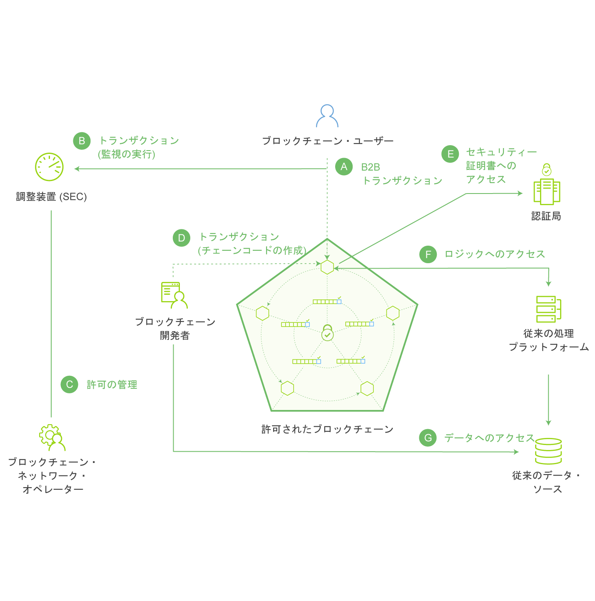

---

copyright:
  years: 2016, 2017
lastupdated: "2017-07-28"
---

{:new_window: target="_blank"}
{:shortdesc: .shortdesc}
{:codeblock: .codeblock}
{:screen: .screen}
{:pre: .pre}

# ブロックチェーンの基礎
{: #ibmblockchain_overview}

ブロックチェーンとは、新世代のトランザクション・アプリケーションのために新たなレベルの信頼性、説明責任、および透明性を確立することでビジネス・プロセスを効率化する、分散型台帳テクノロジー (DLT) です。ブロックチェーン・ネットワークは最初にビットコイン交換の市場に導入されましたが、その実際的な用途は暗号 (仮想) 通貨の取引にとどまりません。{{site.data.keyword.blockchainfull}} は、Linux Foundation の Hyperledger Project とともに、最も基本的なビジネス上のやり取りの方法を刷新し、デジタル式対話という新しい世界への扉を開きます。

{{site.data.keyword.blockchain}}では、一元化された集中管理拠点に依存せずに、価値を持つほぼすべてのものを追跡および取引の対象にすることができる、効率的かつ非常に安全なネットワークの構築によって企業間取引のコストと複雑さを減らします。金融界でブロックチェーン・ネットワークを活用すれば、証券取引の決済にかかる期間を数日から数分へと短縮することができます。商業界でこのネットワークを活用すれば、サプライ・チェーン・マネジメントが容易になり、商品と支払の流れをリアルタイムで追跡および記録できます。 

## ブロックチェーン・ネットワークの概要

{{site.data.keyword.blockchain}}・ネットワークでは、ネットワーク・トランザクションのレコードは共有台帳に保持されます。この台帳は、すべてまたは一部のネットワーク・メンバーの間で複製されます (各台帳はある 1 つのチャネルの範囲内に存在するため、あるメンバーのピアがそのチャネルに加入していなければ、そのチャネルのトランザクションは表示されません)。すべてのトランザクション (有効なトランザクションと無効なトランザクションの両方) のレコードが個々のブロックとして記録され、各チャネルのハッシュ・チェーン (つまり、ブロックチェーン) に追加されます。有効なトランザクションがあればワールド・ステート・データベースが更新されますが、無効なトランザクションではこのデータベースは更新されません。チェーンコード (「スマート・コントラクト」とも呼ばれます) は、台帳に対して読み取りや書き込みを行うための関数一式が含まれたソフトウェアの断片です。クライアント・サイド・アプリケーションでは SDK を活用して 1 つ以上のピアとやり取りし、最終的に特定の 1 つのチェーンコードの関数を呼び出します。チェーンコードで読み取りや書き込みを行うための 2 つの重要な Fabric API が `getState` と `putState` です。

**図 1** は、許可制ブロックチェーン・ネットワークの例を示しています。これは、分散型かつ非集中型のピアツーピア・アーキテクチャーを持ち、認証局がユーザーの役割と権限を管理しています。

*図 1. 許可制ブロックチェーン・ネットワーク: データ・フローおよびネットワーク・アクセスはメンバーの役割によって管理される*

これ以降の説明は、図 1 に示されているアーキテクチャーとフローに対応しています (順次処理を表しているわけではないことにご注意ください)。

**A:** ブロックチェーン・ユーザーがブロックチェーン・ネットワークにトランザクションを実行依頼します。トランザクションにはデプロイ、呼び出し、または照会を指定でき、SDK を活用するクライアント・サイド・アプリケーションを介して、または REST API を介して直接発行されます。  

**B:** 信頼できるビジネス・ネットワークが規制当局や監査当局 (例えば、米国株式市場における SEC (証券取引委員会)) へのアクセスを提供します。  

**C:** ブロックチェーン・ネットワーク・オペレーターは、規制当局 (B) を「監査員」に、ブロックチェーン・ユーザー (A) を「クライアント」に登録するなどして、メンバーのアクセス権を管理します。監査員の権限は台帳の照会のみに制限して、クライアントには特定のタイプのチェーンコードのデプロイ、呼び出し、照会を行う権限を与えることができます。 

**D:** ブロックチェーン開発者はチェーンコードとクライアント・サイド・アプリケーションを作成します。ブロックチェーン開発者は REST インターフェースを介してチェーンコードをネットワークに直接デプロイできます。従来のデータ・ソースの資格情報をチェーンコードに含める場合、開発者はアウト・オブ・バンド接続を使用してそのデータ (G) にアクセスできます。 

**E:** ブロックチェーン・ユーザーはピア・ノード (A) を介してネットワークに接続します。トランザクションを続行する前に、ノードはユーザーの登録とトランザクション証明書を認証局から取得します。許可されたネットワークでトランザクションを実行するために、ユーザーはこれらのデジタル証明書を所有する必要があります。

**F:** チェーンコードを駆動しようとするユーザーは、従来のデータ・ソース (G) にある自分の資格情報を確認することが必要になる可能性があります。ユーザーの権限を確認するために、チェーンコードは、従来の処理プラットフォームを介して、アウト・オブ・バンド接続を使用してそのデータにアクセスできます。
