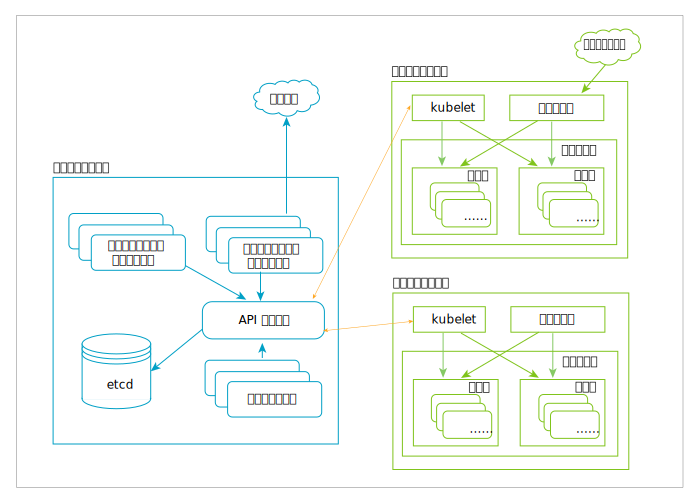

---

copyright:
  years: 2019
lastupdated: "2019-03-20"

subcollection: blockchain

---

{:new_window: target="_blank"}
{:shortdesc: .shortdesc}
{:screen: .screen}
{:codeblock: .codeblock}
{:note: .note}
{:important: .important}
{:tip: .tip}
{:pre: .pre}

# Kubernetes
{: #k8s-overview}

{{site.data.keyword.blockchainfull_notm}} Platform 2.0 無料ベータ版のコンソールを Kubernetes クラスターにデプロイする時には、{{site.data.keyword.cloud_notm}} Kubernetes Service を使用します。Kubernetes は、コンテナー化されたアプリケーションの自動デプロイ、自動スケーリング、および自動管理を行うためのオープン・ソース・システムです。
{:shortdesc}

Kubernetes では、コンテナーを中心にした管理環境を利用できます。この環境を利用して、ユーザー・ワークロードのための、コンピューティング・インフラストラクチャー、ネットワーク・インフラストラクチャー、ストレージ・インフラストラクチャーのオーケストレーションを行います。Platform as a Service (PaaS) のシンプルな環境に Infrastructure as a Service (IaaS) の柔軟性を組み合わせることによって、インフラストラクチャー・プロバイダー間のポータビリティーを実現しています。

Kubernetes のアーキテクチャー図を以下に示します。ノード、コンテナー、ポッドの詳しい説明については、この後に出てくる[主な Kubernetes オブジェクト](#k8s-overview-key-obj)のセクションを参照してください。

*図 1. Kubernetes のアーキテクチャー図*

## {{site.data.keyword.cloud_notm}} Kubernetes サービス
{: #k8s-overview-iks}

{{site.data.keyword.cloud_notm}} Kubernetes Service では、Docker コンテナー、Kubernetes テクノロジー、直観的なユーザー・エクスペリエンス、標準装備のセキュリティーと分離機能を結合させることにより、コンピュート・ホストのクラスター内でコンテナー化アプリのデプロイメント、操作、スケーリング、モニタリングを自動化する強力なツールが提供されます。

{{site.data.keyword.cloud_notm}} Kubernetes Service について詳しくは、{{site.data.keyword.cloud_notm}} Kubernetes Service 資料にある以下のトピックを参照してください。
- [{{site.data.keyword.cloud_notm}} Kubernetes Service テクノロジー ](https://cloud.ibm.com/docs/containers/cs_tech.html#ibm-cloud-kubernetes-service-technology "{{site.data.keyword.cloud_notm}} Kubernetes Service テクノロジーの資料")
- [{{site.data.keyword.cloud_notm}} Kubernetes Service を使用する理由 ](https://cloud.ibm.com/docs/containers?topic=containers-cs_ov#cs_ov "{{site.data.keyword.cloud_notm}} Kubernetes Service を使用する理由の資料")

## 主な Kubernetes オブジェクト
{: #k8s-overview-key-obj}

- **クラスター**

  Kubernetes で管理されているコンテナー化アプリケーションを実行する一連のマシンです。そうしたマシンのことをノードといいます。クラスターには幾つかのワーカー・ノードと少なくとも 1 つのマスター・ノードがあります。

- **ノード**

  ノードは Kubernetes 内のワーカー・マシンです。クラスターによっては、VM がノードになる場合もあれば、物理マシンがノードになる場合もあります。各ノードには、ポッドを実行するために必要なサービスが含まれています。それぞれのノードはマスター・コンポーネントによって管理されます。ノードのサービスには、コンテナー・ランタイム、`kubelet`、`kube-proxy` などがあります。詳しくは、Kubernetes 資料の [Kubernetes Node のセクション ](https://kubernetes.io/docs/concepts/architecture/nodes/ "Kubernetes Node のセクション") を参照してください。

- **コンテナー**

  ソフトウェアとそのすべての依存項目を組み込んだ軽量でポータブルな実行可能イメージです。コンテナーによって、基礎になっているホスト・インフラストラクチャーからアプリケーションが分離されるので、さまざまなクラウド環境や OS 環境へのデプロイメントを簡単に実行できます。スケーリングも容易になります。

- **ポッド**

  最も小さく最も単純な Kubernetes オブジェクトです。クラスターで実行する一連のコンテナーをまとめてポッドといいます。通常は、1 つのプライマリー・コンテナーを実行するために 1 つのポッドをセットアップします。ロギングなどの補足機能を追加するために、そのポッドでオプションのサイドカー・コンテナーを実行することも可能です。ポッドは基本的に、デプロイメントによって管理されます。詳しくは、Kubernetes 資料の [Kubernetes Pod のセクション ](https://kubernetes.io/docs/concepts/workloads/pods/pod/) を参照してください。
