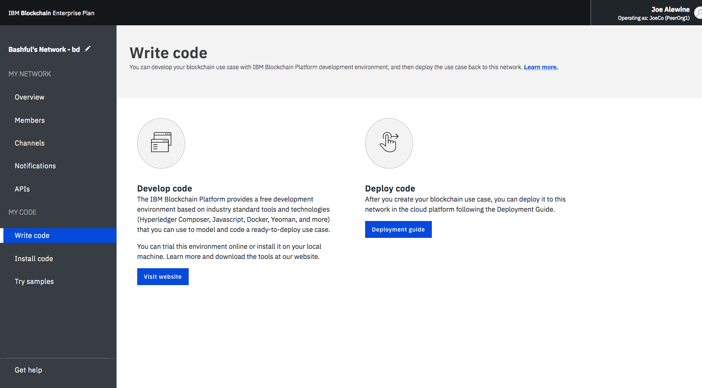
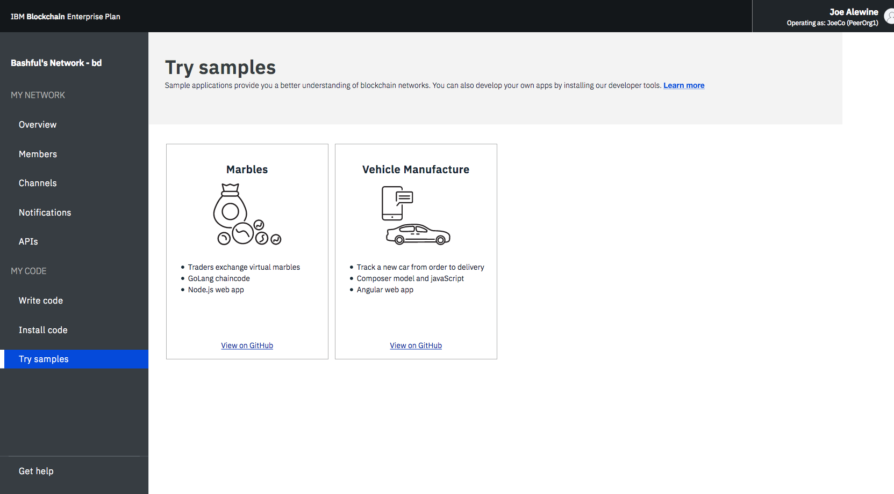

---

copyright:
  years: 2017, 2018
lastupdated: "2018-03-16"

---

{:new_window: target="_blank"}
{:shortdesc: .shortdesc}
{:codeblock: .codeblock}
{:screen: .screen}
{:pre: .pre}

# Enterprise Plan ネットワークの操作
{: #v10_dashboard}

{{site.data.keyword.blockchainfull}} Platform に用意されたネットワーク・モニターにはブロックチェーン環境の概要が示されるので、ネットワーク・リソース、メンバー、結合されたチャネル、トランザクション・パフォーマンス・データ、デプロイされたチェーンコードなどを把握できます。また、ネットワーク・モニターにはエントリー・ポイントとしての役割もあり、そこから Swagger API を実行したり、{{site.data.keyword.blockchainfull_notm}} Platform: Develop を使用してネットワークを開発したり、サンプル・アプリケーションを試したりできます。
{:shortdesc}

ネットワーク・モニターの 3 つのセクションには、以下の画面が表示されます。ネットワーク・モニターの左側のナビゲーターから各画面にナビゲートできます。
- **「マイ・ネットワーク」**セクションには、「[概説](#overview)」、「[メンバー](#members)」、「[チャネル](#channels)」、「[通知](#notifications)」、「[API](#apis)」の各画面が表示されます。
- **「マイ・コード」**セクションには、[「コードの書き込み」](#write_code)、[「コードのインストール」](#chaincode)および[「サンプルの試行」](#samples)の各画面が含まれます。
- 「[ヘルプの利用](#support)」画面には、Helios と Hyperledger Fabric ({{site.data.keyword.blockchainfull_notm}} Platform の基礎となっているコード・ベース) のサポート情報とリリース・ノートが表示されます。

## 概要
{: #overview}

「概要」画面には、順序付けサービス、CA、ピア・ノードなどのブロックチェーン・リソースについてのリアルタイムの状況情報が表示されます。 **「タイプ」**、**「名前」**、**「状況」**、**「アクション」** という 4 つの別々のヘッダーの下に各リソースが表示されます。 ブロックチェーン・ネットワークの作成中に、順序付けサービス・ノード 3 つと CA ノード 2 つが自動的に作成されます。 CA ノードはメンバーに固有のノードですが、順序付けサービス・ノードはネットワーク全体で共有される共通のエンドポイントです。

**図 1** に「概要」画面を示します。

*図 1. ネットワークの概要*

### ノード・アクション
  表の**「アクション」**ヘッダーには、リソースを開始または停止するためのボタンがあります。 複数のノードを選択し、**「選択済みを開始 (Start Selected)」**ボタンまたは**「選択済みを停止 (Stop Selected)」**ボタンをクリックして、ノードのグループを開始または停止することもできます。 **「選択済みを開始 (Start Selected)」**ボタンまたは**「選択済みを停止 (Stop Selected)」**ボタンは、1 つまたは複数のノードを選択すると、表の上部に表示されます。

  順序付けサービス・ノードでは停止アクションと開始アクションは使用できないことに注意してください。一般に、ネットワーク上のピア・ノードまたは CA ノードを停止したり開始したりする必要はありません。停止アクションと開始アクションは、例えばクリーンな状態にするためにピアを再始動する必要がある場合に備えて用意されています。

  **「アクション」**ヘッダーの下のドロップダウン・リストから**「ログの表示 (View Logs)」**をクリックして、コンポーネントのログを確認することもできます。 ログでは、さまざまなネットワーク・リソース間で出された呼び出しを調べることができるため、デバッグやトラブルシューティングに役立ちます。例えば、ピアを停止してトランザクションでそれをターゲットにしようとすると、接続エラーが発生します。ピアを再始動してトランザクションを再試行すると、接続が成功します。チャネルがトランザクション処理を続行しているときに、長期間にわたってピアをダウン状態のままにすることもできます。 ピアが再び稼働すると、台帳が同期されていることが分かります。これは、ピアがダウン状態の間にコミットされたブロックを受信するためです。台帳が完全に同期されたら、通常の呼び出しとそれに対する照会を実行できます。

### 接続プロファイル
  **「接続プロファイル」 **ボタンをクリックすると、各リソースの低レベル・ネットワーク情報についての JSONファイルが表示されます。 接続プロファイルには、アプリケーションに必要なすべての構成情報が含まれています。ただし、このファイルには特定のコンポーネントと順序付けプログラムのアドレスのみが含まれているため、追加のピアをターゲットにする必要がある場合は、それらのエンドポイントを取得する必要があります。「url」を含むヘッダーに、各コンポーネントの API エンドポイントが表示されます。 クライアント・サイド・アプリケーションから特定のネットワーク・コンポーネントをターゲットにするためには、これらのエンドポイントが必要です。また、エンドポイントの定義は一般にはアプリに付随する JSON モデルの構成ファイルに存在します。 組織外のピアからの承認を必要とするアプリケーションをカスタマイズする場合は、担当のオペレーターからアウト・オブ・バンド操作でそのピアの IP アドレスを取得する必要があります。 クライアントは、応答を返してもらう必要のあるすべてのピアに接続できなければなりません。

### ピアの追加
{: #peers}
**「ピアの追加」**ボタンをクリックして、ネットワークにピア・ノードを追加できます。 Starter Plan では、ネットワーク作成時に 2 つのピアが自動的に追加されます。Enterprise Plan では、初めてネットワークを作成するときやネットワークに参加するとき、あるいは後でネットワーク・モニターで、ピア・ノードを追加できます。追加のピアが必要なさまざまなシナリオが考えられます。例えば、冗長性のために複数のピアが同じチャネルに参加するようにすることができます。各ピアはチャネルのトランザクションを処理し、台帳のそれぞれのコピーに書き込みます。いずれかのピアが失敗した場合でも、他のピアはトランザクションとアプリケーション要求の処理を続行できます。すべてのアプリケーション要求をピア間で対称的にロード・バランシングすることも、機能ごとに異なるピアをターゲットにすることもできます。例えば、あるピアを台帳の照会用に使用し、別のピアを台帳更新のエンドースメント処理用に使用することができます。

  「ピアの追加 (Add Peers)」ポップアップ・パネルで、追加するピア・ノードの数を選択します。 <!--Currently only "small" peers are available for purchase, however there will eventually be "medium" and "large" to help accommodate larger workloads and higher transaction throughput.-->

## メンバー
{: #members}
「メンバー」画面には、ネットワーク・メンバー情報を表示する「メンバー」タブと、証明書情報を表示する「証明書」タブという 2 つのタブがあります。

### メンバー
{: #members_tab}
**図 2** に、ネットワーク・メンバーが「メンバー」タブに表示されている「メンバー」画面の初期画面を示します。

*図 2. ネットワーク・メンバー*

ネットワークを作成したときに招待したメンバーに加えて、「メンバー」タブから他のメンバーを招待することができます。 ネットワークにメンバーを招待するには、機関名とオペレーターの E メール・アドレスを入力して**「メンバーの追加」**をクリックします。 ネットワークには、最大で 15 のメンバーが参加できます (ネットワークのイニシエーターを含む)。 ネットワークからメンバーを削除するには、メンバーの行の最後にある「削除」記号をクリックします。

### 証明書
**図 3** に、メンバーの証明書が「証明書」タブに表示されている「メンバー」画面の初期画面を示します。

*図 3. 証明書*

オペレーターは、同じ機関に属するメンバーの証明書を「証明書」タブで管理できます。 **「証明書の追加」**をクリックして、「証明書の追加」パネルを開きます。 証明書に名前を指定し、「鍵」フィールドにクライアント・サイドの PEM 形式の証明書を貼り付け、**「実行依頼 (Submit)」**をクリックします。 このクライアント・サイドの証明書を有効にするためにピアを再始動する必要があります。

証明書の鍵の生成について詳しくは、[クライアント・サイドの証明書の生成](v10_application.html#generating-the-client-side-certificates)を参照してください。

## チャネル
{: #channels}

ネットワークをチャネルに分割できます。各チャネルは、そのチャネルでインスタンス化されたチェーンコードのデータを表示することを許可されたメンバーのサブセットを表します。 トランザクションを実行するためには、すべてのネットワークに 1 つ以上のチャネルが必要です。 チャネルごとに固有の台帳があり、その台帳に対して読み取り/書き込み操作を実行するには、ユーザーは正しく認証される必要があります。 チャネルに参加していないユーザーは、データを表示できません。

**図 4** に、ネットワークのすべてのチャネルの概要を表示するダッシュボードの初期画面を示します。

*図 4. チャネル*

チャネルを作成すると、チャネル固有の台帳が生成されます。 詳しくは、[チャネルの作成](howto/create_channel.html)を参照してください。

また、既存のチャネルを選択して、チャネル、メンバーシップ、アクティブ・チェーンコードに関する詳細を表示することもできます。 詳しくは、[ネットワークのモニター](howto/monitor_network.html)を参照してください。

## 通知
{: #notifications}

「通知」画面では、保留中の要求を処理したり、完了した要求を表示したりできます。

**図 5** に「通知」画面を示します。

*図 5. 通知*

チャネルを作成した場合、または新規チャネルに招待された場合、ネットワーク・モニターに通知が表示されます。

要求は「すべて」、「保留中」、「完了」の各サブタブにグループ分けされています。 各サブタブに含まれている要求の数が、サブタブのヘッダーの後ろに表示されています。
   * 「すべて」サブタブには、すべての要求が含まれています。
   * 承認も拒否もしていない要求、まだ参照していない要求は、「処理待ち (Pending)」サブタブに含まれています。 **「要求の確認 (Review Request)」**ボタンをクリックし、チャネル・ポリシーやメンバーなども含めて要求と投票状況を確認します。 チャネル・オペレーターは、要求の**受諾**または**拒否**を行なったり、**「後で」**をクリックしてそれを別の時に処理したりできます。 要求が十分な数のチャネル・オペレーターから承認された場合は、**「要求の実行依頼 (Submit Request)」**をクリックしてチャネルの更新をアクティブ化します。
   * 実行依頼した要求は「完了」サブタブに表示されます。  **「要求の確認 (Review Request)」**をクリックして、その詳細を確認できます。

要求のリストが長い場合は、上部の検索フィールドで要求を検索できます。

保留中の要求は、要求の前のチェック・ボックスを選択し、**「要求の削除 (Delete Request)」**をクリックして削除できます。 完了した要求は削除できません。

## API
{: #apis}

アプリケーション開発を容易にするために、{{site.data.keyword.blockchainfull_notm}} Platform は、Swagger UI でネットワークに対してテストできる API を公開しています。

*図 6. API*

**「Swagger UI」**リンクをクリックして Swagger UI を開きます。API を実行するには、その前にネットワーク資格情報 (この API ページにあります) を使用して Swagger UI に権限を与える必要があることに注意してください。詳しくは、[Swagger API の使用](howto/swagger_apis.html)を参照してください。

## コードの書き込み
{: #write-code}

Enterprise Plan は {{site.data.keyword.blockchainfull_notm}} Platform: Develop を統合し、業界標準のツールとテクノロジーを備えた開発環境を提供します。オンラインまたはローカルのいずれの環境でもネットワークを開発できます。ネットワークを開発したら、Enterprise Plan ネットワークに再びデプロイすることができます。

*図 7. コードの書き込み*

Enterprise Plan でコードを開発してデプロイする方法について詳しくは、[Enterprise Plan でのビジネス・ネットワークの開発](develop_enterprise.html)を参照してください。

## コードのインストール (Install code)
{: #chaincode}

チェーンコードは、「スマート・コントラクト」とも呼ばれるソフトウェアの一部分で、そこには台帳を照会および更新するための機能一式が含まれています。これらはピアにインストールされ、チャネル上でインスタンス化されます。

")
*図 8. コードのインストール (Install code)*

チェーンコードは、まずピアのファイル・システムにインストールされてから、チャネルでインスタンス化されます。 詳しくは、[チェーンコードのインストールとインスタンス化](howto/install_instantiate_chaincode.html)を参照してください。

## サンプルの試行
{: #samples}

サンプル・アプリケーションは、ブロックチェーン・ネットワークとアプリケーション開発についての理解を深めるのに役立ちます。Marbles サンプル・アプリケーションをインストールする方法については、ネットワーク・モニターで Marbles リポジトリーへのリンクをたどってください。独自のサンプルを開発してデプロイする方法について詳しくは、[アプリケーションの開発](v10_application.html)を確認してください。

次の**図 9** は、「サンプル」画面を示しています。

*図 9. サンプル*

## ヘルプの利用
{: #support}

「ヘルプの利用」画面には 2 つのタブがあります。「サポート」タブではサポート情報を提供し、「リリース・ノート」タブでは各リリースの新機能や変更された機能を記載しています。

**図 10** に、サポート情報が「サポート」タブに表示されている「サポート」画面の初期画面を示します。

*図 10. ブロックチェーン・サポート*

このページのリンクおよびリソースを使用して、トラブルシューティング・フォーラムおよびサポート・フォーラムにアクセスします。

* [{{site.data.keyword.blockchainfull_notm}} サービス資料](index.html)の**概説** (この資料サイト) には、{{site.data.keyword.Bluemix_notm}} で {{site.data.keyword.blockchainfull}} Platform を初めて使用する場合のガイドが用意されています。左側のナビゲーターから対応するトピックを見つけるか、上部の検索機能を使用して用語を検索できます。
* [IBM Developer Works ](https://developer.ibm.com/blockchain/) の**コミュニティーのヘルプ**には、開発者向けのリソースや情報があります。
* **サポート・チケット**の下の [IBM dWAnswers ](https://developer.ibm.com/answers/smartspace/blockchain/) は、質問と回答のやり取りを行うプラットフォームの役割を果たします。 過去に投稿された質問から回答を探したり、新しい質問を送信したりできます。 質問にはキーワード **blockchain** を含めてください。
  また、**「{{site.data.keyword.Bluemix_notm}} サポート・チケットのオープン」** オプションを使用して、チケットを {{site.data.keyword.blockchainfull_notm}} サポート・チームに送信することもできます。  該当する特定の {{site.data.keyword.Bluemix_notm}} インスタンスの詳細およびコード・スニペットを提供してください。
* [サンプル・アプリケーション ](https://github.com/ibm-blockchain) の**ブロックチェーン・サンプル・アプリケーション**には、アプリケーションの開発を支援するガイドやサンプル・コード・スニペットが用意されています。
* [Hyperledger Fabric ](http://hyperledger-fabric.readthedocs.io/) と [Hyperledger Fabric コミュニティー ](http://jira.hyperledger.org/secure/Dashboard.jspa) の **Hyperledger Fabric** には、Hyperledger Fabric スタックに関する詳細を調べることができます。[Hyperledger Expert ](https://chat.hyperledger.org/channel/general) では、Hyperledger Fabric コードについて質問することができます。

問題をデバッグできない場合や、疑問点の答を突き止めることができない場合は、IBM Cloud サービス・ポータルでサポート・ケースを送信してください。詳しくは、[サポートのページ](ibmblockchain_support.html)を参照してください。

図 11 と図 12 は、「リリース・ノート」タブに各リリースの新機能と変更機能が表示される「ヘルプの利用」の初期画面を示しています。

  
*図 11. Helios のリリース・ノート*

  
*図 12. Fabric のリリース・ノート*
