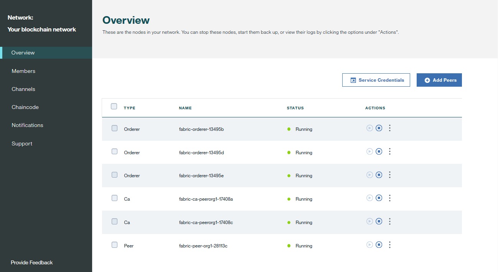
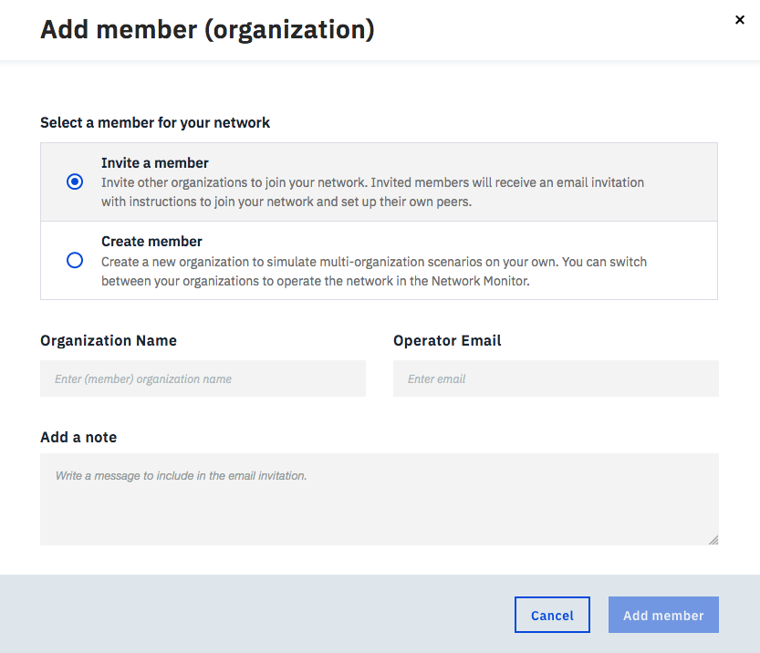
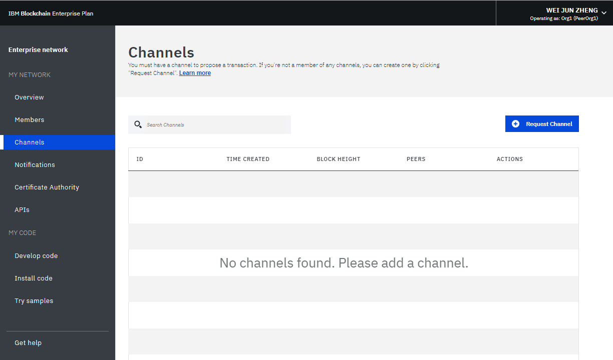

---

copyright:
  years: 2017, 2019
lastupdated: "2019-03-20"

keywords: Network Monitor, peer nodes, resources, channels, smart contract

subcollection: blockchain

---

{:new_window: target="_blank"}
{:shortdesc: .shortdesc}
{:codeblock: .codeblock}
{:screen: .screen}
{:pre: .pre}
{:note: .note}
{:important: .important}
{:tip: .tip}

# ネットワーク・モニターの使用
{: #ibp-dashboard}

{{site.data.keyword.blockchainfull}} Platform に用意されたネットワーク・モニターにはブロックチェーン環境の概要が示されるので、ネットワーク・リソース、メンバー、結合されたチャネル、トランザクション・パフォーマンス・データ、デプロイされたチェーンコードなどを把握できます。 また、ネットワーク・モニターにはエントリー・ポイントとしての役割もあり、そこから Swagger API を実行したり、{{site.data.keyword.blockchainfull_notm}} Platform を使用してネットワークを開発したり、サンプル・アプリケーションを試したりできます。
{:shortdesc}

このチュートリアルでは、ネットワーク・モニターを使用してエンタープライズ・プラン・ネットワークまたはスターター・プラン・ネットワークを操作する方法について学習します。 チュートリアルのほとんどのスクリーン・ショットはエンタープライズ・プラン用ですが、説明はスターター・プランにも有効です。 特定の機能が 1 つのプランでのみアクセス可能な場合、関連セクションに**「スターター・プラン・ネットワーク用」**または**「エンタープライズ・プラン・ネットワーク用」**のラベルが付きます。

## 左側のナビゲーション・ペイン
{: #ibp-dashboard-left-navigation}

ネットワーク・モニターの 3 つのセクションには、以下の画面が表示されます。 ネットワーク・モニターの左側のナビゲーターから各画面にナビゲートできます。
- **「マイ・ネットワーク」**セクションには、[「概説」](/docs/services/blockchain/v10_dashboard.html#ibp-dashboard-overview)、[「メンバー」](/docs/services/blockchain/v10_dashboard.html#ibp-dashboard-members)、[「チャネル」](/docs/services/blockchain/v10_dashboard.html#ibp-dashboard-channels)、[「通知」](/docs/services/blockchain/v10_dashboard.html#ibp-dashboard-notifications)、[「認証局」](/docs/services/blockchain/v10_dashboard.html#ibp-dashboard-ca)、および[「API」](/docs/services/blockchain/v10_dashboard.html#ibp-dashboard-apis)の各画面が表示されます。
- **「マイ・コード (My code)」**セクションには、「[コードの開発 (Develop code)](/docs/services/blockchain/v10_dashboard.html#ibp-dashboard-write_code)」、「[コードのインストール (Install code)](/docs/services/blockchain/v10_dashboard.html#ibp-dashboard-chaincode)」、「[サンプルの試行 (Try samples)](/docs/services/blockchain/v10_dashboard.html#ibp-dashboard-samples)」の各画面が表示されます。
- 「[ヘルプの利用](/docs/services/blockchain/v10_dashboard.html#ibp-dashboard-support)」画面には、Helios と Hyperledger Fabric ({{site.data.keyword.blockchainfull_notm}} Platform の基礎となっているコード・ベース) のサポート情報とリリース・ノートが表示されます。

ブロックチェーン・ネットワークの名前は、左側のナビゲーション・ペインの上部にあります。 ネットワーク・モニターで [ネットワークの名前を変更](/docs/services/blockchain/v10_dashboard.html#ibp-dashboard-network-name)できます。

ネットワーク・モニターの右上にあるドロップダウン・メニューから、[ネットワーク設定の確認と構成](/docs/services/blockchain/v10_dashboard.html#ibp-dashboard-network-preferences)を行えます。

このチュートリアルでは、上記の各画面および機能について説明します。

## 概要
{: #ibp-dashboard-overview}

「概要」画面には、順序付けサービス、CA、ピア・ノードなどのブロックチェーン・リソースについてのリアルタイムの状況情報が表示されます。 **「タイプ」**、**「名前」**、**「状況」**、**「アクション」** という 4 つの別々のヘッダーの下に各リソースが表示されます。 ブロックチェーン・ネットワークの作成中に、順序付けサービス・ノード 3 つと CA ノード 2 つが自動的に作成されます。 CA はメンバーに固有ですが、順序付けプログラムはネットワーク全体で共有される共通のエンドポイントです。

**図 1** に「概要」画面を示します。

*図 1. ネットワークの概要*

### ノード・アクション
{: #ibp-dashboard-node-actions}

表の**「アクション」**ヘッダーには、リソースを開始または停止するためのボタンがあります。 複数のノードを選択し、**「選択済みを開始 (Start Selected)」**ボタンまたは**「選択済みを停止 (Stop Selected)」**ボタンをクリックして、ノードのグループを開始または停止することもできます。 **「選択済みを開始 (Start Selected)」**ボタンまたは**「選択済みを停止 (Stop Selected)」**ボタンは、1 つまたは複数のノードを選択すると、表の上部に表示されます。

順序付けサービス・ノードでは停止アクションと開始アクションは使用できません。 一般に、ネットワーク上のピア・ノードまたは CA ノードを停止したり開始したりする必要はありません。 停止アクションと開始アクションは、例えばクリーンな状態にするためにピアを再始動する必要がある場合に備えて用意されています。

**「アクション」**ヘッダーの下のドロップダウン・リストから**「ログの表示 (View Logs)」**をクリックして、コンポーネントのログを確認することもできます。 ログでは、さまざまなネットワーク・リソース間で出された呼び出しを調べることができるため、デバッグやトラブルシューティングに役立ちます。 ネットワーク・ログの使用について詳しくは、[ブロックチェーン・ネットワークのモニタリング](/docs/services/blockchain/howto/monitor_network.html#monitor-blockchain-network)を参照してください。

ピアの開始と停止の影響を調べるために、ピアを停止し、そのピアをトランザクションのターゲットにしてみることができます。接続エラーがログに表示されるはずです。 ピアを再始動してトランザクションを再試行すると、接続が成功します。 チャネルがトランザクション処理を続行しているときに、長期間にわたってピアをダウン状態のままにすることもできます。 ピアが再び稼働すると、台帳が同期されていることが分かります。これは、ピアがダウン状態の間にコミットされたブロックを受信するためです。 台帳が完全に同期されたら、通常の呼び出しとそれに対する照会を実行できます。

### リモート・ピア構成
{: #ibp-dashboard-peer-connection-information}

{{site.data.keyword.cloud_notm}} の外部にピアをデプロイする場合は、構成の際に、ネットワークの API エンドポイント情報を提供する必要があります。 **「リモート・ピア構成 (Remote Peer Configuration)」**ボタンをクリックして、ピアを構成するネットワークの API エンドポイント情報を取得してください。 ポップアップ・ウィンドウに、ネットワーク ID、組織 MSP、CA 名、CA URL、および CA TLS 証明書を含む API エンドポイント情報が示されます。 各フィールドの端にあるコピー・アイコンをクリックしてそのフィールドの値をコピーすることも、**「ダウンロード」**ボタンをクリックしてすべてのフィールドの値を JSON ファイル形式で保存することもできます。 詳しくは、[{{site.data.keyword.blockchainfull_notm}} Platform for Amazon Web Services について](/docs/services/blockchain/howto/remote_peer.html#remote-peer-aws-about)および[{{site.data.keyword.blockchainfull_notm}} Platform for {{site.data.keyword.cloud_notm}} Private について](/docs/services/blockchain/ibp-for-icp-about.html#ibp-icp-about)を参照してください。

### 接続プロファイル
{: #ibp-dashboard-connection-profile}

**「接続プロファイル」 **ボタンをクリックすると、各リソースの低レベル・ネットワーク情報についての JSONファイルが表示されます。 接続プロファイルには、アプリケーションに必要なすべての構成情報が含まれています。 ただし、このファイルには特定のコンポーネントと順序付けプログラムのアドレスのみが含まれているため、追加のピアをターゲットにする必要がある場合は、それらのエンドポイントを取得する必要があります。 「url」を含むヘッダーに、各コンポーネントの API エンドポイントが表示されます。 クライアント・サイド・アプリケーションから特定のネットワーク・コンポーネントをターゲットにするためには、これらのエンドポイントが必要です。また、エンドポイントの定義は一般にはアプリに付随する JSON モデルの構成ファイルに存在します。 組織外のピアからの承認を必要とするアプリケーションをカスタマイズする場合は、担当のオペレーターからアウト・オブ・バンド操作でそのピアの IP アドレスを取得する必要があります。 クライアントは、応答を返してもらう必要のあるすべてのピアに接続できなければなりません。

### ピアの追加
{: #ibp-dashboard-peers}

ネットワーク・メンバーは、[ピア](/docs/services/blockchain/blockchain_component_overview.html#blockchain-component-overview-peer)をデプロイして、ネットワーク台帳のコピーを保管し、チェーンコードを実行して台帳を照会または更新します。 エンドースメント・ポリシーがピアをエンドース・ピアとして定義している場合、ピアはエンドースメント結果もアプリケーションに返します。

右上の**「ピアの追加」**ボタンをクリックして、ネットワークにピア・ノードを追加できます。 ポップアップの「ピアの追加」パネルで、追加するピア・ノードの数とサイズを選択します。 独自の要件に基づいて、組織にさらにピアを追加できます。 追加のピアが必要なさまざまなシナリオが考えられます。 例えば、冗長性のために複数のピアが同じチャネルに参加するようにすることができます。 各ピアが、チャネルのトランザクションを処理して、それぞれの台帳のコピーに書き込みます。 ピアの 1 つが失敗した場合、もう一方のピア (または複数の他のピア) は、トランザクションとアプリケーション要求の処理を続行できます。 さらに、すべてのアプリケーション要求を複数のピアに均等にロード・バランシングすることも、機能ごとに異なるピアをターゲットにすることもできます。 例えば、あるピアを台帳の照会用に使用し、別のピアを台帳更新のエンドースメント処理用に使用することができます。

**スターター・プラン**は、デフォルトではネットワークの開始時に形成された 2 つの組織のそれぞれにピアを 1 つずつ作成します。

### ストレージ (スターター・プラン・ネットワークの場合)
{: #ibp-dashboard-storage}

**図 2** に、ネットワークのストレージ使用状況が表示される「ストレージ」タブを示します。

*図 2. ストレージ*

「リソース」ダイアグラムには、ピアおよび認証局が使用するストレージ・スペースが表示されます。 作成したすべての組織、またはネットワークに招待したすべての組織が、このプールに含まれます。 リソースを消費する組織は、画面の 2 番目の黒丸にリストされます。

順序付けサービスは、別のリソース・プールからストレージを消費します。 ネットワークのメンバーが新しいチャネルを作成し、新しいトランザクション・ブロックを生成すると、順序付けサービスではより多くのリソースを消費する可能性があります。

## メンバー
{: #ibp-dashboard-members}

「メンバー」画面には、ネットワーク・メンバー情報を表示する「メンバー」タブと、証明書情報を表示する「証明書」タブという 2 つのタブがあります。

### エンタープライズ・プラン・ネットワークへのメンバーの追加
{: #ibp-dashboard-members-tab}

**図 3** に、ネットワーク・メンバーが「メンバー」タブに表示されている「メンバー」画面の初期画面を示します。

*図 3. ネットワーク・メンバー*

「メンバー」タブで他のメンバーを招待して、ネットワークの作成時に最初に招待されたメンバーに追加できます。 ネットワークにメンバーを招待するには、機関名とオペレーターの E メール・アドレスを入力して**「メンバーの追加」**をクリックします。 ネットワークには、最大で 15 のメンバーが参加できます (ネットワークのイニシエーターを含む)。 ネットワークからメンバーを削除するには、メンバーの行の最後にある「削除」記号をクリックします。

### スターター・プラン・ネットワークへのメンバーの追加

**図 4** に「メンバーの追加」ウィンドウを示します。

*図 4. メンバーの追加*

**「メンバーの追加」**をクリックすると、以下の 2 つのオプションが表示されます。
- **「メンバーの招待 (Invite a member)」**。 ネットワークのメンバーになるように他の組織を招待できます。 招待された組織は、ネットワークに参加して共同作業を行えるようになります。
- **「メンバーの作成 (Create member)」**。 ユーザー自身の E メール・アドレスを使用してメンバーを作成することもできます。 スターター・プランにデフォルトで用意されている 2 つの組織を制御できるのと同じように、ユーザーは自分で作成したメンバーも制御できます。

### 証明書
{: #ibp-dashboard-certificates}

**図 5** に、メンバーの証明書が「証明書」タブに表示されている「メンバー」画面の初期画面を示します。

*図 5. 証明書*

オペレーターは、同じ機関に属するメンバーの証明書を「証明書」タブで管理できます。 **「証明書の追加」**をクリックして、「証明書の追加」パネルを開きます。 証明書に名前を指定し、「鍵」フィールドにクライアント・サイドの PEM 形式の証明書を貼り付け、**「実行依頼 (Submit)」**をクリックします。 このクライアント・サイドの証明書を有効にするためにピアを再始動する必要があります。

証明書鍵の生成について詳しくは、[アプリケーションのエンロール](/docs/services/blockchain/v10_application.html#dev-app-enroll)を参照してください。

## チャネル
{: #ibp-dashboard-channels}

チャネルは、プライベート・トランザクションを実行する必要があるネットワーク・メンバーのサブセットで構成されます。チャネルに属するメンバーは、チャネル固有のルールを確立し、メンバーのみがアクセスできる独自の台帳を使用できるので、データの分離と機密性を確保できます。 トランザクションを実行するためには、すべてのネットワークに 1 つ以上のチャネルが必要です。 チャネルごとに固有の台帳があり、その台帳に対して読み取り/書き込み操作を実行するには、ユーザーは正しく認証される必要があります。 チャネルに参加していないユーザーは、データを表示できません。

**図 6** に、ネットワークのすべてのチャネルの概要を表示するダッシュボードの初期画面を示します。

*図 6. チャネル*

チャネルを作成すると、チャネル固有の台帳が生成されます。 詳しくは、[チャネルの作成](/docs/services/blockchain/howto/create_channel.html#ibp-create-channel)を参照してください。

また、既存のチャネルを選択して、チャネル、メンバーシップ、アクティブ・チェーンコードに関する詳細を表示することもできます。 詳しくは、[ネットワークのモニター](/docs/services/blockchain/howto/monitor_network.html#monitor-blockchain-network)を参照してください。

「メンバー」画面の[「証明書」タブ](/docs/services/blockchain/v10_dashboard.html#ibp-dashboard-certificates)を使用して新規証明書をプラットフォームにアップロードした場合は、このパネルを使用して証明書をチャネルに追加できます。 関連するチャネルの横にある**「アクション」**ヘッダーの下のドロップダウン・リストから**「証明書の同期」**をクリックします。 これにより、チャネル上でのチェーンコードのインスタンス化など、リモート・クライアントからチャネルを操作できます。 詳しくは、[証明書の管理](/docs/services/blockchain/certificates.html#managing-certificates)チュートリアルの[署名付き証明書の {{site.data.keyword.blockchainfull_notm}} Platform へのアップロード](/docs/services/blockchain/certificates.html#managing-certificates-upload-certs)を参照してください。

## 通知
{: #ibp-dashboard-notifications}

チャネルを作成した場合、または新規チャネルに招待された場合、ネットワーク・モニターに通知が表示されます。 これらの要求は、「通知」画面で表示および応答できます。

**図 7** に「通知」画面を示します。

*図 7. 通知*

要求は「すべて」、「保留中」、「完了」の各サブタブにグループ分けされています。 各サブタブに含まれている要求の数が、サブタブのヘッダーの後ろに表示されています。
   * 「すべて」サブタブには、すべての要求が含まれています。
   * 承認も拒否もしていない要求、まだ参照していない要求は、「処理待ち (Pending)」サブタブに含まれています。 **「要求の確認 (Review Request)」**ボタンをクリックし、チャネル・ポリシーやメンバーなども含めて要求と投票状況を確認します。 チャネル・オペレーターは、要求の**受諾**または**拒否**を行なったり、**「後で」**をクリックしてそれを別の時に処理したりできます。 要求が十分な数のチャネル・オペレーターから承認された場合は、**「要求の実行依頼 (Submit Request)」**をクリックしてチャネルの更新をアクティブ化します。
   * 実行依頼した要求は「完了」サブタブに表示されます。 **「要求の確認 (Review Request)」**をクリックして、その詳細を確認できます。

要求のリストが長い場合は、上部の検索フィールドで要求を検索できます。

保留中の要求は、要求の前のチェック・ボックスを選択し、**「要求の削除 (Delete Request)」**をクリックして削除できます。 完了した要求は削除できません。

## 認証局
{: #ibp-dashboard-ca}

「認証局」(CA) 画面の表には、管理者、ピア、クライアント・アプリケーションなど、組織に登録されたすべての ID が表示されます。 この画面を使用して新しい ID を登録することもできます。

**図 8** に「認証局」画面を示します。

*図 8. 認証局*

管理者 ID の横にある**「証明書の生成」**ボタンをクリックすると、新しいパブリック証明書と秘密鍵を CA から取得できます。 **「証明書」**フィールドには、**「秘密鍵」**のすぐ上に、パブリック証明書 (署名付き証明書またはエンロール証明書とも呼ばれる) が含まれています。 各フィールドの端にあるコピー・アイコンをクリックすると、そのフィールドの値をコピーできます。 このパネルは、Fabric SDK を使用するクライアント・アプリケーションで公開鍵と秘密鍵のペアを生成する方法の代替方法として使用できます。 詳しくは、[アプリケーションの開発チュートリアル](/docs/services/blockchain/v10_application.html#dev-app)を参照してください。 {{site.data.keyword.blockchainfull_notm}} Platform にはそれらの証明書が保管されないことに**注意してください**。 ユーザーがそれらを安全に保存して保管する必要があります。

**「ユーザーの追加」**ボタンをクリックして、新しい ID を組織に登録します。 **「ユーザーの追加」**ポップアップ・ウィンドウで、以下のフィールドに入力し、**「送信」**をクリックします。
  - **登録 ID:** 新しい ID の名前です。`登録 ID` と呼ぶこともあります。 **この値を保存**し、リモート・ピアを構成したり新しいアプリケーションをエンロールしたりするときに使用する必要があります。
  - **機密事項の登録:** ID のパスワードです。`登録機密事項`と呼ぶこともあります。 **この値を保存**し、リモート・ピアを構成したり新しいアプリケーションをエンロールしたりするときに使用する必要があります。
  - **タイプ:** 登録する ID のタイプを選択します。ピアまたはクライアント・アプリケーションのいずれかです。
  - **所属団体名 (Affiliation):** ID を所属させる組織内の団体名 (`org1` など) です。
  - **最大登録数:** このフィールドを使用して、この ID を使用した証明書のエンロールまたは生成の回数を制限できます。 このフィールドをブランクのままにすると、エンロール回数はデフォルト値の無制限になります。

CA について詳しくは、[{{site.data.keyword.blockchainfull_notm}} Platform の証明書の管理](/docs/services/blockchain/certificates.html#managing-certificates)チュートリアルを参照してください。

## API
{: #ibp-dashboard-apis}

{{site.data.keyword.blockchainfull_notm}} Platform では多数の REST API を Swagger で公開しており、これらを使用してノード、チャネル、ピア、およびネットワーク・メンバーを管理できます。 アプリケーションではこれらの API を使用して、ネットワーク・モニターを使用せずに重要なネットワーク・リソースを制御できます。

**図 9** に「API」画面を示します。

*図 9. API*

**「Swagger UI」**リンクをクリックして Swagger UI を開きます。 API を実行するには、その前にネットワーク資格情報 (この API ページにあります) を使用して Swagger UI に権限を与える必要があることに注意してください。 詳しくは、[Swagger API を使用したネットワークとの対話](/docs/services/blockchain/howto/swagger_apis.html#ibp-swagger)を参照してください。

## コードの開発 (Develop Code)
{: #ibp-dashboard-write-code}

{{site.data.keyword.IBM_notm}} では、実動の Hyperledger Composer を使用するネットワークをサポートしていません。これには Composer CLI、JavaScript API、REST サーバー、および Web Playground が含まれます。{:note}

スターター・プランおよびエンタープライズ・プランは、業界標準のツールとテクノロジーを備えた開発環境を提供します。 ネットワークを開発したら、お客様のネットワークにそのネットワークをデプロイできます。

**図 10** は、「コードの開発 (Develop code)」画面を示しています。

")
*図 10. コードの開発 (Develop code)*

ビジネス・ネットワークの開発およびデプロイについて詳しくは、[スターター・プランおよびエンタープライズ・プランへのビジネス・ネットワークのデプロイ](/docs/services/blockchain/develop_starter_enterprise.html#deploying-a-business-network)を参照してください。

## コードのインストール (Install code)
{: #ibp-dashboard-chaincode}

チェーンコードは、「スマート・コントラクト」とも呼ばれるソフトウェアの一部分で、そこには台帳を照会および更新するための機能一式が含まれています。 これらはピアにインストールされ、チャネル上でインスタンス化されます。

**図 11** に「コードのインストール」画面を示します。

")
*図 11. コードのインストール (Install code)*

チェーンコードは、まずピアのファイル・システムにインストールされてから、チャネルでインスタンス化されます。 詳しくは、[チェーンコードのインストール、インスタンス化、および更新](/docs/services/blockchain/howto/install_instantiate_chaincode.html#install-instantiate-chaincode)を参照してください。

## サンプルの試行
{: #ibp-dashboard-samples}

サンプル・アプリケーションは、ブロックチェーン・ネットワークとアプリケーション開発についての理解を深めるのに役立ちます。 サンプルの使用方法、およびサンプルの {{site.data.keyword.blockchainfull_notm}} Platform へのデプロイ方法を学習するには、**「GitHub の表示」**リンクに従ってください。 サンプルの開発およびデプロイ方法について詳しくは、[サンプル・アプリケーションのデプロイ](/docs/services/blockchain/howto/prebuilt_samples.html#deploying-sample-applications)を参照してください。

**図 12** に「サンプルの試行」画面を示します。

*図 12. 「サンプル」*

## ヘルプの利用
{: #ibp-dashboard-support}

「ヘルプの利用」画面には、開発者向けのリソースのリストが表示される「サポート」タブおよび {{site.data.keyword.blockchainfull_notm}} Platform の新機能が記載された「リリース・ノート」タブがあります。

**図 13** に、「サポート」タブの初期画面に表示される情報を示します。

*図 13. ブロックチェーン・サポート*

### ブロックチェーンのリソースおよびサポート・フォーラム
{: #ibp-dashboard-support-forums}

「サポート」タブのリソースを使用して、問題のトラブルシューティングを行い、{{site.data.keyword.IBM_notm}} および Fabric コミュニティーから支援を受けます。 「サポート」タブのリンクについて詳しくは、[サポートについて](/docs/services/blockchain/ibmblockchain_support.html#blockchain-support)の[リソースおよびサポート・フォーラム](/docs/services/blockchain/ibmblockchain_support.html#blockchain-support-resources)を参照してください。

[{{site.data.keyword.IBM_notm}} dWAnswers ](https://developer.ibm.com/answers/smartspace/blockchain/index.html){:new_window} は {{site.data.keyword.blockchainfull_notm}} Platform と Hyperledger Fabric のユーザー向けのコミュニティー・フォーラムであり、IBM の専門家によって監視されています。 過去に投稿された質問への回答を探したり、新しい質問を送信したりできます。 問題をデバッグできない場合や、疑問点の答を突き止めることができない場合は、{{site.data.keyword.cloud_notm}} サービス・ポータルでサポート Case を送信してください。 詳しくは、[サポート・ケースの送信](/docs/services/blockchain/ibmblockchain_support.html#blockchain-support-cases)を参照してください。

### Fabric のリリース・ノート
{: #ibp-dashboard-release-notes}

「リリース・ノート」タブには、ネットワークの最新機能が表示されます。 「ネットワーク・モニター UI」ボタンをクリックすると、{{site.data.keyword.blockchainfull_notm}} Platform ユーザー・エクスペリエンスの新機能とバグ・フィックスが表示されます。 「Hyperledger ファブリック」ボタンをクリックすると、ネットワークのバージョンの Hyperledger Fabric および Fabric 認証局のリリース・ノートが表示されます。

**図 14** に、ネットワーク・モニター UI のリリース・ノートを示します。

*図 14. Network Monitor UI のリリース・ノート*

**図 15** に、ネットワークのバージョンの Hyperledger Fabric と Fabric 認証局のリリース・ノートを示します。

*図 15. Fabric のリリース・ノート*

## ネットワーク設定 (Network preferences)
{: #ibp-dashboard-network-preferences}

右上隅をクリックし、ドロップダウン・メニューを開いて、**「ネットワーク設定 (Network preferences)」**を開きます。 「ネットワーク設定 (Network preferences)」ウィンドウが開きます。 「ネットワーク設定 (Network preferences)」ウィンドウには、ネットワーク名、Fabric のバージョン、{{site.data.keyword.cloud_notm}} 内のネットワーク・ロケーション、状態データベース・タイプなど、ネットワークの基本情報が表示されます。

2018 年 5 月 15 日より後に作成した**エンタープライズ・プラン・ネットワーク**は、Hyperledger Fabric v1.1.1 で実行されます。 アップグレード後にネットワークを作成した場合は、「ネットワーク設定 (Network preferences)」ウィンドウでネットワークの Web 非アクティブ・タイムアウトと相互 TLS も管理することができます。 これらの設定を変更できるのは、ネットワーク・イニシエーターのみです。

### Web 非アクティブ・タイムアウト (Web inactivity timeout)
{: #ibp-dashboard-web-inactivity-timeout}

**注**: Web 非アクティブ・タイムアウト設定を変更できるのは、**ネットワーク・イニシエーター**のみです。 これはネットワーク・レベルの設定であり、すべてのネットワーク・メンバーに影響します。

デフォルトでは、Web 非アクティブ・タイムアウトは**「オフ」**に設定されます。 Web 非アクティブ・タイムアウトを**オン**にした場合、非アクティブ状態が 10 分続いたネットワーク・メンバーはすべて自動的にログアウトされます。 Web 非アクティブ・タイマーが 10 分に達すると、ネットワーク・メンバーのアカウントのセキュリティーを確保するために、Web 非アクティブ・タイムアウト機能によって非アクティブな Web セッションが終了させられます。 リンクをクリックするか、ネットワーク・モニターを更新すると、Web 非アクティブ・タイマーはリセットされます。 10 分に達する前にブラウザーのウィンドウまたはタブを閉じた場合も、Web セッションは終了します。

次の**図 16** は、「ネットワーク設定 (Network preferences)」ウィンドウを示しています。

")
*図 16. ネットワーク設定 (Network preferences)*

### 相互 TLS (エンタープライズ・プラン・ネットワークの場合)
{: #ibp-dashboard-mutual-tls}

**エンタープライズ・プラン・ネットワーク**を使用すると、相互 TLS を有効にして、アプリケーションとブロックチェーン・コンポーネントの間の通信を保護できます。

**注**: 相互 TLS を有効または無効にできるのは、**ネットワーク・イニシエーター**のみです。 これはネットワーク・レベルの設定であり、すべてのネットワーク・メンバーに影響します。

デフォルトでは、「相互 TLS (mutual TLS)」ボタンは**「オフ」**に設定されています。 相互 TLS を有効にする場合は、この機能をサポートするようにアプリケーションを更新する必要があります。 そうしないと、アプリケーションはネットワークと通信できません。

Fabric 1.1 Enterprise Plan ネットワークの場合は、組織ごとに独自の相互 TLS 認証局 (CA) があります。 相互 TLS の CA に接続するために必要な情報は、ネットワーク・モニターの**「概要」**画面で**「接続プロファイル (Connection Profile)」**ボタンをクリックしてアクセスできる[接続プロファイル](/docs/services/blockchain/v10_dashboard.html#ibp-dashboard-connection-profile)で確認できます。 接続プロファイルには、CA に接続し、ネットワークに接続するために必要な証明書を取得するための必須情報が含まれています。

接続プロファイルで `certificateAuthorities` セクションを見つけます。このセクションには、相互 TLS を使用してネットワークと通信するための証明書を登録および取得するために必要な以下の属性があります。

- `url`: 相互 TLS 証明書を提供できる CA に接続するための URL
- `enrollId`: 証明書を取得するために使用する登録 ID
- `enrollSecret`: 証明書を取得するために使用する登録シークレット
- `x-tlsCAName`: アプリケーションでの相互 TLS を使用した通信を可能にするための証明書を取得する際に使用する CA 名。

相互 TLS をサポートするようにアプリケーションを更新する方法について詳しくは、[How to configure mutual TLS ](https://fabric-sdk-node.github.io/tutorial-mutual-tls.html) を参照してください。

<!--

### CouchDB state database
{: #couchdb}

**Note**: Only the **network initiator** can switch the state database from LevelDB to CouchDB. This is a network level setting and will affect all network members. Switching to CouchDB is permanent. You cannot revert back to LevelDB.

Before Enterprise Plan upgrades to Fabric v1.1, all network peers store data in the pure key-value LevelDB. With Fabric v1.1, you can choose to use CouchDB as your state database. CouchDB is a document datastore that permits indexing the contents of your data and allows you to issue rich queries against the data on your peer. Note that Hyperledger Fabric does not support peers running different databases. If CouchDB is used, it must be used by all of the peers.

To use CouchDB, your data must be stored in a data format that can be modeled in chaincode, such as JSON. If the decision is made to migrate from LevelDB to CouchDB, the {{site.data.keyword.blockchainfull_notm}} Platform will migrate your data from key-value format to the CouchDB format automatically.

If you switch to CouchDB, you need to update your chaincode to take advantage of indexes and rich queries. For more information about CouchDB and how to set up indexes, see [Best practices when using CouchDB](/docs/services/blockchain/best_practices.html#best-practices-app-couchdb-indices) in the Developing applications tutorial. For more information about updating chaincode in {{site.data.keyword.blockchainfull_notm}} Platform, see [Updating a chaincode](/docs/services/blockchain/howto/install_instantiate_chaincode.html#install-instantiate-chaincode-update-cc).

-->

次の**図 17** は、「ネットワーク設定 (Network preferences)」ウィンドウを示しています。

")
*図 17. ネットワーク設定 (Network preferences)*

## ネットワーク名の更新
{: #ibp-dashboard-network-name}

スターター・プランまたはエンタープライズ・プランのインスタンスを作成すると、{{site.data.keyword.blockchainfull_notm}} Platform によってネットワークに名前が割り当てられます。 ただし、このネットワーク名はネットワーク・モニターでいつでも更新できます。

ネットワーク・モニターの左側にあるナビゲーターの上部でネットワーク名をクリックすると、フィールドが編集可能になります。 使用する新規ネットワーク名を入力し、**Enter** キーを押します。 ネットワーク名は数秒で更新されます。

**図 18** に、スターター・プランのネットワーク名を、割り当てられた名前から「Starter Plan Network」に更新する手順を示します。

*図 18. ネットワーク名の更新*

## ネットワークの切り替え (スターター・プラン・ネットワークの場合)
{: #ibp-dashboard-switch-network}

スターター・プランで複数のネットワークを作成した場合、ネットワーク・モニターでネットワークを切り替えることができます。

ネットワーク・モニターの左側にあるナビゲーターの上部で、ネットワーク名の横にある矢印アイコンをクリックします。 ドロップダウン・リストから、切り替え先のネットワークの名前を選択してクリックします。 Web ブラウザーが更新され、切り替え先のネットワークのネットワーク・モニターが開きます。

**図 19** に、別のスターター・プラン・ネットワークに切り替える手順を示します。

*図 19. ネットワークの切り替え*

## ネットワークのリセット (スターター・プラン・ネットワークの場合)
{: #ibp-dashboard-reset-network}

スターター・プラン・ネットワークは、ネットワークを削除して再作成することなく、ネットワーク構成を編集する機能を提供します。 ネットワークは初期ネットワーク構成にリセットできます。つまり、 2 つの組織、組織ごとに 1 つのピア、1 つのデフォルト・チャネルという構成になります。 例えば、ブロックチェーン・ネットワークのテストを繰り返し実行していて、クリーンなネットワークからやり直す必要がある場合などに便利です。

**注意**: ネットワークをリセットすると、ピア、順序付けプログラム、CA の API エンドポイントが変更されます。 アプリケーションで API エンドポイント情報を調整する必要があります。

右上隅をクリックして、ドロップダウン・メニューを開きます。 メニューの**「ネットワークのリセット」**ボタンをクリックします。 ネットワークをリセットする準備ができたら、**「OK」**をクリックして続行します。 ネットワーク・モニターが最新表示され、新しい設定が反映されます。

**図 20** に「ネットワークのリセット」機能を示します。

*図 20. 「ネットワークのリセット」*
