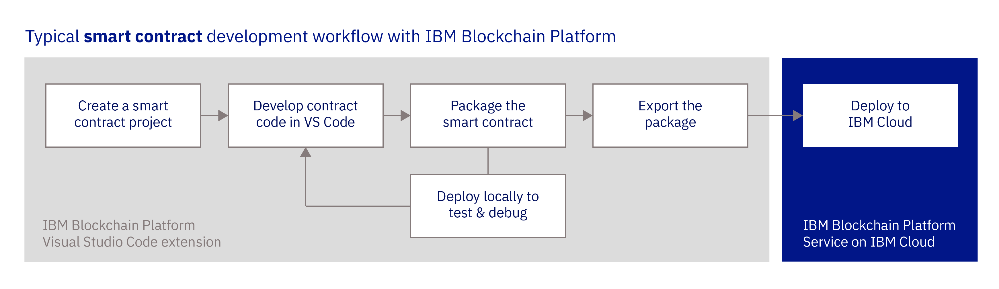

---

copyright:
  years: 2017, 2019
lastupdated: "2019-05-16"

keywords: vs code extension, Visual Studio Code extension, smart contract, development tools

subcollection: blockchain

---

{:new_window: target="_blank"}
{:shortdesc: .shortdesc}
{:codeblock: .codeblock}
{:screen: .screen}
{:note: .note}
{:important: .important}
{:tip: .tip}
{:pre: .pre}

# Visual Studio Code 拡張機能によるスマート・コントラクトの開発
{: #develop-vscode}

{{site.data.keyword.blockchainfull}} Platform Visual Studio (VS) Code 拡張機能は、スマート・コントラクトを開発、パッケージ化、およびテストするための、Visual Studio Code 内の環境を提供します。この拡張機能を使用して、スマート・コントラクト・プロジェクトを作成し、ビジネス・ロジックの開発を開始できます。その後、{{site.data.keyword.blockchainfull_notm}} Platform にスマート・コントラクトをデプロイする前に、Hyperledger Fabric の事前構成済みインスタンスを使用して、ローカル・マシンで VS Code を使用してスマート・コントラクトをテストできます。このチュートリアルでは、VS Code 拡張機能の使用方法について説明します。

*図 1. {{site.data.keyword.blockchainfull_notm}} Platform VS Code 拡張機能*を使用した標準的なスマート・コントラクトの開発のワークフロー  

<!--

<map name="home_map1" id="home_map1">
<area href="/docs/services/blockchain/vscode-extension.html#develop-vscode-creating-a-project" alt="Create a smart contract project" title="Create a Smart contract project" shape="rect" coords="157.05, 52.53, 283.62, 127.11" />
<area href="/docs/services/blockchain/vscode-extension.html#develop-vscode-creating-a-project" alt="Develop contract code in VS Code" title="Create key pair" shape="rect" coords="300.97, 52.53, 427.54, 127.11" />
<area href="/docs/services/blockchain/vscode-extension.html#packaging-a-smart-contract" alt="Package the smart contract" title="Package the smart contract" shape="rect" coords="157.05, 131.8, 283.62, 206.37" />
<area href="/docs/services/blockchain/vscode-extension.html#develop-vscode-deploy" alt="Deploy locally to debug" title="Deploy locally to debug" shape="rect" coords="300.97, 131.8, 427.54, 206.37" />
<area href="/docs/services/blockchain/vscode-extension.html#develop-vscode-exporting-deleting-smart-contract-package" alt="Export the package" title="Export the package" shape="rect" coords="443.95, 131.8, 570.53, 206.37" />
<area href="/docs/services/blockchain/vscode-extension.html#develop-vscode-connecting-ibp" alt="Deploy to IBM Cloud" title="Deploy to IBM Cloud" shape="rect" coords="585.53, 131.8, 712.1, 206.37" />
-->

{{site.data.keyword.blockchainfull_notm}} Platform 拡張機能は、Hyperledger Fabric バージョン 1.4 以降を使用する {{site.data.keyword.blockchainfull_notm}} Platform のすべてのインスタンスとシームレスに機能します。
{: note}

## ステップ 1: 無料の {{site.data.keyword.blockchainfull_notm}} Platform VS Code 拡張機能のインストール
{: #develop-vscode-install}

{{site.data.keyword.blockchainfull_notm}} Platform VS Code 拡張機能をインストールする前に、前提条件を満たす必要があります。

### 前提条件
{: #develop-vscode-prerequisites}

- **Visual Studio Code のインストール**  
  [Visual Studio](https://code.visualstudio.com/) コード・エディターをインストールします。  
- **Yeoman のインストール**  
  Yeoman は、スケルトン・スマート・コントラクト・プロジェクトの作成に使用できるジェネレーター・ツールです。Yeoman をインストールするには、`npm install -g yo` コマンドを使用します。  
- **Docker のインストール**  
  Hyperledger Fabric の事前構成インスタンスを実行するには、[Docker ](https://www.docker.com/) がインストールされていることを確認します。  
- **オペレーティング・システム要件**  
  現在、この拡張機能は Mac、Windows、および Linux と互換性があります。  
- **Hyperledger Fabric バージョン要件**  
  この拡張機能は、Hyperledger Fabric バージョン 1.4.0 以降と互換性があります。  

### 拡張機能のインストール
{: #develop-vscode-installing-the-extension}

1. [Visual Studio Code 拡張機能のマーケットプレイス・ページ ](https://marketplace.visualstudio.com/items?itemName=IBMBlockchain.ibm-blockchain-platform)  にナビゲートするか、Visual Studio Code 内の「拡張機能」パネルで **{{site.data.keyword.blockchainfull_notm}} Platform** を検索します。
2. **「インストール」**をクリックします。
3. Visual Studio Code を再始動して、拡張機能のインストールを完了します。

インストールしたら、VS Code の左側の {{site.data.keyword.blockchainfull_notm}} アイコンを使用して、「{{site.data.keyword.blockchainfull_notm}} Platform」パネルを開くことができます。

また、この拡張機能により、Visual Studio Code のコマンド・パレットに新しいコマンドが追加されます。コマンド・パレットを使用すると、このガイドで詳細に説明された多くの操作を実行できます。

## ステップ 2: スマート・コントラクト・プロジェクトの作成
{: #develop-vscode-creating-a-project}

この拡張機能を使用して、Visual Studio Code で新しいスマート・コントラクト・プロジェクトを作成できます。拡張機能により、選択した言語で資産の例を管理する基本的なスマート・コントラクトが作成されます。この例の構造を、独自のビジネス・ロジックの開発の開始点として使用できます。拡張機能で、スマート・コントラクトを Hyperledger Fabric のインスタンスにデプロイするために必要なすべての従属関係が提供されます。

1. 「**{{site.data.keyword.blockchainfull_notm}}**」タブを開きます。「smart contract packages」ペインのオーバーフロー・メニューをクリックして、**「Create Smart Contract Project」**をクリックします。
2. 作成するスマート・コントラクトの言語を選択します。現在のオプションは、JavaScript、TypeScript、Go、および Java です。**注:** {{site.data.keyword.blockchainfull_notm}} Platform では Java チェーンコードはサポートされていません。
3. コントラクトの例によって管理される資産を選択します。例えば、***債券*** などです。
4. プロジェクトの名前のフォルダーを作成して開きます。
5. 新規プロジェクトを開く方法を選択します。 プロジェクト・フォルダーが開きます。

プロジェクトが開くと、左側のペインのエクスプローラー・ウィンドウで、新しいスマート・コントラクトを見つけることができます。プロジェクトの構造は、選択した言語に応じて異なります。ただし、各スマート・コントラクトには、同じ要素が含まれます。
- スマート・コントラクトのソース・コード。拡張機能によって、資産の例を管理する一連の関数を指定した `fabric-contract-api` を使用して、基本的なスマート・コントラクトが作成されます。例えば、***bond*** を選択した場合は、`createBond`、`updateBond`、`readBond`、`bondExists`、および `deleteBond` の関数が見つかります。
- テスト・ファイル。
- 付随するスマート・コントラクトの従属関係。

## ステップ 3: スマート・コントラクトのパッケージ化
{: #packaging-a-smart-contract}

{{site.data.keyword.blockchainfull_notm}} Platform ネットワークまたは事前構成済みの Hyperledger Fabric ネットワークにスマート・コントラクトをインストールするには、`.cds` 形式でそのスマート・コントラクトをパッケージ化する必要があります。スマート・コントラクトをパッケージ化するには、以下の手順を実行します。

1. VS Code で、**「{{site.data.keyword.blockchainfull_notm}} Platform」**パネルにナビゲートします。 ファイル・ビューアーでスマート・コントラクト・プロジェクトを開いている状態にします。
2. **「Smart Contract Packages」**ペインで、**+** をクリックします。
  - スマート・コントラクト・プロジェクトが 1 つある場合は、自動的にパッケージ化されて、**「Smart Contract Packages」**ペインに表示されます。
  - 複数のスマート・コントラクト・フォルダーを開いている場合は、パッケージするスマート・コントラクト・フォルダーを尋ねられます。
  - スマート・コントラクト・フォルダーが開いていない場合は、エラー・メッセージが表示されます。

### スマート・コントラクト・パッケージのエクスポート、インポート、および削除
{: #develop-vscode-exporting-deleting-smart-contract-package}

スマート・コントラクト・プロジェクトをパッケージ化したら、VS Code からエクスポートできます。

1. 「{{site.data.keyword.blockchainfull_notm}} Platform」拡張機能パネルで、スマート・コントラクト・パッケージを右クリックして、**「Export Package」**を選択します。
2. スマート・コントラクト・パッケージ・ファイルを保存するディレクトリーを選択し、**「Export」**をクリックします。

既存のスマート・コントラクト・パッケージを「{{site.data.keyword.blockchainfull_notm}} Platform」ペインにインポートすることもできます。

1. **「Smart Contract Packages」**ペインで、オーバーフロー・メニューをクリックし、**「Import Package」**を選択します。
2. インポートするスマート・コントラクト・パッケージを参照して、**「Import」**をクリックします。

**「Delete Package」**をクリックして、パッケージのリストからスマート・コントラクト・パッケージを削除することもできます。

## ステップ 4: 事前構成済みの Hyperledger Fabric ネットワークへのスマート・コントラクトのデプロイ
{: #develop-vscode-deploy}

VS Code を使用して、ローカル・マシンで拡張機能によって作成された事前構成済みの Hyperledger Fabric ネットワークにスマート・コントラクトをデプロイできます。これにより、ライブ・ネットワークへのデプロイ前に、スマート・コントラクトをインストール、インスタンス化、およびテストできます。

### 事前構成済みの Hyperledger Fabric ネットワークのデプロイ
{: #develop-vscode-connecting-and-disconnecting}

以下の手順を使用して、事前構成済みのネットワークをデプロイします。

1. Docker がマシンで稼働している状態にします。
2. VS Code で**「{{site.data.keyword.blockchainfull_notm}} Platform」**タブを開きます。
3. **「Local Fabric Ops」**ペインで、**「local fabric runtime」**をクリックします。Docker が実行中の場合は、ローカル Hyperledger Fabric インスタンスがダウンロードされ、開始されます。
4. **「Fabric Gateways」**ペインで**「local_fabric」**をダブルクリックして、ローカル・ネットワークに接続します。デフォルトでは、接続には「Fabric wallets」ペインの管理者 ID が使用されます。**「Local Fabric Ops」**ペインの認証局ノードを右クリックして、新しい ID を作成できます。その後、この新しい ID をウォレットに追加して、**local_fabric** 接続に関連付けることができます。

VS Code 拡張機能によって、1 つの順序付けプログラム、1 つのピア、および 1 つの認証局を含む基本的な Fabric ネットワークが作成されます。ピアは、`mychannel` というチャネルに参加します。**「Local Fabric Ops」**ペインには、ネットワークに属するノード、組織、およびチャネルのリストがあります。これらのノードの上には、インストールされてインスタンス化されたスマート・コントラクトのリストがあります。

### 事前構成済みのネットワークの停止、再開、および削除
{: #develop-vscode-stop-Fabric-runtime}

事前構成済みのネットワークが作成されたら、それを停止または再開できます。

1. **「Local Fabric Ops」**ペインで、オーバーフロー・メニューをクリックします。
2. **「Restart Fabric Runtime」**または**「Stop Fabric Runtime」**を選択して、コンテナーを停止または再開します。

接続の詳細は、現行プロジェクト・ディレクトリーに含まれる **local_fabric** というディレクトリーに保存されます。 **「Teardown Fabric Runtime」**を選択して、ローカルの Fabric ネットワークを完全に削除することもできます。**注:** この削除により、台帳とワールド・ステート・データが失われます。

### 事前構成済みのネットワークへのスマート・コントラクトのデプロイ
{: #develop-vscode-deploy-smart-contract}

稼働している事前構成済みのネットワークに、**「Smart Contract Packages」**ペインの任意のパッケージをデプロイできます。

まず、ピアにスマート・コントラクトをインストールする必要があります。

1. **「Local Fabric Ops」**ペインで、**「Install Smart Contract」**をクリックします。
2. スマート・コントラクトのインストール先のピアを選択します。
3. インストールするスマート・コントラクト・パッケージを選択して、**「Install」**をクリックします。

次に、チャネルでスマート・コントラクトをインスタンス化できます。

1. **「Local Fabric Ops」**ペインで、**「Instantiate Smart Contract」**をクリックします。
2. インスタンス化するインストール済みのスマート・コントラクトを選択します。
3. (オプション) スマート・コントラクトのインスタンス化関数の名前を入力します。 デフォルトのスマート・コントラクト・テンプレートを使用した場合は、インスタンス化関数は使用されません。
4. (オプション) インスタンス化関数に必要な引数を入力します。
5. (オプション) スマート・コントラクトでプライベート・データを使用する場合は、コレクション構成ファイルを参照します。
6. **「Instantiate」**をクリックします。

スマート・コントラクトのコードを変更して再度パッケージ化する場合は、インスタンス化されたスマート・コントラクトをアップグレードして、新しいバージョンをネットワークにデプロイできます。

1. アップグレードするスマート・コントラクトがインスタンス化されていることを確認します。
2. 新しいバージョンのスマート・コントラクトを同じネットワーク上のピアにインストールします。
3. インスタンス化されたスマート・コントラクトを右クリックし、**「Upgrade Smart Contract」**を選択します。
4. (オプション) 新しいスマート・コントラクトがインスタンス化されたら、トランザクションを実行します。

### スマート・コントラクトとの対話
{: #develop-vscode-submitting-transactions}

スマート・コントラクトがインストールされてインスタンス化されたら、**「Fabric Gateways」**ペインを使用して、スマート・コントラクト内の関数にトランザクションを送信できます。

1. スマート・コントラクトがインストールされ、インスタンス化されていること、およびネットワークに接続されていることを確認します。
2. 接続ペインで、**「Instantiated Smart Contracts」**を展開します。
3. 対話するスマート・コントラクトを展開します。スマート・コントラクトの下に、トランザクションのリストが見つかります。
4. 送信するトランザクションを右クリックし、**「Submit Transaction」**を選択します。 例えば、債券のスマート・コントラクトの例を作成してパッケージ化した場合は、**「createBond」**をクリックします。
5. トランザクションに必要な引数を入力し、**Enter** キーを押します。例えば、`["bond01","100"]` と入力して、最初の債券を作成します。

### 事前構成済みのネットワークへのアプリケーションの接続
{: #develop-vscode-exploring-connection-details}

事前構成済みのネットワークにクライアント・アプリケーションを接続して、スマート・コントラクトにトランザクションを送信することで、そのクライアント・アプリケーションをテストできます。

まず、接続プロファイルをエクスポートする必要があります。

1. ネットワークを開始して、**「Local Fabric Ops」**ペインで**「Nodes」**を展開します。
2. ピアを右クリックして、**「Export Connection Profile」**を選択します。

次に、Fabric SDK と接続プロファイルを使用して、ユーザー名 `admin` とパスワード `adminpw` で、管理者 ID をエンロールできます。これにより、この ID を使用して、スマート・コントラクトを呼び出したり、追加のユーザーを登録およびエンロールしたりすることができます。

## ステップ 5: 開発モードを使用したスマート・コントラクトのデバッグ
{: #develop-vscode-development-mode}

事前構成済みのネットワークを**開発モード**で実行すると、変更するたびにスマート・コントラクトの再パッケージ化とアップグレードを行う必要なく、ローカルでスマート・コントラクトを繰り返し開発およびデバッグできます。スマート・コントラクトをデバッグすると、ブレークポイントおよび出力を使用してスマート・コントラクト・トランザクションを実行できるため、トランザクションが意図したとおりに動作することを確認できます。

以下の手順を使用して、事前構成済みのネットワークで開発モードを有効化します。

1. ネットワークが開始されたら、**「Local Fabric Ops」**ペインから、**「Nodes」**セクションを展開します。
2. ピアを右クリックして、**「Toggle Development Mode」**を選択します。

通常の運用では、ピアがチェーンコード・コンテナーを作成して管理し、インスタンス化されたスマート・コントラクトを実行します。 開発モードに切り替えると、ピアではチェーンコード・コンテナーを手動で実行できるようになります。これにより、VS Code の**デバッグ**・ビューを使用して、スマート・コントラクトに対する更新を、実行中のネットワークに直接デプロイできます。

1. 開発モードの **local_fabric** 接続に接続していることを確認します。
2. スマート・コントラクト・プロジェクトを開きます。
3. VS Code の左側のナビゲーション・バーから、**デバッグ**・ビューを開きます。
4. 左上のドロップダウン・リストから、**「Debug Smart Contract configuration」**を選択します。
5. **「play」**ボタンをクリックして、スマート・コントラクトをパッケージ化してインストールします。
6. スマート・コントラクト・ファイル内の該当する行番号をクリックして、スマート・コントラクトにブレークポイントを追加します。
7. デバッグ・ツールバーで、**「Blockchain」**ボタンをクリックして、スマート・コントラクトをインスタンス化します。
8. デバッグ・ツールバーで、**「Blockchain」**ボタンをクリックして、トランザクションを送信または評価します。

デバッグ中にスマート・コントラクトを変更するには、スマート・コントラクトに変更を加えた後で**「restart」**ボタンをクリックします。デバッグを再開するということは、コントラクトを再度インスタンス化する必要がないことを意味します。

## ステップ 6: インスタンス化したスマート・コントラクトのテスト
{: #develop-vscode-testing-instantiated-smart-contract}

接続先のネットワークでインスタンス化されたスマート・コントラクトのテストを生成できます。テストは、**JavaScript** または **TypeScript** のいずれかで生成され、実行またはデバッグできます。

1. スマート・コントラクトがインスタンス化されていることを確認します。
2. **「Instantiated Smart Contracts」**で、テストを生成するスマート・コントラクトを右クリックします。
3. **「Generate Smart Contract Tests」**を選択します。
4. テスト・ファイルの言語 (**JavaScript** または **TypeScript**) を選択します。 {{site.data.keyword.blockchainfull_notm}} Platform 拡張機能によって必要な npm モジュールがインストールされ、テスト・ファイルが作成されます。

テスト・ファイルが作成されたら、ファイルの**「Run Tests」**ボタンをクリックしてテストを実行できます。

## ステップ 7: {{site.data.keyword.blockchainfull_notm}} Platform ネットワークへの接続
{: #develop-vscode-connecting-ibp}

拡張機能を使用して、{{site.data.keyword.blockchainfull_notm}} Platform に接続して、{{site.data.keyword.blockchainfull_notm}} Platform コンソール UI を使用してインストールおよびインスタンス化されたスマート・コントラクトを呼び出すこともできます。

{{site.data.keyword.blockchainfull_notm}} Platform のインスタンスに関連付けられた {{site.data.keyword.blockchainfull_notm}} Platform コンソールを開きます。**スマート・コントラクト**のタブにナビゲートします。スマート・コントラクトのタブの**「インスタンス化されたスマート・コントラクト (Instantiated Smart Contracts)」**テーブルを使用して、[接続プロファイル](/docs/services/blockchain/howto/ibp-console-create-app.html#ibp-console-app-profile)をローカル・ファイル・システムにダウンロードします。 次に、CA を使用して、[アプリケーション ID を作成](/docs/services/blockchain/howto/ibp-console-create-app.html#ibp-console-app-identities)し、登録 ID と機密事項を保存します。以下の手順に従って、VS Code から {{site.data.keyword.blockchainfull_notm}} Platform に接続します。

1. _「{{site.data.keyword.blockchainfull_notm}} Platform」_タブを開きます。
2. **「Fabric Gateways」**ペインで、**+** をクリックします。
3. 接続の名前を入力します。
4. 接続プロファイルの完全修飾ファイル・パスを入力します。 この時点で、接続が **local_fabric** の下の接続リストに表示されているはずです。
5. **「Fabric Wallets」**ペインで、**+** をクリックします。
6. オプションから、**「Create a new wallet and add an identity」**を選択します。ウォレットとアイデンティティーに名前を指定します。
7. 組織の MSP ID を指定します。
8. **「Select a gateway and provide an enrollment ID and secret」**オプションを選択して、先ほど作成したゲートウェイを選択します。
9. コンソールで作成したアプリケーション ID の登録 ID と機密事項を入力します。**「Fabric Wallets」**ペインに、新しいアイデンティティーが作成されます。
10. これで、{{site.data.keyword.blockchainfull_notm}} Platform ネットワークのインスタンスに接続できるようになりました。接続名をダブルクリックして、作成したばかりのウォレットの名前を選択します。ゲートウェイを右クリックして、**「Associate A Wallet」**を選択することで、作成したウォレットをゲートウェイに関連付けることもできます。これにより、接続のたびに同じウォレットを使用できます。

VS Code から {{site.data.keyword.blockchainfull_notm}} Platform に接続したら、組織のピアがそのゲートウェイで参加したチャネルのリストを表示できます。チャネルごとに、各チャネルでインスタンス化されたスマート・コントラクトと、各スマート・コントラクト内の関数のリストを表示できます。関数を右クリックして、**「Submit Transaction」**を選択して、必要な引数を渡すことで、ネットワークにトランザクションを送信できます。チャネルでインスタンス化されたスマート・コントラクトのテスト・ファイルを生成することもできます。

### ウォレットおよびユーザーの追加
{: #develop-vscode-add-a-wallet}

以下の手順を使用して、証明書と秘密鍵を使用して新しいウォレットを作成します。

1. **「Fabric Wallets」**ペインで、**+** をクリックします。
2. オプションから、**「Create a new wallet and add an identity」**を選択します。ウォレットとアイデンティティーに名前を指定します。
3. 組織の MSP ID を指定します。
4. 証明書と秘密鍵を追加することを選択します。
5. 証明書と秘密鍵を使用する場合は、証明書と秘密鍵を参照します。

既に作成されているウォレットに、新しいユーザーを追加することもできます。

1. **「Fabric Wallets」**ペインで、ウォレットを右クリックして、**「Add Identity」**を選択します。
2. アイデンティティーと MSPID に名前を指定します。
3. 証明書と秘密鍵を使用するか、登録 ID と機密事項を使用するかを選択します。
4. 証明書と秘密鍵を使用する場合は、証明書と秘密鍵を参照します。
5. 登録 ID と機密事項を使用する場合は、登録先のゲートウェイを選択して登録 ID と機密事項を入力します。

### 接続の編集、切断、および削除
{: #develop-vscode-editing-connection}

拡張機能から、左下の接続を右クリックすると、コンテキスト・メニューが開き、ID の追加、接続の編集、または接続の削除を行うためのオプションが表示されます。

接続を編集するには、以下の手順を実行します。
1. **「Edit connection」**オプションを選択します。**「User Settings」**ページが開き、接続の詳細が強調表示されます。
2. 必要な変更を行い、設定ページを保存します。

ネットワークから切断する準備ができたら、**「Fabric Gateways」**ペインの右上の**「Disconnect」**アイコンをクリックします。

接続を削除するには、接続を右クリックして**「Delete Gateway」**を選択します。
