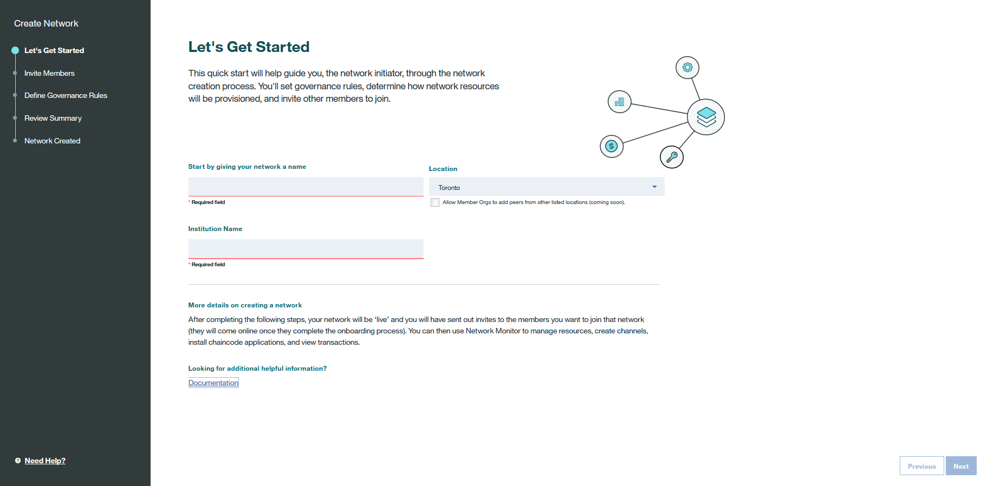

---

copyright:
  years: 2017, 2018
lastupdated: "2018-08-31"

---

{:new_window: target="_blank"}
{:shortdesc: .shortdesc}
{:screen: .screen}
{:codeblock: .codeblock}
{:pre: .pre}
{:tip: .tip}

# 엔터프라이즈 플랜 네트워크 통제
{: #getting-started-with-blockchain}

***[이 페이지가 도움이 되었습니까? 알려주십시오.](https://www.surveygizmo.com/s3/4501493/IBM-Blockchain-Documentation)***

{{site.data.keyword.blockchainfull}} Platform은 높은 보안, 무결성, 확장성 및 성능을 가진 블록체인 네트워크를 제공합니다. 정상 작동되는 네트워크를 신속하게 프로비저닝하고 GUI 대시보드인 네트워크 모니터를 사용하면 처음부터 네트워크를 설계하고 구성하지 않고도 즉시 [체인코드](glossary.html#chaincode) 및 애플리케이션을 실행할 수 있습니다.
{:shortdesc}

**참고**: {{site.data.keyword.blockchainfull_notm}} Platform 엔터프라이즈 플랜은 프로덕션 환경을 제공합니다. 개발 및 테스트 환경이 필요한 경우 [스타터 플랜 정보](starter_plan.html)를 참조하십시오.

이 튜토리얼에서는 IBM의 고가용성 및 보안 환경에서 호스팅되는 엔터프라이즈 플랜 네트워크를 확보하기 위해 따라야 하는 전제조건 및 단계를 소개합니다.  

다음 단계에서는 다중 네트워크 [구성원](glossary.html#member)이 포함된 엔터프라이즈 플랜 네트워크를 실행하는 기본 플로우를 표시합니다.
1. **네트워크 개시자**는 네트워크 구성원의 한 가지 특수한 유형으로서 네트워크를 작성하고 통제 정책을 정의합니다. 그런 다음 이 네트워크에 네트워크 구성원으로 가입하도록 다른 [조직](glossary.html#organization)을 초대할 수 있습니다.  자세한 정보는 [네트워크 작성](#creating-a-network)을 참조하십시오.
2. 초대된 **네트워크 구성원**은 {{site.data.keyword.blockchain}} 네트워크에 가입하기 위한 지시사항을 제공하는 이메일 알림을 수신합니다. 이메일 알림의 지시사항 외에도 [네트워크 가입](#joining-a-network)의 단계를 따를 수도 있습니다.
3. 네트워크를 작성하거나 가입한 후 모든 **네트워크 구성원**은 네트워크 모니터에 들어가 네트워크 리소스를 구성하고 관리할 수 있습니다. 네트워크 구성원의 그룹으로 [채널](glossary.html#channel)을 설정하여 채널 구성원만 액세스할 수 있는 채널 특정 원장에서 개인용 트랜잭션을 실행할 수 있습니다. 네트워크 모니터에서 고유 피어를 채널에 가입시킨 다음 이 피어에서 체인코드를 설치하고 인스턴스화할 수도 있습니다. 자세한 정보는 [네트워크 리소스 및 환경 구성](#configuring-network-resources-and-environment)을 참조하십시오.
4. **애플리케이션 개발자**는 애플리케이션을 개발한 후 애플리케이션과 네트워크 간 상호작용을 가능하게 합니다. 자세한 정보는 [애플리케이션이 네트워크와 상호작용할 수 있도록 설정](#enabling-applications-to-interact-with-the-network)을 참조하십시오.
5. **네트워크 운영자**는 네트워크 모니터에서 자신의 채널에 대한 트랜잭션을 모니터합니다. 자세한 정보는 [네트워크 리소스 모니터링](#monitoring-network-resources)을 참조하십시오.

## 네트워크 작성
시작하기 전에 {{site.data.keyword.Bluemix_notm}}에서 [{{site.data.keyword.blockchain}} Platform 서비스 인스턴스 ](https://console.bluemix.net/catalog/services/blockchain)를 작성해야 합니다. {{site.data.keyword.Bluemix_notm}} ID로 로그인해야 합니다. ID가 없는 경우, **회원가입하기** 단추를 클릭하십시오.  나중에 쉽게 알아볼 수 있도록 사용자의 인스턴스에 대한 서비스 및 인증 정보 이름을 바꾸십시오. {{site.data.keyword.blockchain}} 네트워크를 배치할 수 있는 {{site.data.keyword.Bluemix_notm}} 지역, 조직 및 영역을 선택하십시오. 그런 다음 가격 플랜 테이블에서 **엔터프라이즈 멤버십 플랜**을 선택하고 **작성** 단추를 클릭하십시오.  

{{site.data.keyword.blockchain}} Platform 서비스 인스턴스를 [{{site.data.keyword.Bluemix_notm}} 서비스 대시보드 ](https://console.bluemix.net/dashboard/services "{{site.data.keyword.Bluemix_notm}} 서비스 대시보드")에서 찾을 수 있습니다.  

네트워크 개시자인 경우, **네트워크 작성** 단추를 클릭하여 {{site.data.keyword.blockchain}} 네트워크를 시작하십시오.  마법사를 따라서 사용자의 네트워크 및 리소스의 기본 구성을 완료하십시오.  
  

1. "시작하기" 화면에서 네트워크에 이름을 지정하고 {{site.data.keyword.Bluemix_notm}} 조직의 위치를 선택하고 기관의 이름을 추가하십시오. 사용자가 다른 네트워크 구성원을 초대하면 그 구성원들이 가입하기 위해 이 네트워크 이름을 찾게 됩니다. **다음**을 클릭하십시오.
2. (선택사항) "구성원 초대" 화면에서 네트워크에 초대할 구성원의 이메일 주소와 기관 이름을 입력하십시오. 사용자가 지정하는 기관 이름은 공식 호칭이 아닙니다. 단순히 기관을 쉽게 인식할 수 있도록 하기 위한 것이며 네트워크에 가입할 때 변경할 수 있습니다. 참고로 네트워크에는 사용자 자신을 포함하여 최대 15개의 구성원이 가능합니다. 이 단계는 선택사항이며 나중에 네트워크 모니터에서 구성원을 네트워크에 초대할 수 있습니다.  **다음**을 클릭하십시오.
	 사용자가 초대하는 구성원은 네트워크 작성을 위한 모든 단계를 완료한 후에 초대에 대한 이메일 알림을 수신하게 됩니다.
3. "통제 규칙 정의" 화면에서 멤버십, 채널 작성 및 체인코드에 대한 정책을 설정하십시오. 기본적으로 모든 네트워크 구성원은 다른 구성원을 네트워크에 가입하도록 초대해서 채널을 작성하고 체인코드를 인스턴스화할 수 있습니다. 현재 네트워크는 기본 통제 정책을 사용합니다.  **다음**을 클릭하십시오.
4. "검토 요약" 화면에서 네트워크 구성을 확인하십시오. 수정사항을 작성하려는 경우, 섹션 헤더 옆의 **편집**을 클릭하거나 **이전** 단추를 클릭하여 이전 화면으로 돌아가십시오. 네트워크 구성을 완료하면 **완료**를 클릭하십시오.  
5. "작성된 네트워크" 화면에서 사용자의 네트워크가 작성되었다는 알림을 받게 됩니다. 네트워크 리소스를 구성하려면 **[피어](glossary.html#peer) 추가**를 클릭하고 네트워크 모니터를 열려면 직접 **모니터 시작**을 클릭할 수 있습니다. 또한 나중에 네트워크 모니터에 피어를 추가할 수 있습니다.  피어에 대한 자세한 정보는 [피어 추가](v10_dashboard.html#peers)를 참조하십시오.

이제 다음 네트워크 리소스를 지원할 수 있는 {{site.data.keyword.blockchain}} 네트워크를 배치했습니다.  
* 구성원 특정 인증 기관(CA)
* 기본 통제 정책
* 최대 15개의 네트워크 구성원  
* 세 개의 순서 지정자 및 두 개의 중간 CA 노드
* 각 구성원에 최대 세 개의 작은 피어  
* 충돌 결함 허용 순서 지정 서비스
* 최대 150개의 채널
* 네트워크 모니터의 구성원당 최대 10개의 체인코드 인스턴스화

## 네트워크 가입
네트워크 작성과 비슷하게 {{site.data.keyword.Bluemix_notm}}에서 [{{site.data.keyword.blockchain}} Platform 서비스 인스턴스 ](https://console.bluemix.net/catalog/services/blockchain)를 작성해야 합니다. {{site.data.keyword.Bluemix_notm}} ID로 로그인해야 합니다. ID가 없는 경우, **회원가입하기** 단추를 클릭하십시오.  나중에 쉽게 알아볼 수 있도록 사용자의 인스턴스에 대한 서비스 및 인증 정보 이름을 바꾸십시오. {{site.data.keyword.blockchain}} 네트워크를 배치할 수 있는 {{site.data.keyword.Bluemix_notm}} 지역, 조직 및 영역을 선택하십시오. 그런 다음 가격 플랜 테이블에서 **엔터프라이즈 멤버십 플랜**을 선택하고 **작성** 단추를 클릭하십시오.

{{site.data.keyword.blockchain}} Platform 서비스 인스턴스를 [{{site.data.keyword.Bluemix_notm}} 서비스 대시보드 ](https://console.bluemix.net/dashboard/services "{{site.data.keyword.Bluemix_notm}} 서비스 대시보드")에서 찾을 수 있습니다.

초대된 네트워크 구성원인 경우 **초대 보류 중 ->** 단추를 클릭하고 드롭 다운 목록에서 가입할 네트워크를 선택하고 **네트워크 가입** 단추를 클릭하십시오. 마법사를 따라서 네트워크의 네트워크 기본 구성을 보고 고유 네트워크 리소스를 구성하십시오.  
  

1. "시작하기" 화면에서 조직의 이름을 입력하고 **다음**을 클릭하십시오.
2. "통제 규칙 검토" 화면에서 멤버십, 채널 작성 및 체인코드의 네트워크 통제 정책을 검토하십시오. **다음**을 클릭하십시오.
3. (선택사항) "피어 추가" 화면에서 추가할 피어의 수량을 선택하십시오. **다음**을 클릭하십시오. 네트워크의 각 구성원은 최대 3개의 피어를 추가할 수 있습니다. 이 단계는 선택사항이며 나중에 네트워크 모니터에서 피어를 추가할 수 있습니다. 피어에 대한 자세한 정보는 [피어 추가](v10_dashboard.html#peers)를 참조하십시오.
4. "네트워크 요약 검토" 화면에서 네트워크 구성을 확인하십시오. 수정하려는 경우 **이전** 단추를 클릭하여 이전 화면으로 돌아가십시오. 리소스 구성을 완료한 후 **완료**를 클릭하십시오. 네트워크에 가입했다는 알림을 받게 됩니다. 그런 다음 **모니터 시작**을 클릭하여 네트워크 모니터를 열 수 있습니다.

<!-- or click **Create a Channel** to initiate a channel creation request. You can create channels later in the Network Monitor. For more information, see [Channels](v10_dashboard.html#channels).  -->

## 네트워크 리소스 및 환경 구성

1. {{site.data.keyword.blockchain}} 네트워크 작성 또는 가입 후에 네트워크 모니터에 들어가십시오. 네트워크 모니터는 네트워크 상태 정보를 관리하고 추적할 수 있는 GUI 대시보드입니다. 자세한 정보는 [네트워크 모니터](v10_dashboard.html)를 참조하십시오.
2. 네트워크에 사용자 자신의 피어를 추가하십시오. 피어를 이미 충분히 추가했으면 이 단계를 건너뛰십시오. 피어는 체인코드를 실행하며 사용자의 애플리케이션과 상호작용하기 위한 엔드포인트입니다. "개요" 화면에서 **피어 추가**를 클릭하고 피어의 수량 및 크기를 선택하십시오. 자세한 정보는 [개요](v10_dashboard.html#overview)를 참조하십시오.
3. 채널을 설정하십시오. 같은 채널의 모든 구성원에게 데이터 격리 및 기밀성을 전달하는 채널 특정 원장이 프로비저닝됩니다. 채널 작성 방법에 대한 자세한 정보는 [채널 작성](howto/create_channel.html#creating-a-channel)을 참조하십시오.  
    채널에 가입하도록 초대된 채널 구성원은 채널 가입에 사용할 수 있는 마법사에 대한 링크가 포함된 이메일 알림을 수신하게 됩니다.
4. 피어를 채널에 가입하십시오.  채널과 연관된 피어만 해당 원장에 액세스할 수 있습니다. 자세한 정보는 [채널](v10_dashboard.html#channels)을 참조하십시오.
5. 체인 코드를 설치하고 인스턴스화하십시오. 모든 채널 구성원은 체인코드를 실행할 모든 피어에 이름과 버전이 같은 동일한 체인코드를 설치해야 합니다. 체인코드를 설치한 후, 이 체인코드를 사용하려면 먼저 채널에서 인스턴스화해야 합니다. 자세한 정보는 [체인코드 설치, 인스턴스화 및 업데이트](howto/install_instantiate_chaincode.html)를 참조하십시오.  

**참고**: 고가용성을 얻기 위해 각 기관은 둘 이상의 피어를 구매해야 하며 채널 내 각 참가 구성원은 둘 이상의 피어에 가입해야 합니다.

## 네트워크 인증 정보 및 연결 프로파일 검색
{{site.data.keyword.cloud_notm}}에서 엔터프라이즈 플랜 네트워크를 작성한 후 서비스 인스턴스 페이지 또는 네트워크 모니터에서 네트워크 인증 정보 및 연결 프로파일을 검색할 수 있습니다.

### 서비스 인스턴스 페이지에서 검색
서비스 인스턴스를 작성하면 바로 서비스 인스턴스 페이지가 나타납니다. 또한 [{{site.data.keyword.cloud_notm}} 서비스 대시보드 ](https://console.bluemix.net/dashboard/services "{{site.data.keyword.cloud_notm}} 서비스 대시보드")에서 서비스를 클릭하여 서비스 인스턴스 페이지를 열 수 있습니다.

다음 단계에 따라 서비스 인증 정보를 검색하십시오.
1. 서비스 인스턴스 페이지의 왼쪽 네비게이터에서 **서비스 인증 정보**를 클릭하여 "서비스 인증 정보" 화면을 표시하십시오.
2. "서비스 인증 정보" 화면에서 **새 인증 정보**를 클릭하십시오.
3. "새 인증 정보 추가" 화면에서 인증 정보에 이름을 지정하고 "인라인 구성 매개변수 추가" 필드에 **{"type": "service_instance_token"}**을 입력하십시오. **추가**를 클릭하면 테이블에 새 인증 정보가 추가됩니다. "조치" 열 아래의 **인증 정보 보기**를 클릭하여 인증 정보 세부사항을 볼 수 있습니다. 이 인증 정보에는 API에 권한을 부여하는 데 사용할 수 있는 API 키 및 시크릿이 포함됩니다.

### 네트워크 모니터에서 검색
네트워크 모니터의 "API" 화면에서 네트워크 인증 정보를 찾을 수 있습니다. API 사용에 대한 자세한 정보는 [Swagger에서 API 시험 사용](howto/swagger_apis.html)을 참조하십시오.

네트워크 모니터의 "개요" 화면에서 연결 프로파일을 검색할 수 있습니다. "개요" 화면의 **연결 프로파일** 단추를 클릭하면 연결 프로파일이 새 페이지에 표시됩니다.

## 사용자 정의 비즈니스 네트워크 개발 및 전개
{{site.data.keyword.blockchainfull_notm}} Platform: Develop 개발자 환경 및 Hyperledger Composer 개발자 도구 세트를 사용하여 비즈니스 요구를 기반으로 한 비즈니스 네트워크를 개발할 수 있습니다. 비즈니스에 맞는 네트워크를 개발한 후 비즈니스 네트워크를 엔터프라이즈 플랜 네트워크에 배치할 수 있습니다.

자세한 정보는 [네트워크 개발](develop.html) 및 [엔터프라이즈 플랜에 비즈니스 네트워크 배치](develop_enterprise.html)를 참조하십시오.

## 애플리케이션이 네트워크와 상호작용할 수 있도록 설정
애플리케이션은 SDK API를 활용하여 {{site.data.keyword.blockchain}} 네트워크 리소스와 상호작용합니다. 애플리케이션이 트랜잭션 요청으로 피어를 결국 대상으로 지정할 수 있도록 애플리케이션에서 네트워크 리소스의 API 엔드포인트 정보를 추가해야 합니다. 그런 다음 네트워크 모니터에서 API 엔드포인트 정보를 추가할 수 있습니다. 애플리케이션은 로컬 파일 시스템 또는 {{site.data.keyword.Bluemix_notm}}에 호스팅될 수 있습니다. 자세한 정보는 [애플리케이션 개발](v10_application.html)을 참조하십시오.

## 네트워크 리소스 모니터링  
트랜잭션이 애플리케이션에서 트리거되면 네트워크 모니터에서 트랜잭션 상태 정보를 볼 수 있습니다. 네트워크 모니터링에 대한 자세한 정보는 [네트워크 모니터링](howto/monitor_network.html)을 참조하십시오.

## 네트워크 나가기
네트워크에서 나가려면 {{site.data.keyword.Bluemix_notm}} 대시보드에서 블록체인 서비스 인스턴스를 삭제하십시오.  

**참고**: 네트워크를 나가기 전에 네트워크 내의 채널의 구성원이 아닌지 확인하십시오. 구성원이면 네트워크를 나갈 때 오류가 발생합니다. 채널 업데이트 프로세스를 완료하려면 채널 구성원을 제거해야 합니다. 채널 업데이트 프로세스에 대한 자세한 정보는 [채널 업데이트](howto/create_channel.html#updating-a-channel)를 참조하십시오.

<!--
## References
* For more information about {{site.data.keyword.blockchainfull_notm}} offerings, see [Blockchain offerings](index.html).
* For more information about Hyperledger Fabric, see [Hyperledger Fabric documentation ](http://hyperledger-fabric.readthedocs.io/en/release-1.1/){:new_window}.
-->
