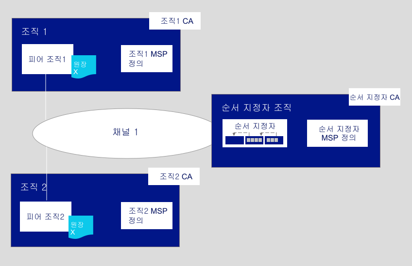

---

copyright:
  years: 2019
lastupdated: "2019-05-16"

keywords: getting started tutorials, create a CA, enroll, register, create an MSP, wallet, create a peer, create ordering service, Raft

subcollection: blockchain

---

{:new_window: target="_blank"}
{:shortdesc: .shortdesc}
{:screen: .screen}
{:codeblock: .codeblock}
{:note: .note}
{:important: .important}
{:tip: .tip}
{:pre: .pre}

# 네트워크 튜토리얼 빌드
{: #ibp-console-build-network}

{{site.data.keyword.blockchainfull}} Platform은
블록체인 애플리케이션 및 네트워크를 개발, 배치 및 운영할 수 있게 해주는 블록체인 서비스 제공
오퍼링입니다. [블록체인 컴포넌트 개요](/docs/services/blockchain/blockchain_component_overview.html#blockchain-component-overview)를
방문하여 블록체인 컴포넌트 및 함께 작동하는 방법에 대해 배울 수 있습니다. 이 튜토리얼은 [샘플 네트워크 튜토리얼 시리즈](/docs/services/blockchain/howto/ibp-console-build-network.html#ibp-console-build-network-sample-tutorial)의 첫 번째 파트이며, {{site.data.keyword.blockchainfull_notm}} Platform 콘솔을 사용하여 완전한 기능의 네트워크를 단일 {{site.data.keyword.cloud_notm}} Kubernetes Service에서 빌드하는 방법에 대해 설명합니다.
{:shortdesc}

{{site.data.keyword.blockchainfull_notm}} Platform 베타 평가판을 사용 중인 경우 콘솔의 일부 패널이 GA(Generally Available) 서비스 인스턴스에 따라 최신 상태로 유지되는 현재 문서와 일치하지 않을 수 있습니다. 모든 최신 기능의 이점을 얻으려면 지금 [{{site.data.keyword.blockchainfull_notm}} Platform on {{site.data.keyword.cloud_notm}} 시작하기](/docs/services/blockchain/howto/ibp-v2-deploy-iks.html#ibp-v2-deploy-iks)의 지시사항에 따라 새 GA 서비스 인스턴스를 프로비저닝하는 것이 좋습니다.
{: important}

**대상 독자:** 이 주제는 블록체인 네트워크를 작성, 모니터링 및 관리할 책임이 있는 네트워크 운영자를 위해 설계되었습니다.

아직 {{site.data.keyword.blockchainfull_notm}} Platform 콘솔을 사용하여 {{site.data.keyword.cloud_notm}} Kubernetes Service를 통해 Kubernetes 클러스터에 콘솔을 배치하지 않은 경우 [{{site.data.keyword.blockchainfull_notm}} Platform on {{site.data.keyword.cloud_notm}} 시작하기](/docs/services/blockchain/howto/ibp-v2-deploy-iks.html#ibp-v2-deploy-iks)를 참조하십시오. 콘솔 자체는 클러스터에 상주하지 않습니다. 콘솔은 컴포넌트를 클러스터에 배치하는 데 사용할 수 있는 도구입니다. 


컴포넌트를 유료 또는 무료 Kubernetes 클러스터에 배치하는지에 관계없이 Kubernetes 대시보드를 사용하여 노드를 배치하고 채널을 작성할 때 원하는 대로 사용 가능한 리소스에 세심한 주의를 기울이십시오. Kubernetes 클러스터를 관리하고 필요에 따라 추가 리소스를 배치하는 것은 사용자의 책임입니다. 컴포넌트가 무료 클러스터에 성공적으로 배치되었으나 사용자가 더 많은 컴포넌트를 추가하면 컴포넌트 실행이 느려질 수 있습니다. 컴포넌트 크기 조정 및 콘솔이 Kubernetes 클러스터와 상호작용하는 방법에 대한 자세한 정보는 [리소스 할당](/docs/services/blockchain/howto/ibp-console-govern.html#ibp-console-govern-iks-console-interaction)을 참조하십시오.
{: note}

## 샘플 네트워크 튜토리얼 시리즈
{: #ibp-console-build-network-sample-tutorial}

세 개의 파트로 구성된 이 튜토리얼 시리즈는 {{site.data.keyword.blockchainfull_notm}} Platform 2.0에서 비교적 단순한 다중 노드 Hyperledger Fabric 네트워크를 작성한 후 상호 연결하여 네트워크를 Kubernetes 클러스터에 배치하고 스마트 계약을 설치하고 인스턴스화하는 프로세스를 안내합니다. 이 튜토리얼에서는 이 프로세스가 유료 Kubernetes 클러스터에 대해 작동하는 방법을 보여주지만 무료 클러스터에도 동일한 기본 플로우가 적용됩니다. 단, 몇 가지 제한사항이 있습니다(예를 들어, 무료 클러스터에서는 노드의 크기를 지정하거나 조정할 수 없음).

* **네트워크 빌드 튜토리얼**: 이 튜토리얼은 두 개의 조직(하나는 피어용, 다른 하나는 순서 지정 서비스용) 및 채널을 작성하여 네트워크를 호스팅하는 프로세스를 안내합니다. 순서 지정 서비스를 작성하고 조직을 추가하여 블록체인 컨소시엄을 구성하려는 경우 이 튜토리얼을 사용하십시오.
* [네트워크 가입 튜토리얼**은 피어를 작성하고 해당 피어를 채널에 가입시켜 기존 네트워크에 가입하는 프로세스를 안내합니다. 순서 지정 서비스를 작성하여 호스팅하지 않으려는 경우 또는 다른 네트워크에 가입하는 프로세스를 학습하려는 경우 이 튜토리얼을 사용하십시오.
* [네트워크에 스마트 계약 배치](/docs/services/blockchain/howto/ibp-console-smart-contracts.html#ibp-console-smart-contracts)(/docs/services/blockchain/howto/ibp-console-join-network.html#ibp-console-join-network)]는 스마트 계약을 작성하여 네트워크에 배치하는 방법을 보여줍니다.


### 이 네트워크의 구조
{: #ibp-console-build-network-structure}

**네트워크 빌드** 및 **네트워크 가입** 튜토리얼의 단계를 모두 완료하면 네트워크가 아래 그림 중 하나와 유사하게 표시됩니다.

*그림 1. 샘플 기본 네트워크 구조*
  

이 구성은 애플리케이션 및 스마트 계약을 테스트하는 용도와 컴포넌트를 빌드하고 사용자 고유의 유스 케이스에 적합한 프로덕션 네트워크에 가입하기 위한 안내서로 사용하기에 충분합니다. 네트워크는 다음 컴포넌트를 포함합니다.

* **두 개의 피어 조직**: `조직1` 및 `조직2`(`Org1` 및 `Org2`)  
  튜토리얼 시리즈는 두 개의 피어 조직 및 두 개의 연관된 피어를 작성하는 방법에 대해 설명합니다. 블록체인
네트워크의 조직이 서로 거래해야 하는 두 개의 서로 다른 은행과 같다고
생각해 보십시오. `Org1` 및 `Org2`의 정의를 작성합니다.
* **하나의 순서 지정 서비스 조직**: `Ordering Service`  
  분산 원장을 빌드 중이므로 피어 및 순서 지정 서비스가 별도 조직의 일부여야 합니다. 따라서 순서 지정 서비스에 대한 별도의 조직이 작성됩니다. 무엇보다도 순서 지정 서비스 노드는 원장에 기록되어 블록체인이 되기 위해 피어로 전송될 트랜잭션 블록의 순서를 지정합니다. `Ordering Service` 조직의 정의를 작성합니다.
* **세 개의 인증 기관(CA)**: `Org1 CA, Org2 CA, Ordering Service CA`   
   CA는 조직과 연관된 노드 및 사용자 모두에 인증서를 발행하는 노드입니다. 조직당 하나의 CA를 배치하는 것이 우수 사례이므로 총 세 개의 CA(각 피어 조직당 하나, 순서 지정 서비스 조직당 하나)를 배치할 것입니다. 또한 이러한 CA는 MSP(Membership Service Provider)에서 캡슐화되는 각 조직의 정의를 작성합니다. TLS CA는 조직 CA와 함께 배치됩니다. 이 CA는 노드 간의 통신에 사용되는 인증서를 제공합니다. TLS CA에 대한 별도의 관리자를 설정하는 것이 가장 좋지만 이 튜토리얼을 위해서는 해당 프로세스를 보여주지 않습니다. 자세한 정보는 [TLS CA 사용](/docs/services/blockchain/howto/ibp-console-identities.html#ibp-console-identities-tlsca)을 참조하십시오.
* **하나의 순서 지정 서비스:** `Ordering Service`  
  유료 클러스터에서 실행 중인 배치에는 하나의 노드로 된 순서 지정 서비스 또는 5개의 노드로 된 충돌 결함 허용(CFT) 순서 지정 서비스를 배치하는 옵션이 있지만 무료 클러스터에는 단일 노드를 실행하는 옵션만 있습니다. 5개 노드로 된 순서 지정 서비스는 Raft 프로토콜(Raft에 대한 자세한 정보는 [순서 지정 서비스 ](https://hyperledger-fabric.readthedocs.io/en/release-1.4/orderer/ordering_service.html#raft) 참조)의 구현을 사용하며 이 튜토리얼에 포함된 배치 옵션입니다. 해당 조직과 연관된 순서 지정 노드 수에 관계없이 현재 순서 지정 서비스당 하나의 순서 지정 조직만 지원됩니다. 이 순서 지정 서비스는 피어 조직을 해당 "컨소시엄"에 추가합니다. 컨소시엄은 채널을 작성하고 가입할 수 있는 피어 조직의 목록입니다. 조직이 여러 클러스터에 배치된 채널을 작성하려면(대부분의 프로덕션 네트워크가 구성되는 방법) 순서 지정 서비스 관리자가 다른 콘솔에 배치된 피어 조직을 해당 콘솔로 가져와야 합니다. 그러면 피어 조직이 해당 순서 지정 서비스에서 호스팅되는 채널에 가입할 수 있습니다.
* **두 개의 피어:** `피어 조직1` 및 `피어 조직2`(`Peer Org1` 및 `Peer Org2`)  
  위 그림에서 `원장 x` 원장은 분산 피어에서 유지보수됩니다. 이러한 피어는 피어와 연관된 별도의 컨테이너에서 [Couch DB ](https://hyperledger-fabric.readthedocs.io/en/release-1.4/couchdb_as_state_database.html)를 상태 데이터베이스로 사용하여 배치됩니다. 이 데이터베이스는 모든 "상태"(키-값 쌍으로 표시됨)의 현재 값을 보유합니다. 예를 들어, `Org1`(값)은 은행 자산(키)의 현재 소유자입니다. 트랜잭션 목록인 블록체인은 피어에 로컬로 저장됩니다.
* **하나의 채널**: `채널1`(`channel1`)  
채널을 사용하면 조직 세트가 채널의 구성원이 아닌 조직에 데이터를 노출하지 않고 트랜잭션을 수행할 수 있습니다. 각 채널에는 해당 채널에 가입한 피어에서 종합적으로 관리되는 자체 원장이 있습니다. 이 튜토리얼에서는 두 조직 모두가 가입하는 하나의 채널을 작성하고 조직이 트랜잭션에 사용할 수 있는 채널에서 스마트 계약을 인스턴스화하는 방법을 보여줍니다.

이 구성은 필수가 아닙니다. {{site.data.keyword.blockchainfull_notm}} Platform은 고도로 사용자 정의할 수 있습니다. Kubernetes 클러스터에서 사용 가능한 리소스가 있는 경우 콘솔을 사용하여 무한 구성 배열로 컴포넌트를 배치할 수 있습니다. 이 튜토리얼에서는
자체 네트워크를 빌드하는 데 필요한 단계를 제공하며 {{site.data.keyword.blockchainfull_notm}} Platform 및 콘솔에
대한 세부사항을 제공하는 주제에 대한 참조를 제공합니다.

이 **네트워크 빌드** 튜토리얼에서는 위의 네트워크, 즉, 순서 지정 서비스, 단일 피어 조직 및 단일 채널의 피어를 호스팅하는 데 사용될 수 있는 단순 네트워크의 일부만 빌드합니다. 다음은 빌드할 위 네트워크의 일부를 표시합니다. </br>
  
*그림 2. 단순 네트워크 구조*  

이 구성은 스마트 계약을 신속하게 시작하고 테스트하는 데 유용하지만 사용자가 실제로 분산된 네트워크를 작성하여 거래할 기타 조직을 추가할 때까지는 그다지 의미가 없습니다. 따라서 후속
[네트워크 가입](/docs/services/blockchain/howto/ibp-console-join-network.html#ibp-console-join-network) 튜토리얼에서
추가 피어 조직 및 피어를 작성하고 새 조직을 채널에 추가하는 방법에 대해 설명합니다.

이 튜토리얼 전체에 걸쳐 콘솔 내의 필드에 대해 **권장되는 값**을 제공합니다. 이로 인해
탭 및 드롭 다운 목록에서 이름 및 ID를 쉽게 인식할 수 있습니다. 특히 이전 단계에서 입력한 등록된 사용자의 ID 및 시크릿과 같은 특정 값을 기억해야 하므로 이러한 값은 필수가 아니지만 도움이 될 것입니다. 이러한 값은 콘솔에 저장되지 않기 때문에 잊어버린 경우 추가 사용자를 등록하고 프로세스를 다시 시작해야 합니다. 각 태스크 후에 권장되는 값의 표를 제공하며 권장되는 값을 사용하지 않는 경우 튜토리얼을 진행하면서 값을 기록하도록 권장합니다.
{:tip}

## 1단계: 조직 및 블록체인의 시작점 작성
{: #ibp-console-build-network-create-peer-org1}

콘솔을 사용하여 작성할 각 조직에 대해 하나 이상의 CA를 배치해야 합니다. CA는 모든 네트워크 참가자(피어, 순서 지정 서비스, 클라이언트, 관리자 등)에게 인증서를 발행하는 노드입니다. 서명 인증서 및 개인 키를 포함하는 이러한 인증서는 네트워크 참가자가 통신하고 인증하며 궁극적으로 트랜잭션을 수행할 수 있도록 허용합니다. 이러한
CA는 조직 자체를 정의하는 것 외에도 조직에 속한 모든 ID 및 인증서를 작성합니다. 그러면 이러한 ID를 사용하여 노드를 배치하고 관리자 ID를 작성하며 트랜잭션을 제출할 수 있습니다. 작성해야 하는 CA 및 ID에 대한 자세한 정보는
[ID 관리](/docs/services/blockchain/howto/ibp-console-identities.html#ibp-console-identities)를 참조하십시오.

이 튜토리얼에서는 두 개의 조직을 작성합니다. 하나는 피어를 소유하고 다른 하나는 순서 지정 서비스를 소유하게 됩니다. 각 조직이 인증서를 발행하려면 CA가 필요하므로 **두 개의 CA**를 작성해야 합니다. 이 튜토리얼의 목적을 위해 **한 번에 하나의 CA만 작성할 것입니다**.

피어의 조직 및 피어를 작성하는 프로세스에 대해 알아보려면 다음 [동영상 ](http://ibm.biz/BlockchainPlatformSeries2 "{{site.data.keyword.blockchainfull_notm}} Platform에 피어 배치")을 시청하십시오.


### 피어 조직의 CA 작성
{: #ibp-console-build-network-create-CA-org1CA}

이 튜토리얼의 일부로, CA가 사용자 및 노드에 대한 인증서 및 개인 키를 발행합니다. 이러한 ID는 {{site.data.keyword.IBM_notm}}에서 관리되지 않으며 키는 콘솔에 저장되지 않습니다. 브라우저의 로컬 스토리지에만 저장됩니다. 따라서 사용자의 ID와 조직 MSP를 내보내야 합니다. 다른 시스템 또는 다른 브라우저에서 콘솔에 액세스하려고 시도하는 경우 이러한 ID 및 조직 정의를 가져와야 합니다.
{:important}

첫 번째 조직에 대한 인증서를 발행할 CA를 작성하려면 콘솔에서 다음 단계를 수행하십시오.

1. 왼쪽의 **노드** 탭으로 이동하여 **인증 기관 추가**를 클릭하십시오. 사이드 패널을 사용하여 작성할 CA를 사용자 정의할 수 있으며 이 CA가 키를 발행할 조직을 사용자 정의할 수 있습니다.
2. **인증 기관 작성** 아래의 **{{site.data.keyword.cloud_notm}}**를 클릭하고 **다음**을 클릭하십시오.
3. 두 번째 사이드 패널을 사용하여 CA의 **표시 이름**을 제공하십시오. 이 CA에 대한 권장 값은 `Org1 CA`입니다.
4. 다음 패널에서 **CA 관리자 등록 ID**를 `admin`으로 지정하고 시크릿을 `adminpw`로 지정하여 CA 관리자 인증 정보를 제공하십시오. 다시 말하지만 이는 **권장되는 값**입니다.
5. 유료 클러스터를 사용 중인 하는 경우 노드에 대한 리소스 할당을 구성할 수 있는 기회가 제공됩니다. 이 튜토리얼의 목적에 따라 모든 기본값을 허용하고 **다음**을 클릭하십시오. 리소스를 노드에 할당하는 방법을 알아보려면 [리소스 할당](/docs/services/blockchain?topic=blockchain-ibp-console-govern#ibp-console-govern-allocate-resources)에 대한 주제를 참조하십시오. 무료 클러스터를 사용 중인 경우 **요약** 페이지가 표시됩니다.
6. 요약 페이지를 검토한 다음 **인증 기관 추가**를 클릭하십시오.

**태스크: 피어 조직 CA 작성**

  | **필드** | **표시 이름** | **등록 ID** | **시크릿** |
  | ------------------------- |-----------|-----------|-----------|
  | **CA 작성** | Org1 CA  | admin | adminpw |

  *그림 3. 피어 조직 CA 작성*

CA를 배치한 후에 조직 MSP를 작성하고 사용자를 등록하고 네트워크, **peer**에
시작점을 작성할 때 이를 사용할 것입니다.

고급 사용자에게 자체 CA가 이미 제공되었을 수 있으며 콘솔에 새 CA를 작성하지 않으려고 할 수 있습니다. 기존 CA에서 `X.509` 형식으로 된 인증서를 발행할 수 있는 경우 여기서 새 CA를 작성하는 대신 자체 외부 CA를 사용할 수 있습니다. 자세한 정보는 [피어 또는 순서 지정자에 외부 CA의 인증서 사용](/docs/services/blockchain/howto/ibp-console-build-network.html#ibp-console-build-network-third-party-ca)에 대한 주제를 참조하십시오. 

### ID를 등록하기 위해 CA 사용
{: #ibp-console-build-network-use-CA-org1}

작성할 각 노드 또는 애플리케이션에는 블록체인 네트워크에 참여할 인증서 및 개인 키가 필요합니다. 또한 이러한 노드 및 애플리케이션에 대한 관리자 ID를 작성해야만 콘솔에서 관리할 수 있습니다. 작성한 각 CA에 대해 한 번씩, 총 두 번 이 프로세스를 수행할 것입니다. 각 CA에 두 개의 ID를 ID를 작성할 것입니다.

* **조직 관리자**: 이 ID를 사용하면 플랫폼 콘솔을 사용하여 노드를 작동할 수 있습니다.
* **피어 ID**: 피어 자체의 ID입니다. 피어가 조치(예: 트랜잭션 보증)를 수행할 때마다 해당 인증서를 사용하여 서명합니다.

클러스터 유형에 따라 CA 배치에 최대 10분이 소요될 수 있습니다. CA가 처음 배치되거나 CA가 사용 불가능한 경우 CA에 대한 타일의 상자는 회색 상자가 됩니다. CA가 성공적으로 배치되고 실행 중이면 이 상자가 녹색이 되며, 이는 CA가 "실행 중"이며 ID를 등록하는 데 사용될 수 있음을 나타냅니다. ID를 등록하기 위해 아래의 단계로 진행하기 전에 CA 상태가 "실행 중"이 될 때까지 기다려야 합니다.
{:important}

타일의 녹색 상자로 표시된 대로 CA가 실행 중이면 다음 단계를 완료하여 이러한 인증서를 생성하십시오.

1. `Org1 CA`를 클릭하고 CA에 대해 작성한 `admin` ID가 테이블에 표시되는지 확인하십시오. 그런 다음 **사용자 등록** 단추를 클릭하십시오.
2. 먼저 조직 관리자를 등록합니다. 이는 **등록 ID**를 `org1admin`으로 지정하고 **시크릿**을 `org1adminpw`로 지정하여 수행할 수 있습니다. 그런 다음 이 ID에 대한 `유형`을 `client`로 설정하십시오(관리자 ID는 항상 `client`로 등록되어야 하는 반면 노드 ID는 항상 `peer` 유형을 사용하여 등록되어야 함). **최대 등록 수** 필드는 무시할 수 있습니다. 등록에 대해 자세히 알아보려면 [ID 등록](/docs/services/blockchain/howto/ibp-console-identities.html#ibp-console-identities-register)을 참조하십시오. **다음**을 클릭하십시오.
3. 이 튜토리얼을 위해서는 **속성 추가**를 사용할 필요가 없습니다. ID 속성에 대해 자세히 알아보려면 [ID 등록](/docs/services/blockchain/howto/ibp-console-identities.html#ibp-console-identities-register)을 참조하십시오.
4. 조직 관리자가 등록된 후 피어의 ID에 대해 이 동일한 프로세스를 반복하십시오(`Org1 CA` 사용). 피어 ID의 경우 등록 ID `peer1` 및 시크릿 `peer1pw`를 제공하십시오. 이는 노드 ID이므로 `peer`를 **유형**으로 선택하십시오. **최대 등록 수** 필드를 무시할 수 있으며 다음 패널에서 이전과 같이 **속성**을 지정하지 마십시오.

CA를 사용하여 이러한 ID를 등록(register)하는 것은 ID **작성**의 첫 번째 단계일 뿐입니다. **등록(enroll)**될 때까지 이러한 ID를 사용할 수 없습니다. `org1admin` ID의 경우 이는 다음 단계에 표시될 MSP 작성 중에 발생합니다. 피어의 경우 피어 작성 중에 발생합니다.
{:note}

**태스크: 사용자 등록**

  |  **필드** | **설명** | **등록 ID** | **시크릿** |
  | ------------------------- |-----------|-----------|-----------|-----------|
  | **사용자 등록** |  Org1 admin | org1admin | org1adminpw |
  | | 피어 ID |  peer1 | peer1pw |

  *그림 4. CA를 사용하여 사용자 등록*

### 피어 조직 MSP 정의 작성
{: #ibp-console-build-network-create-peers-org1}

이제 피어의 CA를 작성하고 이를 사용하여 `Org1` 관리자 및 `Org1`과 연관시킬 피어에 대한 ID를 **등록**했으므로 MSP로 알려진 공식적인 피어 조직 정의를 작성해야 합니다. 많은 피어가 하나의 조직에 속할 수 있습니다. **피어를 작성할 때마다 새 조직을 작성할 필요가 없습니다**. 튜토리얼을 수행함에 있어서 이번이 처음이므로
이 조직의 MSP ID를 작성할 것입니다. MSP를 작성하는 과정에서 `org1admin` ID에 대한 인증서를 생성하여 지갑에 추가합니다.

1. 왼쪽 탐색의 **조직** 탭으로 이동하여 **MSP 정의 작성**을 클릭하십시오.
2. MSP에 표시 이름 `Org1 MSP` 및 MSP ID `org1msp`를 제공하십시오. 이 필드에
사용자 고유의 MSP ID를 지정하려면 도구 팁에서 이 이름에 대한 제한사항 스펙을 확인하십시오.
3. **루트 인증 기관 세부사항** 아래에 이전 단계에서 ID를 등록하는 데 사용한 CA를 지정하십시오. 이 튜토리얼을 처음 사용하는 경우에는 `Org1 CA`만 표시되어야 합니다.
4. 아래의 **등록 ID** 및 **등록 시크릿** 필드가 사용자가 CA를 사용하여 작성한 첫 번째 사용자의 등록 ID 및 시크릿(`admin` 및 `adminpw`)으로 자동으로 채워집니다. 그러나 이 ID를 사용하면 사용자의 조직이 CA ID와 동일한 ID가 될 수 있으며, 이는 보안을 이유로 권장되지 않습니다. 대신 드롭 다운 목록에서 조직 관리자에 대해 작성한 등록 ID `org1admin`을 선택하고 이와 연관된 시크릿 `org1adminpw`를 입력하십시오. 그런 다음,
이 ID에 대해 표시 이름인 `Org1 Admin`를 제공하십시오.
5. **생성** 단추를 클릭하여 이 ID를 조직의 관리자로 등록하고 지갑으로 내보내십시오. 이는 피어 및 채널을 작성할 때 사용됩니다.
6. **내보내기**를 클릭하여 관리자 인증서를 파일 시스템으로 내보내십시오. 위에서 설명한 대로 이 ID는 콘솔에 저장되거나 {{site.data.keyword.IBM_notm}}에서 관리되지 않습니다. 로컬 브라우저 스토리지에만 저장됩니다. 브라우저를 변경하는 경우에는 이 ID를 지갑으로 가져와야 피어를 관리할 수 있습니다.
7. **MSP 정의 작성**을 클릭하십시오.

**태스크: 피어 조직 MSP 작성**

  |  | **표시 이름** | **MSP ID** | **등록 ID**  | **시크릿** |
  | ------------------------- |-----------|-----------|-----------|-----------|
  | **조직 작성** | Org1 MSP | org1msp |||
  | **루트 CA** | Org1 CA ||||
  | **조직 관리자 인증서** | |  | org1admin | org1adminpw |
  | **ID** | Org1 Admin |||||

  *그림 5. 피어 조직 MSP 정의 작성*

MSP를 작성한 후 왼쪽 탐색에서 **지갑**을 클릭하여 액세스할 수 있는 **지갑**에서 피어 조직 관리자를 볼 수 있어야 합니다.

**태스크: 지갑 확인**

  | **필드** | **표시 이름** | **설명** |
  | ------------------------- |-----------|----------|
  | **ID** | Org1 Admin | Org1 관리자 ID |

  *그림 6. 지갑 확인*

MSP에 대한 자세한 정보는 [조직 관리](/docs/services/blockchain/howto/ibp-console-organizations.html#ibp-console-organizations)를 참조하십시오.

사용자가 인증서 관리 및 보안의 책임을 지므로 조직 관리자 ID를 내보내는 것이 중요합니다.
{:important}

### 피어 작성
{: #ibp-console-build-network-peer-create}

[CA를 작성](/docs/services/blockchain/howto/ibp-console-build-network.html#ibp-console-build-network-create-CA-org1CA)하고
이를 사용하여 ID를 등록하고
[피어 조직 MSP](/docs/services/blockchain/howto/ibp-console-build-network.html#ibp-console-build-network-create-peers-org1)를
작성했으면 피어를 작성할 준비가 된 것입니다.

#### 피어의 역할
{: #ibp-console-build-network-peer-role}

조직 자체가 원장을 유지보수하지 않는다는 사실을 기억하는 것이 중요합니다. 피어가 수행합니다. 또한 조직은
피어를 사용하여 트랜잭션 제안에 서명하고 채널 구성 업데이트를 승인합니다. 채널에
두 개 이상의 피어가 있으면 고가용성이 구현되며 두 개 이상의 피어가 한 채널에
가입하는 것이 프로덕션 레벨의 구현에 대한 우수 사례로 간주됩니다. 이 튜토리얼에서는 단일 피어 작성 프로세스만 표시합니다.

리소스 할당 관점에서는 동일한 피어를 여러 채널에 가입시킬 수 있습니다. 피어 디자인은
한 채널의 데이터가 피어를 통해 다른 채널로 전달되지 않도록 합니다. 그러나 피어가
각 채널에 대해 별도의 원장을 저장하므로 피어가 트랜잭션 및 데이터 로드를 처리하기에 충분한 처리 능력과 스토리지를 보유해야 합니다.

#### 피어 배치
{: #ibp-console-build-network-deploy-peer-role}

콘솔을 사용하여 다음 단계를 수행하십시오.

1. **노드** 페이지에서 **피어 추가**를 클릭하십시오.
2. **새 피어 작성** 아래의 {{site.data.keyword.cloud_notm}}를 클릭하고 **다음**을 클릭하십시오.
3. 피어에 **표시 이름**인 `Peer Org1`를 제공하십시오.
4. 다음 화면에서 `Org1 CA`를 선택하십시오. 이는 피어 ID를 등록하는 데 사용한 CA입니다. 드롭 다운 목록에서 피어에 대해 작성한 피어 ID의 **등록 ID**로 `peer1`을 선택하고 이와 연관된 **시크릿**으로 `peer1pw`를 입력하십시오. 그런 다음, 드롭 다운 목록에서 `Org1 MSP`를 선택하고 **다음**을 클릭하십시오.
5. 다음 사이드 패널에서는 TLS CA 정보를 요청합니다. CA를 작성할 때 TLSCA가 함께 작성되었습니다. 이 CA는 노드에 대한 보안 통신 계층의 인증서를 작성하는 데 사용됩니다. 따라서 드롭 다운 목록에서 피어에 대해 작성한 피어 ID인 `peer1`을 **등록 ID**로 선택하고 연관된 **시크릿**으로 `peer1pw`를 입력하십시오. **TLS CSR 호스트 이름**은 피어 엔드포인트를 처리하는 데 사용될 수 있는 사용자 정의 도메인 이름을 지정하려는 고급 사용자가 사용할 수 있는 옵션입니다. 사용자 정의 도메인 이름은 이 튜토리얼의 일부가 아니므로 지금은 **TLS CSR 호스트 이름**을 공백으로 두십시오.
6. 다음 사이드 패널에서 피어의 관리자가 될 수 있도록 **ID 연관**을 요청합니다. 이 튜토리얼의 목적에 따라 조직 관리자 `Org1 Admin`을 피어의 관리자로도 설정하십시오. `Org1 CA`와 다른 ID를 등록하고 해당 ID를 피어의 관리자로 설정할 수 있지만 이 튜토리얼에서는 `Org1 Admin` ID를 사용합니다.
7. 유료 클러스터를 사용 중인 하는 경우 다음 패널에서 노드에 대한 리소스 할당을 구성할 수 있는 기회가 제공됩니다. 이 튜토리얼의 목적에 따라 모든 기본값을 허용하고 **다음**을 클릭하십시오. 리소스를 노드에 할당하는 방법을 알아보려면 [리소스 할당](/docs/services/blockchain?topic=blockchain-ibp-console-govern#ibp-console-govern-allocate-resources)에 대한 주제를 참조하십시오. 무료 클러스터를 사용 중인 경우 **요약** 페이지가 표시되어 있습니다.
8. 요약 내용을 검토하고 **피어 추가**를 클릭하십시오.

**태스크: 피어 배치**

  |  | **표시 이름** | **MSP ID** | **등록 ID** | **시크릿** |
  | ------------------------- |-----------|-----------|-----------|-----------|
  | **피어 작성** | Peer Org1 | org1msp |||
  | **CA** | Org1 CA ||||
  | **피어 ID** | |  | peer1 | peer1pw |
  | **관리자 인증서** | org1msp ||||
  | **TLS CA** | Org1 CA ||||
  | **TLS CA ID** | || admin | adminpw |
  | **ID 연관** | Org1 Admin |||||

  *그림 7. 피어 배치*

프로덕션 시나리오에서는 각 채널에 세 개의 피어를 배치하는 것이 좋습니다. 이는 하나의 피어가 작동 중지되도록 허용하고(예: 유지보수 주기 동안) 고가용성 피어를 계속 유지하기 위한 것입니다. 조직에 대한 둘 이상의 피어를 배치하려면 첫 번째 피어 ID를 등록하는 데 사용한 것과 동일한 CA를 사용하십시오. 이 튜토리얼에서는 `Org1 CA`입니다. 그런 다음 별개의 등록 ID 및 시크릿을 사용하여 새 피어 ID를 등록하십시오(예: `org1secondpeer` 및 `org1secondpeerpw`). 그런 다음, 피어를 작성할 때 이 등록 ID 및 시크릿을 제공하십시오. 이 피어는 Org1과 여전히 연관되어 있으므로 드롭 다운 목록에서 `Org1 CA`, `Org1 MSP` 및 `Org1 Admin`을 선택하십시오. 이 새 피어에 `Org1 CA`로 등록할 수 있는 다른 관리자를 지정하도록 선택할 수 있지만 이는 선택사항입니다. 이 튜토리얼 시리즈에서는 각 피어 조직에 대한 단일 피어를 작성하는 프로세스만 표시합니다.
{:tip}

## 2단계: 트랜잭션의 순서를 지정하는 노드 작성
{: #ibp-console-build-network-create-orderer}

이더리움이나 비트코인 등의 기타 분산 블록체인과 달리 트랜잭션 순서를 지정하고 피어로 전송하는 중앙 권한이 없습니다. Hyperledger Fabric은 {{site.data.keyword.blockchainfull_notm}} Platform의 기반이 되는 블록체인으로서, 다르게 작동합니다. 노드 또는 **순서 지정 서비스**라고 하는 노드 클러스터를 갖추고 있습니다.

순서 지정 서비스는 몇 가지 필수 기능을 수행하므로 네트워크의 주요 컴포넌트입니다.

- 순서 지정자는 문자 그대로 원장에 작성되기 위해 피어에 전송되는 트랜잭션 블록의 **순서를 지정**합니다. 이 프로세스를 "순서 지정(ordering)"이라고 합니다.
- 순서 지정자는 채널을 작성하도록 허용되는 피어 조직 목록인 **컨소시엄**이 상주하는 위치인 **순서 지정 시스템 채널**을 유지보수합니다. 컨소시엄은
본질적으로 멀티 테넌시 수단이며 디자인에 의한 단일 순서 지정 서비스는 다중 컨소시엄을 호스팅할 수 있습니다.
- 순서 지정자는 컨소시엄 또는 채널 관리자에 의해 결정된 **정책을 적용**합니다. 이러한 정책은
채널에 대한 읽기 또는 쓰기 권한을 가지는 사용자부터 채널을 작성 또는 수정할 수 있는 사용자까지 모든 것을 결정합니다. 예를 들어,
네트워크 참가자가 채널 또는 컨소시엄 정책을 수정하도록 요청하는 경우, 순서 지정 서비스는 요청을 처리하여 참가자가 해당 구성 업데이트에
대한 적절한 관리 권한을 보유하고 있는지 확인하고 기존 구성에 대해 유효성 검증을 수행하고 새 구성을 생성하고 피어에 릴레이합니다.

순서 지정 서비스 및 이 서비스가 Hyperledger Fabric을 기반으로 네트워크에서 수행하는 역할에 대한 자세한 정보는 [순서 지정 서비스 ](https://hyperledger-fabric.readthedocs.io/en/release-1.4/orderer/ordering_service.html)를 참조하십시오.

유료 클러스터에는 하나의 노드로 된 순서 지정 서비스(테스트용으로 충분함) 및 5개의 노드가 단일 조직으로 연결된 충돌 결함 허용(CFT) 순서 지정 서비스를 작성하는 옵션이 있습니다. 무료 클러스터에서는 단일 노드로 된 순서 지정 서비스만 작성할 수 있습니다. 이 튜토리얼에서는 5개 노드로 된 순서 지정 서비스를 보여줍니다.

그러나 피어와 마찬가지로 순서 지정 서비스를 작성하기 전에 CA를 작성하여 순서 지정 서비스 조직의 ID 및 MSP를 제공해야 합니다.

순서 지정 서비스의 조직 및 순서 지정 서비스를 작성하는 프로세스에 대해 알아보려면 다음 [동영상 ](http://ibm.biz/BlockchainPlatformSeries3 "{{site.data.keyword.blockchainfull_notm}} Platform에 순서 지정 서비스 배치")을 시청하십시오.

### 콘솔에서 순서 지정하기
{: #ibp-console-build-network-ordering-console}

이 릴리스에서는 여러 조직이 순서 지정 서비스에 노드를 컨트리뷰션하는 분산 순서 지정 서비스가 지원되지 않습니다. 순서 지정 서비스의 모든 순서 지정 노드가 단일 조직에서 관리됩니다.

사용 가능한 프로덕션 레벨 순서 지정 서비스는 `etcd`의 Raft 프로토콜 구현을 기반으로 하는 충돌 결함 허용(CFT) 순서 지정 서비스입니다. Raft는 리더 노드가 선택되고(채널별) 팔로워에서 해당 의사결정을 복제하는 "리더 및 팔로워" 모델을 따릅니다. Raft 순서 지정 서비스는 Kafka 기반 순서 지정 서비스보다 설정 및 관리가 더 용이해야 하며 해당 디자인을 통해 여러 조직이 분산 순서 지정 서비스에 노드를 컨트리뷰션할 수 있습니다. Raft에 대한 자세한 정보는 [The Ordering Service ](https://hyperledger-fabric.readthedocs.io/en/release-1.4/orderer/ordering_service.html#raft)를 참조하십시오.

현재 사용 가능한 순서 지정 노드의 유일한 충돌 결함 허용 구성은 **5개의** 노드입니다. 기술적으로는 최소 3개의 노드(2개의 노드로 된 순서 지정 서비스는 권장되지 않음)만으로도 충돌 결함 허용(CFT) 순서 지정 서비스를 작성할 수 있지만 3개의 노드만 있는 경우 노드가 작동 중지될 때(예: 업그레이드 시) 문제가 발생할 수 있습니다.

따라서 유료 클러스터는 하나의 노드와 5개의 노드 중에서만 선택할 수 있습니다. 하나의 노드로 된 순서 지정 서비스는 정의상 충돌 결함 허용이 아니므로 프로덕션 네트워크에서는 5개의 노드 옵션을 선택해야 합니다.

이 튜토리얼에서는 5개의 노드로 된 순서 지정 서비스를 작성합니다.

### 순서 지정 서비스 조직 CA 작성
{: #ibp-console-build-network-create-orderer-ca}

순서 지정 서비스에 대한 CA를 작성하는 프로세스는 피어의 경우와 동일합니다.

1. **노드** 탭으로 이동하여 **인증 기관 추가**를 클릭하십시오.
2. **새 인증 기관 작성** 아래의 **{{site.data.keyword.cloud_notm}}**를 클릭한 후 **다음**을 클릭하십시오.
3. 이 CA에 고유한 표시 이름인 `Ordering Service CA`를 제공하십시오.
4. **CA 관리자 등록 ID** `admin` 및 시크릿 `adminpw`를 자유롭게 재사용할 수 있습니다. 이는 다른 CA이므로 ID와 시크릿이 동일한 경우에도 이 ID는 `Org1 CA`에 대해 작성된 CA 관리자 ID와 다릅니다.
5. 유료 클러스터를 사용 중인 하는 경우 다음 패널에서 CA에 대한 리소스 할당을 구성할 수 있는 기회가 제공됩니다. 이 튜토리얼의 목적에 따라 모든 기본값을 허용하고 **다음**을 클릭하십시오. 리소스를 노드에 할당하는 방법을 알아보려면 [리소스 할당](/docs/services/blockchain?topic=blockchain-ibp-console-govern#ibp-console-govern-allocate-resources)에 대한 주제를 참조하십시오.  무료 클러스터를 사용 중인 경우 **요약** 페이지가 표시됩니다.
6. 요약 페이지를 검토한 다음 **인증 기관 추가**를 클릭하십시오.

피어와 마찬가지로 고급 사용자에게 자체 CA가 이미 있을 수 있으며 콘솔을 사용하여 새 CA를 작성하지 않으려고 할 수 있습니다. 기존 CA에서 `X.509` 형식으로 된 인증서를 발행할 수 있는 경우 여기서 새 CA를 작성하는 대신 자체 외부 CA를 사용할 수 있습니다. 자세한 정보는 [피어 또는 순서 지정자에 외부 CA의 인증서 사용](/docs/services/blockchain/howto/ibp-console-build-network.html#ibp-console-build-network-third-party-ca)에 대한 주제를 참조하십시오. 

### CA를 사용하여 순서 지정 서비스 노드 및 순서 지정 서비스 관리자 ID 등록
{: #ibp-console-build-network-use-CA-orderer}

피어에 대해 수행한 것처럼 순서 지정 서비스 CA에 두 개의 ID를 등록해야 합니다.  사용자의 CA를 선택한 후 순서 지정 서비스 조직의 관리자와 순서 지정 서비스 자체에 대한 ID를 등록해야 합니다. 이전과 마찬가지로 `Ordering Service CA` 탭에 ID가 표시되어야 하며 해당 ID는 사용자가 CA에 대해 작성한 관리자입니다.

클러스터 유형에 따라 CA 배치에 최대 10분이 소요될 수 있습니다. CA가 처음 배치되거나 CA가 사용 불가능한 경우 CA에 대한 타일의 상자는 회색 상자가 됩니다. CA가 성공적으로 배치되고 실행 중이면 이 상자가 녹색이 되며, 이는 CA가 "실행 중"이며 ID를 등록하는 데 사용될 수 있음을 나타냅니다. ID를 등록하기 위해 아래의 단계로 진행하기 전에 CA 상태가 "실행 중"이 될 때까지 기다려야 합니다.
{:important}

`Ordering Service CA`에 대한 타일의 녹색 상자로 표시된 대로 CA가 실행 중이면 다음 단계를 완료하여 이러한 인증서를 생성하십시오.

1. **노드** 탭에서 `Ordering Service CA`를 클릭하고 CA에 대해 작성한 `admin` ID가 테이블에 표시되는지 확인하십시오. 그런 다음 **사용자 등록** 단추를 클릭하십시오.
2. 먼저 조직 관리자를 등록합니다. 이는 **등록 ID**를 `OSadmin`으로 지정하고 **시크릿**을 `OSadminpw`로 지정하여 수행할 수 있습니다. 그런 다음 이 ID에 대한 `유형`을 `client`로 설정하십시오(관리자 ID는 항상 `client`로 등록되어야 하는 반면 노드 ID는 항상 `peer` 유형을 사용하여 등록되어야 함). **최대 등록 수** 필드는 무시할 수 있습니다. 등록에 대해 자세히 알아보려면 [ID 등록](/docs/services/blockchain/howto/ibp-console-identities.html#ibp-console-identities-register)을 참조하십시오. **다음**을 클릭하십시오.
3. 이 튜토리얼을 위해서는 **속성 추가**를 사용할 필요가 없습니다. ID 속성에 대해 자세히 알아보려면 [ID 등록](/docs/services/blockchain/howto/ibp-console-identities.html#ibp-console-identities-register)을 참조하십시오.
4. 조직 관리자가 등록된 후 순서 지정 서비스의 ID에 대해 이 동일한 프로세스를 반복하십시오(`Ordering Service CA` 사용). 순서 지정 서비스 노드 ID의 경우 등록 ID `OS1` 및 시크릿 `OS1pw`를 제공하십시오. 이는 노드 ID이므로 `peer`를 **유형**으로 선택하십시오. **최대 등록 수** 필드를 무시할 수 있으며 다음 패널에서 이전과 같이 **속성**을 지정하지 마십시오.

**태스크: CA 작성 및 사용자 등록**

  | **필드** | **설명** | **등록 ID** | **시크릿** |
  | ------------------------- |-----------|-----------|-----------|-----------|
  | **CA 작성** | 순서 지정 서비스 CA | admin | adminpw |
  | **사용자 등록** | 순서 지정 서비스 관리자 | OSadmin | OSadminpw |
  |  | 순서 지정 서비스 노드 |  OS1 | OS1pw |

*그림 8. CA 작성 및 사용자 등록*

이 튜토리얼을 위해 하나의 노드 ID만 작성합니다. 이 ID는 순서 지정 서비스를 작성하기 위해 배치하는 5개의 노드 모두에서 사용됩니다. 다중 조직 순서 지정 서비스에서는 이를 수행하는 것을 원하지 않을 수 있지만 동일한 조직에서 모든 순서 지정 노드를 소유한다는 점을 고려하면 허용될 수 있습니다.

### 순서 지정 서비스 조직 MSP 정의 작성
{: #ibp-console-build-network-create-orderer-org-msp}

순서 지정 서비스 조직 MSP 정의를 작성하고 조직에 대한 관리자 ID를 지정하십시오. 순서 지정 서비스 관리자 및 순서 지정 서비스 사용자를 등록한 후 MSP ID를 작성하고 조직의 관리자로 등록한 `OSadmin` 사용자를 등록해야 합니다.

1. 왼쪽 탐색의 **조직** 탭으로 이동하여 **MSP 정의 작성**을 클릭하십시오.
2. MSP 정의에 표시 이름 `Ordering Service MSP` 및 MSP ID `osmsp`를 제공하십시오. 다른 MSP ID를 선택하는 경우 도구 팁에 있는 이 이름과 관련된 제한사항에 대한 스펙을 따라야 합니다.
3. **루트 인증 기관 세부사항** 아래에서 작성한 `Ordering Service CA`를 선택하십시오.
4. 아래의 **등록 ID** 및 **등록 시크릿** 필드가 사용자가 CA를 사용하여 작성한 첫 번째 사용자의 등록 ID 및 시크릿(`admin` 및 `adminpw`)으로 자동으로 채워집니다. 그러나 이 ID를 사용하면 사용자의 조직이 CA ID와 동일한 ID가 될 수 있으며, 이는 보안을 이유로 권장되지 않습니다. 대신 드롭 다운 목록에서 조직 관리자에 대해 작성한 등록 ID `OSadmin`을 선택하고 이와 연관된 시크릿 `OSadminpw`를 입력하십시오. 그런 다음 이 ID에 표시 이름 `Ordering Service Admin`을 제공하십시오.
5. **생성** 단추를 클릭하여 이 ID를 조직의 관리자로 등록하고 지갑으로 내보내십시오.
6. **내보내기**를 클릭하여 관리자 인증서를 파일 시스템으로 내보내십시오. 위에서 설명한 대로 이 ID는 콘솔에 저장되거나 {{site.data.keyword.IBM_notm}}에서 관리되지 않습니다. 사용자의 브라우저에만 저장됩니다. 브라우저를 변경하는 경우 이 ID를 가져와야 순서 지정 서비스를 관리할 수 있습니다.
7. **MSP 정의 작성**을 클릭하십시오.

**태스트: 순서 지정 서비스 조직 MSP 정의 작성**

  |  | **표시 이름** | **MSP ID** | **등록 ID**  | **시크릿** |
  | ------------------------- |-----------|-----------|-----------|-----------|
  | **조직 작성** | Ordering Service MSP | osmsp |||
  | **루트 CA** | Ordering Service CA ||||
  | **조직 관리자 인증서** | |  | OSadmin | OSadminpw |
  | **ID** | Ordering Service Admin |||||

  *그림 9. 순서 지정 서비스 조직 MSP 정의 작성*

MSP를 작성한 후 왼쪽 탐색에서 **지갑**을 클릭하여 액세스할 수 있는 **지갑**에서 순서 지정 서비스 조직 관리자를 볼 수 있어야 합니다.

**태스크: 지갑 확인**

  | **필드** | **표시 이름** | **설명** |
  | ------------------------- |-----------|----------|
  | **ID** | Org1 Admin | Org1 관리자 ID |
  | **ID** | Ordering Service Admin | 순서 지정 서비스 관리자 ID |

  *그림 10. 순서 지정 서비스 조직 MSP 정의 작성*

MSP에 대한 자세한 정보는 [조직 관리](/docs/services/blockchain/howto/ibp-console-organizations.html#ibp-console-organizations)를 참조하십시오.

사용자가 인증서 관리 및 보안의 책임을 지므로 조직 관리자 ID를 내보내는 것이 중요합니다. 순서 지정 서비스 및 순서 지정 서비스 MSP 정의를 내보내는 경우 다른 운영자가 순서 지정 서비스에 대한 새 채널을 작성하거나 피어를 채널에 가입시킬 수 있는 다른 콘솔로 가져올 수 있습니다.
{:important}

### 순서 지정 서비스 작성
{: #ibp-console-build-network-create-an-orderer}

콘솔에서 다음 단계 수행:

1. **노드** 페이지에서 **순서 지정 서비스 추가**를 클릭하십시오.
2. **IBM Cloud 순서 지정 서비스 작성** 아래의 {{site.data.keyword.cloud_notm}} 단추를 클릭하고 **다음**을 클릭하십시오.
3. 순서 지정 서비스에 `Ordering Service`라는 **표시 이름**을 지정하고 유료 클러스터에 있는 경우 순서 지정 서비스가 하나의 노드(테스트용으로 충분함) 또는 5개의 노드(프로덕션에 적합함)를 보유하도록 할지를 선택하십시오. **5개 노드**를 선택하십시오. 또한 외부 CA를 사용하도록 선택하지 마십시오. 이는 고급 옵션입니다.
4. 다음 패널에서 `Ordering Service CA`를 CA로 선택하십시오. 그런 다음, 드롭 다운 목록에서 순서 지정 서비스에 대해 작성한 노드 ID의 **등록 ID**로 `OS1`을 선택하고 이와 연관된 **시크릿**으로 `OS1pw`를 입력하십시오. 그런 다음, 드롭 다운 목록에서 `Ordering Service MSP`라는 MSP를 선택하십시오. 이 튜토리얼의 목적을 위해 순서 지정 서비스에 대해 외부 CA를 사용하도록 선택하지 마십시오. 자세한 정보를 원하는 경우 [외부 CA의 인증서 사용](#ibp-console-build-network-third-party-ca)을 참조하십시오. **다음**을 클릭하십시오.
5. 다음 사이드 패널에서는 TLS CA 정보를 요청합니다. CA를 작성할 때 TLS CA가 함께 작성되었습니다. 이 CA는 노드에 대한 보안 통신 계층의 인증서를 작성하는 데 사용됩니다. 따라서 드롭 다운 목록에서 사용자가 작성한 순서 지정 서비스 ID `OS1`을 **등록 ID**로 선택하고 이와 연관된 **시크릿**으로 `OS1pw`를 입력하십시오. **TLS CSR 호스트 이름**은 순서 지정 서비스 엔드포인트를 처리하는 데 사용될 수 있는 사용자 정의 도메인 이름을 지정하려는 고급 사용자가 사용할 수 있는 옵션입니다. 사용자 정의 도메인 이름은 이 튜토리얼의 일부가 아니므로 지금은 **TLS CSR 호스트 이름**을 공백으로 두십시오.
6. **ID 연관** 단계를 통해 순서 지정 서비스에 대한 관리자를 선택할 수 있습니다. 앞에서와 같이 `Ordering Service Admin`을 선택하고 **다음**을 클릭하십시오.
7. 유료 클러스터를 사용 중인 하는 경우 다음 패널에서 노드에 대한 리소스 할당을 구성할 수 있는 기회가 제공됩니다. 이 튜토리얼의 목적에 따라 모든 기본값을 허용하고 **다음**을 클릭하십시오. 여기에서 선택한 사항이 5개의 순서 지정 노드 모두에 적용됩니다. 리소스를 노드에 할당하는 방법을 알아보려면 [리소스 할당](/docs/services/blockchain?topic=blockchain-ibp-console-govern#ibp-console-govern-allocate-resources)에 대한 주제를 참조하십시오.
7. 요약 페이지를 검토하고 **순서 지정 서비스 추가**를 클릭하십시오.

**태스크: 순서 지정 서비스 작성**

  |  | **표시 이름** | **MSP ID** | **등록 ID** | **시크릿** |
  | ------------------------- |-----------|-----------|-----------|-----------|
  | **순서 지정 서비스 작성** | Ordering Service | osmsp |||
  | **CA** | Ordering Service CA ||||
  | **순서 지정 서비스 ID** | |  | OS1 | OS1pw |
  | **관리자 인증서** | Ordering Service MSP ||||
  | **TLS CA** | Ordering Service CA ||||
  | **TLS CA ID** | || admin | adminpw |
  | **ID 연관** | Ordering Service Admin |||||

  *그림 11. 순서 지정 서비스 작성*

순서 지정 서비스가 작성된 후 **노드** 패널에서 이를 볼 수 있습니다.

## 3단계: 거래할 수 있는 조직 목록에 조직 추가
{: #ibp-console-build-network-add-org}

앞에서 설명한 바와 같이 피어 조직이 채널을 작성하거나 가입하려면 순서 지정 서비스에 피어 조직으로 알려져 있어야 합니다(순서 지정 서비스에 알려진 조직의 목록인 "컨소시엄"에 가입하는 것이라고도 함). 그 이유는 채널이 기술 레벨에서 순서 지정 서비스를 통한 피어 간의 **메시징 경로**이기 때문입니다. 피어가 한 채널에서 다른 채널로 전달되는 정보 없이 여러 채널에 가입할 수 있으므로 순서 지정 서비스도 데이터를 다른 채널의 조직에 노출하지 않고 채널을 통해 실행되는 여러 채널을 보유할 수 있습니다.

순서 지정 서비스 관리자만이 피어 조직을 컨소시엄에 추가할 수 있으므로 사용자가 순서 지정 서비스 관리자 **이거나** MSP 정보를 순서 지정 서비스 관리자에게 **전송**해야 합니다. 

조직을 컨소시엄에 추가하고, 채널을 작성하고, 피어를 채널에 가입시키는 프로세스에 대해 알아보려면 다음 [동영상 ](http://ibm.biz/BlockchainPlatformSeries4 "{{site.data.keyword.blockchainfull_notm}} Platform에 채널 작성 및 가입")을 시청하십시오.

콘솔을 사용하여 순서 지정 서비스 관리자를 작성했으므로 이 프로세스는 비교적 간단합니다.
1. **노드** 탭으로 이동하십시오.
2. 사용자가 작성한 순서 지정 서비스까지 아래로 스크롤한 후 이를 클릭하여 여십시오.
3. **컨소시엄 구성원** 아래에서 **조직 추가**를 클릭하십시오.
4. 드롭 다운 목록에서 피어의 조직 `org1`을 나타내는 MSP인 `Org1 MSP`를 선택하십시오.
5. **조직 추가**를 클릭하십시오.

이 프로세스가 완료되면 `org1`이 `Ordering Service`에서 호스팅되는 채널을 작성하거나 가입할 수 있습니다.

이 튜토리얼에서는 피어 조직 및 순서 지정 서비스 조직 둘 다 동일한 콘솔에서 작성되므로 쉽게 `Org1 MSP`에 액세스할 수 있습니다. 프로덕션 시나리오에서는 서로 다른 네트워크 운영자가 자체 {{site.data.keyword.blockchainfull_notm}} 콘솔을 사용하여 자체 클러스터에 다른 조직의 MSP 정의를 작성할 수 있습니다. 이 경우 조직이 사용자의 컨소시엄에 가입하기를 원하는 경우에는 조직의 조직 MSP 정의가 대역 외 오퍼레이션으로 사용자의 콘솔에 전송되어야 합니다. 또한 네트워크 운영자가 순서 지정 서비스를 해당 콘솔로 가져오고 피어를 채널에 가입시키거나 새 채널을 작성할 수 있도록 순서 지정 서비스를 내보내고 네트워크 운영자에게 전송해야 합니다. 이 프로세스는 [조직 정보 내보내기](/docs/services/blockchain/howto/ibp-console-join-network.html#ibp-console-join-network-add-org2-remote) 아래의 네트워크 가입 튜토리얼에 설명되어 있습니다.

## 4단계: 채널 작성
{: #ibp-console-build-network-create-channel}

채널을 업데이트하는 방법에 대한 정보는 [채널 구성 업데이트](/docs/services/blockchain/howto/ibp-console-govern.html#ibp-console-govern-update-channel)를 참조하십시오.

네트워크의 구성원은 일반적으로 서로 거래하고자 하는 연관된 네트워크 엔티티이나
구성원의 서브세트가 서로를 모른 상태로 거래하고자 하는 경우에는 인스턴스일 수 있습니다. 해당 트랜잭션이
발생하는 **채널**을 작성하여 이러한 방법이 가능합니다. 채널은
구성원, 피어, 순서 지정 서비스, 원장, 정책 및 스마트 계약을 포함하는 블록체인 네트워크의
구조를 복제합니다. 그러나 채널의 존재를 아는 경우에도 멤버십을 네트워크 멤버십의 특정 서브세트로 제한함으로써
필요한 경우, 네트워크 구성원이 정책을 유지보수하면서 네트워크의 전체 구조를 활용할 수 있습니다.

위에서 언급한 바와 같이, `org1`의 피어를 채널에 가입시키려면
먼저 `org1`이 컨소시엄에 추가되어야 합니다. 조직이
채널 작성 시에 컨소시엄의 구성원이 아닌 경우, 채널을 작성하고 관련 채널의
페이지에서 **설정** 단추를 클릭하고 **채널 업데이트** 과정을
수행하여 나중에 조직을 추가할 수 있습니다.

채널 및 채널 사용 방법에 대한 자세한 정보는 [Hyperledger Fabric 문서](https://hyperledger-fabric.readthedocs.io/en/release-1.4/channels.html)를 참조하십시오.

채널을 작성하고 피어를 채널에 가입시키는 프로세스에 대해 알아보려면 위의 동영상 3을 시청하십시오.


<!--
Note that even though the {{site.data.keyword.blockchainfull_notm}} Platform 2.0 uses Hyperledger Fabric v1.4 binaries, because the [gossip protocol ](https://hyperledger-fabric.readthedocs.io/en/release-1.4/gossip.html) is not being used with the console, Fabric functionalities that leverage gossip, such as [Private Data ](https://hyperledger-fabric.readthedocs.io/en/release-1.4/private-data/private-data.html)] and [Service Discovery ](https://hyperledger-fabric.readthedocs.io/en/release-1.4/discovery-overview.html)], are not available.
-->

### 채널 작성: `channel1`
{: #ibp-console-build-network-create-channel1}

콘솔이 피어를 사용하여 피어가 속한 채널에 대한 정보를 수집하므로 **조직이 피어를 채널에 가입시키지 않은 한 채널과 상호작용할 수 없습니다**.

CA, ID, 순서 지정 서비스 및 피어를 작성했으면 왼쪽 탐색에서 **채널** 탭으로 이동하십시오. 여기는 채널 작성 및 관리가 수행되는 곳입니다.

이 탭으로 처음 이동하는 경우, **채널 작성** 및 **채널 가입** 단추 외에는
비어 있습니다. 그 이유는 아직 채널을 작성하지 않았으며 피어를 가입시키지 않았기 때문입니다.

#### 채널 작성
{: #ibp-console-build-network-channels-create}

콘솔에서 다음 단계 수행:

1. **채널 작성**을 클릭하십시오. 사이드 패널이 열립니다.
2. 채널에 `channel1`이라는 **이름**을 제공하십시오. 이 값을 기록해 두십시오. 이 채널에 가입시키고자 하는 임의의 사용자와 이 값을 공유해야 합니다.
3. 드롭 다운 목록에서 `Ordering Service`를 선택하십시오.
4. 이 채널의 일부가 될 **조직**을 선택하십시오. 이미 하나의 조직을 작성했으므로 이는 `Org1 MSP (org1msp)`입니다. 이 조직을 **운영자**로 설정하십시오. 참고: 여기에서 `Ordering Service MSP`를 사용하지 마십시오.
5. 채널에 대한 **채널 업데이트 정책**을 선택하십시오. 이는 채널 구성에 대한 업데이트를 승인해야 하는 조직의 수를 지시할 정책입니다. 이 튜토리얼은 단일 조직 작성에만 관련되어 있으므로 이 정책은 `1 out of 1`이어야 합니다. 채널에 조직을 추가할 때 유스 케이스의 요구사항을 반영하도록 이 정책을 변경해야 합니다. 합리적인 표준은 다수의 조직을 사용하는 것입니다(예: `3 of 5`).
6. 적용할 **액세스 제어** 제한사항을 지정하십시오. 참고: 이는 **고급 옵션**입니다. 리소스에 대한 액세스를 특정 조직으로 설정하면 모든 조직의 해당 리소스에 대한 액세스가 제한됩니다. 예를 들어, 특정 리소스에 대한 기본 액세스가 모든 조직의 `Readers`이고 해당 액세스가 `Org1`의 `Admin`으로 변경되면 Org1의 관리자**만** 해당 리소스에 액세스할 수 있습니다. 특정 리소스에 대한 액세스는 원활한 채널 오퍼레이션의 기본이므로 신중하게 액세스 제어 의사결정을 내리도록 권장합니다. 리소스에 대한 액세스를 제한하도록 결정하는 경우 각 조직에 대해 필요에 따라 해당 리소스에 대한 액세스가 추가되었는지 확인하십시오. 
7. **채널 작성자 조직**을 선택하십시오. 콘솔을 사용하면 단일 사용자가 여러 조직을 소유할 수 있으므로 채널을 작성 중인 조직을 지정해야 합니다. 이 튜토리얼은 단일 조직을 작성하는 것으로 제한되기 때문에 드롭 다운 목록에서 `Org1 MSP`를 선택하십시오. 마찬가지로, 채널을 작성 중인 ID로 `Org1 Admin`을 선택하십시오.

준비가 되면 **제안 전송**을 클릭하십시오. 채널 탭으로 다시 이동합니다. 그러면 방금 작성한 채널의 보류 중인 타일을 볼 수 있습니다.

**태스크: 채널 작성**

  |  **필드** | **이름** |
  | ------------------------- |-----------|
  | **채널 이름** | channel1 |
  | **순서 지정 서비스** | Ordering Service |
  | **조직** | Org1 MSP |
  | **채널 업데이트 정책** | 1 out of 1 |
  | **액세스 제어 목록** | 없음 |
  | **채널 작성자 조직** | Org1 MSP |
  | **지갑 ID** | Org1 Admin|

*그림 12. 채널 작성*

다음 단계는 피어를 이 채널에 가입시키는 것입니다.

## 5단계: 채널에 피어 가입
{: #ibp-console-build-network-join-peer}

이제 거의 완료되었습니다. 피어를 채널에 가입시키는 것은 네트워크에 대한 기본 인프라를 설정하는 과정의 마지막 단계입니다. 아직 해당 위치가 아닌
경우, 왼쪽 탐색에서 **채널** 탭으로 이동하십시오.

콘솔에서 다음 단계 수행:

1. `channel1`에 대한 보류 중인 타일을 클릭하여 사이드 패널을 실행하십시오.
2. 채널에 가입시킬 피어를 선택하십시오. 이 튜토리얼의 목적에 따라 `Peer Org1`을 클릭하십시오.
3. **채널 가입**을 클릭하십시오.

## 다음 단계
{: #ibp-console-build-network-next-steps}

피어를 작성하고 채널에 가입시킨 후에는 개발 및 테스트 용도로 사용할
완전한 기능의 기본 블록체인 네트워크를 가질 수 있습니다. 다음 단계에 따라
스마트 계약을 배치하고 블록체인에 트랜잭션 제출을 시작하십시오.

- 콘솔을 시작하여 [네트워크에 스마트 계약을 배치](/docs/services/blockchain/howto/ibp-console-smart-contracts.html#ibp-console-smart-contracts)하십시오.
- 스마트 계약을 설치하고 인스턴스화한 후에
[클라이언트 애플리케이션을 사용하여 트랜잭션을 제출](/docs/services/blockchain/howto/ibp-console-smart-contracts.html#ibp-console-smart-contracts-connect-to-SDK)하십시오.
- [상업 어음 샘플](/docs/services/blockchain/howto/ibp-console-create-app.html#ibp-console-app-commercial-paper)을
사용하여 예제 스마트 계약을 배치하고 샘플 애플리케이션 코드를 사용하여 트랜잭션을 제출하십시오.

또한 [네트워크 가입 튜토리얼](/docs/services/blockchain/howto/ibp-console-join-network.html#ibp-console-join-network-structure)을
사용하는 방법으로 다른 피어 조직을 작성할 수 있습니다. 채널에 두 번째
조직을 추가하여 단일 채널 원장을 공유하는 두 개의 피어가 있는 분산 네트워크를 시뮬레이션할 수 있습니다.

## 피어 또는 순서 지정 서비스에 외부 CA의 인증서 사용
{: #ibp-console-build-network-third-party-ca}

CA에서 [X.509 ](https://hyperledger-fabric.readthedocs.io/en/release-1.4/identity/identity.html#digital-certificates "디지털 인증서") 형식으로 인증서를 발행하는 한, {{site.data.keyword.blockchainfull_notm}} Platform 인증 기관을 피어 또는 순서 지정 서비스의 CA로 사용하는 대신 {{site.data.keyword.IBM_notm}}에서 호스팅되지 않는 외부 CA의 인증서를 사용할 수 있습니다.

### 시작하기 전에
{: #ibp-console-build-network-third-party-ca-prereq}

1. 다음 인증서 정보를 수집하고 이를 콘솔에 업로드할 수 있는 개별 파일에 저장해야 합니다.   
**참고:** 파일 내부의 인증서는 `PEM` 형식 또는 `base64 encoded` 형식으로 되어 있을 수 있습니다.
 * **피어 또는 순서 지정 서비스 ID 인증서** 피어 또는 순서 지정 서비스가 사용할 외부 CA의 서명 인증서입니다.
 * **피어 또는 순서 지정 서비스 ID 개인 키** 이 피어 또는 순서 지정 서비스가 사용할 서드파티 CA에서 서명된 인증서에 해당하는 개인 키입니다.
 * **피어 또는 순서 지정 서비스 조직 MSP 정의** [수동으로 MSP JSON 파일 빌드](/docs/services/blockchain/howto/ibp-console-organizations.html#console-organizations-build-msp)에 제공된 지시사항을 사용하여 이 파일을 수동으로 생성해야 합니다. 
 * **TLS CA 인증서** 이 피어 또는 순서 지정자가 사용할 외부 TLS CA에서 작성된 공용 서명 인증서입니다. 
  * **TLS CA 개인 키** 네트워크의 다른 멤버와의 보안 통신을 위해 이 피어 또는 순서 지정 서비스에서 사용할 TLS CA에서 서명된 인증서에 해당하는 개인 키입니다. 
 * **TLS CA 루트 인증서**(선택사항) 외부 TLS CA의 루트 인증서입니다. TLS CA 루트 인증서 또는 중간 TLS CA 인증서를 제공해야 하며, 둘 다 제공할 수도 있습니다.
 * **중간 TLS 인증서**(선택사항) TLS 인증서가 중간 TLS CA에서 발행된 경우의 TLS 인증서입니다. 중간 TLS CA 인증서를 업로드하십시오. TLS CA 루트 인증서 또는 중간 TLS CA 인증서를 제공해야 하며, 둘 다 제공할 수도 있습니다.
 * **피어 또는 순서 지정 서비스 관리자 ID 인증서** 이 피어 또는 순서 지정 서비스의 관리자 ID가 사용할 외부 CA의 서명 인증서입니다. 이 인증서를 피어 또는 순서 지정 서비스 관리자 ID 키라고도 합니다. 
 * **피어 또는 순서 지정 서비스 관리자 ID 개인 키** 이 피어 또는 순서 지정 서비스의 관리자 ID가 사용할 외부 CA의 서명된 인증서에 해당하는 개인 키입니다. 

2. **조직** 탭을 클릭한 후 **MSP 정의 가져오기**를 클릭하여 생성된 피어 또는 순서 지정 서비스 조직 MSP 정의 파일을 콘솔로 가져오십시오. 

이제 피어 또는 단일 노드로 된 순서 지정 서비스 노드를 작성하거나 유료 클러스터가 있는 경우 5개 노드로 된 순서 지정 서비스를 작성할지 선택할 수 있습니다.

### 옵션 1: 외부 CA의 인증서를 사용하여 새 피어 또는 단일 노드 순서 지정 서비스 작성
{: #ibp-console-build-network-create-peer-orderer-third-party-ca-}

새로운 5개 노드로 된 순서 지정 서비스를 작성하려는 경우 **옵션 2**로 건너뛸 수 있습니다. 다음 지시사항은 외부 CA의 인증서를 사용하여 피어 또는 단일 노드 순서 지정 서비스를 작성하는 경우에만 적용됩니다.
{:note}

이제 필요한 모든 인증서를 수집했으므로 해당 인증서를 사용하는 피어 또는 순서 지정 서비스를 작성할 준비가 되었습니다. 다음 지시사항에 따라 외부 CA의 인증서를 사용하여 피어 또는 단일 노드 순서 지정 서비스를 작성하십시오.

1. **노드** 탭에서 **피어 추가** 또는 **순서 지정 서비스 추가**를 클릭하십시오.
2. 노드의 표시 이름을 입력한 후 옵션을 선택하여 외부 CA를 사용하십시오.
3. 패널의 단계를 따라 수집한 인증서 정보에 해당하는 파일을 업로드하십시오.
4. 드롭 다운 목록에서 콘솔에 가져온 피어 또는 순서 지정 서비스 조직 MSP 정의를 선택했는지 확인하십시오. 
5. 마지막 단계에서 ID를 피어 또는 순서 지정 서비스와 연관시키도록 요청된 경우 **새 ID**를 클릭해야 합니다.
6. 이 ID에 적합한 **표시 이름**으로 값을 지정하십시오. 표시 이름은 노드를 작성한 후 지갑에 표시됩니다. 
7. **인증서** 필드에서 **피어 또는 순서 지정 서비스 관리자 ID 인증서**가 포함된 파일을 업로드하십시오. 
8. **개인 키** 필드에서 **피어 또는 순서 지정 서비스 관리자 ID 개인 키**가 포함된 파일을 업로드하십시오. 
9. 요약 페이지의 정보를 검토하고 **피어 추가** 또는 **순서 지정 서비스 추가**를 클릭하십시오.

### 옵션 2: 외부 CA의 인증서를 사용하여 5개 노드로 된 순서 지정 서비스 작성
{: #ibp-console-build-network-create-five-node}

유료 Kubernetes 클러스터가 있는 경우 Raft 합의 프로토콜을 사용하는 5개 노드로 된 순서 지정 서비스를 배치하는 추가 옵션이 있습니다. 5개 노드로 된 순서 지정 서비스를 배치하기 전에 5개의 노드에 대한 모든 인증서가 포함된 JSON 파일을 빌드해야 합니다.

#### 인증서 JSON 파일 작성
{: #ibp-console-build-network-create-certs-file}

필수 인증서 JSON 파일에는 5개 `msp` 항목의 배열이 포함되어 있으며, 각 배열 요소에는 순서 지정 노드 중 하나에 대한 인증서가 포함되어 있습니다. 일반적인 상황에서는 각 노드가 정확히 동일한 인증서 세트를 사용합니다. 그러나 각 노드마다 다른 인증서를 지정할 수 있는 옵션도 있습니다. `component` 섹션의 인증서는 노드 자체에 대한 인증서를 나타내는 반면 `tls` 섹션에는 TLS CA에서 발행된 인증서가 포함되어 있습니다.  

- **keystore**: 이 노드의 개인 키입니다.
- **signcerts**: CA에서 지정된 이 노드의 공개 키(서명 인증서 또는 등록 인증서라고도 함)입니다.
- **cacerts**: 루트 CA의 인증서입니다.
- **admincerts**: 노드 관리자의 인증서입니다. 이는 조직의 관리자일 수도 있습니다.
- **intermediatecerts**: 네트워크에 다중 레벨 CA가 포함된 경우 중간 CA의 인증서를 붙여넣으십시오. 중간 인증서를 사용하지 않은 경우 이 필드를 공백으로 둘 수 있습니다.

위에서 수집한 인증서를 사용하여 아래 필드에 해당 인증서를 base64 형식으로 붙여넣으십시오.

로컬 시스템에서 다음 명령을 실행하여 `PEM` 형식으로 된 인증서 파일 `<cert.pem>`의 컨텐츠를 base64 문자열로 변환할 수 있습니다.

```
export FLAG=$(if [ "$(uname -s)" == "Linux" ]; then echo "-w 0"; else echo "-b 0"; fi)
cat <cert.pem> | base64 $FLAG
```
{:codeblock}

```
[
    {
        "msp": {
            "component": {
                "keystore": [],
                "signcerts": [],
                "cacerts": [],
                "admincerts": [],
                "intermediatecerts": []
            },
        "tls": {
                "keystore": [],
                "signcerts": [],
                "cacerts": [],
                "intermediatecerts": []
            }
        }
    },
    {
        "msp": {
            "component": {
                "keystore": [],
                "signcerts": [],
                "cacerts": [],
                "admincerts": [],
                "intermediatecerts": []
            },
        "tls": {
                "keystore": [],
                "signcerts": [],
                "cacerts": [],
                "intermediatecerts": []
            }
        }
    },
    {
        "msp": {
            "component": {
                "keystore": [],
                "signcerts": [],
                "cacerts": [],
                "admincerts": [],
                "intermediatecerts": []
            },
        "tls": {
                "keystore": [],
                "signcerts": [],
                "cacerts": [],
                "intermediatecerts": []
            }
        }
    },
    {
        "msp": {
            "component": {
                "keystore": [],
                "signcerts": [],
                "cacerts": [],
                "admincerts": [],
                "intermediatecerts": []
            },
        "tls": {
                "keystore": [],
                "signcerts": [],
                "cacerts": [],
                "intermediatecerts": []
            }
        }
    },
    {
        "msp": {
            "component": {
                "keystore": [],
                "signcerts": [],
                "cacerts": [],
                "admincerts": [],
                "intermediatecerts": []
            },
        "tls": {
                "keystore": [],
                "signcerts": [],
                "cacerts": [],
                "intermediatecerts": []
            }
        }
    }
]
```
{:codeblock}

이 정의를 `JSON` 파일로 저장하십시오.

#### 순서 지정 서비스를 작성하고 각 순서 지정 노드에 대해 외부 CA의 인증서 사용
{: #ibp-console-build-network-create-five-node-os}

이제 순서 지정 노드에 대한 모든 인증서가 포함된 JSON 파일을 작성했으므로 순서 지정 서비스를 작성할 준비가 되었습니다.

1. **노드** 탭에서 **순서 지정 서비스 추가**를 클릭하십시오.
2. 5개의 순서 지정 노드에 대해 단일 **표시 이름**을 입력하십시오. 사용자가 제공하는 표시 이름은 각 순서 지정 노드 이름의 접두부가 되며 여기에 번호가 추가됩니다.
3. **순서 지정 노드 수**에서 **5개의 순서 지정 노드**를 선택하십시오.
4. **외부 인증 기관의 인증서를 사용함**을 선택하고 **다음**을 클릭하십시오.
5. **파일 추가**를 클릭하여 모든 인증서가 포함된 JSON 파일을 업로드하십시오.
6. 가져온 **조직 MSP** 정의를 선택하십시오.  
7. 유료 클러스터를 사용 중인 하는 경우 다음 패널에서 노드에 대한 리소스 할당을 구성할 수 있는 기회가 제공됩니다. 여기에서 선택한 사항이 5개의 순서 지정 노드 모두에 적용됩니다. 리소스를 노드에 할당하는 방법을 알아보려면 [리소스 할당](/docs/services/blockchain?topic=blockchain-ibp-console-govern#ibp-console-govern-allocate-resources)에 대한 주제를 참조하십시오.
8. 요약을 검토하고 **순서 지정 서비스 추가**를 클릭하십시오.

### 다음에 수행할 작업
{: #ibp-console-build-network-third-party-ca-next}

서드파티 CA에서 모든 피어 또는 순서 지정 서비스 인증서를 수집하고 해당 조직 MSP 정의와 피어 또는 순서 지정 서비스를 작성했습니다. 튜토리얼을 따라 진행하는 경우 다음 단계로 돌아갈 수 있습니다.
- 피어 노드를 작성한 경우 다음 단계는 [트랜잭션을 순서 지정하는 노드 작성](/docs/services/blockchain/howto/ibp-console-build-network.html#ibp-console-build-network-create-orderer)입니다.
- 기존 네트워크에 가입하기 위해 노드를 작성한 경우 다음 단계는 [트랜잭션을 수행할 수 있는 조직의 목록에 조직 추가](/docs/services/blockchain/howto/ibp-console-join-network.html#ibp-console-join-network-add-org2)입니다.
- 순서 지정 서비스를 작성한 경우 다음 단계는 [채널 작성](/docs/services/blockchain/howto/ibp-console-build-network.html#ibp-console-build-network-create-channel)입니다.
