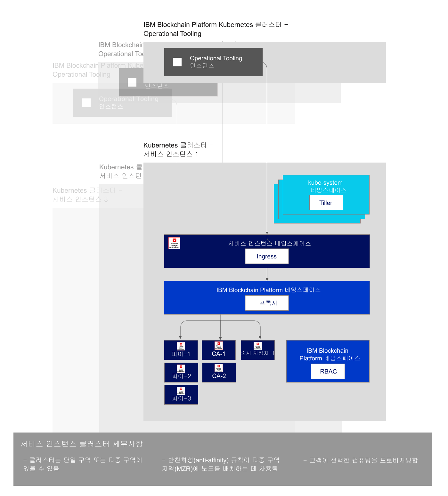

---

copyright:
  years: 2019
lastupdated: "2019-04-18"

subcollection: blockchain

---

{:new_window: target="_blank"}
{:shortdesc: .shortdesc}
{:screen: .screen}
{:codeblock: .codeblock}
{:note: .note}
{:important: .important}
{:tip: .tip}
{:pre: .pre}

# {{site.data.keyword.blockchainfull_notm}} Platform 무료 2.0 베타 정보
{: #ibp-console-overview}

{{site.data.keyword.blockchainfull}} Platform 무료 2.0 베타는 차세대 {{site.data.keyword.blockchainfull_notm}} Platform 오퍼링이며 배치 및 공개 키와 개인 키에 대한 포괄적인 제어 기능을 제공합니다. 이 무료 베타에는 사용자가 관리하고 제어하는 {{site.data.keyword.cloud_notm}} Kubernetes Service로 컴포넌트를 배치하는 프로세스를 단순화하고 가속화할 수 있는 사용자 인터페이스인 새 {{site.data.keyword.blockchainfull_notm}} Platform 콘솔이 포함됩니다. Kubernetes 및 {{site.data.keyword.cloud_notm}} Kubernetes Service에 대한 자세한 정보는 [Kubernetes](/docs/services/blockchain/reference/k8s.html "Kubernetes")를 참조하십시오.
{:shortdesc}

{{site.data.keyword.blockchainfull_notm}} Platform 무료 2.0 베타가 이제 Hyperledger Fabric 1.4.0 코드 베이스로 업그레이드되었습니다. Hyperledger Fabric 1.4.0 새 기능에 대한 자세한 정보는 [1.4의 새로운 기능](https://hyperledger-fabric.readthedocs.io/en/release-1.4/whatsnew.html "Fabric 1.4의 새로운 기능"){:new_window}을 참조하십시오.

## 새 베타에서 제공하는 내용
{: #ibp-console-overview-capabilities}

이 최신 릴리스는 숙련된 {{site.data.keyword.blockchainfull_notm}} 및 Hyperledger Fabric 사용자용이며 사용자가 네트워크를 호스팅하거나 기타 {{site.data.keyword.blockchainfull_notm}} 2.0 네트워크에 참여할 수 있는 새 조직을 작성할 수 있습니다. 기존 스타터 또는 엔터프라이즈 플랜 고객인 경우, {{site.data.keyword.IBM_notm}}에서 사용자의 네트워크를 관리하는 대신 사용자가 자신의 Kubernetes 클러스터 내에서 컴포넌트 프로비저닝, 모니터 및 관리에 대한 전적인 제어권을 가질 수 있습니다.

{{site.data.keyword.blockchainfull_notm}} Platform 무료 2.0 베타 릴리스에는 다음과 같은 핵심 기능이 포함되어 있습니다.

**통합된 개발자 경험**
- Node.js, Golang 또는 Java를 사용하여 스마트 계약을 **쉽게 코딩**하고 새 {{site.data.keyword.blockchainfull_notm}} VSCode 확장을 사용하여 클라이언트 애플리케이션을 작성하고 콘솔과 함께 **SDK 통합**을 활용하고 다양한 튜토리얼 및 샘플에서 배울 수 있습니다.
- **단순화된 DevOps**를 사용하면 더 많은 컴포넌트를 추가할 수 있도록 Kubernetes 자원을 스케일링하여 개발에서 테스트까지 단일 환경의 프로덕션으로 이동할 수 있습니다.
- **최신 Fabric 주요 기능.** Hyperledger Fabric v1.4의 최신 기능을 활용할 수 있습니다.
  - gossip 프로토콜을 통해 권한 부여된 피어만 원장 데이터를 공유할 수 있도록 하여 강화된 데이터 개인정보 보호를 제공하는 [**개인용 데이터** 콜렉션](/docs/services/blockchain/howto/ibp-console-smart-contracts.html#ibp-console-smart-contracts-private-data)
  - 애플리케이션이 네트워크와 상호작용하는 방법을 동적으로 검색하고 업데이트하도록 해주는 [서비스 검색 ](https://hyperledger-fabric.readthedocs.io/en/release-1.4/discovery-overview.html "서비스 검색")
  - 채널 및 스마트 계약을 추가적으로 통제할 수 있도록 해주는 [채널 액세스 제어 목록 ](https://hyperledger-fabric.readthedocs.io/en/release-1.4/access_control.html "액세스 제어 목록")
- **{{site.data.keyword.cloud_notm}} 서비스 통합.** {{site.data.keyword.cloud_notm}} Kubernetes Service 대시보드, {{site.data.keyword.IBM_notm}} Log Analysis with LogDNA 및 {{site.data.keyword.cloud_notm}} Identity and Access Management(IAM)와 같은 기본 {{site.data.keyword.cloud_notm}} 서비스를 활용합니다.

**종합적인 배치 제어**
- **필요한 컴포넌트만 배치.**. 피어를 여러 채널 및 네트워크에 연결하거나 비즈니스 파트너가 연결할 수 있는 순서 지정 서비스를 호스팅합니다.
- **ID 완전 제어 유지**. 개인 키를 {{site.data.keyword.cloud_notm}}에 저장하지 않고 노드를 관리하는 데 사용되는 키를 저장하고 관리합니다.
- **중앙 집중식 운영**. {{site.data.keyword.blockchainfull_notm}} Platform 콘솔을 사용하면 순서 지정자 또는 인증 기관을 관리하기 위해 {{site.data.keyword.IBM_notm}} 또는 기타 공급업체에 의존할 필요 없이 **단일 중앙 콘솔**에서 전체 조직 및 노드를 배치하고 관리할 수 있습니다. 또한 콘솔에서 블록체인 컨소시엄에 대해 구성원을 추가하거나 제거할 수 있으며 채널을 작성하고 가입할 수 있으며 스마트 계약을 설치하고 인스턴스화할 수 있습니다.
- **네트워크 호스팅 또는 참여**. 조직이 인프라와 독립적으로 노드를 관리하는 동안 클러스터에서 호스팅되는 피어를 다중 클라우드의 여러 채널에 배치하거나 사용자의 컨소시엄 또는 채널에 가입하도록 기타 조직을 초대할 수 있습니다.
- 노드를 관리 또는 모니터링할 수 있는 사용자의 **액세스를 관리**합니다.
- {{site.data.keyword.IBM_notm}} Kubernetes 서비스에서 노드의 **로그에 직접 액세스**할 수 있습니다. 로그를 추출하고 분석하려면 {{site.data.keyword.cloud_notm}} 로그 분석 서비스 또는 서드파티 서비스를 사용하십시오.
- Kubernetes 대시보드를 사용하여 **노드 팟(Pod)과 직접 상호작용**할 수 있습니다. 팟(Pod) 및 컨테이너를 실행하여 명령행에서 명령을 실행하고 인증서를 업데이트할 수 있습니다.

**확장성 및 유연성**
- **컴퓨팅을 선택하십시오.** CPU, 메모리 및 Kubernetes 클러스터에서 프로비저닝할 스토리지의 양을 유연하게 결정할 수 있습니다.
- 필요한 만큼만 비용을 지불하고 Kubernetes 클러스터 내의 자원 **규모를 확장 및 축소**할 수 있습니다.
- **재해 복구 및 다중 영역 고가용성.** 이 옵션은 컴포넌트의 고가용성(HA) 및 재해 복구(DR)를 사용하여 여러 영역에 걸쳐 Kubernetes 배치를 중복할 수 있게 해줍니다.  

어디서나 비즈니스용 블록체인을 배치하는 것과 관련하여 수행할 다음 단계는 이 [블로그](https://www.ibm.com/blogs/blockchain/2019/02/taking-the-next-step-towards-deploying-blockchain-anywhere "Taking the next step towards deploying blockchain for business anywhere")를 확인하십시오.  

이 오퍼링은 자체 네트워크를 빌드 및 관리하고자 하는 숙련된 Fabric 사용자를 위한 것입니다. 한 번의 클릭으로 전체 네트워크를 배치할 수 있는 기능이 곧 제공됩니다. 한편, 표준 구성을 사용하는 한 번의 클릭으로 네트워크를 배치하려면 [스타터 플랜](/docs/services/blockchain/get_start_starter_plan.html#getting-started-with-starter-plan)에 대한 문서를 참조하십시오.

## 고려사항
{: #ibp-console-overview-considerations}

콘솔을 배치하기 전에 다음 고려사항을 이해해야 합니다.

- {{site.data.keyword.blockchainfull_notm}} Platform 무료 2.0 베타는 Hyperledger Fabric v1.4.0과 함께 빌드됩니다.
- 무료 2.0 베타를 사용하여 배치되는 모든 피어는 상태 데이터베이스로 CouchDB를 사용합니다.
- 베타 오퍼링을 평가하기 위해 무료 Kubernetes 클러스터를 사용할 수 있으나 용량 및 성능은 제한적이며 데이터를 마이그레이션할 수 없으며 30일 후에 클러스터가 삭제됩니다.
- 사용자가 Kubernetes 클러스터의 상태 모니터링, 보안 및 로깅 관리를 책임집니다. {{site.data.keyword.cloud_notm}} 관리 및 책임 대상에 대한 자세한 내용은 이 [정보 ](https://cloud.ibm.com/docs/containers/cs_responsibilities.html#your-responsibilities-by-using-ibm-cloud-kubernetes-service "클러스터 관리 책임")를 참조하십시오.
- Kubernetes 대시보드를 사용하여 Kubernetes 클러스터의 자원 사용량을 모니터링할 책임도 있습니다. 스토리지 용량 또는 클러스터의 성능을 개선해야 하는 경우, [기존 볼륨 수정 ](https://cloud.ibm.com/docs/containers/cs_storage_file.html#change_storage_configuration "기존 스토리지 디바이스의 크기 및 IOPS 변경")방법에 대한 정보를 참조하십시오.
- 인증서, 공개 및 개인 키에 대한 관리 및 보안 책임이 있습니다. {{site.data.keyword.IBM_notm}}은 사용자의 인증서를 Kubernetes 클러스터나 콘솔에 저장하지 않습니다. 사용자의 브라우저의 로컬 스토리지에만 저장됩니다. 브라우저를 전환하는 경우에는 작성된 ID를 해당 브라우저로 가져와야 합니다.
- 무료 2.0 베타 오퍼링은 {{site.data.keyword.cloud_notm}} Kubernetes 서비스의 **댈러스** 지역에서만 사용 가능합니다. 이 지역에는 댈러스, 산호세, 휴스턴, 브라질의 데이터 센터가 있습니다. 따라서 모든 블록체인 컴포넌트는 이 4곳의 데이터 센터에 상주할 수 있습니다. 다른 곳에 배치되지 않습니다.
- {{site.data.keyword.blockchainfull_notm}} Platform 2.0 베타 오퍼링이 무료인 반면, 제한된 무료 클러스터 대신 유료 Kubernetes 클러스터를 선택하면 {{site.data.keyword.cloud_notm}} 계정에 비용이 발생합니다.
- Kubernetes가 사용자의 {{site.data.keyword.cloud_notm}} Kubernetes 클러스터 내에서 1.11 버전 이상이어야 합니다. 이러한 지시사항에 따라 [신규 및 기존 클러스터를 해당 버전으로 업그레이드](/docs/services/blockchain/howto/ibp-v2-deploy-iks.html#ibp-v2-deploy-iks-updating-kubernetes)하십시오.

## 마이그레이션
{: #ibp-console-overview-migration}

{{site.data.keyword.blockchainfull_notm}} 플랫폼 오퍼링에서 {{site.data.keyword.blockchainfull_notm}} Platform 무료 2.0 **베타**로 마이그레이션할 수는 없습니다.  

모든 {{site.data.keyword.blockchainfull_notm}} Platform 무료 2.0 베타 서비스 인스턴스는 GA 버전으로 마이그레이션되지 않으며, 스타터 또는 엔터프라이즈 플랜 인스턴스도 2.0 GA 버전으로 마이그레이션할 수 없습니다.

## 라이센스 및 가격
{: #ibp-console-overview-license-and-pricing}

{{site.data.keyword.blockchainfull_notm}} Platform 무료 2.0 베타는 무료입니다. 콘솔의 인스턴스는 플랫폼의 각 배치와 함께 {{site.data.keyword.cloud_notm}} Kubernetes Service 클러스터에 포함됩니다. 콘솔을 {{site.data.keyword.cloud_notm}} Kubernetes Service의 표준 클러스터에 배치하는 경우 Kubernetes 클러스터에 대해 비용을 지불해야 합니다.

## 시작하기
{: #ibp-console-overview-deploy}

콘솔의 인스턴스는 {{site.data.keyword.blockchainfull_notm}} Platform 무료 2.0 베타의 각 인스턴스 배치의 일부로서 {{site.data.keyword.IBM_notm}} Kubernetes Service에 배치됩니다.

콘솔 및 플랫폼 배치에 대한 자세한 정보는 [{{site.data.keyword.blockchainfull_notm}} Platform 무료 2.0 베타로 시작하기](/docs/services/blockchain/howto/ibp-v2-deploy-iks.html#ibp-v2-deploy-iks)를 참조하십시오.

콘솔을 사용하여 노드 배치 및 컨소시엄 빌드를 시작하는 방법에 대한 자세한 정보는 [네트워크 빌드](/docs/services/blockchain/howto/ibp-console-build-network.html#ibp-console-build-network) 튜토리얼을 참조하십시오. 이 튜토리얼은 콘솔을 사용하여 세 개의 조직(하나의 순서 지정 조직, 두 개의 피어 조직) 및 두 개의 피어가 가입된 채널이 있는 샘플 네트워크를 작성하는 과정을 통해 안내합니다. 샘플 네트워크를 사용하여 데모 또는 PoC(proof of concept)를 배치하거나 튜토리얼 내의 단계를 조정하고 확장하여 직접 구성을 작성할 수 있습니다.

## 아키텍처 참조
{: #ibp-console-overview-architecture}

다음 그림에서는 블록체인 네트워크의 컴포넌트와 서로 간의 상호 작용 방식을 보여줍니다.

*그림 1. 아키텍처 참조*

콘솔의 단일 인스턴스(Operational Tooling이라고도 함)가 각 {{site.data.keyword.blockchainfull_notm}} Platform 서비스 인스턴스에 대해 작성되는 방법에 유의하십시오. 피어, 순서 지정자 또는 CA 노드가 콘솔을 사용하여 배치될 때 **Kubernetes 클러스터 서비스 인스턴스**로 배치됩니다.

| **IBM Blockchain Platform Kubernetes 클러스터** | **설명** |
| ------------------------- |-----------|
| Operational Tooling | `콘솔`이라고도 하며 모든 블록체인 컴포넌트 작동에 필요한 중앙 사용자 인터페이스입니다. 이 콘솔을 사용하여 CA, 피어 및 순서 지정자 노드를 작성하고 채널을 작성하고 Hyperledger Fabric v1.4 VSCode 확장을 사용하여 개발된 스마트 계약을 설치 및 인스턴스화할 수 있습니다. 콘솔은 {{site.data.keyword.IBM_notm}}에서 소유한 클러스터에 배치됩니다.|


| **Kubernetes 클러스터 서비스 인스턴스** | **설명** |
| ------------------------- |-----------|-----------|-----------|
| **Tiller** | [Helm 도구](https://docs.helm.sh/glossary/#tiller "Tiller")의 일부이며 Kubernetes 클러스터 내에서 실행되어 피어, CA 및 순서 지정자 Helm 차트의 설치를 관리합니다. |
| **Ingress** | 클러스터 외부에서 클러스터 리소스에 대한 액세스를 허용하는 [Kubernetes 오브젝트 ](https://kubernetes.io/docs/concepts/services-networking/ingress/ "Ingress")입니다. |
| **프록시** | {{site.data.keyword.blockchainfull_notm}} Platform 프록시는 호스트 헤더 라우팅을 사용하여 트래픽을 올바른 피어, CA 및 순서 지정자 노드로 라우팅할 책임이 있습니다. |
| **피어, CA, 순서 지정자** | 기본 helm 차트를 배치하여 작성된 노드입니다. 참고: 이러한 노드는 다른 Kubernetes 클러스터 서비스 인스턴스에서 가져올 수도 있습니다. 키가 {{site.data.keyword.IBM_notm}}에 의해 저장되지 않으므로 모든 피어 및 순서 지정자 노드는 콘솔이 콘솔 지갑 내의 키를 사용하여 각 노드와 통신할 수 있도록 허용하는 gRPC 웹 프록시를 포함합니다. |
| **RBAC** | 역할 기반의 액세스 제어입니다.  {{site.data.keyword.blockchainfull_notm}} Platform은 클러스터에서 블록체인 컴포넌트를 관리하는 데 필요한 [Kubernetes RBAC ](https://kubernetes.io/docs/reference/access-authn-authz/rbac/ "RBAC 권한 사용")를 사용합니다.  |

## 고가용성(HA) 및 재해 복구(DR)
{: #ibp-console-overview-hadr}

HA 및 DR이 필요한 경우, 유료 IBM Cloud Kubernetes 클러스터에서 다중 영역 스토리지를 사용할 수 있어야 합니다. 다양한 [Kubernetes 스토리지 옵션](https://cloud.ibm.com/docs/containers/cs_storage_planning.html#persistent_storage_overview)을 사용할 수 있습니다. 곧 출시되는 IBM Cloud는 권장되는 솔루션인 Portworx 스토리지 솔루션을 지원합니다. 그 때까지는 구현에 HA 및 DR이 필요한 경우, 직접 스토리지 솔루션을 제공해야 합니다.  

직접 스토리지 솔루션을 추가하려면 사용자 정의된 스토리지 클래스를 작성해야 합니다. 솔루션에 대한 [스토리지 클래스 추가](https://cloud.ibm.com/docs/containers/cs_storage_basics.html#storageclasses) 방법을 참조하십시오. {{site.data.keyword.blockchainfull_notm}} Platform은 `default` 스토리지 클래스가 있는 [동적 볼륨 프로비저닝](https://cloud.ibm.com/docs/containers/cs_storage_basics.html#dynamic_provisioning)을 사용합니다. 따라서 기본 스토리지 클래스를 변경하려면 다음 명령을 실행하십시오.
```
kubectl patch storageclass <storageclass> -p '{"metadata": {"annotations":{"storageclass.kubernetes.io/is-default-class":"true"}}}'
```
{:codeblock}

``<storageclass>``를 사용자의 스토리지 클래스 이름으로 바꾸십시오.  

마지막으로, 유료 클러스터를 작성할 때 다중 영역 지역을 사용 가능하도록 설정하십시오.

## 지원 받기
{: #ibp-console-overview-support}

{{site.data.keyword.blockchainfull_notm}} Platform 2.0에 대한 지원, 무료 블록체인 개발자 리소스 및 문제해결에 사용할 수 있는 지원 포럼에 대한 자세한 정보는 [지원 받기](/docs/services/blockchain/ibmblockchain_support.html#blockchain-support)를 참조하십시오.

{{site.data.keyword.blockchainfull_notm}} Platform 2.0에 대한 지원은 베타 기간 동안으로 제한됩니다.
{: important}
