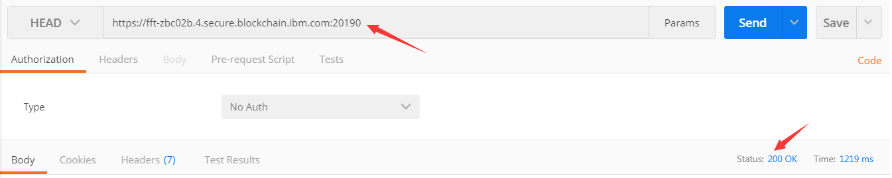
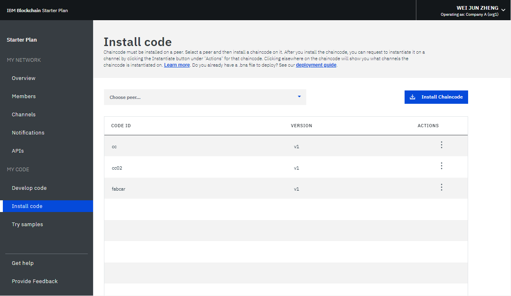

---

copyright:
  years: 2018,2019
lastupdated: "2019-02-08"

---

{:new_window: target="_blank"}
{:shortdesc: .shortdesc}
{:screen: .screen}
{:codeblock: .codeblock}
{:pre: .pre}

# 블록체인 네트워크 모니터링
{: #monitor-blockchain-network}


***[이 페이지가 도움이 되었습니까? 알려주십시오.](https://www.surveygizmo.com/s3/4501493/IBM-Blockchain-Documentation)***


이 튜토리얼은 {{site.data.keyword.cloud_notm}}에서 {{site.data.keyword.blockchain}} 네트워크의 상태 정보를 보고 모니터링하는 방법을 보여줍니다.
{:shortdesc}


## 피어, 순서 지정자 및 CA 모니터링
{: #monitor-blockchain-network-monitor-nodes}

네트워크 노드 중 하나에 대해 HTTP **HEAD** 요청을 발행하여 노드 상태를 확인할 수 있습니다. 네트워크 노드는 블록체인 네트워크의 피어, 순서 지정자 또는 CA일 수 있습니다. **HEAD** 요청은 GET 요청과 유사하며 본문 없이 헤더만 전송합니다. 노드가 정상적으로 작동하는 경우 200 응답을 받을 수 있습니다.

1. 네트워크 모니터의 "개요" 화면에서 **연결 프로파일**을 클릭하십시오. 그런 다음 **원시 JSON**을 클릭하여 웹 브라우저에서 연결 프로파일을 보거나 **다운로드**를 클릭하여 연결 프로파일을 로컬로 저장할 수 있습니다.
2. 연결 프로파일에서 확인할 네트워크 노드의 URL 정보를 찾으십시오. 예를 들어, `fabric-orderer-20190b` 순서 지정자의 URL은 `grpcs://fft-zbc02b.4.secure.blockchain.ibm.com:20190`입니다.
    
3. URL에서 **grpcs**를 **https**로 대체하십시오. 위의 예에서 URL은 `https://fft-zbc02b.4.secure.blockchain.ibm.com:20190`이 됩니다.
4. curl 또는 Chrome Postman 앱과 같은 도구를 사용하여 URL에 대해 **HEAD** 요청을 발행하십시오.
    - 200 상태 응답을 받으면 네트워크 노드가 정상적으로 작동하는 것입니다.
    - **HEAD** 요청이 실패하며 연결 오류가 발생하면, 네트워크 노드가 실행 중이 아니거나 노드 URL이 잘못되었거나 방화벽이 노드에 대한 사용자 액세스를 차단한 것입니다.  이 오류를 해결해야 합니다. 그렇지 않으면 애플리케이션이 노드에 연결할 수 없습니다.

다음 예는 curl에서 200 응답이 있는 **HEAD** 요청을 보여줍니다. HTTP **HEAD** 요청은 노드가 액세스 가능한지 여부를 확인하므로 grpc 오류를 무시할 수 있습니다. 액세스 가능한 경우 노드에 대한 grpc 요청은 애플리케이션에서도 작동합니다.

```
C:\>curl -i --head https://fft-zbc02b.4.secure.blockchain.ibm.com:20190
HTTP/2 200
contnent-type: application/grpc
grpc-status: 8
grpc-message: malformed method name: "/"
```

다음 예는 curl에서 연결 오류가 있는 **HEAD** 요청을 보여줍니다.

```
C:\>curl -i --head https://fft-zbc02b.4.secure.blockchain.ibm.com:20190
curl: (7) Failed to connect to fft-zbc02b.4.secure.blockchain.ibm.com:20190: Connection refused
```

다음 그림은 Chrome Postman 앱에서 200 응답이 있는 **HEAD** 요청을 보여줍니다.

  

## 네트워크 로그 사용
{: #monitor-blockchain-network-using-logs}

네트워크 모니터의 "개요" 화면에는 인증 기관, 순서 지정 서비스 및 피어 상태가 표시됩니다. **조치** 헤더의 드롭다운 목록에서 **로그 보기**를 클릭하여 특정 네트워크 컴포넌트의 로그를 보십시오. 엔터프라이즈 플랜 네트워크를 사용하는 경우 텍스트 파일 형식으로 컴포넌트 로그를 볼 수 있습니다. 스타터 플랜 네트워크를 사용하는 경우 [{{site.data.keyword.cloud_notm}} 로그 분석 서비스 ](https://console.bluemix.net/catalog/services/log-analysis)를 통해 컴포넌트 로그를 수집하며 [Kibana](/docs/services/blockchain/howto/monitor_network.html#monitor-blockchain-network-viewing-kibana-logs)에서 로그를 볼 수 있습니다.

각 컴포넌트는 여러 다른 활동에서 로그를 생성합니다. 그 이유는 각 컴포넌트가 Hyperledger Fabric [네트워크 아키텍처 ](https://hyperledger-fabric.readthedocs.io/en/release-1.2/network/network.html) 및 [트랜잭션 플로우 ](https://hyperledger-fabric.readthedocs.io/en/release-1.1/txflow.html)에서 여러 다른 역할을 수행하기 때문입니다.

- **인증서 권한 로그**
  인증 기관에서는 네트워크의 참가자 ID를 관리합니다. 인증 기관 로그에서는 참가자가 네트워크와 통신하기 위해 공개 및 개인 키를 생성하는 때(등록) 또는 새 구성원, 피어 또는 애플리케이션이 인증 기관에 등록하는 때 부터의 로그도 찾을 수 있습니다. 인증서 확인에 문제점이 있는 경우 디버그하는 데도 CA 로그를 사용할 수 있습니다.

- **순서 지정 서비스 로그**
  순서 지정 서비스는 블록체인 네트워크의 공통 바인딩 컴포넌트입니다. 피어, 채널 업데이트 또는 네트워크 멤버십 업데이트에서 인증된 모든 트랜잭션 제안은 검증을 위해 순서 지정 서비스에 전송됩니다. 따라서 순서 지정 서비스에는 네트워크 시작 시부터의 로그가 포함됩니다. 또한 올바른 조직에서 제대로 인증하지 않았으므로 거부된 트랜잭션의 로그도 포함됩니다. 채널을 작성하거나 업데이트할 때 또는 채널 업데이트에 실패할 때부터의 로그도 찾을 수 있습니다.

- **피어 로그**  
  피어 로그에는 체인코드를 설치, 인스턴스화 및 호출한 결과가 포함되어 있습니다. 체인코드 이름과 버전을 검색하여 특정 체인코드의 로그를 찾을 수 있습니다. [채널 모니터의 체인코드 섹션](/docs/services/blockchain/howto/monitor_network.html#monitor-blockchain-network-monitor-channel-cc)에서 특정 체인코드의 로그도 볼 수 있습니다. 트랜잭션 제안에서 생성하는 메시지 또는 제안 요청과 관련된 제한시간 초과 문제는 피어 로그에서 찾을 수 있습니다. 피어 로그에는 [체인코드의 보증 정책](/docs/services/blockchain/howto/install_instantiate_chaincode.html#install-instantiate-chaincode-endorsement-policy)을 충족시키지 않아서 거절된 트랜잭션의 오류도 포함되어 있습니다. 채널 가입 요청의 결과를 찾을 수도 있습니다.

Hyperledger Fabric에서는 메시지 심각도에 따라 여러 다른 [로깅 레벨 ](https://hyperledger-fabric.readthedocs.io/en/release-1.1/logging-control.html "로깅 제어")을 제공합니다. {{site.data.keyword.blockchainfull_notm}} Platform의 기본 로깅 레벨은 `INFO`입니다. 추가 로그를 보려면 [지원 티켓](/docs/services/blockchain/ibmblockchain_support.html#blockchain-support-cases)을 열어 로깅 레벨을 더 자세한 `DEBUG`로 설정할 수 있습니다. `DEBUG` 레벨 로그에서는 필터링해야 할 수도 있는 사소한 메시지도 다량 표시한다는 점에 유의하십시오. 메시지에서 `warning` 또는 `error`를 검색하여 Hyperledger Fabric 컴포넌트의 문제점을 발견하십시오. 컴포넌트 컨테이너가 실패하는지 아니면 강제 종료되는지 발견하려면 {{site.data.keyword.cloud_notm}}에서 보낸 `panic` 또는 `killed` 메시지를 검색하십시오.

## 스타터 플랜에서 Kibana의 로그 보기
{: #monitor-blockchain-network-viewing-kibana-logs}

스타터 플랜 네트워크의 로그는 [{{site.data.keyword.cloud_notm}} 로그 분석 서비스 ](https://console.bluemix.net/catalog/services/log-analysis "로그 분석 서비스")에서 수집합니다. 기본적으로 로그는 로그 분석 서비스의 Lite 플랜에서 수집됩니다. 이 플랜은 무료이고 버리기 전에 **3일 동안 로그를 저장**합니다. **매일 로그의 처음 500MB만 검색**할 수도 있습니다. 네트워크 로그가 500MB를 초과하면 Kibana에서 새 로그를 볼 수 없습니다. 네트워크가 500MB를 넘는 로그를 생성하거나 3일이 넘게 로그를 유지하려는 경우 로그 분석 서비스의 유료 버전으로 업그레이드할 수 있습니다.

네트워크 모니터의 "개요" 화면에서 **조치** 헤더의 드롭다운 목록에서 **로그 보기**를 클릭하여 Kibana 인터페이스에서 각 네트워크 컴포넌트 로그를 여십시오. Kibana가 열리면 맨 위 검색 표시줄에서 필터링한 로그가 표시됩니다. 예를 들어 피어 로그를 보기 위해 클릭하면 네트워크 ID와 피어 ID(`NETWORK_ID_str:"nf8389d520c243004bb21ff5d70fc8939" && NODE_NAME_str:"org1-peer1"`)별로 검색이 필터링됩니다. 특정 로그를 더 보려면 검색 표시줄에서 추가 필드를 입력할 수 있습니다. 예를 들어 `&& "marbles"`를 추가하여 `"marbles"` 체인코드의 로그를 표시할 수 있습니다. 특정 컴포넌트 용어를 삭제하고 네트워크 ID로만 검색하면(예: `NETWORK_ID_str:"nf8389d520c243004bb21ff5d70fc8939"`) 모든 네트워크 컴포넌트에서 로그를 표시합니다.

오른쪽 상단에 있는 시간 범위 단추를 사용하여 로그가 표시되는 기간을 변경할 수 있습니다. 화면 왼쪽의 탭을 사용하여 검색에서 필드를 제거하고 추가할 수 있습니다. 표시할 가장 중요한 필드는 메시지 필드입니다. 시간소인 없이 메시지를 검색하면 해당 메시지 로그의 모든 인스턴스를 찾는 데 도움이 될 수 있습니다. **저장** 단추를 눌러 현재 검색을 저장하고 특정 보기로 돌아가십시오. Kibana에 데이터를 표시하는 데 관한 자세한 정보는 [Kibana 사용자 안내서 ](https://www.elastic.co/guide/en/kibana/6.2/index.html "Kibana 사용자 안내서")를 참조하십시오. 로그 분석 CLI를 사용하여 로컬 파일 시스템에 [로그를 다운로드](https://console.bluemix.net/docs/services/CloudLogAnalysis/how-to/manage-logs/downloading_logs_cloud.html#downloading_logs)할 수 있습니다.

**참고:** 기본적으로 Kibana는 30일 동안의 활동 로그를 표시하도록 사전 구성됩니다. 최근 30일 동안 활동이 없으면 *결과를 찾을 수 없음*이라는 메시지가 표시됩니다. 다른 로그를 보려면 오른쪽 상단에 있는 사용자 이름 아래의 타이머 아이콘을 클릭하고 보다 넓은 시간 범위(예: *올해 초부터 지금까지*)를 설정할 수 있습니다.

## 채널 모니터링
{: #monitor-blockchain-network-monitor-channnels}

네트워크 모니터를 입력하고 "채널" 화면에서 보고 모니터링하려는 채널을 찾으십시오. 특정 채널 화면에서는 다음 세 개 탭에서 데이터 상태 정보, 구성원 및 이 채널의 인스턴스화된 체인코드를 볼 수 있습니다.

### 채널 개요
{: #monitor-blockchain-network-monitor-channel-overview}

  "채널 개요" 탭에는 이 채널에 대한 블록 정보가 표시됩니다.
  * 작성된 총 블록 수를 포함하는 일련의 데이터 점, 마지막 트랜잭션 이후의 시간 간격, 체인코드 인스턴스화 수 및 체인코드 호출 수.
  * 이 채널의 모든 블록을 나열하는 테이블. 블록을 펼쳐서 블록에 대한 자세한 정보를 볼 수 있습니다.

  

### 구성원
{: #monitor-blockchain-network-monitor-channel-members}

"멤버" 탭에 조직 운영자의 이메일 주소를 포함하여 이 채널에 대한 구성원의 정보가 표시됩니다.

  

### 체인코드(Chaincode)
{: #monitor-blockchain-network-monitor-channel-cc}

  "체인코드" 탭에는 체인코드 ID, 버전 및 체인코드를 실행 중인 피어의 수와 함께 이 채널에서 인스턴스화된 모든 체인코드가 나열됩니다.

체인코드 행을 펼쳐서 체인코드에 대한 세부사항 정보를 가져오십시오.
  * **JSON**을 클릭하여 체인코드의 JSON 파일을 볼 수 있습니다.
  * **로그**를 클릭하여 체인코드의 로그를 볼 수 있습니다. 이 보기에서는 체인코드를 설치한 피어의 로그를 체인코드 이름과 버전별로 필터링하여 표시합니다.

    체인코드를 모니터링하고 디버깅하는 데 도움이 되도록 각 체인코드 기능 다음에 고유한 성공 또는 오류 메시지를 추가하는 것이 좋습니다. 여러 다른 파일을 사용하는 복합 체인코드가 있으면 여러 다른 트랜잭션 스테이지에서 메시지를 찾는 데 사용할 수 있는 고유한 키워드를 체인코드 로그에 추가할 수 있습니다.
   * **삭제**를 클릭하여 실행 중인 체인코드 컨테이너를 제거할 수 있습니다. 실행 중인 체인코드 컨테이너를 삭제해도 실제로 체인코드가 삭제되지 않습니다. 블록체인 네트워크에서 인스턴스화된 체인코드는 삭제할 수 없습니다.

  


## 체인코드 모니터링
{: #monitor-blockchain-network-monitor-chaincode}

네트워크 모니터에 들어가서 "코드 설치" 화면을 여십시오. 체인코드를 실행하는 경우 체인코드 ID 및 버전과 함께 체인코드가 테이블에 표시됩니다. 드롭다운 목록에서 피어를 선택하면 테이블에 이 피어의 모든 체인코드가 표시됩니다. 특정 "채널" 화면의 ["체인코드" 탭](/docs/services/blockchain/howto/monitor_network.html#monitor-blockchain-network-monitor-channel-cc)에서 체인코드의 로그를 볼 수 있습니다.

  

<!----
## Monitoring sample applications
{: #monitor-apps}

In a Starter Plan network, you can view and access sample applications in the "Try Samples" screen of the Network Monitor.  After you deploy a sample application, you can click the **Launch** button to enter your application interface, or the **View on GitHub** link to visit the code repository.  For more information, see [Deploying sample applications](/docs/services/blockchain/prebuilt_samples.html#deploying-sample-applications).

  
--->
