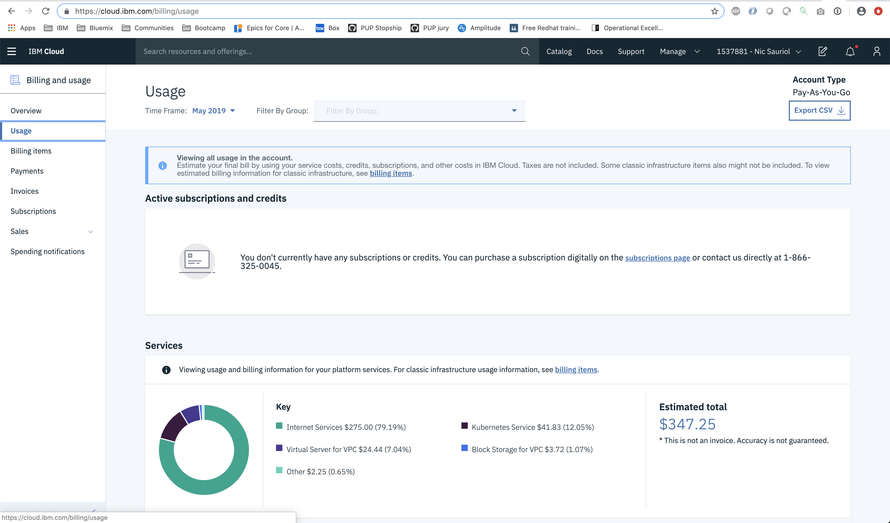

---

copyright:
  years: 2019
lastupdated: "2019-05-31"

keywords: pricing model, hourly, per hour, VPC, CPU, vCPU, virtual core, cost, scalability, estimation, optimize your cost

subcollection: blockchain

---

{:new_window: target="_blank"}
{:shortdesc: .shortdesc}
{:screen: .screen}
{:codeblock: .codeblock}
{:note: .note}
{:important: .important}
{:tip: .tip}
{:pre: .pre}

# 가격
{: #ibp-saas-pricing}

이 안내서는 {{site.data.keyword.blockchainfull}} Platform on {{site.data.keyword.cloud_notm}}에 대한 가격 모델과 Hyperledger Fabric v1.4.1을 기반으로 하는 피어, 순서 지정자 및 인증 기관 컴포넌트의 블록체인 네트워크를 개발하고 확장할 때 지불할 비용을 이해하는 데 도움이 됩니다.
{:shortdesc}

_이 가격 모델은 {{site.data.keyword.blockchainfull_notm}} Platform on {{site.data.keyword.cloud_notm}}에만 적용됩니다. 스타터 플랜 또는 엔터프라이즈 플랜을 사용 중이고 가격에 대한 질문이 있는 경우 스타터 플랜 및 엔터프라이즈 플랜 [가격](/docs/services/blockchain?topic=blockchain-ibp-pricing)을 참조하십시오._

{{site.data.keyword.blockchainfull_notm}} Platform에는 가상 프로세서 코어(VPC) 사용량을 기반으로 하는 새로운 시간별 가격 모델이 도입되었습니다. 이 단순화된 모델은 {{site.data.keyword.blockchainfull_notm}} Platform 노드에서 시간별로 이용하는 CPU(또는 VPC)의 양을 기반으로 하며 정액 요금은 **$0.29 USD/VPC-시간**입니다.

VPC는 {{site.data.keyword.IBM_notm}} 제품의 라이센싱 비용을 판별하는 데 사용되는 측정 단위이며 제품에 사용 가능한 가상 코어(vCPU)의 수를 기반으로 합니다. vCPU는 서버가 가상 머신 또는 실제 프로세서 코어에 지정되는 가상 코어입니다. {{site.data.keyword.blockchainfull_notm}} Platform 비용 추정을 위해 **1 VPC = 1 CPU = 1 vCPU = 1 Core**입니다.
{:note}

총 비용 추정을 위해 블록체인 네트워크는 {{site.data.keyword.blockchainfull_notm}} Platform 컴포넌트를 포함하는 {{site.data.keyword.cloud_notm}} Kubernetes로 구성되며 사용자가 선택한 스토리지를 사용한다는 점을 기억하십시오. 사용자의 {{site.data.keyword.cloud_notm}} Kubernetes 클러스터와 사용자가 선택한 스토리지에는 별도의 비용이 발생합니다. 콘솔이라고도 하는 Operational Tooling 인스턴스가 실행 중인 클러스터에 대한 비용은 청구되지 않습니다. 설명은 [아키텍처 참조](/docs/services/blockchain/howto/ibp-console.html#ibp-console-overview-architecture) 주제를 참조하십시오. 비용을 계산하는 방법에 대한 세부사항은 아래에 설명되어 있습니다.

개발자는 무료 [VS Code 확장 ](https://marketplace.visualstudio.com/items?itemName=IBMBlockchain.ibm-blockchain-platform "{{site.data.keyword.blockchainfull_notm}} Platform VS Code 확장")으로 시작할 수 있습니다. 이 통합 개발자 환경을 사용하여 로컬로 스마트 계약을 작성, 테스트, 디버그 및 패키지하고 {{site.data.keyword.blockchainfull_notm}} Platform 배치를 위해 클라이언트 애플리케이션을 작성할 수 있습니다. 처음부터 시작하거나 튜토리얼 및 샘플에 액세스하여 블록체인 기본사항을 학습하십시오.

## 새 가격 모델의 이점
{: #ibp-saas-pricing-benefits}

- **멤버십 요금 없음**: 멤버십 요금이 없다는 것은 블록체인 컴포넌트에서 직접 투자할 수 있음을 의미합니다.
- **추정 명확성**: 단순 시간별 가격 모델을 통해 {{site.data.keyword.cloud_notm}} 대시보드에서 사용 가능한 비용 추정기 도구를 사용하여 쉽고 명확하게 비용을 추정할 수 있습니다.
- **최소 요금이 필요하지 않음**: 최소 VPC 시간별 패키지가 필요하지 않고 사용한 부분에 대해서만 지불하여 저렴한 비용으로 시작할 수 있습니다.
- **컴퓨팅 확장성**: 사용량이 가장 많은 기간 동안 컴퓨팅을 확장하거나 비용을 최소화하기 위해 컴퓨팅이 필요하지 않은 시간 동안에는 용량의 매우 작은 부분으로 축소할 수 있는 옵션이 있습니다.  

요약하면 이러한 기능은 멤버십 제한사항을 처리하거나 요구사항에 앞서 컴퓨팅을 구매해야 하는 복잡성을 제거합니다.

## 비용의 주요 요소
{: #ibp-saas-pricing-elements}

블록체인은 {{site.data.keyword.blockchainfull_notm}} Platform 컴포넌트를 포함하는 {{site.data.keyword.cloud_notm}} Kubernetes 클러스터로 구성되며 사용자가 선택한 스토리지를 사용하기 때문에 다음의 각 요소가 총 비용을 형성합니다.

- **{{site.data.keyword.blockchainfull_notm}} Platform** 정액 요금 $0.29 USD/VPC-시간
- 유료 클러스터를 프로비저닝할 때 {{site.data.keyword.cloud_notm}}에 표시되는 **{{site.data.keyword.cloud_notm}} Kubernetes Service** 클러스터의 계층 가격. 여기에는 컴퓨팅, 즉 CPU 및 메모리에 대한 비용이 포함됩니다. {{site.data.keyword.cloud_notm}} Kubernetes Service는 월별 사용 시간 수를 기반으로 하는 계층 모델에 따라 가격이 책정됩니다. 따라서 가격 책정 플랜을 검사할 때 24x7 사용량이 월별 720시간과 동일함을 고려하십시오. 클러스터 가격에 대한 세부사항은 [Kubernetes Service 카탈로그 페이지 ](https://cloud.ibm.com/kubernetes/catalog/cluster "Kubernetes Service")에 있는 표를 참조하십시오.
- 사용자 요구사항에 맞는 **스토리지** 플랜을 선택하십시오. 스토리지 클래스 옵션과 각 옵션에 필요한 [비용 ](https://www.ibm.com/cloud/file-storage/pricing)에 대해 자세히 알아보려면 [Kubernetes 스토리지 기본사항 이해](/docs/containers?topic=containers-kube_concepts#kube_concepts) 주제를 참조하십시오. {{site.data.keyword.blockchainfull_notm}} Platform 노드는 클러스터에 대해 기본 스토리지 클래스를 사용합니다. {{site.data.keyword.cloud_notm}}에서 Kubernetes 클러스터를 프로비저닝할 때 지속적 스토리지 플러그인인 [Bronze 레벨 파일 스토리지](/docs/containers?topic=containers-file_storage#file_predefined_storageclass)로 사전 구성됩니다.

## 가격 예제
{: #ibp-saas-pricing-scenarios}

다음 표에서는 별도로 명시되지 않는 한 [기본 리소스 할당]( #ibp-saas-pricing-default)을 사용하는 두 가지 가격 예제를 제공합니다.
- **테스트 네트워크** 시나리오는 스마트 계약을 시작하고 테스트하는 데 적합합니다.
- **프로덕션 네트워크 가입** 시나리오에는 고가용성을 위해 권장되는 두 개의 피어와 조직 멤버십에 필요한 인증 기관(CA)이 포함되어 있습니다.
   - 이러한 피어는 다른 위치에서 호스팅되는 프로덕션 {{site.data.keyword.blockchainfull_notm}} Platform 네트워크에 가입할 수 있습니다.
   -  [비용을 절감](/docs/services/blockchain?topic=blockchain-ibp-console-govern#ibp-console-govern-reallocate-resources)하기 위해 노드가 사용 중이지 않을 때 항상 노드를 최소 사용률 상태(0.001 CPU)로 줄일 수 있습니다.
   - 이 시나리오는 **프로덕션** 환경을 대상으로 하기 때문에
     - 더 많은 용량을 제공하기 위해 기본 컴퓨팅 리소스가 두 배로 증가했습니다.
     - 더 빠른 성능을 위해 [Silver ](/docs/containers?topic=containers-file_storage#file_silver) 스토리지 클래스가 선택되었습니다.

| 가격 옵션**(1 VPC = 1 CPU)| **테스트 네트워크** | **프로덕션 네트워크에 가입** |
|-|------------|-----------------------------|
| **CPU 할당** |  1.85 CPU   포함:   - 1개의 피어   - 2개의 CA   - 1개의 순서 지정자 | 4.9 CPU   포함:   - 2개의 피어(HA용)   **(2x 기본 컴퓨팅)**  - 1개의 CA    |
| **시간별 비용: {{site.data.keyword.blockchainfull_notm}} Platform** | $0.54 USD   (1.85 CPU x $0.29 USD/VPC-시간) | $1.42 USD   (4.9 CPU x $0.29 USD/VPC-시간) |
| **시간별 비용: {{site.data.keyword.cloud_notm}} Kubernetes 클러스터**    | $0.12 USD   (컴퓨팅: 2 x 4티어)    (IP 할당: $16 USD/월) | $0.46 USD   (컴퓨팅: 8 x 32티어)    (IP 할당: $16 USD/월) |
| **시간별 비용: 스토리지** | $0.07 USD   340GB    [Bronze ](https://www.ibm.com/cloud/file-storage/pricing)    2IOPS/GB | $0.13 USD   420GB   [Silver ](https://www.ibm.com/cloud/file-storage/pricing)   4IOPS/GB  |
| **총 시간별 비용** | **$0.73 USD** | **$2.01 USD**| |
** {{site.data.keyword.blockchainfull_notm}} Platform 서비스 인스턴스를 {{site.data.keyword.cloud_notm}} Kubernetes 무료 클러스터에 링크하는 경우 30일 동안 무료로 {{site.data.keyword.blockchainfull_notm}} Platform을 미리 사용합니다. 성능은 처리량, 스토리지 및 기능에 따라 제한됩니다. {{site.data.keyword.cloud_notm}}가 30일 후에 Kubernetes 클러스터를 삭제하며 노드 또는 데이터를 무료 클러스터에서 유료 클러스터로 마이그레이션할 수 없습니다.  

실제 비용은 트랜잭션 비율, 필요한 채널 수, 트랜잭션의 페이로드 크기 및 최대 동시 트랜잭션 수와 같은 추가 요인에 따라 다릅니다.
{:note}

프로비저닝하고 단일 Kubernetes 클러스터와 연관시킬 수 있는 서비스 인스턴스 수에는 제한이 없지만 서비스 중단을 방지하려면 CPU, 메모리 및 스토리지 사용량을 모니터하여 적절한 리소스가 사용 가능한지 확인해야 합니다. {{site.data.keyword.blockchainfull_notm}} Platform 노드가 자체 클러스터에 있을 필요는 없습니다. 블록체인 컴포넌트가 실행 중인 클러스터에서 실행 중인 다른 {{site.data.keyword.cloud_notm}} 서비스가 있을 수 있지만 모든 서비스 인스턴스의 모든 요구사항을 처리하기에 충분한 컴퓨팅 및 스토리지가 있는지 다시 한 번 확인해야 합니다.

## 기본 리소스 할당
{: #ibp-saas-pricing-default}

다음 표의 값은 CPU, 컴퓨팅 및 스토리지를 기반으로 사용자 정의 네트워크의 시간별 비용을 추정하는 데 유용합니다.

| **컴포넌트**(모든 컨테이너) | CPU  | 메모리(GB) | 스토리지(GB) |
|--------------------------------|---------------|-----------------------|------------------------|
| **피어**                       | 1.2          | 2.4                   | 200(피어용 100GB 및 CouchDB용 100GB 포함) |
| **CA**                         | 0.1            | 0.2                    | 20                     |
|**순서 지정자**                    | 0.45           | 0.9                    | 100                    |

## 청구
{: #ibp-saas-pricing-billing}

{{site.data.keyword.cloud_notm}} 대시보드의 [사용량](https://cloud.ibm.com/billing/usage) 타일에서 **종량과금제** 계정에 대한 청구 및 사용량 정보를 볼 수 있습니다. 월별 누적 사용량이 **사용량** 타일에 반영될 수 있도록 미터링 서비스가 총 {{site.data.keyword.blockchainfull_notm}} Platform VPC 사용량의 시간별 스냅샷을 작성합니다.

새 노드를 작성할 때 {{site.data.keyword.cloud_notm}} 대시보드의 **사용량** 타일에서 VPC 사용량이 업데이트되는 데 최대 1시간이 걸릴 수 있습니다.
{:note}

{{site.data.keyword.cloud_notm}} 대시보드의 상단에 있는 **관리**로 이동하여 **청구 및 사용량**을 클릭한 후 왼쪽 메뉴에서 **사용량**을 클릭하십시오. **서비스** 하위 섹션 아래의 원형 차트는 사용자가 이번 달에 사용하고 이용한 서비스 오퍼링의 유형별 총 비용의 분류를 제공합니다. 이 차트를 사용하여 {{site.data.keyword.blockchainfull_notm}} Platform, Kubernetes 서비스 및 스토리지가 총 비용에 얼마나 기여하는지를 이해할 수 있습니니다.

<!--
  
*Figure 1. View your Usage on the dashboard*-->

아래로 스크롤하면 목록 보기에서 **유형** 및 **비용**별로 유사한 분류를 볼 수 있습니다. 그 중에서 "Kubernetes Service", "Block Storage for VPC" 또는 "File Storage for VPC" 및 "{{site.data.keyword.blockchainfull_notm}} Platform"을 찾을 수 있습니다.메트릭별 비용 분류를 이해하려면 이러한 각 항목 옆에 있는 **"플랜 보기"**를 클릭하십시오. 예를 들어, `VIRTUAL_PROCESSOR_CORE_HOURS`는 VPC가 사용된 총 시간과 소요된 비용을 판별합니다. 이를 사용하여 다양한 가격 메트릭을 기반으로 비용이 청구되는 방식을 이해하십시오.

<!--
  
*Figure 2. Find out how much cost you're incurring on Blockchain Service, Storage and more*

  
*Figure 3. Track how many VPC hours you're utilizing, and more*
-->

## 노드 비용 최적화
{: #ibp-saas-pricing-shutdown}

{{site.data.keyword.blockchainfull_notm}} Platform 가격 모델의 주요 이점 중 하나는 필요하지 않은 경우 리소스를 줄이거나 삭제할 수 있는 기능입니다.

- **노드를 최소 사용률 상태로 전환**  
  비용을 완전히 최소화하기 위해 개별 노드의 CPU를 0.001 CPU로 축소할 수 있습니다. 이러한 조치를 수행하면 노드가 작동하지 않게 됩니다. 나중에 컴퓨팅이 필요하면 {{site.data.keyword.blockchainfull_notm}} Platform 콘솔의 재할당 옵션을 사용하여 필요한 만큼 확장할 수 있습니다. 리소스를 재할당할 수 있는 방법에 대한 자세한 정보는 [리소스 재할당](/docs/services/blockchain?topic=blockchain-ibp-console-govern#ibp-console-govern-reallocate-resources)을 참조하십시오.

- **사용하지 않는 피어를 삭제하고 필요한 경우 새 피어 배치**  
  원장은 순서 지정자에 저장되므로 새 피어를 배치하고 채널에 가입할 때 피어가 분산 원장의 사본을 수신합니다. 이 접근 방식의 단점은 새 인증서를 생성하고 피어를 채널에 다시 가입시켜야 한다는 점입니다.

  CA 노드의 데이터를 복구할 수 없으므로 CA 노드를 삭제하지 않는 것이 좋습니다. 마찬가지로 단일 순서 지정자 노드만 있는 경우에는 이를 삭제하지 않아야 합니다.  
  {:important}

- **리소스 할당을 모니터하고 요구사항에 따라 조정**  
  시간 경과에 따라 리소스 사용량을 모니터할 때 여전히 적절한 성능을 보장하면서 노드에 할당된 리소스를 축소하기로 결정할 수 있습니다. 콘솔에서 [리소스 재할당](/docs/services/blockchain?topic=blockchain-ibp-console-govern#ibp-console-govern-reallocate-resources) 지시사항을 따르면 노드에 대한 총 VPC에 미치는 영향이 업데이트되어 수정된 월별 비용을 추정하는 데 사용될 수 있습니다.
