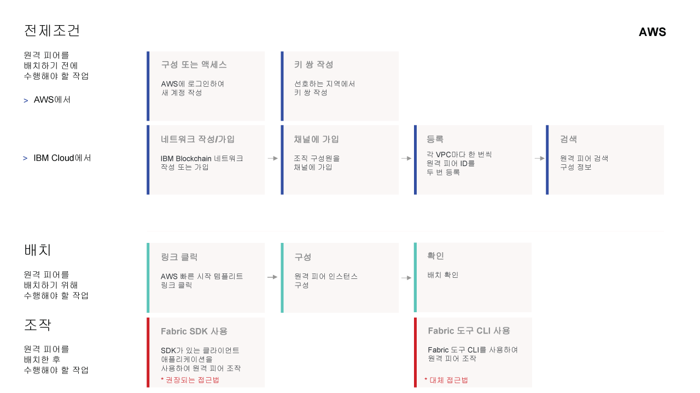

---

copyright:
  years: 2017, 2019
lastupdated: "2019-05-16"

keywords: IBM Blockchain Platform, remote peer, multi-cloud, private data, AWS Cloud

subcollection: blockchain

---

{:new_window: target="_blank"}
{:shortdesc: .shortdesc}
{:screen: .screen}
{:codeblock: .codeblock}
{:note: .note}
{:important: .important}
{:tip: .tip}
{:pre: .pre}

# {{site.data.keyword.blockchainfull_notm}} Platform for Amazon Web Services 정보
{: #remote-peer-aws-about}

**참고** {{site.data.keyword.blockchainfull}} Platform Remote Peer on {{site.data.keyword.cloud_notm}} Private(베타) 프로그램은 종료되었습니다. {{site.data.keyword.cloud_notm}} Private 환경에서 피어를 계속 실행하려면 **{{site.data.keyword.blockchainfull_notm}} Platform for {{site.data.keyword.cloud_notm}} Private** 오퍼링을 대신 사용하십시오. 자세한 정보는 [{{site.data.keyword.cloud_notm}} Private의 피어 정보](/docs/services/blockchain/ibp-for-icp-about.html#ibp-icp-about-peer)를 참조하십시오.

{{site.data.keyword.cloud_notm}}에서 기존 블록체인 네트워크에 연결한 후 AWS Cloud에서 {{site.data.keyword.blockchainfull_notm}} Platform 피어를 실행할 수 있습니다. {{site.data.keyword.cloud_notm}} 외부에서 원격 피어를 실행하면 {{site.data.keyword.cloud_notm}} 내부의 기존 네트워크를 활용하면서 블록체인 네트워크에 가입하고 확장할 수 있는 유연성을 제공합니다. AWS 클라우드의 원격 피어는 플랫폼에서 인증 기관(CA)과 순서 지정 서비스를 이용하지만, {{site.data.keyword.cloud_notm}} 외부의 기타 애플리케이션과 피어를 같은 위치에 배치할 수 있습니다.
{:shortdesc}

## 고려사항
{: #remote-peer-aws-about-limitations}

{{site.data.keyword.blockchainfull_notm}} Platform for AWS는 {{site.data.keyword.blockchainfull_notm}} Platform에서 호스팅되는 피어의 전체 기능 또는 지원에 액세스할 권한이 없습니다. {{site.data.keyword.blockchainfull_notm}} Platform for AWS를 실행하기 전에 다음 제한사항을 이해해야 합니다.
- 다른 클라우드 환경에서 실행되는 피어는 {{site.data.keyword.cloud_notm}}에 있는 블록체인 네트워크의 네트워크 모니터에 표시되지 않습니다.
- {{site.data.keyword.blockchainfull_notm}} Platform for AWS는 네트워크 모니터 UI의 Swagger UI를 사용하여 처리할 수 없습니다.
- 사용자가 {{site.data.keyword.blockchainfull_notm}} Platform for AWS 피어 노드의 상태 모니터링, 보안, 로깅 및 리소스 사용량을 관리해야 합니다.
- Fabric v1.1 또는 1.2.1 레벨에 있는 블록체인 네트워크에만 {{site.data.keyword.blockchainfull_notm}} Platform for AWS 피어를 연결할 수 있습니다. 네트워크 모니터에서 [네트워크 환경 설정 창](/docs/services/blockchain/v10_dashboard.html#ibp-dashboard-network-preferences)을 열어서 Fabric 버전을 찾을 수 있습니다.
- {{site.data.keyword.blockchainfull_notm}} Platform for AWS 피어의 데이터베이스 유형은 블록체인 네트워크의 데이터베이스 유형(LevelDB 또는 CouchDB)과 일치해야 합니다.
- CouchDB Fauxton 인터페이스는 AWS 피어에서 사용할 수 없습니다.
- AWS 피어용 [Gossip](/docs/services/blockchain/glossary.html#glossary-gossip)은 현재 지원되지 않습니다. [개인용 데이터 ](https://hyperledger-fabric.readthedocs.io/en/release-1.2/private-data-arch.html "개인용 데이터") 및 [서비스 검색 ](https://hyperledger-fabric.readthedocs.io/en/release-1.2/discovery-overview.html "서비스 검색")과 같은 gossip에 의존하는 Fabric 기능도 지원되지 않음을 의미합니다.

## 전제조건
{: #remote-peer-aws-about-prereq}

{{site.data.keyword.blockchainfull_notm}} Platform for AWS 피어를 사용하려면 {{site.data.keyword.blockchainfull_notm}} Platform의 스타터 플랜 또는 엔터프라이즈 플랜 네트워크 구성원인 조직이 있어야 합니다. {{site.data.keyword.blockchainfull_notm}} Platform for AWS 피어에서는 {{site.data.keyword.blockchainfull_notm}} Platform 네트워크의 순서 지정 서비스, Hyperledger Fabric CA 및 API 엔드포인트를 활용하여 운영합니다. 블록체인 네트워크의 구성원이 아니면 네트워크를 작성하거나 가입해야 합니다. 자세한 정보는 [네트워크 작성](/docs/services/blockchain/get_start.html#getting-started-with-enterprise-plan-create-network) 또는 [네트워크에 가입](/docs/services/blockchain/get_start.html#getting-started-with-enterprise-plan-join-nw)을 참조하십시오.

## 라이센스 및 가격
{: #remote-peer-aws-about-license-pricing}

{{site.data.keyword.blockchainfull_notm}} Platform for AWS는 현재 무료인 Community Edition으로 제공됩니다. 향후 {{site.data.keyword.blockchainfull_notm}} Platform for AWS는 IBM에서 라이센스를 구입해야 하는 BYOL(Bring-Your-Own-License) 모델로 변경될 수 있습니다.

**참고:** AWS 피어를 운영하려면 {{site.data.keyword.blockchainfull_notm}} Platform에서 스타터 플랜 또는 엔터프라이즈 플랜 네트워크에 속한 조직이 있어야 합니다. 즉, 사용자나 네트워크의 다른 구성원이 조직을 위해 {{site.data.keyword.blockchainfull_notm}} [멤버십 요금](/docs/services/blockchain/howto/pricing.html#ibp-pricing-key-elements)을 지불해야 합니다. 요금 지불에 관한 자세한 정보는 [지급 모드](/docs/services/blockchain/howto/paying_mode.html#paying-mode)를 참조하십시오.

## AWS 피어 배치
{: #remote-peer-aws-about-deploy}

AWS [빠른 시작 템플리트](https://aws.amazon.com/quickstart/architecture/ibm-blockchain-platform/ "빠른 시작 템플리트")를 사용하여 {{site.data.keyword.blockchainfull_notm}} Platform for AWS를 쉽게 배치하십시오. 자세한 정보는 [{{site.data.keyword.blockchainfull_notm}} Platform for AWS 빠른 시작 배치 안내서 ](https://s3.amazonaws.com/aws-quickstart/quickstart-ibm-fabric/doc/ibm-blockchain-platform-for-aws.pdf "{{site.data.keyword.blockchainfull_notm}} Platform for AWS 빠른 시작 참조 배치")를 참조하십시오.

{{site.data.keyword.blockchainfull_notm}} Platform for AWS를 배치하는 방법에 대한 지시사항은 [Amazon Web Services에서 피어 배치](/docs/services/blockchain/howto/remote_peer_aws.html#remote-peer-aws)를 참조하십시오.

다음 클릭 가능한 다이어그램에서는 {{site.data.keyword.blockchainfull_notm}} Platform for AWS 피어를 배치하는 프로세스를 설명합니다. 각 단계를 클릭하여 자세한 지시사항을 읽을 수 있습니다.

<map name="home_map1" id="home_map1">
<area href="/docs/services/blockchain/howto/remote_peer_aws.html#remote-peer-aws-account" alt="AWS 구성 또는 액세스" title="구성 또는 액세스" shape="rect" coords="157.05, 52.53, 283.62, 127.11" />
<area href="/docs/services/blockchain/howto/remote_peer_aws.html#remote-peer-aws-account" alt="키 쌍 작성" title="키 쌍 작성" shape="rect" coords="300.97, 52.53, 427.54, 127.11" />
<area href="/docs/services/blockchain/howto/remote_peer_aws.html#remote-peer-aws-prerequisites" alt="네트워크 작성 또는 가입" title="네트워크 작성 또는 가입" shape="rect" coords="157.05, 131.8, 283.62, 206.37" />
<area href="/docs/services/blockchain/howto/remote_peer_operate_aws.html#remote-peer-aws-operate-sdk" alt="채널 가입" title="채널 가입" shape="rect" coords="300.97, 131.8, 427.54, 206.37" />
<area href="/docs/services/blockchain/howto/remote_peer_aws.html#remote-peer-aws-register-peer" alt="피어 ID 등록" title="피어 ID 등록" shape="rect" coords="443.95, 131.8, 570.53, 206.37" />
<area href="/docs/services/blockchain/howto/remote_peer_aws.html#remote-peer-aws-network-endpoints" alt="피어 구성 정보 검색" title="피어 구성 정보 검색" shape="rect" coords="585.53, 131.8, 712.1, 206.37" />
<area href="/docs/services/blockchain/howto/remote_peer_aws.html#remote-peer-aws-launchqs" alt="링크 클릭" title="링크 클릭" shape="rect" coords="157.05, 258.43, 283.62, 333.48" />
<area href="/docs/services/blockchain/howto/remote_peer_aws.html#remote-peer-aws-launchqs" alt="피어 인스턴스 구성" title="피어 인스턴스 구성" shape="rect" coords="300.97, 258.43, 427.54, 333.48" />
<area href="/docs/services/blockchain/howto/remote_peer_aws.html#remote-peer-aws-test" alt="배치 확인" title="배치 확인" shape="rect" coords="443.95, 258.43, 570.53, 333.48" />
<area href="/docs/services/blockchain/howto/remote_peer_operate_aws.html#remote-peer-aws-operate-sdk" alt="Fabric SDK 사용" title="Fabric SDK 사용" shape="rect" coords="157.05, 338.64, 283.62, 413" />
<area href="/docs/services/blockchain/howto/remote_peer_operate_aws.html#remote-peer-aws-operate-cli-operate" alt="Fabric 도구 CLI 사용" title="Fabric 도구 CLI 사용" shape="rect" coords="443.95, 338.64, 570.53, 413" />
</map>

*그림 1. AWS에서 {{site.data.keyword.blockchainfull_notm}} Platform for AWS 배치 플로우*

## AWS 피어 운영
{: #remote-peer-aws-about-operate-remote-peer}

AWS 피어를 배치한 다음 여러 작업 단계를 완료해야 피어에서 네트워크에 트랜잭션을 제출할 수 있습니다. 이 작업 단계에는 채널에 조직을 추가하고 피어가 채널에 가입하며 피어에 체인코드를 설치하고 채널에서 체인코드를 인스턴스화하며 애플리케이션을 피어에 연결하는 단계가 포함됩니다. 자세한 정보는 [Amazon Web Service에서 피어 운영](/docs/services/blockchain/howto/remote_peer_operate_aws.html#remote-peer-aws-operate)을 참조하십시오.

## 데이터 상주
{: #remote-peer-aws-about-data-residency}

블록체인 네트워크는 처리되는 데이터 유형을 감지하지 못하기 때문에 특정 종류의 데이터를 보호하기 위해 때로는 추가 단계를 수행해야 합니다. 데이터 상주의 가장 일반적인 요구사항은 특정 국가의 법률과 관련되어 있습니다. 해당 법률에 따르면 IT 시스템에서 처리하고 저장하는 모든 데이터는 특정 국가 내에 유지해야 합니다. 마찬가지로 정부, 보건, 금융 서비스와 같이 고도로 규제된 일부 업계에서는 데이터를 완전히 방화벽 뒤에 보관해야 합니다. 따라서 데이터 상주를 수행하려면 블록체인 네트워크의 모든 컴포넌트가 동일한 [채널](/docs/services/blockchain/glossary.html#glossary-channel)의 일부여야 하며 한 국가 내에 있어야 합니다.

데이터 상주 요구사항을 처리하려면 {{site.data.keyword.blockchainfull_notm}} Platform의 기초가 되는 Hyperledger Fabric 아키텍처를 이해하는 것이 중요합니다. 아키텍처는 인증 기관(CA), 순서 지정자 및 피어의 세 가지 핵심 요소를 중심으로 구성됩니다. 피어에서 순서 지정 서비스에서 순서 지정된 상태 업데이트를 블록의 양식으로 받고 해당 상태와 원장을 유지보수합니다. 따라서 피어와 순서 지정자는 직접적인 관계가 있습니다. 원장에는 트랜잭션 로그에 포함된 모든 키와 데이터의 최신 값이 들어 있습니다.

또한 클라이언트 애플리케이션에서는 [Fabric SDK](/docs/services/blockchain/v10_application.html#dev-app-fabric-sdks)를 사용하여 트랜잭션을 피어와 순서 지정 서비스에 보냅니다. 이러한 트랜잭션에는 원장에 키-값 쌍을 포함하는 [읽기-쓰기 시맨틱 ](https://hyperledger-fabric.readthedocs.io/en/release-1.2/readwrite.html "읽기-쓰기 세트 시맨틱") 데이터가 포함됩니다.

비즈니스에서 국가 내 데이터 상주가 요구사항이면 순서 지정자, 피어 및 클라이언트 애플리케이션도 같은 국가에 있어야 합니다. {{site.data.keyword.blockchainfull_notm}} Platform 네트워크가 {{site.data.keyword.cloud_notm}}에 작성되면 네트워크의 위치를 선택할 수 있습니다. <!--For a Starter Plan network, you can select from US South, United Kingdom, and Sydney. For an Enterprise Plan network, you can select from currently available locations, which include Dallas, Frankfurt, London, Sao Paulo, Tokyo, and Toronto. -->지역과 위치에 관한 자세한 정보는 [{{site.data.keyword.blockchainfull_notm}} Platform 지역 및 위치](/docs/services/blockchain/reference/ibp_regions.html#ibp-regions-locations)를 참조하십시오. 해당 국가 중 하나에서 데이터 상주를 수행하려면 피어가 {{site.data.keyword.blockchainfull_notm}} Platform 네트워크 위치와 동일한 국가에 있어야 합니다.

### 데이터 상주에 대한 유스 케이스
{: #remote-peer-aws-about-data-res-use-case}

4개 조직으로 구성된 컨소시엄과 함께 순서 지정자 및 인증 기관을 포함하는 {{site.data.keyword.blockchainfull_notm}} Platform 네트워크를 고려하십시오. 조직에는 하나 이상의 피어 노드가 있습니다. 모든 네 개의 조직은 단일 채널의 일부이며 네트워크의 모든 컴포넌트는 {{site.data.keyword.blockchainfull_notm}} Platform 네트워크가 배치된 지역(예: 프랑크푸르트)에 상주합니다. 마지막으로 피어와 상호작용하는 클라이언트 애플리케이션도 독일 내에 상주합니다. 데이터 상주는 유지보수됩니다.  

  
*그림 3. 모든 컴포넌트가 동일한 국가에 있는 경우 데이터 상주*

이제 **피어**가 조직 중 하나에 가입할 때의 시사점을 고려해 보겠습니다.  피어는 나머지 네트워크와 같은 영역 또는 {{site.data.keyword.blockchainfull_notm}} Platform 네트워크 영역 외부의 모든 곳에 상주할 수 있습니다.

-	피어가 나머지 네트워크와 같은 국가에 상주하는 경우 데이터 상주는 유지보수됩니다. 모든 원장 데이터는 위의 **그림 3**에서와 같이 독일 내에 유지됩니다.
-	피어가 다른 국가(예를 들어, 미국과 같은)에 상주하는 경우 피어 원장의 데이터가 국경 밖에서 공유되기 때문에 데이터 상주가 더 이상 유지보수되지 않습니다.

이 문제점을 해결하려면 **채널**을 사용하여 네트워크의 피어 서브세트로 데이터를 분리할 수 있습니다. {{site.data.keyword.blockchainfull_notm}} Platform 네트워크에 국경을 넘어 피어와 순서 지정자가 포함되면 채널은 국경 밖에 있는 조직에서 원장 데이터를 격리합니다.  

**참고:** 순서 지정자는 항상 네트워크를 호스팅하기 위해 선택한 데이터 센터에 있습니다. 복수의 순서 지정자가 국경을 넘어 존재할 수 없습니다. 그러나 피어는 {{site.data.keyword.cloud_notm}} 외부의 원격 위치나 데이터 센터에 있을 수 있습니다.

  
*그림 4. 피어가 {{site.data.keyword.blockchainfull_notm}} Platform 지역의 국가 외부에 상주하는 데이터 상주*

**그림 4**에서 `OrgC` 및 `OrgD`에는 데이터 상주가 필요하지 않습니다. 실제로, `OrgD`에는 이제 *미국*에 상주하는 두 개의 피어(`OrgD-peer1`과 `OrgD-peer2`)가 포함됩니다. 따라서 `OrgA`, `OrgB` 및 독일에 상주하는 각 해당 클라이언트와 피어가 채널 `X`의 원장 데이터를 격리하기 위해 채널 `OrgC` 및 `OrgD`용으로 새 채널 `Y`가 작성됩니다.

{{site.data.keyword.blockchainfull_notm}} Platform 네트워크의 데이터 플로우에 대해 더 자세히 알아보려면 [트랜잭션 플로우에 대한 Fabric 문서](https://hyperledger-fabric.readthedocs.io/en/release-1.2/txflow.html "트랜잭션 플로우")를 참조하십시오.

향후 Hyperledger Fabric의 새 기술에서는 [개인 데이터 콜렉션](https://hyperledger-fabric.readthedocs.io/en/release-1.2/private-data/private-data.html "개인 데이터 콜렉션") 및 Zero Knowledge Proof를 사용하여 추가 데이터 상주를 수행하는 기능을 향상시킬 것입니다.

- 개인용 데이터 콜렉션을 사용하면 인증된 피어(예: 한 국가에 있는 피어)만 볼 수 있도록 개인용 데이터를 피어 투 피어로 공유할 수 있습니다(gossip 프로토콜 사용). 데이터는 피어의 개인 데이터베이스에 저장됩니다.  순서 지정 서비스는 여기에 관련되지 않으며 개인용 데이터를 볼 수 없습니다. 해당 데이터의 해시가 채널에 있는 모든 피어의 원장에 기록됩니다. 상태 유효성 검증에 사용된 해시는 트랜잭션의 증거로 사용되며 감사 용도로 사용할 수 있습니다. 개인용 데이터는 Fabric 버전 1.2.1에서 실행되는 {{site.data.keyword.blockchainfull_notm}} Platform의 네트워크에 사용 가능합니다. 그러나 개인용 데이터 특성은 원격 피어에서 사용할 수 없습니다.

- ZKP(Zero-Knowledge Proof)를 사용하면 “승인자”가 시크릿 자체를 노출하지 않고 시크릿을 알고 있음을 “확인자”에게 보증할 수 있습니다. 이 방식을 사용하면 알고 있는 내용을 표시하지 않고도 규정이 충족됨을 알고 있다고 표시할 수 있습니다.

이 기술에 관한 자세한 정보는 [Hyperledger Fabric을 사용한 개인 및 기밀 트랜잭션 ](https://developer.ibm.com/tutorials/cl-blockchain-private-confidential-transactions-hyperledger-fabric-zero-knowledge-proof/ "Hyperledger Fabric을 사용한 개인 및 기밀 트랜잭션")에서 얻을 수 있습니다.

## 지원 받기
{: #remote-peer-aws-about-support}

{{site.data.keyword.blockchainfull_notm}} Platform에서는 이 오퍼링에 대한 지원을 제공하지 않습니다. 피어와 관련된 문제가 발생하면 무료 블록체인 개발자 리소스 및 지원 포럼을 사용하여 {{site.data.keyword.IBM_notm}}과 Fabric 커뮤니티에서 도움을 받을 수 있습니다. 자세한 정보는 [블록체인 리소스 및 지원 포럼](/docs/services/blockchain/ibmblockchain_support.html#blockchain-support-resources)을 참조하십시오. 네트워크 모니터의 **도움말** 화면에서 지원 리소스도 볼 수 있습니다.

- AWS와 관련된 문제는 [커뮤니티 지원 포럼 ](https://forums.aws.amazon.com/index.jspa "AWS 커뮤니티 지원 포럼") 및 [AWS 프리미엄 지원 ](https://aws.amazon.com/premiumsupport/ "AWS 프리미엄 지원") 모두 사용할 수 있습니다.

{{site.data.keyword.blockchainfull_notm}}은 {{site.data.keyword.cloud_notm}}에 열린 케이스 및 {{site.data.keyword.blockchainfull_notm}} Platform for AWS와 관련된 케이스는 지원하지 않습니다. Community Edition은 탐색, 개발 및 테스트용이며 프로덕션에 사용하지 마십시오.
