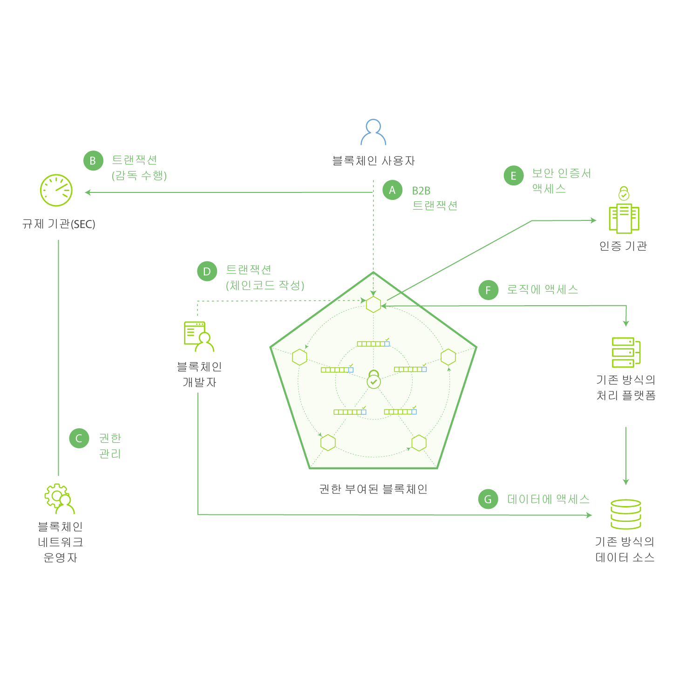

---

copyright:
  years: 2016, 2017
lastupdated: "2017-07-28"
---

{:new_window: target="_blank"}
{:shortdesc: .shortdesc}
{:codeblock: .codeblock}
{:screen: .screen}
{:pre: .pre}

# 블록체인 기본
{: #ibmblockchain_overview}

블록체인은 차세대 트랜잭션 애플리케이을 위한 새로운 레벨의 신뢰, 책임성 및 투명성을 확립하여 비즈니스 프로세스를 능률화하는 분산 원장 기술(DLT)입니다. 블록체인 네트워크는 비트코인 교환을 위해 시장에 처음 도입되었지만, 실제 사용은 암호화된 화폐 트랜잭션을 넘어서까지 확장됩니다. Linux Foundation의 Hyperledger 프로젝트와 결합하여 {{site.data.keyword.blockchainfull}}은 가장 기본적인 비즈니스 교환의 이미지를 재생성하고, 디지털 상호작용의 새로운 세상으로 향하는 문을 열어줍니다. 

{{site.data.keyword.blockchain}}은 중앙화된 제어 지점에 의존하지 않고도 가상으로 값의 모든 것을 추적하고 거래할 수 있는 효율적이고 매우 안전한 네트워크의 작성을 통해 교차 엔터프라이즈 트랜잭션의 비용 및 복잡도를 줄여줍니다. 금융 세계에서 블록체인 네트워크는 수 일이 아닌 수 분 만에 보안 거래가 정립될 수 있도록 허용합니다. 무역 세계에서는 이러한 네트워크가 공급 체인 관리를 용이하게 하고 상품 및 지불의 흐름을 실시간으로 추적하고 로깅하도록 할 수 있습니다.  

## 블록체인 네트워크 개요

{{site.data.keyword.blockchain}} 네트워크에서는 네트워크 트랜잭션의 레코드가 네트워크 멤버의 서브세트 또는 모두에서 복제된 공유 원장에 보유됩니다(원장은 채널의 범위에 존재하므로 멤버의 피어가 채널을 구독하지 않는 경우에는 원장에 그 채널의 트랜잭션이 없게 됩니다). 모든 트랜잭션의 레코드는 올바르거나 올바르지 않거나 모두 블록에 기록되며 각 채널에 대한 해시 체인(즉, 블록체인)에 추가됩니다. 올바른 트랜잭션은 세계 상태 데이터베이스를 업데이트하는 반면에 올바르지 않은 트랜잭션은 업데이트하지 않습니다. 체인코드("스마트 계약"이라고도 함)는 원장에 대해 작성될 읽기 및 쓰기를 허용하는 기능 세트를 포함하는 소프트웨어의 부분입니다. 클라이언트 측 애플리케이션은 SDK를 활용하여 피어와 접속하고, 결국에는 특정 체인코드에 대한 함수를 호출합니다. 체인코드에 읽기 또는 쓰기를 허용하는 두 개의 주요 Fabric API(`getState` & `putState`)가 있습니다.

**그림 1**은 분배, 분산된 피어 투 피어 아키텍처 및 사용자 역할과 권한을 관리하는 인증 기관을 특징으로 하는 권한 부여된 블록체인 네트워크의 예를 보여줍니다.

*그림 1. 권한 부여된 블록체인 네트워크: 데이터 플로우 및 네트워크 액세스가 멤버 역할에 의해 통제됨*

다음 설명은 그림 1에 표시된 아키텍처 및 플로우에 해당합니다(참고: 이는 순차 프로세스를 나타내지 않음). 

**A:** 블록체인 사용자가 블록체인 네트워크에 트랜잭션을 제출합니다. 트랜잭션은 배치, 호출 또는 조회될 수 있으며, REST API를 통해 직접 또는 SDK를 레버리징하는 클라이언트 측 애플리케이션을 통해 발행됩니다.   

**B:** 신뢰 비즈니스 네트워크는 규제 기관 및 감사자(예: 미국 주식시장의 SEC)에 액세스 권한을 제공합니다.   

**C:** 블록체인 네트워크 운영자는 멤버 권한을 관리합니다(예: 규제 기관(B)을 "감사자"로 등록접수하고 블록체인 사용자(A)를 "클라이언트"로 등록접수함). 감사자는 원장 조회로만 제한될 수 있는 반면에 클라이언트에는 특정 유형의 체인코드를 배치, 호출하고 조회하는 권한이 부여될 수 있습니다.  

**D:** 블록체인 개발자는 체인코드 및 클라이언트 측 애플리케이션을 작성합니다. 블록체인 개발자는 REST 인터페이스를 통해 네트워크에 직접 체인코드를 배치할 수 있습니다. 체인코드에서 기존 방식의 데이터 소스의 신임 정보를 포함하기 위해 개발자는 외부(out-of-band) 연결을 사용하여 데이터(G)에 액세스할 수 있습니다.  

**E:** 블록체인 사용자가 피어 노드(A)를 통해 네트워크에 연결합니다. 트랜잭션을 처리하기 전에, 노드는 인증 기관으로부터 사용자의 등록접수 및 트랜잭션 인증서를 검색합니다. 권한 부여된 네트워크에서 거래하려면 사용자에게 이러한 디지털 인증서가 있어야 합니다. 

**F:** 체인코드 드라이브를 시도하는 사용자는 기존 방식의 데이터 소스(G)에서 자신의 신임 정보를 확인해야 할 수 있습니다. 사용자의 권한을 확인하기 위해 체인코드는 기존 방식의 처리 플랫폼을 통해 이 데이터에 대한 외부(out-of-band) 연결을 사용할 수 있습니다. 
