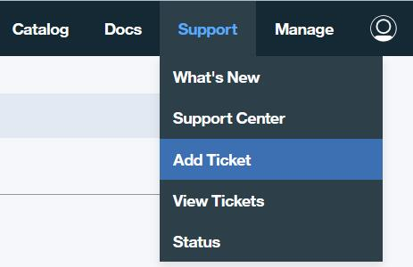

---

copyright:
  years: 2017
lastupdated: "2017-11-17"
---

{:new_window: target="_blank"}
{:shortdesc: .shortdesc}
{:codeblock: .codeblock}
{:screen: .screen}
{:pre: .pre}

# 지원 받기
{: #ibmblockchain_support}

지원을 얻고 {{site.data.keyword.Bluemix}}의 블록체인 인스턴스와 연관된 문제점을 해결하는 데 사용할 수 있는 몇 가지 메커니즘이 있습니다.
{:shortdesc}

## 결함이 아닌 문제

**그림 1**에 표시된 대로 **네트워크 모니터**에서 "지원" 화면으로 이동하십시오. 기술 및 지원 정보를 제공하는 리소스에 대한 링크를 찾을 수 있습니다. "지원" 화면에 대한 자세한 설명은 [네트워크 모니터](v10_dashboard.html)에서 *지원* 섹션을 참조하십시오. 

*그림 1. 지원 화면*

## 소프트웨어 결함 문제

소프트웨어 결함의 경우 또는 위의 방법으로 문제점을 해결할 수 없는 경우, {{site.data.keyword.Bluemix_notm}} 지원으로 답변을 찾을 수 있습니다. **그림 2**에 표시된 대로 {{site.data.keyword.Bluemix_notm}} 콘솔의 오른쪽 상단 구석에 있는 **지원** 링크를 클릭하십시오. 자세한 정보는 [문제점 해결](../../troubleshoot/troubleshoot.html){:new_window}을 참조하십시오.

*그림 2. 지원 링크*

문제점을 여전히 해결할 수 없는 경우, 다음 단계를 따라서 지원 요청 티켓을 제출하십시오.

1. 그림 2에 표시된 대로 {{site.data.keyword.Bluemix_notm}} 콘솔의 오른쪽 상단 구석에 있는 **지원** 링크를 클릭하십시오.
2. 그림 3에 표시된 대로 드롭 다운 목록에서 **티켓 추가** 링크를 클릭하십시오.   
    
  *그림 3. 티켓 추가*  
3. "지원" 패널에서 지원 카테고리를 선택하십시오.
4. 문제점의 제목 및 간략한 설명을 입력하십시오. 선택사항으로 첨부 파일을 업로드하고 알림을 받을 다른 이메일 주소를 추가할 수 있습니다. 질문에 키워드 **blockchain**을 포함하십시오.
5. **제출** 단추를 클릭하십시오. 몇 분 후 요청에 대해 열린 서비스 티켓에 대한 이메일 알림을 수신하게 됩니다. 문제점에 대한 추가 커뮤니케이션을 위해 이메일의 지시사항을 따르십시오.
