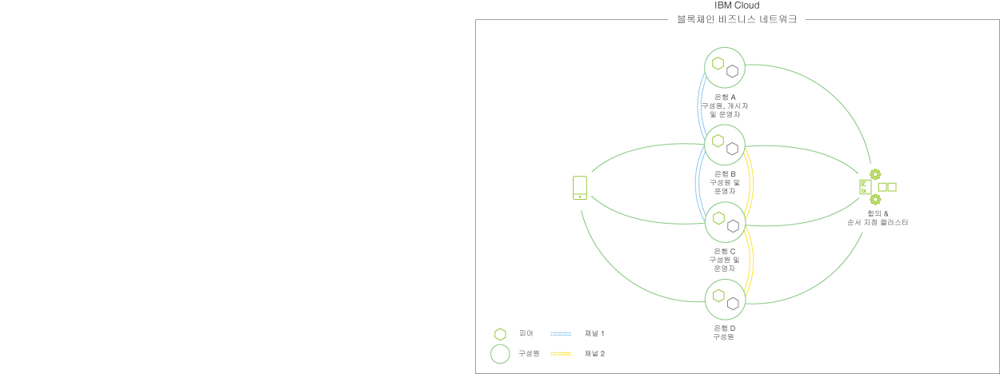

---

copyright:
  years: 2017
lastupdated: "2017-08-24"

---

{:new_window: target="_blank"}
{:shortdesc: .shortdesc}
{:screen: .screen}
{:codeblock: .codeblock}
{:pre: .pre}

# {{site.data.keyword.blockchainfull_notm}} Platform

**주의:** {{site.data.keyword.blockchainfull}} 오퍼링을 사용하기 전에 [면책사항](needtoknow.html) 섹션의 기술 및 지원 정보를 읽으십시오.  
{:shortdesc}

{{site.data.keyword.blockchainfull_notm}} Platform은 다중 조직 블록체인 네트워크의 전체 라이프사이클(**개발**, **통제**, **운영**)을 다루는 유일한 통합 비즈니스 준비 플랫폼입니다. 가장 요구가 많은 유스 케이스와 규제 산업에 대해서도 성능과 보안으로 "비즈니스를 위해 빌드"된 글로벌 블록체인 네트워크의 작성을 각 단계의 협업을 통해 가속화하도록 설계되었습니다.  {{site.data.keyword.blockchainfull_notm}} 오퍼링은 사용자의 비즈니스 요구사항을 충족하기 위한 엔터프라이즈 레벨의 보안, 데이터 무결성, 확장성 및 성능을 얻기 위해 모듈 아키텍처를 활용하는 Hyperledger Fabric V1.0 코드 베이스에서 빌드되었습니다.  

{{site.data.keyword.blockchainfull_notm}} 네트워크에서 기본 활동 및 역할을 살펴보고 네트워크 라이프사이클에 적합하게 하는 방법을 함께 알아봅니다. 

**참고**: 아래 표는 선형 진행 과정을 나타내는 것은 아닙니다. 애플리케이션과 멤버십이 진화함에 따라 개발 및 네트워크 관리와 같은 태스크가 반복적으로 발생하게 됩니다.

|  기능     | 활동       | 역할  |
| ------------------------- |--------------------------|-----|
| [개발 ](https://developer.ibm.com/blockchain/sandbox/) | 애플리케이션 개발, 체인코드 개발 | 애플리케이션 개발자 |
| [통제](get_start.html)| 멤버 초대, 신임 정보 생성, 통제 모델 제안, 새 멤버 가입, 인증서 & 엔드포인트 정보 보급| 네트워크 운영자, 네트워크 멤버 |
| [운영](v10_dashboard.html)| 상태 & 활동 모니터, 새 배치 관리, 멤버 관리(추가/제거), 체인코드 라이프사이클 관리, 채널 관리, 지원 | 네트워크 운영자, 네트워크 참가자 |
  
이제 이러한 역할 및 활동에 대해 더 자세히 살펴봅니다.

## 네트워크 **개발**
다음을 수행하기 위해 400개 이상의 클라이언트가 관련되어 연마된 우수 사례를 활용하여 블록체인 개발을 탐색하고 가속화하십시오. 
* 블록체인 애플리케이션 개발 시간을 현저하게 줄이는 기술로 비즈니스 전체에서 긴밀한 협력이 가능하도록 합니다(그렇지 않으면 개발에 6주가 소요될 애플리케이션을 2일 미만에 작성할 수 있음).
* {{site.data.keyword.blockchainfull_notm}} 개발자 도구를 활용하여 프로그래머의 기존 작업목록 내에서 블록체인 스킬을 신속하게 빌드합니다. 
* 개방되고 현대적인 도구 세트가 있는 선호하는 환경에서 학습하고 개발하기 위한 유연성을 개발자에게 제공합니다.  
  
비즈니스 소유자로서 {{site.data.keyword.blockchainfull_notm}} Garage에서 함께 제공되는 IBM의 많은 산업 및 블록체인 전문가의 도움으로 유스 케이스를 개발하여 IBM Blockchain Platform의 강력한 힘을 동력으로 이용할 수 있습니다. 

개발자로서 비즈니스 요구사항을 빠르고 쉽게 조절하고, 프로그래머를 블록체인 개발자로 전환하는 대화식 플레이그라운드 및 클라우드 샌드박스를 사용하여 무료로 블록체인 애플리케이션 개발을 가속화할 수 있습니다. 이러한 도구는 선호하는 환경에서 비즈니스 규칙을 코드로 바꾸도록 설계되었습니다. 
* **온라인 탐색**  
  주요 블록체인 개념을 학습하고 네트워크 정의를 작성하며 재사용가능 산업 모델 및 스마트 계약 라이브러리를 활용하기 위한 오픈 소스 개발 도구인 [Hyperledger Composer ](https://hyperledger.github.io/composer/introduction/introduction.html)을 활용하십시오. 
* **로컬로 설치**  
  비즈니스 네트워크를 빌드하기 위한 오픈 소스 프레임워크인 Hyperledger Fabric 및 Composer의 IBM 인증 이미지를 활용하여 사용자의 랩탑에서 직접 개발하고 테스트하십시오.
* **클라우드 환경에서 협업**  
  코드를 개발해서 다른 사용자와 공유하기 위한 무료 및 유료 옵션입니다.
  
비즈니스 네트워크를 개발했으면 이 [레시피 ](https://ibm-blockchain.github.io/platform-deployment/)으로 IBM Blockchain Platform에서 실행 중인 라이브 네트워크에 배치할 수 있습니다.

## 네트워크 **통제**
네트워크의 백엔드 환경을 작성하기 위한 두 가지 옵션이 있습니다. 첫 번째로, Composer 라이브러리 구현 옵션을 제공하는 공개된 Hyperledger Docker 이미지를 사용하여 애플리케이션을 빌드하고 네트워크와 상호작용할 수 있습니다. 또는 기본적으로 체인코드를 작성하고 서버 측 코드를 개발하여 트랜잭션를 구동할 수 있습니다. 로컬에서 실행하는 것이 네트워크 구성을 고치고, 잠재적 유스 케이스를 탐색하며 개념 증명 빌드를 시작할 수 있는 완벽한 기회입니다. PoC가 시작되어 모양을 갖추면 클라우드에서 네트워크를 호스팅하여 구현을 확장할 수 있게 됩니다. 

클라우드 배치를 통해 Kubernetes에서 실행 중인 Hyperledger Fabric 네트워크의 배치를 용이하게 하고 사용하기 쉬운 레시피 및 스크립트의 콜렉션이 제공됩니다. 이 단계를 사용하여 호스팅하는 환경에서 PoC의 동작 및 안정성을 조사하십시오. [{{site.data.keyword.blockchainfull_notm}} 컨테이너 서비스 ](https://ibm-blockchain.github.io/)은 애플리케이션의 기능성 및 복원성을 위한 테스트 메커니즘 및 엔터프라이즈 플랜에 대한 자연스러운 전조로서 대부분 간주될 수 있습니다. 

네트워크가 생긴 후에 {{site.data.keyword.blockchainfull_notm}}은 멤버에게 제어를 제공하는 네트워크 관리 경험을 생성하도록 설계되었으며, 반면에 전체 제어에는 멤버가 하나도 없습니다. {{site.data.keyword.blockchainfull_notm}} Platform에는 사용자 정의할 수있는 정책을 통해 팀이 네트워크의 변경 관리를 적용하도록 허용하는 통합 도구의 첫 번째 세트가 있습니다. 

다음 목록은 이 통제 모델의 주요 기능을 보여줍니다.

* 집합적 관리를 허용하는 민주적인 관리 도구.
* 네트워크에 대한 변경사항을 통제하는 유연하고, 민주적인 정책을 정의하기 위한 정책 편집기.
* 더 빠른 온보딩, 사용자 정의 및 활성화를 사용 가능하게 하는 사전 빌드된 도구 및 정책.
* 통합된 알림, 멤버 활동 패널 및 보안 서명 콜렉션이 있는 멀티 파티 워크플로우 도구.

## 네트워크 **작동**
프로덕션 준비 보안 서비스로 분산된 네트워크를 배치하고 운영하십시오. 작게 시작해서 다음 기능을 활용하여 멤버십 및 트랜잭션 볼륨 증가에 따라 네트워크를 탄력적으로 확장하십시오. 

* 많은 하드웨어, 펌웨어 및 소프트웨어 보안 기능이 있는 초고도의 보안 환경.
* 확장성, 복원성 및 가용성을 위해 강화된 아키텍처.
* 성능을 위해 최적화되어 있으며 세계에서 가장 빠른 Linux 컴퓨팅에서 실행.
  
{{site.data.keyword.blockchainfull_notm}} Platform에서 네트워크 운영하기에는 관리 태스크를 단순화하기 위한 도구 및 기능이 포함됩니다. 

* 네트워크에서 리소스 관리 및 모니터링용 대시보드. 
* 전체 코드 스택의 완벽한 업그레이드를 위한 라이프사이클 관리.
* 포털에 통합된 24/7 기술 지원.
* 권한 부여 없는 액세스, 악성코드 및 변조 저항, 100% 암호화 및 규제 산업의 민감한 데이터가 있는 네트워크에 대한 더 많은 기능으로 강화된 보안 스택.

## 블록체인 네트워크에 참여 

블록체인 네트워크와 상호작용하는 조직, 개인, 애플리케이션 또는 디바이스에 대한 가장 폭넓은 분류로 **참가자**라는 용어를 사용합니다. "참가자" 개념 아래에는 두 개의 그룹(**멤버** 및 **사용자**)이 뚜렷하게 구분됩니다.   
 
간단히 말해서, 멤버는 유효한 디지털 서명을 소유하며, 이는 그 멤버가 블록체인 네트워크 내에서 트랜잭션을 실행 및/또는 유효성 검증을 하도록 허용합니다. 사용자에게는 인증서가 없지만, 기존 네트워크 멤버 중 하나를 통해 블록체인 네트워크와 계속 상호작용할 수 있습니다. 멤버의 인증서를 피트니스 클럽에 대한 "멤버십 카드"로 생각할 수 있습니다. 그리고 사용자에게 그러한 멤버십 카드가 없을 수 있지만, 기존 멤버의 "게스트"로 피트니스 클럽에 입장할 수 있습니다. 이러한 역할을 좀 더 자세하게 살펴봅니다. 

### 멤버 

{{site.data.keyword.blockchainfull_notm}} Platform은 "권한 부여된 블록체인" 기술인 Hyperledger Fabric을 기반으로 합니다. 따라서, 모든 멤버는 서비스 **제공자**(예: 인증서 발행, 트랜잭션 유효성 검증/순서 지정) 또는 **이용자**(예: 트랜잭션 실행)로서 네트워크를 사용하도록 권한을 부여하는 인증서로 네트워크에 등록접수됩니다.   

- **제공자 - 멤버 내, 신뢰** - 블록체인 네트워크는 그 멤버에 의해 강화됩니다. 블록체인 네트워크를 가동하려면 트랜잭션 유효성 검증, 트랜잭션 서비스 지정 및 인증서 관리 서비스를 포함하는 기본 블록체인 서비스를 *제공하는* 최소 세트의 멤버가 있어야 합니다. 이러한 서비스를 실행하여 해당 멤버는 블록체인 네트워크의 중심점에서 공유 원장 무결성의 유지보수 담당자가 됩니다. 따라서 사용자는 블록체인을 가동하려면 얼마나 많은 멤버가 필요한지 질문합니다. 답변은 네트워크의 신뢰 요구사항에 따라 다릅니다. 일부 네트워크는 제공자로서 역할을 하는 멤버를 덜 필요로 하는 더욱 중앙화된 신뢰 모델을 허용합니다. 다른 네트워크는 더 다양한 멤버 세트(즉, 법적으로 별도 엔티티)를 필요로 하며 더 분산된 신뢰 모델을 유지보수합니다. 더 중앙화된 신뢰 모델의 예는 제공하는 멤버가 글로벌 유통업체, 글로벌 해운회사 및 IBM인 공급 체인 표시 네트워크가 됩니다. 이 경우, 이 세 가지 멤버는 네트워크에 대한 "신뢰의 기반"으로 작동하게 되며, 블록체인 네트워크의 기본 서비스를 제공합니다. 이러한 멤버는 인증서 가져오기 프로그램, 내보내기 프로그램, 사용자 정의 에이전트, 유통업체 등을 발행할 수 있어서 네트워크에 참가(트랜잭션 실행)할 수 있습니다. 이 네트워크는 더 많은 멤버가 기본 서비스 제공에 참가할 수 있게 하여 신뢰를 분산할 수 있으며, 그에 따라 모든 멤버에게 제어 권한이 있지만 독점 제어 권한이 있는 멤버는 하나도 없습니다. 일반적인 네트워크에는 기본 블록체인 서비스를 제공하는 멤버 10의 순서가 있게 됩니다.

- **이용자 - 확립된 신뢰, 이제 호출** – 확립된 신뢰를 기반으로 네트워크가 성장할 준비가 되어 있습니다. 네트워크에서 대부분의 멤버가 간단하게 네트워크를 사용하여 분산 원장에 대해 트랜잭션을 호출하는 것은 매우 일반적입니다. 해당 멤버는 단순히 *이용자*이며 네트워크에 기본 서비스를 제공하는 데 참여하지 않습니다. 일반적인 네트워크에는 주어진 블록체인 네트워크 내에서 트랜잭션을 실행하기 위한 권한과 함께 제공하는 멤버 10에서 100의 순서가 있게 됩니다.

#### 멤버 성격
 
비즈니스 네트워크에서 멤버의 역할을 설명하는 성격을 통해 멤버에 대해 생각해보는 것이 때때로 유용합니다. 흔히 사용되는 것은 다음과 같습니다. 
 
- **개시자** – 블록체인 네트워크를 부트스트랩하도록 다른 멤버들에게 선택된 멤버입니다. IBM Blockchain Platform은 IBM Blockchain Platform에 로그인하여 네트워크를 시작하기 위한 태스크를 수행할 단일 멤버를 필요로 합니다. 여기에는 네트워크 이름 지정, 초기 세트 멤버 초대 및 네트워크 오퍼레이션 정책의 기본 세트 설정이 포함됩니다. 이는 임시 역할입니다. 네트워크가 부트스트랩되면 개시자는 특수 권한을 보유할 수 없으며 단순히 멤버의 역할을 재개합니다.   

- **유지보수 담당자** – 하나 이상의 네트워크 피어 & CA를 실행하는 멤버입니다. 이러한 멤버는 블록체인 네트워크에서 트랜잭션을 유효성 검증하는 방법인 합의 프로세스에 참가하여 분산된 원장의 무결성을 유지보수합니다. 유지보수 담당자는 CA의 소유권을 통해 참가자에게 인증서를 발행하고 네트워크에 대한 액세스 권한을 부여하는 기능이 있습니다.  
 
- **운영자** – 트랜잭션 순서 지정 서비스, 인증 기관, 트랜잭션 게이트웨이 및 기타 기본 네트워크 서비스를 포함하여 다른 네트워크 멤버를 대신해 서비스를 실행하는 멤버입니다. 기본적으로 IBM은 IBM Blockchain Platform에 배치된 네트워크의 네트워크 운영자입니다. 
 
- **감사자** – 네트워크에서 감사 기능을 수행하도록 네트워크에서 권한을 부여한 멤버입니다. 감사 기능의 예에는 청구, 준수 추적 또는 분석이 포함됩니다. 감사자 역할은 일반적으로 원장에서 트랜잭션의 더 광범위한 보기 및/또는 트랜잭션 채널에서 더 광범위한 등록접수에 액세스 권한이 있는 멤버로 변환됩니다. 

### 사용자

블록체인 네트워크에 수백 개의 멤버가 있을 수 있는 반면에 사용자는 수천 명이 있을 수 있습니다. 사용자는 기존 멤버에 대한 "신뢰 관계"를 통해 원장에 간접 액세스 권한이 있는 블록체인 네트워크의 참가자입니다. 예를 들면, 일부 모바일 애플리케이션이 해당하는 고유 사용자 인증 및 권한 부여 방식(OAuth, OpenID)을 사용하고, 해당 신임 정보를 블록체인 네트워크에서 하나 이상의 신임 정보가 있는 멤버에게 맵핑하는 것이 일반적입니다. 프록시 또는 게이트웨이 서비스는 일반적으로 이 맵핑 기능을 수행하기 위해 작성되며, 그에 따라서 외부 세계를 블록체인 세계에 맵핑합니다. 

## 기본 네트워크 서비스 

블록체인을 가동하기 위해 멤버들은 하나 이상의 기본 네트워크 서비스를 실행하여 신뢰의 기초를 형성합니다.  

- **순서 지정 서비스** – 트랜잭션 순서 지정 및 동기화  
  본질적으로, 순서 지정 서비스는 네트워크의 정의입니다. 여기에는 각 멤버에 대한 ID 정보, 채널의 정보 및 어느 멤버에게 특정 태스크(예: 다른 멤버 초대, 채널 작성 등) 수행이 허용되는지 지시하는 정책 세트가 포함됩니다. 모든 트랜잭션 및 구성 오퍼레이션이 순서 지정 서비스를 통해 플로우가 이루어지게 되므로 전체 스킴에서 중요한 부분 이상입니다. 순서 지정 서비스의 기본적인 중요성을 고려하면 아마도 하나의 멤버만 문자열을 가져온 권위주의적인 오케스트레이션의 위험을 확인하기 쉽습니다. 이를 저지하기 위해 순서 지정 서비스는 네트워크의 멤버들이 공동으로 관리하며 통제 구현은 함께 실행됩니다. 바꿔 말하면, 의사결정이 전체적으로 이루어지지만 일방적이지는 않습니다. 모든 멤버에게 네트워크에 지분이 있고, 더 나아가 네트워크에서 자신의 입장을 구성하고 사용자 정의하는 오퍼레이션에서 투표권이 있습니다. "민주주의" 및 공동 의사결정의 이러한 개념은 신뢰할 수 있고 분산된 네트워크에 대한 내재된 구성 요소입니다. IBM은 IBM Blockchain Platform에 배치된 네트워크에 대한 순서 지정 서비스의 "운영자" 역할을 합니다. 
 
- **인증 기관** – 참가자에게 인증서 발행  
  간단하게 말하자면, 인증 기관(CA)은 멤버십을 제공합니다. 네트워크의 모든 엔티티(피어, 순서 지정자, 클라이언트 등)에는 통신, 인증 및 궁극적으로는 거래하기 위한 ID가 있어야 합니다. 이러한 "ID"는 x509 인증서(예: 등록접수 인증서)의 형식으로 존재하며, 블록체인 네트워크에서 직접 참가하기 위해 필요합니다. 간접 참가 방법도 있지만 그에 대한 내용은 나중에 다루겠습니다. CA는 ID 증명과 신뢰성을 제공하는 고무 도장으로 간주할 수 있습니다. 각 멤버는 자신의 CA를 소유하고 있으며, 이 CA를 통해서 자신이 완전히 소유한 컴포넌트(피어)에 대해서 뿐만 아니라 써드파티 클라이언트와 애플리케이션에 대해서도 인증서에 서명할 수 있습니다. 멤버의 CA는 특수 펜 또는 공증인 도장에 비유할 수 있습니다. 이 CA가 서명한 인증서는 네트워크에 액세스하기 위한 전제조건입니다.
 
- **피어** – 트랜잭션 유효성 검증/인증  
  피어는 두 가지 기본 기능(트랜잭션 실행/유효성 검증 & 원장 유지보수) 수행을 위해 존재합니다. 피어는 스마트 계약을 실행하며, 트랜잭션 히스토리 및 네트워크의 채널에서 자산의 현재 상태의 소유자입니다. 하루가 끝날 때 피어에 액세스하기(직접 또는 간접) 및 원장에 대해 읽기 및 쓰기 수행하기에 대한 모든 것입니다. 멤버가 네트워크에 대한 일반 사용자 액세스를 제공하면 실제로 피어의 기능성에 대한 액세스를 제공합니다. 

멤버가 {{site.data.keyword.blockchainfull_notm}} Platform을 통해 네트워크에 가입할 때 표준 발행은 피어 및 CA입니다. 프로덕션 네트워크의 경우, 멤버는 가용성을 확보하기 위해 이러한 서비스의 다중 인스턴스를 실행하고자 하게 됩니다. 기본적으로, IBM은 {{site.data.keyword.blockchainfull_notm}} Platform이 작성한 네트워크에 대해 순서 지정 서비스를 실행합니다.  

## {{site.data.keyword.blockchainfull_notm}} Platform

{{site.data.keyword.blockchainfull_notm}} Platform은 인증된 멤버가 자산을 쉽게 정의할 수 있으며 자산 수정 및 교환을 위한 비즈니스 솔루션을 작성할 수 있는 매우 안전하고 권한 부여된 블록체인 네트워크를 제공합니다. 프로덕션 등급 블록체인 네트워크를 부트스트랩하는 것이 더 이상 지루하고 복잡한 프로세스가 아닙니다. {{site.data.keyword.blockchainfull_notm}} Platform을 사용하여 **레코드 시간으로 컨소시엄을 활성 블록체인 네트워크로 구성**하도록 허용하는 오케스트레이션 프레임워크를 활용할 수 있습니다. 다중 기관이 함께 결합해서 통제된 네트워크를 민주적으로 작성하는 것을 단순하게 하도록 설계된 컨소시엄에 익숙한 도구를 제공합니다. 네트워크의 작성, 통제 및 관리 태스크는 기본 제공 대시보드 모니터 및 프로비저닝된 유틸리티를 통해 직관적이고 투명하게 됩니다. 네트워크 작성 및 통제 구현의 번거로운 프로세스에 선행하여, 컨소시엄 멤버는 그 대신 **스마트 계약의 배치 및 자산과 정보의 전송에 초점을 맞출 수 있습니다**.      
{:shortdesc}

네트워크의 필수 컴포넌트(피어, 순서 지정 서비스, 인증 기관, 체인코드)에 대한 **고가용성**은 단일 실패 지점에서 발생할 수 있는 심각한 영향을 제거합니다. 기본 제공 대시보드 모니터를 통해 이러한 컴포넌트를 쉽게 관리할 수 있으며 자산 및 스마트 계약을 시각화하는 강력한 메커니즘을 제공합니다. 

Hyperledger Fabric V1.0 아키텍처의 **모듈화** 및 네트워크 역할의 뚜렷한 분리는 확장성 및 광범위한 유스 케이스에 대한 적응성을 사용 가능하게 하는 인프라를 제공합니다.  

트랜잭션의 라이프사이클 전체에서 발생하는 확인 및 조정을 통해 일관성 있고 충분히 조사된 결과를 얻을 수 있으며, 잘 알려진 가십 프로토콜의 구현을 통해 원장이 지속적으로 동기화된 상태를 유지합니다. ID 및 액세스 제어는 네트워크 전체에서 지속적으로 발생하는 **서명/확인** 오퍼레이션을 통해 쉽게 적용됩니다.   

**통제 도구**는 멤버가 자신의 네트워크에 대한 중요 비즈니스 역할을 관리할 수 있도록 허용하기 위해 제공됩니다. 예를 들어, 새 멤버가 가입하기 위해 네트워크에서 몇 명의 멤버가 동의해야 하는지를 정의하는 정책을 구현하려고 할 수 있습니다. 또는 수정사항을 적용하기 위해 모든 참가자의 인증이 필요한 자산이 있을 수 있습니다. 모든 유형의 비즈니스 네트워크에 대해 통제의 규칙이 근본적으로 필요하며, 종종 매우 자세하게 그에 대해 설명합니다. 통제 도구(예: 정책 편집기)는 이 프로세스를 크게 간소화합니다. 

서비스는 네트워크 컴포넌트에 대한 외부 액세스(루트 액세스 포함) 없이 **보안 수준이 높고 분리된** 환경에서 실행됩니다. 데이터는 진행 중에 암호화되어 저장되며, 하드웨어 보안 지원 모듈은 디지털 키가 산업 규정에 따라 보호되도록 허용합니다. 하드웨어 가상화는 격리된 환경에서 각 노드를 실행하기 위해 사용되며, 그로 인해 네트워크의 다른 노드를 오작동 가능성이 있거나 악성 체인코드가 있는 피어로부터 보호합니다. 고급 암호화 구현 덕분에 해싱, 서명/확인 오퍼레이션 및 컴포넌트 간 통신이 가속화됩니다. 

계속하기 전에 {{site.data.keyword.blockchainfull_notm}} Platform에서 단순 구성을 살펴봅니다. **그림 1**은 네 개의 멤버(각각 두 개의 피어를 소유), 암호 ID 자료 분배를 담당하는 인증 기관 및 정책과 네트워크 참가자를 정의하는 순서 지정 서비스로 구성되는 배치된 블록체인 네트워크의 예를 설명합니다. 파란색 채널에는 모두 네 개의 네트워크 멤버가 포함되어 있으나, 노란색 채널은 세 개의 멤버(은행 B, C, D)로만 제한됩니다. 또한, 은행 A는 네트워크 개시자의 역할을 하며 은행 D는 노란색 채널의 컨텍스트에서 멤버로서만 존재한다는 것을 알 수 있습니다. 마지막으로, 올바르게 서명된 x509 인증서를 소유하고 있는 애플리케이션 또는 일반 사용자는 네트워크에서 피어에 호출을 전송할 수 있습니다. 이전에 언급한 바와 같이, 일반 사용자는 블록체인 네트워크의 존재에 대해서 알지 못하게 된다는 점을 생각할 수 있습니다.

*그림 2. 데이터를 분리하기 위해 채널을 활용하는 4개 멤버로 구성된 블록체인 네트워크 예제*

## {{site.data.keyword.IBM_notm}} 멤버십 오퍼링

다음 표에서는 현재 및 미래 멤버십 옵션을 요약합니다. [엔터프라이즈 플랜](enterprise_plan.html)은 현재 사용 가능한 멤버십 옵션입니다. 

|       | 항목      | [엔터프라이즈](enterprise_plan.html)  | 엔터프라이즈 플러스 | 자체 관리
| ------------------------- |--------------------------|-----|-----|------|
| **포함되는 내용** | 기본 서비스 레벨 | **고급 서비스 레벨, 엔터프라이즈 프로덕션 준비** | 성능 및 격리를 위한 전용 컴퓨팅 | 이 클라우드 서비스에 호스팅하는 네트워크에 연결 + 사용자 자신의 인프라에 설치할 소프트웨어 스택 |
| **청구 정책** | 시간별 요금 | **월별 구독** | 월별 구독 | 월별 구독 |
| **가용성** | 출시 예정 | **지금 사용 가능** | 출시 예정 | 2018년 출시 계획|

{{site.data.keyword.IBM_notm}} [{{site.data.keyword.blockchainfull_notm}} 멤버십 ](https://console.bluemix.net/catalog/services/blockchain?env_id=ibm:yp:us-south&taxonomyNavigation=apps)에 지금 가입하십시오!

## {{site.data.keyword.IBM_notm}} 지원 

{{site.data.keyword.IBM_notm}}에서는 {{site.data.keyword.IBM_notm}} 구현된 {{site.data.keyword.blockchain}} 솔루션에 대한 지원을 제공합니다. {{site.data.keyword.blockchainfull_notm}} 지원에 대한 자세한 정보는 [지원 받기](ibmblockchain_support.html)를 참조하십시오.

모든 Hyperledger Fabric v1.0 기능 및 기능성에 대한 전체 세부사항은
[Hyperledger Fabric 문서 ](http://hyperledger-fabric.readthedocs.io/en/latest/)을 참조하십시오.
