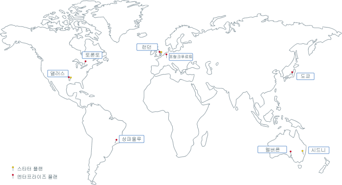

---

copyright:
  years: 2017, 2018
lastupdated: "2019-04-03"

subcollection: blockchain

---

{:new_window: target="_blank"}
{:shortdesc: .shortdesc}
{:screen: .screen}
{:pre: .pre}
{:table: .aria-labeledby="caption"}
{:codeblock: .codeblock}
{:tip: .tip}
{:download: .download}

# {{site.data.keyword.blockchainfull_notm}} Platform 위치
{: #ibp-regions-locations}

{{site.data.keyword.cloud}}는 전 세계의 다양한 위치에서 호스팅됩니다. 위치는 엔드포인트에서 액세스되는 지리적 영역 내의 데이터 센터입니다. {{site.data.keyword.blockchainfull_notm}} Platform은 여러 위치의 {{site.data.keyword.cloud_notm}} 내에 글로벌로 멤버십 플랜을
제공합니다. {{site.data.keyword.cloud_notm}}에서 {{site.data.keyword.blockchainfull_notm}} Platform 서비스 인스턴스를 작성할 때 블록체인 네트워크 및 네트워크 리소스가 사용자가 서비스 인스턴스를 작성하는 {{site.data.keyword.cloud_notm}} 위치에서 작성되고 저장됩니다.
{:shortdesc}

여러 {{site.data.keyword.blockchainfull_notm}} Platform 오퍼링은 서로 다른 {{site.data.keyword.cloud_notm}} 위치에서
사용 가능합니다. {{site.data.keyword.blockchainfull_notm}} Platform 플랜이 사용 가능한 {{site.data.keyword.cloud_notm}} 위치에서만
블록체인 네트워크를 작성할 수 있습니다.

테이블 1과 그림 1에서는 {{site.data.keyword.blockchainfull_notm}} Platform이 지원하는 {{site.data.keyword.cloud_notm}} 지역 및 위치를 보여줍니다.

| 위치 | 스타터 플랜 | 엔터프라이즈 플랜 |
|--------|----------|----------|
| 댈러스 | Y | Y |
| 런던 | Y | Y |
| 도쿄 |  | Y |
| 프랑크푸르트 |  | Y |
| 시드니 | Y |  |
| 멜버른 |  | Y |
| 상파울루 |  | Y |
| 토론토 |  | Y |

_표 1. {{site.data.keyword.blockchainfull_notm}} Platform 위치_

  
_그림 1. {{site.data.keyword.blockchainfull_notm}} Platform 위치_
