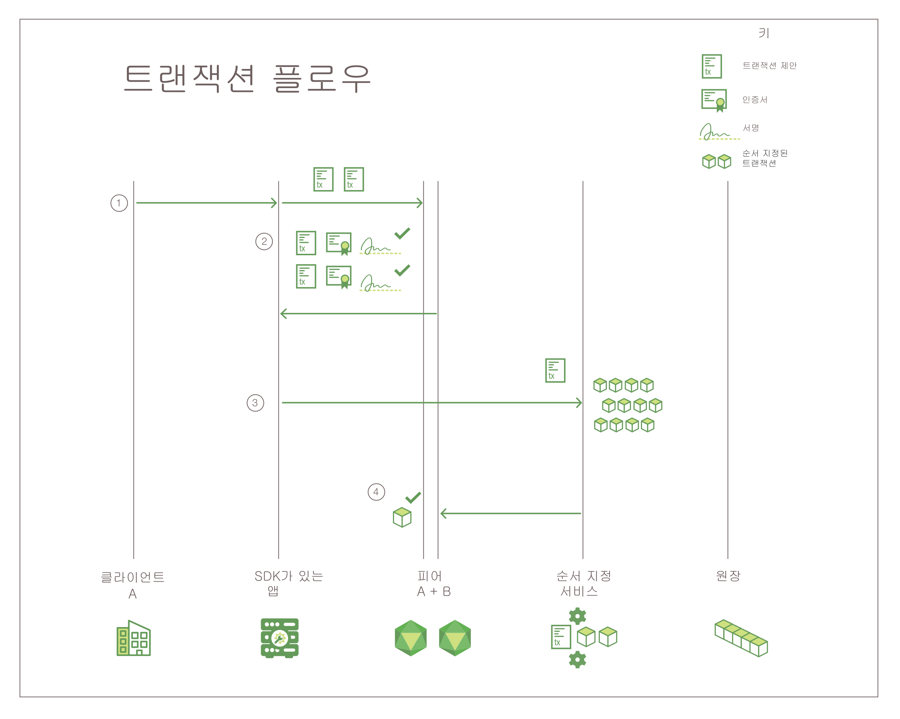

---

copyright:
  years: 2017, 2019
lastupdated: "2019-03-05"

keywords: Hyperledger Fabric, confidential channels, Membership Service Provider, Linux Foundation, SDKs, modular architecture, permissioned network

subcollection: blockchain

---

{:new_window: target="_blank"}
{:shortdesc: .shortdesc}
{:codeblock: .codeblock}
{:screen: .screen}
{:pre: .pre}

# Hyperledger Fabric
{: #hyperledger-fabric}

{{site.data.keyword.blockchainfull}} 네트워크는 Linux Foundation의 Hyperledger Project 내 블록체인 프로젝트 중 하나인 Hyperledger Fabric 스택에 빌드됩니다. 모든 사용자 및 컴포넌트에 알려진 ID가 있는 "권한 부여된" 네트워크입니다. 서명/확인 로직이 모든 통신 터치포인트마다 구현되어 있으며, 트랜잭션이 일련의 보증 및 유효성 검증 검사를 통해 승인되었습니다. 이런 의미에서 익명성을 승격하고 트랜잭션의 유효성을 검증하기 위해 암호화된 화폐 및 과도한 컴퓨팅 의무에 의존하도록 되어 있는 기존 블록체인 구현과 크게 다릅니다.
{:shortdesc}

Hyperledger Fabric은 확장성 및 성능을 확장하기 위해 모듈식 아키텍처를 제공합니다. 이 주제에서는 Hyperledger Fabric의 일부 주요 컴포넌트를 소개합니다. Hyperledger Fabric에 대한 전체 소개는 [Hyperledger Fabric 문서 ](https://hyperledger-fabric.readthedocs.io/en/release-1.4/){:new_window}를 참조하십시오.

## 피어
{: #hyperledger-fabric-peer}

실제 레벨에서 블록체인 네트워크는 주로 피어 노드로(또는 피어 노드로만) 구성됩니다. 피어는 원장 및 스마트 계약(["체인코드" ](https://hyperledger-fabric.readthedocs.io/en/release-1.4/developapps/chaincodenamespace.html "체인코드 네임스페이스")에 포함됨)을 호스팅함에 따라 네트워크의 기본 요소가 됩니다. 좀 더 정확하게 피어는 원장의 **인스턴스**를 호스팅하고 스마트 계약의 **인스턴스**를 호스팅합니다. 스마트 계약 및 원장이 네트워크에서 공유된 프로세스와 공유된 정보를 각각 캡슐화하는 데 사용되므로 이러한 피어의 측면은 Fabric 네트워크에서 실제로 수행하는 항목을 이해하는 데 적합한 시작점이 되도록 합니다.

특히 피어에 대해 자세히 알아보려면 Fabric 커뮤니티 문서에서 [this document focusing just on peers](https://hyperledger-fabric.readthedocs.io/en/release-1.4/peers/peers.html)를 참조하십시오.

## 인증 기관(Certificate Authority)
{: #hyperledger-fabric-certificate-authority}

**권한 부여된** 블록체인 네트워크용 플랫폼으로서 Hyperledger Fabric에는 모든 구성원 조직 및 해당 사용자의 네트워크 ID를 관리하기 위한 모듈식 **Certificate Authority(CA)** 컴포넌트가 포함되어 있습니다. 모든 사용자에 대한 권한 부여된 ID의 요구사항은 네트워크 활동을 통해 ACL 기반 제어를 사용 가능하게 하며, 모든 트랜잭션이 결국 등록된 사용자에게 추적 가능함을 보장합니다.
* CA는 루트 인증서(**rootCert**)를 네트워크에 가입하도록 권한 부여된 각 **구성원**(조직 또는 개인)에게 발행합니다.
* CA는 등록접수 인증서(**eCert**)를 각 구성원 컴포넌트, 서버 측 애플리케이션 및 때때로 사용자에게 발행합니다.
* 각 등록접수된 사용자는 트랜잭션 인증서(**tCerts**)의 할당이 허용됩니다. 각 **tCert**는 하나의 네트워크 트랜잭션 권한을 부여합니다.

네트워크 멤버십을 통한 이 인증 기반 제어 및 조치는 구성원들이 특정 사용자 ID별로 개인용 및 기밀 채널, 애플리케이션 및 데이터에 대한 액세스를 제한할 수 있도록 합니다.

Hyperledger Fabric Certificate Authority(CA) 컴포넌트에 대한 자세한 정보는 [Fabric CA User’s Guide ](https://hyperledger-fabric-ca.readthedocs.io/en/release-1.4/){:new_window}를 참조하십시오.

## 멤버십 서비스 제공자(Membership Service Provider)
{: #hyperledger-fabric-membership-service-provider}

Hyperledger Fabric에는 인증서 발행과 유효성 검증 및 사용자 인증 이면의 모든 암호화 메커니즘 및 프로토콜의 추상 개념을 제공하기 위한 **Membership Service Provider(MSP)** 컴포넌트가 포함되어 있습니다. MSP는 각 채널 피어에 설치되어 피어에 발행된 트랜잭션 요청이 인증되고 권한이 부여된 사용자 ID에서 시작하는지 확인합니다.

Hyperledger Fabric Membership Services Provider(MSP) 컴포넌트에 대한 자세한 정보는 [Hyperledger Fabric 문서 ](https://hyperledger-fabric.readthedocs.io/en/release-1.4/){:new_window}에서 [ 멤버십 ](https://hyperledger-fabric.readthedocs.io/en/release-1.4/membership/membership.html){:new_window}을 참조하십시오.

## 순서 지정 서비스
{: #hyperledger-fabric-ordering-service}

이더리움이나 비트코인 등의 기타 분산 블록체인과 달리 트랜잭션 순서를 지정하고 피어로 전송하는 중앙 권한이 없습니다. {{site.data.keyword.blockchainfull_notm}} Platform의
기반이 되는 블록체인인 Hyperledger Fabric은 다르게 작동합니다. 즉, **순서 지정자**라는 노드 기능을 사용합니다.

순서 지정자는 몇 가지 핵심 기능을 수행하므로 네트워크에서 핵심 컴포넌트입니다.

- 순서 지정자는 문자 그대로 원장에 작성되기 위해 피어에 전송되는 트랜잭션 블록의 **순서를 지정**하며 이 프로세스를
"순서 지정(ordering)"이라고 합니다. 이러한 트랜잭션이
피어 자체에서 번들화되고 순서 지정되면 한 피어가 원장에 트랜잭션을 작성하는 반면
다른 피어는 작성하지 않아 상태 분기를 작성할 가능성이 높아집니다.
- 순서 지정자는 채널을 작성하도록 허용되는 피어 조직 목록인 **컨소시엄**이
상주하는 장소인 **순서 지정자 시스템 채널**을 유지보수합니다.
- 중요한 ID 유효성 검증 확인을 수행합니다. 예를 들어, 조직이
순서 지정자 컨소시엄의 구성원이 아닌 상태에서 채널을 작성하려고 시도하면 요청이
거부됩니다. 또한 순서 지정자가 채널 구성 변경에 대한 권한과 같이 트랜잭션 채널 내의 동작의 유효성을
검증합니다.

Hyperledger Fabric은 현재 SOLO(하나의 순서 지정 노드) 및 Kafka 기반의 순서 지정 서비스 구현을 둘 다 지원합니다. Hyperledger Fabric 순서 지정 서비스에 대한 자세한 정보는 [Hyperledger Fabric 문서 ](https://hyperledger-fabric.readthedocs.io/en/release-1.4/){:new_window}에서 [Bringing up a Kafka-based Ordering Service ](https://hyperledger-fabric.readthedocs.io/en/release-1.4/kafka.html){:new_window}를 참조하십시오.

## Fabric SDK
{: #hyperledger-fabric-fabric-sdks}

애플리케이션 개발자는 Hyperledger Fabric SDK를 사용하여 블록체인 네트워크와 상호작용하는 애플리케이션을 빌드할 수 있습니다. 이러한
SDK는 애플리케이션이 채널 및 체인코드의 라이프사이클 관리를 쉽게 하도록 하는 데 도움이 됩니다.

Hyperledger Fabric은 Node.js SDK 및 Java SDK를 둘 다 전달하고, 블록체인 네트워크와 상호작용하기 위한 다음 기능을 제공합니다.

* 사용자 등록 및 등록접수
* 채널 작성
* 피어를 채널에 가입
* 시스템 채널 또는 애플리케이션 채널 구성 업데이트
* 피어에 체인코드 설치
* 채널에서 체인코드 인스턴스화
* 채널에서 체인코드 업그레이드
* 체인코드 함수를 호출하여 원장 업데이트
* 특정 트랜잭션, 블록 또는 키에 대한 원장 조회
* 채널에서 이벤트 모니터(예: 트랜잭션의 커미트 성공)

Fabric SDK에 대한 자세한 정보는 [Hyperledger Fabric 문서 ](https://hyperledger-fabric.readthedocs.io/en/release-1.4/){:new_window}에서 [Hyperledger Fabric SDK](https://hyperledger-fabric.readthedocs.io/en/release-1.4/fabric-sdks.html){:new_window}를 참조하십시오.

## 트랜잭션 플로우
{: #hyperledger-fabric-transaction-flow}

데이터 일관성 및 무결성을 확보하기 위해 Hyperledger Fabric은 클라이언트 인증, 보증, 순서 지정 및 원장에 대한 커미트를 포함하는 트랜잭션 플로우를 통해 다중 체크포인트를 구현합니다.

**그림 1**은 Hyperledger Fabric 블록체인 네트워크의 트랜잭션 플로우를 보여줍니다.

*그림 1. Hyperledger Fabric 네트워크의 트랜잭션 플로우*

Hyperledger Fabric 네트워크에서는 조회 및 트랜잭션을 위한 데이터의 플로우가 채널의 피어에 트랜잭션 요청을 제출하여 클라이언트 측 애플리케이션에서 시작됩니다. 네트워크에서 데이터의 초기 플로우는 조회 및 트랜잭션 모두에 공통입니다.

1. SDK에서 사용 가능한 API를 사용하여 클라이언트 애플리케이션은 트랜잭션 제안을 지정된 채널에서 적합한 보증 피어에 서명하고 제출합니다. 이 초기 트랜잭션 제안은 보증을 위한 **요청**입니다.
2. 채널의 각 피어는 제출하는 클라이언트의 ID 및 권한을 확인하고, (유효한 경우)제공된 입력에 대해 지정된 체인코드를 실행합니다. 트랜잭션 결과 및 호출된 체인코드의 보증 정책을 기반으로 각 피어는 서명된 예(YES) 또는 아니오(NO) 응답을 애플리케이션에 리턴합니다. 각 서명된 예(YES) 응답이 트랜잭션의 **보증**입니다.

	트랜잭션 플로우의 이 지점에서 프로세스는 조회 및 트랜잭션을 위해 분기합니다. 제안이 체인코드에서 조회 함수를 호출하면 애플리케이션은 클라이언트에 데이터를 리턴합니다. 제안이 체인코드에서 원장을 업데이트하기 위해 함수를 호출하면 애플리케이션은 다음 단계를 계속합니다.
3. 애플리케이션은 읽기/쓰기 세트 및 보증을 포함하는 트랜잭션을 **순서 지정 서비스**로 전달합니다.
4. 그런 다음 트랜잭션이 순서 지정 서비스로 릴레이됩니다. 모든 채널 피어는 체인코드 특정 유효성 검증 정책을 적용하고 동시성 제어 버전 검사를 실행하여 블록에서 각 트랜잭션의 유효성을 검증합니다.
	* 유효성 검증 프로세스에 실패하는 트랜잭션은 블록에서 올바르지 않음으로 표시되며, 블록이 채널의 원장에 추가됩니다.
	* 유효한 모든 트랜잭션은 수정된 키/값 쌍에 따라 상태 데이터베이스를 업데이트합니다.

**gossip 데이터 분배 프로토콜**은 피어 사이에서 동기화된 원장을 확인하기 위해 채널에서 원장 데이터를 지속적으로 브로드캐스트합니다. 자세한 정보는 [Hyperledger Fabric 문서 ](https://hyperledger-fabric.readthedocs.io/en/release-1.4/){:new_window}에서
[Gossip data dissemination protocol ](https://hyperledger-fabric.readthedocs.io/en/release-1.4/gossip.html){:new_window}을 참조하십시오.

트랜잭션 플로우에 대한 단계별 소개는 [Hyperledger Fabric 문서 ](https://hyperledger-fabric.readthedocs.io/en/release-1.4/){:new_window}에서 [Transaction Flow ](https://hyperledger-fabric.readthedocs.io/en/release-1.4/txflow.html){:new_window}를 참조하십시오.
